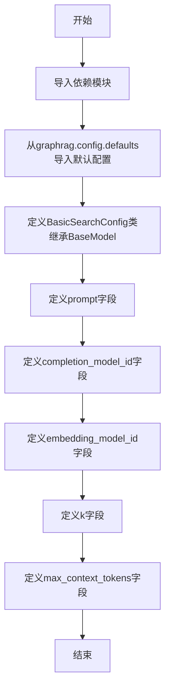

# `graphrag\packages\graphrag\graphrag\config\models\basic_search_config.py` 详细设计文档

该文件定义了一个Pydantic配置模型BasicSearchConfig，用于参数化默认的基本搜索配置，包括搜索提示词、完成模型ID、嵌入模型ID、搜索上下文文本单元数量和最大token数等参数。

## 整体流程



## 类结构

```
BasicSearchConfig (Pydantic配置模型)
└── 继承自 BaseModel
```

## 全局变量及字段


### `graphrag_config_defaults`
    
从graphrag.config.defaults导入的默认配置对象，提供GraphRAG的默认配置参数

类型：`Module`
    


### `BasicSearchConfig.prompt`
    
搜索提示词，用于基础搜索的提示模板

类型：`str | None`
    


### `BasicSearchConfig.completion_model_id`
    
完成模型ID，指定用于基础搜索的LLM模型标识符

类型：`str`
    


### `BasicSearchConfig.embedding_model_id`
    
嵌入模型ID，指定用于文本向量化的嵌入模型标识符

类型：`str`
    


### `BasicSearchConfig.k`
    
搜索上下文包含的文本单元数量，指定返回的文本块数量

类型：`int`
    


### `BasicSearchConfig.max_context_tokens`
    
最大token数，限制搜索上下文的token数量上限

类型：`int`
    
    

## 全局函数及方法


## 关键组件


### BasicSearchConfig 类

Pydantic BaseModel 配置类，用于定义基本搜索（Basic Search）的参数化设置，包括提示词、模型ID、搜索上下文数量和最大token数等核心配置项。

### prompt 字段

字符串类型配置项，用于设置基本搜索的提示词模板，默认值为 `graphrag_config_defaults.basic_search.prompt`。

### completion_model_id 字段

字符串类型配置项，用于指定用于基本搜索的LLM模型ID，默认值为 `graphrag_config_defaults.basic_search.completion_model_id`。

### embedding_model_id 字段

字符串类型配置项，用于指定文本嵌入模型的ID，默认值为 `graphrag_config_defaults.basic_search.embedding_model_id`。

### k 字段

整数类型配置项，用于指定搜索上下文中包含的文本单元数量，默认值为 `graphrag_config_defaults.basic_search.k`。

### max_context_tokens 字段

整数类型配置项，用于设置最大上下文token数，默认值为 `graphrag_config_defaults.basic_search.max_context_tokens`。

### graphrag_config_defaults 依赖

从 `graphrag.config.defaults` 模块导入的默认配置对象，用于提供各配置项的默认值，实现配置的回退机制。


## 问题及建议


### 已知问题

-   **文档字符串错误**：类的文档字符串描述为"The default configuration section for Cache."，但类名是`BasicSearchConfig`，存在明显不一致
-   **默认值依赖风险**：所有字段默认值都依赖`graphrag_config_defaults.basic_search`对象，如果该对象不存在或结构变化，将在模块导入时失败，缺乏显式的错误处理
-   **缺少值域验证**：字段`k`和`max_context_tokens`没有约束条件，无法防止负值或零值等非法输入
-   **类型约束不足**：没有对字符串字段（如`completion_model_id`、`embedding_model_id`）进行格式验证，可能导致运行时配置错误
-   **可选字段处理不一致**：`prompt`字段定义为`str | None`，但默认值来自配置对象，这种模式可能导致配置覆盖逻辑复杂化

### 优化建议

-   修正文档字符串，将其改为与类名一致的描述，如"The default configuration section for Basic Search."
-   在模块级别添加try-except或延迟导入，以提供更清晰的错误信息
-   使用Pydantic的`Field`验证器添加约束，例如`gt=0`确保`k`和`max_context_tokens`为正整数
-   考虑添加`validator`装饰器对模型ID格式进行正则验证
-   统一可选字段的处理方式，如果`prompt`允许为None，应在文档中明确说明None值的处理逻辑
-   考虑添加`model_config`配置类，设置`extra="forbid"`以防止意外字段注入

## 其它


### 设计目标与约束

- **目标**：提供 BasicSearchConfig 配置类，用于参数化默认配置，支持 Basic Search 功能的模型选择、提示词配置、上下文token数量等关键参数的定义
- **约束**：必须继承 Pydantic 的 BaseModel，依赖 graphrag_config_defaults 模块获取默认值，所有字段必须有描述信息

### 错误处理与异常设计

- 使用 Pydantic 内置的类型验证和默认值处理机制
- 当传入无效类型时，Pydantic 会抛出 ValidationError
- 配置值必须符合 Pydantic 字段类型约束（如 k 必须为 int，prompt 必须为 str 或 None）

### 外部依赖与接口契约

- 依赖 `pydantic` 库（BaseModel, Field）
- 依赖 `graphrag.config.defaults` 模块（graphrag_config_defaults 对象）
- 返回类型为 Pydantic BaseModel 实例，支持 `.model_dump()` 和 `.model_json_schema()` 等方法

### 配置验证规则

- `prompt`：字符串类型或 None
- `completion_model_id`：字符串类型，必填
- `embedding_model_id`：字符串类型，必填
- `k`：整数类型，默认值由配置决定
- `max_context_tokens`：整数类型，默认值由配置决定

### 序列化与反序列化

- 支持 JSON 序列化（通过 model_dump 和 model_json_schema）
- 支持从字典或 JSON 加载配置（通过 model_validate 或 parse_obj）
- 字段描述信息可通过 model_json_schema() 导出为 JSON Schema

### 兼容性考虑

- 使用 Pydantic v2 语法（Field 而不是 Field 的旧用法）
- 依赖于 graphrag_config_defaults 对象的内部结构，需确保版本兼容性

### 使用示例

```python
# 创建默认配置
config = BasicSearchConfig()

# 自定义配置
config = BasicSearchConfig(
    prompt="Custom prompt",
    completion_model_id="gpt-4",
    embedding_model_id="text-embedding-ada-002",
    k=10,
    max_context_tokens=2000
)

# 序列化为字典
config_dict = config.model_dump()

# 从字典加载
config = BasicSearchConfig.model_validate(config_dict)
```


    