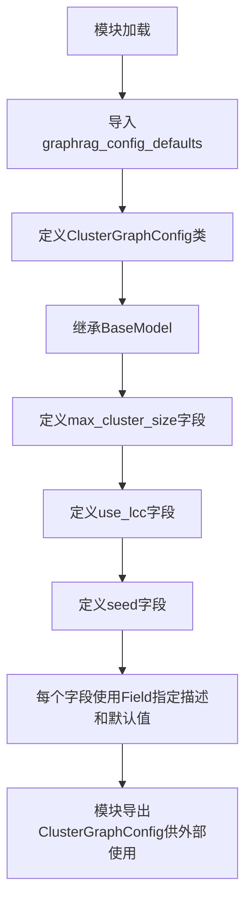

# `graphrag\packages\graphrag\graphrag\config\models\cluster_graph_config.py` 详细设计文档

一个用于配置聚类图（Cluster Graph）参数的Pydantic模型类，提供了最大聚类大小、是否使用最大连通分量以及随机种子等配置选项，用于控制图聚类算法的行为。

## 整体流程



## 类结构

```
BaseModel (Pydantic基类)
└── ClusterGraphConfig (聚类图配置类)
```

## 全局变量及字段


### `graphrag_config_defaults`
    
从graphrag.config.defaults导入的默认配置对象，提供聚类图配置的默认值

类型：`Module`
    


### `ClusterGraphConfig.max_cluster_size`
    
最大聚类大小

类型：`int`
    


### `ClusterGraphConfig.use_lcc`
    
是否使用最大连通分量

类型：`bool`
    


### `ClusterGraphConfig.seed`
    
随机种子

类型：`int`
    
    

## 全局函数及方法


## 关键组件


### ClusterGraphConfig

用于配置聚类图（Cluster Graph）参数设置的 Pydantic 模型类，继承自 BaseModel，提供了最大聚类大小、是否使用最大连通分量以及随机种子的配置功能。

### max_cluster_size

整数字段，表示聚类的最大尺寸。通过 Pydantic Field 定义，默认值从 graphrag_config_defaults 读取。

### use_lcc

布尔字段，表示是否使用最大连通组件（largest connected component）。通过 Pydantic Field 定义，默认值从 graphrag_config_defaults 读取。

### seed

整数字段，表示聚类算法使用的随机种子。通过 Pydantic Field 定义，默认值从 graphrag_config_defaults 读取。

### graphrag_config_defaults

从 graphrag.config.defaults 模块导入的默认配置对象，提供各配置项的默认值。


## 问题及建议


### 已知问题

- **缺乏字段值验证**：max_cluster_size 和 seed 字段没有添加数值范围验证（如必须大于0），可能导致无效配置被接受
- **默认值依赖隐耦合**：直接依赖 `graphrag_config_defaults.cluster_graph.xxx` 的嵌套属性访问，如果默认值模块结构变化会导致运行时错误，缺乏防御性编程
- **文档不完整**：类级别文档仅包含简单描述，缺少使用场景、与其他配置项的关系说明
- **类型注解不够精确**：seed 字段类型为 int，但未说明有效范围（如是否为非负整数）

### 优化建议

- 添加 Pydantic 验证器装饰器，对 max_cluster_size 设置最小值为 1，对 seed 设置合理范围（如 0-2^31-1）
- 在类 docstring 中增加详细说明，包括各字段的业务含义、推荐值范围、以及 use_lcc 和 max_cluster_size 之间的约束关系
- 考虑将默认值访问改为可选链式调用或添加 try-except 保护，提供 fallback 默认值以增强健壮性
- 为每个字段添加更多示例值在 description 中，帮助使用者理解配置效果

## 其它


### 设计目标与约束

本配置类旨在为图聚类功能提供可定制化的参数化设置，支持最大聚类大小控制、连通分量使用策略及随机种子配置。约束条件包括：max_cluster_size必须为正整数，seed必须为非负整数，use_lcc为布尔类型且默认启用最大连通分量。

### 错误处理与异常设计

配置验证由Pydantic的BaseModel自动处理，当传入参数类型不匹配或值超出有效范围时，将抛出ValidationError。默认值从graphrag_config_defaults加载，若默认值不存在或类型错误，可能导致初始化异常。

### 外部依赖与接口契约

依赖pydantic.BaseModel和pydantic.Field进行配置建模，依赖graphrag.config.defaults模块获取默认值。接口契约：所有字段均为可选（具有默认值），外部代码可通过ClusterGraphConfig实例访问配置属性，返回类型为Python原生类型或Pydantic类型。

### 配置管理策略

采用Pydantic配置模式，支持环境变量覆盖和YAML/JSON配置文件加载。配置值具有层次化默认值机制，优先使用传入值，其次使用graphrag_config_defaults中的定义。

### 版本兼容性

当前版本适用于graphrag项目，需与pydantic v2.x兼容。配置类使用Field进行字段定义，符合Pydantic v2规范。

### 性能考虑

配置类为轻量级数据对象，不涉及计算密集型操作。实例化性能取决于Pydantic模型解析速度，通常可忽略不计。

### 安全考虑

配置参数不涉及敏感信息存储，seed和max_cluster_size为公开配置项。需确保graphrag_config_defaults来源可信，避免供应链攻击。

### 测试策略

应包含单元测试验证字段类型验证、默认值加载、配置序列化与反序列化。边界条件测试：max_cluster_size为0或负数、seed为负数等场景。

### 使用示例

```python
# 使用默认配置
config = ClusterGraphConfig()

# 自定义配置
config = ClusterGraphConfig(
    max_cluster_size=100,
    use_lcc=True,
    seed=42
)
```

### 已知限制

当前仅支持三个聚类相关参数，缺乏更细粒度的聚类算法选择（如K-means、DBSCAN等）。配置类未定义嵌套结构，无法直接支持更复杂的层级配置需求。


    