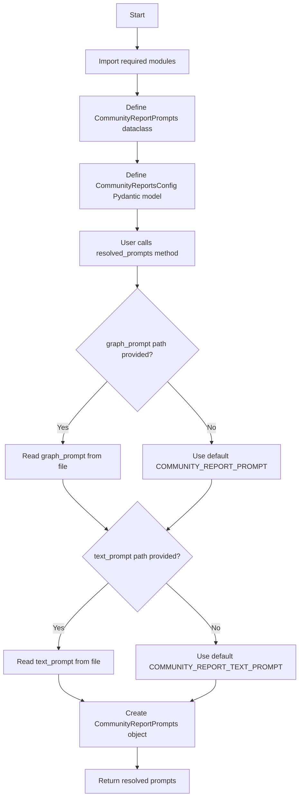
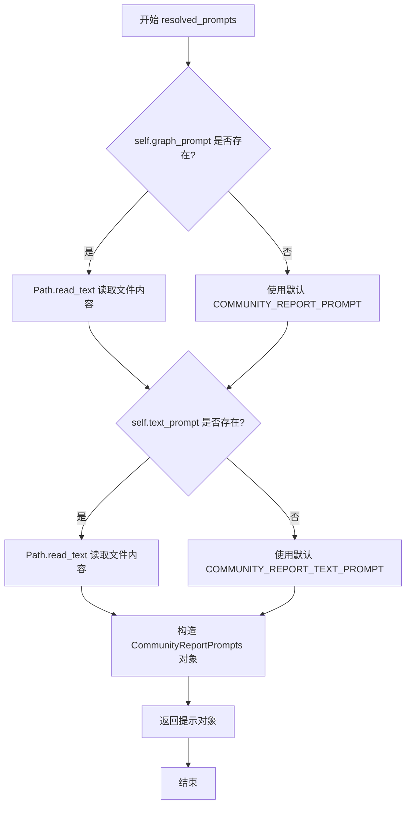

# `graphrag\packages\graphrag\graphrag\config\models\community_reports_config.py` 详细设计文档

This module defines configuration classes for community reports in the graphRAG system, providing model settings, prompt template management, and token limit configurations with support for custom prompt files or default templates.

## 整体流程



## 类结构

```
CommunityReportPrompts (dataclass)
└── CommunityReportsConfig (Pydantic BaseModel)
```

## 全局变量及字段


### `COMMUNITY_REPORT_PROMPT`
    
Default community report extraction prompt for graph-based summarization

类型：`str`
    


### `COMMUNITY_REPORT_TEXT_PROMPT`
    
Default community report extraction prompt for text-based summarization

类型：`str`
    


### `graphrag_config_defaults`
    
Default configuration values for graphrag

类型：`module`
    


### `Path`
    
Path class from pathlib for file operations

类型：`class`
    


### `BaseModel`
    
Pydantic BaseModel for configuration validation

类型：`class`
    


### `Field`
    
Pydantic Field for defining model fields with metadata

类型：`function`
    


### `dataclass`
    
Python dataclass decorator

类型：`decorator`
    


### `CommunityReportPrompts.graph_prompt`
    
The community report extraction prompt for graph-based summarization

类型：`str`
    


### `CommunityReportPrompts.text_prompt`
    
The community report extraction prompt for text-based summarization

类型：`str`
    


### `CommunityReportsConfig.completion_model_id`
    
The model ID to use for community reports

类型：`str`
    


### `CommunityReportsConfig.model_instance_name`
    
The model singleton instance name for cache storage partitioning

类型：`str`
    


### `CommunityReportsConfig.graph_prompt`
    
The community report extraction prompt for graph-based summarization

类型：`str | None`
    


### `CommunityReportsConfig.text_prompt`
    
The community report extraction prompt for text-based summarization

类型：`str | None`
    


### `CommunityReportsConfig.max_length`
    
The community report maximum length in tokens

类型：`int`
    


### `CommunityReportsConfig.max_input_length`
    
The maximum input length in tokens when generating reports

类型：`int`
    


### `CommunityReportsConfig.resolved_prompts`
    
Get the resolved community report extraction prompts, reading from files if paths provided or using defaults

类型：`method`
    
    

## 全局函数及方法


### `CommunityReportsConfig.resolved_prompts`

获取解析后的社区报告提取提示。如果提供了文件路径则从文件读取内容，否则使用内置的默认提示模板。

参数：

- （无参数）

返回值：`CommunityReportPrompts`，包含 graph_prompt 和 text_prompt 两个提示模板字符串的社区报告提示对象

#### 流程图



#### 带注释源码

```python
def resolved_prompts(self) -> CommunityReportPrompts:
    """Get the resolved community report extraction prompts.
    
    根据配置决定提示的来源：
    - 如果 graph_prompt/text_prompt 有具体路径，则从文件读取
    - 如果为 None，则使用内置的默认提示模板
    
    Returns:
        CommunityReportPrompts: 包含 graph_prompt 和 text_prompt 的提示对象
    """
    # 处理 graph_prompt：判断是否有自定义路径
    # - 若 self.graph_prompt 存在（非 None），则读取文件内容
    # - 否则使用默认的 COMMUNITY_REPORT_PROMPT
    graph_prompt = Path(self.graph_prompt).read_text(encoding="utf-8") \
        if self.graph_prompt \
        else COMMUNITY_REPORT_PROMPT
    
    # 处理 text_prompt：判断是否有自定义路径
    # - 若 self.text_prompt 存在（非 None），则读取文件内容
    # - 否则使用默认的 COMMUNITY_REPORT_TEXT_PROMPT
    text_prompt = Path(self.text_prompt).read_text(encoding="utf-8") \
        if self.text_prompt \
        else COMMUNITY_REPORT_TEXT_PROMPT
    
    # 构造并返回提示对象，包含两种类型的社区报告提示模板
    return CommunityReportPrompts(
        graph_prompt=graph_prompt,
        text_prompt=text_prompt,
    )
```

## 关键组件


### CommunityReportPrompts

一个数据类，用于存储解析后的社区报告提示模板，包含 graph_prompt 和 text_prompt 两个字符串字段，分别对应基于图和基于文本的社区报告提取提示。

### CommunityReportsConfig

Pydantic 配置模型类，定义了社区报告生成的各项配置参数，包括模型ID、实例名称、提示模板路径、最大长度等，并提供 resolved_prompts 方法动态解析提示模板内容。

### resolved_prompts 方法

负责解析并返回社区报告提示模板的方法，支持从文件路径读取或使用内置默认提示，返回 CommunityReportPrompts 对象。

### 字段验证与默认值管理

使用 Pydantic Field 进行配置字段的描述和默认值设置，通过 graphrag_config_defaults 引用全局默认配置，实现配置的集中管理和灵活覆盖。


## 问题及建议


### 已知问题

- **文件读取未验证**：在 `resolved_prompts()` 方法中，直接使用 `Path(...).read_text()` 读取文件，没有先检查文件是否存在，若路径无效或文件不存在会抛出异常
- **缺少输入验证**：配置字段（如 `max_length`、`max_input_length`）没有添加 Pydantic 验证器，无法确保值在合理范围内（如 `max_length > 0`、`max_input_length >= max_length`）
- **双重数据类设计**：代码同时使用了 `@dataclass`（CommunityReportPrompts）和 Pydantic `BaseModel`（CommunityReportsConfig），增加了代码理解成本和维护复杂性
- **默认值依赖外部模块**：所有字段默认值都依赖 `graphrag_config_defaults` 模块，增加了模块间的耦合度，若默认值变更可能影响多个地方
- **可选路径未处理空字符串**：字段类型为 `str | None`，但空字符串 `""` 会进入 `if self.graph_prompt` 分支，导致 `Path("").read_text()` 可能产生意外行为

### 优化建议

- **添加文件存在性检查**：在 `resolved_prompts()` 中捕获 `FileNotFoundError` 或在读取前用 `Path.is_file()` 验证，或提供友好的错误信息
- **使用 Pydantic 验证器**：为 `max_length`、`max_input_length` 添加 `gt=0` 约束，或在 `model_validator` 中验证 `max_input_length >= max_length`
- **统一数据类风格**：考虑将 `CommunityReportPrompts` 也改为 Pydantic 模型，或使用纯 dataclass 配合配置文件
- **默认值解耦**：考虑将默认值内联或使用 `Field(default_factory)` 模式，减少对 `graphrag_config_defaults` 的隐式依赖
- **处理边界输入**：显式检查 `self.graph_prompt` 是否为非空字符串（如 `if self.graph_prompt and self.graph_prompt.strip()`），避免空字符串导致的问题

## 其它


### 设计目标与约束

该配置类旨在为GraphRAG的社区报告生成模块提供灵活的配置管理能力，支持自定义模型、提示词模板和token限制。约束包括：模型ID必须对应有效的语言模型实例，提示词文件必须存在且为UTF-8编码，max_length和max_input_length必须为正整数。

### 错误处理与异常设计

- 文件读取异常：当指定的提示词文件路径不存在或无法读取时，Python的`FileNotFoundError`异常将直接抛出
- 路径类型错误：`resolved_prompts()`方法未对`self.graph_prompt`和`self.text_prompt`进行非空校验就直接使用，若为非字符串类型（如空字符串""）会导致类型错误
- 默认值依赖：依赖于`graphrag_config_defaults`模块提供默认值，若该模块缺失会导致导入错误

### 外部依赖与接口契约

- **pydantic.BaseModel**：用于配置验证和类型提示，提供自动序列化/反序列化能力
- **pathlib.Path**：用于文件系统路径操作和文件读取
- **graphrag_config_defaults**：提供默认配置值的外部模块，包含`community_reports`属性的访问
- **graphrag.prompts.index.community_report**：提供默认的`COMMUNITY_REPORT_PROMPT`常量
- **graphrag.prompts.index.community_report_text_units**：提供默认的`COMMUNITY_REPORT_TEXT_PROMPT`常量

### 数据流与状态机

数据流：用户配置输入 → Pydantic字段验证 → resolved_prompts()方法调用 → 判断是否需要文件读取 → 返回CommunityReportPrompts对象 → 传递给下游报告生成模块。状态机转换：配置初始化状态 → 验证完成状态 → prompts解析状态 → 就绪状态。

### 配置验证规则

- `completion_model_id`：字符串，必填，默认值来自全局配置
- `model_instance_name`：字符串，用于缓存分区，默认值来自全局配置
- `graph_prompt`：字符串或None，可为文件路径或直接提示词，默认值来自全局配置
- `text_prompt`：字符串或None，语义同graph_prompt
- `max_length`：正整数，默认2000
- `max_input_length`：正整数，默认100000

### 使用示例与调用场景

该配置类通常由GraphRAG索引管道在初始化阶段实例化，通过`resolved_prompts()`获取最终的提示词模板，供社区报告生成器（Community Report Generator）使用。典型调用链：IndexConfig → CommunityReportsConfig → resolved_prompts() → CommunityReportPrompts → ReportGenerationModule。

    