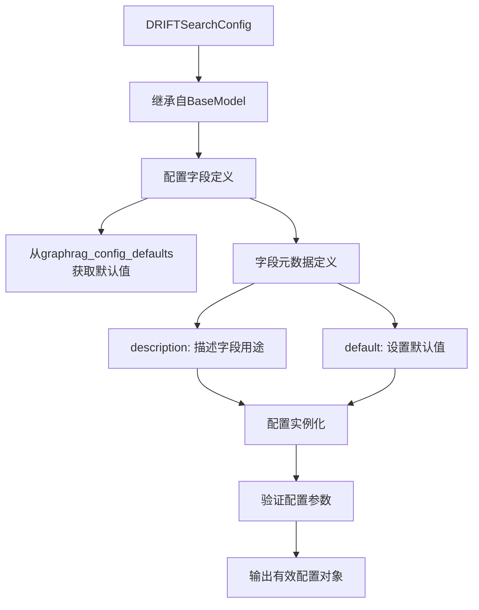
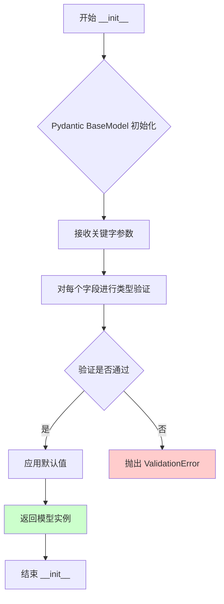
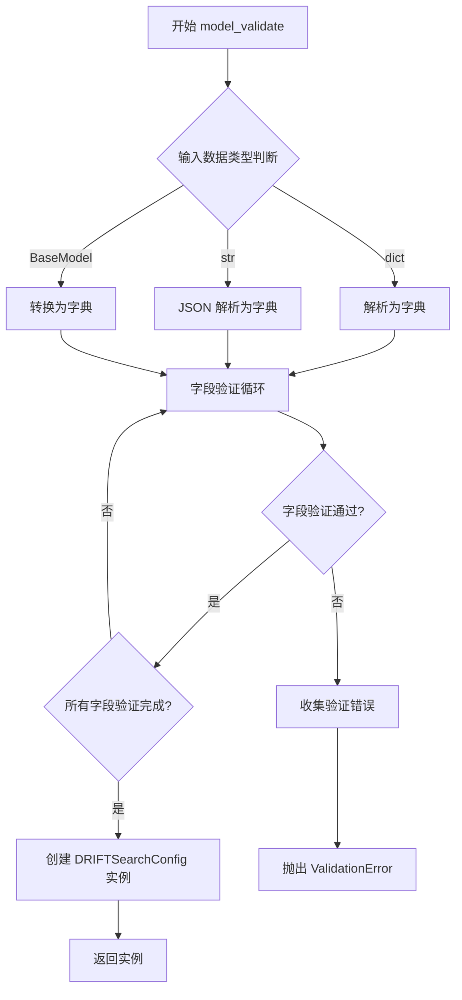
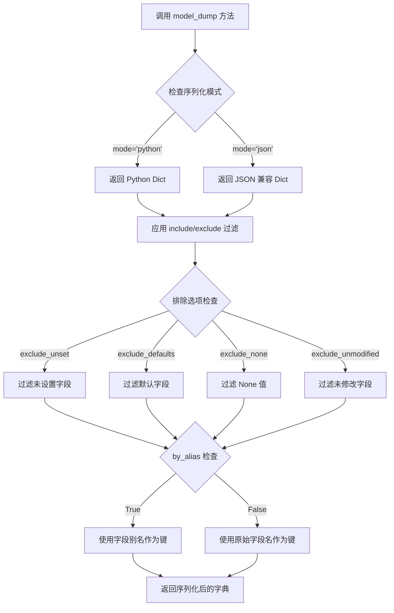
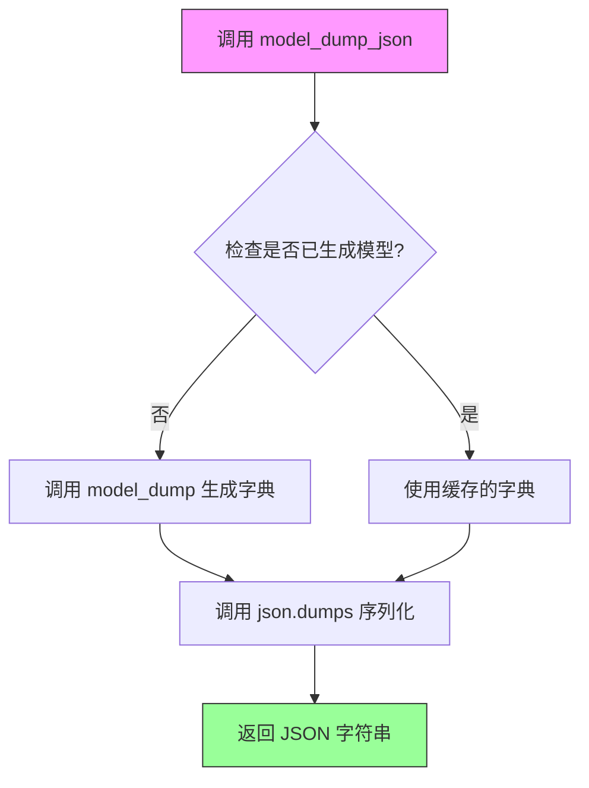
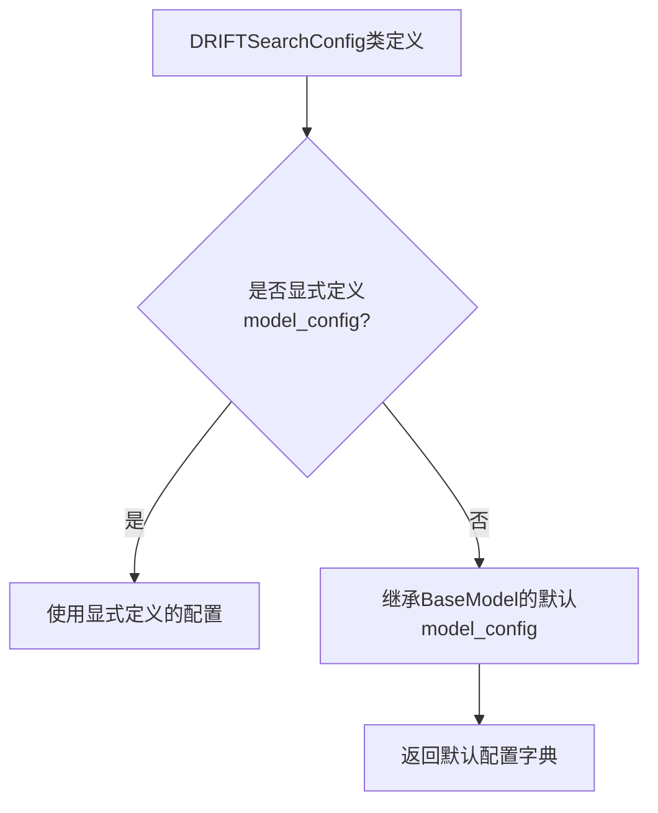

# `graphrag\packages\graphrag\graphrag\config\models\drift_search_config.py` 详细设计文档

这是一个用于配置DRIFT搜索（一种图检索增强生成搜索方法）的Pydantic配置类，定义了搜索提示词、模型参数、令牌限制、并发设置、搜索深度、本地搜索参数等二十余项配置项，用于GraphRAG框架中的漂移搜索功能。

## 整体流程



## 类结构

```
BaseModel (Pydantic 抽象基类)
└── DRIFTSearchConfig (配置类)
```

## 全局变量及字段


### `DRIFTSearchConfig.prompt`
    
The drift search prompt to use.

类型：`str | None`
    


### `DRIFTSearchConfig.reduce_prompt`
    
The drift search reduce prompt to use.

类型：`str | None`
    


### `DRIFTSearchConfig.completion_model_id`
    
The model ID to use for drift search.

类型：`str`
    


### `DRIFTSearchConfig.embedding_model_id`
    
The model ID to use for drift search.

类型：`str`
    


### `DRIFTSearchConfig.data_max_tokens`
    
The data llm maximum tokens.

类型：`int`
    


### `DRIFTSearchConfig.reduce_max_tokens`
    
The reduce llm maximum tokens response to produce.

类型：`int | None`
    


### `DRIFTSearchConfig.reduce_temperature`
    
The temperature to use for token generation in reduce.

类型：`float`
    


### `DRIFTSearchConfig.reduce_max_completion_tokens`
    
The reduce llm maximum tokens response to produce.

类型：`int | None`
    


### `DRIFTSearchConfig.concurrency`
    
The number of concurrent requests.

类型：`int`
    


### `DRIFTSearchConfig.drift_k_followups`
    
The number of top global results to retrieve.

类型：`int`
    


### `DRIFTSearchConfig.primer_folds`
    
The number of folds for search priming.

类型：`int`
    


### `DRIFTSearchConfig.primer_llm_max_tokens`
    
The maximum number of tokens for the LLM in primer.

类型：`int`
    


### `DRIFTSearchConfig.n_depth`
    
The number of drift search steps to take.

类型：`int`
    


### `DRIFTSearchConfig.local_search_text_unit_prop`
    
The proportion of search dedicated to text units.

类型：`float`
    


### `DRIFTSearchConfig.local_search_community_prop`
    
The proportion of search dedicated to community properties.

类型：`float`
    


### `DRIFTSearchConfig.local_search_top_k_mapped_entities`
    
The number of top K entities to map during local search.

类型：`int`
    


### `DRIFTSearchConfig.local_search_top_k_relationships`
    
The number of top K relationships to map during local search.

类型：`int`
    


### `DRIFTSearchConfig.local_search_max_data_tokens`
    
The maximum context size in tokens for local search.

类型：`int`
    


### `DRIFTSearchConfig.local_search_temperature`
    
The temperature to use for token generation in local search.

类型：`float`
    


### `DRIFTSearchConfig.local_search_top_p`
    
The top-p value to use for token generation in local search.

类型：`float`
    


### `DRIFTSearchConfig.local_search_n`
    
The number of completions to generate in local search.

类型：`int`
    


### `DRIFTSearchConfig.local_search_llm_max_gen_tokens`
    
The maximum number of generated tokens for the LLM in local search.

类型：`int | None`
    


### `DRIFTSearchConfig.local_search_llm_max_gen_completion_tokens`
    
The maximum number of generated tokens for the LLM in local search.

类型：`int | None`
    
    

## 全局函数及方法


### DRIFTSearchConfig.__init__

初始化 DRIFTSearchConfig 对象的构造函数，继承自 Pydantic BaseModel，用于配置 DRIFT 搜索的各种参数（如提示词、模型 ID、令牌限制、并发设置等），支持默认值和字段验证。

参数：

-  `prompt`：`str | None`，DRIFT 搜索使用的提示词，默认为 graphrag_config_defaults.drift_search.prompt
-  `reduce_prompt`：`str | None`，DRIFT 搜索缩减提示词，默认为 graphrag_config_defaults.drift_search.reduce_prompt
-  `completion_model_id`：`str`，DRIFT 搜索使用的模型 ID，默认为 graphrag_config_defaults.drift_search.completion_model_id
-  `embedding_model_id`：`str`，DRIFT 搜索使用的嵌入模型 ID，默认为 graphrag_config_defaults.drift_search.embedding_model_id
-  `data_max_tokens`：`int`，数据 LLM 最大令牌数，默认为 graphrag_config_defaults.drift_search.data_max_tokens
-  `reduce_max_tokens`：`int | None`，缩减 LLM 最大响应令牌数，默认为 graphrag_config_defaults.drift_search.reduce_max_tokens
-  `reduce_temperature`：`float`，缩减阶段生成令牌的温度参数，默认为 graphrag_config_defaults.drift_search.reduce_temperature
-  `reduce_max_completion_tokens`：`int | None`，缩减 LLM 最大完成令牌数，默认为 graphrag_config_defaults.drift_search.reduce_max_completion_tokens
-  `concurrency`：`int`，并发请求数量，默认为 graphrag_config_defaults.drift_search.concurrency
-  `drift_k_followups`：`int`，检索的顶级全局结果数量，默认为 graphrag_config_defaults.drift_search.drift_k_followups
-  `primer_folds`：`int`，搜索初始化的折叠数量，默认为 graphrag_config_defaults.drift_search.primer_folds
-  `primer_llm_max_tokens`：`int`，初始阶段 LLM 的最大令牌数，默认为 graphrag_config_defaults.drift_search.primer_llm_max_tokens
-  `n_depth`：`int`，DRIFT 搜索执行的步数，默认为 graphrag_config_defaults.drift_search.n_depth
-  `local_search_text_unit_prop`：`float`，文本单元搜索的比例，默认为 graphrag_config_defaults.drift_search.local_search_text_unit_prop
-  `local_search_community_prop`：`float`，社区属性搜索的比例，默认为 graphrag_config_defaults.drift_search.local_search_community_prop
-  `local_search_top_k_mapped_entities`：`int`，本地搜索中映射的顶级 K 实体数量，默认为 graphrag_config_defaults.drift_search.local_search_top_k_mapped_entities
-  `local_search_top_k_relationships`：`int`，本地搜索中映射的顶级 K 关系数量，默认为 graphrag_config_defaults.drift_search.local_search_top_k_relationships
-  `local_search_max_data_tokens`：`int`，本地搜索的最大上下文大小（令牌），默认为 graphrag_config_defaults.drift_search.local_search_max_data_tokens
-  `local_search_temperature`：`float`，本地搜索生成令牌的温度参数，默认为 graphrag_config_defaults.drift_search.local_search_temperature
-  `local_search_top_p`：`float`，本地搜索生成令牌的 top-p 值，默认为 graphrag_config_defaults.drift_search.local_search_top_p
-  `local_search_n`：`int`，本地搜索生成的补全数量，默认为 graphrag_config_defaults.drift_search.local_search_n
-  `local_search_llm_max_gen_tokens`：`int | None`，本地搜索中 LLM 生成的 最大令牌数，默认为 graphrag_config_defaults.drift_search.local_search_llm_max_gen_tokens
-  `local_search_llm_max_gen_completion_tokens`：`int | None`，本地搜索中 LLM 生成的 最大完成令牌数，默认为 graphrag_config_defaults.drift_search.local_search_llm_max_gen_completion_tokens

返回值：`DRIFTSearchConfig`，返回初始化后的 DRIFTSearchConfig 实例对象

#### 流程图



#### 带注释源码

```python
# Pydantic BaseModel 的 __init__ 方法（简化版核心逻辑）
def __init__(__pydantic_self__, **data: Any) -> None:
    """
    初始化 DRIFTSearchConfig 实例
    
    Args:
        **data: 包含所有配置字段的关键字参数
               - prompt: str | None - DRIFT搜索提示词
               - reduce_prompt: str | None - 缩减阶段提示词
               - completion_model_id: str - 完成模型ID
               - embedding_model_id: str - 嵌入模型ID
               - data_max_tokens: int - 数据最大令牌数
               - reduce_max_tokens: int | None - 缩减最大令牌数
               - reduce_temperature: float - 缩减温度参数
               - reduce_max_completion_tokens: int | None - 缩减最大完成令牌
               - concurrency: int - 并发数
               - drift_k_followups: int - 跟进数量
               - primer_folds: int - 初始折叠数
               - primer_llm_max_tokens: int - 初始LLM最大令牌
               - n_depth: int - 搜索深度
               - local_search_text_unit_prop: float - 文本单元比例
               - local_search_community_prop: float - 社区比例
               - local_search_top_k_mapped_entities: int - 映射实体数
               - local_search_top_k_relationships: int - 映射关系数
               - local_search_max_data_tokens: int - 本地最大令牌
               - local_search_temperature: float - 本地温度
               - local_search_top_p: float - 本地top-p
               - local_search_n: int - 本地生成数
               - local_search_llm_max_gen_tokens: int | None - 本地最大生成令牌
               - local_search_llm_max_gen_completion_tokens: int | None - 本地最大完成令牌
    
    Returns:
        DRIFTSearchConfig: 初始化后的配置对象实例
    """
    # 使用 Pydantic 的 model_construct 跳过验证快速构建
    # 或者使用完整的验证流程 __init__
    super().__init__(**data)
```


### `DRIFTSearchConfig.model_validate`

该方法是继承自 Pydantic 的 `BaseModel` 类，用于验证输入数据（字典、JSON 字符串或其他 BaseModel 实例）并创建 `DRIFTSearchConfig` 类型的验证后实例。如果数据不符合模型定义，将抛出验证错误。

参数：

- `data`：`dict | str | BaseModel`，要验证的数据，可以是字典、JSON 字符串或另一个 Pydantic 模型实例
- `context`：`Any | None`（可选），验证时使用的额外上下文数据
- `model_config`：`dict | type[BaseConfig] | None`（可选），覆盖模型配置的字典或配置类
- `strict`：`bool | None`（可选），是否使用严格模式进行验证
- `from_attributes`：`bool | None`（可选），是否允许从对象属性读取数据
- `arbitrary_types_allowed`：`bool | None`（可选），是否允许任意类型

返回值：`DRIFTSearchConfig`，验证并解析后的模型实例

#### 流程图



#### 带注释源码

```
# 注意：model_validate 方法继承自 Pydantic 的 BaseModel 类
# 并非在此文件中显式定义，此处为 Pydantic 内置方法的标准实现逻辑

class DRIFTSearchConfig(BaseModel):
    """
    DRIFTSearchConfig 继承自 BaseModel
    自动获得 model_validate 类方法用于数据验证
    """
    
    # ... 模型字段定义 ...
    
    # 继承自 BaseModel 的 model_validate 方法签名：
    # @classmethod
    # def model_validate(
    #     cls,
    #     data: dict | str | BaseModel,
    #     *,
    #     context: Any | None = None,
    #     model_config: dict | type[BaseConfig] | None = None,
    #     strict: bool | None = None,
    #     from_attributes: bool | None = None,
    #     arbitrary_types_allowed: bool | None = None
    # ) -> DRIFTSearchConfig:
    #     """
    #     验证数据并返回模型实例
    #     
    #     参数:
    #         data: 输入数据，支持字典、JSON字符串或BaseModel实例
    #         context: 验证上下文
    #         model_config: 临时覆盖模型配置
    #         strict: 严格模式验证
    #         from_attributes: 从对象属性读取
    #         arbitrary_types_allowed: 允许任意类型
    #     
    #     返回:
    #         验证后的 DRIFTSearchConfig 实例
    #     
    #     异常:
    #         ValidationError: 数据验证失败时抛出
    #     """
    #     pass
```

> **注意**：由于 `model_validate` 是 Pydantic BaseModel 的内置方法，未在当前代码文件中显式实现。它通过 Pydantic 框架自动注入到所有继承自 `BaseModel` 的类中。上述流程图和方法签名基于 Pydantic v2 的标准行为展示。


### `DRIFTSearchConfig.model_dump`

`model_dump` 是继承自 Pydantic `BaseModel` 的内置方法，用于将 DRIFTSearchConfig 模型实例序列化为字典格式。该方法支持多种配置选项来控制序列化行为，包括排除字段、包含字段、使用别名等。

参数：

- `mode`：`str`，指定输出模式（'python' 返回 Python 对象，'json' 返回 JSON 兼容格式）
- `exclude`：`Set[str] | Dict[str, Any] | Tuple[str, ...]`，指定要从输出中排除的字段
- `include`：`Set[str] | Dict[str, Any] | Tuple[str, ...]`，指定要包含在输出中的字段
- `exclude_unset`：`bool`，是否排除未显式设置的字段（默认值：False）
- `exclude_defaults`：`bool`，是否排除具有默认值的字段（默认值：False）
- `exclude_none`：`bool`，是否排除值为 None 的字段（默认值：False）
- `exclude_unmodified`：`bool`，是否排除未被修改的字段（默认值：False）
- `by_alias`：`bool`，是否使用字段别名作为键（默认值：False）
- `serialize_as_any`：`bool`，是否将未设置字段序列化为任意类型（默认值：False）

返回值：`Dict[str, Any]`，返回包含模型数据的字典对象

#### 流程图



#### 带注释源码

```python
# 定义 DRIFTSearchConfig 类，继承自 Pydantic 的 BaseModel
# model_dump 方法继承自 BaseModel，用于将模型实例序列化为字典
class DRIFTSearchConfig(BaseModel):
    """The default configuration section for Cache."""

    # 定义 drift search 的提示词字段
    prompt: str | None = Field(
        description="The drift search prompt to use.",
        default=graphrag_config_defaults.drift_search.prompt,
    )
    
    # 定义 drift search 的 reduce 提示词字段
    reduce_prompt: str | None = Field(
        description="The drift search reduce prompt to use.",
        default=graphrag_config_defaults.drift_search.reduce_prompt,
    )
    
    # 定义 drift search 使用的模型 ID
    completion_model_id: str = Field(
        description="The model ID to use for drift search.",
        default=graphrag_config_defaults.drift_search.completion_model_id,
    )
    
    # 定义 drift search 使用的 embedding 模型 ID
    embedding_model_id: str = Field(
        description="The model ID to use for drift search.",
        default=graphrag_config_defaults.drift_search.embedding_model_id,
    )
    
    # 定义数据 LLM 的最大 token 数
    data_max_tokens: int = Field(
        description="The data llm maximum tokens.",
        default=graphrag_config_defaults.drift_search.data_max_tokens,
    )

    # 定义 reduce LLM 的最大 token 数
    reduce_max_tokens: int | None = Field(
        description="The reduce llm maximum tokens response to produce.",
        default=graphrag_config_defaults.drift_search.reduce_max_tokens,
    )

    # 定义 reduce 阶段的温度参数
    reduce_temperature: float = Field(
        description="The temperature to use for token generation in reduce.",
        default=graphrag_config_defaults.drift_search.reduce_temperature,
    )

    # 定义 reduce 阶段的最大 completion tokens
    reduce_max_completion_tokens: int | None = Field(
        description="The reduce llm maximum tokens response to produce.",
        default=graphrag_config_defaults.drift_search.reduce_max_completion_tokens,
    )

    # 定义并发请求数量
    concurrency: int = Field(
        description="The number of concurrent requests.",
        default=graphrag_config_defaults.drift_search.concurrency,
    )

    # 定义 drift follow-ups 的数量
    drift_k_followups: int = Field(
        description="The number of top global results to retrieve.",
        default=graphrag_config_defaults.drift_search.drift_k_followups,
    )

    # 定义搜索 priming 的折叠数
    primer_folds: int = Field(
        description="The number of folds for search priming.",
        default=graphrag_config_defaults.drift_search.primer_folds,
    )

    # 定义 primer 阶段 LLM 的最大 token 数
    primer_llm_max_tokens: int = Field(
        description="The maximum number of tokens for the LLM in primer.",
        default=graphrag_config_defaults.drift_search.primer_llm_max_tokens,
    )

    # 定义 drift search 的深度/步数
    n_depth: int = Field(
        description="The number of drift search steps to take.",
        default=graphrag_config_defaults.drift_search.n_depth,
    )

    # 定义本地搜索中文本单元的比例
    local_search_text_unit_prop: float = Field(
        description="The proportion of search dedicated to text units.",
        default=graphrag_config_defaults.drift_search.local_search_text_unit_prop,
    )

    # 定义本地搜索中社区属性的比例
    local_search_community_prop: float = Field(
        description="The proportion of search dedicated to community properties.",
        default=graphrag_config_defaults.drift_search.local_search_community_prop,
    )

    # 定义本地搜索中映射实体的 top K 数量
    local_search_top_k_mapped_entities: int = Field(
        description="The number of top K entities to map during local search.",
        default=graphrag_config_defaults.drift_search.local_search_top_k_mapped_entities,
    )

    # 定义本地搜索中映射关系的 top K 数量
    local_search_top_k_relationships: int = Field(
        description="The number of top K relationships to map during local search.",
        default=graphrag_config_defaults.drift_search.local_search_top_k_relationships,
    )

    # 定义本地搜索的最大数据 token 数
    local_search_max_data_tokens: int = Field(
        description="The maximum context size in tokens for local search.",
        default=graphrag_config_defaults.drift_search.local_search_max_data_tokens,
    )

    # 定义本地搜索的温度参数
    local_search_temperature: float = Field(
        description="The temperature to use for token generation in local search.",
        default=graphrag_config_defaults.drift_search.local_search_temperature,
    )

    # 定义本地搜索的 top-p 值
    local_search_top_p: float = Field(
        description="The top-p value to use for token generation in local search.",
        default=graphrag_config_defaults.drift_search.local_search_top_p,
    )

    # 定义本地搜索的生成数量
    local_search_n: int = Field(
        description="The number of completions to generate in local search.",
        default=graphrag_config_defaults.drift_search.local_search_n,
    )

    # 定义本地搜索 LLM 的最大生成 token 数
    local_search_llm_max_gen_tokens: int | None = Field(
        description="The maximum number of generated tokens for the LLM in local search.",
        default=graphrag_config_defaults.drift_search.local_search_llm_max_gen_tokens,
    )

    # 定义本地搜索 LLM 的最大生成 completion token 数
    local_search_llm_max_gen_completion_tokens: int | None = Field(
        description="The maximum number of generated tokens for the LLM in local search.",
        default=graphrag_config_defaults.drift_search.local_search_llm_max_gen_completion_tokens,
    )


# 使用示例：
# config = DRIFTSearchConfig()
# config_dict = config.model_dump()  # 转换为字典
# config_json = config.model_dump(mode='json')  # 转换为 JSON 兼容格式
# config_filtered = config.model_dump(exclude={'prompt', 'reduce_prompt'})  # 排除特定字段
```


### `DRIFTSearchConfig.model_dump_json`

该方法是继承自 Pydantic 的 BaseModel 类，用于将 DRIFTSearchConfig 模型实例序列化为 JSON 格式的字符串。

参数：

- `mode`：`str`，指定序列化模式，默认为 'json'
- `indent`：`int | None`，JSON 字符串的缩进级别，默认为 None
- `include`：`IncEx`，指定要包含在输出中的字段，默认为 None
- `exclude`：`IncEx`，指定要从输出中排除的字段，默认为 None
- `context`：`dict[str, Any] | None`，序列化上下文，默认为 None
- `**dumps_kwargs`：传递给 json.dumps 的其他关键字参数

返回值：`str`，返回 JSON 格式的字符串表示

#### 流程图



#### 带注释源码

```python
# 注意：以下是 Pydantic BaseModel 中 model_dump_json 方法的简化版本
# 实际的实现位于 pydantic.main 模块中

def model_dump_json(
    self,
    *,
    mode: str = "json",  # 序列化模式，可选 'json' 或 'python'
    indent: int | None = None,  # JSON 缩进级别
    include: IncEx = None,  # 包含的字段
    exclude: IncEx = None,  # 排除的字段
    context: dict[str, Any] | None = None,  # 序列化上下文
    **dumps_kwargs: Any,  # 传递给 json.dumps 的参数
) -> str:
    """
    将模型实例序列化为 JSON 字符串。
    
    参数:
        mode: 序列化模式。'json' 会返回 JSON 兼容的类型，
              'python' 会返回 Python 对象
        indent: JSON 输出的缩进空格数
        include: 要包含的字段（可以是字段名或字段路径）
        exclude: 要排除的字段
        context: 序列化上下文，用于自定义序列化行为
        **dumps_kwargs: 传递给 json.dumps 的额外参数
    
    返回:
        JSON 格式的字符串
    
    示例:
        >>> from graphrag.config import DRIFTSearchConfig
        >>> config = DRIFTSearchConfig()
        >>> json_str = config.model_dump_json()
        >>> print(json_str)
    """
    # 1. 调用 model_dump 获取字典表示
    # mode='json' 确保返回 JSON 兼容的类型（如 list, dict, str, int, float, bool, None）
    dump = self.model_dump(
        mode=mode,
        include=include,
        exclude=exclude,
        context=context,
    )
    
    # 2. 使用 json.dumps 将字典序列化为字符串
    # 传入 indent 实现格式化输出
    # 传入 **dumps_kwargs 支持自定义序列化行为
    return json.dumps(
        dump,
        indent=indent,
        **dumps_kwargs,
    )
```


### `DRIFTSearchConfig.model_config`

`model_config` 是 Pydantic `BaseModel` 的类属性，用于配置模型行为。在 `DRIFTSearchConfig` 类中，该属性继承自 `BaseModel` 并未显式定义，用于控制模型的验证、序列化等行为。

参数：

- 无（这是类属性，非实例方法）

返回值：`dict`，返回模型的配置字典

#### 流程图



#### 带注释源码

```python
class DRIFTSearchConfig(BaseModel):
    """The default configuration section for Cache."""

    # model_config 是继承自 BaseModel 的类属性
    # 在当前代码中未显式定义，使用 Pydantic v2 的默认配置
    # 可通过以下方式显式定义来覆盖默认行为：
    #
    # class DRIFTSearchConfig(BaseModel):
    #     model_config = ConfigDict(
    #         str_strip_whitespace=True,
    #         validate_assignment=True,
    #         # 其他配置选项...
    #     )
    #
    # 字段定义...
```

**说明**：在提供的代码中，`DRIFTSearchConfig` 类没有显式定义 `model_config` 属性，因此使用 Pydantic `BaseModel` 的默认配置。该类主要通过 `Field` 定义配置参数，这些参数用于配置 DRIFT 搜索功能的各种行为，如提示词、模型 ID、令牌限制、并发设置等。

如需自定义 `model_config`，可以显式定义它来覆盖 Pydantic 的默认行为，例如：

```python
from pydantic import ConfigDict

class DRIFTSearchConfig(BaseModel):
    model_config = ConfigDict(
        str_strip_whitespace=True,
        validate_assignment=True,
        extra='forbid'  # 禁止额外字段
    )
    
    # 字段定义...
```


## 关键组件


### DRIFTSearchConfig

DRIFTSearchConfig是GraphRAG的DRIFT搜索配置类，继承自Pydantic的BaseModel，用于定义DRIFT搜索的默认参数化设置，包含提示词、模型ID、令牌限制、温度、并发数、搜索深度、本地搜索比例等配置项。

### Prompt配置组件

包含prompt和reduce_prompt两个字段，分别用于配置drift search的主提示词和reduce提示词，默认为graphrag_config_defaults中的值。

### 模型配置组件

包含completion_model_id和embedding_model_id两个字段，分别指定drift search使用的LLM模型ID和embedding模型ID。

### 数据Token配置组件

包含data_max_tokens、reduce_max_tokens、reduce_max_completion_tokens三个字段，分别用于控制数据LLM最大令牌数、reduce LLM最大响应令牌数、reduce LLM最大完成令牌数。

### Reduce温度配置组件

包含reduce_temperature字段，用于控制reduce阶段token生成的温度参数。

### 并发配置组件

包含concurrency字段，用于配置并发请求的数量。

### DRIFT搜索核心参数组件

包含drift_k_followups、primer_folds、primer_llm_max_tokens、n_depth四个字段，分别用于配置top全局结果检索数、搜索priming折叠数、primer阶段LLM最大令牌数、drift搜索步数。

### 本地搜索比例配置组件

包含local_search_text_unit_prop和local_search_community_prop两个字段，分别用于配置本地搜索中文本单元和社区属性的比例。

### 本地搜索Top K实体配置组件

包含local_search_top_k_mapped_entities和local_search_top_k_relationships两个字段，分别用于配置本地搜索中映射的top K实体数和top K关系数。

### 本地搜索数据Token配置组件

包含local_search_max_data_tokens字段，用于配置本地搜索的最大上下文token数。

### 本地搜索生成参数配置组件

包含local_search_temperature、local_search_top_p、local_search_n三个字段，分别用于控制本地搜索token生成的温度、top-p值和生成completion数量。

### 本地搜索LLM生成Token配置组件

包含local_search_llm_max_gen_tokens和local_search_llm_max_gen_completion_tokens两个字段，分别用于配置本地搜索LLM的最大生成令牌数和最大生成完成令牌数。


## 问题及建议


### 已知问题

- **类型注解不一致**：部分字段使用 `int | None` 或 `float | None`，而其他字段直接使用基础类型（如 `completion_model_id: str` 而非 `str | None`），这种不一致可能导致类型安全问题
- **配置默认值紧耦合**：所有字段的默认值都直接引用 `graphrag_config_defaults.drift_search.*`，当默认值配置模块结构调整时，需要同步修改此类，耦合度过高
- **缺少边界验证**：没有对数值参数设置合理范围验证（如 `temperature` 应在 0-2 之间，`concurrency` 应为正整数，`n_depth` 应为非负数等），可能导致运行时错误
- **重复的配置描述**：多个字段的描述文本高度重复（如 `local_search_llm_max_gen_tokens` 和 `local_search_llm_max_gen_completion_tokens` 的描述完全相同），可提取为常量或配置元数据
- **文档字段命名冗余**：字段命名过于冗长（如 `local_search_top_k_mapped_entities`），增加了代码维护成本，且部分描述不够精确（未说明 token 数的上限范围）

### 优化建议

- **统一类型注解规范**：对所有可选配置字段使用 `X | None` 形式，对必填字段使用非空类型，增强类型安全性和一致性
- **提取默认值加载逻辑**：可考虑在 `Field` 中使用懒加载或工厂函数获取默认值，减少对 `graphrag_config_defaults` 模块的直接依赖
- **添加 Pydantic 验证器**：使用 `@field_validator` 或 `@model_validator` 对数值参数设置合理范围约束（如 `temperature: Field(ge=0, le=2)`）
- **定义配置模板**：可将重复的配置描述和默认值逻辑抽取为配置模板或装饰器，减少代码冗余
- **简化字段命名**：在保持语义清晰的前提下，考虑为超长字段名定义别名或使用更简洁的命名规范（如 `local_search_top_k_entities`）

## 其它


### 设计目标与约束

本配置类旨在为DRIFT搜索提供灵活、可扩展的参数化配置解决方案。设计目标包括：1）通过Pydantic BaseModel实现配置的结构化验证；2）提供合理的默认值以降低使用门槛；3）支持运行时配置覆盖。约束条件包括：依赖graphrag_config_defaults模块提供默认值，所有配置项必须在使用时通过Field指定描述信息。

### 错误处理与异常设计

本配置类主要依赖Pydantic的内置验证机制处理错误。当配置值类型不匹配或值超出有效范围时，Pydantic会抛出ValidationError。可能的异常场景包括：1）类型错误（如字符串字段接收到整数）；2）值范围错误（如temperature超出0-2范围）；3）必需字段缺失。开发者可通过try-except捕获pydantic.ValidationError并提供友好的错误提示。

### 数据流与状态机

该配置类本身为无状态的数据模型，仅存储配置参数。数据流方向为：外部配置源（如YAML/JSON文件）→ DRIFTSearchConfig实例 → 各搜索组件消费。状态转换体现在配置加载过程：从默认值初始化 → 运行时覆盖 → 最终配置对象。不涉及复杂的状态机逻辑。

### 外部依赖与接口契约

主要依赖项：1）pydantic.BaseModel - 配置数据模型基类；2）pydantic.Field - 字段定义与元数据；3）graphrag_config_defaults - 默认配置值来源。接口契约方面，DRIFTSearchConfig需与graphrag_config_defaults.drift_search对象的属性完全对齐，确保默认值能正确注入。任何新增配置项必须在两处同步添加。

### 兼容性考虑

当前代码使用Python 3.10+的联合类型语法（str | None），要求Python版本不低于3.10。Pydantic版本应兼容v2.x特性（如Field描述参数）。配置类设计为可序列化为JSON/YAML格式，便于持久化和传输。

### 可维护性与扩展性

当前配置类包含28个字段，存在职责过多风险。建议：1）考虑使用嵌套配置类拆分逻辑（如LocalSearchConfig、ReduceConfig）；2）添加配置组别验证；3）使用__init__方法添加自定义验证逻辑。扩展性方面，新增配置项需同步更新graphrag_config_defaults，建议添加配置版本号字段以便迁移。

### 安全与隐私

配置类本身不直接涉及敏感数据处理，但包含模型ID和token限制等可能影响系统安全的参数。建议在文档中标注敏感配置项，避免日志中输出完整配置。reduce_prompt和prompt字段可能包含业务逻辑，应控制访问权限。

### 性能考量

配置类实例化为轻量级对象，性能开销可忽略。关键性能参数包括：concurrency（并发数）、data_max_tokens（数据token限制）、local_search_max_data_tokens（本地搜索token限制），这些参数直接影响搜索性能和资源消耗。应在文档中明确各参数的推荐值范围。

### 测试策略

建议测试场景：1）默认值实例化验证；2）自定义值覆盖验证；3）类型验证（正确类型与错误类型）；4）边界值测试（如temperature=0、temperature=2）；5）与graphrag_config_defaults不一致时的降级行为；6）序列化/反序列化（dict/JSON）。

### 文档与注释

当前代码包含基础的字段描述（description参数），但缺少：1）类级别的文档说明用途；2）参数值范围与推荐值；3）配置项之间的依赖关系说明（如local_search_*参数与drift_k_followups的关联）；4）使用示例。建议补充完整的文档字符串。


    