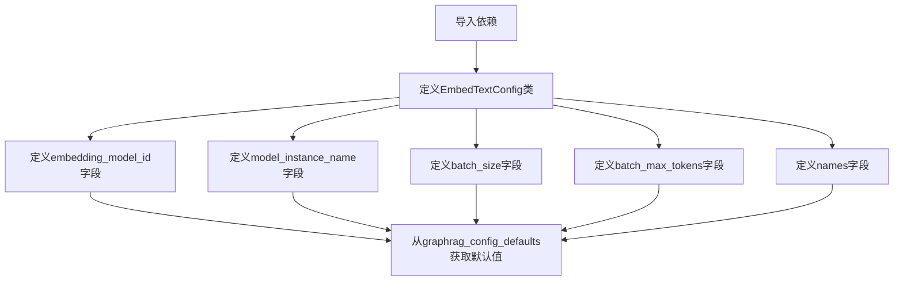

# `graphrag\packages\graphrag\graphrag\config\models\embed_text_config.py` 详细设计文档

定义文本嵌入(Embed Text)模块的配置参数类，使用Pydantic的BaseModel实现配置建模，包含嵌入模型ID、模型实例名称、批处理大小、批处理最大token数以及嵌入名称列表等配置项。

## 整体流程



## 类结构

```
BaseModel (Pydantic抽象基类)
└── EmbedTextConfig (配置类)
```

## 全局变量及字段


### `graphrag_config_defaults`
    
从graphrag.config.defaults导入的模块，提供配置的默认值

类型：`module`
    


### `EmbedTextConfig.embedding_model_id`
    
用于文本嵌入的模型ID

类型：`str`
    


### `EmbedTextConfig.model_instance_name`
    
模型单例实例名称，主要影响缓存存储分区

类型：`str`
    


### `EmbedTextConfig.batch_size`
    
批处理大小

类型：`int`
    


### `EmbedTextConfig.batch_max_tokens`
    
批处理最大token数

类型：`int`
    


### `EmbedTextConfig.names`
    
要执行的特定嵌入列表

类型：`list[str]`
    
    

## 全局函数及方法


## 关键组件


### EmbedTextConfig 类

配置类，用于定义文本嵌入的默认参数设置，继承自 Pydantic 的 BaseModel。

### embedding_model_id 字段

指定用于文本嵌入的模型 ID。

### model_instance_name 字段

模型单例实例名称，主要影响缓存存储分区。

### batch_size 字段

批处理大小参数。

### batch_max_tokens 字段

批处理最大 token 数量。

### names 字段

要执行的特定嵌入列表。

### graphrag_config_defaults 依赖

外部默认配置源，提供各配置项的默认值。


## 问题及建议


### 已知问题

-   **类型注解兼容性**：使用 `list[str]` 语法需要 Python 3.9+，如果项目需支持更低版本 Python，应使用 `List[str]` from `typing`
-   **缺少数值范围验证**：`batch_size` 和 `batch_max_tokens` 未设置最小值约束 (ge=1)，可能接受负数或零值
-   **列表非空验证缺失**：`names` 字段未验证列表非空，空列表可能导致后续运行时错误
-   **默认值延迟求值风险**：所有默认值直接引用 `graphrag_config_defaults.embed_text.*`，若该对象在模块导入时未完成初始化，可能导致 ImportError 或默认值失效
-   **模型配置冗余**：字段命名包含 "model" 和 "instance"，但配置类名为 "EmbedTextConfig"，职责边界略显模糊

### 优化建议

-   添加数值约束：`batch_size: int = Field(..., ge=1, description="...")` 和 `batch_max_tokens: int = Field(..., ge=1, description="...")`
-   添加列表非空验证：使用 `Field(default_factory=list, min_length=1)` 或添加 model_validator
-   考虑使用 `default=None` 而非直接引用全局默认值，提供更清晰的可选配置语义
-   统一类型注解风格：使用 `from __future__ import annotations` 或切换到 `List[str]`
-   增强文档字符串：补充配置使用场景、与其他配置项的关联关系等说明

## 其它


### 设计目标与约束

该配置类旨在为文本嵌入功能提供标准化的参数化设置，确保在不同环境下的一致性。设计约束包括：必须继承自Pydantic的BaseModel以获得自动验证功能；所有配置项必须提供默认值以保证配置的完整性；配置项必须与graphrag_config_defaults中的默认值保持同步。

### 错误处理与异常设计

Pydantic会在模型实例化时自动进行类型检查和验证。当传入无效类型或不符合约束的值时，会抛出ValidationError。batch_size和batch_max_tokens必须为正整数；names列表必须包含有效的嵌入名称字符串。

### 外部依赖与接口契约

依赖graphrag_config_defaults模块获取默认值；依赖pydantic模块的BaseModel和Field进行配置建模；依赖typing模块的list类型注解。所有配置项的默认值从graphrag_config_defaults.embed_text对象中读取，接口契约要求该对象必须包含embedding_model_id、model_instance_name、batch_size、batch_max_tokens和names属性。

### 配置验证规则

embedding_model_id必须是字符串类型；model_instance_name必须是字符串类型；batch_size必须是正整数，默认值为graphrag_config_defaults.embed_text.batch_size；batch_max_tokens必须是正整数；names必须是字符串列表。

### 使用场景与集成点

该配置类通常作为更大配置对象的子配置使用，由GraphRag配置体系实例化并传递给嵌入模块。集成点包括：被graphrag配置文件加载器实例化；被嵌入引擎读取以确定模型参数和批处理策略。

### 版本兼容性考虑

当前版本与Pydantic v2兼容，使用Field进行字段定义和默认值设置。配置类的字段顺序和类型在后续版本中应保持稳定以确保兼容性。

### 性能影响分析

该配置类本身不直接执行计算，仅存储元数据。配置值（尤其是batch_size和batch_max_tokens）会影响后续嵌入处理的吞吐量和内存使用，较大的批次可以提高吞吐量但增加内存压力。

### 安全考虑

该配置类不直接处理敏感数据，但embedding_model_id可能包含云服务商凭证信息或指向敏感端点。应确保配置来源可信，避免通过不受信任的输入实例化配置对象。

    