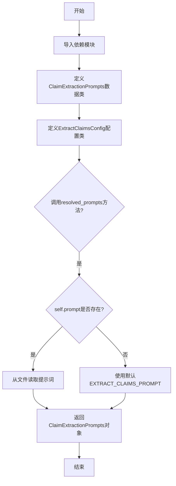
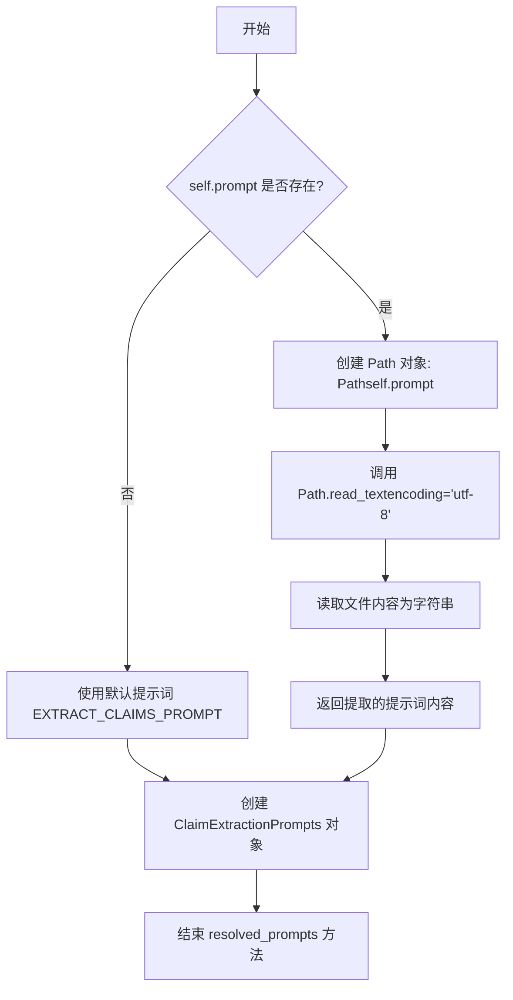
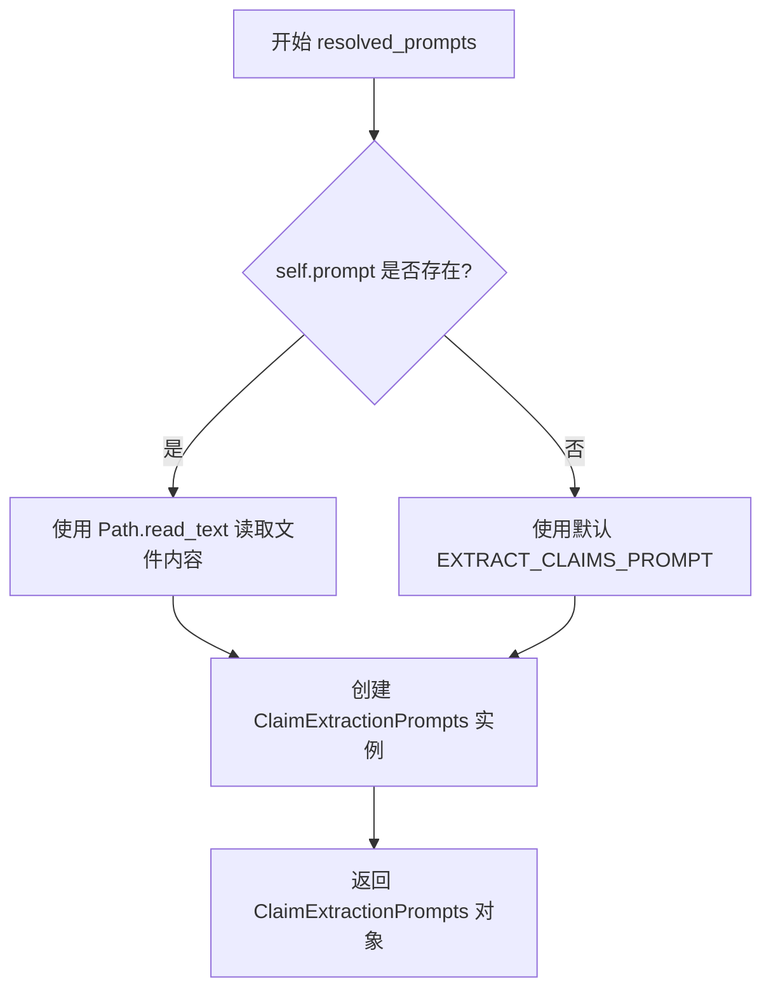

# `graphrag\packages\graphrag\graphrag\config\models\extract_claims_config.py` 详细设计文档

该代码定义了GraphRAG系统中用于从文档中提取声明(claims)的配置参数，包括是否启用、使用的模型、提示词模板等，并提供了提示词解析功能。

## 整体流程



## 类结构

```
Object
├── ClaimExtractionPrompts (dataclass)
└── ExtractClaimsConfig (Pydantic BaseModel)
```

## 全局变量及字段


### `EXTRACT_CLAIMS_PROMPT`
    
从graphrag.prompts.index.extract_claims导入的默认声明提取提示词模板

类型：`str`
    


### `graphrag_config_defaults`
    
从graphrag.config.defaults导入的默认配置值

类型：`Module`
    


### `Path`
    
pathlib.Path用于文件路径操作

类型：`class`
    


### `dataclass`
    
dataclasses模块的装饰器

类型：`decorator`
    


### `BaseModel`
    
pydantic模型基类

类型：`class`
    


### `Field`
    
pydantic字段定义函数

类型：`function`
    


### `ClaimExtractionPrompts.extraction_prompt`
    
声明提取的提示词模板内容

类型：`str`
    


### `ExtractClaimsConfig.enabled`
    
是否启用声明提取功能

类型：`bool`
    


### `ExtractClaimsConfig.completion_model_id`
    
用于声明提取的模型ID

类型：`str`
    


### `ExtractClaimsConfig.model_instance_name`
    
模型单例实例名称，影响缓存存储分区

类型：`str`
    


### `ExtractClaimsConfig.prompt`
    
声明提取提示词（可自定义文件路径）

类型：`str | None`
    


### `ExtractClaimsConfig.description`
    
声明描述

类型：`str`
    


### `ExtractClaimsConfig.max_gleanings`
    
最大实体 gleanings 数量

类型：`int`
    
    

## 全局函数及方法


### `Path.read_text()`

该方法用于读取指定路径的文件内容，并将文件内容作为字符串返回。在此代码中，它被用于读取提示词配置文件的内容。

参数：

- `encoding`：`str`，指定读取文件时使用的字符编码，此处传入 `"utf-8"`

返回值：`str`，返回文件中的文本内容

#### 流程图



#### 带注释源码

```python
def resolved_prompts(self) -> ClaimExtractionPrompts:
    """Get the resolved claim extraction prompts."""
    return ClaimExtractionPrompts(
        extraction_prompt=Path(self.prompt).read_text(encoding="utf-8")
        # 如果 self.prompt 存在，则使用 Path 类将字符串路径转换为 Path 对象
        # 然后调用 read_text 方法以指定 utf-8 编码读取文件内容
        # 读取的内容作为字符串返回并赋值给 extraction_prompt 字段
        if self.prompt
        # 条件判断：如果 self.prompt 不为 None 且不为空字符串
        else EXTRACT_CLAIMS_PROMPT,
        # 如果 self.prompt 不存在或为空，则使用默认的 EXTRACT_CLAIMS_PROMPT 常量
    )
```

#### 关键上下文信息

- **调用类**：`ExtractClaimsConfig`
- **调用方法**：`resolved_prompts()`
- **Path 对象来源**：`Path(self.prompt)` - 将字符串路径转换为 Path 对象
- **文件路径**：`self.prompt` - 来自配置的属性，类型为 `str | None`
- **潜在问题**：
  - 如果 `self.prompt` 指向的 文件不存在，`read_text()` 会抛出 `FileNotFoundError`
  - 如果文件路径无效，可能抛出 `OSError`
  - 建议添加异常处理机制以提高健壮性


### `ExtractClaimsConfig.resolved_prompts`

该方法用于解析并返回声明提取提示词对象，根据配置中的 `prompt` 字段决定是从指定文件读取提示词内容，还是使用默认的 `EXTRACT_CLAIMS_PROMPT` 模板，最终返回一个包含提取提示词的 `ClaimExtractionPrompts` 数据类实例。

参数：

- 该方法无显式参数（仅包含隐式参数 `self`）

返回值：`ClaimExtractionPrompts`，一个数据类对象，包含从文件或默认模板解析出的声明提取提示词

#### 流程图



#### 带注释源码

```python
def resolved_prompts(self) -> ClaimExtractionPrompts:
    """Get the resolved claim extraction prompts."""
    # 判断 self.prompt 是否有值
    # 如果有值：使用 Path.read_text 以 UTF-8 编码读取文件内容作为提示词
    # 如果无值：使用模块默认的 EXTRACT_CLAIMS_PROMPT 常量作为提示词
    return ClaimExtractionPrompts(
        extraction_prompt=Path(self.prompt).read_text(encoding="utf-8")
        if self.prompt
        else EXTRACT_CLAIMS_PROMPT,
    )
```

## 关键组件


### ClaimExtractionPrompts

一个数据类，用于存储解析后的声明提取提示模板，包含 extraction_prompt 字段。

### ExtractClaimsConfig

主要的配置类，基于 Pydantic BaseModel，用于定义声明提取模块的完整配置。包含 enabled、completion_model_id、model_instance_name、prompt、description、max_gleanings 等配置字段。

### resolved_prompts()

配置方法，用于解析并返回最终的提示模板。如果配置了自定义提示文件路径，则从文件读取；否则使用默认的 EXTRACT_CLAIMS_PROMPT。

### graphrag_config_defaults

外部依赖，提供默认配置值，导入自 graphrag.config.defaults 模块。

### EXTRACT_CLAIMS_PROMPT

外部依赖，提供默认的声明提取提示模板，导入自 graphrag.prompts.index.extract_claims 模块。


## 问题及建议


### 已知问题

-   **Prompt 文件路径未验证安全风险**：`resolved_prompts()` 方法直接使用 `Path(self.prompt).read_text()` 读取文件，如果 `self.prompt` 来自用户输入，可能存在路径遍历攻击风险（如 `../../etc/passwd`）
-   **混合使用 dataclass 和 Pydantic**：`ClaimExtractionPrompts` 使用 `@dataclass`，而 `ExtractClaimsConfig` 使用 Pydantic `BaseModel`，风格不统一可能导致维护困难
-   **缺少 Prompt 文件存在性验证**：当 `self.prompt` 有值时，未检查文件是否存在或是否可读，读取失败时将抛出未捕获的 `FileNotFoundError` 或 `OSError`
-   **硬编码字符编码**：`read_text(encoding="utf-8")` 硬编码了 UTF-8，未考虑不同系统可能的编码差异
-   **描述与字段名不一致**：`max_gleanings` 的描述为 "The maximum number of entity gleanings"，但该配置用于 claim extraction，描述可能有误
-   **缺乏默认值校验**：如 `max_gleanings` 应为正整数，但未添加数值范围验证

### 优化建议

-   **增加路径安全校验**：在读取文件前验证路径是否为绝对路径或限制在特定目录内，使用 `Path.resolve()` 并检查是否在允许的目录范围内
-   **统一模型风格**：将 `ClaimExtractionPrompts` 改为 Pydantic `BaseModel`，与项目其他配置保持一致
-   **添加文件读取异常处理**：在 `resolved_prompts()` 中捕获文件读取异常，提供有意义的错误信息或回退到默认 prompt
-   **增强配置验证**：使用 Pydantic 的 `validator` 或 `field_validator` 对 `max_gleanings` 添加正整数校验，对 `prompt` 路径添加存在性检查（当不为 None 时）
-   **修复描述文案**：将 `max_gleanings` 的描述修正为与 claim extraction 相关的描述，或根据实际用途调整
-   **考虑配置化编码**：允许通过配置指定文件编码，或默认使用系统编码 `locale.getpreferredencoding()`

## 其它


### 设计目标与约束

该配置类旨在为GraphRAG的Claim提取功能提供灵活的配置选项，支持通过Pydantic进行数据验证，并允许用户自定义提示模板和模型参数。设计约束包括：必须与graphrag_config_defaults默认值保持兼容，prompt字段支持自定义文件路径或使用内置默认提示。

### 错误处理与异常设计

配置验证主要依赖Pydantic的BaseModel自动验证机制。当prompt字段提供文件路径时，resolved_prompts()方法会尝试读取文件内容，若文件不存在或读取失败会抛出FileNotFoundError或IOError。建议在实际调用处添加try-except块捕获异常，并向用户返回友好的错误信息。

### 数据流与状态机

配置对象创建后通过resolved_prompts()方法将字符串prompt解析为ClaimExtractionPrompts对象。该方法首先检查self.prompt是否存在，若存在则尝试从指定路径读取文件，否则使用内置的EXTRACT_CLAIMS_PROMPT常量。配置对象生命周期为：加载配置→验证配置→解析提示→传递至下游Claim提取模块。

### 外部依赖与接口契约

依赖的外部模块包括：graphrag.config.defaults提供默认配置值graphrag_config_defaults，graphrag.prompts.index.extract_claims提供内置提示模板EXTRACT_CLAIMS_PROMPT，pathlib.Path用于文件路径操作。接口契约方面，resolved_prompts()方法返回ClaimExtractionPrompts对象，ExtractClaimsConfig实例可被序列化用于配置持久化。

### 安全性与权限设计

当前配置不涉及敏感信息存储，但prompt字段支持文件路径读取需注意路径遍历攻击风险。建议对self.prompt路径进行安全校验，确保路径在预期目录范围内。此外，completion_model_id和model_instance_name字段应进行输入校验，防止注入恶意模型标识。

### 配置验证规则

Pydantic自动应用的验证规则包括：enabled必须为布尔类型，completion_model_id和model_instance_name必须为非空字符串，description必须为字符串，max_gleanings必须为正整数。resolved_prompts()方法在执行文件读取时会进行额外的运行时验证。

### 版本兼容性

当前版本(v0.x)配置类使用Pydantic v2的BaseModel，与Pydantic v1不兼容。graphrag_config_defaults.extract_claims路径可能随版本演进发生变化，建议在文档中明确标注依赖版本要求，便于未来迁移。

### 性能考量

resolved_prompts()方法每次调用都会执行文件IO操作，若配置被频繁复用，建议缓存resolved_prompts()的返回值。max_gleanings参数直接影响下游处理的计算成本，需根据实际需求合理设置。

    