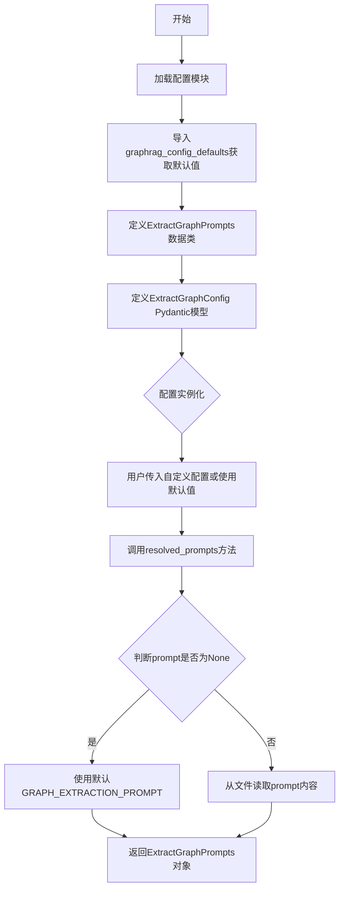
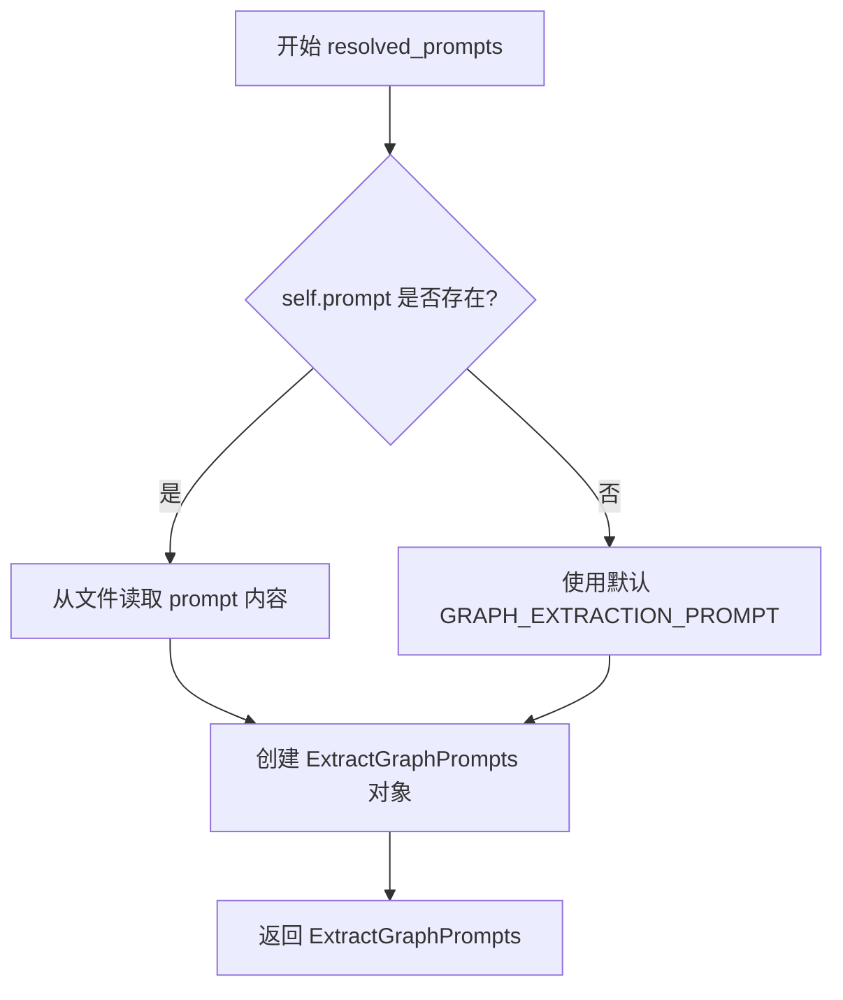

# `graphrag\packages\graphrag\graphrag\config\models\extract_graph_config.py` 详细设计文档

该文件定义了GraphRAG系统中实体提取的配置模块，包括ExtractGraphConfig配置类（用于管理模型ID、实例名、提示模板、实体类型和提取参数）和ExtractGraphPrompts数据结构（用于存储解析后的提取提示），通过Pydantic实现配置验证和默认值管理。

## 整体流程



## 类结构

```
模块: graphrag.config.extract_graph_config
├── ExtractGraphPrompts (dataclass)
└── ExtractGraphConfig (Pydantic BaseModel)
```

## 全局变量及字段


### `graphrag_config_defaults`
    
图谱配置默认值的模块

类型：`module`
    


### `GRAPH_EXTRACTION_PROMPT`
    
图谱提取的默认提示模板字符串

类型：`str`
    


### `ExtractGraphPrompts.extraction_prompt`
    
图谱提取的提示模板内容

类型：`str`
    


### `ExtractGraphConfig.completion_model_id`
    
用于文本嵌入的模型ID

类型：`str`
    


### `ExtractGraphConfig.model_instance_name`
    
模型单例实例名称，影响缓存存储分区

类型：`str`
    


### `ExtractGraphConfig.prompt`
    
实体提取提示模板路径或内容

类型：`str | None`
    


### `ExtractGraphConfig.entity_types`
    
要提取的实体类型列表

类型：`list[str]`
    


### `ExtractGraphConfig.max_gleanings`
    
实体提取的最大轮次

类型：`int`
    
    

## 全局函数及方法


### `ExtractGraphConfig.resolved_prompts`

解析并返回图谱提取提示模板，如果未提供prompt则使用默认提示。

参数：

- 无

返回值：`ExtractGraphPrompts`，包含图谱提取提示模板的数据类对象。

#### 流程图



#### 带注释源码

```python
def resolved_prompts(self) -> ExtractGraphPrompts:
    """Get the resolved graph extraction prompts.
    
    解析并返回图谱提取提示模板。
    如果配置中提供了自定义 prompt 路径，则从文件读取；
    否则使用模块内置的默认提示模板 GRAPH_EXTRACTION_PROMPT。
    
    Returns:
        ExtractGraphPrompts: 包含 extraction_prompt 的提示模板对象
    """
    return ExtractGraphPrompts(
        # 如果 self.prompt 存在，则从指定路径读取文件内容
        # 否则使用默认的 GRAPH_EXTRACTION_PROMPT
        extraction_prompt=Path(self.prompt).read_text(encoding="utf-8")
        if self.prompt
        else GRAPH_EXTRACTION_PROMPT,
    )
```

## 关键组件


### ExtractGraphPrompts

用于存储图谱提取提示模板的数据类，包含extraction_prompt字段用于保存提取提示文本。

### ExtractGraphConfig

Pydantic配置模型类，定义实体提取的完整配置，包含模型ID、实例名称、提示模板、实体类型和最大 gleanings 数等配置项。

### resolved_prompts 方法

惰性加载方法，根据配置动态加载提示模板。如果配置中指定了提示路径，则从文件读取；否则使用默认的 GRAPH_EXTRACTION_PROMPT 常量，实现按需加载避免启动时不必要的 I/O 操作。

### 配置字段

包含5个核心配置字段：completion_model_id（完成模型ID）、model_instance_name（模型实例名称）、prompt（提示模板路径）、entity_types（实体类型列表）、max_gleanings（最大 gleanings 次数），均带有默认值和描述信息。


## 问题及建议


### 已知问题

- **类型不一致**：completion_model_id 字段的描述说明是"用于 text embeddings 的模型 ID"，但实际用途是图提取的完成模型，描述与实际功能不符
- **字段描述冗余**：entity_types 字段描述为"The entity extraction entity types to use"，其中"entity extraction"和"entity"重复，表达不够简洁
- **文件读取无错误处理**：resolved_prompts() 方法直接调用 Path().read_text()，当文件不存在或编码错误时会抛出未捕获的异常，缺乏友好的错误提示
- **编码硬编码**：文件读取仅支持 utf-8 编码，无法处理其他编码的提示模板文件
- **配置依赖风险**：多个字段依赖 graphrag_config_defaults.extract_graph 的属性，如果该默认配置对象未正确初始化或属性缺失，会导致运行时 AttributeError
- **无输入验证**：max_gleanings 字段未设置最小值验证，可能接受负数；entity_types 列表未验证是否为空

### 优化建议

- 修正 completion_model_id 的描述，使其准确反映用于图提取的完成模型
- 简化 entity_types 的描述为"The entity types to extract"
- 为文件读取操作添加 try-except 错误处理，捕获 FileNotFoundError 和 UnicodeDecodeError，并提供有意义的错误信息
- 考虑支持多编码或使用 encoding="utf-8" 作为参数传入以便扩展
- 在 resolved_prompts() 方法中添加默认值检查逻辑，当 graphrag_config_defaults.extract_graph 缺少必要属性时给出明确提示
- 为 max_gleanings 添加 ge=0 的验证约束，确保值为非负整数
- 考虑为 entity_types 添加最小长度验证，确保至少有一种实体类型被配置

## 其它


### 设计目标与约束

本模块的设计目标是提供图提取（Graph Extraction）功能的配置参数化管理，支持通过配置文件或代码方式灵活设置提取参数。约束条件包括：必须兼容graphrag_config_defaults中的默认值体系，prompt参数必须为有效文件路径或None，entity_types列表不能为空，max_gleanings必须为非负整数。

### 错误处理与异常设计

当prompt参数指定的文件不存在时，Python的Path.read_text()会抛出FileNotFoundError，该异常会向上传播给调用者。resolved_prompts()方法依赖Path对象读取文件，需要确保调用方处理文件访问权限相关异常。entity_types为空列表时不会触发验证错误，但可能导致提取结果为空。配置字段的类型检查由Pydantic自动完成，类型不匹配时会抛出ValidationError。

### 数据流与状态机

配置数据流为：默认值初始化 -> 用户自定义覆盖 -> resolved_prompts()解析。ExtractGraphConfig作为不可变配置对象，在初始化后不修改自身状态。resolved_prompts()方法根据prompt字段是否为None来决定读取文件或使用内置常量，属于纯函数设计，不产生副作用。

### 外部依赖与接口契约

主要依赖包括：pydantic.BaseModel用于配置验证，pathlib.Path用于文件路径操作，graphrag_config_defaults提供默认值，GRAPH_EXTRACTION_PROMPT提供内置提示模板。接口契约要求completion_model_id和model_instance_name为非空字符串，prompt为有效文件路径或None，entity_types为字符串列表，max_gleanings为整数。

### 配置文件格式

配置可通过YAML或JSON文件加载，需包含completion_model_id、model_instance_name、prompt、entity_types、max_gleanings字段。prompt字段支持两种形式：文件路径字符串或null（使用内置默认提示）。

### 安全性考虑

代码本身不直接处理敏感数据，但需要注意prompt文件路径的合法性，避免路径遍历攻击。resolved_prompts()方法使用utf-8编码读取文件，需确保文件内容符合预期格式。

### 性能考虑

resolved_prompts()方法每次调用都会读取文件，建议在配置初始化阶段调用一次并缓存结果，避免重复文件IO操作。GRAPH_EXTRACTION_PROMPT作为模块级常量，在模块导入时加载至内存。

### 测试策略

应包含单元测试验证默认值加载、字段验证（有效/无效输入）、resolved_prompts()方法的文件读取逻辑、内置提示模板的存在性。集成测试应验证与graphrag_config_defaults的兼容性。

### 版本兼容性

代码使用Python 3.10+的类型注解语法（str | None），依赖pydantic v2+的Field和BaseModel。需要确保graphrag_config_defaults模块版本与本模块兼容。

### 部署考虑

本模块作为配置模块，无运行时依赖，仅需确保部署环境中安装了pydantic和pathlib（Python 3.4+内置）。prompt文件需要随包一起分发或由用户提供。

    