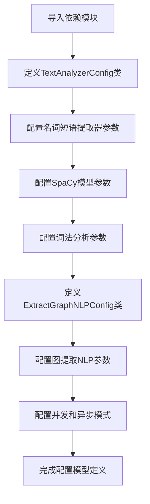

# `graphrag\packages\graphrag\graphrag\config\models\extract_graph_nlp_config.py` 详细设计文档

这是一个配置参数化模块，定义了GraphRAG系统中用于NLP图提取的默认配置参数，包括文本分析器配置和图提取NLP配置两个主要配置类，用于管理名词短语提取器类型、SpaCy模型、词法分析规则、并发请求等核心参数。

## 整体流程



## 类结构

```
BaseModel (pydantic基类)
├── TextAnalyzerConfig (文本分析器配置)
└── ExtractGraphNLPConfig (图提取NLP配置)
```

## 全局变量及字段


### `TextAnalyzerConfig.extractor_type`
    
名词短语提取器类型

类型：`NounPhraseExtractorType`
    


### `TextAnalyzerConfig.model_name`
    
SpaCy模型名称

类型：`str`
    


### `TextAnalyzerConfig.max_word_length`
    
NLP解析的最大词长度

类型：`int`
    


### `TextAnalyzerConfig.word_delimiter`
    
分词分隔符

类型：`str`
    


### `TextAnalyzerConfig.include_named_entities`
    
是否在名词短语中包含命名实体

类型：`bool`
    


### `TextAnalyzerConfig.exclude_nouns`
    
排除的名词列表（停用词）

类型：`list[str] | None`
    


### `TextAnalyzerConfig.exclude_entity_tags`
    
排除的命名实体标签列表

类型：`list[str]`
    


### `TextAnalyzerConfig.exclude_pos_tags`
    
移除的词性标签列表

类型：`list[str]`
    


### `TextAnalyzerConfig.noun_phrase_tags`
    
名词短语标签列表

类型：`list[str]`
    


### `TextAnalyzerConfig.noun_phrase_grammars`
    
名词短语匹配的CFG语法

类型：`dict[str, str]`
    


### `ExtractGraphNLPConfig.normalize_edge_weights`
    
是否归一化边权重

类型：`bool`
    


### `ExtractGraphNLPConfig.text_analyzer`
    
文本分析器配置

类型：`TextAnalyzerConfig`
    


### `ExtractGraphNLPConfig.concurrent_requests`
    
提取过程的线程数

类型：`int`
    


### `ExtractGraphNLPConfig.async_mode`
    
异步模式类型

类型：`AsyncType`
    
    

## 全局函数及方法


## 关键组件


### 1. 一段话描述

该代码定义了两个Pydantic配置类，用于配置GraphRAG系统中图提取模块的NLP文本分析功能，包括文本分析器类型、模型参数、提取规则、并发处理等配置项，支持通过默认值和灵活的参数设置来定制名词短语提取和图构建的NLP处理流程。

### 2. 文件的整体运行流程

该配置文件模块采用分层配置结构，首先定义基础的`TextAnalyzerConfig`类用于配置单个文本分析器的各项参数，然后在`ExtractGraphNLPConfig`类中组合`TextAnalyzerConfig`实例并添加图提取级别的配置（如边权重归一化、并发请求数、异步模式等）。整个流程为：导入依赖配置枚举和默认值 -> 定义文本分析器配置类 -> 定义图提取NLP配置类（包含嵌套的文本分析器配置）-> 提供给外部系统使用。

### 3. 类的详细信息

#### 3.1 TextAnalyzerConfig 类

**类字段：**

| 字段名称 | 类型 | 描述 |
|---------|------|------|
| extractor_type | NounPhraseExtractorType | 名词短语提取器类型 |
| model_name | str | SpaCy模型名称 |
| max_word_length | int | NLP解析的最大词长度 |
| word_delimiter | str | 单词分隔符 |
| include_named_entities | bool | 是否在名词短语中包含命名实体 |
| exclude_nouns | list[str] \| None | 排除的名词列表（停用词） |
| exclude_entity_tags | list[str] | 排除的命名实体标签列表 |
| exclude_pos_tags | list[str] | 移除的词性标签列表 |
| noun_phrase_tags | list[str] | 名词短语标签列表 |
| noun_phrase_grammars | dict[str, str] | 名词短语的CFG语法规则 |

**类方法：**

该类继承自Pydantic的BaseModel，自动生成`__init__`、`__repr__`、`model_validate`、`model_dump`等方法，无需手动定义业务方法。

#### 3.2 ExtractGraphNLPConfig 类

**类字段：**

| 字段名称 | 类型 | 描述 |
|---------|------|------|
| normalize_edge_weights | bool | 是否归一化边权重 |
| text_analyzer | TextAnalyzerConfig | 文本分析器配置 |
| concurrent_requests | int | 提取过程使用的线程数 |
| async_mode | AsyncType | 异步模式类型 |

**类方法：**

该类同样继承自Pydantic的BaseModel，使用Pydantic v2的Field函数定义配置字段及默认值。

### 4. 关键组件信息

#### TextAnalyzerConfig

用于配置NLP文本分析器的核心参数，控制名词短语提取、命名实体识别、词性标注等NLP处理逻辑。

#### ExtractGraphNLPConfig

图提取NLP配置的主配置类，整合文本分析器配置并提供图提取级别的并发和异步处理参数。

#### NounPhraseExtractorType 枚举

定义名词短语提取器的类型，与配置类配合使用。

#### AsyncType 枚举

定义异步处理的模式类型，支持同步和异步执行。

#### graphrag_config_defaults

从graphrag配置模块导入的默认值提供对象，用于配置项的默认值回退。

### 5. 潜在的技术债务或优化空间

1. **配置默认值耦合**：当前代码直接引用`graphrag_config_defaults`的深层嵌套属性（如`graphrag_config_defaults.extract_graph_nlp.text_analyzer.extractor_type`），这种链式访问方式存在较大的重构风险，如果默认值结构变化会导致大量代码修改，建议使用更稳健的默认值获取方式或配置验证器。

2. **魔法字符串/类型硬编码**：部分字段的默认值直接内联在Field中，缺少对默认值来源的集中管理，可考虑将这些默认值统一配置在专门的配置模板中。

3. **缺乏配置验证**：虽然使用Pydantic的BaseModel，但未定义自定义验证器（validator），无法在配置实例化时校验参数的有效性（如`concurrent_requests`必须为正整数、`model_name`必须为有效的SpaCy模型名称等）。

4. **类型提示可改进**：部分字段如`exclude_nouns`使用`list[str] | None`，在Python 3.9以下版本不兼容，应考虑使用`Optional[List[str]]`或添加版本约束说明。

### 6. 其它项目

#### 设计目标与约束

- **设计目标**：提供灵活且类型安全的配置管理，支持图提取NLP流程的定制化需求
- **约束**：必须与Pydantic v2兼容，配置项必须能从外部覆盖默认值

#### 错误处理与异常设计

- Pydantic自动验证配置字段类型，如类型不匹配会抛出`ValidationError`
- 缺失必需字段时使用默认值填充，默认值来源失败时会导致属性访问错误

#### 数据流与状态机

- 配置对象作为只读数据容器，在图提取流程初始化时加载并验证
- 配置数据流：配置文件/YAML -> Pydantic解析 -> TextAnalyzerConfig/ExtractGraphNLPConfig实例 -> 传递给NLP处理器

#### 外部依赖与接口契约

- **pydantic**：用于配置建模和验证
- **graphrag.config.defaults**：提供默认值回退
- **graphrag.config.enums**：提供枚举类型定义
- 预期调用方会传入配置实例或依赖注入方式获取配置


## 问题及建议


### 已知问题

- **嵌套模型默认值的重复定义**：`ExtractGraphNLPConfig.text_analyzer`字段直接实例化`TextAnalyzerConfig()`作为默认值，而不是像其他字段一样从`graphrag_config_defaults`中获取，导致默认值来源不一致，增加了维护成本
- **缺乏配置验证逻辑**：虽然使用Pydantic的BaseModel，但未定义任何自定义验证器（如`validator`或`field_validator`），无法对配置值的合法性进行业务层面的校验（如`max_word_length`必须为正整数、`concurrent_requests`必须大于0等）
- **默认值依赖的脆弱性**：所有字段的默认值都依赖于`graphrag_config_defaults.extract_graph_nlp`模块，如果该模块结构发生变化或字段缺失，将导致整个配置类报错，且缺乏防御性编程
- **配置合并能力的缺失**：该配置类无法直接支持配置的继承/覆盖场景（如从默认配置合并用户自定义配置），这在复杂系统中是常见需求
- **类型定义可以更精确**：`noun_phrase_grammars`字段类型为`dict[str, str]`，但根据其描述（"The key is a tuple of POS tags and the value is the grammar"），键应为元组类型`dict[tuple[str, ...], str]`，当前类型定义与文档描述不符

### 优化建议

- **统一默认值来源**：将`text_analyzer`字段的默认值修改为从`graphrag_config_defaults.extract_graph_nlp.text_analyzer`获取，或提取为类变量，保持一致性
- **添加配置验证器**：为关键字段添加Pydantic验证器，例如验证`max_word_length > 0`、`concurrent_requests > 0`、`model_name`不为空字符串等约束条件
- **修复类型定义**：将`noun_phrase_grammars`的类型修正为`dict[tuple[str, ...], str]`以匹配其文档描述
- **考虑配置合并能力**：参考Pydantic的`model_validator`或实现配置合并方法，支持从基础配置继承并覆盖特定字段的场景
- **增强文档注释**：为每个配置字段补充更详细的使用说明、可选值范围以及对最终行为的影响，提升配置的可读性和可维护性

## 其它


### 设计目标与约束

本配置模块旨在为GraphRAG的图谱提取NLP处理提供灵活、可扩展的参数化配置能力。设计目标包括：1）支持SpaCy模型的不同配置选项；2）允许自定义名词短语提取规则；3）提供并发和异步处理配置；4）通过Pydantic实现配置验证和类型安全。约束条件包括依赖pydantic v2+、graphrag_config_defaults模块必须可用，且配置值必须与底层defaults保持一致性。

### 错误处理与异常设计

配置类的错误处理主要依赖Pydantic的内置验证机制。当传入无效的extractor_type、async_mode或超出范围的数值参数时，Pydantic会抛出ValidationError。exclude_nouns允许None值，此时使用默认停用词列表。配置默认值从graphrag_config_defaults模块获取，若该模块中对应值缺失可能导致属性错误。外部依赖如SpaCy模型名称未安装时，会在运行时延迟加载阶段抛出模型不存在的异常。

### 数据流与状态机

配置数据流为：graphrag_config_defaults提供默认值 → Pydantic Field定义验证规则 → 用户配置覆盖默认值 → 配置实例化时合并 → 传递给下游NLP处理模块。状态机方面，配置对象本身无状态，仅作为不可变的配置载体。TextAnalyzerConfig和ExtractGraphNLPConfig形成层级结构，ExtractGraphNLPConfig包含TextAnalyzerConfig子配置对象。

### 外部依赖与接口契约

主要外部依赖包括：1）pydantic库提供BaseModel和Field；2）graphrag.config.defaults模块提供默认值；3）graphrag.config.enums模块提供AsyncType和NounPhraseExtractorType枚举。接口契约方面：extractor_type必须为NounPhraseExtractorType枚举值；async_mode必须为AsyncType枚举值；concurrent_requests必须为正整数；noun_phrase_grammars必须为字典类型且键为元组、值为字符串；exclude_nouns为可选列表或None。

### 配置验证规则

TextAnalyzerConfig验证规则：model_name为非空字符串；max_word_length为正整数；word_delimiter为单字符字符串；include_named_entities为布尔值；exclude_nouns为字符串列表或None；exclude_entity_tags、exclude_pos_tags、noun_phrase_tags均为字符串列表；noun_phrase_grammars为字典，键为可哈希元组，值为字符串。ExtractGraphNLPConfig验证规则：normalize_edge_weights为布尔值；text_analyzer为TextAnalyzerConfig实例；concurrent_requests为正整数；async_mode为AsyncType枚举值。

### 性能考虑与优化空间

配置类本身性能开销极低，主要性能考量在下游NLP处理。concurrent_requests参数直接影响并发处理能力，建议根据硬件配置合理设置。SpaCy模型加载为重量级操作，可考虑模型缓存策略。noun_phrase_grammars配置复杂度过高可能影响解析性能。当前实现中defaults模块被多次访问，可考虑缓存默认值引用以减少属性查找开销。

### 安全性考虑

配置模块本身不涉及敏感数据处理。model_name参数接受任意字符串，需确保下游使用时验证模型存在性。exclude_entity_tags和exclude_pos_tags接受任意字符串列表，需防止注入攻击。配置默认值来源于graphrag_config_defaults，需确保该模块可信。

### 可扩展性设计

通过Pydantic的嵌套模型机制支持配置扩展，可添加新的配置节类并通过Field嵌套。当前noun_phrase_grammars使用字典支持自定义语法规则，具有良好扩展性。extractor_type和async_mode使用枚举便于扩展新的提取器类型和异步模式。配置类支持自定义验证器，可通过model_validator添加复杂业务规则验证。

### 版本兼容性

当前代码依赖Pydantic v2语法（Field、model_validator等），不兼容Pydantic v1。Python版本支持取决于graphrag项目要求。SpaCy模型兼容性取决于model_name参数指定，需确保版本匹配。枚举类型AsyncType和NounPhraseExtractorType的定义变更可能影响配置兼容性。

### 使用示例与配置模板

基础用法：config = ExtractGraphNLPConfig()使用所有默认值。自定义SpaCy模型：config = ExtractGraphNLPConfig(text_analyzer=TextAnalyzerConfig(model_name="en_core_web_lg"))。自定义名词短语规则：config = ExtractGraphNLPConfig(text_analyzer=TextAnalyzerConfig(noun_phrase_grammars={("NN",): "NP: {<NN>}+"}))。禁用命名实体：config = ExtractGraphNLPConfig(text_analyzer=TextAnalyzerConfig(include_named_entities=False))。调整并发：config = ExtractGraphNLPConfig(concurrent_requests=8, async_mode=AsyncType.Threaded)。

    