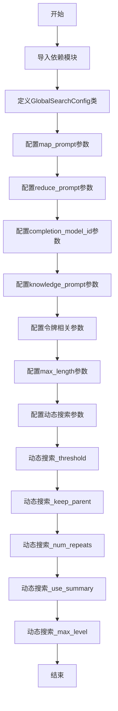

# `graphrag\packages\graphrag\graphrag\config\models\global_search_config.py` 详细设计文档

这是一个用于配置GraphRAG全局搜索的参数类，通过Pydantic模型定义了全局搜索的提示词、模型ID、令牌限制、动态社区选择等配置项，所有配置项都带有默认值并从graphrag_config_defaults中读取。

## 整体流程



## 类结构

```
BaseModel (Pydantic基类)
└── GlobalSearchConfig (全局搜索配置类)
```

## 全局变量及字段


### `graphrag_config_defaults`
    
Default configuration module imported from graphrag.config.defaults, containing default values for graphrag configurations including global_search settings

类型：`module`
    


### `GlobalSearchConfig.map_prompt`
    
The global search mapper prompt to use.

类型：`str | None`
    


### `GlobalSearchConfig.reduce_prompt`
    
The global search reducer to use.

类型：`str | None`
    


### `GlobalSearchConfig.completion_model_id`
    
The model ID to use for global search.

类型：`str`
    


### `GlobalSearchConfig.knowledge_prompt`
    
The global search general prompt to use.

类型：`str | None`
    


### `GlobalSearchConfig.max_context_tokens`
    
The maximum context size in tokens.

类型：`int`
    


### `GlobalSearchConfig.data_max_tokens`
    
The data llm maximum tokens.

类型：`int`
    


### `GlobalSearchConfig.map_max_length`
    
The map llm maximum response length in words.

类型：`int`
    


### `GlobalSearchConfig.reduce_max_length`
    
The reduce llm maximum response length in words.

类型：`int`
    


### `GlobalSearchConfig.dynamic_search_threshold`
    
Rating threshold in include a community report

类型：`int`
    


### `GlobalSearchConfig.dynamic_search_keep_parent`
    
Keep parent community if any of the child communities are relevant

类型：`bool`
    


### `GlobalSearchConfig.dynamic_search_num_repeats`
    
Number of times to rate the same community report

类型：`int`
    


### `GlobalSearchConfig.dynamic_search_use_summary`
    
Use community summary instead of full_context

类型：`bool`
    


### `GlobalSearchConfig.dynamic_search_max_level`
    
The maximum level of community hierarchy to consider if none of the processed communities are relevant

类型：`int`
    
    

## 全局函数及方法


## 关键组件


### GlobalSearchConfig

全局搜索模块的配置类，用于定义GraphRAG系统中全局搜索功能的参数化设置，包括提示词模板、模型选择、令牌限制以及动态社区选择策略。

### 配置模型结构

定义全局搜索的Pydantic配置模型，继承BaseModel用于参数验证和类型检查。

### 提示词配置

包含map_prompt（映射阶段提示词）、reduce_prompt（归约阶段提示词）和knowledge_prompt（知识提示词）三个字段，用于定制全局搜索的prompt模板。

### 模型配置

completion_model_id字段指定全局搜索使用的LLM模型ID，max_context_tokens和data_max_tokens分别控制上下文最大令牌数和数据LLM最大令牌数。

### 响应长度配置

map_max_length和reduce_max_length分别控制映射阶段和归约阶段LLM的最大响应长度（以单词计）。

### 动态社区选择配置

dynamic_search_threshold设置社区报告的评分阈值，dynamic_search_keep_parent控制是否保留父社区，dynamic_search_num_repeats指定同一社区报告的评分次数，dynamic_search_use_summary决定使用社区摘要还是完整上下文，dynamic_search_max_level设置考虑的社区层级最大深度。


## 问题及建议


### 已知问题

- **字段类型不一致**：`completion_model_id` 字段类型为 `str`，而其他类似的配置字段（如 `map_prompt`、`reduce_prompt` 等）使用 `str | None`，这种不一致可能导致调用方处理逻辑混乱
- **缺少数值范围验证**：数值型字段（如 `max_context_tokens`、`data_max_tokens`、`map_max_length`、`reduce_max_length`、`dynamic_search_threshold` 等）缺少 Pydantic 的数值约束验证（如 `gt`、`ge`、`lt`、`le`），无法防止负数或不合理数值的传入
- **默认值高度耦合**：所有默认值都直接引用 `graphrag_config_defaults.global_search.xxx`，导致配置类与默认值模块紧耦合，若默认值模块结构变化，此配置类需要同步修改
- **缺少配置分层支持**：未支持从环境变量或外部配置文件加载配置的机制，限制了部署灵活性
- **文档不够完善**：类级别的文档字符串内容与实际功能不符（描述为 "Cache" 的配置，实际是 GlobalSearch 配置）

### 优化建议

- **统一字段类型**：将 `completion_model_id` 改为 `str | None = Field(...)` 以保持一致性，或明确其必填的业务意义
- **添加数值约束**：使用 Pydantic 的 `Field(..., gt=0)` 或 `Field(..., ge=0)` 等参数为数值字段添加范围验证，例如 `max_context_tokens: int = Field(default=..., ge=1, description=...)`
- **解耦默认值引用**：考虑在类内部定义常量默认值，或使用 Pydantic 的 `model_validator` 统一处理默认值加载逻辑，降低对外部模块的依赖
- **添加配置验证器**：通过 `model_validator` 或 `field_validator` 添加跨字段的逻辑验证（如 `data_max_tokens` 不应超过 `max_context_tokens`）
- **修正文档字符串**：将类文档字符串改为准确的描述，如 "The default configuration for Global Search."
- **支持配置继承**：考虑添加 `BaseSettings` 或自定义配置源支持，使配置可以从环境变量或 YAML/JSON 文件加载

## 其它


### 设计目标与约束

本配置类旨在为全局搜索功能提供结构化、可验证的参数配置。设计目标包括：1) 提供类型安全的配置管理，利用 Pydantic 的自动验证机制；2) 支持默认值继承，从 `graphrag_config_defaults` 模块获取系统预设值；3) 允许运行时覆盖特定参数，实现配置的灵活性。约束条件包括：所有配置项必须与底层 LLM 模型的能力相匹配（如 max_context_tokens 不能超过模型支持的最大上下文长度），且动态社区选择相关参数需保持内部一致性（如 dynamic_search_threshold 需在合理范围内）。

### 错误处理与异常设计

配置类本身的错误处理主要依赖 Pydantic 的内置验证机制。当传入无效值时，会抛出 `ValidationError`，具体场景包括：1) 类型不匹配（如为整数字段传入字符串）；2) 值超出有效范围（如负数的 max_context_tokens）；3) 必填字段缺失。由于所有字段均设有默认值且多数字段为可选，运行时错误概率较低。建议在配置加载时进行额外的业务逻辑验证，如检查 completion_model_id 对应的模型是否可用。

### 数据流与状态机

配置数据流如下：1) 系统启动时从配置文件或环境变量加载原始配置；2) Pydantic BaseModel 自动进行类型转换和验证；3) 缺失字段使用 `graphrag_config_defaults` 中的默认值填充；4) 验证后的配置对象传递给全局搜索模块使用。本类为纯配置类，不涉及状态机设计，配置对象在初始化后为只读。

### 外部依赖与接口契约

主要外部依赖包括：1) `pydantic.BaseModel` - 配置序列化和验证基础；2) `pydantic.Field` - 字段定义和元数据描述；3) `graphrag_config_defaults` - 默认配置值来源，访问路径为 `graphrag_config_defaults.global_search.*`。接口契约方面，本类遵循 Pydantic v2 的 `BaseModel` 协议，支持 `.model_dump()`、`.model_validate()` 等标准方法，可与 FastAPI 等框架无缝集成。

### 配置验证规则

除 Pydantic 自动的类型验证外，各字段的业务验证规则如下：1) max_context_tokens 和 data_max_tokens 必须为正整数，且 data_max_tokens 应小于 max_context_tokens；2) map_max_length 和 reduce_max_length 必须为正整数，建议值在 100-10000 范围内；3) dynamic_search_threshold 建议范围为 0-10；4) dynamic_search_num_repeats 建议范围为 1-5；5) dynamic_search_max_level 必须为非负整数。

### 使用场景与示例

典型使用场景包括：1) 在 GraphRAG 流水线中配置全局搜索的 LLM 参数；2) 调整动态社区选择的阈值以控制搜索范围；3) 针对不同 LLM 模型调整上下文和输出长度限制。配置示例：`GlobalSearchConfig(completion_model_id="gpt-4-turbo", max_context_tokens=128000, map_max_length=2000)`。

### 安全性考虑

当前配置类不直接涉及敏感信息处理，但需注意：1) completion_model_id 可能暴露使用的 LLM 提供商信息；2) 若配置来源于用户输入，需防范配置注入攻击；3) 建议在生产环境中对配置来源进行权限控制。

### 兼容性说明

本类基于 Pydantic v2 设计，使用了 `pydantic.Field` 而非 v1 的 `Field`。与 Python 版本的兼容性取决于 pydantic 版本要求，建议使用 Python 3.9+ 以获得完整的类型提示支持。


    