# `graphrag\packages\graphrag\graphrag\config\models\graph_rag_config.py` 详细设计文档

GraphRAG配置参数化设置模块，定义了一个完整的配置类GraphRagConfig，用于管理GraphRAG项目的所有参数，包括模型配置（completion_models、embedding_models）、输入输出存储配置、缓存配置、向量存储配置、工作流配置以及各种搜索和图处理配置，并提供了配置验证和模型配置获取的完整方法。

## 整体流程

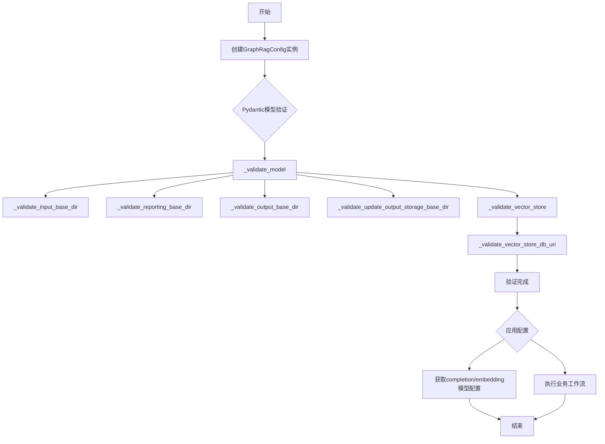

## 类结构

```
GraphRagConfig (Pydantic BaseModel 配置类)
```

## 全局变量及字段


### `asdict`
    
Converts a dataclass instance to a dictionary by iterating over fields.

类型：`function`
    


### `Path`
    
Represents a file system path and provides path manipulation operations.

类型：`class`
    


### `pformat`
    
Pretty formats Python objects for readable string representation.

类型：`function`
    


### `CacheConfig`
    
Configuration for the caching system used in graphrag.

类型：`class`
    


### `ChunkingConfig`
    
Configuration for text chunking during document processing.

类型：`class`
    


### `InputConfig`
    
Configuration for input data source and processing.

类型：`class`
    


### `ModelConfig`
    
Configuration for language models including API settings and parameters.

类型：`class`
    


### `StorageConfig`
    
Configuration for storage backend including base directory and storage type.

类型：`class`
    


### `StorageType`
    
Enumeration of supported storage backend types.

类型：`enum`
    


### `TableProviderConfig`
    
Configuration for table data provider including format and storage settings.

类型：`class`
    


### `IndexSchema`
    
Schema definition for vector index including field mappings and metadata.

类型：`class`
    


### `VectorStoreConfig`
    
Configuration for vector database including connection and index settings.

类型：`class`
    


### `VectorStoreType`
    
Enumeration of supported vector store backend types.

类型：`enum`
    


### `BaseModel`
    
Base class from Pydantic for defining data models with validation.

类型：`class`
    


### `Field`
    
Field descriptor for defining Pydantic model attributes with metadata.

类型：`class`
    


### `model_validator`
    
Decorator for defining model-level validation logic in Pydantic models.

类型：`decorator`
    


### `graphrag_config_defaults`
    
Module containing default configuration values for the graphrag system.

类型：`module`
    


### `all_embeddings`
    
List of all available embedding model names in the configuration.

类型：`list`
    


### `AsyncType`
    
Enumeration of asynchronous execution modes for model requests.

类型：`enum`
    


### `ReportingType`
    
Enumeration of reporting output types (e.g., file, console).

类型：`enum`
    


### `BasicSearchConfig`
    
Configuration for basic search functionality.

类型：`class`
    


### `ClusterGraphConfig`
    
Configuration for graph clustering operations.

类型：`class`
    


### `CommunityReportsConfig`
    
Configuration for community report generation.

类型：`class`
    


### `DRIFTSearchConfig`
    
Configuration for DRIFT search algorithm.

类型：`class`
    


### `EmbedTextConfig`
    
Configuration for text embedding processing.

类型：`class`
    


### `ExtractClaimsConfig`
    
Configuration for claim extraction from text.

类型：`class`
    


### `ExtractGraphConfig`
    
Configuration for entity and relationship extraction.

类型：`class`
    


### `ExtractGraphNLPConfig`
    
Configuration for NLP-based graph extraction.

类型：`class`
    


### `GlobalSearchConfig`
    
Configuration for global search across knowledge graph.

类型：`class`
    


### `LocalSearchConfig`
    
Configuration for local neighborhood search.

类型：`class`
    


### `PruneGraphConfig`
    
Configuration for graph pruning operations.

类型：`class`
    


### `ReportingConfig`
    
Configuration for reporting and logging output.

类型：`class`
    


### `SnapshotsConfig`
    
Configuration for system state snapshots.

类型：`class`
    


### `SummarizeDescriptionsConfig`
    
Configuration for description summarization.

类型：`class`
    


### `GraphRagConfig.completion_models`
    
Dictionary of available completion model configurations keyed by model ID.

类型：`dict[str, ModelConfig]`
    


### `GraphRagConfig.embedding_models`
    
Dictionary of available embedding model configurations keyed by model ID.

类型：`dict[str, ModelConfig]`
    


### `GraphRagConfig.concurrent_requests`
    
Maximum number of concurrent requests to language models.

类型：`int`
    


### `GraphRagConfig.async_mode`
    
Asynchronous mode for language model request handling.

类型：`AsyncType`
    


### `GraphRagConfig.input`
    
Configuration for input data source and processing.

类型：`InputConfig`
    


### `GraphRagConfig.input_storage`
    
Configuration for input data storage including base directory and type.

类型：`StorageConfig`
    


### `GraphRagConfig.chunking`
    
Configuration for text chunking during document processing.

类型：`ChunkingConfig`
    


### `GraphRagConfig.output_storage`
    
Configuration for output data storage including base directory and type.

类型：`StorageConfig`
    


### `GraphRagConfig.update_output_storage`
    
Configuration for updated index output storage.

类型：`StorageConfig`
    


### `GraphRagConfig.table_provider`
    
Configuration for table data provider (default reads/writes parquet).

类型：`TableProviderConfig`
    


### `GraphRagConfig.cache`
    
Configuration for caching system used in graphrag.

类型：`CacheConfig`
    


### `GraphRagConfig.reporting`
    
Configuration for reporting and logging output.

类型：`ReportingConfig`
    


### `GraphRagConfig.vector_store`
    
Configuration for vector database storage and indexing.

类型：`VectorStoreConfig`
    


### `GraphRagConfig.workflows`
    
Optional list of workflows to execute in specified order.

类型：`list[str] | None`
    


### `GraphRagConfig.embed_text`
    
Configuration for text embedding processing pipeline.

类型：`EmbedTextConfig`
    


### `GraphRagConfig.extract_graph`
    
Configuration for entity and relationship extraction from text.

类型：`ExtractGraphConfig`
    


### `GraphRagConfig.summarize_descriptions`
    
Configuration for summarizing entity descriptions.

类型：`SummarizeDescriptionsConfig`
    


### `GraphRagConfig.extract_graph_nlp`
    
Configuration for NLP-based graph extraction processing.

类型：`ExtractGraphNLPConfig`
    


### `GraphRagConfig.prune_graph`
    
Configuration for graph pruning and simplification.

类型：`PruneGraphConfig`
    


### `GraphRagConfig.cluster_graph`
    
Configuration for clustering entities in the graph.

类型：`ClusterGraphConfig`
    


### `GraphRagConfig.extract_claims`
    
Configuration for extracting claims from text documents.

类型：`ExtractClaimsConfig`
    


### `GraphRagConfig.community_reports`
    
Configuration for generating community summary reports.

类型：`CommunityReportsConfig`
    


### `GraphRagConfig.snapshots`
    
Configuration for system state snapshots and checkpoints.

类型：`SnapshotsConfig`
    


### `GraphRagConfig.local_search`
    
Configuration for local neighborhood search in knowledge graph.

类型：`LocalSearchConfig`
    


### `GraphRagConfig.global_search`
    
Configuration for global search across entire knowledge graph.

类型：`GlobalSearchConfig`
    


### `GraphRagConfig.drift_search`
    
Configuration for DRIFT search algorithm execution.

类型：`DRIFTSearchConfig`
    


### `GraphRagConfig.basic_search`
    
Configuration for basic keyword-based search.

类型：`BasicSearchConfig`
    
    

## 全局函数及方法


### `GraphRagConfig.__repr__`

获取对象的字符串表示形式，用于调试和日志输出。

参数：

- 该方法无显式参数（`self` 为隐式参数）

返回值：`str`，返回格式化的对象表示字符串

#### 流程图

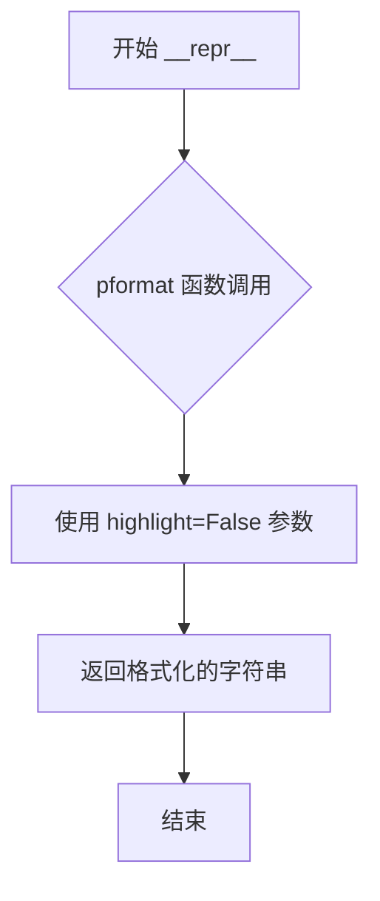

#### 带注释源码

```python
def __repr__(self) -> str:
    """Get a string representation."""
    # 使用 devtools 库的 pformat 函数进行格式化输出
    # highlight=False 表示不使用高亮颜色，适合日志和普通字符串场景
    return pformat(self, highlight=False)
```


### `GraphRagConfig.__str__`

返回该配置对象的 JSON 格式字符串表示，用于调试和日志输出。

参数：

- `self`：`GraphRagConfig`，调用此方法的对象实例本身

返回值：`str`，以缩进 4 空格格式化的 JSON 字符串，包含了配置对象的所有字段和值

#### 流程图

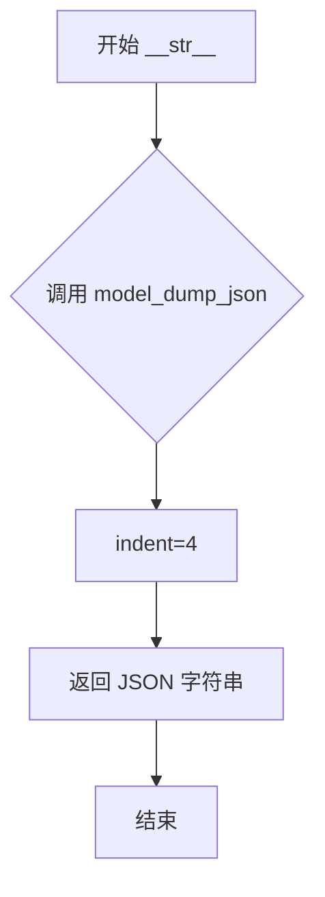

#### 带注释源码

```python
def __str__(self):
    """Get a string representation."""
    # 使用 Pydantic 的 model_dump_json 方法将模型序列化为格式化的 JSON 字符串
    # indent=4 表示使用 4 个空格缩进，使输出更易读
    return self.model_dump_json(indent=4)
```


### GraphRagConfig._validate_input_base_dir

该方法用于验证输入存储的基础目录配置。当存储类型为文件类型时，必须确保基础目录已正确设置，否则抛出 ValueError 异常；如果目录存在，则将其解析为绝对路径字符串并赋值回配置。

参数：

- `self`：隐式参数，GraphRagConfig 类实例

返回值：`None`，该方法不返回值，仅执行验证和状态修改操作

#### 流程图

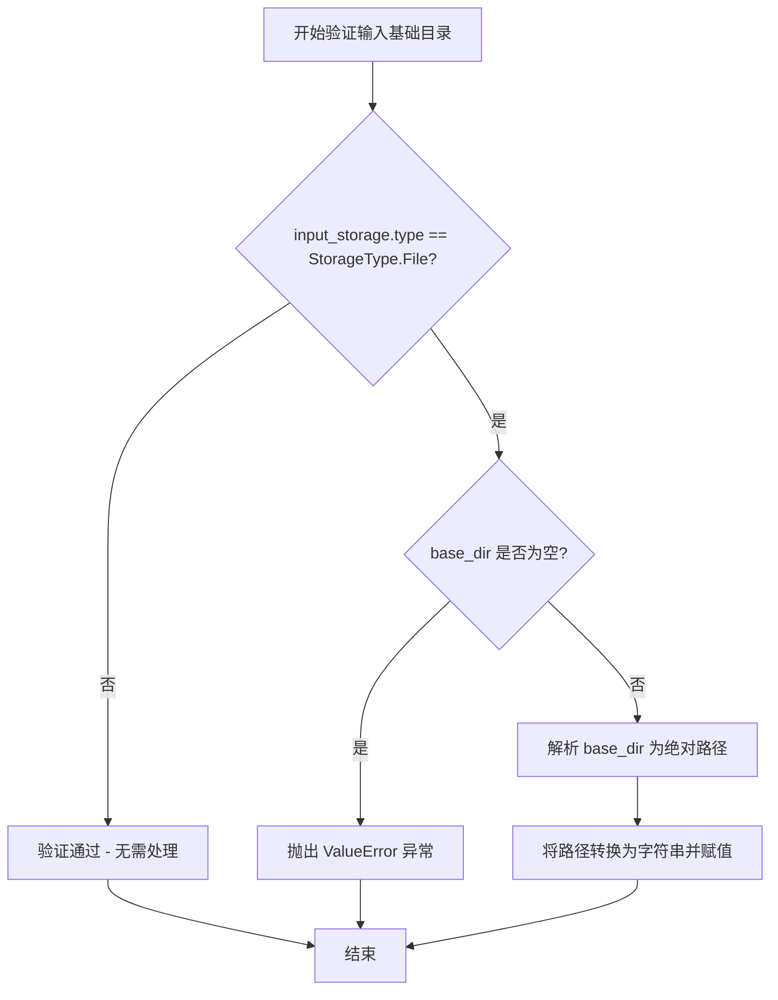

#### 带注释源码

```python
def _validate_input_base_dir(self) -> None:
    """Validate the input base directory."""
    # 检查输入存储类型是否为文件类型
    if self.input_storage.type == StorageType.File:
        # 如果是文件类型，检查基础目录是否已设置
        if not self.input_storage.base_dir:
            # 未设置时抛出详细错误信息，指导用户重新初始化配置
            msg = "input storage base directory is required for file input storage. Please rerun `graphrag init` and set the input storage configuration."
            raise ValueError(msg)
        # 已设置时将相对路径解析为绝对路径并转换为字符串存储
        self.input_storage.base_dir = str(
            Path(self.input_storage.base_dir).resolve()
        )
```


### `GraphRagConfig._validate_output_base_dir`

该方法用于验证输出存储的基目录配置，确保在使用文件类型存储时必须指定有效的基目录路径，并将相对路径解析为绝对路径。

参数：
- `self`：`GraphRagConfig`，隐式参数，表示当前配置实例

返回值：`None`，无返回值，仅执行验证和路径解析操作

#### 流程图

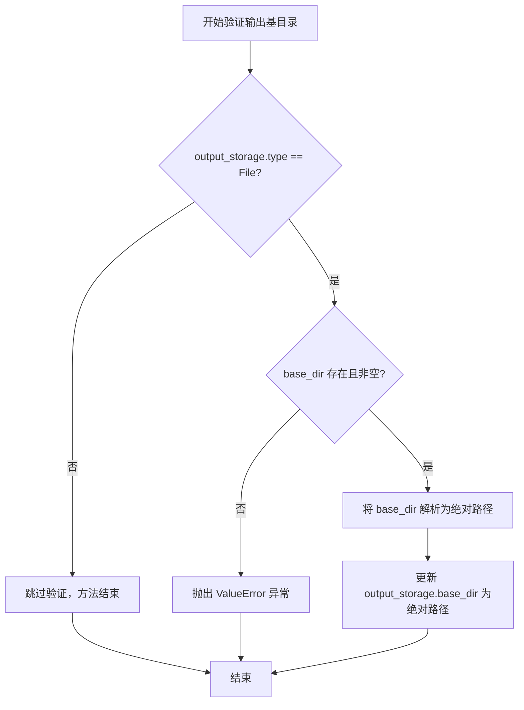

#### 带注释源码

```python
def _validate_output_base_dir(self) -> None:
    """Validate the output base directory."""
    # 检查输出存储类型是否为文件存储
    if self.output_storage.type == StorageType.File:
        # 如果基目录为空或未设置，抛出错误
        if not self.output_storage.base_dir:
            msg = "output base directory is required for file output. Please rerun `graphrag init` and set the output configuration."
            raise ValueError(msg)
        # 将相对路径解析为绝对路径并更新配置
        self.output_storage.base_dir = str(
            Path(self.output_storage.base_dir).resolve()
        )
```


### `GraphRagConfig._validate_update_output_storage_base_dir`

验证更新输出存储的基础目录是否已配置，当存储类型为文件时，确保 base_dir 存在并将其解析为绝对路径。

参数：

- `self`：`GraphRagConfig`，类的实例本身，无需显式传递

返回值：`None`，该方法无返回值，主要通过修改实例属性 `update_output_storage.base_dir` 生效

#### 流程图

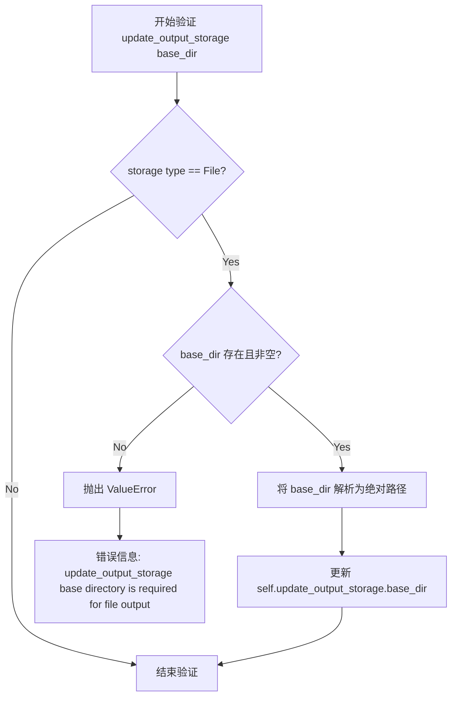

#### 带注释源码

```python
def _validate_update_output_storage_base_dir(self) -> None:
    """Validate the update output base directory."""
    # 检查更新输出存储的类型是否为文件类型
    if self.update_output_storage.type == StorageType.File:
        # 如果没有配置 base_dir，抛出错误提醒用户重新初始化
        if not self.update_output_storage.base_dir:
            msg = "update_output_storage base directory is required for file output. Please rerun `graphrag init` and set the update_output_storage configuration."
            raise ValueError(msg)
        # 将相对路径转换为绝对路径并更新配置
        self.update_output_storage.base_dir = str(
            Path(self.update_output_storage.base_dir).resolve()
        )
```


### `GraphRagConfig._validate_reporting_base_dir`

验证 reporting 基础目录，确保当 reporting 类型为文件类型时，base_dir 已正确配置且不为空。

参数：

- `self`：当前 GraphRagConfig 实例，无需显式传递

返回值：`None`，该方法不返回任何值，仅进行配置验证和状态修改

#### 流程图

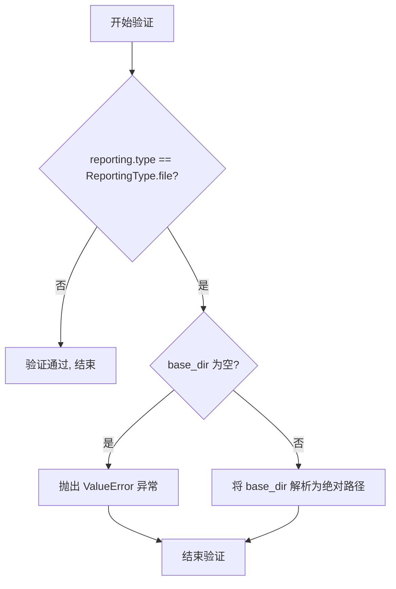

#### 带注释源码

```python
def _validate_reporting_base_dir(self) -> None:
    """Validate the reporting base directory.
    
    当 reporting 类型为文件存储时，确保 base_dir 已配置且不为空，
    并将其解析为绝对路径以确保路径的一致性。
    """
    # 检查 reporting 配置的存储类型是否为文件类型
    if self.reporting.type == ReportingType.file:
        # 验证 base_dir 是否已配置（不能为空字符串或仅包含空白字符）
        if self.reporting.base_dir.strip() == "":
            # 构造详细的错误消息，指导用户如何修复配置
            msg = "Reporting base directory is required for file reporting. Please rerun `graphrag init` and set the reporting configuration."
            raise ValueError(msg)
        # 将相对路径解析为绝对路径，确保后续文件操作的一致性
        self.reporting.base_dir = str(Path(self.reporting.base_dir).resolve())
```


### `GraphRagConfig._validate_vector_store`

该方法用于在 GraphRAG 上下文中验证向量存储配置，检查并为所有必需的嵌入设置动态默认值。

参数：

- 无（仅使用 `self` 隐式参数）

返回值：`None`，无返回值

#### 流程图

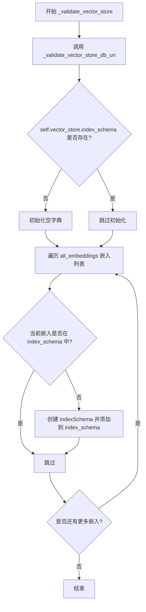

#### 带注释源码

```python
def _validate_vector_store(self) -> None:
    """Validate the vector store configuration specifically in the GraphRAG context. This checks and sets required dynamic defaults for the embeddings we require."""
    # 首先验证向量存储的数据库 URI
    self._validate_vector_store_db_uri()
    
    # 检查并插入/覆盖所有核心嵌入的 schema
    # 注意：这里并不要求这些嵌入被实际使用，只需要它们有 schema 定义
    # 实际的嵌入列表在 embed_text 配置块中
    
    # 如果 index_schema 不存在，则初始化为空字典
    if not self.vector_store.index_schema:
        self.vector_store.index_schema = {}
    
    # 遍历所有已知的嵌入模型
    for embedding in all_embeddings:
        # 如果该嵌入尚未在 index_schema 中定义，则为其创建默认的 IndexSchema
        if embedding not in self.vector_store.index_schema:
            self.vector_store.index_schema[embedding] = IndexSchema(
                index_name=embedding,
            )
```


### `GraphRagConfig._validate_vector_store_db_uri`

验证向量存储的数据库 URI 配置，确保 LanceDB 类型的向量存储具有有效的数据库 URI，并将其解析为绝对路径。

参数：
- 该方法无显式参数（隐式参数 `self` 为 `GraphRagConfig` 实例）

返回值：`None`，无返回值

#### 流程图

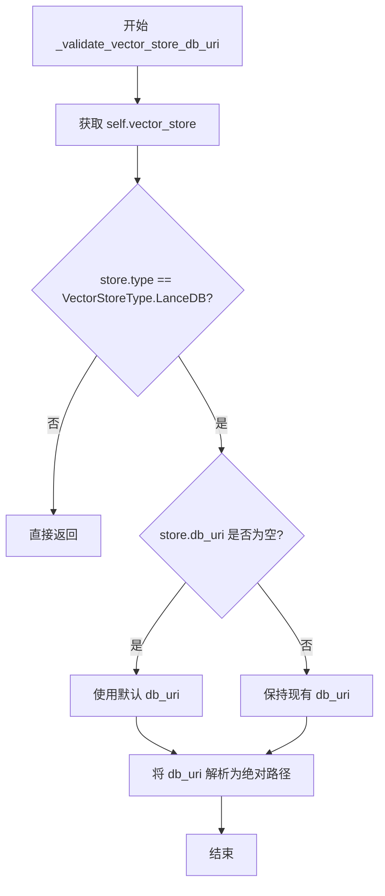

#### 带注释源码

```python
def _validate_vector_store_db_uri(self) -> None:
    """Validate the vector store configuration."""
    # 获取当前向量存储配置对象
    store = self.vector_store
    
    # 仅对 LanceDB 类型的向量存储进行 URI 验证
    if store.type == VectorStoreType.LanceDB:
        # 检查数据库 URI 是否为空或仅包含空白字符
        # 注意：这里存在一个潜在 bug，store.db_uri.strip 应该是 store.db_uri.strip()
        if not store.db_uri or store.db_uri.strip == "":
            # 如果为空，使用配置默认值
            store.db_uri = graphrag_config_defaults.vector_store.db_uri
        
        # 将 URI 解析为绝对路径并转换为字符串
        store.db_uri = str(Path(store.db_uri).resolve())
```


### `GraphRagConfig.get_completion_model_config`

根据给定的模型 ID 获取对应的 completion model 配置。

参数：

-  `model_id`：`str`，要获取的模型的 ID，应与 completion_models 字典中的某个键匹配。

返回值：`ModelConfig`，如果找到则返回对应的模型配置。

异常：

-  `ValueError`：如果模型 ID 在配置中未找到。

#### 流程图

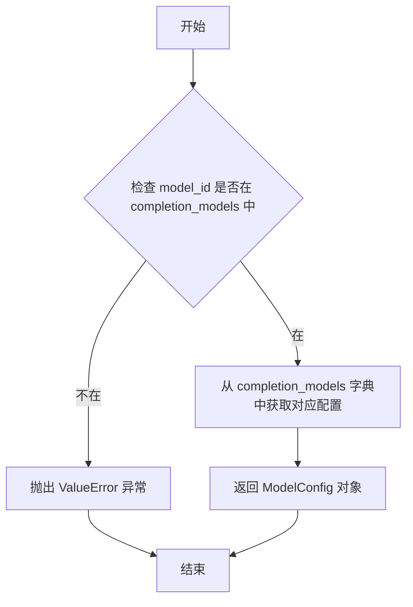

#### 带注释源码

```python
def get_completion_model_config(self, model_id: str) -> ModelConfig:
    """Get a completion model configuration by ID.

    Parameters
    ----------
    model_id : str
        The ID of the model to get. Should match an ID in the completion_models list.

    Returns
    -------
    ModelConfig
        The model configuration if found.

    Raises
    ------
    ValueError
        If the model ID is not found in the configuration.
    """
    # 检查 model_id 是否存在于 completion_models 字典中
    if model_id not in self.completion_models:
        # 构建错误消息，包含有效的 model_id 列表建议
        err_msg = f"Model ID {model_id} not found in completion_models. Please rerun `graphrag init` and set the completion_models configuration."
        # 抛出 ValueError 异常
        raise ValueError(err_msg)

    # 返回指定 model_id 对应的 ModelConfig 对象
    return self.completion_models[model_id]
```


### `GraphRagConfig.get_embedding_model_config`

获取嵌入模型配置的方法，根据模型 ID 返回对应的嵌入模型配置。

参数：

- `model_id`：`str`，要获取的嵌入模型的 ID，应与 embedding_models 列表中的 ID 匹配

返回值：`ModelConfig`，如果找到则返回对应的模型配置

#### 流程图

```mermaid
flowchart TD
    A[开始] --> B{检查 model_id 是否在 embedding_models 中}
    B -->|是| C[返回 embedding_models[model_id] 的值]
    B -->|否| D[构造错误消息]
    D --> E[抛出 ValueError 异常]
    C --> F[结束]
    E --> F
```

#### 带注释源码

```python
def get_embedding_model_config(self, model_id: str) -> ModelConfig:
    """Get an embedding model configuration by ID.

    获取嵌入模型配置的方法。根据 model_id 在 embedding_models 字典中查找对应的配置。

    Parameters
    ----------
    model_id : str
        The ID of the model to get. Should match an ID in the embedding_models list.
        要获取的模型的 ID，应与 embedding_models 列表中的某个 ID 匹配。

    Returns
    -------
    ModelConfig
        The model configuration if found.
        如果找到则返回对应的 ModelConfig 对象。

    Raises
    ------
    ValueError
        If the model ID is not found in the configuration.
        如果 model_id 不在 embedding_models 字典中，则抛出 ValueError 异常。
    """
    # 检查传入的 model_id 是否存在于 embedding_models 字典中
    if model_id not in self.embedding_models:
        # 如果不存在，构造详细的错误消息，包含具体的 model_id 和修复建议
        err_msg = f"Model ID {model_id} not found in embedding_models. Please rerun `graphrag init` and set the embedding_models configuration."
        # 抛出 ValueError 异常，提示用户重新初始化配置
        raise ValueError(err_msg)

    # 如果存在，直接从字典中返回对应的 ModelConfig 对象
    return self.embedding_models[model_id]
```


### `GraphRagConfig._validate_model`

该方法是一个 Pydantic 模型验证器（`model_validator`），在模型验证阶段自动调用，用于验证输入、输出、报告、存储等多个配置目录的有效性，并确保向量存储配置正确。

参数：

- 该方法无显式外部参数（`self` 为隐式参数）

返回值：`GraphRagConfig`，返回验证后的自身实例以支持链式调用

#### 流程图

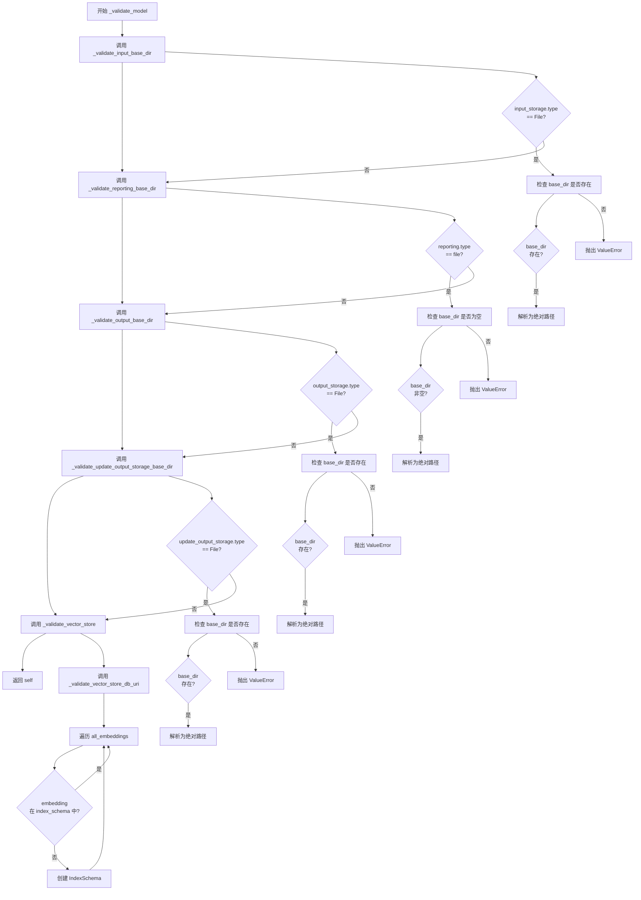

#### 带注释源码

```python
@model_validator(mode="after")
def _validate_model(self):
    """Validate the model configuration.
    
    这是一个 Pydantic model_validator，mode="after" 表示在其他字段验证完成后执行。
    该方法验证多个配置目录的有效性，并确保向量存储配置包含所有必需的嵌入索引。
    
    验证内容：
    1. input_storage 的 base_dir（当类型为 File 时必需）
    2. reporting 的 base_dir（当类型为 file 时必需）
    3. output_storage 的 base_dir（当类型为 File 时必需）
    4. update_output_storage 的 base_dir（当类型为 File 时必需）
    5. vector_store 的 db_uri（当类型为 LanceDB 时设置默认值）
    6. vector_store 的 index_schema（为所有嵌入模型创建索引架构）
    
    Returns:
        GraphRagConfig: 验证通过后返回自身实例
        
    Raises:
        ValueError: 当任何必需的目录配置缺失或无效时
    """
    # 验证输入存储的 base directory
    # 如果使用文件存储类型，必须提供有效的 base_dir 路径
    self._validate_input_base_dir()
    
    # 验证报告配置的 base directory
    # 如果使用文件报告类型，必须提供有效的 base_dir 路径
    self._validate_reporting_base_dir()
    
    # 验证输出存储的 base directory
    # 如果使用文件输出类型，必须提供有效的 base_dir 路径
    self._validate_output_base_dir()
    
    # 验证更新输出存储的 base directory
    # 如果使用文件输出类型，必须提供有效的 base_dir 路径
    self._validate_update_output_storage_base_dir()
    
    # 验证并初始化向量存储配置
    # 包括检查 db_uri 和为所有嵌入模型创建默认索引架构
    self._validate_vector_store()
    
    # 返回验证后的实例以支持链式调用
    return self
```


### `GraphRagConfig.__repr__`

该方法为 GraphRagConfig 类提供调试友好的字符串表示形式，用于在开发调试时查看配置对象的完整内容。

参数：

- `self`：`GraphRagConfig`，当前配置实例对象

返回值：`str`，返回格式化后的配置对象字符串表示

#### 流程图

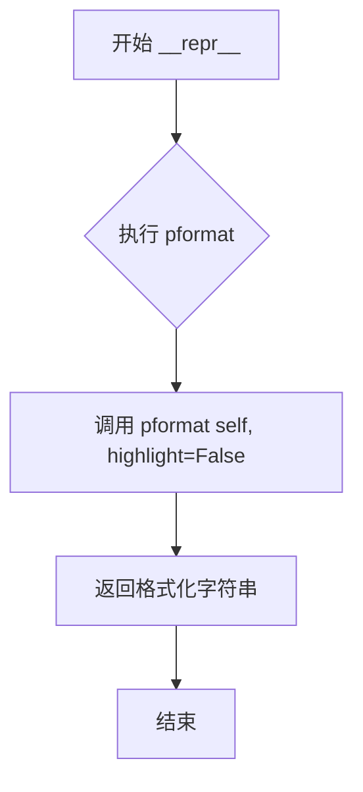

#### 带注释源码

```python
def __repr__(self) -> str:
    """Get a string representation.
    
    该方法继承自 Python 的基类方法重写,用于提供对象的调试友好表示。
    与 __str__ 不同,__repr__ 旨在提供尽可能多的调试信息。
    
    Parameters
    ----------
    self : GraphRagConfig
        当前配置实例,包含所有 GraphRAG 配置项。
        
    Returns
    -------
    str
        返回使用 devtools 库的 pformat 函数格式化后的字符串。
        highlight=False 表示不使用高亮颜色,适合纯文本环境调试。
        
    Notes
    -----
    - 该方法与 __str__ 方法不同:
      - __repr__: 使用 pformat,提供更详细的调试信息
      - __str__: 使用 model_dump_json,提供更友好的 JSON 格式输出
    - pformat 来自 devtools 库,专用于美化 Python 数据结构的输出
    """
    return pformat(self, highlight=False)
```


### `GraphRagConfig.__str__`

将 GraphRagConfig 配置对象转换为格式化的 JSON 字符串表示，方便人类阅读和调试。

参数：

- `self`：`GraphRagConfig`，隐式参数，表示配置对象本身

返回值：`str`，返回配置对象的 JSON 格式字符串表示，使用 4 个空格缩进

#### 流程图

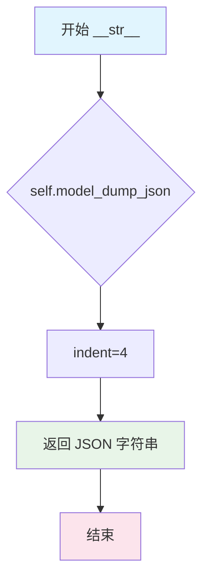

#### 带注释源码

```python
def __str__(self):
    """Get a string representation."""
    # 调用 Pydantic BaseModel 的 model_dump_json 方法
    # indent=4 表示使用 4 个空格进行 JSON 格式化缩进
    # 返回一个格式化的 JSON 字符串，用于人类可读的配置输出
    return self.model_dump_json(indent=4)
```

#### 补充说明

| 项目 | 说明 |
|------|------|
| **设计目标** | 提供人类可读的配置输出格式，便于调试和日志记录 |
| **与 `__repr__` 的区别** | `__repr__` 使用 `pformat` 返回 Python 对象格式，而本方法返回标准 JSON 格式 |
| **依赖** | Pydantic BaseModel 的 `model_dump_json()` 方法 |
| **使用场景** | 打印配置对象、日志输出、API 响应等需要格式化输出的场景 |


### `GraphRagConfig._validate_input_base_dir`

验证输入存储的基础目录。当输入存储类型为文件存储时，确保基础目录已设置并解析为绝对路径。

参数：

- `self`：`GraphRagConfig`，类实例本身，包含 `input_storage` 属性用于验证

返回值：`None`，无返回值，仅执行验证逻辑

#### 流程图

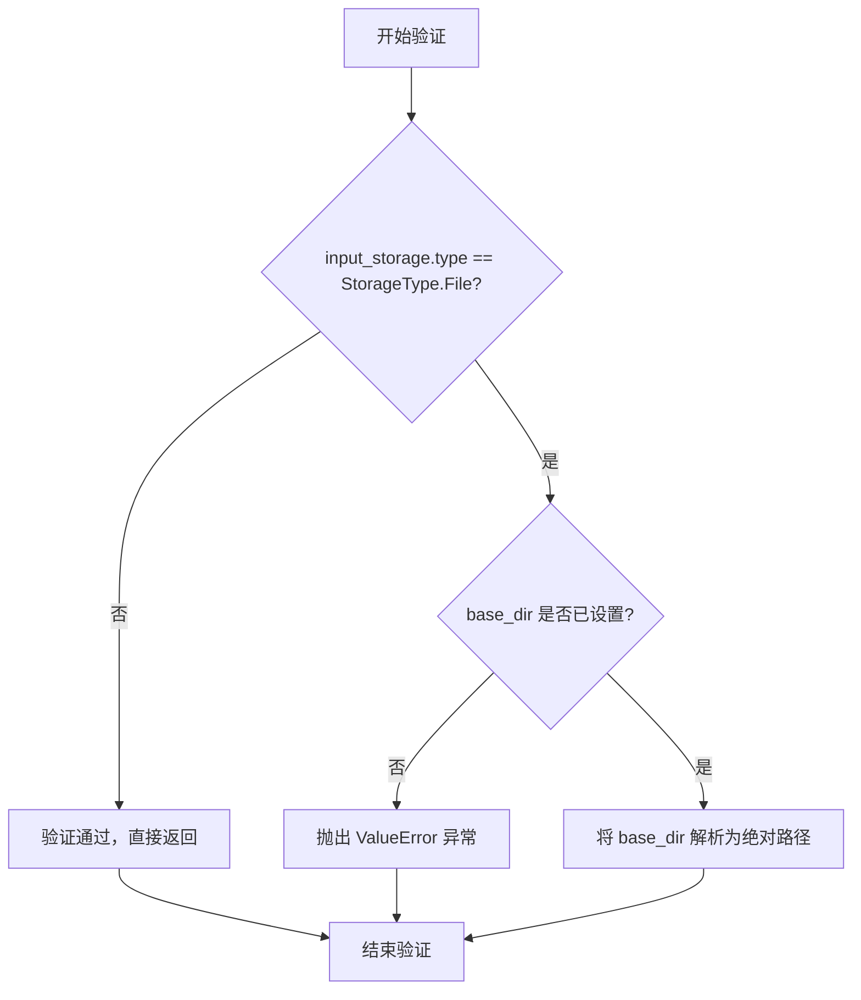

#### 带注释源码

```python
def _validate_input_base_dir(self) -> None:
    """Validate the input base directory."""
    # 检查输入存储类型是否为文件存储
    if self.input_storage.type == StorageType.File:
        # 如果是文件存储，检查 base_dir 是否已设置
        if not self.input_storage.base_dir:
            # 未设置则抛出详细的错误信息，指导用户重新初始化配置
            msg = "input storage base directory is required for file input storage. Please rerun `graphrag init` and set the input storage configuration."
            raise ValueError(msg)
        # 将相对路径解析为绝对路径，确保路径的一致性
        self.input_storage.base_dir = str(
            Path(self.input_storage.base_dir).resolve()
        )
```


### `GraphRagConfig._validate_output_base_dir`

该方法用于验证输出存储的基础目录配置，确保在使用文件存储类型时，输出目录路径已正确设置且不为空，若未设置则抛出明确的错误提示，并将路径解析为绝对路径。

参数：
- `self`：`GraphRagConfig`，当前配置实例本身

返回值：`None`，该方法不返回任何值，仅执行验证和路径处理操作

#### 流程图

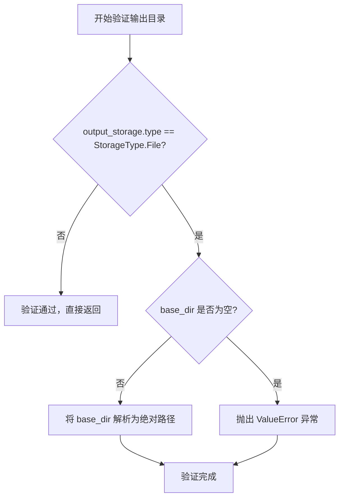

#### 带注释源码

```python
def _validate_output_base_dir(self) -> None:
    """Validate the output base directory."""
    # 检查输出存储类型是否为文件存储
    if self.output_storage.type == StorageType.File:
        # 检查基础目录是否已配置
        if not self.output_storage.base_dir:
            # 构建详细的错误消息，指导用户如何解决问题
            msg = "output base directory is required for file output. Please rerun `graphrag init` and set the output configuration."
            raise ValueError(msg)
        # 将相对路径解析为绝对路径，确保路径的一致性和可预测性
        self.output_storage.base_dir = str(
            Path(self.output_storage.base_dir).resolve()
        )
```


### `GraphRagConfig._validate_update_output_storage_base_dir`

验证更新输出存储的基础目录，确保当使用文件类型存储时，base_dir 必须已配置且有效。

参数：
- 该方法无显式参数（隐式接收 `self` 实例）

返回值：`None`，该方法不返回任何值，仅执行验证和路径解析操作

#### 流程图

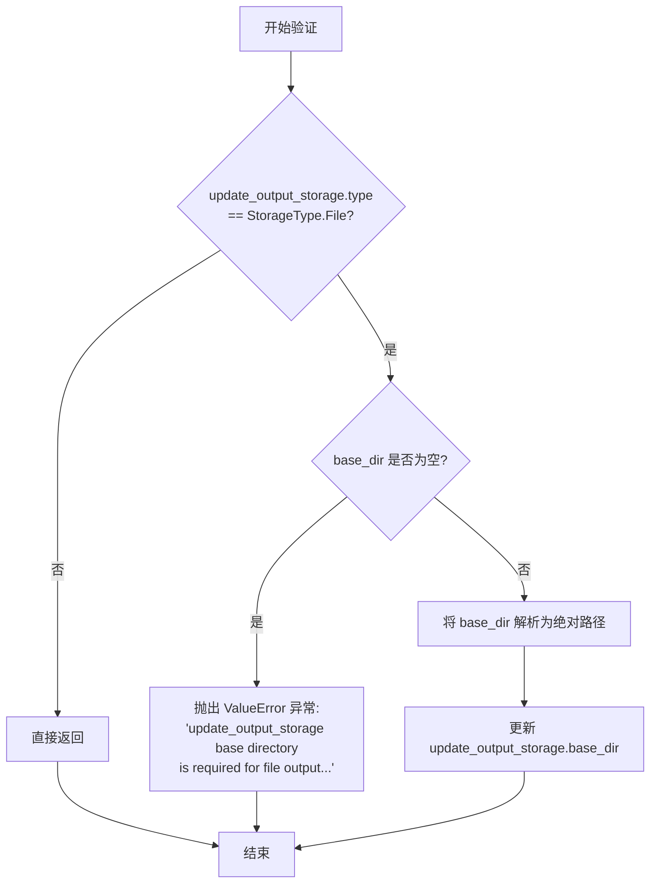

#### 带注释源码

```python
def _validate_update_output_storage_base_dir(self) -> None:
    """Validate the update output base directory."""
    # 检查更新输出存储类型是否为文件存储
    if self.update_output_storage.type == StorageType.File:
        # 如果 base_dir 未设置或为空，抛出明确的错误信息
        if not self.update_output_storage.base_dir:
            msg = "update_output_storage base directory is required for file output. Please rerun `graphrag init` and set the update_output_storage configuration."
            raise ValueError(msg)
        # 将相对路径转换为绝对路径并更新配置
        self.update_output_storage.base_dir = str(
            Path(self.update_output_storage.base_dir).resolve()
        )
```

#### 设计说明

该方法属于配置验证层，通过 `model_validator` 装饰器在模型实例化后自动调用。它确保在使用文件存储类型时，用户必须提供有效的输出目录路径，并将相对路径规范化为绝对路径，以保证后续文件操作的可靠性。


### `GraphRagConfig._validate_reporting_base_dir`

验证报告基础目录。如果报告类型为文件类型，则确保 base_dir 不为空；若为空则抛出 ValueError 异常，否则将 base_dir 解析为绝对路径并更新。

参数：

- `self`：`GraphRagConfig` 实例，隐式参数，用于访问类属性 `reporting`

返回值：`None`，该方法不返回值，仅进行验证和属性更新操作

#### 流程图

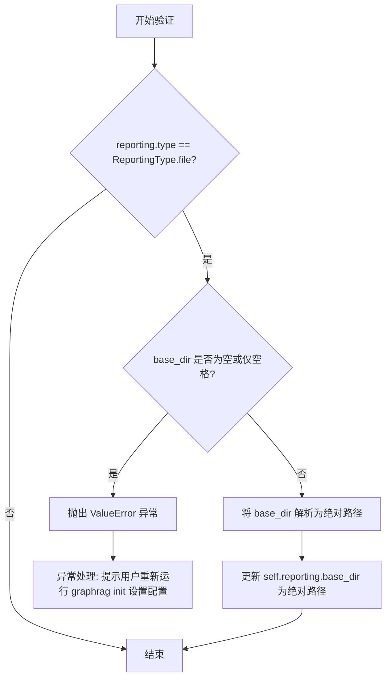

#### 带注释源码

```python
def _validate_reporting_base_dir(self) -> None:
    """Validate the reporting base directory."""
    # 检查报告类型是否为文件类型
    if self.reporting.type == ReportingType.file:
        # 检查 base_dir 是否为空字符串或仅包含空格
        if self.reporting.base_dir.strip() == "":
            # 抛出详细错误信息，指导用户如何修复
            msg = "Reporting base directory is required for file reporting. Please rerun `graphrag init` and set the reporting configuration."
            raise ValueError(msg)
        # 将相对路径解析为绝对路径并更新配置
        self.reporting.base_dir = str(Path(self.reporting.base_dir).resolve())
```


### `GraphRagConfig._validate_vector_store`

验证向量存储配置，具体在 GraphRAG 上下文中进行检查并设置所需的动态默认值。

参数：

- `self`：`GraphRagConfig`，当前配置实例对象

返回值：`None`，无返回值（该方法直接修改实例状态）

#### 流程图

```mermaid
flowchart TD
    A[开始 _validate_vector_store] --> B[调用 _validate_vector_store_db_uri]
    B --> C{vector_store.index_schema 是否存在?}
    C -->|否| D[初始化空字典 index_schema = {}]
    C -->|是| E[跳过初始化]
    D --> F[遍历 all_embeddings 列表]
    E --> F
    F --> G{当前 embedding 是否在 index_schema 中?}
    G -->|是| H[跳过该 embedding]
    G -->|否| I[创建 IndexSchema]
    I --> J[将 IndexSchema 添加到 index_schema]
    H --> K{是否还有更多 embedding?}
    J --> K
    K -->|是| F
    K -->|否| L[结束]
```

#### 带注释源码

```python
def _validate_vector_store(self) -> None:
    """Validate the vector store configuration specifically in the GraphRAG context. This checks and sets required dynamic defaults for the embeddings we require."""
    # 首先调用数据库URI验证方法，确保向量存储的数据库连接配置有效
    self._validate_vector_store_db_uri()
    
    # 检查并插入/覆盖所有核心嵌入的schema
    # 注意：这里并不要求这些嵌入必须被使用，只需要它们有对应的schema定义
    # 实际的嵌入使用情况由 embed_text 配置块决定
    
    # 如果 index_schema 不存在，则初始化为空字典
    if not self.vector_store.index_schema:
        self.vector_store.index_schema = {}
    
    # 遍历所有预定义的嵌入类型，为缺失的嵌入添加默认 schema
    for embedding in all_embeddings:
        if embedding not in self.vector_store.index_schema:
            # 为每个缺失的嵌入创建默认的 IndexSchema
            self.vector_store.index_schema[embedding] = IndexSchema(
                index_name=embedding,
            )
```


### `GraphRagConfig._validate_vector_store_db_uri`

验证向量存储配置中的数据库 URI 是否有效。对于 LanceDB 类型，如果 URI 为空或仅包含空格，则使用默认值，并将 URI 解析为绝对路径。

参数：

- 无显式参数（隐式参数 `self` 为 `GraphRagConfig` 实例）

返回值：`None`，无返回值（方法执行配置验证和修改操作）

#### 流程图

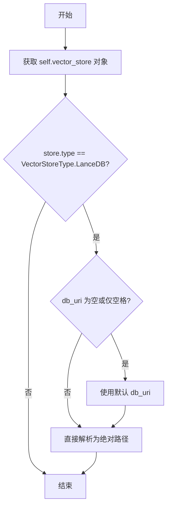

#### 带注释源码

```python
def _validate_vector_store_db_uri(self) -> None:
    """Validate the vector store configuration."""
    # 获取当前向量存储配置对象
    store = self.vector_store
    
    # 仅对 LanceDB 类型的向量存储进行 URI 验证
    if store.type == VectorStoreType.LanceDB:
        # 检查 db_uri 是否为空或仅包含空格
        # 注意：原代码中 store.db_uri.strip == "" 是错误的写法
        # 正确应该是 store.db_uri.strip() == ""
        if not store.db_uri or store.db_uri.strip == "":
            # 如果为空，使用配置默认值
            store.db_uri = graphrag_config_defaults.vector_store.db_uri
        
        # 将相对路径解析为绝对路径
        store.db_uri = str(Path(store.db_uri).resolve())
```

#### 技术债务与潜在问题

1. **代码缺陷**：原代码中 `store.db_uri.strip == ""` 缺少括号，应为 `store.db_uri.strip() == ""`。这会导致条件判断逻辑失效，strip 属性永远不为空字符串。
2. **硬编码依赖**：仅支持 `LanceDB` 类型验证，其他向量存储类型（如 Chroma、Milvus 等）未做处理。
3. **缺乏类型校验**：未验证 `db_uri` 是否为有效路径格式或路径是否可访问。


### `GraphRagConfig.get_completion_model_config`

根据模型ID获取对应的完成模型配置。如果模型ID不存在于配置中，则抛出ValueError异常。

参数：

- `model_id`：`str`，模型ID，应与completion_models字典中的键匹配

返回值：`ModelConfig`，返回找到的模型配置对象

#### 流程图

```mermaid
flowchart TD
    A[开始] --> B{检查model_id是否在completion_models中}
    B -->|是| C[返回completion_models[model_id]]
    B -->|否| D[抛出ValueError]
    D --> E[错误信息: Model ID {model_id} not found in completion_models]
    C --> F[结束]
    E --> F
```

#### 带注释源码

```python
def get_completion_model_config(self, model_id: str) -> ModelConfig:
    """Get a completion model configuration by ID.

    Parameters
    ----------
    model_id : str
        The ID of the model to get. Should match an ID in the completion_models list.

    Returns
    -------
    ModelConfig
        The model configuration if found.

    Raises
    ------
    ValueError
        If the model ID is not found in the configuration.
    """
    # 检查model_id是否存在于completion_models字典中
    if model_id not in self.completion_models:
        # 构建错误消息，包含具体的model_id和修复建议
        err_msg = f"Model ID {model_id} not found in completion_models. Please rerun `graphrag init` and set the completion_models configuration."
        raise ValueError(err_msg)

    # 返回对应的ModelConfig对象
    return self.completion_models[model_id]
```


### `GraphRagConfig.get_embedding_model_config`

获取嵌入模型配置。根据模型 ID 从 embedding_models 字典中检索对应的 ModelConfig，如果未找到则抛出 ValueError 异常。

参数：

- `model_id`：`str`，要获取的模型 ID，应与 embedding_models 列表中的 ID 匹配

返回值：`ModelConfig`，如果找到则返回对应的模型配置

#### 流程图

```mermaid
flowchart TD
    A[开始 get_embedding_model_config] --> B{检查 model_id 是否在 embedding_models 中}
    B -->|是| C[从 embedding_models 字典获取对应配置]
    C --> D[返回 ModelConfig]
    B -->|否| E[构建错误消息]
    E --> F[抛出 ValueError 异常]
    D --> G[结束]
    F --> G
```

#### 带注释源码

```python
def get_embedding_model_config(self, model_id: str) -> ModelConfig:
    """Get an embedding model configuration by ID.

    Parameters
    ----------
    model_id : str
        The ID of the model to get. Should match an ID in the embedding_models list.

    Returns
    -------
    ModelConfig
        The model configuration if found.

    Raises
    ------
    ValueError
        If the model ID is not found in the configuration.
    """
    # 检查提供的 model_id 是否存在于 embedding_models 字典中
    if model_id not in self.embedding_models:
        # 如果未找到，构造详细的错误消息，包含模型 ID 和修复建议
        err_msg = f"Model ID {model_id} not found in embedding_models. Please rerun `graphrag init` and set the embedding_models configuration."
        raise ValueError(err_msg)

    # 找到则返回对应的 ModelConfig 对象
    return self.embedding_models[model_id]
```


### `GraphRagConfig._validate_model`

这是一个 Pydantic 模型验证器方法（`mode="after"`），在所有字段验证完成后自动调用，用于验证模型配置的正确性，包括输入目录、报告目录、输出目录、更新输出存储目录和向量存储配置。

参数：

- `self`：当前 `GraphRagConfig` 实例，隐式参数

返回值：`Self`（`GraphRagConfig` 类型），返回验证后的实例本身，以支持方法链式调用

#### 流程图

```mermaid
flowchart TD
    A[开始 _validate_model] --> B[调用 _validate_input_base_dir]
    B --> C{输入存储类型是否为文件?}
    C -->|是| D[验证并解析输入基础目录]
    C -->|否| E[调用 _validate_reporting_base_dir]
    D --> E
    E --> F{报告类型是否为文件?}
    F -->|是| G[验证并解析报告基础目录]
    F -->|否| H[调用 _validate_output_base_dir]
    G --> H
    H --> I{输出存储类型是否为文件?}
    I -->|是| J[验证并解析输出基础目录]
    I -->|否| K[调用 _validate_update_output_storage_base_dir]
    J --> K
    K --> L{更新输出存储类型是否为文件?}
    L -->|是| M[验证并解析更新输出基础目录]
    L -->|否| N[调用 _validate_vector_store]
    M --> N
    N --> O[调用 _validate_vector_store_db_uri]
    O --> P{向量存储类型是否为 LanceDB?}
    P -->|是| Q[验证并设置数据库 URI]
    P -->|否| R[检查并添加缺失的嵌入索引模式]
    Q --> R
    R --> S[返回 self 实例]
    S --> T[结束]
    
    style A fill:#e1f5fe
    style S fill:#e8f5e8
    style T fill:#fff3e0
```

#### 带注释源码

```python
@model_validator(mode="after")
def _validate_model(self):
    """Validate the model configuration.
    
    这是一个 Pydantic 模型验证器，在所有字段验证完成后执行。
    它依次调用多个私有验证方法来检查不同配置项的有效性。
    
    验证项包括：
    1. 输入存储基础目录（当存储类型为文件时必需）
    2. 报告基础目录（当报告类型为文件时必需）
    3. 输出存储基础目录（当存储类型为文件时必需）
    4. 更新输出存储基础目录（当存储类型为文件时必需）
    5. 向量存储配置（数据库 URI 和索引模式）
    """
    
    # 验证输入基础目录配置
    # 如果输入存储类型为文件类型，则必须提供基础目录
    self._validate_input_base_dir()
    
    # 验证报告基础目录配置
    # 如果报告类型为文件类型，则必须提供基础目录
    self._validate_reporting_base_dir()
    
    # 验证输出基础目录配置
    # 如果输出存储类型为文件类型，则必须提供基础目录
    self._validate_output_base_dir()
    
    # 验证更新输出存储基础目录配置
    # 如果更新输出存储类型为文件类型，则必须提供基础目录
    self._validate_update_output_storage_base_dir()
    
    # 验证向量存储配置
    # 包括数据库 URI 验证和嵌入索引模式检查
    self._validate_vector_store()
    
    # 返回验证后的实例本身，支持方法链式调用
    # 这是 Pydantic model_validator (mode="after") 的标准模式
    return self
```

## 关键组件


### GraphRagConfig

主配置类，用于GraphRAG系统的默认配置参数化设置，继承自Pydantic的BaseModel，封装了所有系统组件的配置项。

### completion_models & embedding_models

模型配置字典，分别存储可用的补全模型和嵌入模型的配置信息，支持通过模型ID获取对应配置。

### async_mode & concurrent_requests

异步模式和并发请求数配置，控制语言模型请求的异步处理方式和并发数量。

### input & input_storage

输入配置和输入存储配置，定义数据输入源及存储方式。

### chunking

分块配置，控制文本分块的大小、重叠、编码模型等参数。

### output_storage & update_output_storage

输出存储配置，定义处理结果的持久化方式和路径。

### cache

缓存配置，控制GraphRAG系统的缓存行为。

### reporting

报告配置，控制日志和报告输出方式。

### vector_store

向量存储配置，管理向量数据库的连接和索引模式。

### workflows

工作流列表配置，定义需要执行的工作流及执行顺序。

### embed_text

文本嵌入配置，控制文本向量化的相关参数。

### extract_graph

实体提取配置，控制从文本中提取图结构实体的参数。

### summarize_descriptions

描述摘要配置，控制实体描述摘要生成的参数。

### extract_graph_nlp

基于NLP的图提取配置，控制自然语言处理相关的图提取参数。

### prune_graph

图剪枝配置，控制图结构优化和剪枝的参数。

### cluster_graph

图聚类配置，控制实体图聚类的参数。

### extract_claims

声明提取配置，控制从文本中提取声明/事实陈述的参数。

### community_reports

社区报告配置，控制社区报告生成的参数。

### snapshots

快照配置，控制数据快照保存的参数。

### local_search & global_search & drift_search & basic_search

搜索配置，分别控制本地搜索、全局搜索、漂移搜索和基本搜索的行为参数。

### _validate_vector_store

向量存储验证方法，检查并设置嵌入所需的动态默认配置和索引模式。

### get_completion_model_config & get_embedding_model_config

模型配置获取方法，根据模型ID返回对应的模型配置，模型不存在时抛出ValueError异常。

### table_provider

表提供者配置，控制表格数据的读写方式和格式。


## 问题及建议


### 已知问题

-   **Bug - 类型检查错误**：在 `_validate_vector_store_db_uri` 方法中，`store.db_uri.strip == ""` 缺少括号调用，应该是 `store.db_uri.strip() == ""`
-   **代码重复**：多个验证方法（`_validate_input_base_dir`、`_validate_output_base_dir`、`_validate_update_output_storage_base_dir`、`_validate_reporting_base_dir`）包含几乎相同的逻辑模式，可以提取为通用方法
-   **错误消息硬编码**：错误消息中多次重复"Please rerun `graphrag init` and set..."的提示文本，可抽取为常量
-   **配置默认值不一致**：部分字段直接内联默认值（如 `ChunkingConfig(...)`），部分从 `graphrag_config_defaults` 导入，维护时容易遗漏同步更新
-   **API错误处理生硬**：`get_completion_model_config` 和 `get_embedding_model_config` 在模型不存在时直接抛出 `ValueError`，缺少友好的错误提示或默认值回退机制

### 优化建议

-   **修复Bug**：将 `store.db_uri.strip == ""` 修正为 `store.db_uri.strip() == ""`
-   **提取通用验证逻辑**：创建 `_validate_storage_base_dir(self, storage: StorageConfig, storage_name: str)` 通用方法来减少重复代码
-   **常量提取**：将重复的错误提示文本定义为模块级常量
-   **增强验证粒度**：将 `_validate_model` 拆分为多个独立验证器，每个负责特定配置域的验证，便于定位问题
-   **考虑配置分组**：当前类承担过多配置职责（约30个字段），可拆分 input、output、storage、model、workflow 等子配置类，通过组合方式构建主配置
-   **改进错误处理**：为模型获取方法添加可选的默认模型参数，或返回 `Optional[ModelConfig]` 并提供更详细的错误上下文

## 其它


### 设计目标与约束

设计目标：本配置类旨在为GraphRAG系统提供统一、可验证、灵活的配置参数化管理能力，支持默认值继承、运行时验证和动态配置补全，使框架各组件能够通过一致的配置对象获取运行所需参数。

设计约束：
1. 必须继承自Pydantic的BaseModel，以利用其自动验证和序列化能力
2. 所有配置字段必须提供默认值或允许为空，以支持最小化配置启动
3. 文件存储类配置（input_storage、output_storage、reporting等）在类型为File时必须提供有效的基础目录
4. 向量存储配置必须包含所有内置embedding模型对应的索引schema
5. 模型配置（completion_models、embedding_models）必须包含model_id作为键值

### 错误处理与异常设计

异常类型与触发条件：

1. **ValueError** - 配置验证失败时抛出
   - input_storage类型为File但base_dir为空或未设置
   - output_storage类型为File但base_dir为空或未设置
   - update_output_storage类型为File但base_dir为空或未设置
   - reporting类型为file但base_dir为空或仅包含空白字符
   - vector_store类型为LanceDB但db_uri为空或仅包含空白字符
   - 请求的model_id不存在于completion_models或embedding_models字典中

错误消息格式：所有错误消息均包含问题描述、修复建议（提示用户重新运行graphrag init并设置相应配置）和具体的配置项名称。

### 数据流与状态机

配置对象生命周期状态机：

1. **初始化状态(Initialized)**：通过构造参数或默认配置创建GraphRagConfig实例，各字段被赋予初始值
2. **验证状态(Validating)**：Pydantic的model_validator(mode="after")自动触发级联验证，按依赖顺序执行：
   - _validate_input_base_dir() → 验证并解析输入存储路径
   - _validate_reporting_base_dir() → 验证并解析报告存储路径
   - _validate_output_base_dir() → 验证并解析输出存储路径
   - _validate_update_output_storage_base_dir() → 验证并解析增量更新输出路径
   - _validate_vector_store() → 验证向量存储配置并补全缺失的embedding schema
3. **就绪状态(Ready)**：验证通过后配置对象可用于各组件查询
4. **查询状态(Querying)**：通过get_completion_model_config()或get_embedding_model_config()根据model_id获取特定模型配置

### 外部依赖与接口契约

核心依赖库：
- pydantic (BaseModel, Field, model_validator)：配置数据模型定义与验证
- pathlib.Path：路径解析与规范化
- devtools.pformat：配置对象的格式化字符串输出
- graphrag_cache.CacheConfig：缓存配置数据类
- graphrag_chunking.ChunkingConfig：文本分块配置
- graphrag_input.InputConfig：输入源配置
- graphrag_llm.ModelConfig：语言模型配置
- graphrag_storage (StorageConfig, StorageType, TableProviderConfig)：存储层配置
- graphrag_vectors (VectorStoreConfig, VectorStoreType, IndexSchema)：向量存储配置
- graphrag.config模块内部各模型配置类

接口契约：
- 所有Field定义的description字段供文档化和IDE自动补全使用
- get_completion_model_config(model_id: str) -> ModelConfig：返回指定ID的完成模型配置，不存在时抛出ValueError
- get_embedding_model_config(model_id: str) -> ModelConfig：返回指定ID的嵌入模型配置，不存在时抛出ValueError
- __str__方法返回JSON格式的完整配置序列化
- __repr__方法返回人类可读的格式化配置

### 配置分层与组合关系

配置结构采用分层设计：
- 基础层：StorageConfig、CacheConfig、ReportingConfig等通用配置
- 核心处理层：ChunkingConfig、ExtractGraphConfig、ExtractClaimsConfig等数据处理配置
- 搜索应用层：LocalSearchConfig、GlobalSearchConfig、DRIFTSearchConfig等搜索功能配置
- 模型层：completion_models和embedding_models字典管理所有可用模型实例

各子配置类通过组合关系嵌入主配置对象，形成树状的配置从属关系。

### 安全性与隐私考量

敏感信息处理：
- 配置中不直接存储API密钥等敏感凭证，模型配置通过ModelConfig引用外部管理的凭证
- 文件路径在验证阶段通过Path.resolve()转换为绝对路径，防止路径注入攻击
- 用户输入的base_dir等路径参数在验证前进行strip()处理，防止空白字符注入

### 可扩展性设计

扩展点：
1. 新增配置块：直接在类中添加新的Field字段即可扩展配置能力
2. 新增验证逻辑：在model_validator中添加新的_validate_xxx方法
3. 自定义存储类型：在StorageType枚举中扩展新的存储类型
4. 自定义搜索算法：新增xxxSearchConfig配置类并在主配置中注册

默认值来源：所有默认值统一引用graphrag_config_defaults模块，实现默认值与业务逻辑的解耦。


    