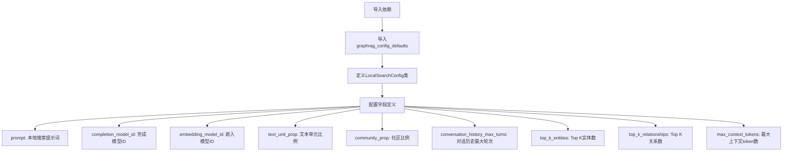

# `graphrag\packages\graphrag\graphrag\config\models\local_search_config.py` 详细设计文档

这是一个配置参数定义文件，通过Pydantic框架定义了本地搜索（Local Search）的配置参数类，包含模型ID、文本单元比例、社区比例、对话历史最大轮次、top k实体/关系数量以及最大上下文token数等配置项，用于GraphRAG系统的本地搜索功能定制。

## 整体流程



## 类结构

```
BaseModel (Pydantic基类)
└── LocalSearchConfig (本地搜索配置类)
```

## 全局变量及字段


### `graphrag_config_defaults`
    
graphrag默认配置模块，提供local_search各参数的默认值

类型：`Module`
    


### `LocalSearchConfig.prompt`
    
本地搜索使用的提示词模板

类型：`str | None`
    


### `LocalSearchConfig.completion_model_id`
    
用于本地搜索的完成模型标识符

类型：`str`
    


### `LocalSearchConfig.embedding_model_id`
    
用于文本嵌入的模型标识符

类型：`str`
    


### `LocalSearchConfig.text_unit_prop`
    
文本单元在上下文中的比例因子

类型：`float`
    


### `LocalSearchConfig.community_prop`
    
社区信息在上下文中的比例因子

类型：`float`
    


### `LocalSearchConfig.conversation_history_max_turns`
    
对话历史记录的最大轮数

类型：`int`
    


### `LocalSearchConfig.top_k_entities`
    
检索时返回的Top K实体数量

类型：`int`
    


### `LocalSearchConfig.top_k_relationships`
    
检索时返回的Top K关系数量

类型：`int`
    


### `LocalSearchConfig.max_context_tokens`
    
上下文窗口的最大token数量限制

类型：`int`
    
    

## 全局函数及方法


## 关键组件


## 一段话描述

该代码定义了一个名为 `LocalSearchConfig` 的 Pydantic 配置类，用于配置本地搜索（Local Search）功能的各项参数，包括模型选择、文本单元比例、社区比例、对话历史轮数、top-k 实体/关系数量以及最大上下文 token 数，并从 `graphrag_config_defaults` 模块获取这些配置项的默认值。

## 文件的整体运行流程

1. 导入 `pydantic` 的 `BaseModel` 和 `Field` 用于数据验证和字段定义
2. 导入 `graphrag_config_defaults` 模块获取默认配置值
3. 定义 `LocalSearchConfig` 类继承自 `BaseModel`
4. 在类内部定义多个配置字段，每个字段使用 `Field` 指定描述信息和默认值
5. 默认值通过 `graphrag_config_defaults.local_search.XXX` 动态获取

## 类的详细信息

### LocalSearchConfig 类

**类字段：**

| 字段名称 | 类型 | 描述 |
|---------|------|------|
| prompt | str \| None | 本地搜索提示词 |
| completion_model_id | str | 用于本地搜索的模型ID |
| embedding_model_id | str | 用于文本嵌入的模型ID |
| text_unit_prop | float | 文本单元比例 |
| community_prop | float | 社区比例 |
| conversation_history_max_turns | int | 对话历史最大轮数 |
| top_k_entities | int | 前k个映射实体 |
| top_k_relationships | int | 前k个映射关系 |
| max_context_tokens | int | 最大token数 |

**类方法：**

该类继承自 Pydantic BaseModel，自动生成 `model_dump()`、`model_validate()`、`model_json_schema()` 等方法，无需手动定义。

## 全局变量和全局函数

| 名称 | 类型 | 描述 |
|-----|------|------|
| graphrag_config_defaults | 模块 | 存储 GraphRAG 默认配置值的模块 |

## 关键组件信息

### LocalSearchConfig

用于本地搜索的 Pydantic 配置模型，封装了本地搜索所需的所有配置参数。

### prompt 字段

本地搜索的提示词模板，支持自定义。

### completion_model_id 字段

指定用于生成completion的模型标识符。

### embedding_model_id 字段

指定用于生成文本嵌入的模型标识符。

### text_unit_prop 字段

控制文本单元在上下文中的比例权重。

### community_prop 字段

控制社区信息在上下文中的比例权重。

### conversation_history_max_turns 字段

限制对话历史保留的轮数，用于控制上下文长度。

### top_k_entities 字段

控制返回的实体数量上限。

### top_k_relationships 字段

控制返回的关系数量上限。

### max_context_tokens 字段

限制上下文的最大token数，防止超出模型限制。

## 潜在的技术债务或优化空间

1. **硬编码依赖**: 配置默认值直接依赖 `graphrag_config_defaults` 模块，如果该模块不存在会导致导入错误
2. **缺少验证器**: 数值字段（如比例、token数）缺少范围验证，可能导致无效配置
3. **文档完善**: 缺少类的文档字符串说明其用途
4. **类型注解**: 使用了 Python 3.10+ 的联合类型语法 `str | None`，需确保项目运行环境支持

## 其它项目

### 设计目标与约束

- 使用 Pydantic v2 进行配置管理
- 配置值通过 Field 提供描述信息，便于自动生成文档
- 默认值集中管理，便于统一修改

### 错误处理与异常设计

- Pydantic 自动验证配置类型和必填字段
- 缺失的必填字段会抛出 ValidationError

### 数据流与状态机

- 该配置类作为只读配置对象，不涉及状态机设计

### 外部依赖与接口契约

- 依赖 `pydantic >= 2.0`
- 依赖 `graphrag_config_defaults` 模块提供默认值


## 问题及建议


### 已知问题

-   **缺少数值范围验证**：配置字段如 `text_unit_prop`、`community_prop` 理论上应限制在 0-1 范围内，`top_k_entities`、`top_k_relationships`、`max_context_tokens` 应为正整数，但当前 Pydantic 仅做类型检查，未添加 `gt`、`ge`、`le`、`lt` 等约束验证器。
-   **默认值外部依赖**：所有字段默认值均依赖 `graphrag_config_defaults.local_search` 模块，若该模块不存在或结构变化将导致整个配置类无法实例化，增加了模块间的耦合度。
-   **类级别文档缺失**：类文档字符串仅说明是 "Cache 的默认配置段"，与实际功能（Local Search 配置）不符，缺乏对配置用途、使用场景的整体说明。
-   **无配置冻结保护**：配置类未设置 `model_config` 或 `frozen=True`，实例创建后可被修改，在多线程或并发场景下存在意外修改风险。
-   **类型注解一致性**：`prompt` 字段使用 `str | None`（Python 3.10+ 联合类型语法），而其他字段使用基础类型，在不支持该语法（旧版 Python）或部分支持的代码库中可能引发兼容性问题。
-   **缺少业务规则约束**：未对 `conversation_history_max_turns` 设置合理上限，可能导致上下文过长影响性能。

### 优化建议

-   **添加数值范围验证**：使用 Pydantic 的 `Field(..., ge=0.0, le=1.0)` 装饰器对比例类字段进行范围约束，对整数类字段添加 `ge=1` 等正整数约束。
-   **解耦默认值依赖**：考虑在类内部定义常量默认值，或使用 `__init__` 方法在默认值缺失时提供备选值，降低对外部模块的强耦合。
-   **完善文档注释**：为类添加准确的文档字符串，说明其用途、适用场景及与其他配置模块的关系。
-   **启用配置冻结**：设置 `model_config = ConfigDict(frozen=True)` 防止配置实例被意外修改，提升线程安全性。
-   **统一类型注解风格**：统一使用 `Optional[str]` 替代 `str | None` 以保持与旧版 Python 的兼容性，或在项目明确要求下保持现状。
-   **增加边界检查**：为 `conversation_history_max_turns` 添加合理的上限约束（如 `le=50`），避免无限制的历史记录导致上下文膨胀。
-   **考虑配置分层**：将配置按功能拆分为子模型（如 EmbeddingConfig、LLMConfig），通过嵌套模型提升配置的可维护性和复用性。


## 其它


### 设计目标与约束

**设计目标**：
- 提供本地搜索模块的统一配置接口
- 支持通过 Pydantic 进行配置验证
- 提供合理的默认配置值，减少用户配置负担

**设计约束**：
- 必须继承自 Pydantic 的 BaseModel
- 所有配置项必须有默认值
- 配置值必须与 `graphrag_config_defaults` 保持一致

### 错误处理与异常设计

- **配置缺失**：如果 `graphrag_config_defaults` 中对应配置项不存在，将抛出 `AttributeError`
- **类型错误**：Pydantic 会在初始化时自动验证类型，如果类型不匹配会抛出 `ValidationError`
- **默认值加载失败**：如果 `graphrag_config_defaults.local_search` 属性不存在，会导致属性访问错误

### 数据流与状态机

**数据流**：
1. 应用启动时加载 `graphrag_config_defaults` 中的默认配置
2. 用户可以通过覆盖 `LocalSearchConfig` 的字段来自定义配置
3. 配置对象在初始化时进行 Pydantic 验证
4. 验证通过的配置对象传递给本地搜索模块使用

**状态机**：该配置类为无状态的数据模型，仅存储配置参数，不涉及状态转换

### 外部依赖与接口契约

**外部依赖**：
- `pydantic.BaseModel`：用于配置数据模型定义和验证
- `pydantic.Field`：用于定义配置字段的元数据
- `graphrag.config.defaults.graphrag_config_defaults`：提供默认配置值

**接口契约**：
- 此类作为配置输入接口，被本地搜索模块消费
- 返回类型为 `LocalSearchConfig` 实例
- 所有字段为可选（有默认值），实例化时可不传入参数

### 配置管理策略

- 采用分层配置策略：默认配置 → 全局配置 → 实例配置
- 默认值统一从 `graphrag_config_defaults` 集中管理
- 支持配置继承和覆盖机制

### 安全性考虑

- **输入验证**：Pydantic 自动对输入类型进行验证，防止无效配置
- **敏感信息**：当前配置不包含敏感信息，但建议对包含密钥的字段进行额外保护

### 性能考虑

- 配置类为轻量级数据对象，内存占用小
- 字段类型使用 Python 内置类型或简单类型，无复杂计算

### 版本兼容性

- 依赖 `pydantic` 库，需确保版本兼容性（建议 pydantic v2）
- 配置结构可能随 `graphrag_config_defaults` 的变化而需要同步更新

### 测试策略

- **单元测试**：测试配置类的字段验证、默认值加载
- **集成测试**：测试配置与 `graphrag_config_defaults` 的集成
- **边界测试**：测试各字段的边界值（如负数、超出范围的比例值等）

### 使用示例

```python
# 使用默认配置
config = LocalSearchConfig()

# 自定义部分配置
config = LocalSearchConfig(
    completion_model_id="gpt-4",
    top_k_entities=10
)

# 从配置字典加载
config = LocalSearchConfig.model_validate({"completion_model_id": "gpt-3.5-turbo"})
```

### 继承关系

- `LocalSearchConfig` 继承自 `pydantic.BaseModel`
- 无子类继承

### 配置验证规则

| 字段名 | 验证规则 |
|--------|----------|
| prompt | 字符串类型，可为 None |
| completion_model_id | 非空字符串 |
| embedding_model_id | 非空字符串 |
| text_unit_prop | 0.0 到 1.0 之间的浮点数 |
| community_prop | 0.0 到 1.0 之间的浮点数 |
| conversation_history_max_turns | 正整数 |
| top_k_entities | 正整数 |
| top_k_relationships | 正整数 |
| max_context_tokens | 正整数 |

### 字段之间的依赖关系

- `max_context_tokens` 与 `text_unit_prop`、`community_prop` 共同决定上下文大小
- `top_k_entities` 和 `top_k_relationships` 受 `max_context_tokens` 约束

### 序列化/反序列化支持

- 支持通过 `model_dump()` 方法序列化为字典
- 支持通过 `model_validate()` 方法从字典反序列化
- 支持 JSON 序列化（通过 `model_dump_json()`）

    