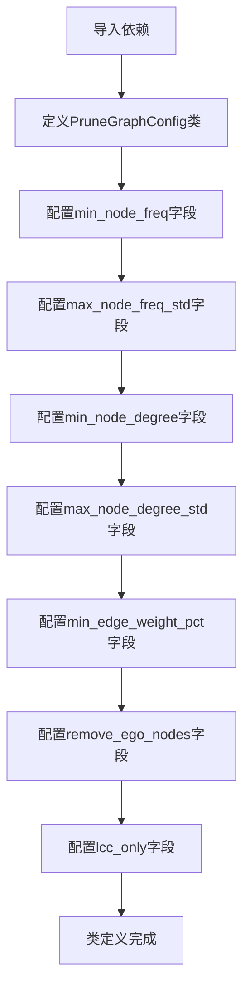

# `graphrag\packages\graphrag\graphrag\config\models\prune_graph_config.py` 详细设计文档

这是一个图剪枝配置类，继承自Pydantic的BaseModel，用于定义图数据处理过程中的剪枝参数，包括节点频率、节点度数、边权重百分位等过滤条件，以及是否移除自我节点和仅保留最大连通分量的选项。

## 整体流程



## 类结构

```
PruneGraphConfig (Pydantic配置模型)
└── BaseModel (Pydantic基类)
```

## 全局变量及字段


### `graphrag_config_defaults`
    
从 graphrag.config.defaults 导入的默认配置模块，提供各配置项的默认值

类型：`module`
    


### `PruneGraphConfig.min_node_freq`
    
允许的最小节点出现频率

类型：`int`
    


### `PruneGraphConfig.max_node_freq_std`
    
允许的节点频率最大标准差

类型：`float | None`
    


### `PruneGraphConfig.min_node_degree`
    
允许的最小节点度数

类型：`int`
    


### `PruneGraphConfig.max_node_degree_std`
    
允许的节点度数最大标准差

类型：`float | None`
    


### `PruneGraphConfig.min_edge_weight_pct`
    
允许的最小边权重百分位数

类型：`float`
    


### `PruneGraphConfig.remove_ego_nodes`
    
是否移除自我中心节点

类型：`bool`
    


### `PruneGraphConfig.lcc_only`
    
是否仅使用最大连通分量

类型：`bool`
    
    

## 全局函数及方法


## 关键组件


### PruneGraphConfig

图剪枝配置类，用于定义图数据处理过程中的各种剪枝参数，包括节点频率、节点度数、边权重等过滤条件。

### min_node_freq

最小节点频率配置项，用于过滤掉出现次数低于指定阈值的节点。

### max_node_freq_std

最大节点频率标准差配置项，用于控制节点频率的统计分布上限。

### min_node_degree

最小节点度数配置项，用于移除连接数少于指定阈值的节点。

### max_node_degree_std

最大节点度数标准差配置项，用于控制节点连接数的统计分布上限。

### min_edge_weight_pct

最小边权重百分比配置项，用于过滤权重低于指定百分位的边。

### remove_ego_nodes

自我节点移除开关，用于控制是否移除只与自身连接的孤立节点。

### lcc_only

最大连通分量开关，用于控制是否仅保留图中最大的连通分量。


## 问题及建议


### 已知问题

-   **类型注解兼容性**：`float | None` 联合类型仅在 Python 3.10+ 中受支持，可能与旧版本 Python 或某些类型检查工具不兼容。
-   **数值逻辑缺乏验证**：缺少 Pydantic 验证器确保 `min_node_freq` 与 `max_node_freq_std`、`min_node_degree` 与 `max_node_degree_std` 之间的逻辑关系（如上界应大于下界）。
-   **字段描述歧义**：`min_edge_weight_pct` 字段描述示例为 `40` 表示 40%，但字段名包含 `pct`，实际使用数值可能造成混淆（应明确是 40 还是 0.4）。
-   **默认值依赖隐藏**：所有默认值嵌套引用 `graphrag_config_defaults` 对象，增加了代码追踪难度，且如果该对象不存在会导致运行时错误。
-   **文档不足**：类文档字符串过于简略，未说明配置的使用场景、影响范围和典型用例。

### 优化建议

-   **添加数值范围验证器**：使用 Pydantic 的 `@field_validator` 装饰器验证数值合理性（如频率、标准差非负，百分位在 0-100 之间）。
-   **明确类型声明**：为保持兼容性，可考虑使用 `Optional[float]` 替代 `float | None`，或确保项目仅支持 Python 3.10+。
-   **统一字段命名和描述**：统一百分位字段的命名和描述，明确是使用原始数值还是归一化值（如 40 vs 0.4）。
-   **增强文档**：为类添加详细的文档说明，包括各配置项的作用、取值范围建议、以及对图处理流程的影响。
-   **配置默认值外置**：考虑将默认值直接定义在配置类中，或提供清晰的默认值加载机制，减少对外部对象的隐式依赖。

## 其它


### 设计目标与约束

本配置类的设计目标是提供一套可复用的图剪枝参数配置机制，使得图处理流程中的剪枝策略可以通过声明式配置进行灵活调整。核心约束包括：所有配置项必须与 `graphrag_config_defaults` 中的默认值保持兼容；参数类型必须遵循 Pydantic 的类型校验规范；配置值必须在合理的业务范围内（例如频率和度数必须为非负整数，边权重百分比必须在0-100之间）。

### 错误处理与异常设计

由于本类继承自 Pydantic 的 BaseModel，类型验证错误会自动由 Pydantic 框架捕获并抛出 ValidationError。具体错误场景包括：1) 类型错误（如传入字符串而非整数）；2) 值域错误（如负数频率或超过100的百分比）；3) 必填字段缺失（虽然本类所有字段均有默认值，不存在此类风险）。开发者可通过 try-except 捕获 `ValidationError` 并获取详细的错误信息，包括字段名、错误类型和期望值。

### 数据流与状态机

本配置类在数据流中处于上游位置，属于配置初始化阶段。典型调用流程为：`PruneGraphConfig` 实例化 → 配置注入到图处理pipeline → 各剪枝算法读取对应参数 → 执行图剪枝操作。状态机方面，本类本身无状态，仅作为配置容器；但下游使用时存在隐式状态转换：初始配置加载 → 参数校验 → 配置冻结（只读）→ 实际剪枝执行。

### 外部依赖与接口契约

本类依赖两个外部模块：1) `pydantic` 框架（提供 BaseModel、Field 及自动验证功能）；2) `graphrag.config.defaults` 模块（提供默认值来源）。接口契约方面，本类必须实现 `BaseModel` 的标准接口，包括 `.model_validate()`、`.model_dump()`、`.model_json_schema()` 等方法。调用方需保证传入的配置值类型与 Pydantic 注解一致，且在使用前调用 `.model_validate()` 进行显式校验（若从dict加载）。

### 配置验证规则

除 Pydantic 内置的类型校验外，本配置类还需满足以下业务规则：`min_node_freq` 和 `min_node_degree` 必须为非负整数；`min_edge_weight_pct` 必须在0-100范围内；当 `max_node_freq_std` 或 `max_node_degree_std` 设置为 None 时，表示不启用标准差过滤；`lcc_only` 为 True 时将只保留最大连通分量。

### 使用示例

```python
# 使用默认配置
config = PruneGraphConfig()

# 自定义配置
config = PruneGraphConfig(
    min_node_freq=5,
    max_node_freq_std=2.0,
    min_node_degree=2,
    min_edge_weight_pct=50,
    remove_ego_nodes=True,
    lcc_only=True
)

# 从字典加载（需显式验证）
data = {"min_node_freq": 10, "min_edge_weight_pct": 30}
config = PruneGraphConfig.model_validate(data)
```

### 版本历史与兼容性

当前版本为 1.0.0，属于初始版本。后续若需扩展配置项，应遵循向后兼容原则：新增字段必须提供默认值；不应修改现有字段的名称、类型或默认值行为。本类与 `graphrag_config_defaults` 强耦合，版本升级时需同步更新默认值模块。

    