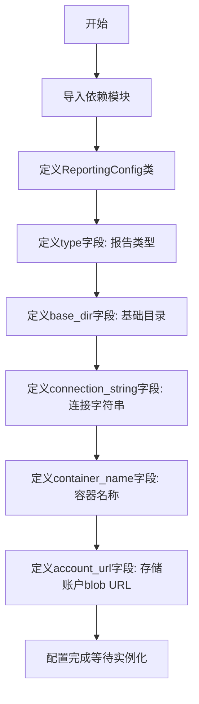

# `graphrag\packages\graphrag\graphrag\config\models\reporting_config.py` 详细设计文档

这是一个用于配置GraphRAG报告模块的Pydantic模型定义文件，提供了报告功能的默认配置参数，包括报告类型、基础目录、连接字符串、容器名称和存储账户blob URL等设置。

## 整体流程



## 类结构

```
BaseModel (Pydantic基类)
└── ReportingConfig (报告配置模型)
```

## 全局变量及字段


### `graphrag_config_defaults`
    
默认配置对象，包含报告模块的默认配置值

类型：`object`
    


### `ReportingType`
    
报告类型枚举，定义可用的报告输出方式

类型：`enum`
    


### `ReportingConfig.type`
    
报告类型配置，指定使用的报告方式

类型：`ReportingType | str`
    


### `ReportingConfig.base_dir`
    
报告基础目录路径，用于存储报告文件

类型：`str`
    


### `ReportingConfig.connection_string`
    
报告连接字符串，用于数据库或存储服务连接

类型：`str | None`
    


### `ReportingConfig.container_name`
    
报告容器名称，用于云存储容器标识

类型：`str | None`
    


### `ReportingConfig.account_url`
    
存储账户blob URL，用于Azure Blob存储访问

类型：`str | None`
    
    

## 全局函数及方法


## 关键组件


### ReportingConfig 类

Pydantic BaseModel 模型类，用于定义报告（Reporting）模块的默认配置参数，包含报告类型、基础目录、连接字符串、容器名称和存储账户URL等配置项。

### type 字段

配置报告类型，支持 ReportingType 枚举或字符串类型，默认值为 graphrag_config_defaults.reporting.type，用于指定使用的报告后端类型。

### base_dir 字段

配置报告的基础目录路径，类型为字符串，默认值为 graphrag_config_defaults.reporting.base_dir，用于指定报告文件的存储根目录。

### connection_string 字段

配置报告的连接字符串，类型为可选字符串，默认值为 graphrag_config_defaults.reporting.connection_string，用于数据库或存储服务的连接认证。

### container_name 字段

配置报告的容器名称，类型为可选字符串，默认值为 graphrag_config_defaults.reporting.container_name，用于云存储服务的容器/桶名称。

### account_url 字段

配置存储账户的Blob URL，类型为可选字符串，默认值为 graphrag_config_defaults.reporting.storage_account_blob_url，用于Azure Blob Storage等云存储的访问端点。

### ReportingType 枚举

从 graphrag.config.enums 导入的枚举类型，定义了可用的报告类型选项，用于约束 type 字段的取值范围。

### graphrag_config_defaults 引用

从 graphrag.config.defaults 导入的默认配置对象，提供了各配置项的默认值，实现了配置值的多层级继承机制。


## 问题及建议


### 已知问题

-   **类型联合运行时安全问题**：`type: ReportingType | str` 使用字符串联合类型，在运行时缺乏足够的类型安全校验，可能导致无效的 reporting type 被接受
-   **默认值依赖潜在循环导入**：字段默认值直接引用 `graphrag_config_defaults.reporting.*`，在模块加载时可能触发循环导入问题，尤其当项目模块较多时
-   **缺少配置验证器**：没有实现字段间的逻辑验证，例如当 `type` 为特定值时，`connection_string`、`container_name`、`account_url` 等字段应满足的约束关系未被校验
-   **Pydantic v2 配置优化缺失**：未使用 `model_config` 或 `model_validator` 进行模型级别的配置优化，可能影响验证性能和灵活性
-   **字段描述不够详尽**：部分字段的 description 较为简略，如 `base_dir` 缺少具体路径格式或约束说明，`account_url` 缺少 URL 格式示例

### 优化建议

-   **添加配置验证器**：使用 `@model_validator` 或 `@field_validator` 验证配置的有效性，例如确保 Azure 类型 reporting 必需字段的完整性
-   **延迟默认值计算**：考虑使用 `Field(default_factory=...)` 动态获取默认值，避免模块级别的循环依赖
-   **增强类型安全**：考虑使用 Pydantic 的 `Literal` 或自定义验证器限制 `type` 字段的合法取值范围
-   **完善文档注释**：为每个字段的 description 添加更多上下文、示例和约束说明，提高配置的可维护性
-   **使用 model_config 优化**：添加 `model_config = ConfigDict(...)` 定制 Pydantic 模型行为，如开启严格模式、优化验证策略等


## 其它


### 设计目标与约束

**设计目标**：为GraphRAG框架提供可配置的Reporting（报告）功能，支持多种报告类型（Azure Blob Storage等），允许用户自定义报告存储位置和连接参数。

**约束条件**：
- 必须继承Pydantic的BaseModel以获得自动验证和序列化能力
- 配置项必须与graphrag_config_defaults模块中的默认值保持一致
- 支持ReportingType枚举与字符串类型的兼容性
- 所有可选配置字段（connection_string、container_name、account_url）可以为None

### 错误处理与异常设计

- **类型验证错误**：Pydantic自动处理类型不匹配错误，当传入的type不是有效的ReportingType或字符串时抛出ValidationError
- **必填字段校验**：所有字段均设有默认值，不存在必填字段缺失问题
- **默认值加载失败**：若graphrag_config_defaults模块中的默认值未正确定义，可能导致Field的default参数引用错误，建议添加默认值加载失败的处理逻辑

### 外部依赖与接口契约

**依赖模块**：
- `pydantic`：用于数据模型定义和验证
- `graphrag.config.defaults`：提供默认配置值（graphrag_config_defaults）
- `graphrag.config.enums`：提供ReportingType枚举

**接口契约**：
- 作为配置类被其他模块实例化使用
- 序列化输出支持JSON格式
- 反序列化时接受dict或JSON字符串

### 配置验证规则

- `type`字段：必须是有效的ReportingType枚举值或字符串，默认值为"console"
- `base_dir`字段：必须是有效的目录路径字符串，默认值为"./output/reporting"
- `connection_string`字段：可选，字符串类型或None，用于Azure Storage连接
- `container_name`字段：可选，字符串类型或None，Azure Blob容器名称
- `account_url`字段：可选，字符串类型或None，Azure Storage账户URL

### 序列化与反序列化

- 支持JSON格式的序列化和反序列化
- 可通过model_dump()导出为字典
- 可通过model_validate()从字典或JSON创建实例
- Optional字段在序列化时会包含None值

### 版本兼容性

- 依赖于Pydantic v2.x（Pydantic BaseModel）
- 与GraphRAG框架的其他配置类保持一致的配置模式
- 未来可能需要支持更多的报告后端类型

### 线程安全性

- 该配置类为不可变数据对象（immutable），在多线程环境下安全共享
- 不涉及运行时状态修改，仅用于配置传递

### 使用示例与配置模板

```python
# 使用默认配置
config = ReportingConfig()

# 自定义配置
config = ReportingConfig(
    type="azure_blob",
    base_dir="./custom/reporting",
    connection_string="DefaultEndpointsProtocol=https;AccountName=...;AccountKey=...;",
    container_name="reports",
    account_url="https://mystorageaccount.blob.core.windows.net"
)
```

    