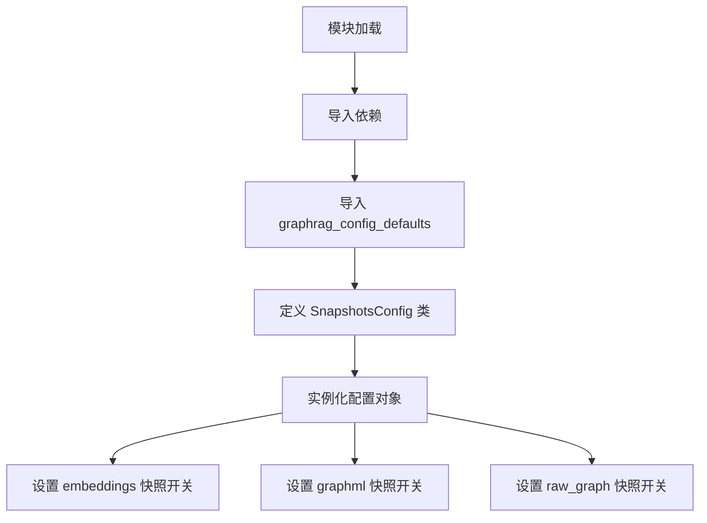
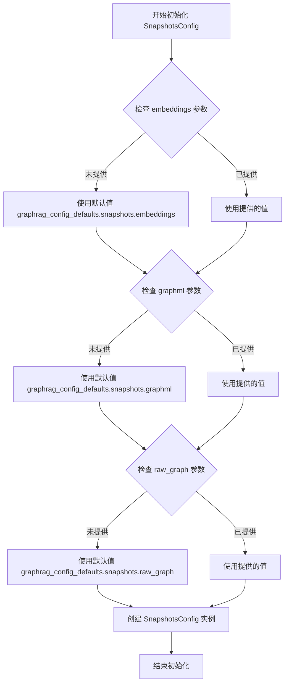
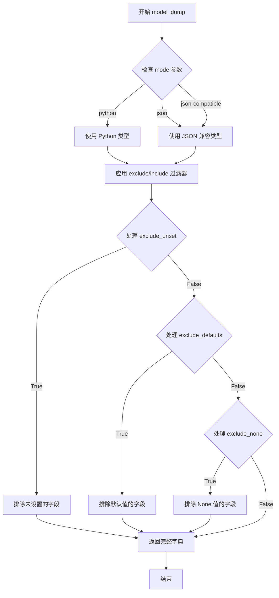
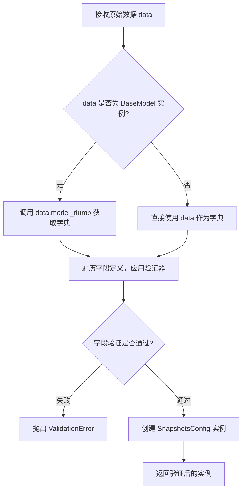

# `graphrag\packages\graphrag\graphrag\config\models\snapshots_config.py` 详细设计文档

这是一个配置类，用于定义GraphRAG系统中快照功能的各种开关配置，包括是否对嵌入向量、GraphML格式数据和原始提取图（实体和关系）进行快照保存的选项。

## 整体流程



## 类结构

```
BaseModel (pydantic 抽象基类)
└── SnapshotsConfig (快照配置类)
```

## 全局变量及字段


### `graphrag_config_defaults`
    
默认配置模块，包含图谱各配置项的默认值设置

类型：`Module (graphrag.config.defaults)`
    


### `SnapshotsConfig.embeddings`
    
布尔标志，指示是否对嵌入向量进行快照保存

类型：`bool`
    


### `SnapshotsConfig.graphml`
    
布尔标志，指示是否对GraphML格式的图数据执行快照

类型：`bool`
    


### `SnapshotsConfig.raw_graph`
    
布尔标志，指示是否对合并前的原始提取图（实体和关系）进行快照

类型：`bool`
    
    

## 全局函数及方法


### `SnapshotsConfig.__init__`

这是 `SnapshotsConfig` 类的初始化方法，继承自 Pydantic 的 `BaseModel`，用于配置快照功能的参数设置。该方法接收三个可选的布尔类型参数，用于控制是否生成 embeddings、GraphML 和 raw_graph 的快照，默认值从全局配置中读取。

参数：

- `embeddings`：`bool`，可选参数，控制是否对 embeddings 进行快照，默认为 `graphrag_config_defaults.snapshots.embeddings`
- `graphml`：`bool`，可选参数，控制是否对 GraphML 进行快照，默认为 `graphrag_config_defaults.snapshots.graphml`
- `raw_graph`：`bool`，可选参数，控制是否对原始提取的图（实体和关系）进行快照，默认为 `graphrag_config_defaults.snapshots.raw_graph`

返回值：`None`，构造函数不返回任何值

#### 流程图



#### 带注释源码

```python
def __init__(self, embeddings: bool = None, graphml: bool = None, raw_graph: bool = None, **kwargs) -> None:
    """
    SnapshotsConfig 类的初始化方法。
    
    参数:
        embeddings: bool, optional
            控制是否对 embeddings 进行快照，默认为全局配置中的值
        graphml: bool, optional
            控制是否对 GraphML 文件进行快照，默认为全局配置中的值
        raw_graph: bool, optional
            控制是否对原始提取的图（实体和关系）进行快照，默认为全局配置中的值
        **kwargs: Any
            额外的关键字参数，用于兼容 Pydantic 的基础功能
    
    返回:
        None
    
    说明:
        该方法继承自 Pydantic 的 BaseModel，会自动进行数据验证和类型转换。
        所有字段都使用 Field 定义，包含了默认值和描述信息。
    """
    # 调用父类 BaseModel 的初始化方法
    super().__init__(**kwargs)
    
    # Pydantic 会自动将参数赋值给对应的字段：
    # self.embeddings = embeddings if embeddings is not None else graphrag_config_defaults.snapshots.embeddings
    # self.graphml = graphml if graphml is not None else graphrag_config_defaults.snapshots.graphml
    # self.raw_graph = raw_graph if raw_graph is not None else graphrag_config_defaults.snapshots.raw_graph
```


### `SnapshotsConfig.model_dump`

将 SnapshotsConfig 模型实例转换为字典格式的方法，继承自 Pydantic BaseModel，用于序列化模型数据。

参数：

- `self`：`SnapshotsConfig`，模型实例本身
- `mode`：`Literal["python", "json", "json-compatible"]`，可选，输出模式，默认为 "python"
- `exclude`：可选，可选参数，用于指定从输出中排除的字段
- `include`：可选，可选参数，用于指定仅包含在输出中的字段
- `exclude_unset`：可选，布尔值，是否排除未设置的值
- `exclude_defaults`：可选，布尔值，是否排除默认值
- `exclude_none`：可选，布尔值，是否排除 None 值
- `exclude_keys`：可选，设置类型，指定要排除的键

返回值：`dict`，返回模型的字典表示形式，键为字段名，值为字段值

#### 流程图



#### 带注释源码

```python
# 假设有一个 SnapshotsConfig 实例
snapshots_config = SnapshotsConfig(
    embeddings=True,
    graphml=False,
    raw_graph=True
)

# 调用继承自 BaseModel 的 model_dump 方法
# 将模型实例转换为字典格式
result = snapshots_config.model_dump()

# 输出结果示例：
# {'embeddings': True, 'graphml': False, 'raw_graph': True}

# 使用 JSON 兼容模式（将日期等转换为 JSON 兼容格式）
json_result = snapshots_config.model_dump(mode='json')

# 排除特定字段
excluded_result = snapshots_config.model_dump(exclude=['graphml'])

# 仅包含特定字段
included_result = snapshots_config.model_dump(include=['embeddings'])

# 排除未设置的字段（仅包含显式设置的值）
unset_result = snapshots_config.model_dump(exclude_unset=True)

# 排除默认值（仅包含与默认值不同的值）
defaults_result = snapshots_config.model_dump(exclude_defaults=True)

# 排除 None 值
none_result = snapshots_config.model_dump(exclude_none=True)
```


### `SnapshotsConfig.model_validate`

该方法是 Pydantic BaseModel 的内置类方法，用于接收原始数据（字典或 BaseModel 实例），通过字段验证器和类型检查，将数据解析并转换为当前模型（SnapshotsConfig）的实例，实现数据校验与模型实例化的功能。

参数：

- `cls`：`type[SnapshotsConfig]`（隐式参数），表示类本身
- `data`：`Dict[str, Any] | BaseModel`，要验证的原始数据，可以是字典或其他 Pydantic 模型实例
- `strict`：`bool | None`，是否使用严格模式，默认为 None
- `context`：`dict | None`，验证上下文字典，默认为 None
- ...（其他 Pydantic 内置参数）

返回值：`SnapshotsConfig`，经过验证后返回的模型实例

#### 流程图



#### 带注释源码

```python
# 继承自 pydantic.BaseModel 的 model_validate 方法
# 以下为 Pydantic 内部实现的核心逻辑示意

@classmethod
def model_validate(
    cls: type[SnapshotsConfig],
    data: Dict[str, Any] | BaseModel,
    *,
    strict: bool | None = None,
    context: dict | None = None,
    **extra
) -> SnapshotsConfig:
    """
    验证数据并创建模型实例
    
    Args:
        cls: 模型类本身
        data: 要验证的输入数据（字典或BaseModel）
        strict: 是否启用严格验证模式
        context: 验证时使用的上下文信息
        **extra: 其他额外参数
    
    Returns:
        验证后的 SnapshotsConfig 实例
    """
    # 1. 如果输入是 BaseModel，转换为字典
    if isinstance(data, BaseModel):
        data = data.model_dump()
    
    # 2. 创建验证上下文
    validation_context = cls._context_with_globals(context)
    
    # 3. 调用验证器处理每个字段
    values = cls._model_validate(
        data, 
        strict=strict, 
        context=validation_context
    )
    
    # 4. 创建并返回实例
    return cls._from_dict(values)
```

#### 实际调用示例

```python
# 客户端代码示例
snapshot_data = {
    "embeddings": True,
    "graphml": False,
    "raw_graph": True
}

# 调用 model_validate 方法
config = SnapshotsConfig.model_validate(snapshot_data)
# 等价于: config = SnapshotsConfig(**snapshot_data)

print(config.embeddings)  # True
print(config.graphml)     # False
print(config.raw_graph)   # True
```

## 关键组件


### SnapshotsConfig

Pydantic 配置模型类，用于管理 GraphRAG 系统中快照功能的配置选项，包括嵌入向量、GraphML 和原始图的快照开关。

### embeddings 字段

布尔类型配置项，控制是否对嵌入向量进行快照保存，默认为 graphrag_config_defaults.snapshots.embeddings。

### graphml 字段

布尔类型配置项，控制是否对 GraphML 文件进行快照保存，默认为 graphrag_config_defaults.snapshots.graphml。

### raw_graph 字段

布尔类型配置项，控制是否对合并前的原始提取图（实体和关系）进行快照保存，默认为 graphrag_config_defaults.snapshots.raw_graph。


## 问题及建议


### 已知问题

-   **默认值访问存在运行时风险**：代码通过 `graphrag_config_defaults.snapshots.embeddings` 访问默认值，如果 `graphrag_config_defaults` 或其属性路径不存在，将抛出 `AttributeError` 异常，缺乏防御性编程。
-   **缺乏配置一致性验证**：三个快照配置字段之间可能存在业务逻辑约束（如某些快照不能同时开启），当前没有实现自定义验证器来确保配置的有效性。
-   **类型定义过于简单**：使用基础 `bool` 类型，缺乏更精确的类型提示（如 `Literal` 或枚举），无法在静态分析阶段发现非法配置组合。
-   **类文档缺失**：`SnapshotsConfig` 类缺少文档字符串，开发者难以快速理解该配置类的用途和使用场景。
-   **默认值依赖隐藏了配置来源**：默认值从外部模块导入，开发者无法直接从代码中看出默认值的具体内容，增加了调试难度。

### 优化建议

-   **添加 Pydantic 验证器**：使用 `@model_validator` 或 `@field_validator` 添加配置一致性检查，确保满足业务规则。
-   **改进类型定义**：考虑使用 `Literal[True]` 或自定义枚举类，提高类型安全性和代码可读性。
-   **补充类文档**：为 `SnapshotsConfig` 类添加 docstring，说明其职责和使用方式。
-   **防御性默认值访问**：使用 `getattr` 或 try-except 包装默认值访问，提供回退方案或更清晰的错误信息。
-   **添加配置验证方法**：可以添加 `validate_config` 或类似方法，主动检查配置的有效性并返回详细报告。

## 其它


### 设计目标与约束

本配置文件旨在为GraphRAG系统提供统一的快照配置管理能力，通过Pydantic BaseModel实现配置验证和类型检查，确保配置项的类型安全和默认值的一致性。设计约束包括：必须继承graphrag_config_defaults中的默认值、所有字段为布尔类型、配置类需保持向后兼容性。

### 错误处理与异常设计

本模块依赖Pydantic框架进行自动验证，当配置值类型不匹配或缺少必需字段时，Pydantic会抛出ValidationError。配置验证在对象初始化时自动触发，无需手动调用验证方法。若graphrag_config_defaults模块不可用或属性缺失，将导致默认值加载失败，建议在实际使用前进行导入可用性检查。

### 数据流与配置输入输出

该配置类作为数据输入的接收方，接收来自用户配置或默认配置的布尔值，经过Pydantic验证后输出标准化的配置对象。数据流方向为：外部配置源 → SnapshotsConfig实例化 → 验证后的配置对象 → 传递给下游消费者使用。

### 外部依赖与接口契约

主要依赖项包括：pydantic.BaseModel用于配置基类、pydantic.Field用于字段定义和验证、graphrag_config_defaults模块提供默认值。接口契约要求：snapshots.embeddings、snapshots.graphml、snapshots.raw_graph三个属性必须可访问，返回布尔类型。

### 配置项详细说明

embeddings字段控制向量嵌入快照的生成，graphml字段控制GraphML格式图的快照生成，raw_graph字段控制原始提取图（合并前的实体和关系）的快照生成。三个字段相互独立，可单独开启或关闭。

### 版本兼容性说明

该配置类遵循语义化版本原则，当默认值结构变化时将通过版本号显式声明。当前版本与GraphRAG 2024版本兼容，支持Python 3.8+及Pydantic v2.x。


    