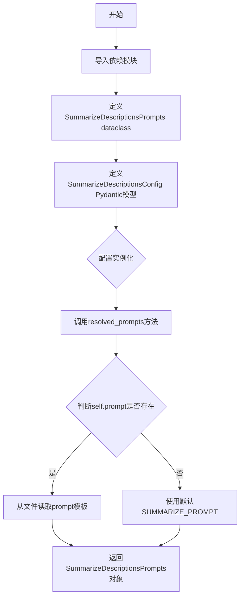
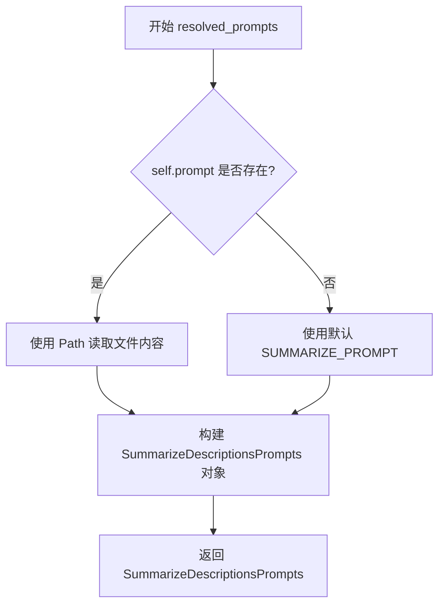

# `graphrag\packages\graphrag\graphrag\config\models\summarize_descriptions_config.py` 详细设计文档

这是一个配置模块，定义了描述摘要（Description Summarization）功能的参数化设置，包括模型选择、提示模板、最大长度等配置项，并通过Pydantic提供数据验证和默认值管理。

## 整体流程



## 类结构

```
Pydantic BaseModel
└── SummarizeDescriptionsConfig

dataclass
└── SummarizeDescriptionsPrompts
```

## 全局变量及字段


### `SUMMARIZE_PROMPT`
    
从graphrag.prompts.index.summarize_descriptions模块导入的默认描述摘要提示模板

类型：`str`
    


### `graphrag_config_defaults`
    
从graphrag.config.defaults模块导入的默认配置对象，包含graphrag的各组件默认配置值

类型：`Module`
    


### `SummarizeDescriptionsPrompts.summarize_prompt`
    
描述摘要的提示模板字符串

类型：`str`
    


### `SummarizeDescriptionsConfig.completion_model_id`
    
用于摘要的模型ID

类型：`str`
    


### `SummarizeDescriptionsConfig.model_instance_name`
    
模型单例实例名称，影响缓存存储分区

类型：`str`
    


### `SummarizeDescriptionsConfig.prompt`
    
描述摘要的自定义提示模板路径

类型：`str | None`
    


### `SummarizeDescriptionsConfig.max_length`
    
描述摘要的最大长度

类型：`int`
    


### `SummarizeDescriptionsConfig.max_input_tokens`
    
提交给模型的输入实体描述的最大token数

类型：`int`
    
    

## 全局函数及方法


### `SummarizeDescriptionsConfig.resolved_prompts`

解析并返回描述摘要提示模板，根据prompt配置决定是从文件读取还是使用默认模板

参数： 无

返回值：`SummarizeDescriptionsPrompts`，包含摘要提示内容的对象

#### 流程图



#### 带注释源码

```python
def resolved_prompts(self) -> SummarizeDescriptionsPrompts:
    """Get the resolved description summarization prompts.
    
    根据配置决定使用自定义提示模板文件还是默认模板。
    
    Returns:
        SummarizeDescriptionsPrompts: 包含摘要提示的 prompts 对象
    """
    return SummarizeDescriptionsPrompts(
        # 如果 self.prompt 有值（文件路径），则读取文件内容作为提示模板
        # 否则使用默认的 SUMMARIZE_PROMPT
        summarize_prompt=Path(self.prompt).read_text(encoding="utf-8")
        if self.prompt
        else SUMMARIZE_PROMPT,
    )
```

## 关键组件


### SummarizeDescriptionsConfig

描述摘要功能的配置类，基于Pydantic BaseModel实现，用于管理描述摘要的各项参数，包括模型ID、实例名称、提示词模板、最大长度和最大输入token数等配置项。

### SummarizeDescriptionsPrompts

用于存储解析后描述摘要提示词模板的数据类，通过dataclass装饰器定义，包含summarize_prompt字段用于存放实际的提示词内容。

### resolved_prompts()

配置解析方法，接收配置参数并返回SummarizeDescriptionsPrompts实例。当prompt字段有值时，从指定文件路径读取提示词模板；否则使用默认的SUMMARIZE_PROMPT常量作为备选方案。

### graphrag_config_defaults.summarize_descriptions

默认配置源，从graphrag配置模块中导入，提供描述摘要功能的默认值，包括默认模型ID、实例名称、提示词和长度限制等。

### SUMMARIZE_PROMPT

从graphrag.prompts.index.summarize_descriptions模块导入的默认摘要提示词模板，作为描述摘要的备用提示词方案。


## 问题及建议


### 已知问题

-   **文件路径未验证**：在 `resolved_prompts()` 方法中，当 `self.prompt` 不为 None 时，直接使用 `Path(self.prompt).read_text()` 读取文件，但没有验证文件是否存在，文件路径无效时会抛出难以追踪的异常。
-   **硬编码字符编码**：文件读取时硬编码使用 `"utf-8"`，缺乏灵活性，可能在处理非 UTF-8 编码的 prompt 文件时失败。
-   **缺少异常处理**：文件 I/O 操作（`Path.read_text()`）没有 try-except 包裹，任何文件读取异常都会直接向上抛出，缺乏优雅的错误处理。
-   **字段语义重叠**：`max_length` 和 `max_input_tokens` 两个字段功能描述相似但实际用途不同（一个限制输出，一个限制输入），容易导致使用困惑。
-   **dataclass 过度设计**：`SummarizeDescriptionsPrompts` 数据类仅包含一个 `summarize_prompt` 字段，作为简单的字符串封装略显冗余。
-   **类型注解兼容性**：`str | None` 语法需要 Python 3.10+，如果项目需要兼容更低版本 Python 则存在兼容性问题。

### 优化建议

-   在 `resolved_prompts()` 方法中添加文件存在性验证，使用 `Path.exists()` 或 `Path.is_file()` 检查后再读取，并提供明确的错误信息。
-   将硬编码的 `"utf-8"` 提取为可选配置参数，或至少在文档中明确说明对文件编码的要求。
-   为文件读取操作添加异常处理（FileNotFoundError、PermissionError、UnicodeDecodeError 等），捕获异常后抛出更具描述性的自定义异常。
-   重新审视 `max_length` 和 `max_input_tokens` 的命名或文档，确保两者职责清晰，必要时在文档中增加更详细的使用说明。
-   考虑将 `SummarizeDescriptionsPrompts` 简化为直接的字符串返回，或将其与配置类合并以减少类型数量。
-   考虑使用 `Optional[str]` 替代 `str | None` 以提高 Python 版本兼容性，或明确项目最低 Python 版本要求。

## 其它


### 设计目标与约束

本配置类旨在为GraphRAG框架中的描述摘要功能提供灵活的配置能力，支持自定义模型选择、提示词模板和token限制。设计上遵循Pydantic最佳实践，提供类型安全默认值，同时保持向后兼容性。约束条件包括：prompt必须为有效的文件路径或None，max_length和max_input_tokens必须为正整数。

### 错误处理与异常设计

配置验证采用Pydantic的自动校验机制，当传入无效值时抛出ValidationError。resolved_prompts()方法中，如果prompt指定了文件路径但文件不存在，将抛出FileNotFoundError，该方法未做额外异常捕获，调用方需处理。默认值加载依赖graphrag_config_defaults模块，若该模块缺失会导致导入错误。

### 数据流与状态机

配置对象创建后处于初始化状态，可调用resolved_prompts()转换为已解析状态。配置对象为不可变配置载体，不涉及状态机流转。数据流：外部配置源 → SummarizeDescriptionsConfig实例 → resolved_prompts()解析 → SummarizeDescriptionsPrompts提示词对象 → 传递给下游LLM调用。

### 外部依赖与接口契约

主要依赖包括：pydantic.BaseModel提供配置验证，pathlib.Path处理文件路径，graphrag_config_defaults模块提供默认值，graphrag.prompts.index.summarize_descriptions.SUMMARIZE_PROMPT提供内置提示词。接口契约方面，resolved_prompts()返回SummarizeDescriptionsPrompts对象，包含summarize_prompt字符串字段。

### 安全性考量

代码不直接处理敏感数据，但需注意prompt文件路径遍历风险——当前实现未验证Path的安全路径，建议调用方确保prompt参数来源可信。max_input_tokens参数可防止LLM调用时token溢出，属于DoS防护机制。

### 可扩展性与插件化

设计支持两种扩展方式：1) 通过prompt参数注入自定义提示词文件实现提示词模板扩展；2) 通过继承SummarizeDescriptionsConfig或覆写resolved_prompts()实现自定义解析逻辑。当前未提供钩子或回调机制，扩展需通过代码修改实现。

### 配置管理建议

当前采用硬编码默认值+运行时覆盖模式，建议补充：1) 环境变量支持（如GRAPHRAG_SUMMARIZE_MODEL_ID）；2) 配置层级合并机制（全局→项目级→运行时）；3) 配置版本控制字段以支持迁移。

### 测试覆盖建议

建议补充测试用例：1) 默认值正确性验证；2) prompt为None时使用内置提示词；3) prompt为有效文件路径时正确读取；4) 无效prompt路径抛出FileNotFoundError；5) max_length和max_input_tokens为负数或零时的校验；6) resolved_prompts()返回对象类型和内容验证。

### 版本兼容性说明

代码使用Python 3.10+的str | None联合类型语法，依赖pydantic v2+（Field为pydantic 2.x API）。GraphRAG项目需确保运行时Python版本≥3.10且pydantic版本兼容。

### 性能考虑

resolved_prompts()每次调用都会执行文件读取操作，若配置被多次复用建议缓存解析结果。文件读取使用utf-8编码，大型提示词模板可能导致内存占用增加。

### 文档与注释完善建议

建议补充：1) dataclass的__repr__或__str__实现便于调试；2) 配置类添加docstring说明使用场景；3) resolved_prompts()添加更详细的异常说明到docstring；4) 补充配置示例代码片段。


    