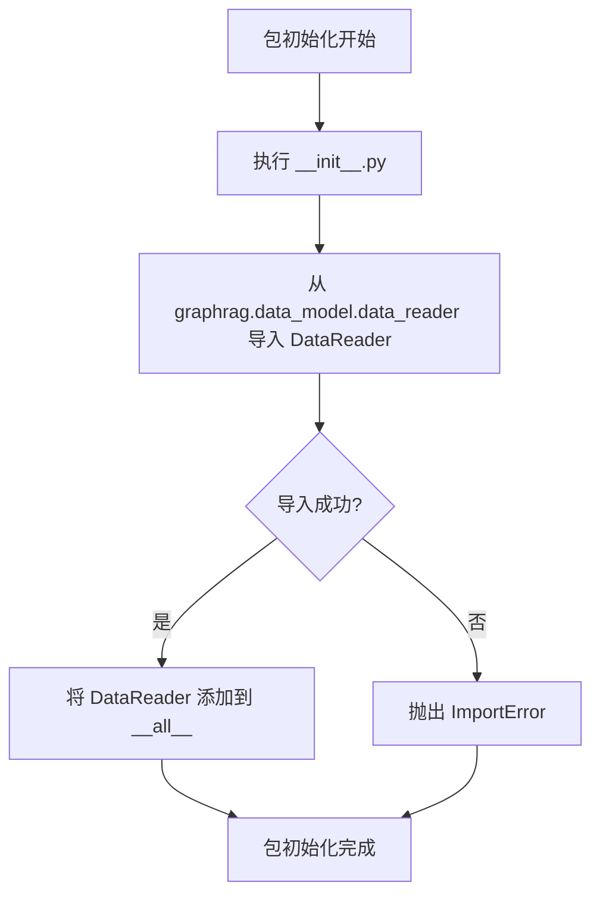

# `graphrag\packages\graphrag\graphrag\data_model\__init__.py` 详细设计文档

这是 graphrag 知识模型包的初始化文件，通过导入并导出 DataReader 类，使得该类可以通过包名直接访问（from graphrag.knowledge_model import DataReader），作为包的公共接口。

## 整体流程



## 类结构

```
graphrag.knowledge_model (包)
└── __init__.py (包初始化模块)
```

## 全局变量及字段


### `__all__`
    
定义包的公共导出接口

类型：`list`
    


    

## 全局函数及方法


## 关键组件


### 模块概述

这是一个知识模型包（Knowledge Model Package），作为 graphrag 项目的入口模块之一，通过从内部子模块导入并重导出 DataReader 类，为上层应用提供统一的数据读取接口。

### 文件整体运行流程

该模块在导入时执行以下流程：
1. Python 解释器加载模块，执行初始化代码
2. 从 `graphrag.data_model.data_reader` 模块导入 `DataReader` 类
3. 定义 `__all__` 列表，指定公开导出的接口
4. 当其他模块使用 `from graphrag.knowledge_model import DataReader` 时，返回导入的 DataReader 类

### 全局变量与全局函数

#### `DataReader`

- **类型**: class (从 graphrag.data_model.data_reader 导入)
- **描述**: 数据读取器类，负责从各种数据源读取结构化或非结构化数据，具体功能取决于 DataReader 的实际实现

#### `__all__`

- **类型**: list
- **描述**: 模块公开接口列表，控制 from module import * 时的导出行为，当前只导出 DataReader

### 关键组件信息

### DataReader 导入与重导出机制

该模块作为知识模型包的公共接口层，通过从内部模块导入 DataReader 并重新导出的方式，隐藏了内部实现细节，为未来可能的重构（如更改数据读取实现方式）提供了抽象层。

### 潜在的技术债务或优化空间

1. **依赖耦合度高**: 当前直接导入 DataReader，如果 DataReader 的接口发生变化，需要同时修改该模块的导出逻辑
2. **文档缺失**: 模块缺少详细的 docstring 说明 DataReader 的具体用途和使用场景
3. **功能单一**: 当前仅作为重导出模块，未包含任何业务逻辑或配置功能，可以考虑添加初始化配置、缓存机制等功能

### 其它项目

#### 设计目标与约束

- 设计目标：提供统一的数据读取接口，封装底层实现细节
- 设计约束：保持与 graphrag.data_model.data_reader 的兼容性

#### 外部依赖与接口契约

- 依赖: `graphrag.data_model.data_reader.DataReader`
- 接口契约: 导入该模块后可直接使用 DataReader 类，其接口遵循 DataReader 的原始定义

#### 错误处理与异常设计

- 异常传播: 导入过程中可能产生的 ImportError 等异常会直接向上抛出，调用方需要处理可能的导入失败场景
- 建议: 考虑添加更详细的导入错误提示，说明依赖关系


## 问题及建议


### 已知问题

-   **包职责不清晰**：包名为"Knowledge model package"，但实际仅重新导出了 `DataReader` 类，未体现知识模型相关的任何增值功能或业务逻辑
-   **缺少文档字符串**：模块级别缺少文档说明，开发者无法快速理解该包的用途和使用场景
-   **缺乏版本声明**：未包含 `__version__` 变量或版本管理机制
-   **导出内容单一**：仅导出一个类，限制了包的扩展性和可维护性
-   **潜在过度封装**：这种仅做重导出的包结构可能引入不必要的抽象层，增加项目复杂度

### 优化建议

-   **添加文档字符串**：为模块添加清晰的 docstring，说明包的功能、用途和使用方式
-   **明确包职责**：如果该包确实需要存在，考虑在其中添加知识模型相关的工具函数、配置管理或数据处理逻辑，使其具有实际价值
-   **添加版本信息**：参照行业惯例，在包中声明版本号，如 `__version__ = "0.1.0"`
-   **扩展导出内容**：根据业务需求，将知识模型相关的类、函数、常量等统一组织在该包中，提供统一的访问入口
-   **移除不必要的重导出**：如果 `DataReader` 已有更好的公开位置，考虑移除该包，直接使用原模块，避免额外的导入路径

## 其它


### 设计目标与约束

本代码作为知识模型包（Knowledge model package）的入口文件，核心目标是通过统一的导出接口（__all__）向外部提供数据读取器（DataReader）功能。设计约束包括：必须保持与 graphrag.data_model.data_reader 的依赖同步，确保导出的 DataReader 类接口稳定，遵循 MIT 开源许可证要求，并在 Python 3.8+ 环境中运行。

### 错误处理与异常设计

由于本文件仅为导入导出层，不涉及复杂业务逻辑，错误处理主要依赖于下游模块（graphrag.data_model.data_reader）。若 DataReader 导入失败，将抛出 ImportError。建议在调用处进行异常捕获处理，确保模块加载失败时能够提供明确的错误信息。

### 数据流与状态机

本文件不涉及数据处理流程，仅作为模块接口层。数据流方向为：外部模块 → DataReader 导入 → 数据读取模块。无状态机设计，所有状态管理由 DataReader 类内部实现。

### 外部依赖与接口契约

主要外部依赖为 graphrag.data_model.data_reader 模块。接口契约包括：DataReader 类应提供数据读取的标准接口，具体方法签名和返回值类型由该模块定义。本文件通过 __all__ 明确导出列表，确保只有 DataReader 被公开访问。

### 版本兼容性

当前代码兼容 Python 3.8 及以上版本，与 graphrag 包其他组件保持版本同步。建议在项目配置中明确声明对 graphrag.data_model 的版本依赖。

### 安全考虑

代码本身无用户输入处理，不涉及敏感数据操作。安全考量主要在于依赖链的安全性，需确保 graphrag.data_model.data_reader 来源可信且无已知安全漏洞。

### 性能考虑

本文件为纯导入层，无运行时性能开销。DataReader 的性能特性由其实现模块决定，建议参考 graphrag.data_model.data_reader 的性能文档。

### 测试策略

建议为该模块编写基础的导入测试，验证：1) 模块可正常导入；2) DataReader 类可正确实例化；3) __all__ 导出列表正确。

### 配置管理

无需额外配置，所有配置由下游模块管理。

### 监控和日志

本层不涉及日志记录，日志由 DataReader 实现模块负责。

    