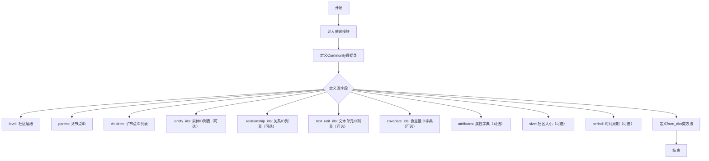
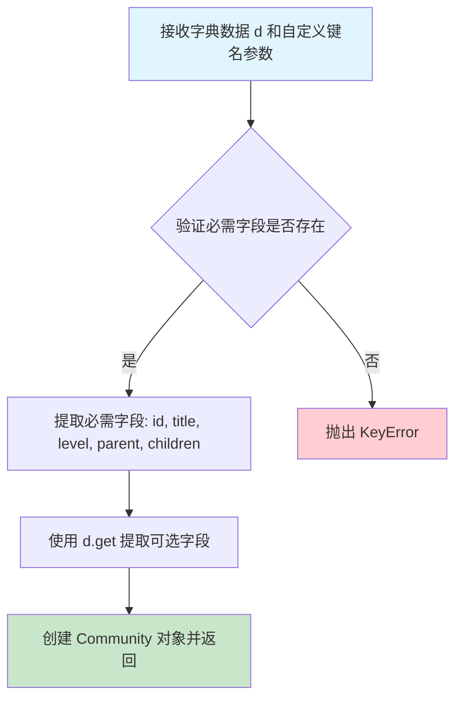

# `graphrag\packages\graphrag\graphrag\data_model\community.py` 详细设计文档

这是一个定义社区模型的Python数据类，继承自Named基类，用于表示系统中的社区实体，包含社区层级、父子关系、关联实体、关系、文本单元、协变量、属性、大小和时间周期等信息，并提供从字典数据构造对象的类方法。

## 整体流程



## 类结构

```
Named (抽象基类/父类)
└── Community (数据类/子类)
```

## 全局变量及字段


### `Community.id`
    
Unique identifier of the community (inherited from Named).

类型：`str`
    


### `Community.title`
    
Title or name of the community (inherited from Named).

类型：`str`
    


### `Community.short_id`
    
Human-readable short ID of the community (inherited from Named).

类型：`str | None`
    


### `Community.level`
    
Community level.

类型：`str`
    


### `Community.parent`
    
Community ID of the parent node of this community.

类型：`str`
    


### `Community.children`
    
List of community IDs of the child nodes of this community.

类型：`list[str]`
    


### `Community.entity_ids`
    
List of entity IDs related to the community (optional).

类型：`list[str] | None`
    


### `Community.relationship_ids`
    
List of relationship IDs related to the community (optional).

类型：`list[str] | None`
    


### `Community.text_unit_ids`
    
List of text unit IDs related to the community (optional).

类型：`list[str] | None`
    


### `Community.covariate_ids`
    
Dictionary of different types of covariates related to the community (optional), e.g. claims.

类型：`dict[str, list[str]] | None`
    


### `Community.attributes`
    
A dictionary of additional attributes associated with the community (optional). To be included in the search prompt.

类型：`dict[str, Any] | None`
    


### `Community.size`
    
The size of the community (Amount of text units).

类型：`int | None`
    


### `Community.period`
    
The period associated with the community (optional).

类型：`str | None`
    
    

## 全局函数及方法


### `Community.from_dict`

该方法是一个类方法，用于将字典数据转换为 `Community` 对象，支持自定义键名映射以适应不同的数据源格式。

参数：

- `cls`：`type`，类本身（隐式参数）
- `d`：`dict[str, Any]`，包含社区数据的源字典
- `id_key`：`str`，默认值 `"id"`，字典中表示社区 ID 的键名
- `title_key`：`str`，默认值 `"title"`，字典中表示社区标题的键名
- `short_id_key`：`str`，默认值 `"human_readable_id"`，字典中表示人类可读 ID 的键名
- `level_key`：`str`，默认值 `"level"`，字典中表示社区层级的键名
- `entities_key`：`str`，默认值 `"entity_ids"`，字典中表示实体 ID 列表的键名
- `relationships_key`：`str`，默认值 `"relationship_ids"`，字典中表示关系 ID 列表的键名
- `text_units_key`：`str`，默认值 `"text_unit_ids"`，字典中表示文本单元 ID 列表的键名
- `covariates_key`：`str`，默认值 `"covariate_ids"`，字典中表示协变量 ID 字典的键名
- `parent_key`：`str`，默认值 `"parent"`，字典中表示父社区 ID 的键名
- `children_key`：`str`，默认值 `"children"`，字典中表示子社区 ID 列表的键名
- `attributes_key`：`str`，默认值 `"attributes"`，字典中表示附加属性的键名
- `size_key`：`str`，默认值 `"size"`，字典中表示社区规模的键名
- `period_key`：`str`，默认值 `"period"`，字典中表示时间段的键名

返回值：`Community`，从字典数据创建的新社区对象

#### 流程图



#### 带注释源码

```python
@classmethod
def from_dict(
    cls,
    d: dict[str, Any],
    id_key: str = "id",
    title_key: str = "title",
    short_id_key: str = "human_readable_id",
    level_key: str = "level",
    entities_key: str = "entity_ids",
    relationships_key: str = "relationship_ids",
    text_units_key: str = "text_unit_ids",
    covariates_key: str = "covariate_ids",
    parent_key: str = "parent",
    children_key: str = "children",
    attributes_key: str = "attributes",
    size_key: str = "size",
    period_key: str = "period",
) -> "Community":
    """Create a new community from the dict data."""
    # 使用字典的直接访问获取必需字段（不存在时抛出 KeyError）
    # 使用 .get() 方法获取可选字段（不存在时返回 None）
    return Community(
        id=d[id_key],                    # 必需：社区唯一标识
        title=d[title_key],               # 必需：社区标题
        level=d[level_key],               # 必需：社区层级
        parent=d[parent_key],              # 必需：父社区 ID
        children=d[children_key],         # 必需：子社区 ID 列表
        short_id=d.get(short_id_key),     # 可选：人类可读 ID
        entity_ids=d.get(entities_key),   # 可选：关联实体 ID 列表
        relationship_ids=d.get(relationships_key),  # 可选：关联关系 ID 列表
        text_unit_ids=d.get(text_units_key),         # 可选：关联文本单元 ID 列表
        covariate_ids=d.get(covariates_key),         # 可选：协变量 ID 字典
        attributes=d.get(attributes_key),            # 可选：附加属性字典
        size=d.get(size_key),              # 可选：社区规模
        period=d.get(period_key),          # 可选：时间段
    )
```

## 关键组件


### Community 数据类

核心数据模型类，继承自Named基类，用于表示图谱系统中的社区实体，包含层级结构、关联实体、关系、文本单元、协变量及自定义属性等信息。

### from_dict 工厂方法

类方法，从字典数据创建Community实例，支持自定义键名映射，提供灵活的数据反序列化能力。

### 社区层级结构组件

包含level（社区层级）、parent（父节点ID）、children（子节点ID列表）三个字段，用于构建社区的树形层级关系。

### 关联实体组件

包含entity_ids（实体ID列表）、relationship_ids（关系ID列表）、text_unit_ids（文本单元ID列表），用于建立社区与图中其他元素的关联关系。

### 协变量组件

covariate_ids字段，字典类型，支持存储不同类型协变量（如声明claims），用于关联社区相关的额外结构化数据。

### 属性扩展组件

attributes字段为字典类型，支持存储任意自定义属性，用于扩展社区模型的表达能力，可包含搜索提示等额外信息。

### 可选字段设计

所有关联字段（entity_ids、relationship_ids、text_unit_ids等）均设计为可选类型，使用None作为默认值，体现了模块化和灵活性设计。


## 问题及建议


### 已知问题

- `period` 字段缺少文档描述，代码中 `period: str | None = None` 下方为空字符串，未说明该字段的具体用途
- `from_dict` 方法对必填字段（`level`、`parent`、`children`）未使用 `.get()` 方法，若字典中缺少这些键会直接抛出 `KeyError` 异常，缺乏容错处理
- `children` 字段声明为 `list[str]`，但 `from_dict` 中直接获取未做空列表默认值处理，若数据中缺少该字段会导致 AttributeError
- 未体现与父类 `Named` 的关系和约束，`Named` 类的定义未在此文件中体现，文档完整性不足

### 优化建议

- 补充 `period` 字段的文档字符串，说明该字段用于表示社区的时间周期或时间范围
- 统一 `from_dict` 方法的参数获取逻辑，对必填字段增加默认值或显式的缺失处理，提高方法的健壮性
- 考虑为 `Community` 类添加数据验证逻辑（如 `__post_init__` 方法），确保必填字段的有效性
- 在文档中补充 `Named` 父类的引用链接或说明，确保使用者了解继承关系的约束

## 其它


### 设计目标与约束

设计目标：提供一种标准化的社区(Community)数据模型，用于表示图谱中的社区结构，支持层级关系、父子关系以及与实体、关系、文本单元的关联。

设计约束：
- 继承自 `Named` 基类，必须包含 id 和 title 字段
- 某些字段为可选（带默认值 None）
- 使用 dataclass 简化数据模型实现
- 支持字典到对象的反序列化

### 错误处理与异常设计

异常处理策略：
- `from_dict` 方法使用字典的 `.get()` 方法处理可选字段，避免 KeyError
- 必需字段（id, title, level, parent, children）直接通过 `d[key]` 访问，缺失时会产生 KeyError
- 类型检查由调用方负责，建议在反序列化前进行数据验证

### 数据流与状态机

数据流：
- 输入：字典格式的社区数据
- 处理：`from_dict` 类方法将字典转换为 Community 对象
- 输出：Community 实例

状态说明：
- Community 对象创建后为不可变状态（dataclass frozen=False，可修改）
- 字段可分为必需字段和可选字段两类状态

### 外部依赖与接口契约

外部依赖：
- `dataclass`：Python 内置装饰器
- `typing.Any`：Python 类型提示
- `graphrag.data_model.named.Named`：基类，需实现 id 和 title 属性

接口契约：
- `from_dict` 类方法接受字典和可选的自定义键名参数
- 返回 Community 实例
- 字段类型：str, list[str], dict[str, Any], int, None

### 序列化与反序列化

序列化支持：
- dataclass 自动支持 `asdict()` 方法转换为字典
- 支持 JSON 序列化（需自定义编码器处理 dataclass）

反序列化：
- `from_dict` 类方法为主要反序列化入口
- 支持自定义键名映射，灵活适配不同数据源

### 使用示例

```python
# 创建 Community 实例
community = Community(
    id="community_1",
    title="Test Community",
    level="level_1",
    parent="",
    children=["community_2", "community_3"],
    entity_ids=["entity_1", "entity_2"],
    size=10
)

# 从字典反序列化
data = {
    "id": "community_1",
    "title": "Test Community",
    "level": "level_1",
    "parent": "",
    "children": ["community_2"]
}
community = Community.from_dict(data)
```

### 字段说明表

| 字段名 | 类型 | 必填 | 说明 |
|--------|------|------|------|
| id | str | 是 | 社区唯一标识符（继承自Named） |
| title | str | 是 | 社区标题（继承自Named） |
| short_id | str | 否 | 人类可读的短ID |
| level | str | 是 | 社区层级 |
| parent | str | 是 | 父节点社区ID |
| children | list[str] | 是 | 子节点社区ID列表 |
| entity_ids | list[str] | 否 | 关联的实体ID列表 |
| relationship_ids | list[str] | 否 | 关联的关系ID列表 |
| text_unit_ids | list[str] | 否 | 关联的文本单元ID列表 |
| covariate_ids | dict[str, list[str]] | 否 | 协变量ID字典（如claims） |
| attributes | dict[str, Any] | 否 | 额外属性字典 |
| size | int | 否 | 社区大小（文本单元数量） |
| period | str | 否 | 时间周期 |

### 版本历史

- v1.0 (2024): 初始版本，定义基础 Community 数据模型

### 测试策略建议

- 单元测试：验证 from_dict 方法各种参数组合
- 边界测试：测试空值、None 值、大列表等边界情况
- 集成测试：与 Named 基类集成测试

### 性能考虑

- dataclass 相比普通类有轻微性能开销，但可忽略
- 大型社区列表（如 entity_ids, children）应考虑延迟加载
- 字段字典（attributes, covariate_ids）复制开销与字典大小成正比

### 线程安全性

- dataclass 默认不保证线程安全
- 如需线程安全，使用 frozen=True 或自行加锁


    