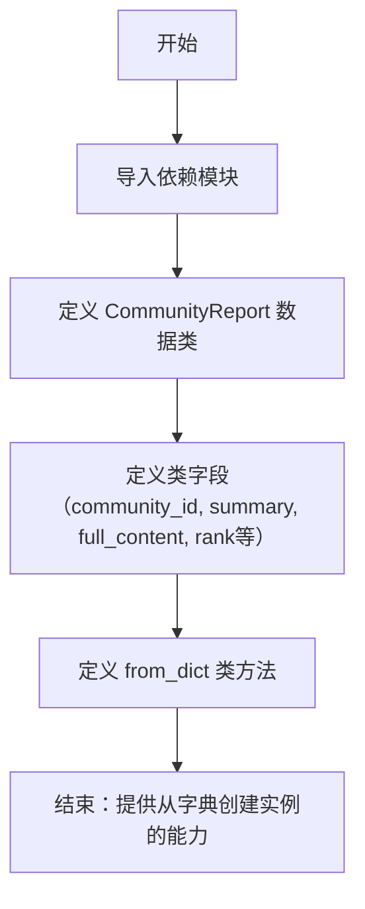
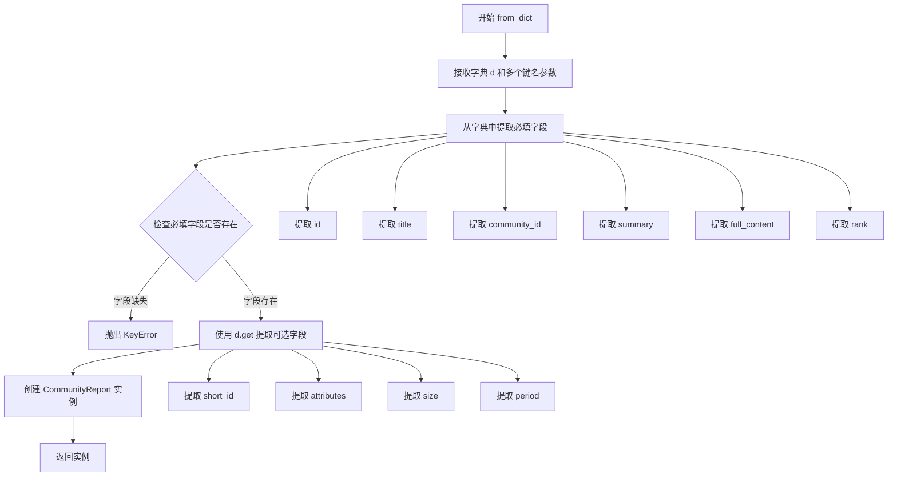

# `graphrag\packages\graphrag\graphrag\data_model\community_report.py` 详细设计文档

定义了一个名为 CommunityReport 的数据模型类，用于表示由 LLM 生成的社区摘要报告，包含社区ID、摘要、完整内容、排名、嵌入向量、属性、大小和周期等字段，并提供了从字典数据创建实例的类方法。

## 整体流程



## 类结构

```
Named (抽象基类/数据模型基类)
└── CommunityReport (社区报告数据模型)
```

## 全局变量及字段


### `CommunityReport.community_id`
    
社区ID

类型：`str`
    


### `CommunityReport.summary`
    
报告摘要

类型：`str`
    


### `CommunityReport.full_content`
    
报告完整内容

类型：`str`
    


### `CommunityReport.rank`
    
报告排名，用于排序

类型：`float | None`
    


### `CommunityReport.full_content_embedding`
    
完整内容的语义嵌入向量

类型：`list[float] | None`
    


### `CommunityReport.attributes`
    
附加属性字典

类型：`dict[str, Any] | None`
    


### `CommunityReport.size`
    
报告大小（文本单元数量）

类型：`int | None`
    


### `CommunityReport.period`
    
报告周期

类型：`str | None`
    


### `Named.id`
    
报告ID（继承自 Named）

类型：`str`
    


### `Named.title`
    
报告标题（继承自 Named）

类型：`str`
    


### `Named.short_id`
    
短ID（继承自 Named）

类型：`str | None`
    
    

## 全局函数及方法


### `CommunityReport.from_dict`

这是一个类方法，用于从字典数据创建 CommunityReport 实例，支持自定义键名映射，允许灵活地将外部数据格式转换为社区报告对象。

参数：

- `cls`：类型，类本身（隐式参数）
- `d`：`dict[str, Any]`，输入的字典数据，包含社区报告的各项属性
- `id_key`：`str`，默认为 "id"，用于从字典中提取ID的键名
- `title_key`：`str`，默认为 "title"，用于从字典中提取标题的键名
- `community_id_key`：`str`，默认为 "community"，用于从字典中提取社区ID的键名
- `short_id_key`：`str`，默认为 "human_readable_id"，用于从字典中提取人类可读ID的键名
- `summary_key`：`str`，默认为 "summary"，用于从字典中提取摘要的键名
- `full_content_key`：`str`，默认为 "full_content"，用于从字典中提取完整内容的键名
- `rank_key`：`str`，默认为 "rank"，用于从字典中提取排名的键名
- `attributes_key`：`str`，默认为 "attributes"，用于从字典中提取属性的键名
- `size_key`：`str`，默认为 "size"，用于从字典中提取大小的键名
- `period_key`：`str`，默认为 "period"，用于从字典中提取周期的键名

返回值：`CommunityReport`，从字典数据创建的新实例

#### 流程图



#### 带注释源码

```python
@classmethod
def from_dict(
    cls,
    d: dict[str, Any],
    id_key: str = "id",
    title_key: str = "title",
    community_id_key: str = "community",
    short_id_key: str = "human_readable_id",
    summary_key: str = "summary",
    full_content_key: str = "full_content",
    rank_key: str = "rank",
    attributes_key: str = "attributes",
    size_key: str = "size",
    period_key: str = "period",
) -> "CommunityReport":
    """Create a new community report from the dict data."""
    # 使用指定的键名从字典中提取必填字段
    # 必填字段：id, title, community_id, summary, full_content, rank
    # 如果字段不存在，将抛出 KeyError
    return CommunityReport(
        id=d[id_key],                          # 从字典中提取ID
        title=d[title_key],                    # 从字典中提取标题
        community_id=d[community_id_key],      # 从字典中提取社区ID
        short_id=d.get(short_id_key),          # 提取可选的人类可读ID（使用get避免KeyError）
        summary=d[summary_key],                # 从字典中提取摘要
        full_content=d[full_content_key],      # 从字典中提取完整内容
        rank=d[rank_key],                      # 从字典中提取排名
        attributes=d.get(attributes_key),      # 提取可选属性字典
        size=d.get(size_key),                  # 提取可选大小
        period=d.get(period_key),              # 提取可选周期
    )
```

## 关键组件


### CommunityReport 数据模型

核心数据模型类，继承自 Named，用于表示 LLM 生成的社区报告摘要，包含社区ID、摘要、完整内容、排名、嵌入向量、属性、规模和周期等信息。

### 字段定义

包含8个字段：community_id（社区ID）、summary（摘要）、full_content（完整内容）、rank（排名，用于排序，可选）、full_content_embedding（语义嵌入，可选）、attributes（附加属性字典，可选）、size（报告规模，可选）、period（报告周期，可选）。

### from_dict 工厂方法

类方法，从字典数据创建 CommunityReport 实例，支持自定义键名映射，提供灵活的数据解析能力。

### Named 基类继承

继承自 graphrag.data_model.named 模块中的 Named 基类，获取 id 和 title 字段支持。

### 类型注解

全面使用 Python 类型注解，包含 str、float、list[float]、dict[str, Any]、int 等类型，以及 Union 类型（使用 | 语法）。


## 问题及建议


### 已知问题

- `from_dict` 方法未处理 `full_content_embedding` 字段，导致该字段在反序列化时丢失数据
- `rank` 字段类型为 `float | None`，但默认值设为 `1.0`（非 None），存在类型与默认值不一致的潜在问题
- 缺少对应的 `to_dict` 方法，无法将对象序列化回字典，形成单向转换
- `from_dict` 方法参数过多（10个参数），违反函数参数过多原则，可考虑使用配置对象或建造者模式
- `attributes` 字段使用 `dict[str, Any]` 类型，缺乏类型安全，任何类型都可以存入
- 缺少 `__post_init__` 方法对字段值进行验证，如 `rank` 范围、`size` 非负等
- `full_content_embedding` 字段定义但未在 `from_dict` 中使用，造成功能不完整
- 代码未处理 `Named` 基类可能存在的必填字段，假设 `id` 和 `title` 必填但未做容错处理

### 优化建议

- 添加 `to_dict` 方法实现双向序列化/反序列化对称
- 在 `from_dict` 中添加 `full_content_embedding` 字段的处理逻辑
- 使用 `__post_init__` 添加字段验证逻辑，确保 `rank` 在合理范围、`size` 为非负数等
- 考虑将 `from_dict` 的参数封装为配置类或使用建造者模式减少参数个数
- 为 `attributes` 字段提供泛型支持或定义具体的属性类型
- 考虑为 `rank` 添加验证，确保其在 0-1 范围内或根据业务需求限制
- 添加类型提示的 `full_content_embedding` 处理方法，或提供 embedding 计算的辅助函数
- 考虑使用 Pydantic 替代 dataclass 以获得更强大的验证和序列化能力

## 其它


### 设计目标与约束

该类旨在为社区报告提供标准化的数据模型，支持从字典数据创建实例，包含必要的字段（ID、标题、摘要、内容、排名等）和可选字段（嵌入向量、属性、大小、时间段），同时保持与基类 Named 的继承关系。

### 错误处理与异常设计

from_dict 方法未对必需键进行存在性检查，若缺少必需键（如 id、title、community、summary、full_content、rank）会抛出 KeyError；建议在方法内部添加键验证逻辑或使用 get 方法配合默认值处理；属性字段使用 .get() 方法以容忍缺失的可选键。

### 外部依赖与接口契约

依赖 graphrag.data_model.named.Named 基类；from_dict 方法接收标准字典结构，参数键名可通过入参自定义（id_key、title_key 等），支持灵活的数据映射；返回值类型为 CommunityReport 实例。

### 数据模型与序列化

支持从字典序列化（from_dict 方法）；实例本身为 dataclass，天生支持 dict 转换（dataclasses.asdict）；属性类型包括 str、float、list[float]、dict、int 等常见类型；rank 支持 None 值以表示未排名状态。

### 使用示例与调用模式

典型用法：先通过 LLM 生成社区报告数据，然后将数据字典传入 from_dict 方法创建 CommunityReport 实例；支持可选字段的条件性填充；适用于图谱检索和排序场景。

### 版本历史与变更记录

代码基于 MIT 许可证，版权归属 Microsoft Corporation (2024)；为初始版本设计，无历史变更记录。

    