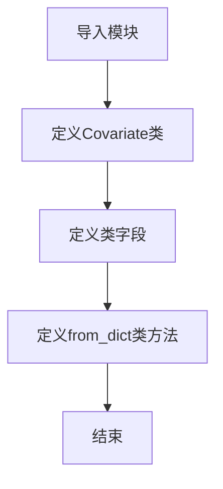
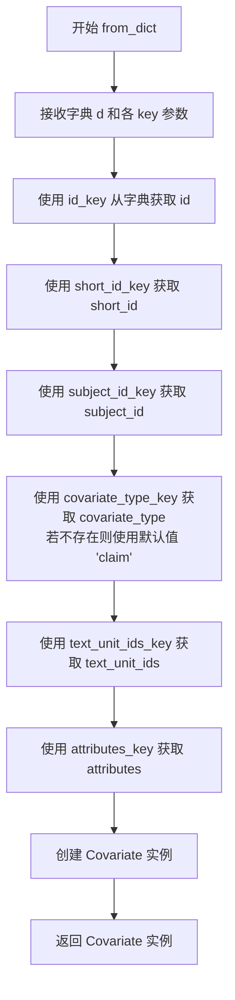

# `graphrag\packages\graphrag\graphrag\data_model\covariate.py` 详细设计文档

这是一个协变量(Covariate)数据模型，继承自Identified基类，用于表示与实体等主体关联的元数据（如实体声明），支持从字典数据构造对象，包含subject_id、subject_type、covariate_type、text_unit_ids和attributes等字段。

## 整体流程



## 类结构

```
Identified (抽象基类)
└── Covariate (协变量数据模型)
```

## 全局变量及字段


### `Covariate.subject_id`
    
主体ID

类型：`str`
    


### `Covariate.subject_type`
    
主体类型，默认为'entity'

类型：`str`
    


### `Covariate.covariate_type`
    
协变量类型，默认为'claim'

类型：`str`
    


### `Covariate.text_unit_ids`
    
文本单元ID列表

类型：`list[str] | None`
    


### `Covariate.attributes`
    
附加属性字典

类型：`dict[str, Any] | None`
    


### `Covariate.id`
    
唯一标识符（继承自Identified）

类型：`Any`
    


### `Covariate.short_id`
    
短ID（继承自Identified）

类型：`Any`
    
    

## 全局函数及方法


### `Covariate.from_dict`

该类方法用于将字典数据转换为 `Covariate` 实例，支持自定义键名映射，允许从不同结构的字典数据创建协变量对象。

参数：

- `cls`：类型，类本身（隐式参数）
- `d`：`dict[str, Any]`，包含协变量数据的源字典
- `id_key`：`str = "id"`，字典中用于获取协变量ID的键名，默认为"id"
- `subject_id_key`：`str = "subject_id"`，字典中用于获取主体ID的键名，默认为"subject_id"
- `covariate_type_key`：`str = "covariate_type"`，字典中用于获取协变量类型的键名，默认为"covariate_type"
- `short_id_key`：`str = "human_readable_id"`，字典中用于获取人类可读ID的键名，默认为"human_readable_id"
- `text_unit_ids_key`：`str = "text_unit_ids"`，字典中用于获取文本单元ID列表的键名，默认为"text_unit_ids"
- `attributes_key`：`str = "attributes"`，字典中用于获取属性的键名，默认为"attributes"

返回值：`Covariate`，返回从字典数据创建的新 `Covariate` 实例

#### 流程图



#### 带注释源码

```python
@classmethod
def from_dict(
    cls,  # 类方法隐式参数，指向 Covariate 类本身
    d: dict[str, Any],  # 输入字典，包含协变量的各项数据
    id_key: str = "id",  # 指定从字典中提取 id 的键名，默认 "id"
    subject_id_key: str = "subject_id",  # 指定提取 subject_id 的键名
    covariate_type_key: str = "covariate_type",  # 指定提取 covariate_type 的键名
    short_id_key: str = "human_readable_id",  # 指定提取 human_readable_id 的键名
    text_unit_ids_key: str = "text_unit_ids",  # 指定提取 text_unit_ids 的键名
    attributes_key: str = "attributes",  # 指定提取 attributes 的键名
) -> "Covariate":  # 返回新创建的 Covariate 实例
    """Create a new covariate from the dict data."""
    # 使用指定的键名从字典中提取各字段值
    # required 字段使用直接索引，optional 字段使用 .get() 方法
    return Covariate(
        id=d[id_key],  # 必需字段：从字典获取 id
        short_id=d.get(short_id_key),  # 可选字段：获取人类可读 ID（可为 None）
        subject_id=d[subject_id_key],  # 必需字段：从字典获取 subject_id
        # 可选字段：若字典中无 covariate_type 则使用默认值 "claim"
        covariate_type=d.get(covariate_type_key, "claim"),
        text_unit_ids=d.get(text_unit_ids_key),  # 可选字段：文本单元 ID 列表
        attributes=d.get(attributes_key),  # 可选字段：协变量属性字典
    )
```

## 关键组件


### Covariate 类

一个数据类，继承自 Identified，用于表示系统中的协变量（如实体声明）。协变量是与主体（如实体）关联的元数据，每个主体可以关联多种类型的协变量。

### subject_id 字段

字符串类型，表示协变量所属的主体ID。

### subject_type 字段

字符串类型，默认为"entity"，表示主体类型。

### covariate_type 字段

字符串类型，默认为"claim"，表示协变量类型。

### text_unit_ids 字段

字符串列表或空值，表示协变量信息出现的文本单元ID列表。

### attributes 字段

字典类型或空值，用于存储协变量的任意属性。

### from_dict 方法

类方法，从字典数据创建新的 Covariate 对象。支持自定义键名参数，允许灵活地从不同格式的字典数据构造对象。

### Identified 基类继承

Covariate 继承自 Identified 类，获得了 id 和 short_id 字段的支持。


## 问题及建议


### 已知问题

- **类型安全不足**：`subject_type` 和 `covariate_type` 使用普通 `str` 类型而非字面量类型（Literal），无法限制有效取值范围
- **空值处理不一致**：`text_unit_ids` 默认为 `None`，但通常空列表 `[]` 更符合实际业务逻辑，可避免大量空值判断
- **数据验证缺失**：缺少对必填字段（如 `subject_id`）的非空校验，以及字段格式验证
- **from_dict 参数冗余**：方法参数过多（6个），且 `id_key` 参数在实际使用中总是指向 "id"，配置意义有限
- **属性字典类型松散**：`attributes: dict[str, Any]` 缺乏结构化定义，无法在类型层面约束可选属性

### 优化建议

- 引入 `typing.Literal` 定义受限制的字符串字面量类型，如 `subject_type: Literal["entity", "relationship", ...] = "entity"`
- 将 `text_unit_ids` 默认值改为空列表 `list[str] = field(default_factory=list)`，或在属性层面统一空值处理逻辑
- 使用 Pydantic 或 dataclasses.validate 装饰器添加字段校验，如 `@field_validator('subject_id')` 确保非空
- 简化 `from_dict` 方法，移除不常用的配置参数，或考虑使用 `dataclasses.replace` 实现对象拷贝
- 定义 `TypedDict` 或具体的数据类来表示 `attributes` 的结构，增强类型安全和 IDE 智能提示

## 其它


### 设计目标与约束

本模块的设计目标是提供一个标准化的协变量（Covariate）数据模型，用于描述与实体等主体关联的元数据（如声明、属性等）。约束方面，该类继承自 `Identified` 基类，要求包含 `id` 和 `short_id` 字段；`subject_type` 和 `covariate_type` 具有默认值（分别为 "entity" 和 "claim"），支持灵活扩展；`text_unit_ids` 和 `attributes` 为可选字段，支持空值。

### 错误处理与异常设计

本类为纯数据模型，主要依赖 Python 的类型检查和 dataclass 的验证机制。在 `from_dict` 工厂方法中，若传入的字典缺少必需的键（如 `id_key` 和 `subject_id_key` 对应的键），会在构造 `Covariate` 时抛出 `KeyError`。建议在调用 `from_dict` 前对输入字典进行预验证，或在方法内部增加健壮性处理，例如使用 `d.get()` 并提供默认值或自定义异常。

### 数据流与状态机

该类本身为不可变数据结构（dataclass），不涉及状态机的转换。数据流方向为：从外部字典（dict）通过 `from_dict` 方法转换为 `Covariate` 实例，或直接通过构造函数创建实例。实例化后可被序列化（如转换为 JSON 或字典）用于持久化或传输。

### 外部依赖与接口契约

- **依赖类**：`Identified`（来自 `graphrag.data_model.identified`），`Covariate` 继承自该基类，需确保基类定义与本类兼容。
- **依赖模块**：`dataclasses`（Python 标准库），`typing.Any`（Python 标准库）。
- **接口契约**：`from_dict` 方法接收标准字典格式，返回 `Covariate` 实例；类字段 `subject_id` 和 `id` 为必需字段，`subject_type`、`covariate_type` 具有默认值。

### 关键组件信息

- **Identified 基类**：提供 `id` 和 `short_id` 字段定义，是协变量模型的基类。
- **from_dict 工厂方法**：将字典转换为 `Covariate 实例的便捷方法，支持自定义键名映射。

### 潜在的技术债务或优化空间

1. **缺少字段验证**：当前未对 `subject_id`、`covariate_type` 等字段的值进行格式校验（如非空、符合命名规范等）。
2. **属性类型泛化**：`attributes` 字段类型为 `dict[str, Any]`，过于宽泛，可能导致后续处理时的类型推断困难。
3. **默认值硬编码**：`subject_type` 和 `covariate_type` 的默认值直接写在类定义中，若需动态配置（例如从配置文件读取），则缺乏灵活性。
4. **文档完善**：类文档字符串较为简略，可补充更多使用示例和场景说明。

    