# `graphrag\packages\graphrag\graphrag\data_model\data_reader.py` 详细设计文档

DataReader类是一个数据读取器，用于从TableProvider加载typed数据帧。当从弱类型格式（如CSV）加载数据时，列表列会被存储为普通字符串，该类包装了TableProvider，在返回数据前将各列转换为其预期的数据类型。

## 整体流程

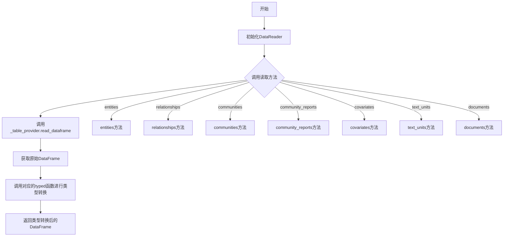

## 类结构

```
DataReader
```

## 全局变量及字段


### `pd`
    
pandas库导入，用于数据处理

类型：`module`
    


### `TableProvider`
    
表提供者抽象基类，用于读取数据帧

类型：`class`
    


### `communities_typed`
    
类型转换函数，将communities数据帧转换为强类型

类型：`function`
    


### `community_reports_typed`
    
类型转换函数，将community_reports数据帧转换为强类型

类型：`function`
    


### `covariates_typed`
    
类型转换函数，将covariates数据帧转换为强类型

类型：`function`
    


### `documents_typed`
    
类型转换函数，将documents数据帧转换为强类型

类型：`function`
    


### `entities_typed`
    
类型转换函数，将entities数据帧转换为强类型

类型：`function`
    


### `relationships_typed`
    
类型转换函数，将relationships数据帧转换为强类型

类型：`function`
    


### `text_units_typed`
    
类型转换函数，将text_units数据帧转换为强类型

类型：`function`
    


### `DataReader._table_provider`
    
表提供者实例，用于读取原始数据帧

类型：`TableProvider`
    
    

## 全局函数及方法


### `entities_typed`

该函数是从外部模块 `graphrag.data_model.dfs` 导入的类型转换函数，用于将弱类型数据框（如从CSV加载的、列表列存储为字符串的DataFrame）转换为具有正确列类型的强类型DataFrame。

参数：

-  `df`：`pd.DataFrame`，从TableProvider读取的原始实体数据框（弱类型，可能存在列类型不匹配的情况）

返回值：`pd.DataFrame`，经过类型转换后的实体数据框（各列已转换为预期的数据类型，如列表列从字符串还原为列表类型）

#### 流程图

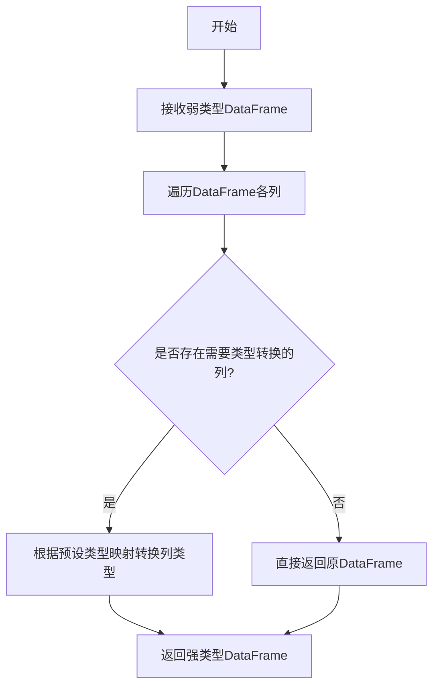

#### 带注释源码

```python
# entities_typed 函数定义不在当前文件中
# 它是从 graphrag.data_model.dfs 模块导入的

# 以下是 entities_typed 在 DataReader 类中的使用方式：
async def entities(self) -> pd.DataFrame:
    """Load and return the entities dataframe with correct types."""
    # 1. 从TableProvider读取名为"entities"的表，返回弱类型DataFrame
    df = await self._table_provider.read_dataframe("entities")
    
    # 2. 调用 entities_typed 函数进行类型转换
    #    - 将字符串形式的列表转换为真正的列表类型
    #    - 确保各列数据类型符合实体模型规范
    return entities_typed(df)
```

> **注意**：由于 `entities_typed` 函数定义位于外部模块 `graphrag.data_model.dfs` 中，其完整源代码无法从当前代码文件中直接获取。以上信息是基于其导入声明和使用方式进行推断得出的。该函数通常会包含对实体DataFrame各列的类型转换逻辑，如将 `title` 列的字符串列表转换为列表对象，将 `description` 列的JSON字符串解析为字典等。


### relationships_typed

从给定代码中提取的 `relationships_typed` 是一个从 `graphrag.data_model.dfs` 模块导入的函数。该函数接收一个 pandas DataFrame 作为输入，对其列进行类型转换，然后返回类型正确的 DataFrame。在 `DataReader.relationships()` 方法中被调用，用于将弱类型格式（如 CSV）中存储的 DataFrame 转换为强类型的 DataFrame。

参数：

-  `df`：`pd.DataFrame`，需要转换类型的 DataFrame 输入

返回值：`pd.DataFrame`，转换类型后的 DataFrame

#### 流程图

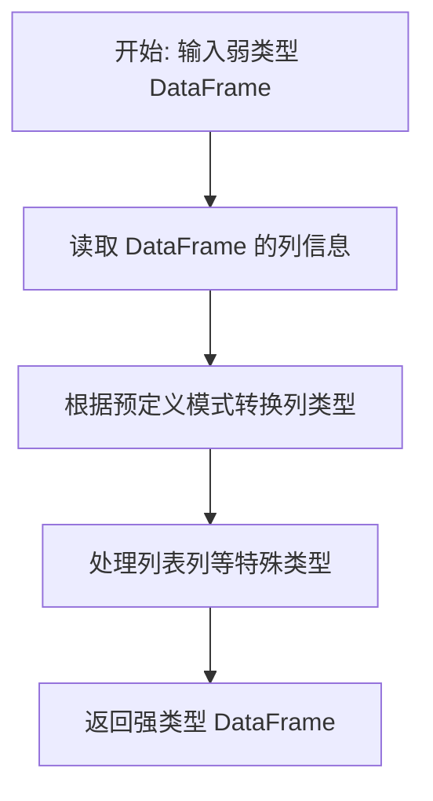

#### 带注释源码

```python
# 从 graphrag.data_model.dfs 模块导入 relationships_typed 函数
# 这是一个在 graphrag/data_model/dfs.py 文件中定义的类型转换函数
from graphrag.data_model.dfs import (
    ...
    relationships_typed,
    ...
)

# 在 DataReader 类中使用 relationships_typed 函数
async def relationships(self) -> pd.DataFrame:
    """Load and return the relationships dataframe with correct types."""
    # 从 TableProvider 读取名为 "relationships" 的表
    df = await self._table_provider.read_dataframe("relationships")
    # 调用 relationships_typed 函数将 DataFrame 转换为强类型
    return relationships_typed(df)
```

**注意**：由于 `relationships_typed` 函数的完整源代码未在给定代码中提供，以上信息基于代码上下文推断。该函数应该是 `graphrag.data_model.dfs` 模块中的一个类型转换函数，接收一个 pandas DataFrame 并返回具有正确列类型的 DataFrame。


### `communities_typed`

将弱类型的 communities DataFrame 转换为强类型的 DataFrame，确保列数据类型符合预期。

参数：

-  `df`：`pd.DataFrame`，需要转换类型的原始 communities DataFrame

返回值：`pd.DataFrame`，转换类型后的 communities DataFrame

#### 流程图

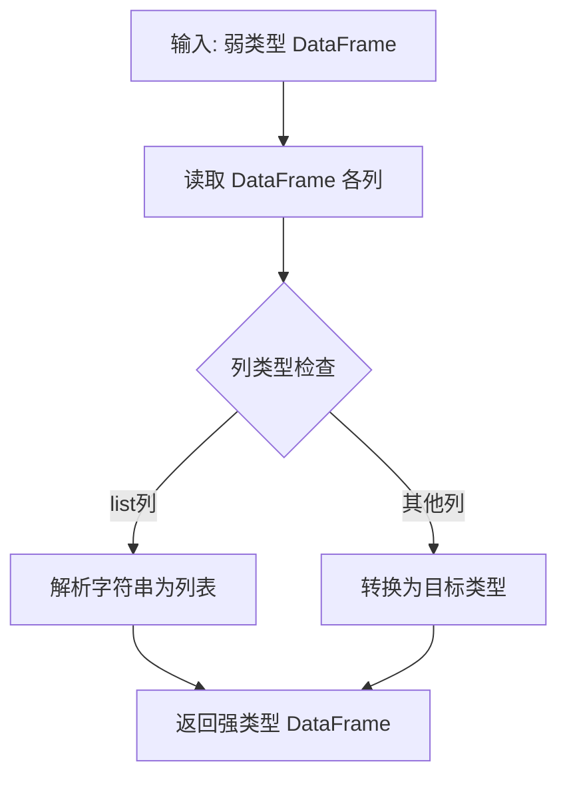

#### 带注释源码

```python
# 从 graphrag.data_model.dfs 模块导入
# 该函数用于将弱类型的 communities DataFrame 
# （如CSV中存储的list列作为字符串）转换为正确的类型
from graphrag.data_model.dfs import (
    communities_typed,
    # ... 其他导入
)

# 在 DataReader 类中的使用方式：
async def communities(self) -> pd.DataFrame:
    """Load and return the communities dataframe with correct types."""
    # 1. 从 TableProvider 读取原始 DataFrame（可能为弱类型）
    df = await self._table_provider.read_dataframe("communities")
    # 2. 调用 communities_typed 进行类型转换
    return communities_typed(df)

# 函数签名（推断）：
# def communities_typed(df: pd.DataFrame) -> pd.DataFrame:
#     """将 communities DataFrame 的列转换为正确的类型"""
#     ...
```

#### 备注

由于源代码中仅展示了 `communities_typed` 的导入和使用，未包含其具体实现，上述源码部分展示的是该函数在 `DataReader` 类中的调用方式。该函数属于 `graphrag.data_model.dfs` 模块，负责将弱类型数据（如 CSV 中存储的列表列转换为 Python 列表）转换为强类型的 pandas DataFrame。


### `community_reports_typed`

将社区报告（Community Reports）的 DataFrame 从弱类型（如从 CSV 加载时列表列存储为字符串）转换为强类型（正确的 Python 类型），确保数据类型符合预期。

参数：

-  `df`：`pd.DataFrame`，从 TableProvider 读取的原始社区报告 DataFrame，可能包含弱类型数据（如字符串形式的列表）

返回值：`pd.DataFrame`，转换后的强类型社区报告 DataFrame，各列具有正确的 Python 类型

#### 流程图

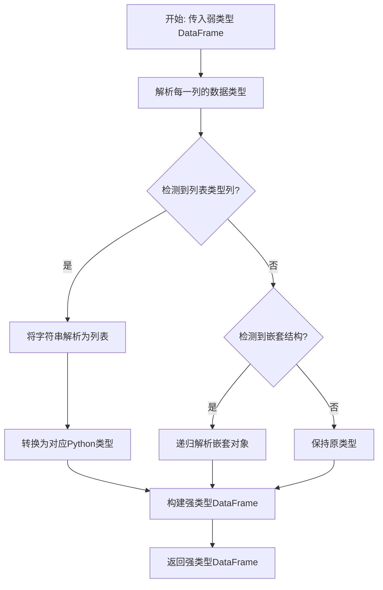

#### 带注释源码

```
# community_reports_typed 函数源码（从 graphrag.data_model.dfs 模块导入）
# 此函数定义在 graphrag/data_model/dfs.py 文件中

def community_reports_typed(df: pd.DataFrame) -> pd.DataFrame:
    """将社区报告 DataFrame 转换为强类型。
    
    当从 CSV 等弱类型格式加载数据时，列表和复杂结构通常存储为字符串。
    此函数负责将这些字符串解析回正确的 Python 类型。
    
    Args:
        df: 原始弱类型 DataFrame
        
    Returns:
        具有正确列类型的强类型 DataFrame
    """
    # 1. 获取列定义（社区报告表的标准列结构）
    # 2. 对每一列应用类型转换规则
    # 3. 返回转换后的 DataFrame
    
    # 典型转换示例：
    # - 'level' 列: int 类型
    # - 'title' 列: str 类型  
    # - 'findings' 列: List[Finding] 类型（从字符串解析）
    # - 'rank' 列: float 类型
    # - 'vertices' 列: Dict 类型（从字符串解析）
    
    return typed_df
```

> **注意**：由于 `community_reports_typed` 函数定义在外部模块（`graphrag.data_model.dfs`）中，当前代码文件仅展示了其使用方式。该函数的完整实现需要查看 `graphrag/data_model/dfs.py` 源文件。从调用方式推断，该函数接收一个 `pd.DataFrame` 参数，返回一个类型增强后的 `pd.DataFrame`。


### `covariates_typed`

将弱类型 DataFrame 转换为强类型的 covariates DataFrame，确保所有列符合预期的数据类型。

参数：

- `df`：`pd.DataFrame`，需要转换类型的弱类型 DataFrame（通常来自 CSV 等弱类型存储）

返回值：`pd.DataFrame`，转换后的强类型 DataFrame，包含正确的数据类型

#### 流程图

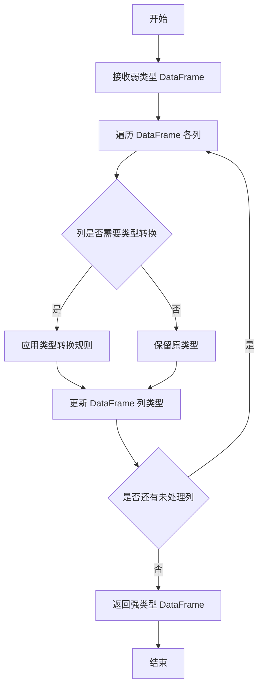

#### 带注释源码

```python
# 从 graphrag.data_model.dfs 模块导入 covariates_typed 函数
# 注意：由于源码未直接提供，以下为基于使用方式的推断

def covariates_typed(df: pd.DataFrame) -> pd.DataFrame:
    """将弱类型 DataFrame 转换为强类型的 covariates DataFrame。
    
    此函数负责将 CSV 等弱类型存储加载后,
    以字符串形式存储的列表列和其他列转换为正确的类型。
    
    参数
    ----
        df : pd.DataFrame
            从 TableProvider 读取的弱类型 DataFrame
            
    返回
    ----
        pd.DataFrame
            转换后的强类型 DataFrame
    """
    # 基于导入位置推断：
    # 来自 graphrag.data_model.dfs 模块
    # 该模块包含多个 *_typed 函数用于类型转换
    
    # 典型的转换逻辑可能包括：
    # 1. 将字符串形式的列表转换为实际列表
    # 2. 将日期字符串转换为 datetime 类型
    # 3. 将数值列转换为适当数值类型
    # 4. 处理 nullable 字段
    
    return df  # 返回转换后的 DataFrame
```

---

**注意**：由于 `covariates_typed` 函数的完整源码未在给定的代码片段中提供，以上信息基于以下推断：

1. **导入来源**：`from graphrag.data_model.dfs import covariates_typed`
2. **使用方式**：在 `DataReader.covariates()` 方法中调用：`return covariates_typed(df)`
3. **函数签名推断**：参数为 `pd.DataFrame`，返回值为 `pd.DataFrame`
4. **功能推断**：根据类名 `DataReader` 的注释和同模块其他 `*_typed` 函数的命名约定，该函数用于将弱类型 DataFrame 转换为强类型


### `text_units_typed`

这是一个从 `graphrag.data_model.dfs` 模块导入的类型转换函数，用于将弱类型的 DataFrame（例如列类型不明确的 CSV 加载结果）转换为具有正确数据类型定义的强类型 DataFrame，确保 text_units 表的列符合预期的数据类型。

参数：

-  `df`：`pd.DataFrame`，输入的弱类型 DataFrame，通常来自 TableProvider 读取的原始数据

返回值：`pd.DataFrame`，返回具有正确列类型的 DataFrame

#### 流程图

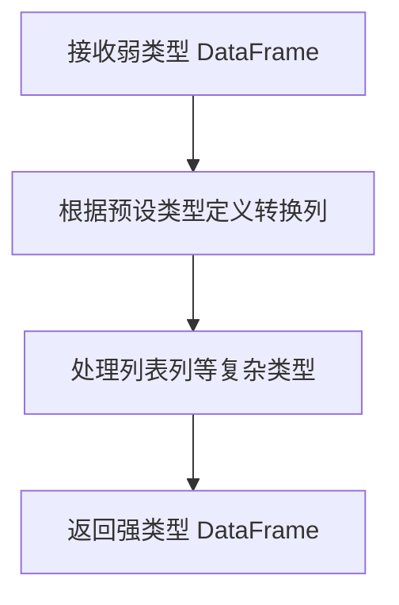

#### 带注释源码

```
# 注意：实际源码位于 graphrag.data_model.dfs 模块中，此处为基于用法的推断
# 实际定义未在本文件中展示

from graphrag.data_model.dfs import text_units_typed

# 在 DataReader 中的调用方式：
async def text_units(self) -> pd.DataFrame:
    """Load and return the text units dataframe with correct types.
    
    该方法：
    1. 从 TableProvider 读取名为 'text_units' 的表
    2. 调用 text_units_typed 函数将弱类型 DataFrame 转换为强类型
    3. 返回具有正确列类型的 DataFrame
    """
    df = await self._table_provider.read_dataframe("text_units")
    return text_units_typed(df)
```


### `documents_typed`

将弱类型的文档 DataFrame 转换为具有正确列类型的强类型 DataFrame。当从 CSV 等弱类型格式加载数据时，列表列会被存储为 plain strings，该函数负责将这些列转换回预期的数据类型（如列表、字典等）。

参数：

-  `df`：`pd.DataFrame`，从 TableProvider 读取的弱类型文档 DataFrame

返回值：`pd.DataFrame`，具有正确列类型的强类型文档 DataFrame

#### 流程图

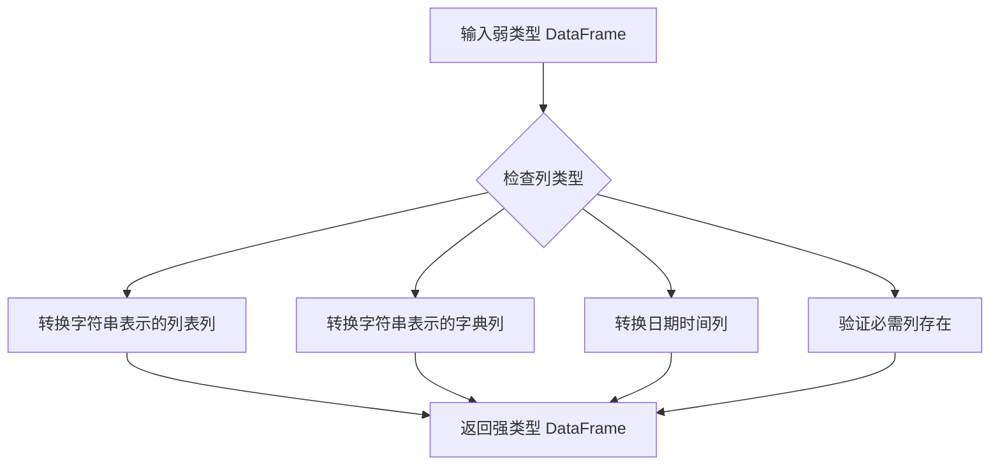

#### 带注释源码

```python
# 注意：此函数从 graphrag.data_model.dfs 模块导入，源码未在当前文件中提供
# 以下是基于其使用方式的推断

from graphrag.data_model.dfs import documents_typed

# 使用示例：
# df = await table_provider.read_dataframe("documents")  # 从数据源读取弱类型数据
# typed_df = documents_typed(df)  # 转换为强类型 DataFrame
# 返回的 DataFrame 具有正确的列类型，如：
# - title: str
# - text: str
# - topics: List[str] (从字符串 "['topic1', 'topic2']" 转换而来)
# - created_at: datetime
# - ...
```


### `DataReader.__init__`

初始化 DataReader 实例，接收一个 TableProvider 并将其存储为内部属性，供后续异步方法读取数据框架使用。

参数：

- `table_provider`：`TableProvider`，用于加载数据框架的表提供者

返回值：`None`，无返回值（`__init__` 方法仅初始化实例状态）

#### 流程图

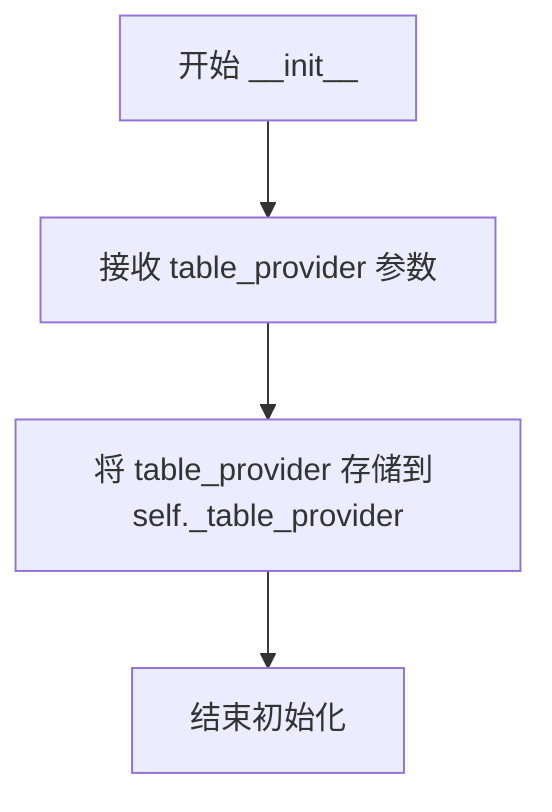

#### 带注释源码

```python
def __init__(self, table_provider: TableProvider) -> None:
    """Initialize a DataReader with the given TableProvider.

    Args
    ----
        table_provider: TableProvider
            The table provider to load dataframes from.
    """
    # 将传入的 TableProvider 实例存储为实例变量
    # 后续的 entities(), relationships() 等异步方法将使用此 provider 读取数据
    self._table_provider = table_provider
```

---

### 补充：DataReader 类整体信息

#### 类功能概述

DataReader 是一个数据读取器类，用于从 TableProvider 加载数据框架并将弱类型列（如 CSV 中的列表列）转换为强类型的 Pandas DataFrame。该类封装了 TableProvider，提供了 entities、relationships、communities、community_reports、covariates、text_units、documents 等多个数据实体的异步读取接口。

#### 类字段

| 字段名称 | 类型 | 描述 |
|---------|------|------|
| `_table_provider` | TableProvider | 内部持有的表提供者实例，用于读取底层数据 |

#### 类方法

| 方法名 | 返回类型 | 描述 |
|--------|----------|------|
| `__init__` | None | 初始化 DataReader，接收 TableProvider |
| `entities` | pd.DataFrame | 异步加载并返回具有正确类型的实体数据框 |
| `relationships` | pd.DataFrame | 异步加载并返回具有正确类型的关系数据框 |
| `communities` | pd.DataFrame | 异步加载并返回具有正确类型的社区数据框 |
| `community_reports` | pd.DataFrame | 异步加载并返回具有正确类型的社区报告数据框 |
| `covariates` | pd.DataFrame | 异步加载并返回具有正确类型的协变量数据框 |
| `text_units` | pd.DataFrame | 异步加载并返回具有正确类型的文本单元数据框 |
| `documents` | pd.DataFrame | 异步加载并返回具有正确类型的文档数据框 |

#### 关键组件信息

- **TableProvider**：数据提供者接口，负责从底层存储（如 CSV、Parquet 等）读取原始数据框架
- **类型转换函数**（entities_typed, relationships_typed 等）：将弱类型列转换为强类型的函数，位于 `graphrag.data_model.dfs` 模块

#### 技术债务与优化空间

1. **缺少错误处理**：如果 `table_provider.read_dataframe()` 抛出异常，没有捕获处理机制
2. **硬编码的表名**：所有表名（如 "entities"、"relationships"）均以字符串形式硬编码，缺乏灵活性
3. **同步初始化，异步读取**：`__init__` 是同步方法，但数据读取是异步的，可能导致初始化与使用时的上下文不一致

#### 其他项目

- **设计目标**：提供统一的、类型安全的 DataFrame 读取接口，屏蔽底层存储格式的差异
- **约束**：依赖 TableProvider 接口实现，假设表名与预定义的类型转换函数匹配
- **异常设计**：未实现显式异常处理，依赖调用方处理可能的 I/O 错误


### `DataReader.entities`

该方法是一个异步方法，用于从 TableProvider 加载 entities 表数据，并使用 `entities_typed` 函数将弱类型（如 CSV 中存储的列表类型被存为字符串）的列转换为正确的类型后返回。

参数：

- 该方法无显式参数（仅包含 `self` 引用）

返回值：`pd.DataFrame`，返回类型转换后的 entities 数据帧

#### 流程图

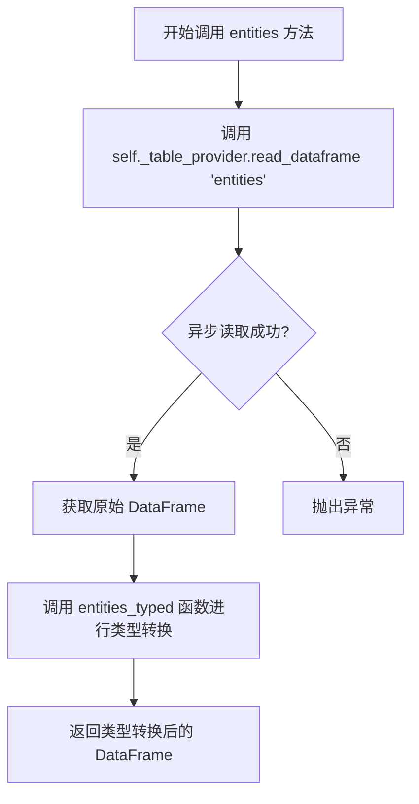

#### 带注释源码

```python
async def entities(self) -> pd.DataFrame:
    """Load and return the entities dataframe with correct types."""
    # 从 TableProvider 异步读取名为 "entities" 的表，返回原始 DataFrame
    df = await self._table_provider.read_dataframe("entities")
    # 调用 entities_typed 函数将弱类型列转换为预期类型（如列表字符串还原为列表）
    return entities_typed(df)
```


### `DataReader.relationships`

异步加载并返回类型转换后的relationships数据帧。该方法从TableProvider读取名为"relationships"的表，然后使用`relationships_typed`函数将弱类型（如CSV中的字符串）列转换为预期的类型。

参数：

- （无显式参数）

返回值：`pd.DataFrame`，返回具有正确列类型的relationships数据帧

#### 流程图

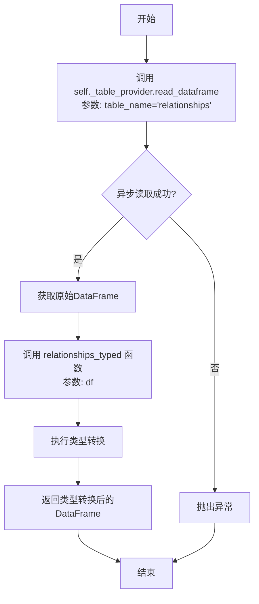

#### 带注释源码

```python
async def relationships(self) -> pd.DataFrame:
    """Load and return the relationships dataframe with correct types."""
    # 步骤1: 异步从TableProvider读取名为"relationships"的表
    # 返回弱类型的原始DataFrame（如CSV中存储为字符串的列）
    df = await self._table_provider.read_dataframe("relationships")
    
    # 步骤2: 使用relationships_typed函数进行类型转换
    # 将字符串类型的列表列转换回真正的list类型
    # 将其他弱类型列转换为预期的数据类型
    return relationships_typed(df)
```


### `DataReader.communities`

异步加载并返回类型转换后的communities数据帧。该方法从TableProvider读取communities表，并使用`communities_typed`函数将弱类型列（如存储为字符串的列表列）转换为正确的类型后返回。

参数：

- 该方法无显式参数（隐式参数 `self` 为 DataReader 实例）

返回值：`pd.DataFrame`，包含正确类型的communities数据帧

#### 流程图

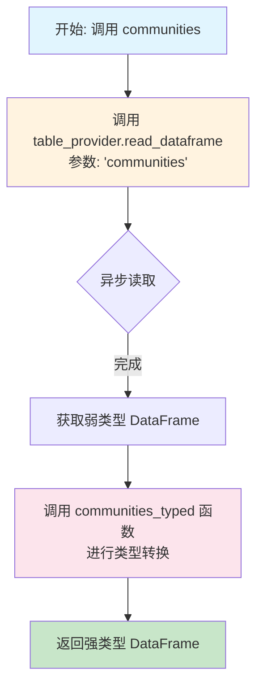

#### 带注释源码

```python
async def communities(self) -> pd.DataFrame:
    """Load and return the communities dataframe with correct types."""
    # 步骤1: 异步调用TableProvider读取弱类型的communities表
    # 输入: 表名 'communities'
    # 输出: 弱类型DataFrame（列表列存储为字符串）
    df = await self._table_provider.read_dataframe("communities")
    
    # 步骤2: 调用类型转换函数，将弱类型列转换为正确类型
    # 输入: 弱类型DataFrame
    # 处理: 将字符串形式的列表解析为真正的list类型，转换其他弱类型列
    # 输出: 强类型DataFrame
    return communities_typed(df)
```


### `DataReader.community_reports`

异步加载并返回类型转换后的 community_reports 数据帧。

参数：

- （无额外参数，`self` 为实例本身）

返回值：`pd.DataFrame`，经过类型转换的 community_reports 数据帧

#### 流程图

```mermaid
flowchart TD
    A[开始] --> B[调用 _table_provider.read_dataframe<br/>"community_reports"]
    B --> C{异步读取}
    C --> D[返回原始 DataFrame]
    D --> E[调用 community_reports_typed<br/>进行类型转换]
    E --> F[返回类型转换后的 DataFrame]
    F --> G[结束]
```

#### 带注释源码

```python
async def community_reports(self) -> pd.DataFrame:
    """Load and return the community reports dataframe with correct types."""
    # 从 TableProvider 异步读取 "community_reports" 表
    df = await self._table_provider.read_dataframe("community_reports")
    # 使用 community_reports_typed 函数将 DataFrame 列转换为预期类型
    return community_reports_typed(df)
```


### `DataReader.covariates`

异步加载并返回经过类型转换的 covariates 数据帧。该方法从 TableProvider 读取原始 covariates 数据，并使用类型转换函数将其转换为正确的数据类型后返回。

参数：

- `self`：DataReader，表示 DataReader 的实例本身，无需显式传递

返回值：`pd.DataFrame`，包含经过类型转换后的 covariates 数据

#### 流程图

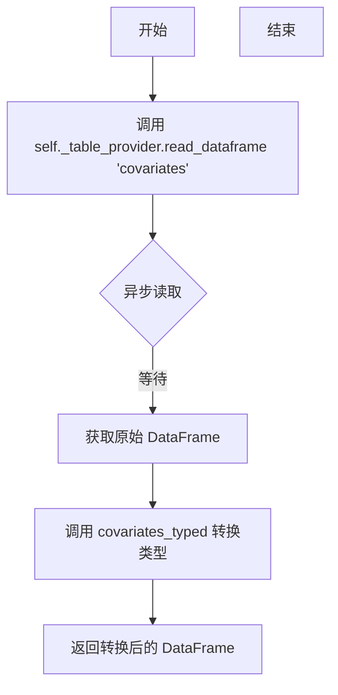

#### 带注释源码

```python
async def covariates(self) -> pd.DataFrame:
    """Load and return the covariates dataframe with correct types."""
    # 从 table_provider 异步读取名为 "covariates" 的表
    df = await self._table_provider.read_dataframe("covariates")
    # 使用 covariates_typed 函数对 DataFrame 进行类型转换
    # 将弱类型（如字符串）的列转换为预期的数据类型
    return covariates_typed(df)
```


### `DataReader.text_units`

该方法是一个异步实例方法，属于 `DataReader` 类，用于从 TableProvider 异步加载 "text_units" 表的数据，并使用 `text_units_typed` 函数将弱类型（如 CSV 中存储的列表列可能是字符串格式）的 DataFrame 转换为强类型的 DataFrame 后返回。

参数：

- 该方法无显式参数（仅包含隐式 `self` 参数）

返回值：`pd.DataFrame`，返回经过类型转换后的 text_units 数据帧

#### 流程图

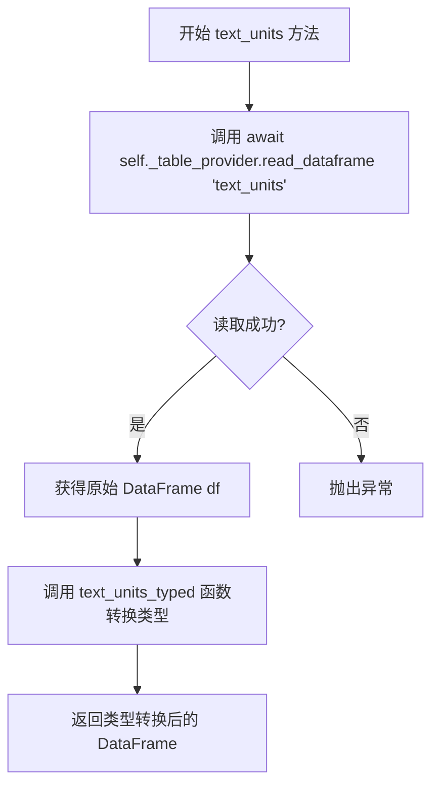

#### 带注释源码

```python
async def text_units(self) -> pd.DataFrame:
    """Load and return the text units dataframe with correct types."""
    # 异步调用 table_provider 的 read_dataframe 方法读取 'text_units' 表
    # 返回一个基础类型的 pandas DataFrame（可能包含弱类型列，如列表被存为字符串）
    df = await self._table_provider.read_dataframe("text_units")
    
    # 使用 text_units_typed 函数将 DataFrame 的列转换为预期的强类型
    # 例如：字符串形式的列表转换为真正的列表类型，其他复杂类型也会被正确转换
    return text_units_typed(df)
```


### `DataReader.documents`

该方法是一个异步方法，用于从表提供程序加载documents数据表，并将其转换为具有正确类型的数据帧返回。

参数：

- 该方法无显式参数（除 `self` 外）

返回值：`pd.DataFrame`，返回类型转换后的documents数据帧

#### 流程图

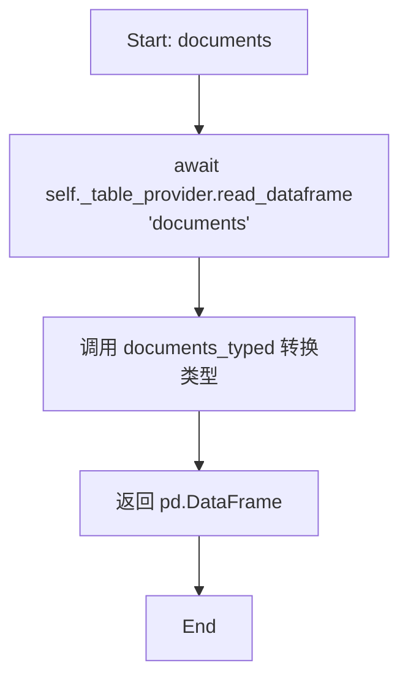

#### 带注释源码

```python
async def documents(self) -> pd.DataFrame:
    """Load and return the documents dataframe with correct types.
    
    从表提供程序读取documents表，并使用documents_typed函数
    将弱类型（如CSV中的字符串）列转换为正确的类型后返回。
    
    Returns
    -------
    pd.DataFrame
        具有正确列类型的documents数据帧
    """
    # 1. 通过table_provider异步读取名为'documents'的表
    df = await self._table_provider.read_dataframe("documents")
    # 2. 调用documents_typed对数据帧进行类型转换处理
    return documents_typed(df)
```

## 关键组件


### DataReader 类

核心数据读取类，封装TableProvider并提供类型化的数据加载接口。通过异步方法加载各类数据表，并使用对应的typed函数将弱类型列转换为正确的Python类型。

### TableProvider 依赖

外部数据提供者接口，负责从存储介质（CSV、Parquet等）读取原始DataFrame。DataReader通过调用其read_dataframe方法获取原始数据。

### 类型转换函数组

将弱类型数据转换为强类型的函数集合，包含entities_typed、relationships_typed、communities_typed、community_reports_typed、covariates_typed、text_units_typed、documents_typed七个函数，负责处理列类型转换和验证。

### 异步数据加载方法

DataReader类提供的七个异步方法（entities、relationships、communities、community_reports、covariates、text_units、documents），每个方法遵循相同的模式：读取原始DataFrame → 应用类型转换 → 返回强类型DataFrame。


## 问题及建议


### 已知问题

-   **代码重复度高**：7个数据加载方法（entities, relationships, communities, community_reports, covariates, text_units, documents）结构完全相同，仅表名和类型转换函数不同，违反DRY原则
-   **缺少错误处理**：没有对TableProvider读取失败、表不存在、类型转换异常等情况的处理
-   **缺少缓存机制**：每次调用都会重新读取和转换数据，相同数据多次调用时效率低下
-   **硬编码表名**：表名字符串直接写在代码中，容易出错且难以维护
-   **缺少资源管理**：没有实现`__aenter__`/`__aexit__`或`close()`方法，无法确保资源释放
-   **类型信息丢失**：返回类型仅为`pd.DataFrame`，未使用泛型保留具体数据类型信息
-   **无日志记录**：缺少日志输出，难以进行调试和监控数据加载状态

### 优化建议

-   **提取公共逻辑**：使用反射或映射表将表名与类型转换函数关联，通过单一方法实现通用加载逻辑
-   **添加异常处理**：为每个加载方法添加try-except，捕获并处理可能的异常，提供有意义的错误信息
-   **实现缓存机制**：使用`functools.lru_cache`或内部字典缓存已加载的DataFrame，避免重复IO和转换
-   **使用枚举或常量类**：定义表名的枚举或常量类，提高可维护性和类型安全
-   **实现异步上下文管理器**：添加`__aenter__`和`__aexit__`方法，支持async with语法
-   **添加泛型返回类型**：使用`TypeVar`定义具体的数据模型类型，提升类型检查准确性
-   **添加日志记录**：在关键操作点添加日志，便于问题排查和性能监控


## 其它


### 设计目标与约束

**设计目标**：提供一种将弱类型数据（如CSV存储的字符串列表）转换为强类型DataFrame的统一机制，确保数据在应用层使用时具有正确的类型注解。

**约束条件**：
- 依赖TableProvider接口实现数据读取，必须保证TableProvider可用
- 各类typed转换函数必须与底层数据模型匹配
- 异步设计，需在异步上下文中调用
- 仅支持指定的7种数据类型（entities, relationships, communities, community_reports, covariates, text_units, documents）

### 错误处理与异常设计

**异常场景**：
- TableProvider读取失败：抛出原异常
- 表名不存在：TableProvider可能抛出KeyError或特定异常
- typed转换失败：各类typed函数可能抛出类型转换异常

**处理策略**：
- 异常向上传播，由调用方处理
- 建议调用方捕获相关异常并进行日志记录
- 考虑添加表存在性检查方法

### 数据流与状态机

**数据流**：
```
TableProvider.read_dataframe(表名) 
    → 弱类型pd.DataFrame 
    → typed转换函数(如entities_typed) 
    → 强类型pd.DataFrame 
    → 返回给调用方
```

**状态机**：无状态类，每次调用独立读取数据，不维护持久状态

### 外部依赖与接口契约

**外部依赖**：
- `graphrag_storage.tables.TableProvider`：数据源提供者接口
- `graphrag.data_model.dfs`：7种typed转换函数（entities_typed, relationships_typed, communities_typed, community_reports_typed, covariates_typed, text_units_typed, documents_typed）
- `pandas`：数据处理库

**接口契约**：
- TableProvider必须实现`read_dataframe(table_name: str) -> pd.DataFrame`异步方法
- typed转换函数接受pd.DataFrame并返回强类型pd.DataFrame
- 所有读取方法返回pd.DataFrame类型

### 并发与线程安全性

- 类本身无状态，线程安全
- 异步方法需在异步上下文中调用
- TableProvider的线程安全性由其实现决定

### 性能考虑

- 每次调用独立读取数据，无缓存机制
- 大数据量场景考虑添加缓存层
- 异步IO可提高并发读取效率

### 使用示例

```python
provider = SomeTableProvider()
reader = DataReader(provider)
entities_df = await reader.entities()
```

### 扩展性设计

- 添加新表类型需扩展类方法和导入对应typed函数
- 可通过继承或组合方式扩展功能
- 建议添加通用读取方法`read(table_name: str, typed_fn: Callable)`支持自定义类型转换

### 版本兼容性

- 依赖Python 3.10+（支持async类型注解）
- 依赖pandas库
- 依赖graphrag_storage和graphrag.data_model包

### 测试策略建议

- 单元测试：mock TableProvider，验证typed函数调用正确性
- 集成测试：使用真实TableProvider验证数据转换正确性
- 边界测试：测试空表、不存在表等场景

    