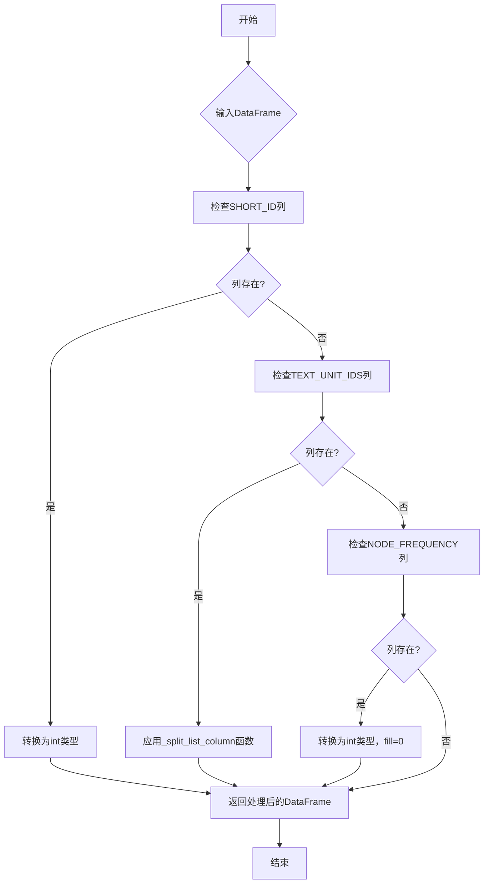
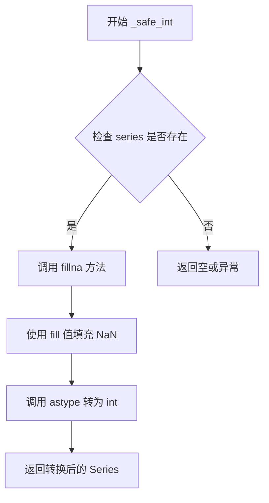
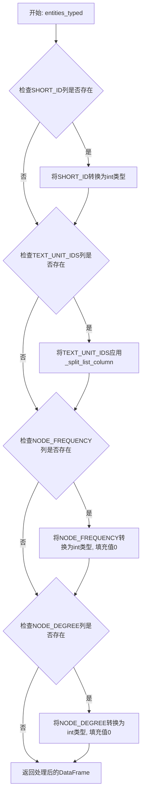
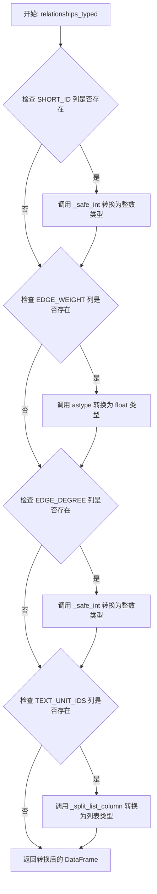
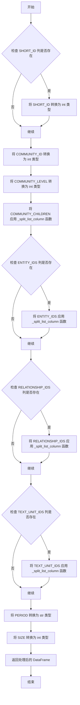
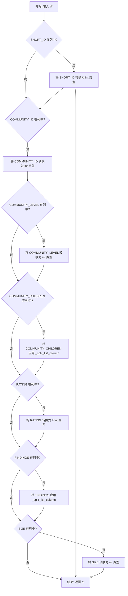
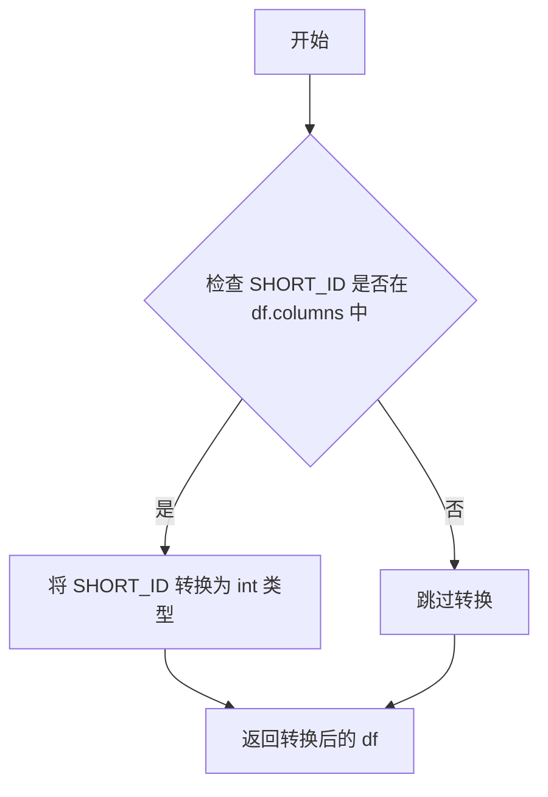
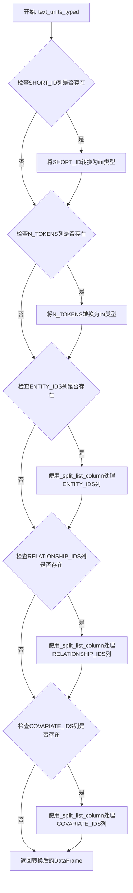
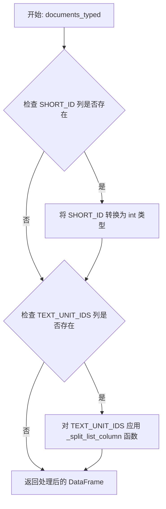

# `graphrag\packages\graphrag\graphrag\data_model\dfs.py` 详细设计文档

一个用于处理pandas DataFrame的工具包，通过一系列类型转换函数将弱类型存储的DataFrame转换为具有正确数据类型的形式，确保数据完整性和一致性。

## 整体流程



## 类结构

```
无类结构 (模块级函数集合)
├── _safe_int (私有辅助函数)
├── _split_list_column (私有辅助函数)
├── entities_typed (实体类型转换)
├── relationships_typed (关系类型转换)
├── communities_typed (社区类型转换)
├── community_reports_typed (社区报告类型转换)
├── covariates_typed (协变量类型转换)
├── text_units_typed (文本单元类型转换)
└── documents_typed (文档类型转换)
```

## 全局变量及字段


### `COMMUNITY_CHILDREN`
    
社区的子社区ID列表

类型：`list[str]`
    


### `COMMUNITY_ID`
    
社区的唯一标识符

类型：`int`
    


### `COMMUNITY_LEVEL`
    
社区的层级

类型：`int`
    


### `COVARIATE_IDS`
    
协变量ID列表

类型：`list[str]`
    


### `EDGE_DEGREE`
    
边的度数

类型：`int`
    


### `EDGE_WEIGHT`
    
边的权重

类型：`float`
    


### `ENTITY_IDS`
    
实体ID列表

类型：`list[str]`
    


### `FINDINGS`
    
社区报告中的发现列表

类型：`list[str]`
    


### `N_TOKENS`
    
文本单元中的令牌数量

类型：`int`
    


### `NODE_DEGREE`
    
节点的度数

类型：`int`
    


### `NODE_FREQUENCY`
    
节点的频率

类型：`int`
    


### `PERIOD`
    
时间段

类型：`str`
    


### `RATING`
    
评级

类型：`float`
    


### `RELATIONSHIP_IDS`
    
关系ID列表

类型：`list[str]`
    


### `SHORT_ID`
    
短ID

类型：`int`
    


### `SIZE`
    
大小

类型：`int`
    


### `TEXT_UNIT_IDS`
    
文本单元ID列表

类型：`list[str]`
    


    

## 全局函数及方法


### `_safe_int`

将 pandas Series 中的值安全转换为整数类型，用指定值填充 NaN 值，避免转换过程中出现错误。

参数：

-  `series`：`pd.Series`，需要转换的 pandas Series 对象
-  `fill`：`int`，用于填充 NaN 值的整数，默认为 -1

返回值：`pd.Series`，转换后的整数类型的 pandas Series

#### 流程图



#### 带注释源码

```python
def _safe_int(series: pd.Series, fill: int = -1) -> pd.Series:
    """Convert a series to int, filling NaN values first.
    
    Args:
        series: 需要转换的 pandas Series 对象
        fill: 用于填充 NaN 值的整数，默认为 -1
    
    Returns:
        转换后的整数类型的 pandas Series
    """
    # 首先使用 fillna 方法将 Series 中的 NaN 值替换为 fill 指定的默认值
    # 然后使用 astype 方法将整个 Series 转换为 int 类型
    return series.fillna(fill).astype(int)
```


### `_split_list_column`

该函数是一个私有工具函数，用于将包含列表字符串的DataFrame列（如 `"[item1, item2, item3]"` 或 `"'item1','item2'"` 格式）转换为实际的Python列表对象，确保数据在弱类型存储格式（如CSV）后能正确恢复为列表类型。

参数：

- `value`：`Any`，输入值，可能是字符串类型（需要解析为列表）或已经是列表/其他类型（直接返回）

返回值：`list[Any]`，如果输入是字符串则返回解析后的列表，否则直接返回原值

#### 流程图

```mermaid
flowchart TD
    A[开始: _split_list_column] --> B{value 是否为字符串?}
    B -->|是| C{value 是否为空字符串?}
    B -->|否| F[返回原 value]
    C -->|是| D[返回空列表 []]
    C -->|否| E[按逗号分割字符串]
    E --> G[对每个item去除 [] ' 空白字符]
    G --> H[返回处理后的列表]
    F --> I[结束]
    D --> I
    H --> I
```

#### 带注释源码

```python
def _split_list_column(value: Any) -> list[Any]:
    """Split a column containing a list string into an actual list.
    
    处理从弱类型存储（如CSV）读取的列表列，将字符串格式的列表
    转换为Python列表对象。支持多种输入格式：
    - "[item1, item2, item3]"
    - "'item1', 'item2', 'item3'"
    - "item1,item2,item3"
    
    Args:
        value: 输入值，期望为字符串或其他类型
        
    Returns:
        list[Any]: 解析后的列表，或非字符串类型的原值
    """
    # 检查输入值是否为字符串类型
    if isinstance(value, str):
        # 空字符串直接返回空列表
        return [item.strip("[] '") for item in value.split(",")] if value else []
    # 非字符串类型（如已转换的列表、None等）直接返回
    return value
```


### `entities_typed`

该函数用于将实体数据 DataFrame 从弱类型存储格式（如 CSV 或 JSON）转换为具有正确数据类型的 DataFrame，确保数值列和列表列的类型符合预期。

参数：

- `df`：`pd.DataFrame`，输入的实体数据 DataFrame，可能包含弱类型存储的列

返回值：`pd.DataFrame`，返回类型校正后的实体数据 DataFrame

#### 流程图



#### 带注释源码

```python
def entities_typed(df: pd.DataFrame) -> pd.DataFrame:
    """Return the entities dataframe with correct types, in case it was stored in a weakly-typed format."""
    # 如果存在 SHORT_ID 列，将其转换为整数类型
    if SHORT_ID in df.columns:
        df[SHORT_ID] = _safe_int(df[SHORT_ID])
    
    # 如果存在 TEXT_UNIT_IDS 列，将字符串表示的列表转换为实际列表
    if TEXT_UNIT_IDS in df.columns:
        df[TEXT_UNIT_IDS] = df[TEXT_UNIT_IDS].apply(_split_list_column)
    
    # 如果存在 NODE_FREQUENCY 列，转换为整数（NaN填充为0）
    if NODE_FREQUENCY in df.columns:
        df[NODE_FREQUENCY] = _safe_int(df[NODE_FREQUENCY], 0)
    
    # 如果存在 NODE_DEGREE 列，转换为整数（NaN填充为0）
    if NODE_DEGREE in df.columns:
        df[NODE_DEGREE] = _safe_int(df[NODE_DEGREE], 0)

    return df
```


### `relationships_typed`

将关系数据框（DataFrame）转换为正确的列类型，以防数据以弱类型格式（如CSV或JSON）存储后丢失类型信息。该函数会检查并转换 SHORT_ID、EDGE_WEIGHT、EDGE_DEGREE 和 TEXT_UNIT_IDS 列的类型。

参数：

- `df`：`pd.DataFrame`，需要进行类型转换的关系数据框

返回值：`pd.DataFrame`，类型转换后的关系数据框

#### 流程图



#### 带注释源码

```python
def relationships_typed(df: pd.DataFrame) -> pd.DataFrame:
    """Return the relationships dataframe with correct types, in case it was stored in a weakly-typed format."""
    
    # 如果存在 SHORT_ID 列，将其转换为整数类型（处理可能的 NaN 值）
    if SHORT_ID in df.columns:
        df[SHORT_ID] = _safe_int(df[SHORT_ID])
    
    # 如果存在 EDGE_WEIGHT 列，将其转换为浮点数类型
    if EDGE_WEIGHT in df.columns:
        df[EDGE_WEIGHT] = df[EDGE_WEIGHT].astype(float)
    
    # 如果存在 EDGE_DEGREE 列，将其转换为整数类型（缺失值填充为 0）
    if EDGE_DEGREE in df.columns:
        df[EDGE_DEGREE] = _safe_int(df[EDGE_DEGREE], 0)
    
    # 如果存在 TEXT_UNIT_IDS 列，将其从字符串列表转换为实际列表类型
    if TEXT_UNIT_IDS in df.columns:
        df[TEXT_UNIT_IDS] = df[TEXT_UNIT_IDS].apply(_split_list_column)
    
    # 返回类型转换完成的关系数据框
    return df
```


### `communities_typed`

该函数用于将社区数据框（DataFrame）从弱类型格式转换为具有正确数据类型的格式，确保各列的数据类型符合预期，以便后续处理和分析。

参数：

- `df`：`pd.DataFrame`，输入的社区数据框，可能以弱类型格式存储（例如字符串形式的数字、列表字符串等）

返回值：`pd.DataFrame`，返回具有正确数据类型的社区数据框

#### 流程图



#### 带注释源码

```python
def communities_typed(df: pd.DataFrame) -> pd.DataFrame:
    """Return the communities dataframe with correct types, in case it was stored in a weakly-typed format."""
    
    # 如果存在 SHORT_ID 列，则将其转换为整数类型
    if SHORT_ID in df.columns:
        df[SHORT_ID] = df[SHORT_ID].astype(int)
    
    # 将 COMMUNITY_ID 列转换为整数类型（必选列）
    df[COMMUNITY_ID] = df[COMMUNITY_ID].astype(int)
    
    # 将 COMMUNITY_LEVEL 列转换为整数类型（必选列）
    df[COMMUNITY_LEVEL] = df[COMMUNITY_LEVEL].astype(int)
    
    # 将 COMMUNITY_CHILDREN 列应用 _split_list_column 函数，将列表字符串转换为实际列表
    df[COMMUNITY_CHILDREN] = df[COMMUNITY_CHILDREN].apply(_split_list_column)
    
    # 如果存在 ENTITY_IDS 列，则将其应用 _split_list_column 函数
    if ENTITY_IDS in df.columns:
        df[ENTITY_IDS] = df[ENTITY_IDS].apply(_split_list_column)
    
    # 如果存在 RELATIONSHIP_IDS 列，则将其应用 _split_list_column 函数
    if RELATIONSHIP_IDS in df.columns:
        df[RELATIONSHIP_IDS] = df[RELATIONSHIP_IDS].apply(_split_list_column)
    
    # 如果存在 TEXT_UNIT_IDS 列，则将其应用 _split_list_column 函数
    if TEXT_UNIT_IDS in df.columns:
        df[TEXT_UNIT_IDS] = df[TEXT_UNIT_IDS].apply(_split_list_column)
    
    # 将 PERIOD 列转换为字符串类型（必选列）
    df[PERIOD] = df[PERIOD].astype(str)
    
    # 将 SIZE 列转换为整数类型（必选列）
    df[SIZE] = df[SIZE].astype(int)

    # 返回具有正确类型的社区数据框
    return df
```


### `community_reports_typed`

该函数用于确保社区报告（community reports）DataFrame 的列具有正确的数据类型，处理可能以弱类型格式存储的数据，如将字符串转换为列表、将整数列强制转换等。

参数：

- `df`：`pd.DataFrame`，输入的社区报告 DataFrame，可能包含弱类型的列

返回值：`pd.DataFrame`，返回类型校正后的社区报告 DataFrame

#### 流程图



#### 带注释源码

```python
def community_reports_typed(df: pd.DataFrame) -> pd.DataFrame:
    """Return the community reports dataframe with correct types, in case it was stored in a weakly-typed format."""
    # 如果存在 SHORT_ID 列，将其转换为整数类型
    if SHORT_ID in df.columns:
        df[SHORT_ID] = df[SHORT_ID].astype(int)
    
    # 强制将 COMMUNITY_ID 列转换为整数类型
    df[COMMUNITY_ID] = df[COMMUNITY_ID].astype(int)
    
    # 强制将 COMMUNITY_LEVEL 列转换为整数类型
    df[COMMUNITY_LEVEL] = df[COMMUNITY_LEVEL].astype(int)
    
    # 如果存在 COMMUNITY_CHILDREN 列，将字符串格式的列表转换为实际列表
    df[COMMUNITY_CHILDREN] = df[COMMUNITY_CHILDREN].apply(_split_list_column)
    
    # 强制将 RATING 列转换为浮点数类型
    df[RATING] = df[RATING].astype(float)
    
    # 如果存在 FINDINGS 列，将字符串格式的列表转换为实际列表
    df[FINDINGS] = df[FINDINGS].apply(_split_list_column)
    
    # 强制将 SIZE 列转换为整数类型
    df[SIZE] = df[SIZE].astype(int)

    return df
```


### `covariates_typed`

将协变量数据框（DataFrame）转换为正确的数据类型，用于处理以弱类型格式存储的数据。

参数：

- `df`：`pd.DataFrame`，输入的协变量数据框，可能包含弱类型的列

返回值：`pd.DataFrame`，完成类型转换后的协变量数据框

#### 流程图



#### 带注释源码

```python
def covariates_typed(df: pd.DataFrame) -> pd.DataFrame:
    """Return the covariates dataframe with correct types, in case it was stored in a weakly-typed format."""
    # 检查数据框中是否存在 SHORT_ID 列，如果存在则将其转换为整数类型
    if SHORT_ID in df.columns:
        df[SHORT_ID] = df[SHORT_ID].astype(int)

    # 返回完成类型转换后的数据框
    return df
```


### `text_units_typed`

该函数用于将文本单元（Text Units）DataFrame从弱类型存储格式转换为正确的数据类型，确保SHORT_ID和N_TOKENS列为整型，ENTITY_IDS、RELATIONSHIP_IDS和COVARIATE_IDS列被正确解析为列表类型。

参数：

-  `df`：`pd.DataFrame`，需要类型转换的文本单元数据框

返回值：`pd.DataFrame`，类型转换后的文本单元数据框

#### 流程图



#### 带注释源码

```python
def text_units_typed(df: pd.DataFrame) -> pd.DataFrame:
    """Return the text units dataframe with correct types, in case it was stored in a weakly-typed format."""
    
    # 检查是否存在SHORT_ID列，如果存在则转换为整数类型
    if SHORT_ID in df.columns:
        df[SHORT_ID] = df[SHORT_ID].astype(int)
    
    # 将N_TOKENS列转换为整数类型（必选列）
    df[N_TOKENS] = df[N_TOKENS].astype(int)
    
    # 检查是否存在ENTITY_IDS列，如果存在则使用_split_list_column处理为列表
    if ENTITY_IDS in df.columns:
        df[ENTITY_IDS] = df[ENTITY_IDS].apply(_split_list_column)
    
    # 检查是否存在RELATIONSHIP_IDS列，如果存在则使用_split_list_column处理为列表
    if RELATIONSHIP_IDS in df.columns:
        df[RELATIONSHIP_IDS] = df[RELATIONSHIP_IDS].apply(_split_list_column)
    
    # 检查是否存在COVARIATE_IDS列，如果存在则使用_split_list_column处理为列表
    if COVARIATE_IDS in df.columns:
        df[COVARIATE_IDS] = df[COVARIATE_IDS].apply(_split_list_column)

    # 返回类型转换完成后的DataFrame
    return df
```

#### 相关全局变量和函数

- `SHORT_ID`：全局变量，字符串类型，表示短ID列名
- `N_TOKENS`：全局变量，字符串类型，表示token数量列名
- `ENTITY_IDS`：全局变量，字符串类型，表示实体ID列表列名
- `RELATIONSHIP_IDS`：全局变量，字符串类型，表示关系ID列表列名
- `COVARIATE_IDS`：全局变量，字符串类型，表示协变量ID列表列名
- `_split_list_column`：全局函数，将列表字符串列转换为实际列表


### `documents_typed`

此函数用于将存储在弱类型格式中的文档数据框（DataFrame）转换为正确的类型，确保数据的一致性和可用性。

参数：

- `df`：`pd.DataFrame`，输入的文档数据框，可能包含弱类型化的列

返回值：`pd.DataFrame`，返回类型正确化后的文档数据框

#### 流程图



#### 带注释源码

```python
def documents_typed(df: pd.DataFrame) -> pd.DataFrame:
    """Return the documents dataframe with correct types, in case it was stored in a weakly-typed format."""
    # 检查 DataFrame 中是否存在 SHORT_ID 列
    # 如果存在，将其转换为整数类型
    if SHORT_ID in df.columns:
        df[SHORT_ID] = df[SHORT_ID].astype(int)
    
    # 检查 DataFrame 中是否存在 TEXT_UNIT_IDS 列
    # 如果存在，应用 _split_list_column 函数将列表字符串转换为实际列表
    if TEXT_UNIT_IDS in df.columns:
        df[TEXT_UNIT_IDS] = df[TEXT_UNIT_IDS].apply(_split_list_column)

    # 返回处理后的 DataFrame
    return df
```

## 关键组件


### 核心功能概述

该代码是一个DataFrame类型转换工具包，用于将弱类型存储的pandas DataFrame（通常来自CSV等弱类型存储）转换为具有正确数据类型的DataFrame，确保数据在后续处理中的类型安全性和一致性。

### 文件运行流程

1. 导入必要的类型和模式常量
2. 定义辅助函数 `_safe_int` 和 `_split_list_column` 用于类型转换
3. 为7种不同数据实体提供类型转换函数（entities, relationships, communities, community_reports, covariates, text_units, documents）
4. 每个转换函数检查并转换特定的列类型

### 全局函数详情

#### `_safe_int`

- **参数**: `series: pd.Series`, `fill: int = -1`
- **参数描述**: pandas Series列，可选的填充值
- **返回值**: `pd.Series`
- **返回值描述**: 转换为整数类型且填充NaN后的Series
- **功能**: 将Series转换为int类型，先填充NaN值再转换，避免转换错误

#### `_split_list_column`

- **参数**: `value: Any`
- **参数描述**: 任意类型的值，可能是字符串或列表
- **返回值**: `list[Any]`
- **返回值描述**: 解析后的列表
- **功能**: 将包含列表字符串（如"[1, 2, 3]"）解析为实际的Python列表

#### `entities_typed`

- **参数**: `df: pd.DataFrame`
- **参数描述**: 实体DataFrame
- **返回值**: `pd.DataFrame`
- **返回值描述**: 类型校正后的实体DataFrame

#### `relationships_typed`

- **参数**: `df: pd.DataFrame`
- **参数描述**: 关系DataFrame
- **返回值**: `pd.DataFrame`
- **返回值描述**: 类型校正后的关系DataFrame

#### `communities_typed`

- **参数**: `df: pd.DataFrame`
- **参数描述**: 社区DataFrame
- **返回值**: `pd.DataFrame`
- **返回值描述**: 类型校正后的社区DataFrame

#### `community_reports_typed`

- **参数**: `df: pd.DataFrame`
- **参数描述**: 社区报告DataFrame
- **返回值**: `pd.DataFrame`
- **返回值描述**: 类型校正后的社区报告DataFrame

#### `covariates_typed`

- **参数**: `df: pd.DataFrame`
- **参数描述**: 协变量DataFrame
- **返回值**: `pd.DataFrame`
- **返回值描述**: 类型校正后的协变量DataFrame

#### `text_units_typed`

- **参数**: `df: pd.DataFrame`
- **参数描述**: 文本单元DataFrame
- **返回值**: `pd.DataFrame`
- **返回值描述**: 类型校正后的文本单元DataFrame

#### `documents_typed`

- **参数**: `df: pd.DataFrame`
- **参数描述**: 文档DataFrame
- **返回值**: `pd.DataFrame`
- **返回值描述**: 类型校正后的文档DataFrame

### 关键组件信息

### 类型转换函数集合

7个 `*_typed` 函数组成核心组件集合，用于规范化不同实体DataFrame的数据类型

### 辅助转换工具

`_safe_int` 和 `_split_list_column` 是类型转换的基础工具函数，被各类型转换函数复用

### 模式常量依赖

从 `graphrag.data_model.schemas` 导入的常量定义了在DataFrame中需要处理的列名，包括 `SHORT_ID`, `TEXT_UNIT_IDS`, `NODE_FREQUENCY`, `EDGE_WEIGHT`, `COMMUNITY_ID` 等

### 技术债务与优化空间

1. **缺少错误处理**: 各转换函数未对缺失列进行警告或错误处理，可能导致静默失败
2. **代码重复**: 多个函数中存在重复的类型检查逻辑（如 `if SHORT_ID in df.columns`），可提取为通用函数
3. **类型注解不完整**: 部分函数返回类型注解可更精确
4. **扩展性有限**: 新增数据类型需要手动添加新函数，可考虑使用注册模式或配置驱动
5. **缺乏验证**: 转换后未验证数据完整性，可能存在隐式错误

### 其它项目

#### 设计目标

- 确保从弱类型存储（如CSV）加载的DataFrame具有正确的Python数据类型
- 为GraphRAG数据处理流水线提供类型安全的DataFrame输入

#### 约束

- 依赖外部常量定义（graphrag.data_model.schemas）
- 仅处理预设的7种数据类型
- 假设输入DataFrame包含模式常量中定义的列

#### 错误处理

- 当前实现依赖pandas的隐式类型转换
- 缺失列时使用条件检查跳过，但无明确错误提示
- 建议添加列缺失的日志警告

#### 外部依赖

- pandas: DataFrame操作
- graphrag.data_model.schemas: 模式常量定义
- typing: 类型注解支持


## 问题及建议


### 已知问题

-   **DataFrame原地修改（副作用）**：所有类型转换函数直接修改输入的DataFrame，而非返回新DataFrame，导致难以预测的副作用，破坏函数纯正性，增加调试难度
-   **代码重复**：`_split_list_column` 在7个函数中重复调用，`SHORT_ID` 类型检查逻辑在所有函数中重复出现
-   **类型转换方式不一致**：同一个字段在不同函数中使用不同的转换方式（如 `SHORT_ID` 在 `entities_typed` 使用 `_safe_int`，在 `communities_typed` 使用 `astype(int)`），缺乏统一性
-   **字符串解析逻辑脆弱**：`_split_list_column` 使用简单的 `strip("[] '")` 和 `split(",")` 解析，无法处理包含逗号的元素、空格处理不完善、缺少对JSON格式列表的支持
-   **缺少输入验证**：没有验证DataFrame是否为None、没有验证必需列是否存在、没有处理空DataFrame的边界情况
-   **硬编码填充值**：`_safe_int` 中默认填充值 `-1` 硬编码，无法为不同字段指定不同的填充值
-   **类型转换未处理NaN一致性**：有些地方直接 `astype(int)` 可能在遇到NaN时抛出异常，而不是像 `_safe_int` 那样先填充
-   **缺少日志和错误处理**：类型转换失败时没有有意义的错误消息，难以追踪问题根源

### 优化建议

-   **返回副本而非修改原对象**：修改所有函数返回新的DataFrame副本，或添加 `inplace` 参数控制行为
-   **提取公共逻辑**：创建元数据配置字典，将列名与目标类型、默认值映射关系集中管理，减少重复代码
-   **统一类型转换策略**：定义一致的转换规则，明确哪些字段使用安全转换（先填充后转）、哪些直接转类型
-   **改进字符串解析**：使用 `ast.literal_eval` 或 `json.loads` 解析列表字符串，增强鲁棒性
-   **添加输入验证**：在函数开头添加 `df is not None` 和必需列检查，提供清晰的验证错误
-   **支持自定义配置**：允许调用者指定不同字段的填充值，而非全局硬编码
-   **添加错误处理和日志**：用try-except包装类型转换，捕获并记录具体错误信息
-   **添加类型注解完善**：为返回值添加 `-> pd.DataFrame` 注解，增强代码可读性和类型安全

## 其它


### 设计目标与约束

本模块的设计目标是确保从弱类型存储（如CSV、JSON）中加载的DataFrame具有正确的Python数据类型，以便后续的图谱处理和分析操作能够正常进行。约束包括：1) 输入必须是pandas DataFrame；2) 列名必须与预定义的模式常量匹配；3) 函数为纯转换函数，不修改原始DataFrame的引用（虽然会修改传入的df对象）；4) 支持的DataFrame类型仅限于entities、relationships、communities、community_reports、covariates、text_units、documents七种。

### 错误处理与异常设计

本模块采用宽松的错误处理策略，使用条件检查（if column in df.columns）来避免缺失列导致的KeyError。若列不存在则跳过该列的处理。对于空值，使用fillna()方法填充默认值后进行类型转换。若数据类型无法转换（如包含非法字符的字符串），将抛出pandas的异常。设计建议：应添加更明确的异常处理和错误日志记录，以便追踪数据类型转换失败的原因。

### 数据流与状态机

数据流为：外部存储（CSV/JSON）→ pandas读取 → 弱类型DataFrame → 类型转换函数（如entities_typed） → 强类型DataFrame → 下游处理。无复杂状态机，状态转换简单：Untyped → Typed。每个转换函数独立处理特定类型的DataFrame，不涉及状态保持。

### 外部依赖与接口契约

主要依赖：1) pandas库，用于DataFrame操作；2) typing.Any类型提示；3) graphrag.data_model.schemas模块，提供列名常量。接口契约：输入均为pandas DataFrame，输出为类型修正后的同一DataFrame对象（修改原对象）。列名常量定义了所有可能的列，若输入DataFrame缺少某些列则静默跳过处理。

### 性能考虑

当前实现使用apply()方法处理列表列，对于大型DataFrame可能存在性能瓶颈。_safe_int()函数对整列进行操作效率较高。建议：1) 对于大规模数据，考虑使用向量化操作替代apply()；2) 可以添加缓存机制避免重复类型转换；3) 可以在函数入口添加类型检查以快速跳过已正确类型的DataFrame。

### 安全考虑

本模块主要处理数据转换，无直接的安全风险。但需要注意：1) _split_list_column函数使用strip()处理字符串，可能存在特殊字符注入风险；2) 来自外部文件的DataFrame应先进行验证再传入；3) 建议在数据入口添加Schema验证。

### 测试策略

建议测试覆盖：1) 各转换函数对正确DataFrame的处理；2) 缺失列时的行为；3) 空DataFrame处理；4) 包含NaN值的数据处理；5) 弱类型字符串数据（如"123"转为123）；6) 列表列的不同格式（空列表、单元素、多元素）；7) 边界情况（极端大整数、超长字符串）。

### 配置管理

本模块无外部配置需求，所有行为由预定义的schemas常量控制。类型转换的默认值（如fill=-1用于缺失值）硬编码在函数中，若需可配置化，建议提取为模块级常量或配置类。

### 版本兼容性

依赖pandas版本需支持fillna()、astype()、apply()等方法。建议pandas >= 1.0.0。Python版本需支持类型提示（3.5+）。与graphrag.data_model.schemas的接口契约需保持稳定，若列名常量变更需同步更新本模块。

### 使用示例

```python
import pandas as pd
from graphrag.data_model.schemas import ENTITY_IDS, TEXT_UNIT_IDS
from graphrag.storage.pipeline_storage import entities_typed

# 从CSV加载弱类型数据
df = pd.read_csv("entities.csv")

# 转换为强类型
df_typed = entities_typed(df)

# 验证类型转换结果
assert df_typed[ENTITY_IDS].iloc[0] == ["entity1", "entity2"]  # 列表类型
assert isinstance(df_typed[TEXT_UNIT_IDS].iloc[0], list)
```


    