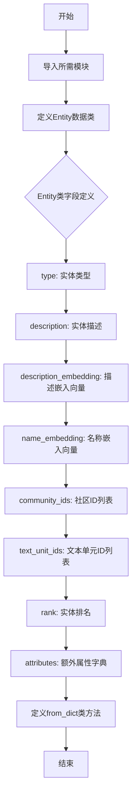
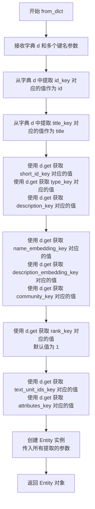

# `graphrag\packages\graphrag\graphrag\data_model\entity.py` 详细设计文档

这是一个定义Entity数据模型的源代码文件，Entity类继承自Named基类，用于表示系统中的实体对象，包含实体的类型、描述、嵌入向量、社区ID、文本单元ID、排名和自定义属性等字段，并提供了从字典数据创建Entity实例的类方法。

## 整体流程



## 类结构

```
Named (基类抽象)
└── Entity (数据类)
```

## 全局变量及字段


### `Entity.type`
    
Type of the entity (can be any string, optional).

类型：`str | None`
    


### `Entity.description`
    
Description of the entity (optional).

类型：`str | None`
    


### `Entity.description_embedding`
    
The semantic (i.e. text) embedding of the entity (optional).

类型：`list[float] | None`
    


### `Entity.name_embedding`
    
The semantic (i.e. text) embedding of the entity (optional).

类型：`list[float] | None`
    


### `Entity.community_ids`
    
The community IDs of the entity (optional).

类型：`list[str] | None`
    


### `Entity.text_unit_ids`
    
List of text unit IDs in which the entity appears (optional).

类型：`list[str] | None`
    


### `Entity.rank`
    
Rank of the entity, used for sorting (optional). Higher rank indicates more important entity. This can be based on centrality or other metrics.

类型：`int | None`
    


### `Entity.attributes`
    
Additional attributes associated with the entity (optional), e.g. start time, end time, etc. To be included in the search prompt.

类型：`dict[str, Any] | None`
    
    

## 全局函数及方法


### Entity

该类是一个数据模型，表示系统中的实体，继承自 `Named` 类。它包含了实体的类型、描述、语义嵌入、社区ID、文本单元ID、排名和自定义属性等信息，并提供了一个从字典数据创建实体实例的类方法。

参数：

- `cls`：类本身（Class method 的第一个隐含参数）
- `d`：`dict[str, Any]`，包含实体数据的字典
- `id_key`：`str`，字典中 ID 字段的键名（默认值为 "id"）
- `short_id_key`：`str`，字典中人类可读 ID 字段的键名（默认值为 "human_readable_id"）
- `title_key`：`str`，字典中标题字段的键名（默认值为 "title"）
- `type_key`：`str`，字典中类型字段的键名（默认值为 "type"）
- `description_key`：`str`，字典中描述字段的键名（默认值为 "description"）
- `description_embedding_key`：`str`，字典中描述嵌入字段的键名（默认值为 "description_embedding"）
- `name_embedding_key`：`str`，字典中名称嵌入字段的键名（默认值为 "name_embedding"）
- `community_key`：`str`，字典中社区字段的键名（默认值为 "community"）
- `text_unit_ids_key`：`str`，字典中文本单元 ID 字段的键名（默认值为 "text_unit_ids"）
- `rank_key`：`str`，字典中排名字段的键名（默认值为 "degree"）
- `attributes_key`：`str`，字典中属性字段的键名（默认值为 "attributes"）

返回值：`Entity`，从字典数据创建的新实体实例

#### 流程图

```mermaid
flowchart TD
    A[开始: from_dict 方法] --> B[接收字典参数 d 和多个键名参数]
    B --> C[提取 d[id_key] 作为 id]
    C --> D[提取 d[title_key] 作为 title]
    D --> E{检查 short_id_key 是否存在}
    E -->|是| F[提取 d.get(short_id_key) 作为 short_id]
    E -->|否| G[short_id 为 None]
    F --> H[依次提取 type, description, name_embedding, description_embedding, community_ids, rank, text_unit_ids, attributes]
    G --> H
    H --> I[使用提取的数据创建 Entity 实例]
    I --> J[返回 Entity 对象]
    
    style A fill:#f9f,stroke:#333
    style I fill:#9f9,stroke:#333
    style J fill:#9f9,stroke:#333
```

#### 带注释源码

```python
@dataclass
class Entity(Named):
    """A protocol for an entity in the system."""

    type: str | None = None
    """Type of the entity (can be any string, optional)."""

    description: str | None = None
    """Description of the entity (optional)."""

    description_embedding: list[float] | None = None
    """The semantic (i.e. text) embedding of the entity (optional)."""

    name_embedding: list[float] | None = None
    """The semantic (i.e. text) embedding of the entity (optional)."""

    community_ids: list[str] | None = None
    """The community IDs of the entity (optional)."""

    text_unit_ids: list[str] | None = None
    """List of text unit IDs in which the entity appears (optional)."""

    rank: int | None = 1
    """Rank of the entity, used for sorting (optional). Higher rank indicates more important entity. This can be based on centrality or other metrics."""

    attributes: dict[str, Any] | None = None
    """Additional attributes associated with the entity (optional), e.g. start time, end time, etc. To be included in the search prompt."""

    @classmethod
    def from_dict(
        cls,
        d: dict[str, Any],
        id_key: str = "id",
        short_id_key: str = "human_readable_id",
        title_key: str = "title",
        type_key: str = "type",
        description_key: str = "description",
        description_embedding_key: str = "description_embedding",
        name_embedding_key: str = "name_embedding",
        community_key: str = "community",
        text_unit_ids_key: str = "text_unit_ids",
        rank_key: str = "degree",
        attributes_key: str = "attributes",
    ) -> "Entity":
        """Create a new entity from the dict data."""
        return Entity(
            id=d[id_key],  # 从字典中提取ID字段
            title=d[title_key],  # 从字典中提取标题字段
            short_id=d.get(short_id_key),  # 使用get方法避免KeyError
            type=d.get(type_key),  # 获取类型，可选
            description=d.get(description_key),  # 获取描述，可选
            name_embedding=d.get(name_embedding_key),  # 获取名称嵌入，可选
            description_embedding=d.get(description_embedding_key),  # 获取描述嵌入，可选
            community_ids=d.get(community_key),  # 获取社区ID列表，可选
            rank=d.get(rank_key, 1),  # 获取排名，默认为1
            text_unit_ids=d.get(text_unit_ids_key),  # 获取文本单元ID列表，可选
            attributes=d.get(attributes_key),  # 获取额外属性，可选
        )
```


### `Any`

描述：代码中使用了 `Any` 类型（来自 `typing` 模块），但在给定的代码中并没有名为 `Any` 的函数或方法。`Any` 在此处作为类型注解使用，用于定义可能包含任意类型值的字段。

参数：
-  无（代码中不存在名为 `Any` 的函数或方法）

返回值：
-  无（代码中不存在名为 `Any` 的函数或方法）

#### 流程图

```mermaid
graph TD
    A[代码分析] --> B{是否存在名为 Any 的函数/方法?}
    B -->|是| C[输出函数/方法信息]
    B -->|否| D[说明代码中 Any 的实际用途]
    
    D --> E[Any 作为类型注解使用]
    E --> F[用于以下字段:]
    F --> G[type: str | None]
    F --> H[description: str | None]
    F --> I[description_embedding: list[float] | None]
    F --> J[name_embedding: list[float] | None]
    F --> K[community_ids: list[str] | None]
    F --> L[text_unit_ids: list[str] | None]
    F --> M[rank: int | None]
    F --> N[attributes: dict[str, Any] | None]
```

#### 带注释源码

```python
# Copyright (c) 2024 Microsoft Corporation.
# Licensed under the MIT License

"""A package containing the 'Entity' model."""

from dataclasses import dataclass
from typing import Any  # Any 是类型提示，用于表示任意类型

from graphrag.data_model.named import Named


@dataclass
class Entity(Named):
    """A protocol for an entity in the system."""

    type: str | None = None
    """Type of the entity (can be any string, optional)."""

    description: str | None = None
    """Description of the entity (optional)."""

    description_embedding: list[float] | None = None
    """The semantic (i.e. text) embedding of the entity (optional)."""

    name_embedding: list[float] | None = None
    """The semantic (i.e. text) embedding of the entity (optional)."""

    community_ids: list[str] | None = None
    """The community IDs of the entity (optional)."""

    text_unit_ids: list[str] | None = None
    """List of text unit IDs in which the entity appears (optional)."""

    rank: int | None = 1
    """Rank of the entity, used for sorting (optional). Higher rank indicates more important entity. This can be based on centrality or other metrics."""

    attributes: dict[str, Any] | None = None
    """Additional attributes associated with the entity (optional), e.g. start time, end time, etc. To be included in the search prompt."""

    @classmethod
    def from_dict(
        cls,
        d: dict[str, Any],  # 参数 d 使用了 Any 类型提示，表示字典值可以是任意类型
        id_key: str = "id",
        short_id_key: str = "human_readable_id",
        title_key: str = "title",
        type_key: str = "type",
        description_key: str = "description",
        description_embedding_key: str = "description_embedding",
        name_embedding_key: str = "name_embedding",
        community_key: str = "community",
        text_unit_ids_key: str = "text_unit_ids",
        rank_key: str = "degree",
        attributes_key: str = "attributes",
    ) -> "Entity":
        """Create a new entity from the dict data."""
        return Entity(
            id=d[id_key],
            title=d[title_key],
            short_id=d.get(short_id_key),
            type=d.get(type_key),
            description=d.get(description_key),
            name_embedding=d.get(name_embedding_key),
            description_embedding=d.get(description_embedding_key),
            community_ids=d.get(community_key),
            rank=d.get(rank_key, 1),
            text_unit_ids=d.get(text_unit_ids_key),
            attributes=d.get(attributes_key),
        )
```

---

### 备注

给定的代码中**不存在**名为 `Any` 的函数或方法。`Any` 是 Python `typing` 模块中的一个特殊类型，用于表示变量可以是任意类型。

在代码中，`Any` 被用于：
1. 导入语句：`from typing import Any`
2. 字段类型注解：`attributes: dict[str, Any] | None = None`
3. 方法参数类型：`from_dict` 方法的 `d: dict[str, Any]` 参数

如果您需要分析 `from_dict` 方法，请告知我。


### `Entity.from_dict`

从字典数据创建新的实体对象，用于将外部数据（如JSON、字典）转换为 Entity 实例。

参数：

- `cls`：类本身（隐式参数），用于创建类实例
- `d`：`dict[str, Any]`，输入的字典数据，包含实体的各种属性
- `id_key`：`str`，默认为 `"id"`，指定字典中实体ID的键名
- `short_id_key`：`str`，默认为 `"human_readable_id"`，指定字典中人类可读ID的键名
- `title_key`：`str`，默认为 `"title"`，指定字典中标题的键名
- `type_key`：`str`，默认为 `"type"`，指定字典中类型的键名
- `description_key`：`str`，默认为 `"description"`，指定字典中描述的键名
- `description_embedding_key`：`str`，默认为 `"description_embedding"`，指定字典中描述嵌入向量的键名
- `name_embedding_key`：`str`，默认为 `"name_embedding"`，指定字典中名称嵌入向量的键名
- `community_key`：`str`，默认为 `"community"`，指定字典中社区ID列表的键名
- `text_unit_ids_key`：`str`，默认为 `"text_unit_ids"`，指定字典中文本单元ID列表的键名
- `rank_key`：`str`，默认为 `"degree"`，指定字典中实体排名的键名
- `attributes_key`：`str`，默认为 `"attributes"`，指定字典中额外属性的键名

返回值：`Entity`，新创建的实体对象

#### 流程图



#### 带注释源码

```python
@classmethod
def from_dict(
    cls,  # 类方法，第一个参数是类本身
    d: dict[str, Any],  # 输入字典，包含实体的各种属性数据
    id_key: str = "id",  # 实体ID在字典中的键名，默认"id"
    short_id_key: str = "human_readable_id",  # 人类可读ID的键名
    title_key: str = "title",  # 标题的键名
    type_key: str = "type",  # 实体类型的键名
    description_key: str = "description",  # 描述的键名
    description_embedding_key: str = "description_embedding",  # 描述嵌入向量的键名
    name_embedding_key: str = "name_embedding",  # 名称嵌入向量的键名
    community_key: str = "community",  # 社区ID列表的键名
    text_unit_ids_key: str = "text_unit_ids",  # 文本单元ID列表的键名
    rank_key: str = "degree",  # 实体排名的键名
    attributes_key: str = "attributes",  # 额外属性的键名
) -> "Entity":  # 返回新创建的Entity实例
    """Create a new entity from the dict data."""
    # 从字典d中创建并返回Entity实例
    # id和title使用d[]直接获取（必填字段）
    # 其他字段使用d.get()获取（可选字段，允许为None）
    return Entity(
        id=d[id_key],  # 必填：从字典中获取ID
        title=d[title_key],  # 必填：从字典中获取标题
        short_id=d.get(short_id_key),  # 可选：人类可读ID
        type=d.get(type_key),  # 可选：实体类型
        description=d.get(description_key),  # 可选：实体描述
        name_embedding=d.get(name_embedding_key),  # 可选：名称嵌入向量
        description_embedding=d.get(description_embedding_key),  # 可选：描述嵌入向量
        community_ids=d.get(community_key),  # 可选：社区ID列表
        rank=d.get(rank_key, 1),  # 可选：排名，默认值为1
        text_unit_ids=d.get(text_unit_ids_key),  # 可选：文本单元ID列表
        attributes=d.get(attributes_key),  # 可选：额外属性字典
    )
```

## 关键组件


### Entity 类

核心数据模型类，继承自 Named 类，用于表示系统中的实体对象，包含实体的类型、描述、嵌入向量、社区ID、文本单元ID、排名和自定义属性等信息。

### type 字段

字符串类型，表示实体的类型，可为 None，是可选字段。

### description 字段

字符串类型，表示实体的描述信息，可为 None，是可选字段。

### description_embedding 字段

浮点数列表类型，存储实体的语义描述嵌入向量，可为 None，是可选字段。

### name_embedding 字段

浮点数列表类型，存储实体的语义名称嵌入向量，可为 None，是可选字段。

### community_ids 字段

字符串列表类型，表示实体所属的社区ID列表，可为 None，是可选字段。

### text_unit_ids 字段

字符串列表类型，表示实体出现的文本单元ID列表，可为 None，是可选字段。

### rank 字段

整数类型，表示实体的排名，用于排序，可为 None，默认为1，数值越高表示实体越重要。

### attributes 字段

字典类型，存储实体的额外属性信息，可为 None，是可选字段，可包含如起止时间等自定义属性。

### from_dict 工厂方法

类方法，从字典数据创建 Entity 实例，支持自定义键名映射，参数包括数据字典和多个可选的键名参数，返回 Entity 实例。


## 问题及建议


### 已知问题

- **命名不一致**：`from_dict` 方法中 `community_key` 默认值为 `"community"`，但类字段名为 `community_ids`（复数形式），容易造成混淆。
- **重复的文档字符串**：`description_embedding` 和 `name_embedding` 的描述完全相同，均为 "The semantic (i.e. text) embedding of the entity (optional)."，缺乏区分度。
- **缺少数据验证**：`from_dict` 方法未对必填字段（如 `id`）缺失或类型错误进行友好处理，可能直接抛出 `KeyError`。
- **类型注解冗余**：`rank: int | None = 1` 中 `None` 作为默认值语义不明确（1 已是非 None 值），且 `rank` 描述为排序用途，默认值 1 无法体现"更高 rank 表示更重要"的语义。
- **字段可空性设计不合理**：`attributes` 默认为 `None`，但在描述中提到 "To be included in the search prompt"，建议使用空字典 `{}` 作为默认值更符合使用习惯。
- **缺少验证逻辑**：未对 `description_embedding` 和 `name_embedding` 的向量维度一致性、必填字段存在性等进行校验。

### 优化建议

- 统一命名规范，将 `community_ids` 的映射键改为 `"community_ids"` 或将字段改为 `community_id: list[str] | None`。
- 为 `description_embedding` 和 `name_embedding` 提供区分的文档描述，如分别说明为"描述文本嵌入"和"名称文本嵌入"。
- 在 `from_dict` 中添加必填字段校验，对缺失的 `id` 字段抛出更友好的自定义异常。
- 调整 `rank` 默认值或类型注解，明确默认值在排序中的语义（如默认值为 0 或移除 `None` 类型）。
- 将 `attributes` 默认值改为空字典 `{}`，减少调用处对 `None` 的空值判断。
- 添加数据验证方法（如 `validate()` 或使用 Pydantic 替代 dataclass），确保 embedding 维度一致、必填字段存在等。

## 其它


### 设计目标与约束

本代码定义了一个通用的实体数据模型，旨在为图谱系统提供标准化的实体表示方式。约束条件包括：所有字段均为可选的以提供灵活性；继承自Named类以确保实体具有基本的标识信息；使用dataclass以获得自动生成的__init__、__repr__等方法；类型注解使用Python 3.10+的联合类型语法。

### 错误处理与异常设计

本类本身不涉及复杂的业务逻辑，主要错误处理体现在from_dict方法中。当字典缺少必需的id_key和title_key时，会抛出KeyError；其他字段使用dict.get()方法提供默认值，不会抛出异常。调用方需要确保传入的字典包含id和title字段，否则应提前进行数据验证。

### 外部依赖与接口契约

主要依赖包括：dataclass装饰器（Python标准库）、typing.Any（Python标准库）、graphrag.data_model.named.Named基类。Entity类期望从字典数据中提取特定键的值，调用方必须提供包含id和title键的字典。其他键为可选，缺失时自动使用默认值None或1。

### 性能考虑

由于Entity是纯数据类，性能开销主要来自属性存储和访问。嵌入向量字段（description_embedding、name_embedding）可能包含大量浮点数，在处理大规模实体时需考虑内存优化。当前实现为每个向量分配独立的列表对象，对于百万级实体场景可能需要考虑稀疏表示或分块加载策略。

### 序列化与反序列化

当前提供from_dict方法用于从字典反序列化，但缺少to_dict方法用于序列化到字典。在实际应用中需要补充to_dict方法以支持持久化存储和跨系统传输。序列化时应考虑嵌入向量的压缩存储以及属性字典的深度复制避免引用共享。

### 继承关系说明

Entity继承自Named类（位于graphrag.data_model.named模块），Named类应提供id、title、short_id等基础属性。Entity在Named基础上扩展了图谱特有的属性如社区关系、文本单元关联、重要性排名等。这种设计遵循了继承复用原则，同时保持了实体模型的领域特定性。

### 数据流与状态机

本类不涉及状态机设计。数据流方向为：外部数据源（如文档解析、实体抽取） -> 字典形式 -> from_dict方法 -> Entity实例 -> 传递给下游组件（如索引构建、查询处理）。Entity实例创建后应为不可变对象，任何属性修改应创建新实例以保证数据一致性。

### 使用示例

```python
# 从字典创建实体
entity_data = {
    "id": "entity_001",
    "human_readable_id": "E001",
    "title": "人工智能",
    "type": "技术领域",
    "description": "研究智能行为的科学",
    "degree": 10,
    "community": ["community_1"],
    "text_unit_ids": ["text_001", "text_002"]
}
entity = Entity.from_dict(entity_data)

# 访问属性
print(entity.title)  # 输出: 人工智能
print(entity.rank)   # 输出: 10
```

### 版本兼容性说明

代码使用了Python 3.10+的类型联合语法（str | None），对于Python 3.9及以下版本需要使用Optional和Union类型注解。如需兼容旧版Python，需将类型注解修改为from __future__ import annotations或使用typing.Optional。


    