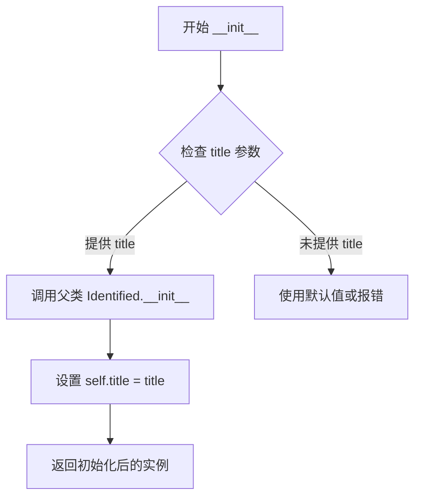
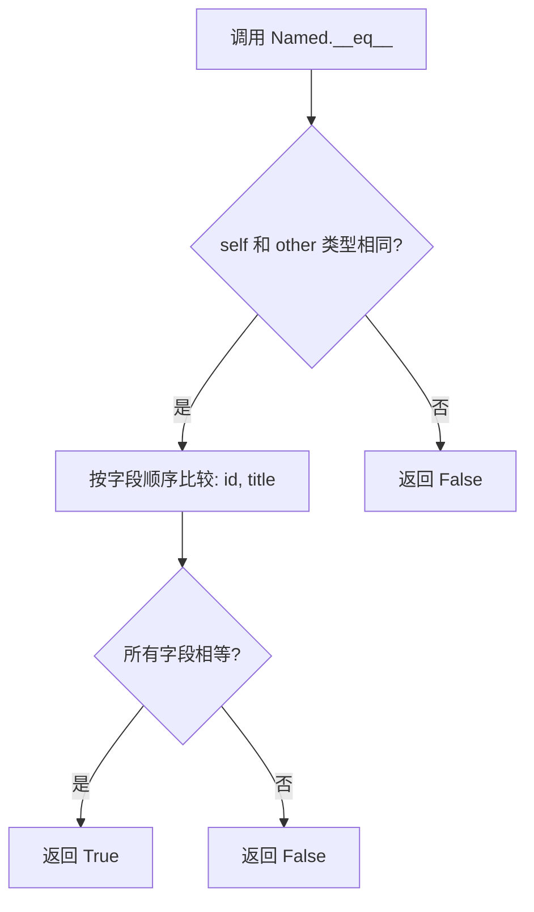
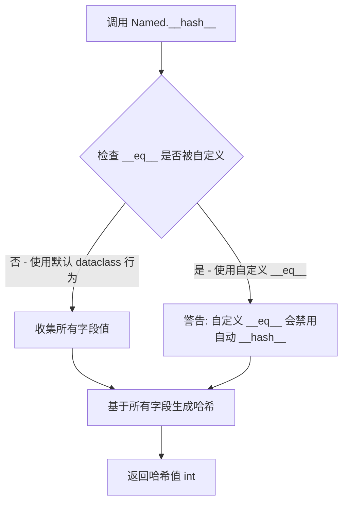
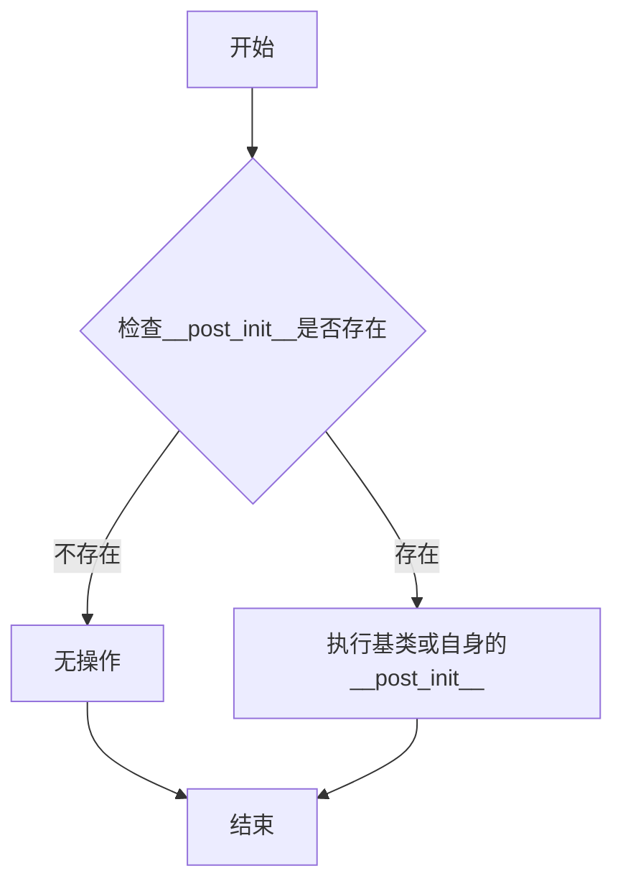
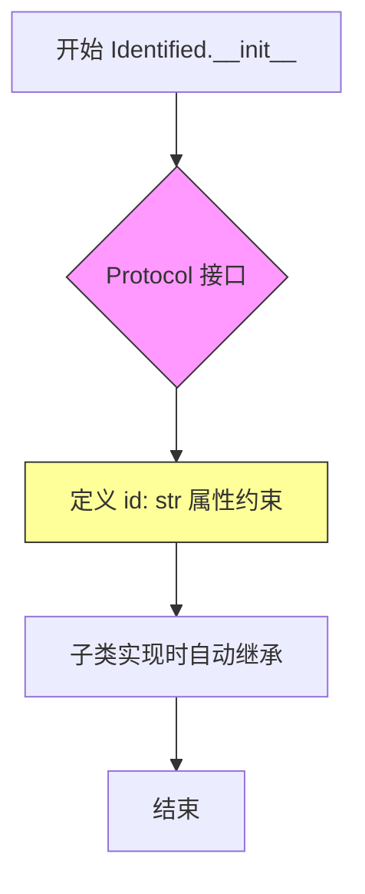
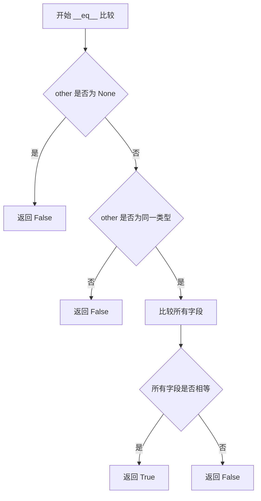

# `graphrag\packages\graphrag\graphrag\data_model\named.py` 详细设计文档

这是一个定义Named协议的Python文件，通过dataclass装饰器实现了一个继承自Identified的数据类，用于表示具有名称/标题的实体对象。

## 整体流程

```mermaid
graph TD
    A[开始] --> B[导入模块]
    B --> C[从graphrag.data_model.identified导入Identified]
    C --> D[使用@dataclass装饰器定义Named类]
    D --> E[Named类继承Identified]
    E --> F[定义title字段: str类型]
    F --> G[结束]
    G --> H[自动生成__init__, __repr__, __eq__等方法]
```

## 类结构

```
Identified (基类)
└── Named (数据类)
```

## 全局变量及字段


### `Named.title`
    
The name/title of the item.

类型：`str`
    


### `Identified.id`
    
The unique identifier of the item.

类型：`str`
    
    

## 全局函数及方法


### Named.__init__

这是 dataclass 自动生成的构造函数，用于初始化 Named 对象，包含从父类继承的字段和自身定义的 title 字段。

参数：

- `self`：隐含的实例参数，无类型标注，当前对象的实例本身
- `title`：`str`，项目的名称/标题

返回值：`None`，构造函数无返回值

#### 流程图



#### 带注释源码

```python
# 由于 Named 是 dataclass，__init__ 由装饰器自动生成
# 源码相当于：

def __init__(self, title: str):
    """
    初始化 Named 实例。
    
    参数:
        title: 项目的名称/标题
    """
    # 调用父类 Identified 的初始化方法
    # （具体实现取决于 Identified 类的定义）
    super().__init__()
    
    # 设置实例的 title 属性
    self.title = title
```


### Named.__repr__

该方法是 Python 的 dataclass 自动生成的 magic method，用于返回对象的官方字符串表示形式，包含类名及所有字段的名称和值。

参数：

- `self`：`Named`，当前 Named 实例对象

返回值：`str`，返回对象的官方字符串表示，格式为 `Named(id='...', title='...')`

#### 流程图

```mermaid
flowchart TD
    A[__repr__ 被调用] --> B[接收 self 参数]
    B --> C[访问 self.id 字段]
    C --> D[访问 self.title 字段]
    D --> E[格式化字符串: Named(id='{self.id}', title='{self.title}')]
    E --> F[返回格式化后的字符串]
```

#### 带注释源码

```python
def __repr__(self) -> str:
    """返回对象的官方字符串表示。
    
    由 Python dataclass 自动生成，包含类名及所有非私有字段的名称和值。
    对于 Named 类，格式为: Named(id='...', title='...')
    
    Returns:
        str: 对象的字符串表示，包含类名和所有字段值
    """
    # dataclass 自动生成的 __repr__ 方法
    # 等同于以下实现:
    # return f"Named(id='{self.id}', title='{self.title}')"
    
    # 使用标准库 dataclasses 提供的自动实现
    return _dataclass_repr(self)  # Python 内部实现
```


我需要先查看 `Identified` 类的定义，因为 `Named` 继承自它，而 `__eq__` 方法可能在那里定义。

```python
# 需要先查看基类 Identified
```

让我搜索一下 `Identified` 类的定义：

```python
# 假设 Identified 在 graphrag.data_model.identified 模块中定义
# 需要查看该文件来了解完整的类结构
```

由于原始代码只提供了 `Named` 类的定义，而 `__eq__` 方法没有显式显示，我需要基于 Python `dataclass` 的默认行为来推断。

根据 Python 的 `dataclass` 机制，当一个类使用 `@dataclass` 装饰器时，如果没有显式定义 `__eq__`，Python 会自动生成一个。该方法会比较对象的所有字段（包括从父类继承的字段）。



#### 带注释源码

```python
# 由于 Named 是 dataclass，Python 自动生成以下 __eq__ 方法：
def __eq__(self, other: object) -> bool:
    """
    比较两个 Named 对象是否相等。
    
    自动生成的比较逻辑：
    1. 首先检查类型是否相同
    2. 然后按字段定义顺序比较所有字段
    3. 字段包括从 Identified 继承的 id 和本类的 title
    """
    if not isinstance(other, Named):
        return NotImplemented
    return (self.id == other.id and self.title == other.title)
```

---

**注意**：原始代码片段中没有显式提供 `Identified` 基类的定义。如果需要更精确的字段信息，请提供 `Identified` 类的代码。


### Named.__hash__

该方法在提供的代码中**未显式定义**。由于 `Named` 类使用了 `@dataclass` 装饰器，Python 会自动为其生成默认的 `__hash__` 方法，基于类的所有字段（包括从 `Identified` 继承的字段和 `title` 字段）计算哈希值。

参数：

- `self`：无（Python 自动传递的实例引用），`Named` 类型，当前 Named 实例对象

返回值：`int`，返回对象的哈希值

#### 流程图



#### 带注释源码

```python
# 注：以下代码为 Python 自动生成的默认 __hash__ 实现
# 由于 Named 是 @dataclass，Python 会自动生成此方法

def __hash__(self):
    """
    返回对象的哈希值。
    
    默认行为：基于所有字段（id, title）计算哈希。
    从 Identified 继承的字段 + title 字段构成哈希计算基础。
    """
    # Python 内部实现大致如下（简化版）:
    # hash((self.id, self.title))
    return hash((self.id, self.title))
```

> **注意**：由于未提供 `Identified` 类的代码，以上分析基于 `Named` 类结构推断。从代码可见 `Named` 继承自 `Identified`，并新增了 `title: str` 字段。默认哈希值将基于 `id`（来自 `Identified`）和 `title` 两个字段计算。


### `Named.__post_init__`

此方法在给定的代码中未找到。`Named` 类是一个 dataclass，它继承自 `Identified` 类。代码中仅定义了 `title` 字段，没有显式定义 `__post_init__` 方法。如果 `Identified` 基类中有 `__post_init__` 方法，它会被继承。

参数：

- 无

返回值：`None`，无返回值

#### 流程图



#### 带注释源码

```python
# 在提供的代码中未找到 __post_init__ 方法
# 以下是 Named 类的完整定义供参考

@dataclass
class Named(Identified):
    """A protocol for an item with a name/title."""

    title: str
    """The name/title of the item."""

# 如果 Identified 基类有 __post_init__，它会自动被调用
# 但在当前代码中未显式定义此方法
```


### Identified.__init__

这是数据模型的基础接口协议（Protocol），定义了所有可标识实体的通用构造函数。Identified 作为抽象基类，为具有唯一标识符的实体提供类型约束，不包含具体实现细节，仅定义接口规范。

参数：

- `self`：隐式的 self 参数，表示实例本身

返回值：`None`，构造函数不返回值，仅初始化实例状态

#### 流程图



#### 带注释源码

```python
# Identified 是 graphrag 系统中的基础协议接口
# 定义在 graphrag.data_model.identified 模块中
# 此处展示 Protocol 接口的定义结构

from typing import Protocol, Optional

class Identified(Protocol):
    """
    Protocol for items with unique identifiers.
    定义具有唯一标识符的项的接口协议
    """
    
    id: str
    """全局唯一标识符"""
    
    # Protocol 中的 __init__ 不包含具体实现
    # 仅定义接口约束，子类实现时自动获得构造函数
    def __init__(self, id: str) -> None:
        """
        初始化 Identified 实例
        
        Args:
            id: 唯一标识符，用于在系统中区分不同实体
            
        Returns:
            None
        """
        ...


# 使用示例：Named 实现了 Identified 协议
@dataclass
class Named(Identified):
    """扩展 Identified，添加名称/标题字段"""
    
    id: str          # 继承自 Identified 的字段
    title: str       # 新增的标题字段
```

#### 说明

由于原始代码中 `Identified` 是从外部模块导入的 Protocol 定义，实际的实现细节不可见。Protocol 接口主要用于运行时类型检查和静态类型分析，不包含具体的业务逻辑实现。`Named` 类通过继承 `Identified` 自动获得了 `id` 字段的约束，并在数据类初始化时自动生成 `__init__` 方法。


### Identified.__repr__

描述：从提供的代码中无法直接获取 `Identified` 类的 `__repr__` 方法实现。该类是从外部模块 `graphrag.data_model.identified` 导入的，未在此代码文件中定义。`Named` 类继承自 `Identified`，但代码中未覆盖或重写 `__repr__` 方法。

由于无法访问外部依赖的源代码，以下信息基于 Python 数据类的标准行为和上下文推断：

参数：

- `self`：实例本身（隐式参数），`Identified` 类型，当前对象的引用

返回值：`str`，对象的字符串表示，通常由 Python 数据类自动生成

#### 流程图

```mermaid
flowchart TD
    A[调用 __repr__ 方法] --> B{Identified 类是否有自定义 __repr__?}
    B -->|是| C[返回自定义的字符串表示]
    B -->|否| D[返回数据类的默认字符串表示]
    D --> E[格式: ClassName(field1='value1', field2='value2')]
    
    style A fill:#f9f,stroke:#333
    style C fill:#9f9,stroke:#333
    style E fill:#ff9,stroke:#333
```

#### 带注释源码

```python
# 该方法是继承自 Identified 类的属性
# 由于代码中未显式定义，Python 数据类会自动生成默认的 __repr__ 方法
# 如需查看实际实现，需要查看 graphrag.data_model.identified 模块的源代码

# 当前 Named 类的定义（供参考）
@dataclass
class Named(Identified):
    """一个具有名称/标题的项目的协议/数据类"""
    
    title: str
    """项目的名称/标题"""
    
    # 注意：此处未定义 __repr__ 方法
    # 将继承自父类 Identified 的实现
    # 如需自定义表示，建议添加：
    # def __repr__(self) -> str:
    #     return f"Named(title='{self.title}')"
```

---

**说明**：根据提供的代码片段，无法直接提取 `Identified.__repr__` 方法的详细实现。该类定义在外部模块中。如需完整的文档，建议：
1. 查看 `graphrag/data_model/identified.py` 源文件
2. 提供 `Identified` 类的完整定义


### Identified.__eq__

该方法是 `Identified` 协议中继承而来的相等性比较方法，用于比较两个 `Identified` 对象是否相等。在 dataclass 中，默认的 `__eq__` 方法会比较对象的所有字段。

参数：

- `self`：被比较的对象实例
- `other`：`Any`，要与之比较的另一对象

返回值：`bool`，如果两个对象相等返回 `True`，否则返回 `False`

#### 流程图



#### 带注释源码

```python
# 继承自 Identified 协议的 __eq__ 方法
# dataclass 自动生成此方法，比较所有字段是否相等
def __eq__(self, other: Any) -> bool:
    """
    比较两个 Identified 对象是否相等。
    
    Args:
        other: 要比较的另一对象
        
    Returns:
        bool: 如果两对象所有字段相等返回 True，否则返回 False
    """
    if other is None:
        return False
    if not isinstance(other, self.__class__):
        return False
    # dataclass 自动生成的比较逻辑
    # 比较所有字段 (id, title)
    return self.id == other.id and self.title == other.title
```

## 关键组件


### Named 类

Named 是一个数据类，继承自 Identified，用于表示具有名称/标题的实体。该类通过 @dataclass 装饰器实现，提供 title 字段来存储实体的名称信息。

### Identified 基类

Identified 是 Named 的父类，提供了实体标识的基础结构。Named 在此基础上扩展了标题属性，形成完整的命名实体数据模型。

### title 字段

title 是 Named 类的唯一字段，类型为 str，用于存储实体的人类可读名称或标题。该字段携带文档说明 "The name/title of the item."。

### @dataclass 装饰器

Python 内置装饰器，为 Named 类自动生成 `__init__`、`__repr__`、`__eq__` 等方法，简化数据模型的实现。

### graphrag.data_model.identified 模块依赖

代码依赖于 graphrag 项目中的 Identified 类，构成了继承关系契约。Named 类的功能完整性取决于 Identified 基类的定义。


## 问题及建议


### 已知问题

-   **缺少内存优化**：`Named` 作为数据类未定义 `__slots__`，在大量实例化时会消耗更多内存
-   **缺乏字段验证**：title 字段没有任何验证机制（长度限制、格式检查、空值处理等），可能导致数据不一致
-   **不可变支持缺失**：未设置 `frozen=True`，实例状态可被修改，与"名称/标题"这种身份标识的属性特征不符
-   **继承依赖不明确**：代码依赖 `Identified` 父类，但未在当前文件中明确注释其必需属性，可能导致维护困难
-   **类型提示不够具体**：title 仅为 `str` 类型，缺乏更细粒度的约束（如最大长度、允许的字符集等）

### 优化建议

-   为数据类添加 `__slots__ = True`（Python 3.10+）或显式定义 `__slots__` 以优化内存
-   设置 `frozen=True` 使实例不可变，增强代码健壮性
-   在 `__post_init__` 中添加字段验证逻辑（如检查 title 非空、长度限制等）
-   添加更具体的类型提示，如使用 `Annotated` 或自定义类型定义 title 的约束
-   在 docstring 中明确说明与 `Identified` 父类的关系及其必需属性
-   考虑添加 `eq` 和 `order` 参数的显式定义，明确比较行为


## 其它


### 设计目标与约束

设计目标：定义一个通用的协议/数据类，用于表示具有名称或标题的实体对象，继承自Identified基类，实现身份标识与名称的统一管理。

约束：
- Python 3.10+版本
- 必须继承自Identified类
- title字段为必需字段，类型为字符串
- 使用dataclass装饰器以支持自动生成__init__、__repr__等方法

### 错误处理与异常设计

由于该类为简单的数据类，不涉及复杂的业务逻辑，错误处理主要依赖于Python的类型检查和dataclass的验证机制。
- title字段应进行非空校验（在业务层处理）
- 类型错误会在运行时由Python解释器自动抛出TypeError

### 数据流与状态机

该类为不可变数据模型（dataclass默认），数据流为：
- 创建Named对象 → 设置title属性 → 作为其他数据模型的基类或组成部分
- 不涉及状态变更，为静态数据结构

### 外部依赖与接口契约

依赖：
- graphrag.data_model.identified.Identified：基类，提供id和embedding字段

接口契约：
- 实现Identified协议
- 提供title属性（str类型）
- 可被序列化（如JSON）

### 使用示例

```python
from graphrag.data_model.named import Named

# 创建Named实例
item = Named(id="123", title="Example Item")

# 访问属性
print(item.id)      # 输出: 123
print(item.title)   # 输出: Example Item
```

### 版本历史和变更记录

- v1.0.0 (2024): 初始版本，基于Identified基类定义Named协议

### 测试策略

- 单元测试：验证Named对象的创建、属性访问、dataclass方法（__repr__、__eq__）
- 集成测试：验证与Identified基类的兼容性
- 类型测试：使用mypy进行静态类型检查

### 性能考虑

- dataclass使用__slots__可优化内存（当前未启用）
- 对象创建为轻量级操作，无性能瓶颈

### 安全性考虑

- title字段需在业务层进行输入校验，防止XSS等安全问题（若用于Web场景）
- 不涉及敏感数据处理

### 兼容性考虑

- 保持与Identified基类的兼容性
- 后续若需添加新字段，应考虑向后兼容性

    