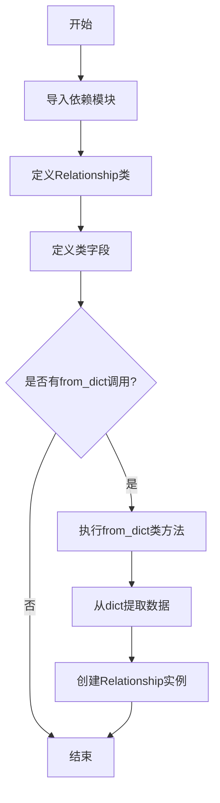

# `graphrag\packages\graphrag\graphrag\data_model\relationship.py` 详细设计文档

该代码定义了一个通用的Relationship（关系）数据模型类，用于表示图中任意两个实体之间的关系。该类继承自Identified基类，包含源实体、目标实体、权重、描述、语义嵌入、文本单元ID列表、排序等级和附加属性等字段，并提供了从字典数据创建关系实例的类方法。

## 整体流程



## 类结构

```
Identified (抽象基类)
└── Relationship (关系数据模型)
```

## 全局变量及字段


### `Relationship.source`
    
源实体名称

类型：`str`
    


### `Relationship.target`
    
目标实体名称

类型：`str`
    


### `Relationship.weight`
    
边权重，默认为1.0

类型：`float | None`
    


### `Relationship.description`
    
关系描述（可选）

类型：`str | None`
    


### `Relationship.description_embedding`
    
关系描述的语义嵌入（可选）

类型：`list[float] | None`
    


### `Relationship.text_unit_ids`
    
关系出现的文本单元ID列表（可选）

类型：`list[str] | None`
    


### `Relationship.rank`
    
关系排序等级，用于排序，值越大表示关系越重要

类型：`int | None`
    


### `Relationship.attributes`
    
额外属性（可选），用于搜索提示

类型：`dict[str, Any] | None`
    


### `Relationship.from_dict`
    
从字典数据创建新的关系实例

类型：`classmethod`
    
    

## 全局函数及方法


### `Relationship.from_dict`

从字典数据创建新的关系实例，支持自定义键名映射，允许从不同格式的字典数据构造 Relationship 对象。

参数：

-   `cls`：类型，类本身（隐式参数）
-   `d`：`dict[str, Any]`，包含关系数据的源字典
-   `id_key`：`str = "id"`，字典中关系ID的键名，默认为"id"
-   `short_id_key`：`str = "human_readable_id"`，字典中人类可读ID的键名，默认为"human_readable_id"
-   `source_key`：`str = "source"`，字典中源实体名称的键名，默认为"source"
-   `target_key`：`str = "target"`，字典中目标实体名称的键名，默认为"target"
-   `description_key`：`str = "description"`，字典中关系描述的键名，默认为"description"
-   `rank_key`：`str = "rank"`，字典中关系排名的键名，默认为"rank"
-   `weight_key`：`str = "weight"`，字典中关系权重的键名，默认为"weight"
-   `text_unit_ids_key`：`str = "text_unit_ids"`，字典中文本单元ID列表的键名，默认为"text_unit_ids"
-   `attributes_key`：`str = "attributes"`，字典中额外属性的键名，默认为"attributes"

返回值：`Relationship`，新创建的关系实例对象

#### 流程图

```mermaid
flowchart TD
    A[开始: from_dict 方法] --> B[接收字典 d 和多个键名参数]
    B --> C{验证必需键是否存在}
    C -->|是| D[提取 id: d[id_key]]
    C -->|否| E[抛出 KeyError 异常]
    D --> F[提取 source: d[source_key]]
    F --> G[提取 target: d[target_key]]
    G --> H[使用 d.get 提取可选字段]
    H --> I[short_id: d.get(short_id_key)]
    I --> J[rank: d.get(rank_key, 1)]
    J --> K[description: d.get(description_key)]
    K --> L[weight: d.get(weight_key, 1.0)]
    L --> M[text_unit_ids: d.get(text_unit_ids_key)]
    M --> N[attributes: d.get(attributes_key)]
    N --> O[创建 Relationship 实例]
    O --> P[返回 Relationship 对象]
    
    style E fill:#ffcccc
    style P fill:#ccffcc
```

#### 带注释源码

```python
@classmethod
def from_dict(
    cls,  # 类方法，第一个参数是类本身
    d: dict[str, Any],  # 输入的字典数据，包含关系的所有字段
    id_key: str = "id",  # 指定字典中ID字段的键名，默认值为"id"
    short_id_key: str = "human_readable_id",  # 指定字典中人类可读ID的键名
    source_key: str = "source",  # 指定字典中源实体字段的键名
    target_key: str = "target",  # 指定字典中目标实体字段的键名
    description_key: str = "description",  # 指定字典中描述字段的键名
    rank_key: str = "rank",  # 指定字典中排名字段的键名
    weight_key: str = "weight",  # 指定字典中权重字段的键名
    text_unit_ids_key: str = "text_unit_ids",  # 指定字典中文本单元ID列表的键名
    attributes_key: str = "attributes",  # 指定字典中额外属性的键名
) -> "Relationship":  # 返回新创建的 Relationship 实例
    """Create a new relationship from the dict data."""
    # 使用提供的键名从字典中提取必需字段
    # 直接使用 d[key] 访问，如果键不存在会抛出 KeyError
    return Relationship(
        id=d[id_key],  # 提取关系ID，必需字段
        short_id=d.get(short_id_key),  # 提取人类可读ID，可选字段使用 get 方法
        source=d[source_key],  # 提取源实体名称，必需字段
        target=d[target_key],  # 提取目标实体名称，必需字段
        rank=d.get(rank_key, 1),  # 提取排名，默认值为1
        description=d.get(description_key),  # 提取描述，可选字段
        weight=d.get(weight_key, 1.0),  # 提取权重，默认值为1.0
        text_unit_ids=d.get(text_unit_ids_key),  # 提取文本单元ID列表，可选
        attributes=d.get(attributes_key),  # 提取额外属性，可选
    )
```

## 关键组件


### Relationship 类

核心数据模型类，继承自 Identified，用于表示两个实体之间的通用关系，包含源目标实体、权重、描述、嵌入向量、文本单元关联、排序和额外属性等字段。

### source 和 target 字段

定义关系的源实体名称和目标实体名称，使用字符串类型标识，是关系图中的边两端节点。

### weight 字段

边的权重值，默认为 1.0，支持可选的浮点数类型，用于表示关系的强度或重要性。

### description 字段

关系的描述文本，可选的字符串类型，用于存储关系的语义信息说明。

### description_embedding 字段

关系描述的语义嵌入向量，可选的浮点数列表类型，用于支持基于向量相似度的关系检索。

### text_unit_ids 字段

关系出现的文本单元ID列表，可选的字符串列表类型，用于追溯关系在原始文本中的来源。

### rank 字段

关系的排序优先级，可选的整数类型，数值越高表示关系越重要，可基于中心性等指标计算。

### attributes 字段

额外的属性字典，可选的键值对集合，用于存储自定义的元数据，支持扩展关系信息。

### from_dict 方法

类方法工厂函数，从字典数据反序列化创建 Relationship 实例，支持自定义键名映射，提供了灵活的数据导入机制。

### Identified 继承

Relationship 继承自 Identified 基类，获得了 id 和 short_id 字段支持，用于唯一标识关系的身份。


## 问题及建议


### 已知问题

- 缺少字段验证逻辑：`source`和`target`字段没有非空验证，可能导致空字符串或无效值被接受
- 数据一致性风险：`weight`字段缺少范围验证，可以接受负数或超出合理范围的值（如999999.0）
- 方法不完整：`from_dict`方法缺失`description_embedding`字段的处理，导致从字典创建对象时会丢失嵌入向量数据
- 序列化功能缺失：仅有`from_dict`类方法，缺少`to_dict`实例方法，无法将对象转换回字典进行持久化或传输
- 可选字段默认值不一致：`rank`字段默认值设为1但类型注解允许None，导致默认值行为不明确
- 缺乏深拷贝保护：`text_unit_ids`、`attributes`等可变字段作为可变默认参数存在，在多个实例间可能共享引用导致意外修改
- 属性类型失控：`attributes`字段使用`dict[str, Any]`允许任意类型值，缺乏结构化约束可能导致数据不一致

### 优化建议

- 实现`__post_init__`方法添加字段验证：验证source/target非空、weight在合理范围内、description_embedding是有效浮点数列表
- 完善序列化方法：添加`to_dict`方法支持完整字段的反序列化，包括description_embedding字段
- 统一可选字段默认值策略：明确rank字段应该始终有值（移除None类型）或者提供明确的None处理逻辑
- 使用不可变数据结构：对于`text_unit_ids`和`attributes`字段，在__post_init__中进行深拷贝或使用元组/Mapping类型
- 考虑使用Pydantic替代dataclass：Pydantic提供开箱即用的验证、序列化支持和更好的类型约束
- 添加类型守卫：为attributes字段创建 TypedDict 或专用类定义，明确允许的属性键值类型
- 考虑添加索引字段验证：如果relationship用于图数据库，可能需要验证source/target对应的实体ID是否存在


## 其它


### 设计目标与约束

该Relationship模型的设计目标是提供一个通用的、灵活的关系数据结构，用于表示知识图谱中任意两个实体之间的关系。核心约束包括：必须继承自Identified以确保每个关系具有唯一标识符；所有字段均为可选的（除了source和target），以支持不同程度的元数据填充；weight字段默认为1.0，表示默认权重；rank字段用于关系重要性排序，值越大表示越重要。

### 错误处理与异常设计

该类的错误处理主要体现在from_dict类方法中。当传入的字典d缺少必需字段（如id_key、source_key、target_key对应的键）时，Python会抛出KeyError。类方法内部使用d.get()方法获取可选字段，并为可选字段提供默认值（如rank默认为1，weight默认为1.0）。建议在调用from_dict前对输入字典进行预验证，确保包含必需字段。Identity基类可能包含额外的验证逻辑，具体取决于其实现。

### 数据流与状态机

该类本身是一个纯数据模型（dataclass），不涉及复杂的状态机逻辑。数据流如下：1) 外部系统或模块构建包含关系数据的字典；2) 调用Relationship.from_dict(d)将字典转换为Relationship对象；3) Relationship对象可用于图构建、存储或进一步处理。该类作为数据载体，不维护任何内部状态，其字段值在创建后保持不变（immutable by default）。

### 外部依赖与接口契约

主要外部依赖包括：1) Identified基类（来自graphrag.data_model.identified模块），Relationship必须继承该类以获得id和short_id字段；2) typing模块的Any类型，用于attributes字典的值类型；3) dataclasses模块的dataclass装饰器。接口契约方面，from_dict方法接受一个字典参数d和多个可选的键名参数，允许自定义字典中各字段对应的键名，这提供了良好的灵活性和兼容性。

### 性能考虑

由于Relationship是一个简单的数据类，其性能开销主要来自于对象创建和内存占用。from_dict方法使用字典的get方法获取值，对于大量关系的批量处理，建议预验证输入字典以避免创建失败时的回滚开销。attributes字段使用dict[str, Any]类型，Any类型可能影响静态类型检查的严格性，但提供了最大的灵活性。

### 序列化与反序列化

该类支持通过from_dict方法从字典反序列化，但没有提供内置的to_dict方法。如果需要将Relationship对象序列化回字典，需要手动实现或依赖外部序列化机制。建议添加to_dict方法以支持完整的往返序列化需求。

### 使用示例与最佳实践

典型使用场景包括：1) 从图数据库查询结果创建Relationship对象；2) 在图构建过程中创建新关系；3) 关系数据的批量导入。建议始终提供source和target字段；weight和rank字段根据具体应用场景决定是否设置；description和description_embedding字段用于语义搜索场景；text_unit_ids用于追溯关系来源；attributes用于存储自定义扩展信息。

### 版本兼容性考虑

该代码使用Python 3.10+的类型联合语法（如float | None），需要Python 3.10及以上版本。from_dict方法中的键名参数设计考虑了不同数据源的可能差异，提供了良好的适配性。future如果Identified基类发生接口变化，该类可能需要相应调整。


    