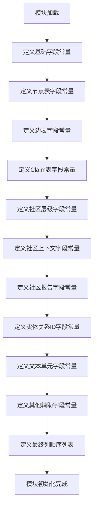

# `graphrag\packages\graphrag\graphrag\data_model\schemas.py` 详细设计文档

这是一个数据框列名定义模块，定义了图形映射数据模型中使用的所有列名常量，包括实体、关系、社区、社区报告、文本单元、文档等数据表的字段名称，以及各数据表的最终输出列顺序列表。

## 整体流程



## 类结构

```
该文件为纯常量定义模块，无类层次结构
```

## 全局变量及字段


### `ID`
    
实体、关系等的唯一标识符字段名

类型：`str`
    


### `SHORT_ID`
    
人类可读的短ID字段名

类型：`str`
    


### `TITLE`
    
标题字段名

类型：`str`
    


### `DESCRIPTION`
    
描述字段名

类型：`str`
    


### `TYPE`
    
类型字段名

类型：`str`
    


### `NODE_DEGREE`
    
节点度数字段名，表示图中节点的连接数量

类型：`str`
    


### `NODE_FREQUENCY`
    
节点频率字段名，表示节点出现的频次

类型：`str`
    


### `NODE_DETAILS`
    
节点详情字段名，存储节点的详细属性信息

类型：`str`
    


### `EDGE_SOURCE`
    
边源节点字段名，表示边的起始节点

类型：`str`
    


### `EDGE_TARGET`
    
边目标节点字段名，表示边的终止节点

类型：`str`
    


### `EDGE_DEGREE`
    
边度数字段名，表示边的度数（组合度数）

类型：`str`
    


### `EDGE_DETAILS`
    
边详情字段名，存储边的详细属性信息

类型：`str`
    


### `EDGE_WEIGHT`
    
边权重字段名，表示边的权重值

类型：`str`
    


### `CLAIM_SUBJECT`
    
声明主体字段名，表示声明关联的主体ID

类型：`str`
    


### `CLAIM_STATUS`
    
声明状态字段名，表示声明的状态

类型：`str`
    


### `CLAIM_DETAILS`
    
声明详情字段名，存储声明的详细属性

类型：`str`
    


### `SUB_COMMUNITY`
    
子社区字段名，表示社区层次结构中的子社区

类型：`str`
    


### `ALL_CONTEXT`
    
全部上下文字段名，存储完整的上下文信息

类型：`str`
    


### `CONTEXT_STRING`
    
上下文字符串字段名，以字符串形式存储上下文

类型：`str`
    


### `CONTEXT_SIZE`
    
上下文大小字段名，表示上下文的长度或大小

类型：`str`
    


### `CONTEXT_EXCEED_FLAG`
    
上下文超限标志字段名，标识上下文是否超出限制

类型：`str`
    


### `COMMUNITY_ID`
    
社区ID字段名，表示社区的唯一标识

类型：`str`
    


### `COMMUNITY_LEVEL`
    
社区级别字段名，表示社区在层次结构中的层级

类型：`str`
    


### `COMMUNITY_PARENT`
    
社区父节点字段名，表示上级社区ID

类型：`str`
    


### `COMMUNITY_CHILDREN`
    
社区子节点字段名，表示下级社区ID列表

类型：`str`
    


### `SUMMARY`
    
摘要字段名，存储内容摘要信息

类型：`str`
    


### `FINDINGS`
    
发现字段名，存储发现的结果或内容

类型：`str`
    


### `RATING`
    
评级字段名，表示评分或等级

类型：`str`
    


### `EXPLANATION`
    
解释字段名，存储评级或结论的解释说明

类型：`str`
    


### `FULL_CONTENT`
    
完整内容字段名，存储完整的文本内容

类型：`str`
    


### `FULL_CONTENT_JSON`
    
完整内容JSON字段名，以JSON格式存储完整内容

类型：`str`
    


### `ENTITY_IDS`
    
实体ID列表字段名，存储关联的实体ID数组

类型：`str`
    


### `RELATIONSHIP_IDS`
    
关系ID列表字段名，存储关联的关系ID数组

类型：`str`
    


### `TEXT_UNIT_IDS`
    
文本单元ID列表字段名，存储关联的文本单元ID数组

类型：`str`
    


### `COVARIATE_IDS`
    
协变量ID列表字段名，存储关联的协变量ID数组

类型：`str`
    


### `DOCUMENT_ID`
    
文档ID字段名，表示关联的文档唯一标识

类型：`str`
    


### `PERIOD`
    
周期字段名，表示时间周期或时间段

类型：`str`
    


### `SIZE`
    
大小字段名，表示规模或尺寸

类型：`str`
    


### `ENTITY_DEGREE`
    
实体度数字段名，表示实体的图度数

类型：`str`
    


### `ALL_DETAILS`
    
全部详情字段名，存储所有详细属性信息

类型：`str`
    


### `TEXT`
    
文本内容字段名，存储文本数据

类型：`str`
    


### `N_TOKENS`
    
Token数量字段名，表示文本的token数量

类型：`str`
    


### `CREATION_DATE`
    
创建日期字段名，表示记录创建的时间

类型：`str`
    


### `RAW_DATA`
    
原始数据字段名，存储未处理的原始数据

类型：`str`
    


### `ENTITIES_FINAL_COLUMNS`
    
实体表最终列定义列表，定义实体输出表的列顺序

类型：`list[str]`
    


### `RELATIONSHIPS_FINAL_COLUMNS`
    
关系表最终列定义列表，定义关系输出表的列顺序

类型：`list[str]`
    


### `COMMUNITIES_FINAL_COLUMNS`
    
社区表最终列定义列表，定义社区输出表的列顺序

类型：`list[str]`
    


### `COMMUNITY_REPORTS_FINAL_COLUMNS`
    
社区报告表最终列定义列表，定义社区报告输出表的列顺序

类型：`list[str]`
    


### `COVARIATES_FINAL_COLUMNS`
    
协变量表最终列定义列表，定义协变量输出表的列顺序

类型：`list[str]`
    


### `TEXT_UNITS_FINAL_COLUMNS`
    
文本单元表最终列定义列表，定义文本单元输出表的列顺序

类型：`list[str]`
    


### `DOCUMENTS_FINAL_COLUMNS`
    
文档表最终列定义列表，定义文档输出表的列顺序

类型：`list[str]`
    


    

## 全局函数及方法


## 关键组件


### 基础标识字段

定义系统中所有实体和关系共用的核心标识字段，包括唯一标识ID、可读性更好的短ID、标题、描述和类型字段，是整个数据模型的基础。

### 节点表字段 (POST-PREP NODE TABLE SCHEMA)

定义图节点表的后处理字段，包含节点度数（degree）、节点频率（frequency）以及节点详情（node_details），用于描述图中节点的拓扑特征和属性信息。

### 边表字段 (POST-PREP EDGE TABLE SCHEMA)

定义图边表的后处理字段，包含源节点（source）、目标节点（target）、组合度数（combined_degree）、边详情（edge_details）和权重（weight），用于描述图中边的连接关系和属性。

### 声明表字段 (POST-PREP CLAIM TABLE SCHEMA)

定义声明表的后处理字段，包含声明主题ID（subject_id）、声明状态（status）和声明详情（claim_details），用于跟踪和管理系统中的声明数据。

### 社区层级表字段 (COMMUNITY HIERARCHY TABLE SCHEMA)

定义社区层级结构表字段，包含子社区标识（sub_community），用于维护社区的层级关系。

### 社区上下文表字段 (COMMUNITY CONTEXT TABLE SCHEMA)

定义社区上下文表字段，包含完整上下文（all_context）、上下文字符串（context_string）、上下文大小（context_size）和上下文超限标志（context_exceed_limit），用于存储和管理社区的上下文信息。

### 社区报告表字段 (COMMUNITY REPORT TABLE SCHEMA)

定义社区报告表字段，包含社区ID、层级、父社区、子社区、标题、摘要、完整内容、评分、评分解释、发现和JSON格式完整内容，用于存储社区的汇总报告信息。

### 关联ID字段

定义跨表关联的ID集合字段，包括实体ID列表、关系ID列表、文本单元ID列表、协变量ID列表和文档ID，用于建立不同数据表之间的关联关系。

### 文本单元字段

定义文本单元表的核心字段，包含实体度数、全部详情、文本内容和token数量，用于存储和处理文本数据的基本信息。

### 最终列定义列表

定义七个主要数据模型（Entities、Relationships、Communities、Community Reports、Covariates、Text Units、Documents）的最终输出列顺序和结构，确保数据模型的一致性和可预测性。


## 问题及建议


### 已知问题

- **变量重复定义**：`TITLE` 变量在第5行和第33行被定义了两次，后者会覆盖前者，可能导致引用到错误的列名，这是潜在的隐蔽bug。
- **硬编码字符串未提取为常量**：在 `COVARIATES_FINAL_COLUMNS` 列表中存在多个硬编码的字符串常量（如 `"covariate_type"`, `"subject_id"`, `"object_id"`, `"status"`, `"start_date"`, `"end_date"`, `"source_text"`, `"text_unit_id"`），与其他列名定义方式不一致，违反了统一管理原则。
- **缺乏类型安全机制**：所有列名均为普通字符串变量，未使用 `typing.Final` 或 `Enum` 进行类型约束，存在被意外修改的风险。
- **文档缺失**：模块缺少模块级 docstring，开发者难以快速理解该文件的设计意图和使用场景。
- **命名风格不统一**：部分变量使用全大写（如 `ID`, `TYPE`），部分使用下划线分隔的全大写（如 `EDGE_SOURCE`, `NODE_DEGREE`），风格虽统一但缺乏层级标识。

### 优化建议

- 修复 `TITLE` 重复定义问题，建议使用不同的变量名（如 `BASE_TITLE` 和 `COMMUNITY_TITLE`）或在各自的命名空间下定义。
- 将 `COVARIATES_FINAL_COLUMNS` 中的硬编码字符串提取为独立的常量，与其他列定义保持一致。
- 引入 `typing.Final` 类型注解或使用 `Enum` 类来定义列名常量，增强类型安全和 IDE 支持。
- 添加模块级 docstring，说明该文件用于定义数据框的列名字符串常量，以及各部分的结构划分。
- 考虑为常量添加分组注释或使用类/模块进行命名空间划分，提升代码可读性和可维护性。


## 其它


### 设计目标与约束

本模块的核心设计目标是为数据处理流程提供统一的字段名称定义，确保不同模块之间数据传输的一致性。所有字段名均采用字符串常量形式定义，便于集中管理和修改，同时避免硬编码带来的维护风险。设计约束包括：字段名必须与下游数据模型兼容，仅定义静态常量不包含任何运行时逻辑，字段列表的顺序即为最终输出列的顺序。

### 命名规范与约定

所有字段名均采用下划线命名法（snake_case），全大写字母表示常量ID（如ID、SHORT_ID），带前缀的常量表示特定实体的字段（如NODE_DEGREE、EDGE_SOURCE）。字段列表以FINAL_COLUMNS结尾，表示该列表定义了输出数据的完整列顺序。类型字段统一使用TYPE常量，ID字段使用ID和SHORT_ID分别表示唯一标识和可读标识。

### 使用示例

在数据处理代码中导入并使用这些常量：from graphrag.index.graph import ENTITIES_FINAL_COLUMNS, ID, TITLE。创建DataFrame时可直接引用这些常量作为列名，确保列名与预定义一致。读取Parquet文件时使用这些常量作为列选择器，获取对应的数据列。

### 外部依赖与接口契约

本模块为纯Python定义文件，不引入任何运行时依赖。外部系统（如pandas、polars）读取Parquet文件时，列名需与本模块定义的常量一致。数据生产者应按照FINAL_COLUMNS列表的顺序组织输出列，数据消费者可依赖这些常量进行列名解析。

### 扩展性考虑

新增字段时应在对应的功能分组中添加常量定义，并在相应的FINAL_COLUMNS列表中追加新字段。字段列表顺序变更需谨慎，可能影响下游数据消费者的列索引访问。建议通过版本号记录字段列表的变更历史，便于兼容性管理。

### 版本兼容性

本代码使用Python 3.9+的类型注解风格（PEP 604_union语法），需要Python 3.9及以上版本。字符串常量定义兼容所有Python 3.x版本，无需额外的运行时依赖即可在旧版本Python中使用。

### 数据质量保证

FINAL_COLUMNS列表中的每个字段都应有对应的数据源，非可选字段必须在输入数据中存在。建议在数据导入阶段添加列名验证逻辑，确保必需的列都已提供。字段类型的一致性由数据导入层负责保证，本模块仅定义列名语义。

    