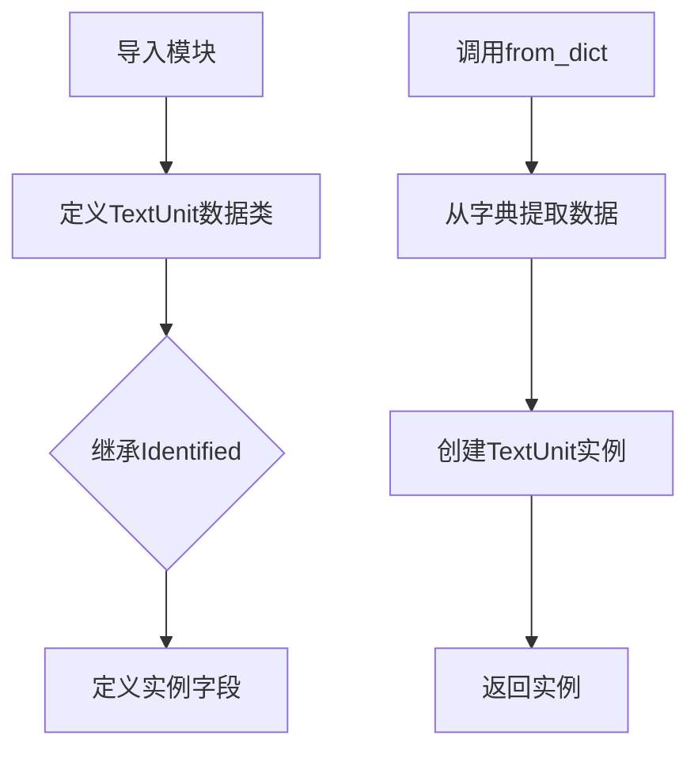

# `graphrag\packages\graphrag\graphrag\data_model\text_unit.py` 详细设计文档

该文件定义了一个名为TextUnit的数据类，用于表示文档数据库中的文本单元，继承自Identified基类，包含文本内容、关联实体ID、关系ID、协变量ID、令牌数、文档ID和附加属性等字段，并提供了从字典创建实例的类方法。

## 整体流程



## 类结构

```
Identified (抽象基类/接口)
└── TextUnit (数据模型类)
```

## 全局变量及字段


### `TextUnit.text`
    
文本内容

类型：`str`
    


### `TextUnit.entity_ids`
    
关联实体ID列表

类型：`list[str] | None`
    


### `TextUnit.relationship_ids`
    
关联关系ID列表

类型：`list[str] | None`
    


### `TextUnit.covariate_ids`
    
协变量ID字典

类型：`dict[str, list[str]] | None`
    


### `TextUnit.n_tokens`
    
令牌数量

类型：`int | None`
    


### `TextUnit.document_id`
    
所属文档ID

类型：`str | None`
    


### `TextUnit.attributes`
    
附加属性字典

类型：`dict[str, Any] | None`
    
    

## 全局函数及方法


### TextUnit.from_dict

从字典数据创建 TextUnit 实例的类方法，允许通过自定义键名映射将字典转换为 TextUnit 对象，支持灵活的字段映射和可选参数的自动处理。

参数：

- `cls`：类型，默认参数，类方法隐含的类本身参数
- `d`：`dict[str, Any]`，输入的字典数据，包含文本单元的各项属性
- `id_key`：`str = "id"`，可选，字典中 ID 字段的键名，默认为 "id"
- `short_id_key`：`str = "human_readable_id"`，可选，字典中人类可读 ID 的键名
- `text_key`：`str = "text"`，可选，字典中文本内容的键名
- `entities_key`：`str = "entity_ids"`，可选，字典中实体 ID 列表的键名
- `relationships_key`：`str = "relationship_ids"`，可选，字典中关系 ID 列表的键名
- `covariates_key`：`str = "covariate_ids"`，可选，字典中协变量 ID 字典的键名
- `n_tokens_key`：`str = "n_tokens"`，可选，字典中 token 数量的键名
- `document_id_key`：`str = "document_id"`，可选，字典中文档 ID 的键名
- `attributes_key`：`str = "attributes"`，可选，字典中额外属性的键名

返回值：`TextUnit`，新创建的 TextUnit 实例对象

#### 流程图

```mermaid
flowchart TD
    A[开始] --> B[接收字典参数 d 和多个键名参数]
    B --> C[从字典 d 中提取 id_key 对应的值]
    C --> D[使用 d.get 方法提取可选字段]
    D --> E[short_id: d.get(short_id_key)]
    E --> F[text: d[text_key] - 必需字段]
    F --> G[entity_ids: d.get(entities_key)]
    G --> H[relationship_ids: d.get(relationships_key)]
    H --> I[covariate_ids: d.get(covariates_key)]
    I --> J[n_tokens: d.get(n_tokens_key)]
    J --> K[document_id: d.get(document_id_key)]
    K --> L[attributes: d.get(attributes_key)]
    L --> M[创建 TextUnit 实例]
    M --> N[返回 TextUnit 对象]
```

#### 带注释源码

```python
@classmethod
def from_dict(
    cls,
    d: dict[str, Any],
    id_key: str = "id",
    short_id_key: str = "human_readable_id",
    text_key: str = "text",
    entities_key: str = "entity_ids",
    relationships_key: str = "relationship_ids",
    covariates_key: str = "covariate_ids",
    n_tokens_key: str = "n_tokens",
    document_id_key: str = "document_id",
    attributes_key: str = "attributes",
) -> "TextUnit":
    """Create a new text unit from the dict data."""
    # 从传入的字典中使用指定的键名提取必需的 id 字段
    # 如果键不存在会抛出 KeyError
    return TextUnit(
        id=d[id_key],
        # 使用 d.get 提取可选字段，键不存在时返回 None
        short_id=d.get(short_id_key),
        # 必需的文本字段，键不存在会抛出 KeyError
        text=d[text_key],
        # 可选的实体 ID 列表
        entity_ids=d.get(entities_key),
        # 可选的关系 ID 列表
        relationship_ids=d.get(relationships_key),
        # 可选的协变量 ID 字典
        covariate_ids=d.get(covariates_key),
        # 可选的 token 数量
        n_tokens=d.get(n_tokens_key),
        # 可选的文档 ID
        document_id=d.get(document_id_key),
        # 可选的额外属性字典
        attributes=d.get(attributes_key),
    )
```

## 关键组件


### TextUnit 数据模型

TextUnit 是一个 dataclass，继承自 Identified，用于表示文档数据库中的文本单元。它封装了文本内容及其关联的实体、关系、协变量等关联信息，提供了一个结构化的方式来管理和操作文本单元数据。

### 实体关联机制 (entity_ids)

通过 `entity_ids: list[str] | None` 字段存储与该文本单元相关的实体 ID 列表。该字段为可选字段，允许为空，支持一个文本单元关联多个实体，用于建立文本与知识图谱中实体的映射关系。

### 关系关联机制 (relationship_ids)

通过 `relationship_ids: list[str] | None` 字段存储与该文本单元相关的关系 ID 列表。该字段为可选字段，允许为一个文本单元关联多条关系，支持文本单元与图数据库中关系的连接。

### 协变量关联机制 (covariate_ids)

通过 `covariates: dict[str, list[str]] | None` 字段以字典形式存储不同类型的协变量 ID 列表。该字段支持多种协变量类型（如时间、来源等）的分类存储，提供了比简单列表更灵活的多维度关联能力。

### from_dict 工厂方法

提供从字典数据创建 TextUnit 实例的工厂方法，支持自定义键名参数配置。通过 `d.get()` 安全地处理可选字段，将原始字典数据转换为结构化的 TextUnit 对象，实现了数据层与模型层的解耦。

### 元数据扩展机制 (attributes)

通过 `attributes: dict[str, Any] | None` 字段提供灵活的扩展能力，允许存储任意类型的额外属性。该设计使得 TextUnit 模型可以适应不同业务场景的自定义需求，无需修改核心数据结构。

### 标识符继承 (Identified)

TextUnit 继承自 Identified 类，自动获得 `id` 和 `short_id` 两个标识符字段。这种继承设计确保了所有文本单元具有统一的标识规范，便于在系统中进行唯一识别和人类可读的短 ID 引用。

### 令牌计数机制 (n_tokens)

通过 `n_tokens: int | None` 字段可选地存储文本单元的令牌数量。该字段支持对文本长度进行量化表示，可用于后续的 token 预算管理、文本分块策略等场景。

### 文档关联机制 (document_id)

通过 `document_id: str | None` 字段建立文本单元与源文档的关联。该字段支持追踪每个文本单元的来源文档，便于实现文档-段落层级的数据溯源和关系维护。


## 问题及建议


### 已知问题

-   **类型注解兼容性**：代码使用了 Python 3.10+ 的联合类型语法（`|`），如 `list[str] | None`，这会导致与 Python 3.9 或更早版本不兼容
-   **参数过长**：`from_dict` 方法包含 9 个参数，违反了在 Python 中参数过多可能导致可读性和维护性下降的原则
-   **缺少输入验证**：`from_dict` 方法没有对输入字典 `d` 进行充分验证，如果缺少必需键（如 `id` 或 `text`）会抛出原始 `KeyError`，而不是提供更友好的错误信息
-   **文档字符串格式不一致**：`covariate_ids` 字段的文档字符串使用了单引号开头，未遵循类中其他字段使用三引号的规范
-   **缺少数据验证**：`TextUnit` 作为一个数据模型类，缺少 `__post_init__` 方法来验证必填字段（如 `text`）的有效性
-   **序列化能力缺失**：作为数据模型，未提供 `to_dict` 方法与 `from_dict` 配套使用，且缺少对 JSON 序列化的原生支持
-   **可读性方法缺失**：作为 `dataclass`，未显式定义 `__repr__`、`__eq__` 等方法（尽管 dataclass 默认提供 `__repr__`，但未指定 `eq=False`）

### 优化建议

-   **使用 `typing.Optional` 替代联合类型**：将 `str | None` 改为 `Optional[str]`，并从 `typing` 导入，以提高 Python 版本兼容性
-   **重构 `from_dict` 方法**：考虑使用 **模式（pattern）** 或 **构建器模式（Builder Pattern）**，或将常用参数设为关键字参数的默认值，以减少参数数量
-   **添加数据验证**：在 `from_dict` 方法中加入对必填字段的存在性检查，提供更清晰的错误提示
-   **修复文档字符串**：将 `covariate_ids` 的文档字符串改为使用三引号格式，保持一致性
-   **添加 `to_dict` 方法**：实现 `to_dict` 方法以支持对象序列化，与 `from_dict` 形成对称的序列化/反序列化能力
-   **考虑使用 Pydantic**：对于复杂的数据验证和序列化需求，可考虑使用 `pydantic` 或 `attrs` 库来替代原生 `dataclass`，以获得更强大的验证和转换能力


## 其它


### 设计目标与约束

本模块的设计目标是定义文本单元的数据模型，为图谱生成流程中的文本处理提供标准化的数据结构。约束条件包括：TextUnit必须继承Identified接口以保证ID一致性；所有字段除text外均为可选，以适应不同数据源；使用dataclass实现以简化对象创建和调试；属性字段使用Any类型以保证扩展性。

### 错误处理与异常设计

本模块主要依赖Python的类型系统和dataclass的验证机制。from_dict方法未对输入字典进行详细验证，假设调用方已做好数据清洗。潜在的异常情况包括：缺少必需字段text时抛出KeyError；id_key指定键不存在时抛出KeyError；类型不匹配时由dataclass自动验证抛出TypeError。建议在实际使用时添加输入验证逻辑。

### 外部依赖与接口契约

主要依赖项包括：dataclass装饰器（Python 3.7+内置）；typing模块的Any、list、dict类型；graphrag.data_model.identified模块中的Identified基类。接口契约方面，TextUnit需实现Identified定义的id和short_id属性；from_dict方法接受标准字典格式输入，返回TextUnit实例；所有可选字段在不存在时应返回None或None等效值。

### 版本兼容性说明

代码使用Python 3.10+的类型联合语法（list[str] | None），需确保运行环境中Python版本不低于3.10。dataclass装饰器的field函数未使用，默认值处理符合Python 3.10规范。

### 使用示例与调用模式

典型使用场景：从文档数据库查询结果字典创建TextUnit对象。调用方式为TextUnit.from_dict(raw_data_dict)。调用方需确保传入字典包含id和text字段，其他字段根据实际数据情况可选提供。

    