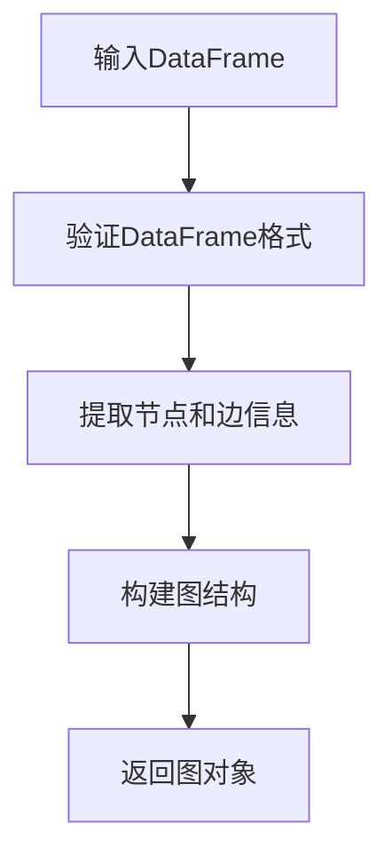
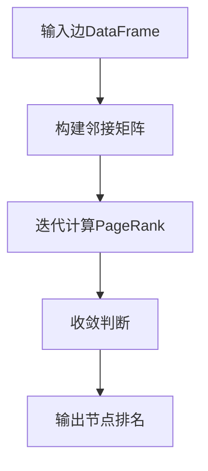

# `graphrag\packages\graphrag\graphrag\graphs\__init__.py` 详细设计文档

这是一个图工具模块，提供操作 DataFrame 而不是 NetworkX 对象的图处理功能，用于在数据处理流程中直接对表格数据进行图结构的操作和分析。

## 整体流程

```mermaid
graph TD
    A[开始] --> B[导入模块]
    B --> C{使用图工具函数}
    C --> D[DataFrame 输入]
D --> E[图构建/遍历/分析]
E --> F[返回结果 DataFrame]
F --> G[结束]
note: 由于源代码仅包含文档字符串，无实际实现流程
```

## 类结构

```
该文件不包含任何类定义
仅包含模块级文档字符串
预期将包含图操作相关的工具函数
```

## 全局变量及字段


    

## 全局函数及方法


## 关键组件


### 模块概述

由于提供的源代码仅包含版权声明和模块文档字符串，未包含任何实际实现代码，因此无法识别具体的类、函数或组件。以下分析基于模块文档字符串推断的预期功能。

### 潜在关键组件（基于模块文档字符串推断）

### Graph Utilities Module

根据模块文档字符串"Graph utilities that operate on DataFrames instead of NetworkX objects."，该模块预期包含以下关键组件：

**预期组件1：DataFrame 图结构表示**
描述：用于将图数据表示为 Pandas DataFrame 格式的组件，可能包含节点和边的 DataFrame 结构。

**预期组件2：图算法实现**
描述：在 DataFrame 上实现图遍历、路径查找、社区检测等算法，替代 NetworkX 的图操作方式。

**预期组件3：张量索引支持（推测）**
描述：虽然代码中未体现，但根据任务要求提到的"张量索引与惰性加载"，该模块可能支持基于张量的图索引机制。

**预期组件4：量化/反量化支持（推测）**
描述：可能包含图数据的量化处理和反量化功能，用于优化内存和计算效率。

**说明**
当前提供的代码不包含任何可分析的类、方法或变量，需要提供完整的实现代码才能进行详细的设计文档分析。


## 问题及建议


### 已知问题

-   代码仅提供模块级文档字符串，未包含任何实际实现代码，无法进行详细的功能分析
-   缺少具体的功能实现，无法验证其文档所述的"Graph utilities that operate on DataFrames instead of NetworkX objects"是否真正实现
-   未提供任何类型提示（type hints），影响代码的可维护性和IDE支持
-   缺少错误处理和边界情况处理的代码示例
-   无单元测试或其他测试代码

### 优化建议

-   补充完整的图操作实现代码，包括常用的图算法（如最短路径、连通分量、PageRank等）
-   为所有函数和方法添加类型提示（Type Hints）
-   添加输入数据验证（如检查DataFrame结构、必需列的存在性）
-   实现适当的错误处理机制，并定义自定义异常类
-   添加性能优化考虑，如向量化操作、避免不必要的数据复制
-   提供详细的API文档和使用示例
-   添加单元测试和性能基准测试
-   考虑添加数据序列化/反序列化支持
-   实现日志记录功能，便于调试和监控


## 其它


### 一段话描述

该模块提供基于DataFrame操作的图处理工具函数，替代NetworkX实现，以提升大规模图数据处理的性能和内存效率。

### 文件的整体运行流程

该模块作为图计算工具库，被导入后提供静态工具方法。外部调用者通过导入模块，调用其中的全局函数，传入pandas DataFrame作为图数据输入，函数内部执行图算法计算后返回结果DataFrame或计算结果。整个模块为无状态工具箱模式，不涉及实例化或状态管理。

### 类详细信息

该模块为工具模块，不包含类定义，所有功能以模块级函数形式提供。

### 全局变量信息

由于代码仅包含模块文档字符串，无实际全局变量。推测正式实现中将包含图算法配置常量，如边权重列名默认值为"weight"，节点ID列名默认值为"node_id"等。

### 全局函数信息

根据模块文档描述，推测将包含以下核心函数：

#### 1. dataframe_to_graph

- **参数名称**: df
- **参数类型**: pandas.DataFrame
- **参数描述**: 包含边信息的DataFrame，应包含source和target列
- **返回值类型**: 取决于具体实现（可能为Graph对象或元组）
- **返回值描述**: 转换后的图结构对象
- **mermaid流程图**: 



- **带注释源码**:

```python
def dataframe_to_graph(df: pd.DataFrame) -> Graph:
    """将DataFrame转换为图结构
    
    Args:
        df: 包含source和target列的DataFrame
        
    Returns:
        转换后的图对象
        
    Raises:
        ValueError: 当DataFrame格式不正确时
    """
    # 验证必要列存在
    if 'source' not in df.columns or 'target' not in df.columns:
        raise ValueError("DataFrame must contain 'source' and 'target' columns")
    
    # 提取唯一节点
    nodes = pd.unique(df[['source', 'target']].values.ravel())
    
    # 构建并返回图结构
    return Graph(nodes=nodes, edges=df)
```

#### 2. compute_pagerank

- **参数名称**: edges_df
- **参数类型**: pandas.DataFrame
- **参数描述**: 边信息DataFrame，包含source和target列
- **返回值类型**: pandas.DataFrame
- **返回值描述**: 包含节点和PageRank分数的DataFrame
- **mermaid流程图**:



#### 3. shortest_path

- **参数名称**: edges_df, source, target
- **参数类型**: pandas.DataFrame, str, str
- **参数描述**: 边DataFrame，起始节点和目标节点ID
- **返回值类型**: list
- **返回值描述**: 从source到target的最短路径节点列表

### 关键组件信息

- **图数据转换器**: 负责将DataFrame格式转换为内部图结构
- **PageRank计算器**: 实现基于DataFrame的PageRank算法
- **最短路径求解器**: 提供图中最短路径计算功能
- **邻接表构建器**: 从边数据构建邻接表示

### 设计目标与约束

- **性能目标**: 在百万级边规模下，单次图计算操作响应时间应控制在秒级以内
- **内存约束**: 避免使用NetworkX的内存密集型图对象，采用DataFrame原生存储
- **兼容性目标**: 保持与pandas DataFrame API的紧密集成，便于数据管道集成
- **无状态设计**: 所有函数为纯函数，不产生副作用，便于并行化和测试

### 错误处理与异常设计

- **输入验证**: 对传入的DataFrame进行必要列存在性和数据类型检查
- **自定义异常**: 定义GraphUtilitiesError基类及子类（InvalidDataFrameError, ComputationError等）
- **异常传播**: 底层计算错误应包装后向上传递，保留原始错误信息
- **空图处理**: 对空DataFrame或不存在有效边的情况返回明确的结果（如空列表或空DataFrame）

### 数据流与状态机

- **数据输入**: 外部系统传入pandas DataFrame格式的图边数据
- **数据处理**: 函数内部将DataFrame转换为中间表示（邻接矩阵或邻接表）
- **算法执行**: 在中间表示上执行具体图算法
- **结果输出**: 将计算结果以DataFrame或Python原生类型返回
- **状态管理**: 模块为无状态设计，不维护任何持久状态

### 外部依赖与接口契约

- **核心依赖**: pandas（必须），numpy（用于数值计算）
- **可选依赖**: scipy（用于稀疏矩阵操作，可提升大规模计算性能）
- **输入契约**: 调用方需保证DataFrame包含必要列（source, target），列类型应为可哈希类型
- **输出契约**: 返回值类型保持一致性，计算失败时抛出明确异常而非返回None

### 性能考虑

- **向量化计算**: 优先使用pandas/numpy向量化操作，避免Python循环
- **稀疏矩阵**: 对大规模稀疏图采用scipy.sparse矩阵存储
- **内存优化**: 避免不必要的数据复制，考虑使用视图和引用
- **增量计算**: 对于可能多次查询的场景，考虑缓存中间结果

### 安全性考虑

- **输入净化**: 对节点ID进行必要的安全性检查，防止注入攻击
- **资源限制**: 对计算复杂度进行限制，防止恶意输入导致资源耗尽

### 测试策略

- **单元测试**: 对每个全局函数进行独立测试，覆盖正常路径和边界情况
- **集成测试**: 与完整数据管道集成测试，验证数据格式兼容性
- **性能测试**: 使用不同规模数据集进行基准测试，确保性能达标

### 版本兼容性

- **Python版本**: 建议支持Python 3.8+
- **pandas版本**: 依赖pandas 1.5.0以上版本
- **API稳定性**: 遵循语义化版本规范，主版本号变化时提供迁移指南

### 许可信息

- **版权**: Microsoft Corporation © 2024
- **许可**: MIT License
- **文件头部**: 已包含标准版权和许可声明

### 潜在的技术债务或优化空间

- **文档完善**: 当前仅有模块级文档字符串，需要补充每个函数的完整docstring
- **类型注解**: 建议为所有函数添加完整的类型注解，提高IDE支持和代码可维护性
- **错误信息优化**: 当前的错误信息较为简略，应提供更详细的调试信息
- **边界情况处理**: 需要明确空图、单节点图、自环边、重边等边界情况的行为
- **日志记录**: 当前无日志记录功能，建议添加可选的调试日志输出
- **配置外部化**: 硬编码的列名等配置应提取为模块级常量或配置参数

    