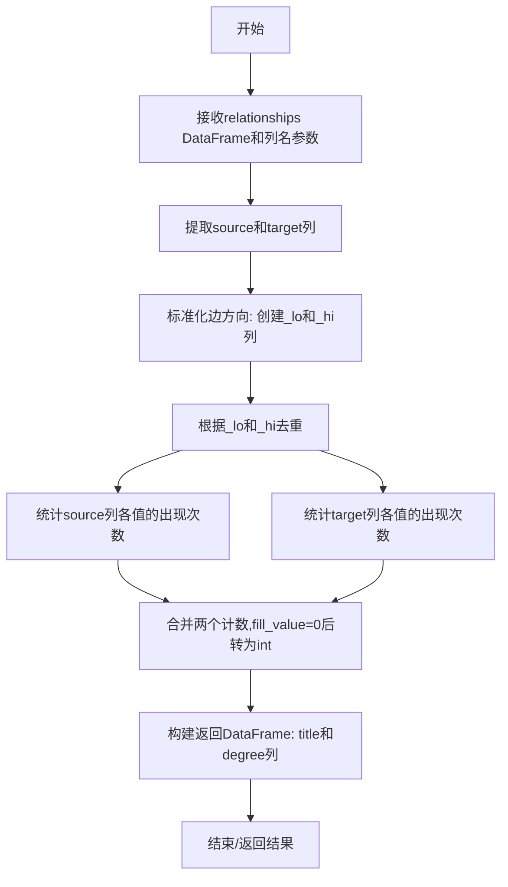
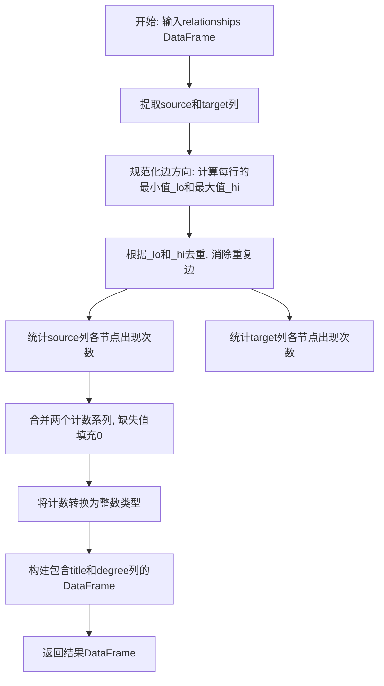

# `graphrag\packages\graphrag\graphrag\graphs\compute_degree.py` 详细设计文档

该代码实现了一个从关系DataFrame计算图中节点度数的函数，通过将边视为无向边（标准化方向后去重），分别统计source和target列的出现次数并合并，得到每个节点的连接边数，最终返回包含节点名称和度数的DataFrame。

## 整体流程



## 类结构

```
无类结构 (单函数模块)
```

## 全局变量及字段


### `compute_degree`
    
计算图中每个节点的度数（degree），即每个节点连接的边数量

类型：`function`
    


### `relationships`
    
边列表数据框，包含source和target列

类型：`pd.DataFrame`
    


### `source_column`
    
源节点列名，默认为'source'

类型：`str`
    


### `target_column`
    
目标节点列名，默认为'target'

类型：`str`
    


### `edges`
    
复制并处理后的边列表数据框

类型：`pd.DataFrame`
    


### `edges._lo`
    
每条边的较小端点，用于去重和统一无向边

类型：`pd.Series`
    


### `edges._hi`
    
每条边的较大端点，用于去重和统一无向边

类型：`pd.Series`
    


### `source_counts`
    
源节点出现次数的统计

类型：`pd.Series`
    


### `target_counts`
    
目标节点出现次数的统计

类型：`pd.Series`
    


### `degree`
    
合并后的节点度数计算结果

类型：`pd.Series`
    


    

## 全局函数及方法


### `compute_degree`

该函数用于从边列表DataFrame计算每个节点的度数（degree），即每个节点作为源节点和目标节点出现的总次数，同时将(A,B)和(B,A)视为同一条无向边以匹配NetworkX Graph的行为。

参数：

- `relationships`：`pd.DataFrame`，包含源节点和目标节点列的边列表DataFrame
- `source_column`：`str`，默认为"source"，源节点列的名称
- `target_column`：`str`，默认为"target"，目标节点列的名称

返回值：`pd.DataFrame`，包含["title", "degree"]两列的DataFrame，其中title为节点标识，degree为该节点的度数

#### 流程图



#### 带注释源码

```python
def compute_degree(
    relationships: pd.DataFrame,
    source_column: str = "source",
    target_column: str = "target",
) -> pd.DataFrame:
    """Compute the degree of each node from an edge list DataFrame.

    Degree is the number of edges connected to a node (counting both
    source and target appearances).

    Parameters
    ----------
    relationships : pd.DataFrame
        Edge list with at least source and target columns.
    source_column : str
        Name of the source node column.
    target_column : str
        Name of the target node column.

    Returns
    -------
    pd.DataFrame
        DataFrame with columns ["title", "degree"].
    """
    # 步骤1: 提取source和target列并复制, 避免修改原始数据
    edges = relationships[[source_column, target_column]].copy()
    
    # 步骤2: 规范化边方向, 使(A,B)和(B,A)被视为同一条无向边
    # 通过min和max确定边的两个端点的顺序
    edges["_lo"] = edges.min(axis=1)   # 较小的端点
    edges["_hi"] = edges.max(axis=1)   # 较大的端点
    
    # 步骤3: 根据规范化后的端点去重, 移除重复边
    edges = edges.drop_duplicates(subset=["_lo", "_hi"])

    # 步骤4: 分别统计source和target列中各节点的出现次数
    source_counts = edges[source_column].value_counts()
    target_counts = edges[target_column].value_counts()
    
    # 步骤5: 合并两个计数系列, 缺失值填充0, 转换为整数
    degree = source_counts.add(target_counts, fill_value=0).astype(int)
    
    # 步骤6: 构建返回的DataFrame, title为节点标识, degree为度数
    return pd.DataFrame({"title": degree.index, "degree": degree.to_numpy()})
```

#### 关键组件信息

| 组件名称 | 描述 |
|---------|------|
| `_lo` 临时列 | 存储每条边的较小端点，用于去重 |
| `_hi` 临时列 | 存储每条边的较大端点，用于去重 |
| `source_counts` | 源节点列的计数Series |
| `target_counts` | 目标节点列的计数Series |
| `degree` | 合并后的度数Series |

#### 潜在技术债务与优化空间

1. **临时列污染**：使用 `_lo` 和 `_hi` 临时列可能会在大型数据集上造成内存开销，可考虑使用其他去重方式
2. **返回值顺序**：返回的DataFrame按索引排序而非度数排序，如果需要排序输出需额外处理
3. **空输入处理**：未对空DataFrame或不存在指定列的情况进行异常处理
4. **数据类型假设**：假设source和target列是可比较的（支持min/max操作），但未进行类型验证

## 关键组件


### compute_degree 函数

主函数，接收关系DataFrame和列名参数，计算每个节点的度数（连接边数）

### 边方向归一化

将(A,B)和(B,A)视为同一条无向边，通过min/max操作将边排序为"_lo"和"_hi"列

### 重复边去重

基于归一化后的边进行去重，确保每条无向边只计算一次

### 度数计算逻辑

分别统计source和target列的value_counts，然后相加得到总度数


## 问题及建议


### 已知问题

-   **去重逻辑有缺陷**：在去重前使用 `edges.min(axis=1)` 和 `edges.max(axis=1)` 创建临时列 `_lo` 和 `_hi`，但后续统计时仍使用原始的 `source_column` 和 `target_column`，这会导致某些边的度数计算不准确，特别是当源节点和目标节点相同时（自环）。
-   **缺少输入验证**：没有验证 `relationships` 是否为空、是否包含必要的列 `source_column` 和 `target_column`，也没有验证这些列是否为有效的数据类型，可能导致运行时错误。
-   **列名语义不明确**：返回的 DataFrame 使用 `"title"` 作为节点标识列名，但实际输入数据的列名可能是 `"source"` 和 `"target"`，这种不一致可能导致调用方困惑，也与输入数据的语义不匹配。
-   **自环处理不清晰**：代码将 (A,A) 这样的自环通过 min/max 归一化后仍保留，但 degree 计算时会计数两次，行为不够明确且缺乏文档说明。
-   **返回索引类型不一致**：返回的 `degree.index` 类型取决于输入数据的索引类型，可能导致返回的 DataFrame 索引不符合预期。

### 优化建议

-   **添加输入验证**：在函数开头检查 `relationships` 是否为空、`source_column` 和 `target_column` 是否存在于 DataFrame 中，并提供清晰的错误信息。
-   **修正去重逻辑**：确保去重操作与后续的度数计算逻辑一致，避免因归一化导致的计算错误。
-   **统一列名语义**：考虑将返回的列名从 `"title"` 改为更通用的名称（如 `"node"`），或者增加参数让调用方指定节点列名。
-   **优化性能**：考虑使用 `apply` 以外的向量化操作处理边的归一化，对于大型数据集可以预先分配内存或使用更高效的数据结构。
-   **添加错误处理和边界情况测试**：为空 DataFrame、只有单列、重复列名等边界情况添加处理逻辑和单元测试。

## 其它


### 设计目标与约束

该函数的核心设计目标是从关系DataFrame中直接计算图中每个节点的度数，支持无向图度计算，将(A,B)和(B,A)视为同一条边。约束包括：输入DataFrame必须包含指定的source和target列，且该函数专注于度数计算，不涉及图的构建或复杂的图算法。

### 错误处理与异常设计

- 若relationships为空DataFrame，返回只包含"title"和"degree"列的空DataFrame
- 若source_column或target_column不存在于DataFrame列中，将抛出KeyError
- 若source_column或target_column指向同一列，会产生警告但可能返回错误结果
- 数值类型不匹配时，min/max操作可能失败或产生意外结果

### 数据流与状态机

输入：relationships (pd.DataFrame) → 中间处理：edges复制、_lo/_hi计算、去重 → 聚合：source_counts + target_counts → 输出：pd.DataFrame(title, degree)。无状态机设计，为纯函数式数据转换。

### 外部依赖与接口契约

- 依赖：pandas库
- 输入契约：relationships必须为pd.DataFrame类型；source_column和target_column必须为字符串类型且存在于DataFrame列中
- 输出契约：返回pd.DataFrame，包含"title"和"degree"两列，degree为整数类型

### 性能考虑

- 使用value_counts()进行计数，复杂度O(n)
- 去重操作使用drop_duplicates，复杂度O(n log n)
- 内存占用：创建了edges副本和临时_lo、_hi列
- 大规模数据集可考虑使用numpy向量化或dask处理

### 安全性与边界检查

- 未对输入进行空值(NaN)检查，含有NaN的节点可能产生意外结果
- 未检查source和target列的数据类型一致性
- 未对极端大数据集进行内存压力测试

### 测试策略建议

- 测试空DataFrame输入
- 测试单边(A,B)和多边情况
- 测试无向边去重：(A,B)和(B,A)应计为一条边
- 测试存在自环的情况：(A,A)
- 测试source和target列名自定义情况
- 测试大数据集性能

### 使用示例

```python
import pandas as pd
df = pd.DataFrame({"source": ["A", "B", "A"], "target": ["B", "C", "C"]})
result = compute_degree(df)
# result: title degree
# 0     A      2
# 1     B      2
# 2     C      2
```

### 已知限制

- 返回的DataFrame未排序（依赖value_counts的排序行为）
- 未提供升序/降序排序选项
- 度数为0的孤立节点不会出现在结果中（因为value_counts不包含未出现的键）
- 未处理重复边（已通过去重解决）

### 可能的扩展方向

- 添加参数控制是否去重（支持有向图度数）
- 添加排序选项（按title字母或degree数值）
- 添加选项包含度数为0的节点
- 支持加权边计算
- 添加缓存机制避免重复计算
- 支持大规模数据的分块处理


    