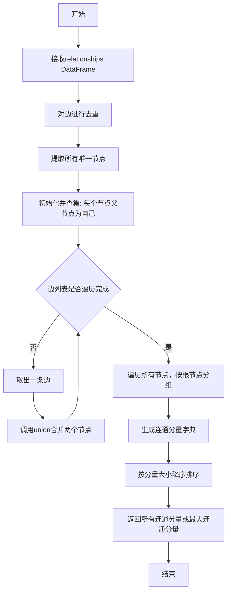
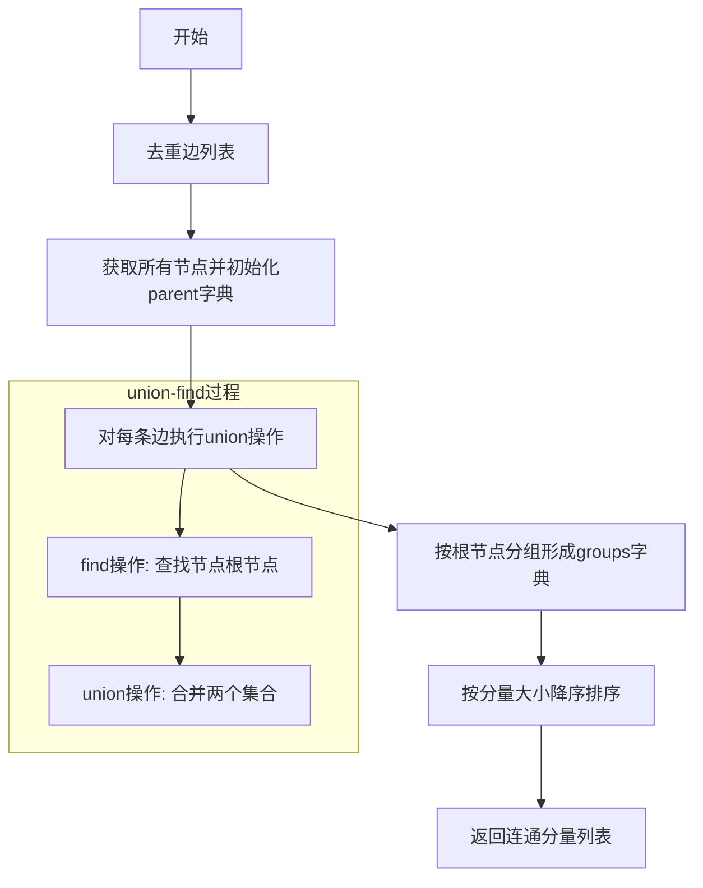
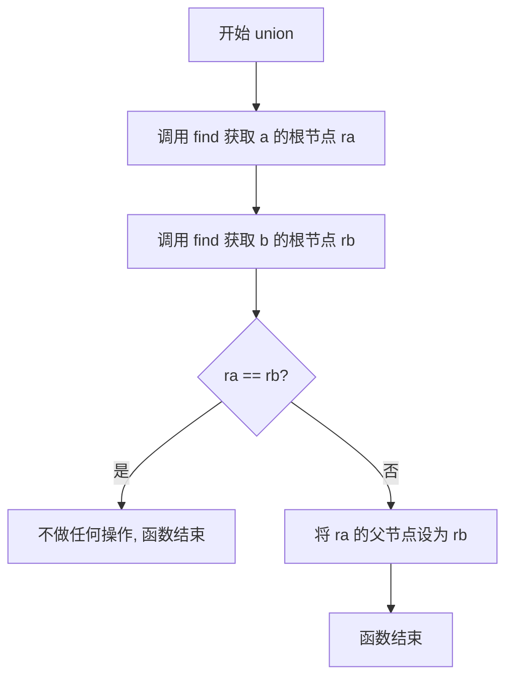

# `graphrag\packages\graphrag\graphrag\graphs\connected_components.py` 详细设计文档

该模块实现了一个基于Union-Find算法的连通分量查找工具，能够从包含源节点和目标节点的DataFrame中识别所有连通分量，并提供获取最大连通分量的功能，常用于图分析、社交网络群体发现等场景。

## 整体流程



## 类结构

```
模块 (connected_components.py)
└── 全局函数
    ├── connected_components()
    │   └── 嵌套函数: find()
    │   └── 嵌套函数: union()
    └── largest_connected_component()
```

## 全局变量及字段


### `edges`
    
去重后的边列表DataFrame

类型：`pd.DataFrame`
    


### `all_nodes`
    
所有唯一节点的索引

类型：`pd.Index`
    


### `parent`
    
并查集的父节点映射字典

类型：`dict[str, str]`
    


### `groups`
    
按根节点分组的连通分量字典

类型：`dict[str, set[str]]`
    


### `components`
    
连通分量列表

类型：`list[set[str]]`
    


    

## 全局函数及方法


### `connected_components`

使用 Union-Find（并查集）算法在去重后的边列表 DataFrame 上找出所有连通分量，返回每个连通分量中节点标题的集合列表，按组件大小降序排列。

参数：

- `relationships`：`pd.DataFrame`，包含源节点和目标节点列的边列表 DataFrame
- `source_column`：`str`，源节点列的名称，默认为 "source"
- `target_column`：`str`，目标节点列的名称，默认为 "target"

返回值：`list[set[str]]`，每个元素是一个属于某个连通分量的节点标题集合（set），列表按分量大小降序排列

#### 流程图



#### 带注释源码

```python
def connected_components(
    relationships: pd.DataFrame,
    source_column: str = "source",
    target_column: str = "target",
) -> list[set[str]]:
    """Return all connected components as a list of node-title sets.

    Uses union-find on the deduplicated edge list.

    Parameters
    ----------
    relationships : pd.DataFrame
        Edge list with at least source and target columns.
    source_column : str
        Name of the source node column.
    target_column : str
        Name of the target node column.

    Returns
    -------
    list[set[str]]
        Each element is a set of node titles belonging to one component,
        sorted by descending component size.
    """
    # 去除重复的边，确保每条边只处理一次
    edges = relationships.drop_duplicates(subset=[source_column, target_column])

    # 初始化：每个节点都是自己的父节点（独立集合）
    # 获取所有唯一节点（从源列和目标列合并）
    all_nodes = pd.concat(
        [edges[source_column], edges[target_column]], ignore_index=True
    ).unique()
    # parent字典存储每个节点的父节点，初始化时父节点指向自己
    parent: dict[str, str] = {node: node for node in all_nodes}

    def find(x: str) -> str:
        """查找节点x的根节点（路径压缩优化）"""
        while parent[x] != x:
            # 路径压缩：将当前节点的父节点指向祖父节点，减少后续查找深度
            parent[x] = parent[parent[x]]
            x = parent[x]
        return x

    def union(a: str, b: str) -> None:
        """合并两个节点所在的集合"""
        ra, rb = find(a), find(b)
        if ra != rb:
            # 将根节点ra的父节点设为rb，实现集合合并
            parent[ra] = rb

    # 遍历每条边，对源节点和目标节点执行union操作
    for src, tgt in zip(edges[source_column], edges[target_column], strict=True):
        union(src, tgt)

    # 按根节点分组：将所有节点按其根节点进行分组
    groups: dict[str, set[str]] = {}
    for node in parent:
        root = find(node)  # 找到当前节点的根节点
        groups.setdefault(root, set()).add(node)  # 将节点加入对应的分组

    # 返回按分量大小降序排列的连通分量列表
    return sorted(groups.values(), key=len, reverse=True)
```


### `largest_connected_component`

便捷函数，返回最大的连通分量中的节点标题集合。该函数内部调用 `connected_components` 函数获取所有连通分量，然后返回按大小降序排列后的第一个元素（即最大的连通分量）。

参数：

- `relationships`：`pd.DataFrame`，边列表，至少包含 source 和 target 列
- `source_column`：`str`，源节点列的名称，默认为 "source"
- `target_column`：`str`，目标节点列的名称，默认为 "target"

返回值：`set[str]`，最大连通分量中的节点标题集合

#### 流程图

```mermaid
flowchart TD
    A[开始] --> B[调用 connected_components 函数]
    B --> C[获取按大小降序排列的连通分量列表]
    C --> D{components 是否为空?}
    D -->|是| E[返回空集合 set()]
    D -->|否| F[返回 components[0] - 最大的连通分量]
    E --> G[结束]
    F --> G
```

#### 带注释源码

```python
def largest_connected_component(
    relationships: pd.DataFrame,
    source_column: str = "source",
    target_column: str = "target",
) -> set[str]:
    """Return the node titles belonging to the largest connected component.

    Parameters
    ----------
    relationships : pd.DataFrame
        Edge list with at least source and target columns.
    source_column : str
        Name of the source node column.
    target_column : str
        Name of the target node column.

    Returns
    -------
    set[str]
        The set of node titles in the largest connected component.
    """
    # 调用 connected_components 获取所有连通分量（已按大小降序排列）
    components = connected_components(
        relationships,
        source_column=source_column,
        target_column=target_column,
    )
    
    # 如果没有连通分量（空图），返回空集合
    if not components:
        return set()
    
    # 返回最大的连通分量（列表第一个元素）
    return components[0]
```


### `connected_components.find`

并查集的查找操作，使用路径压缩优化加速后续查找，在查找过程中将节点直接指向其祖父节点以缩短路径。

参数：

- `x`：`str`，要查找的节点标识符

返回值：`str`，返回该节点所在集合的根节点（代表元）

#### 流程图

```mermaid
flowchart TD
    A["开始: find(x)"] --> B{parent[x] != x?}
    B -->|是| C["path compression: parent[x] = parent[parent[x]]"]
    C --> D["x = parent[x]"]
    D --> B
    B -->|否| E["返回 x 作为根节点"]
    E --> F["结束"]
```

#### 带注释源码

```python
def find(x: str) -> str:
    """并查集的查找操作，包含路径压缩优化。
    
    参数:
        x: str - 要查找的节点标识符
        
    返回:
        str - 该节点所在集合的根节点
    """
    # 当节点的父节点不是自身时（即不是根节点）
    while parent[x] != x:
        # 路径压缩：将当前节点的父节点指向祖父节点
        # 这会跳过中间节点，加速后续查找
        parent[x] = parent[parent[x]]
        # 向上移动到父节点
        x = parent[x]
    # 返回根节点（代表元）
    return x
```


### `connected_components.union`

该函数是并查集（Union-Find）数据结构中的合并操作，用于将两个节点所在的集合合并为一个集合。它接收两个节点标识字符串作为参数，通过查找各自的根节点并将一个根节点指向另一个根节点来实现集合合并，不返回任何值。

参数：

- `a`：`str`，要合并的第一个节点标识符
- `b`：`str`，要合并的第二个节点标识符

返回值：`None`，该函数直接修改并查集的父节点字典，不返回任何值

#### 流程图



#### 带注释源码

```python
def union(a: str, b: str) -> None:
    """合并两个节点所在的连通分量。
    
    Parameters
    ----------
    a : str
        第一个节点的标识符
    b : str
        第二个节点的标识符
    """
    # 查找节点a所在集合的根节点
    ra, rb = find(a), find(b)
    # 如果两个节点不在同一个集合中，则合并
    if ra != rb:
        # 将根节点ra的父节点指向rb，实现集合合并
        parent[ra] = rb
```

## 关键组件


### Union-Find 算法实现

使用并查集（Union-Find）数据结构高效处理连通分量问题，通过find和union两个核心方法管理节点间的连通关系。

### 路径压缩优化

在find方法中实现路径压缩（path compression），将查找过程中的节点直接指向根节点，减少后续查找的时间复杂度。

### 边列表去重处理

使用pandas的drop_duplicates方法对输入的边列表进行去重，确保每条边只处理一次，避免重复union操作。

### 节点收集与初始化

从source和target列提取所有唯一节点，并将每个节点初始化为自己的父节点，形成独立的分量。

### 连通分量排序输出

将所有连通分量按大小降序排序返回，便于直接获取最大连通分量或进行后续分析。

### 最大连通分量提取

封装了connected_components的调用，返回最大的那个连通分量，提供更便捷的API。


## 问题及建议


### 已知问题

- **缺少输入验证**：函数未检查 `source_column` 和 `target_column` 是否存在于 DataFrame 中，也未处理 NaN 值，可能导致运行时错误
- **未处理边界情况**：空 DataFrame 或空边列表时，代码可能产生意外行为或空结果
- **Union-Find 缺少 rank 优化**：未使用按秩合并（union by rank）策略，可能导致树的高度过高，降低算法效率
- **Path compression 不完整**：仅做了一层路径压缩，递归实现可实现更彻底的压缩
- **largest_connected_component 存在冗余计算**：调用 `connected_components` 并排序返回所有分量，但实际只需要最大的那个，对于大型图效率低下
- **DataFrame 遍历效率**：使用 `zip(edges[source_column], edges[target_column])` 逐行遍历，不如 `itertuples` 高效

### 优化建议

- 添加输入验证：检查列名是否存在，处理 NaN/空值情况，必要时抛出有意义的异常或返回空结果
- 为 Union-Find 实现添加 rank/weight 优化，并使用递归实现完整路径压缩
- 重构 `largest_connected_component`：实现专门的单次遍历版本，避免不必要的排序开销
- 考虑将内部函数 `find` 和 `union` 提取为模块级函数或闭包，减少重复定义开销
- 使用 `itertuples()` 替代 zip 遍历 DataFrame，提升遍历性能

## 其它


### 设计目标与约束

本模块旨在高效地从边列表DataFrame中提取连通分量信息，支持查找所有连通分量及最大连通分量。采用Union-Find（并查集）算法实现，确保在稀疏图上具有接近O(α(n))的查询效率，其中α为反阿克曼函数。设计约束包括：输入必须为pandas DataFrame格式，节点标识仅支持字符串类型，边为无向边且允许自环（自环不影响连通性）。

### 错误处理与异常设计

模块未实现显式异常捕获，依赖pandas底层错误处理。主要异常场景包括：1) 输入DataFrame为空时，`connected_components`返回空列表，`largest_connected_component`返回空集；2) 缺少指定列时pandas抛出KeyError；3) 列数据类型非字符串时可能引发类型推导错误。建议调用方在入口处验证DataFrame非空且包含必需列，并确保source_column和target_column列的数据类型为字符串。

### 数据流与状态机

数据流遵循以下路径：输入DataFrame → 去重边列表 → 构建节点集合 → 初始化并查集父节点字典 → 遍历边执行union操作 → 按根节点分组 → 返回排序后的连通分量列表。状态转换通过并查集的find和union操作隐式管理，无显式状态机设计。

### 外部依赖与接口契约

核心依赖为pandas库（>=1.0），无其他第三方依赖。接口契约如下：relationships参数必须为包含至少source_column和target_column两列的DataFrame；source_column和target_column参数默认为"source"和"target"；返回值类型为list[set[str]]或set[str]；函数不修改输入DataFrame，不产生副作用。

### 算法实现细节

采用带路径压缩的并查集算法。find操作使用迭代实现并在过程中执行路径压缩（parent[x] = parent[parent[x]]）；union操作按秩合并的简化版本（未显式维护rank但通过根节点赋值实现合并）。时间复杂度为O(E × α(V))，空间复杂度为O(V)，其中E为边数，V为节点数。排序操作复杂度为O(V log V)。

### 性能优化建议

当前实现中每次find调用都重新遍历路径，可考虑将find结果缓存以减少重复计算。对于超大规模图（节点数百万级），可考虑使用pandas Categorical类型优化内存，或采用networkx库的connected_components实现替代。当前实现在边列表已去重前提下工作，若输入可能包含重复边可移除drop_duplicates调用以提升小规模数据性能。

### 使用示例与边界情况

典型用法：传入包含source和target列的DataFrame，调用connected_components获取按规模降序排列的所有连通分量，或调用largest_connected_component直接获取最大分量。边界情况包括：空DataFrame返回空结果；单节点无边时返回n个单独节点分量；完全图返回单一包含所有节点的连通分量。

    