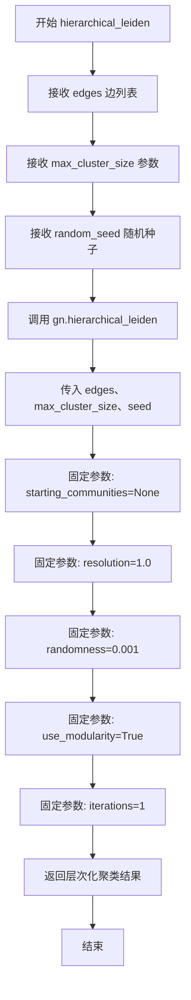
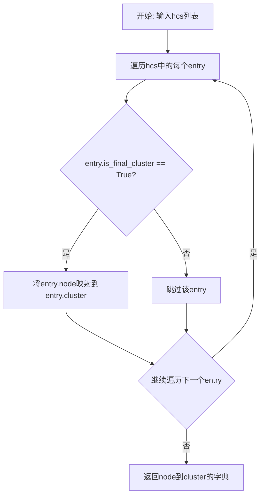

# `graphrag\packages\graphrag\graphrag\graphs\hierarchical_leiden.py` 详细设计文档

该文件实现了层次化Leiden聚类算法，用于对边列表进行社区发现，通过调用graspologic_native库的底层算法，提供层次化聚类结果，并支持提取第一层级和最终层级的聚类结果。

## 整体流程

```mermaid
graph TD
    A[开始] --> B[接收边列表 edges]
    B --> C[调用 gn.hierarchical_leiden]
    C --> D[返回层次聚类结果 list[gn.HierarchicalCluster]]
    D --> E{需要提取哪层级?}
    E --> F[first_level_hierarchical_clustering]
    E --> G[final_level_hierarchical_clustering]
    F --> H[返回第一层级聚类结果 dict]
    G --> I[返回最终层级聚类结果 dict]
    H --> J[结束]
    I --> J
```

## 类结构

```
模块级函数
├── hierarchical_leiden
├── first_level_hierarchical_clustering
└── final_level_hierarchical_clustering
```

## 全局变量及字段


    

## 全局函数及方法


### `hierarchical_leiden`

该函数是层次化Leiden聚类算法在边列表上的封装实现，通过调用底层的 graspologic_native 库执行社区检测算法，支持设置最大聚类大小和随机种子，并返回层次化的聚类结果。

参数：

- `edges`：`list[tuple[str, str, float]]`，边列表，每条边为包含源节点、目标节点和权重（可选）的元组
- `max_cluster_size`：`int`，最大聚类大小，默认为 10
- `random_seed`：`int | None`，随机种子，用于算法结果的可复现性，默认为十六进制值 0xDEADBEEF

返回值：`list[gn.HierarchicalCluster]`，层次化聚类结果列表，每个元素代表一个聚类节点及其层级信息

#### 流程图



#### 带注释源码

```python
def hierarchical_leiden(
    edges: list[tuple[str, str, float]],  # 输入的边列表，包含节点对及其权重
    max_cluster_size: int = 10,           # 限制每个聚类的最大节点数
    random_seed: int | None = 0xDEADBEEF, # 随机种子确保结果可复现
) -> list[gn.HierarchicalCluster]:
    """Run hierarchical leiden on an edge list.
    
    在边列表上运行层次化Leiden聚类算法
    
    参数:
        edges: 边列表，每条边为 (源节点, 目标节点, 权重) 的元组
        max_cluster_size: 单个聚类的最大允许大小
        random_seed: 随机数生成器的种子，设为None则使用系统随机
    
    返回:
        层次化聚类结果列表，包含所有层级的聚类信息
    """
    # 调用底层 graspologic_native 库的 hierarchical_leiden 实现
    return gn.hierarchical_leiden(
        edges=edges,                      # 原始边列表数据
        max_cluster_size=max_cluster_size, # 聚类大小上限
        seed=random_seed,                 # 随机种子传递
        starting_communities=None,        # 不提供初始社区划分
        resolution=1.0,                   # 使用默认分辨率参数
        randomness=0.001,                 # 较低的随机性水平
        use_modularity=True,              # 启用模块度优化
        iterations=1,                     # 单次迭代
    )
```


### `first_level_hierarchical_clustering`

该函数用于从层次聚类结果中提取第一层（level == 0）的聚类结果，将节点ID映射到对应的社区ID。

参数：

- `hcs`：`list[gn.HierarchicalCluster]`，层次聚类算法的完整输出结果列表

返回值：`dict[Any, int]`，第一层聚类结果，键为节点ID，值为社区ID

#### 流程图

```mermaid
flowchart TD
    A[输入: hcs list[gn.HierarchicalCluster]] --> B[遍历hcs中的每个entry]
    B --> C{entry.level == 0?}
    C -->|是| D[构建字典<br/>entry.node -> entry.cluster]
    C -->|否| E[跳过该entry]
    D --> F{是否还有更多entry?}
    E --> F
    F -->|是| B
    F -->|否| G[返回字典 dict[Any, int]]
```

#### 带注释源码

```python
def first_level_hierarchical_clustering(
    hcs: list[gn.HierarchicalCluster],
) -> dict[Any, int]:
    """Return the initial leiden clustering as a dict of node id to community id.

    Returns
    -------
    dict[Any, int]
        The initial leiden algorithm clustering results as a dictionary
        of node id to community id.
    """
    # 遍历层次聚类结果列表，筛选出 level == 0 的条目（即第一层聚类）
    # 构建字典：{节点ID: 社区ID}
    return {entry.node: entry.cluster for entry in hcs if entry.level == 0}
```


### `final_level_hierarchical_clustering`

返回最终的Leiden聚类结果，以节点ID到社区ID的字典形式呈现。该函数从HierarchicalCluster列表中筛选出最终聚类层级的条目，将其转换为节点到社区的映射字典。

参数：

- `hcs`：`list[gn.HierarchicalCluster]`，输入的HierarchicalCluster对象列表

返回值：`dict[Any, int]`，最终的Leiden算法聚类结果，以节点ID到社区ID的字典形式返回

#### 流程图



#### 带注释源码

```python
def final_level_hierarchical_clustering(
    hcs: list[gn.HierarchicalCluster],
) -> dict[Any, int]:
    """Return the final leiden clustering as a dict of node id to community id.

    Returns
    -------
    dict[Any, int]
        The last leiden algorithm clustering results as a dictionary
        of node id to community id.
    """
    # 遍历HierarchicalCluster列表，筛选出最终聚类层级的条目
    # 并构建以node为键、cluster为值的字典返回
    return {entry.node: entry.cluster for entry in hcs if entry.is_final_cluster}
```

## 关键组件


### hierarchical_leiden 函数

主入口函数，接收边列表和聚类参数，调用底层graspologic_native库执行层级Leiden聚类算法，返回层级聚类结果列表

### first_level_hierarchical_clustering 函数

从层级聚类结果中筛选第一层级（level==0）的聚类数据，将节点ID映射到对应的社区ID，以字典形式返回初始聚类结果

### final_level_hierarchical_clustering 函数

从层级聚类结果中筛选最终聚类（is_final_cluster==True）的数据，将节点ID映射到对应的社区ID，以字典形式返回最细粒度的聚类结果

### gn.HierarchicalCluster 数据结构

来自graspologic_native库的层级聚类结果对象，包含node（节点标识）、cluster（社区编号）、level（层级索引）、is_final_cluster（是否为最终聚类）等属性

### edges 参数格式

边列表采用三元组元组格式 (源节点, 目标节点, 权重)，用于表示图中的边及其权重信息


## 问题及建议


### 已知问题

- **硬编码参数**：函数 `hierarchical_leiden` 中的 `starting_communities`、`resolution`、`randomness`、`use_modularity`、`iterations` 等参数被硬编码为默认值，用户无法自定义这些聚类算法参数，降低了函数的灵活性
- **类型注解不精确**：`random_seed: int | None` 的默认值是 `0xDEADBEEF`（一个具体的整数值），而非 `None`，类型注解与实际默认值不一致；`edges` 参数的类型是 `list[tuple[str, str, float]]`，但没有运行时验证输入格式是否匹配
- **缺乏错误处理**：代码没有任何 try-except 块来捕获 `graspologic_native` 库可能抛出的异常（如无效输入、内存错误等），也没有验证输入数据的合法性（如边列表为空、权重为负数等边界情况）
- **函数逻辑重复**：`first_level_hierarchical_clustering` 和 `final_level_hierarchical_clustering` 两个函数包含几乎相同的字典推导逻辑 `{entry.node: entry.cluster for entry in hcs if ...}`，代码冗余
- **文档信息不足**：函数文档字符串缺少参数的具体说明、异常情况、使用示例等内容；对于 `level == 0` 和 `is_final_cluster` 的过滤逻辑没有解释其含义
- **缺少测试覆盖**：整个文件没有任何单元测试或集成测试代码，无法保证函数的正确性和健壮性
- **过滤逻辑可能产生空结果**：当输入的 `hcs` 为空列表或没有满足过滤条件的元素时，函数返回空字典，但调用者无法区分是因为没有数据还是因为过滤条件无匹配

### 优化建议

- **参数外部化**：将硬编码的算法参数暴露为函数可选参数，允许高级用户调整聚类行为，例如 `def hierarchical_leiden(edges, max_cluster_size=10, random_seed=0xDEADBEEF, resolution=1.0, iterations=1, ...)`
- **添加输入验证**：在函数入口处验证 `edges` 的格式（是否为三元组列表、权重是否为数值等），验证 `max_cluster_size` 为正整数，提升代码健壮性
- **统一过滤逻辑**：抽取公共的字典推导逻辑为一个私有辅助函数 `_extract_clustering(hcs, predicate)`，减少代码重复
- **完善文档**：为每个参数添加详细的 docstring 说明，包括参数类型、默认值、作用；添加 Returns 部分的异常说明和使用示例
- **添加异常处理**：用 try-except 包装对 `gn.hierarchical_leiden` 的调用，捕获并重新抛出更友好的异常或返回错误信息
- **扩展功能**：考虑添加获取中间层级聚类结果的方法，而不仅仅是第一层和最终层，提高 API 的实用性
- **类型注解修正**：将 `random_seed` 的类型注解修正为 `int` 或调整默认值为 `None`，保持一致性


## 其它


### 设计目标与约束

本模块旨在提供对边列表进行层级Leiden社区检测的功能，支持多层次的聚类结果输出。设计约束包括：max_cluster_size参数限制单个簇的大小；random_seed用于确保结果可复现；resolution参数固定为1.0以保持标准聚类效果；use_modularity=True启用模块度优化。

### 错误处理与异常设计

代码未包含显式的错误处理机制。潜在异常场景包括：edges参数为空列表时返回空结果；edges包含无效节点ID类型时可能引发类型错误；graspologic_native库调用失败时异常将向上传播。调用方需自行处理IndexError、TypeError及库相关异常。

### 外部依赖与接口契约

主要依赖graspologic_native (gn)库，需确保该C++扩展已正确安装。输入edges为三元组列表，格式为(节点A, 节点B, 权重)，权重需为float类型。输出为HierarchicalCluster对象列表，每个对象包含node、cluster、level、is_final_cluster等属性。

### 性能考虑与优化空间

当前实现使用iterations=1和randomness=0.001的保守参数，可能影响聚类质量。可考虑：增加iterations提高收敛性；将resolution、randomness等参数暴露给调用方；添加缓存机制避免重复计算；支持增量更新。函数内部创建临时字典推导式，可考虑返回生成器以降低内存占用。

### 测试策略建议

应覆盖：空边列表输入；单边输入；完全图输入；多层级聚类验证；节点ID类型兼容性（字符串、数字、混合）；max_cluster_size边界值测试；random_seed可复现性验证；与gn库返回结果的完整性检查。

### 使用示例

```python
edges = [("A", "B", 0.9), ("B", "C", 0.8), ("C", "D", 0.85)]
result = hierarchical_leiden(edges, max_cluster_size=5)
first_clusters = first_level_hierarchical_clustering(result)
final_clusters = final_level_hierarchical_clustering(result)
```

### 限制与假设

假设输入边列表无向且权重非负；假设图连通性不受限；假设HierarchicalCluster对象的level和is_final_cluster属性始终存在；未处理自环和重复边；未提供并行化支持。

    