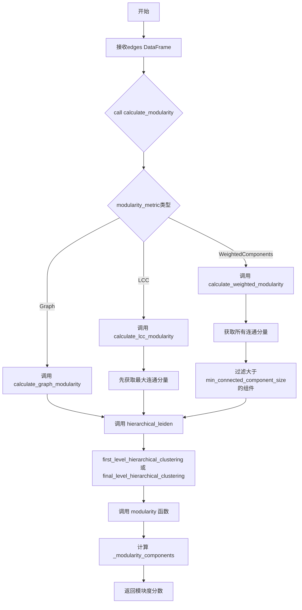
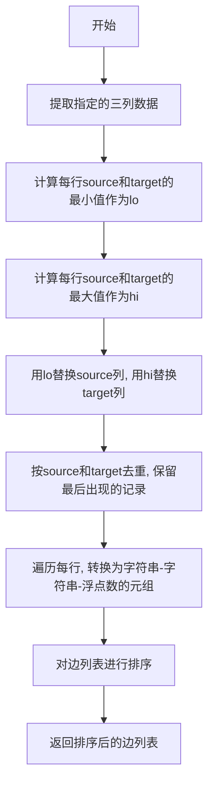
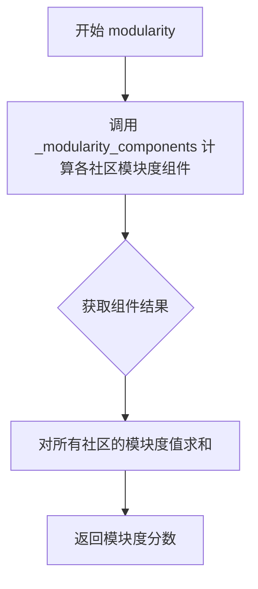
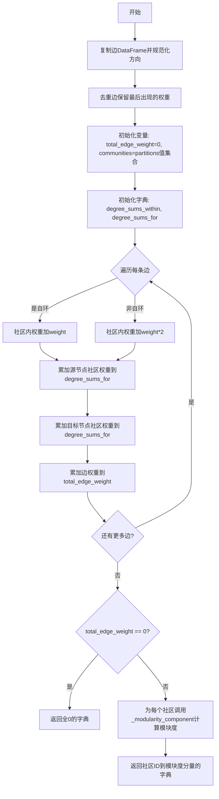
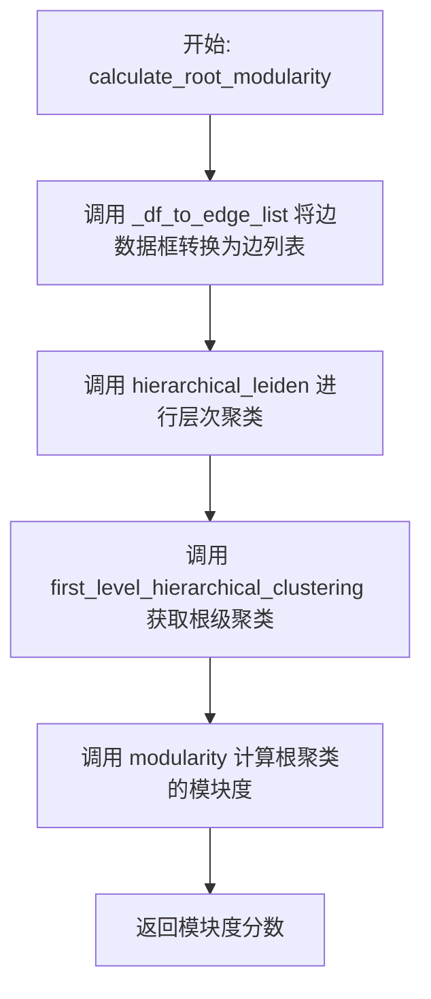
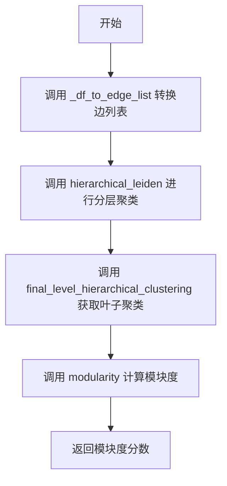
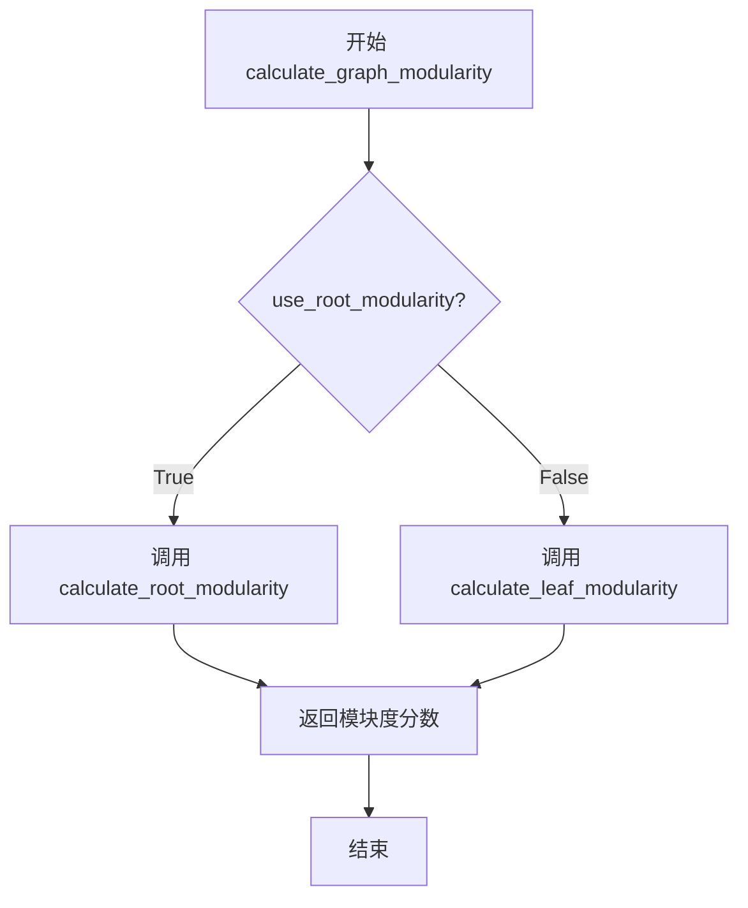
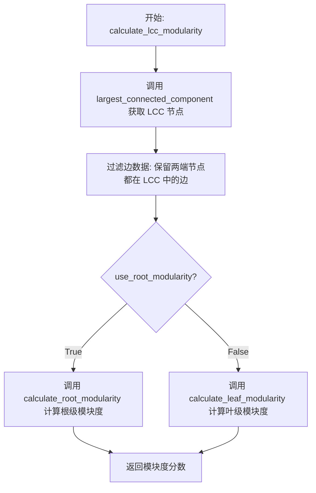
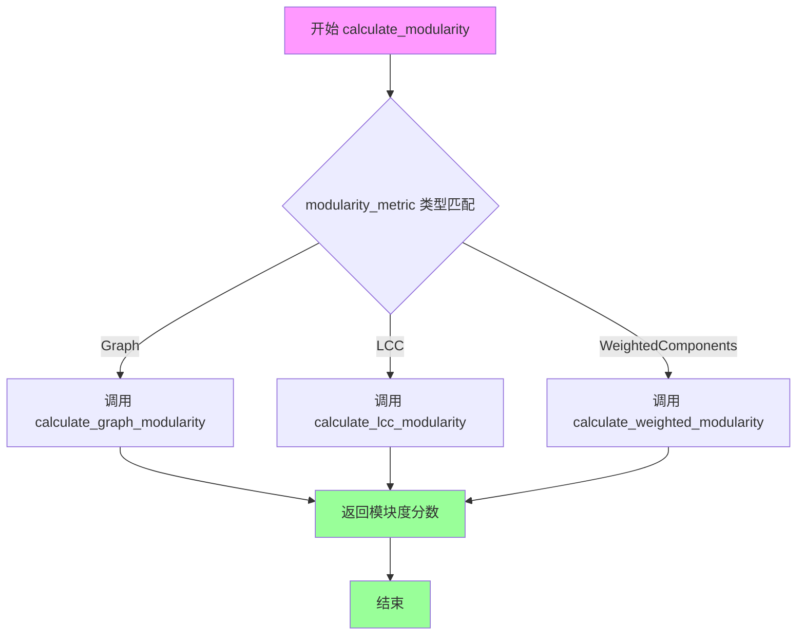

# `graphrag\packages\graphrag\graphrag\graphs\modularity.py` 详细设计文档

该模块用于从边列表DataFrame直接计算图的模块度（Modularity），支持多种模块度计算模式（图模块度、最大连通分量模块度、加权组件模块度），并使用层次化Leiden算法进行社区检测。

## 整体流程



## 类结构

```
该文件为纯函数模块，无类定义
所有函数分为三类：
├── 公开API函数
│   ├── calculate_modularity (主入口)
│   ├── calculate_graph_modularity
│   ├── calculate_lcc_modularity
│   ├── calculate_weighted_modularity
│   ├── calculate_root_modularity
│   ├── calculate_leaf_modularity
│   └── modularity
├── 私有辅助函数
│   ├── _df_to_edge_list
│   ├── _modularity_component
│   └── _modularity_components
└── 外部依赖函数 (从graphrag.graphs导入)
    ├── hierarchical_leiden
    ├── first_level_hierarchical_clustering
    ├── final_level_hierarchical_clustering
    ├── connected_components
    └── largest_connected_component
```

## 全局变量及字段


### `logger`
    
模块级日志记录器，用于记录函数执行过程中的信息、警告和错误

类型：`logging.Logger`
    


    

## 全局函数及方法


### `_df_to_edge_list`

将关系DataFrame转换为排序后的边列表。该函数规范化边的方向（将每条无向边统一为从较小节点ID到较大节点ID的顺序），并去重保留最后一次出现的权重（与NetworkX行为一致），最终返回按节点ID排序的元组列表。

参数：

- `edges`：`pd.DataFrame`，包含边的DataFrame，至少需要source、target和weight三列
- `source_column`：`str`，源节点列名，默认为"source"
- `target_column`：`str`，目标节点列名，默认为"target"
- `weight_column`：`str`，边权重列名，默认为"weight"

返回值：`list[tuple[str, str, float]]`，排序后的边列表，每个元素为(源节点, 目标节点, 权重)的元组

#### 流程图



#### 带注释源码

```python
def _df_to_edge_list(
    edges: pd.DataFrame,
    source_column: str = "source",
    target_column: str = "target",
    weight_column: str = "weight",
) -> list[tuple[str, str, float]]:
    """Convert a relationships DataFrame to a sorted edge list.

    Normalizes direction and deduplicates so each undirected edge appears
    once, keeping the last occurrence's weight (matching NX behavior).
    """
    # 步骤1: 提取需要的三列数据并创建副本，避免修改原始数据
    df = edges[[source_column, target_column, weight_column]].copy()
    
    # 步骤2: 计算每行中source和target的最小值，作为规范化后的较小端点
    lo = df[[source_column, target_column]].min(axis=1)
    
    # 步骤3: 计算每行中source和target的最大值，作为规范化后的较大端点
    hi = df[[source_column, target_column]].max(axis=1)
    
    # 步骤4: 用最小值替换source列，用最大值替换target列
    # 这样每条边都规范化为从小节点指向大节点的方向
    df = df.assign(**{source_column: lo, target_column: hi})
    
    # 步骤5: 按source和target进行去重，保留最后出现的记录
    # 这确保每条无向边只出现一次，权重取最后一次出现的值
    df = df.drop_duplicates(subset=[source_column, target_column], keep="last")
    
    # 步骤6: 将数据转换为字符串-字符串-浮点数的元组格式
    # 步骤7: 对边列表进行排序（按源节点，再按目标节点）
    return sorted(
        (str(row[source_column]), str(row[target_column]), float(row[weight_column]))
        for _, row in df.iterrows()
    )
```


### `modularity`

计算给定社区分配情况下图的模块度（modularity），通过调用内部函数计算各社区的模块度贡献并求和得到总体模块度分数。

参数：

- `edges`：`pd.DataFrame`，边列表数据框，至少包含 source、target 和 weight 列
- `partitions`：`dict[str, int]`，节点标题到社区 ID 的映射字典
- `source_column`：`str`，源节点列的名称，默认为 "source"
- `target_column`：`str`，目标节点列的名称，默认为 "target"
- `weight_column`：`str`，边权重列的名称，默认为 "weight"
- `resolution`：`float`，模块度计算的分辩率参数，默认为 1.0

返回值：`float`，模块度分数

#### 流程图



#### 带注释源码

```python
def modularity(
    edges: pd.DataFrame,
    partitions: dict[str, int],
    source_column: str = "source",
    target_column: str = "target",
    weight_column: str = "weight",
    resolution: float = 1.0,
) -> float:
    """Calculate modularity of a graph given community assignments.

    Parameters
    ----------
    edges : pd.DataFrame
        Edge list with at least source, target, and weight columns.
    partitions : dict[str, int]
        Mapping from node title to community id.
    source_column : str
        Name of the source node column.
    target_column : str
        Name of the target node column.
    weight_column : str
        Name of the edge weight column.
    resolution : float
        Resolution parameter for modularity calculation.

    Returns
    -------
    float
        The modularity score.
    """
    # 调用内部函数计算每个社区的模块度贡献组件
    components = _modularity_components(
        edges, partitions, source_column, target_column, weight_column, resolution
    )
    # 对所有社区的模块度值求和，返回总体模块度分数
    return sum(components.values())
```


### `_modularity_component`

计算单个社区的模块度贡献值。该函数基于模块度公式，计算给定社区内部的边权重与期望边权重的差值，用于评估图的社区划分质量。

参数：

- `intra_community_degree`：`float`，社区内部的边权重总和（包括自环权重）
- `total_community_degree`：`float`，社区内所有节点的度（权重和）
- `network_degree_sum`：`float`，整个网络中所有边的权重总和（2m）
- `resolution`：`float`，分辨率参数，用于调节社区规模大小

返回值：`float`，单个社区的模块度贡献值

#### 流程图

```mermaid
flowchart TD
    A[开始计算社区模块度贡献] --> B[计算社区度比率<br/>community_degree_ratio = total_community_degree² / 2m]
    B --> C[计算模块度贡献值<br/>Q = (intra_community_degree - resolution × community_degree_ratio) / 2m]
    C --> D[返回模块度贡献值]
```

#### 带注释源码

```python
def _modularity_component(
    intra_community_degree: float,
    total_community_degree: float,
    network_degree_sum: float,
    resolution: float,
) -> float:
    """Compute the modularity contribution of a single community.
    
    模块度公式: Q = Σ_c [e_cc - a_c²]
    其中 e_cc 是社区内边权重比例, a_c 是社区度比例
    
    完整公式展开为:
    Q = (intra_community_degree - resolution * (total_community_degree² / 2m)) / 2m
    
    Parameters
    ----------
    intra_community_degree : float
        社区内部的边权重总和。自环权重计为1倍，非自环边在遍历时已乘以2。
    total_community_degree : float
        社区内所有节点的度（权重和），即社区中所有边的权重总和。
    network_degree_sum : float
        整个网络中所有边的权重总和（即2m，m为总边权重）。
    resolution : float
        分辨率参数。值越大倾向于产生更多小型社区，值越小倾向于产生更少的大型社区。
        默认值为1.0。
    
    Returns
    -------
    float
        单个社区的模块度贡献值，范围通常在[-0.5, 1.0]之间。
    """
    # 计算社区度比率：社区总度的平方除以网络总度
    # 这代表在随机图中，该社区内部期望的边权重比例
    community_degree_ratio = math.pow(total_community_degree, 2.0) / (
        2.0 * network_degree_sum
    )
    
    # 模块度贡献 = (实际社区内权重 - 期望权重) / (2 * 总权重)
    # resolution 参数用于调节随机图期望权重的权重
    return (intra_community_degree - resolution * community_degree_ratio) / (
        2.0 * network_degree_sum
    )
```


### `_modularity_components`

该函数用于计算图中每个社区的模块度贡献值，通过遍历边列表DataFrame，根据节点所属社区分区统计社区内权重和与社区总权重和，最后调用模块度计算公式得到各社区的模块度分量。

参数：

- `edges`：`pd.DataFrame`，包含至少source、target和weight列的边列表DataFrame
- `partitions`：`dict[str, int]`，从节点名称到社区ID的映射字典
- `source_column`：`str`，源节点列的名称，默认为"source"
- `target_column`：`str`，目标节点列的名称，默认为"target"
- `weight_column`：`str`，边权重列的名称，默认为"weight"
- `resolution`：`float`，模块度计算的分辨率参数，默认为1.0

返回值：`dict[int, float]`，社区ID到模块度分量值的映射字典

#### 流程图



#### 带注释源码

```python
def _modularity_components(
    edges: pd.DataFrame,
    partitions: dict[str, int],
    source_column: str = "source",
    target_column: str = "target",
    weight_column: str = "weight",
    resolution: float = 1.0,
) -> dict[int, float]:
    """Calculate per-community modularity components from an edge list.

    Edges are treated as undirected: direction is normalized and duplicates
    are removed (keeping the last occurrence's weight, matching NX behavior).
    """
    # 步骤1: 规范化边方向（将双向边转为统一方向）并去重
    # 复制需要的列以避免修改原始数据
    df = edges[[source_column, target_column, weight_column]].copy()
    # 取每条边的较小值作为source，较大值作为target，实现无向边规范化
    lo = df[[source_column, target_column]].min(axis=1)
    hi = df[[source_column, target_column]].max(axis=1)
    # 应用规范化后的列
    df = df.assign(**{source_column: lo, target_column: hi})
    # 去重，保留最后出现的权重（与NetworkX行为一致）
    df = df.drop_duplicates(subset=[source_column, target_column], keep="last")

    # 步骤2: 初始化统计变量
    total_edge_weight = 0.0  # 图的总边权重
    communities = set(partitions.values())  # 所有社区ID集合

    # defaultdict自动创建缺失的键，默认为0.0
    degree_sums_within: dict[int, float] = defaultdict(float)  # 社区内权重和
    degree_sums_for: dict[int, float] = defaultdict(float)    # 社区总权重和

    # 步骤3: 遍历每条边，统计各社区的权重信息
    for _, row in df.iterrows():
        src = str(row[source_column])
        tgt = str(row[target_column])
        weight = float(row[weight_column])

        # 获取源节点和目标节点所属社区
        src_comm = partitions[src]
        tgt_comm = partitions[tgt]

        # 统计社区内权重和
        if src_comm == tgt_comm:
            if src == tgt:
                # 自环：权重只加一次
                degree_sums_within[src_comm] += weight
            else:
                # 非自环的同社区边：权重加两次（因为无向边权重要计算两次）
                degree_sums_within[src_comm] += weight * 2.0

        # 统计社区总权重和（每个节点贡献一次权重）
        degree_sums_for[src_comm] += weight
        degree_sums_for[tgt_comm] += weight
        # 累加总边权重
        total_edge_weight += weight

    # 步骤4: 处理空图情况
    if total_edge_weight == 0.0:
        # 如果没有边，所有社区的模块度分量设为0
        return dict.fromkeys(communities, 0.0)

    # 步骤5: 计算每个社区的模块度分量
    # 使用公式: (社区内权重 - resolution * (社区总权重^2 / 2*总权重)) / (2*总权重)
    return {
        comm: _modularity_component(
            degree_sums_within[comm],    # 社区内权重和
            degree_sums_for[comm],       # 社区总权重和
            total_edge_weight,          # 网络总权重
            resolution,                 # 分辨率参数
        )
        for comm in communities
    }
```


### `calculate_root_modularity`

该函数通过将边列表转换为边列表格式，使用层次 Leiden 算法进行图聚类，获取根级别的聚类结果，然后计算并返回图的根聚类模块度值。

参数：

- `edges`：`pd.DataFrame`，包含 source、target 和 weight 列的边列表数据框
- `max_cluster_size`：`int`，默认为 10，层次 Leiden 聚类的最大聚类大小参数
- `random_seed`：`int`，默认为 0xDEADBEEF，用于层次 Leiden 聚类的随机种子，确保结果可复现

返回值：`float`，图的根聚类（第一层层次聚类）的模块度分数

#### 流程图



#### 带注释源码

```python
def calculate_root_modularity(
    edges: pd.DataFrame,
    max_cluster_size: int = 10,
    random_seed: int = 0xDEADBEEF,
) -> float:
    """Calculate modularity of the graph's root clusters.
    
    该函数执行以下步骤：
    1. 将边 DataFrame 转换为边列表格式（规范化方向、去重）
    2. 使用层次 Leiden 算法对图进行聚类
    3. 提取第一层（根级）聚类结果
    4. 根据根聚类计算图的模块度
    
    Parameters
    ----------
    edges : pd.DataFrame
        边列表数据框，必须包含 source, target, weight 列
    max_cluster_size : int
        层次 Leiden 算法的最大聚类大小参数
    random_seed : int
        随机种子，用于确保聚类结果可复现
        
    Returns
    -------
    float
        根聚类的模块度分数，范围通常在 [-0.5, 1] 之间
    """
    # 步骤1: 将边 DataFrame 转换为标准化的边列表元组列表
    # 调用内部函数 _df_to_edge_list 进行:
    # - 规范化边的方向（取min/max确保无向边一致性）
    # - 去重（保留最后出现的权重）
    # - 转换为 (source, target, weight) 元组列表并排序
    edge_list = _df_to_edge_list(edges)
    
    # 步骤2: 使用层次 Leiden 算法对边列表进行聚类
    # hierarchical_leiden 返回完整的层次聚类结构
    # 参数 max_cluster_size 控制每个聚类的最大节点数
    # random_seed 确保结果可复现
    hcs = hierarchical_leiden(
        edge_list,
        max_cluster_size=max_cluster_size,
        random_seed=random_seed,
    )
    
    # 步骤3: 从层次聚类结构中提取根级（第一层）聚类
    # 根级聚类代表最高层次的社区划分
    root_clusters = first_level_hierarchical_clustering(hcs)
    
    # 步骤4: 使用根聚类划分计算图的模块度
    # 模块度衡量社区内部边数与随机期望边数的差异
    # 返回模块度分数作为函数结果
    return modularity(edges, root_clusters)
```


### `calculate_leaf_modularity`

该函数用于计算图结构中叶子聚类的模块度（modularity）。它首先将边列表转换为边列表格式，然后使用分层Leiden算法对图进行聚类，获取叶子级别的聚类结果，最后计算这些叶子聚类的模块度得分。

参数：

- `edges`：`pd.DataFrame`，包含源节点、目标节点和权重列的边列表数据框
- `max_cluster_size`：`int = 10`，分层Leiden算法的最大聚类大小参数，用于控制聚类的粒度
- `random_seed`：`int = 0xDEADBEEF`，随机种子，确保算法结果的可重复性

返回值：`float`，图的所有叶子聚类的模块度分数，取值范围通常在[-0.5, 1]之间，值越高表示聚类质量越好

#### 流程图



#### 带注释源码

```python
def calculate_leaf_modularity(
    edges: pd.DataFrame,
    max_cluster_size: int = 10,
    random_seed: int = 0xDEADBEEF,
) -> float:
    """Calculate modularity of the graph's leaf clusters.
    
    该函数计算图中叶子聚类的模块度。叶子聚类是指分层聚类中最底层的聚类结果，
    即最细粒度的社区划分。
    
    Parameters
    ----------
    edges : pd.DataFrame
        边列表数据框，必须包含source、target和weight列
    max_cluster_size : int
        分层Leiden算法的最大聚类大小参数，默认值为10
    random_seed : int
        随机种子，用于确保聚类结果的可重复性，默认值为0xDEADBEEF
        
    Returns
    -------
    float
        图的叶子聚类模块度分数
    """
    # 步骤1：将DataFrame格式的边列表转换为元组列表格式
    # _df_to_edge_list函数会规范化边的方向（无向边）并去重
    edge_list = _df_to_edge_list(edges)
    
    # 步骤2：使用分层Leiden算法对图进行聚类
    # hierarchical_leiden返回一个分层聚类结构，包含多个层级的聚类结果
    hcs = hierarchical_leiden(
        edge_list,
        max_cluster_size=max_cluster_size,
        random_seed=random_seed,
    )
    
    # 步骤3：从分层聚类结构中提取叶子级别的聚类结果
    # 叶子聚类是最底层的聚类，代表最细粒度的社区划分
    leaf_clusters = final_level_hierarchical_clustering(hcs)
    
    # 步骤4：计算叶子聚类的模块度并返回
    # modularity函数会根据partitions字典中节点到社区的映射计算模块度
    return modularity(edges, leaf_clusters)
```


### `calculate_graph_modularity`

该函数根据 `use_root_modularity` 参数选择计算图的整体模块度，若为 `True` 则计算根层级的模块度，否则计算叶层级的模块度。

参数：

- `edges`：`pd.DataFrame`，边列表数据框，包含 source、target、weight 列
- `max_cluster_size`：`int`，默认值为 10，层次 Leiden 算法中每个簇的最大节点数
- `random_seed`：`int`，默认值为 0xDEADBEEF，随机种子，用于确保结果可复现
- `use_root_modularity`：`bool`，默认值为 True，为 True 时使用根层级聚类计算模块度，为 False 时使用叶层级聚类

返回值：`float`，图的模块度分数

#### 流程图



#### 带注释源码

```python
def calculate_graph_modularity(
    edges: pd.DataFrame,
    max_cluster_size: int = 10,
    random_seed: int = 0xDEADBEEF,
    use_root_modularity: bool = True,
) -> float:
    """Calculate modularity of the whole graph."""
    # 根据 use_root_modularity 参数选择计算根模块度还是叶模块度
    if use_root_modularity:
        # 调用根层级模块度计算函数
        return calculate_root_modularity(
            edges, max_cluster_size=max_cluster_size, random_seed=random_seed
        )
    # 调用叶层级模块度计算函数
    return calculate_leaf_modularity(
        edges, max_cluster_size=max_cluster_size, random_seed=random_seed
    )
```


### `calculate_lcc_modularity`

计算图的最大连通分量（LCC）的模块度（modularity）。该函数首先使用 `largest_connected_component` 从边列表中提取最大连通分量，然后根据 `use_root_modularity` 参数选择调用 `calculate_root_modularity` 或 `calculate_leaf_modularity` 来计算该分量的模块度。

参数：

- `edges`：`pd.DataFrame`，包含 source、target 和 weight 列的边列表数据框
- `max_cluster_size`：`int = 10`，层次 Leiden 聚类的最大聚类大小参数
- `random_seed`：`int = 0xDEADBEEF`，随机种子，用于确保层次 Leiden 聚类的可重复性
- `use_root_modularity`：`bool = True`，是否使用根级聚类计算模块度（True 为根级，False 为叶级）

返回值：`float`，最大连通分量的模块度得分

#### 流程图



#### 带注释源码

```python
def calculate_lcc_modularity(
    edges: pd.DataFrame,
    max_cluster_size: int = 10,
    random_seed: int = 0xDEADBEEF,
    use_root_modularity: bool = True,
) -> float:
    """Calculate modularity of the largest connected component of the graph.
    
    Parameters
    ----------
    edges : pd.DataFrame
        Edge list with source, target, and weight columns.
    max_cluster_size : int
        Maximum cluster size for hierarchical Leiden clustering.
    random_seed : int
        Random seed for reproducible clustering results.
    use_root_modularity : bool
        If True, use root-level clustering; if False, use leaf-level clustering.
    
    Returns
    -------
    float
        The modularity score of the largest connected component.
    """
    # 步骤1: 获取图的最大连通分量（LCC）的节点集合
    lcc_nodes = largest_connected_component(edges)
    
    # 步骤2: 过滤边数据，只保留两端节点都在 LCC 中的边
    lcc_edges = edges[edges["source"].isin(lcc_nodes) & edges["target"].isin(lcc_nodes)]
    
    # 步骤3: 根据 use_root_modularity 参数选择计算方法
    if use_root_modularity:
        # 使用根级层次聚类计算模块度
        return calculate_root_modularity(
            lcc_edges, max_cluster_size=max_cluster_size, random_seed=random_seed
        )
    # 使用叶级层次聚类计算模块度
    return calculate_leaf_modularity(
        lcc_edges, max_cluster_size=max_cluster_size, random_seed=random_seed
    )
```


### `calculate_weighted_modularity`

计算图的加权模块度，针对大于指定最小连通分量大小的连通分量进行模块度计算，并通过节点数进行加权平均。

参数：

- `edges`：`pd.DataFrame`，边列表数据框，至少包含 source, target, weight 列
- `max_cluster_size`：`int`，最大聚类大小，默认为 10
- `random_seed`：`int`，随机种子，默认为 0xDEADBEEF
- `min_connected_component_size`：`int`，最小连通分量大小，默认为 10
- `use_root_modularity`：`bool`，是否使用根模块度计算，默认为 True

返回值：`float`，加权模块度分数

#### 流程图

```mermaid
flowchart TD
    A[开始] --> B[获取所有连通分量]
    B --> C{存在 > min_connected_component_size 的分量?}
    C -->|是| D[过滤出符合条件的分量]
    C -->|否| E[使用整个图作为单个分量]
    D --> F[计算总节点数]
    E --> F
    F --> G[初始化总模块度 = 0.0]
    G --> H{遍历每个连通分量}]
    H -->|还有分量| I[提取子图边]
    I --> J{use_root_modularity?}
    J -->|是| K[调用 calculate_root_modularity]
    J -->|否| L[调用 calculate_leaf_modularity]
    K --> M[计算加权贡献: mod * len(component) / total_nodes]
    L --> M
    M --> H
    H -->|遍历完成| N[返回总模块度]
    N --> O[结束]
```

#### 带注释源码

```python
def calculate_weighted_modularity(
    edges: pd.DataFrame,
    max_cluster_size: int = 10,
    random_seed: int = 0xDEADBEEF,
    min_connected_component_size: int = 10,
    use_root_modularity: bool = True,
) -> float:
    """Calculate weighted modularity of components larger than *min_connected_component_size*.

    Modularity = sum(component_modularity * component_size) / total_nodes.
    """
    # 1. 获取图中所有连通分量
    components = connected_components(edges)
    
    # 2. 过滤出大于最小连通分量大小的分量
    filtered = [c for c in components if len(c) > min_connected_component_size]
    
    # 3. 如果没有满足条件的连通分量，则回退到使用整个图
    if len(filtered) == 0:
        # Fall back to the whole graph
        filtered = [set(edges["source"].unique()).union(set(edges["target"].unique()))]

    # 4. 计算过滤后分量的总节点数
    total_nodes = sum(len(c) for c in filtered)
    
    # 5. 初始化总模块度累加器
    total_modularity = 0.0
    
    # 6. 遍历每个连通分量计算模块度
    for component in filtered:
        # 只处理大于最小连通分量大小的分量
        if len(component) > min_connected_component_size:
            # 提取当前分量的子图边
            sub_edges = edges[
                edges["source"].isin(component) & edges["target"].isin(component)
            ]
            
            # 根据配置选择根模块度或叶模块度计算
            if use_root_modularity:
                mod = calculate_root_modularity(
                    sub_edges,
                    max_cluster_size=max_cluster_size,
                    random_seed=random_seed,
                )
            else:
                mod = calculate_leaf_modularity(
                    sub_edges,
                    max_cluster_size=max_cluster_size,
                    random_seed=random_seed,
                )
            
            # 计算加权贡献：模块度 × (分量节点数 / 总节点数)
            total_modularity += mod * len(component) / total_nodes
    
    # 7. 返回加权模块度
    return total_modularity
```


### `calculate_modularity`

根据指定的模块度度量类型（Graph、LCC 或 WeightedComponents）计算图的模块度分数。该函数使用模式匹配（match-case）将计算任务分发到对应的专用函数，并记录日志信息。

参数：

- `edges`：`pd.DataFrame`，包含 source、target 和 weight 列的边列表数据框
- `max_cluster_size`：`int`，最大聚类大小，默认为 10，用于层次 Leiden 聚类算法
- `random_seed`：`int`，随机种子，默认为 0xDEADBEEF，确保结果可复现
- `use_root_modularity`：`bool`，是否使用根级聚类计算模块度，默认为 True；否则使用叶级聚类
- `modularity_metric`：`ModularityMetric`，模块度度量类型，默认为 ModularityMetric.WeightedComponents

返回值：`float`，图的模块度分数

#### 流程图



#### 带注释源码

```python
def calculate_modularity(
    edges: pd.DataFrame,
    max_cluster_size: int = 10,
    random_seed: int = 0xDEADBEEF,
    use_root_modularity: bool = True,
    modularity_metric: ModularityMetric = ModularityMetric.WeightedComponents,
) -> float:
    """Calculate modularity of the graph based on the modularity metric type."""
    # 使用 match-case 模式匹配根据模块度度量类型分发计算任务
    match modularity_metric:
        case ModularityMetric.Graph:
            # 记录日志并调用整图模块度计算函数
            logger.info("Calculating graph modularity")
            return calculate_graph_modularity(
                edges,
                max_cluster_size=max_cluster_size,
                random_seed=random_seed,
                use_root_modularity=use_root_modularity,
            )
        case ModularityMetric.LCC:
            # 记录日志并调用最大连通分量模块度计算函数
            logger.info("Calculating LCC modularity")
            return calculate_lcc_modularity(
                edges,
                max_cluster_size=max_cluster_size,
                random_seed=random_seed,
                use_root_modularity=use_root_modularity,
            )
        case ModularityMetric.WeightedComponents:
            # 记录日志并调用加权连通分量模块度计算函数（默认选项）
            logger.info("Calculating weighted-components modularity")
            return calculate_weighted_modularity(
                edges,
                max_cluster_size=max_cluster_size,
                random_seed=random_seed,
                use_root_modularity=use_root_modularity,
            )
```

## 关键组件


### 模块度计算引擎

核心功能概述：该代码实现了一个完整的图模块度（Modularity）计算框架，能够从边列表DataFrame计算图的社区结构质量，支持多种模块度指标（整体图、最大连通分量、加权分量），并集成了层次Leiden算法进行社区检测。

### 边列表标准化处理

负责将输入的DataFrame转换为规范化的无向边列表，包括去重、方向标准化（确保每条无向边只出现一次）和排序，同时保留最后出现的边的权重以匹配NetworkX行为。

### 层次Leiden算法集成

通过hierarchical_leiden函数调用外部算法实现层次化社区检测，支持first_level_hierarchical_clustering（根级聚类）和final_level_hierarchical_clustering（叶级聚类）两种粒度，为模块度计算提供社区划分。

### 模块度计算核心

包含_modularity_component（单社区贡献计算）和_modularity_components（多社区组件计算）两个核心函数，实现标准的模块度公式，支持resolution参数调节社区粒度，并处理自环和权重计算。

### 多指标分发器

calculate_modularity函数作为主入口，通过模式匹配（match-case）根据ModularityMetric枚举类型分发到不同的计算策略：Graph（整体图）、LCC（最大连通分量）、WeightedComponents（加权分量模块度）。

### 连通分量处理

集成了connected_components、largest_connected_component函数，支持对图进行连通分量分析，为加权模块度计算提供基础，允许过滤小于指定阈值的分量。

### 技术债务与优化空间

DataFrame的iterrows()遍历效率较低，可考虑向量化操作；_df_to_edge_list和_modularity_components中存在重复的DataFrame处理逻辑，可提取为共享函数；缺少对空图或无效输入的显式异常处理。

## 问题及建议


### 已知问题

-   **代码重复**：`_df_to_edge_list` 函数和 `_modularity_components` 函数中都包含相同的边方向归一化和去重逻辑，导致代码重复维护困难。
-   **低效的 DataFrame 迭代**：多处使用 `df.iterrows()` 遍历 DataFrame 行，这是 pandas 中最慢的操作方式之一，性能瓶颈明显。
-   **缺少输入验证**：未对空 DataFrame、缺失列、节点不在 partitions 字典中等边界情况进行检查，可能导致运行时 KeyError 或意外行为。
- **match 语句不完整**：`calculate_modularity` 函数中的 `match` 语句没有处理默认情况，当 `modularity_metric` 不匹配任何枚举值时会隐式返回 `None`，容易导致难以调试的错误。
- **类型转换开销**：在循环中反复进行 `str()` 和 `float()` 类型转换，增加不必要的计算开销。
- **字典查找未做防护**：`_modularity_components` 中直接使用 `partitions[src]` 和 `partitions[tgt]` 访问字典，若节点不存在会抛出 KeyError 异常。
- **冗余的集合操作**：在 `calculate_weighted_modularity` 中多次对边进行 `isin` 操作，每次都会重新构建集合，效率低下。

### 优化建议

-   **提取公共函数**：将边归一化和去重逻辑提取为独立的私有函数，供 `_df_to_edge_list` 和 `_modularity_components` 共用，消除代码重复。
-   **向量化操作**：使用 pandas 的向量化操作（如 `apply`、`groupby`）替代 `iterrows()`，或直接使用 numpy 数组处理底层数据以提升性能。
-   **增加输入验证**：在函数入口处添加参数校验，检查 DataFrame 是否为空、必需列是否存在、partitions 字典是否包含所有节点等。
-   **完善 match 语句**：添加 `case _:` 处理未知枚举值的情况，或抛出明确的异常。
-   **缓存类型转换**：在循环外预先进行类型转换，或使用 pandas 的 `astype` 方法批量转换列类型。
-   **使用 defaultdict**：对于 `degree_sums_within` 和 `degree_sums_for` 使用 `defaultdict(float)` 避免手动检查键存在性。
-   **优化集合操作**：在 `calculate_weighted_modularity` 开头预计算节点的集合，而不是在循环内重复调用 `isin`。

## 其它


### 设计目标与约束

**设计目标**：提供一种从边列表DataFrame直接计算图模块度的方法，支持层次化Leiden聚类算法，并提供多种模块度计算模式（全局图、LCC、最大连通分量、加权组件）以适应不同的图分析场景。

**约束条件**：
- 输入edges必须是pandas DataFrame，且必须包含source、target、weight三列
- partitions字典的键必须是图中存在的节点ID，值必须为整数社区ID
- weight_column中的权重值必须为数值型
- resolution参数范围建议为[0, 2]，默认值为1.0
- max_cluster_size必须大于0，默认值为10
- random_seed用于确保层次化Leiden算法的可重复性

### 错误处理与异常设计

**潜在异常**：
1. KeyError：当partitions字典中不存在某个节点ID时，会在`_modularity_components`函数的`partitions[src]`和`partitions[tgt]`处抛出KeyError
2. KeyError：当edges DataFrame中缺少指定的source_column、target_column或weight_column时，会在列索引处抛出KeyError
3. TypeError：当weight值无法转换为float时，在`float(row[weight_column])`处抛出
4. ValueError：当DataFrame中的节点ID或权重为无法转换的类型时
5. ZeroDivisionError：当total_edge_weight为0时，理论上可能触发（代码中已处理，返回0.0）

**当前处理方式**：代码中仅在`total_edge_weight == 0.0`时返回全0字典，其他异常情况未做显式处理。建议增加输入验证和友好的错误提示。

### 数据流与状态机

**数据流**：
```
edges DataFrame → _df_to_edge_list() → edge_list (list)
                                     ↓
edge_list → hierarchical_leiden() → hcs (层次聚类结果)
                                     ↓
              first_level_hierarchical_clustering() / final_level_hierarchical_clustering()
                                     ↓
root_clusters / leaf_clusters (dict[str, int])
                                     ↓
modularity() → _modularity_components() → components dict
                                     ↓
sum(components.values()) → modularity score (float)
```

**模块度计算状态机**：
- calculate_modularity()作为主入口，根据modularity_metric参数分发到不同计算路径
- Graph模式：直接对整个图计算模块度
- LCC模式：先提取最大连通分量，再计算模块度
- WeightedComponents模式：对所有大于min_connected_component_size的连通分量分别计算模块度，最后按节点数加权平均

### 外部依赖与接口契约

**外部依赖**：
- pandas (pd)：数据输入格式
- math：数学计算（pow函数）
- collections.defaultdict：高效存储度之和
- logging：日志记录
- graphrag.config.enums.ModularityMetric：模块度类型枚举
- graphrag.graphs.connected_components：连通分量相关函数
- graphrag.graphs.hierarchical_leiden：层次化Leiden聚类函数

**公共接口契约**：
- calculate_modularity(edges, max_cluster_size, random_seed, use_root_modularity, modularity_metric) -> float：主入口函数
- calculate_graph_modularity()：计算整个图的模块度
- calculate_lcc_modularity()：计算最大连通分量的模块度
- calculate_weighted_modularity()：计算加权组件模块度
- modularity()：给定分区计算模块度

### 性能考虑

**性能瓶颈**：
1. df.iterrows()遍历效率较低，对于大规模边列表性能可能不佳
2. 每次调用modularity都会重复执行边列表的去重和规范化操作
3. calculate_weighted_modularity中对每个分量都重新调用hierarchical_leiden，重复计算

**优化建议**：
1. 使用向量化操作替代iterrows
2. 缓存边列表的去重结果
3. 预计算层次化聚类结果并复用

### 安全性考虑

**输入验证**：代码未对输入进行充分验证，存在以下安全风险：
- 传入恶意构造的DataFrame可能导致内存溢出
- 极端大小的resolution参数可能导致数值计算异常

**建议**：增加输入参数的范围检查和类型检查

### 可维护性与扩展性

**扩展点**：
1. 新增模块度计算模式：在ModularityMetric枚举中添加新类型，并在calculate_modularity的match分支中添加对应处理
2. 自定义聚类算法：替换hierarchical_leiden调用为其他聚类算法
3. 自定义模块度计算：修改_modularity_component函数实现

**代码重复**：_df_to_edge_list和_modularity_components中存在重复的边列表规范化逻辑（min/max排序、去重），建议提取为独立函数

### 测试策略

**建议测试用例**：
1. 空图测试：edges为空DataFrame时的行为
2. 单节点图：没有边的图
3. 单社区图：所有节点在同一社区
4. 多社区图：验证模块度计算正确性
5. 加权边：验证权重处理逻辑
6. 自环处理：src==tgt的边
7. 无向边规范化：验证双向边的去重
8. 连通分量边界：min_connected_component_size的边界条件

### 并发与线程安全

**并发分析**：当前代码为纯函数式，无共享状态，在多线程环境下可安全并行调用不同的模块度计算函数。但需要注意：
- edges DataFrame和partitions字典应在调用前进行深拷贝，避免并发修改
- hierarchical_leiden的random_seed参数在多线程场景下需独立设置以保证可重复性

### 配置管理

**配置参数**：
- max_cluster_size：控制层次化Leiden的簇大小上限，默认10
- random_seed：随机种子，默认0xDEADBEEF，保证可重复性
- resolution：模块度分辨率参数，默认1.0
- use_root_modularity：选择使用根级还是叶级聚类，默认True
- min_connected_component_size：加权组件模式的最小分量大小，默认10
- modularity_metric：模块度计算类型，默认WeightedComponents

### 日志与监控

**日志记录**：
- 使用Python标准logging模块
- 在calculate_modularity中根据不同metric类型记录INFO级别日志
- 建议增加DEBUG级别日志用于详细调试

**建议添加监控点**：
- 边列表大小（边数量）
- 节点数量
- 连通分量数量
- 计算耗时
- 模块度计算结果

    