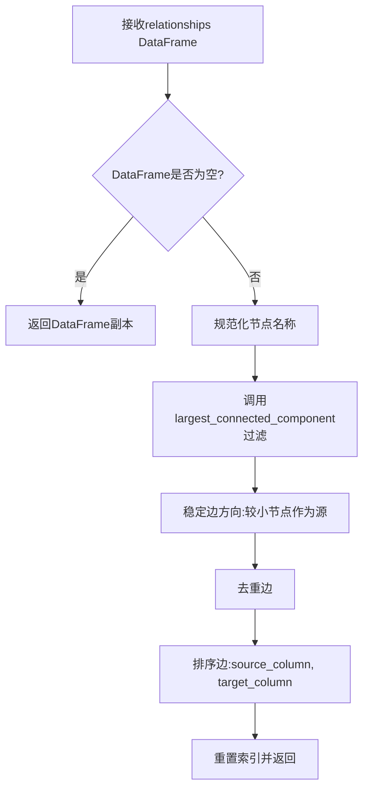
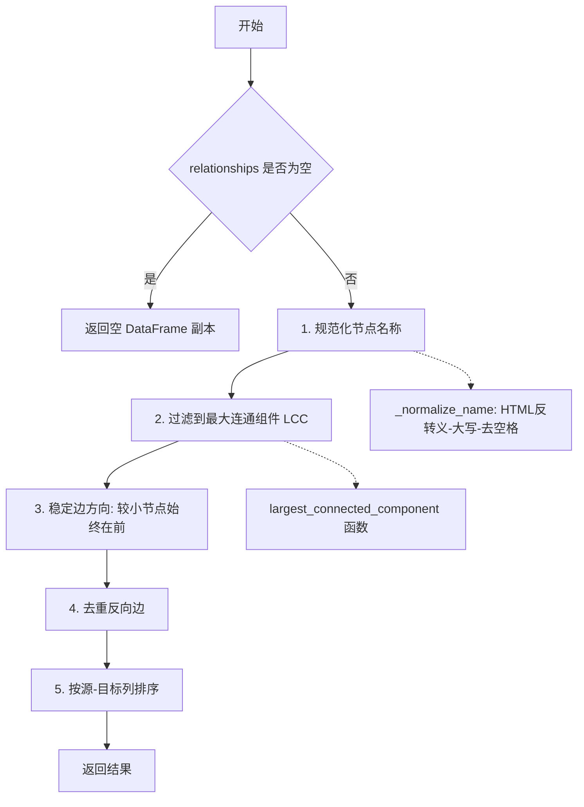
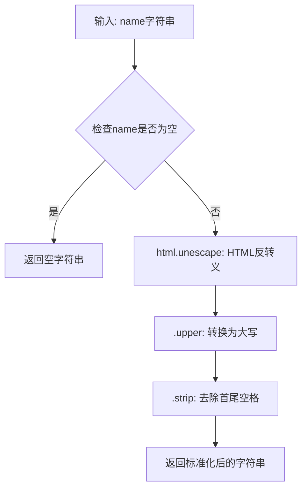

# `graphrag\packages\graphrag\graphrag\graphs\stable_lcc.py` 详细设计文档

该代码实现了一个从关系DataFrame中提取稳定最大连通分量的功能。通过节点名称规范化（HTML转义、大写、去空格）、最大连通分量过滤、边方向稳定化（较小节点始终在前）、去重和排序，确保相同的输入始终产生相同的输出，实现确定性结果。

## 整体流程



## 类结构

```
模块: stable_lcc (独立函数模块)
├── stable_lcc (主函数)
└── _normalize_name (辅助函数)
```

## 全局变量及字段


### `relationships`
    
输入的关系边列表DataFrame，包含source和target列

类型：`pd.DataFrame`
    


### `source_column`
    
源节点列名，默认为'source'

类型：`str`
    


### `target_column`
    
目标节点列名，默认为'target'

类型：`str`
    


### `edges`
    
关系DataFrame的副本，用于规范化节点名称后的边数据

类型：`pd.DataFrame`
    


### `lcc_nodes`
    
最大连通分量中的节点集合

类型：`set`
    


### `swapped`
    
布尔Series，标记需要交换源和目标的边

类型：`pd.Series`
    


### `name`
    
节点名称字符串，用于规范化处理

类型：`str`
    


    

## 全局函数及方法


### `stable_lcc`

该函数接受一个关系边列表的 DataFrame，通过规范化节点名称、过滤最大连通分量、稳定边方向、去重和排序等步骤，返回一个具有确定性输出的稳定最大连通分量。

参数：

- `relationships`：`pd.DataFrame`，包含至少 source 和 target 列的关系边列表
- `source_column`：`str`，默认为 "source"，源节点列名
- `target_column`：`str`，默认为 "target"，目标节点列名

返回值：`pd.DataFrame`，过滤到 LCC 的输入副本，节点名已规范化且边顺序已确定

#### 流程图



#### 带注释源码

```python
def stable_lcc(
    relationships: pd.DataFrame,
    source_column: str = "source",
    target_column: str = "target",
) -> pd.DataFrame:
    """Return the relationships DataFrame filtered to a stable largest connected component.

    Parameters
    ----------
    relationships : pd.DataFrame
        Edge list with at least source and target columns.
    source_column : str
        Name of the source node column.
    target_column : str
        Name of the target node column.

    Returns
    -------
    pd.DataFrame
        A copy of the input filtered to the LCC with normalized node names
        and deterministic edge order.
    """
    # 空 DataFrame 直接返回副本，避免后续处理报错
    if relationships.empty:
        return relationships.copy()

    # ========== 步骤 1: 规范化节点名称 ==========
    # 创建副本避免修改原始数据
    edges = relationships.copy()
    # 对 source 和 target 列的每个节点名进行规范化处理
    edges[source_column] = edges[source_column].apply(_normalize_name)
    edges[target_column] = edges[target_column].apply(_normalize_name)

    # ========== 步骤 2: 过滤到最大连通分量 (LCC) ==========
    # 调用专门的连通分量函数获取 LCC 中的所有节点
    lcc_nodes = largest_connected_component(
        edges, source_column=source_column, target_column=target_column
    )
    # 筛选出两端节点都在 LCC 中的边
    edges = edges[
        edges[source_column].isin(lcc_nodes) & edges[target_column].isin(lcc_nodes)
    ]

    # ========== 步骤 3: 稳定边方向 ==========
    # 确保较小节点名称始终作为 source（保证方向一致性）
    swapped = edges[source_column] > edges[target_column]
    # 交换满足条件的边的 source 和 target
    edges.loc[swapped, [source_column, target_column]] = edges.loc[
        swapped, [target_column, source_column]
    ].to_numpy()

    # ========== 步骤 4: 去重 ==========
    # 移除因方向规范化后产生的重复边
    edges = edges.drop_duplicates(subset=[source_column, target_column])

    # ========== 步骤 5: 排序 ==========
    # 按 source 和 target 列排序，确保输出行顺序确定性
    return edges.sort_values([source_column, target_column]).reset_index(drop=True)


def _normalize_name(name: str) -> str:
    """Normalize a node name: HTML unescape, uppercase, strip whitespace."""
    # 三步规范化: HTML反转义 → 转大写 → 去除首尾空格
    return html.unescape(name).upper().strip()
```


### `_normalize_name`

该函数是图数据处理中的节点名称标准化工具函数，用于将传入的节点名称字符串进行HTML反转义、转换为大写并去除首尾空格，以确保图数据中节点名称的一致性和标准化，便于后续的连通分量计算和边排序处理。

参数：

- `name`：`str`，需要标准化的节点名称

返回值：`str`，标准化处理后的节点名称

#### 流程图



#### 带注释源码

```python
def _normalize_name(name: str) -> str:
    """Normalize a node name: HTML unescape, uppercase, strip whitespace.
    
    该函数执行三步标准化处理：
    1. html.unescape: 将HTML实体（如 &amp; &lt;）反转义为原始字符
    2. .upper: 将字符串转换为大写形式，确保节点名称大小写一致
    3. .strip: 去除字符串首尾的空白字符（包括空格、制表符等）
    
    Parameters
    ----------
    name : str
        需要标准化的原始节点名称
        
    Returns
    -------
    str
        标准化处理后的节点名称
    """
    return html.unescape(name).upper().strip()
```

#### 关键组件信息

| 组件名称 | 描述 |
|---------|------|
| `html` 模块 | Python标准库模块，用于HTML实体反转义操作 |
| `html.unescape()` | 将HTML实体字符转换为对应Unicode字符 |
| `.upper()` | 字符串方法，将所有字符转换为大写 |
| `.strip()` | 字符串方法，去除字符串首尾的空白字符 |

#### 潜在的技术债务或优化空间

1. **空值处理缺失**：当前函数未对`None`或空字符串进行显式处理，可能在传入空值时返回不符合预期的结果
2. **性能优化**：函数采用链式调用方式，对于大量节点名称的处理可以考虑使用列表推导或向量化操作提升性能
3. **错误处理**：缺少对异常输入的捕获机制，如传入非字符串类型时可能抛出异常
4. **可配置性**：标准化规则（是否转大写、是否去除空格）目前是硬编码的，缺乏灵活性配置

#### 其它项目

- **设计目标**：确保图数据中节点名称的一致性，消除因大小写差异、HTML实体编码或多余空格导致的重复节点问题
- **约束条件**：依赖Python标准库`html`模块，输入必须为字符串类型
- **错误处理**：未实现显式错误处理，调用方需确保传入有效字符串
- **数据流**：该函数作为`stable_lcc`函数的辅助函数，在图数据处理流水线中位于数据预处理阶段

## 关键组件


### 节点名称规范化 (Node Name Normalization)

将节点名称进行HTML反转义、转大写、去空格处理，确保节点名称的一致性，便于后续比较和匹配。

### 最大连通分量过滤 (Largest Connected Component Filtering)

调用外部函数获取图中最大连通分量，仅保留属于该分量的节点和边，消除孤立子图。

### 边方向稳定化 (Edge Direction Stabilization)

将每条边的较小节点固定为source节点，确保边的方向一致，消除因数据顺序导致的非确定性。

### 边去重 (Edge Deduplication)

移除因双向存储或数据中反向边导致的重复边，确保每对节点只有一条边记录。

### 确定性排序 (Deterministic Sorting)

按source和target列排序边，确保输出行顺序固定，不受原始数据顺序影响。


## 问题及建议


### 已知问题

-   **DataFrame 复制开销**：多次使用 `relationships.copy()` 和 `edges.copy()`，对大型数据集会造成显著的内存和性能开销
-   **使用 `.apply()` 逐行处理**：对大量行使用 `apply(_normalize_name)` 效率低下，应使用向量化操作如 `str` 访问器
-   **列交换逻辑复杂**：使用 `.loc` 配合 `.to_numpy()` 进行条件交换不够直观，且可能存在潜在的 SettingWithCopyWarning 风险
-   **缺乏输入验证**：未检查 `source_column` 和 `target_column` 是否存在于 DataFrame 中，错误信息不够友好
-   **类型注解不完整**：仅在参数中包含类型提示，缺少返回值类型和内部变量类型注解
-   **空 DataFrame 处理不完整**：虽然检查了空 DataFrame，但未验证必需的列是否存在
-   **去重时机可能过早**：在规范化后立即去重，但若原始数据中存在大小写不同的重复边（如 "A->B" 和 "a->b"），规范化后应能识别为重复，但当前逻辑依赖于规范化后的值

### 优化建议

-   **向量化字符串操作**：将 `edges[source_column].apply(_normalize_name)` 替换为 `edges[source_column].str.upper().str.strip().apply(html.unescape)` 或使用 `map` 方法
-   **减少 DataFrame 复制**：考虑使用链式操作或在必要时仅复制一次
-   **添加输入验证**：在函数开始时验证列名是否存在，提供清晰的错误信息
-   **完善类型注解**：添加返回值类型 `-> pd.DataFrame`，考虑为内部变量添加类型提示
-   **重构列交换逻辑**：使用更清晰的向量操作或辅助函数来交换列值
-   **考虑使用 inplace 操作**：在确认不会影响原始数据的前提下，可适当使用 inplace 参数减少复制

## 其它


### 设计目标与约束

**设计目标**：
- 生成稳定的最大连通分量（Stable Largest Connected Component，LCC），确保相同输入边列表始终产生相同的输出
- 实现确定性的行顺序，消除原始数据顺序对结果的影响

**约束条件**：
- 输入必须是包含source和target列的pandas DataFrame
- 节点名称处理需遵循HTML unescape → uppercase → strip的标准化流程
- 边方向规范化要求较小节点始终作为source（字典序比较）
- 去重基于source和target列的组合

### 错误处理与异常设计

**空输入处理**：当relationships为空DataFrame时，返回空DataFrame的副本

**类型假设**：本函数假设输入数据符合预期格式，不进行显式类型验证。调用方需确保：
- source_column和target_column参数指定的列存在于DataFrame中
- 对应列的值为字符串类型（用于_normalize_name处理）

**异常传播**：若largest_connected_component函数抛出异常，异常将向上传播

### 数据流与状态机

**数据转换流程**：
```
输入DataFrame
    ↓
[规范化节点名称] → 对source_column和target_column列应用_normalize_name
    ↓
[过滤最大连通分量] → 调用largest_connected_component获取LCC节点集
    ↓
[过滤边] → 保留两端节点均在LCC中的边
    ↓
[稳定边方向] → 若source>target，则交换两列值
    ↓
[去重] → 删除重复边
    ↓
[排序] → 按source_column和target_column排序，reset_index
    ↓
输出DataFrame
```

### 外部依赖与接口契约

**外部依赖**：
- `html`（标准库）：用于html.unescape()处理HTML实体
- `pandas`：数据处理核心库
- `graphrag.graphs.connected_components.largest_connected_component`：内部图处理模块

**接口契约**：
- 输入：包含至少source_column和target_column列的pd.DataFrame
- 输出：过滤到LCC的pd.DataFrame，包含规范化后的节点名称和确定性排序的边
- 默认列名：source、target

### 性能考虑与优化空间

**当前实现特点**：
- 使用apply逐行处理节点名称，时间复杂度O(n)
- 使用isin进行集合成员检查
- 使用loc进行条件赋值，利用to_numpy避免SettingWithCopyWarning

**潜在优化方向**：
- 节点名称规范化可考虑向量化操作替代apply
- 对于超大规模图，可考虑并行化处理
- 可添加缓存机制避免重复计算相同输入的LCC

### 边界条件处理

**边界情况**：
- 空DataFrame：直接返回空副本
- 单节点无边：返回包含该节点的DataFrame
- 多连通分量：仅保留最大连通分量
- 自环边：正常处理，规范化后可能去重
- 重复边：第4步去重处理

### 安全性考虑

**输入安全**：
- html.unescape可处理恶意HTML实体
- 数据处理在内存中进行，不涉及外部文件操作


    