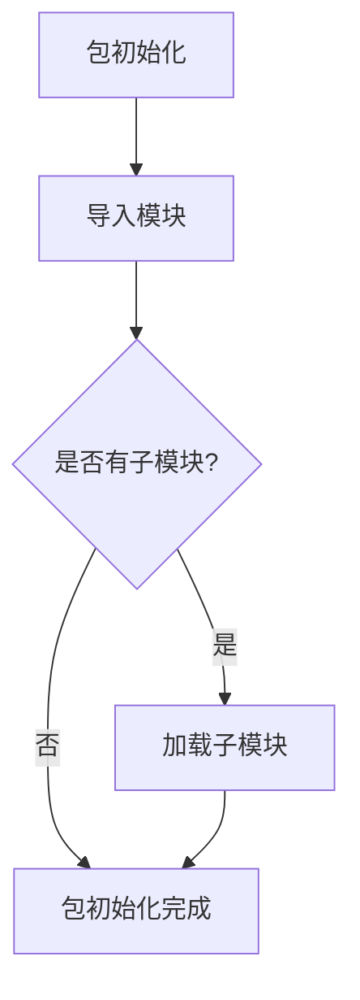

# `graphrag\packages\graphrag\graphrag\index\__init__.py` 详细设计文档

这是微软索引引擎包的根模块，作为包的入口点，目前仅包含版权信息和包级别文档说明，未实现具体功能代码。

## 整体流程



## 类结构

```
无类层次结构 - 空包初始化文件
```

## 全局变量及字段


    

## 全局函数及方法


## 关键组件


该代码是一个来自 Microsoft Corporation 的索引引擎包的根模块，仅包含版权声明和包级别的文档字符串，用于标识该包作为索引引擎的入口点。

文件整体运行流程

该文件作为包的初始化文件，在导入时会首先执行版权注释（无实际运行时作用），然后加载包级别的文档字符串，供其他模块通过 import 语句导入时获取包的描述信息。由于代码仅包含文档字符串，不涉及任何实际业务逻辑的执行流程。

类的详细信息

无类定义。

全局变量和全局函数

无全局变量或全局函数定义。

关键组件信息

由于该文件仅为包初始化文件，未包含具体实现细节，无法从此代码中识别张量索引与惰性加载、反量化支持、量化策略等关键组件。这些功能的具体实现可能位于该包的子模块中。

潜在的技术债务或优化空间

当前包初始化文件仅包含文档字符串，缺少实际的模块导出定义（如 __all__ 列表）、包级别的配置、常量定义或子模块的导入语句。建议根据实际需求补充包的组织结构定义，明确导出接口，以提升包的可维护性和使用便利性。

其它项目

由于代码内容有限，无法提供完整的设计目标与约束、错误处理与异常设计、数据流与状态机、外部依赖与接口契约等详细信息。建议查看该包的子模块以获取完整的设计文档内容。


## 问题及建议


### 已知问题

-   **空包定义**：该文件仅为包根目录的占位符，未导出任何公共API或功能模块，用户无法通过该包获取任何功能
-   **缺少版本信息**：未定义 `__version__` 变量，无法方便地获取包版本信息
-   **未定义公共接口**：未使用 `__all__` 明确导出模块的公共接口，不符合Python包的最佳实践
-   **文档不完整**：仅有一句话的包级文档字符串，缺少详细的使用说明、依赖项、配置选项等必要信息
-   **缺少子模块导入**：未导入任何子模块，用户无法通过 `from indexing_engine import xxx` 方式使用包内功能
-   **元数据缺失**：缺少 `__author__`、`__license__`、`__description__` 等标准包元数据

### 优化建议

-   **添加版本管理**：在包初始化时定义 `__version__ = "1.0.0"` 或从版本配置文件读取
-   **定义公共API**：使用 `__all__ = [...]` 明确列出导出的类和函数，提高模块的封装性和可维护性
-   **完善文档字符串**：扩展为包含安装说明、使用示例、依赖项等信息的详细文档
-   **模块导入组织**：根据功能模块化导入常用子模块，提供统一的入口点
-   **添加元数据**：补充 `__author__`、`__description__`、`__homepage__` 等标准元数据
-   **考虑Lazy Loading**：如包较大，可采用延迟导入策略优化启动性能
-   **添加类型注解支持**：如项目使用类型 hints，确保包结构支持类型检查工具


## 其它


### 项目背景与目的

该代码为Microsoft Corporation的indexing engine包的根目录初始化文件，主要用于标识该目录为Python包，目前不包含实际功能逻辑，仅声明版权信息和MIT许可证。

### 设计目标与约束

由于代码仅为包初始化文件，设计目标为保持包结构的清晰性和可扩展性，为后续功能模块的添加预留接口。约束方面需遵循MIT开源许可证协议。

### 文件结构与组织

当前文件位于indexing_engine包的根目录，属于包的入口点文件，未来可在该文件中导出公共API、配置默认参数或初始化核心组件。

### 外部依赖与接口契约

当前文件无外部依赖，也未定义任何公开接口契约。未来版本可能通过__all__变量定义公共导出接口。

### 错误处理与异常设计

当前文件不涉及错误处理逻辑，未来添加功能时需遵循项目统一的异常处理规范。

### 数据流与状态机

当前文件无数据流处理需求，属于静态包定义文件。

### 版本与兼容性

当前版本为初始版本，许可证为MIT License，需保持与Python 3.x版本的兼容性。

### 潜在技术债务与优化空间

当前文件缺少模块文档字符串（docstring），建议添加包级别的文档说明。同时可考虑添加__version__变量以支持版本查询。

### 安全考虑

当前代码无安全风险，建议未来在添加功能时注意输入验证和权限控制。

### 测试策略

由于当前文件功能简单，无需单元测试，但建议在包级别添加__init__.py的导入测试以验证包结构完整性。

### 性能考量

当前文件对性能无影响，未来添加功能时需注意避免不必要的导入操作以保持包的加载性能。

### 配置与扩展性

当前文件未涉及配置管理，未来可考虑在该文件中定义默认配置或配置加载逻辑，以支持不同的使用场景。

    