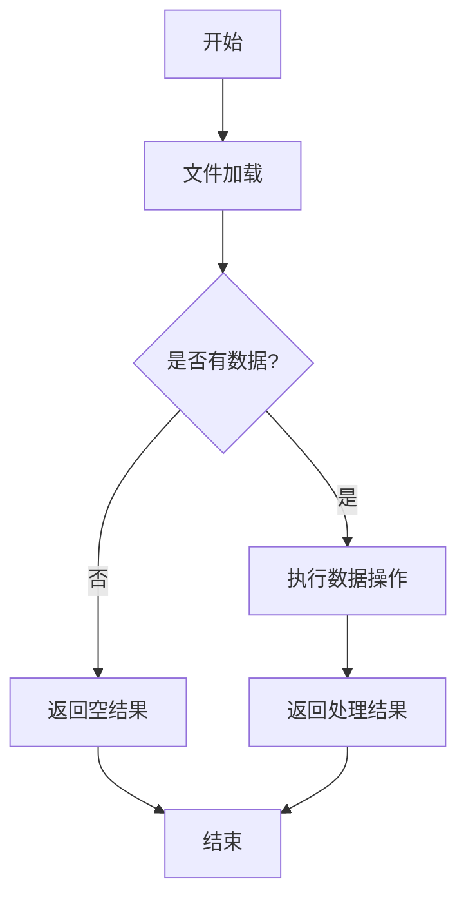

# `graphrag\packages\graphrag\graphrag\index\operations\__init__.py` 详细设计文档

该代码文件是一个用于可复用数据框操作（DataFrame Operations）的工具模块，期望提供常见的数据处理功能封装，但当前仅包含文件头部注释和模块说明文档，尚未实现具体功能。

## 整体流程



## 类结构

```
当前代码未定义任何类或继承结构
```

## 全局变量及字段


    

## 全局函数及方法


## 关键组件


# 代码详细设计文档

## 一段话描述

该代码模块是一个微软认证的MIT许可开源项目，暂仅定义了模块文档字符串"Reusable data frame operations"（可重用的数据框操作），尚未实现任何具体功能。

## 文件的整体运行流程

由于代码仅包含版权声明和模块文档字符串，无任何可执行代码，因此不存在实际运行流程。

## 类和全局变量/函数详细信息

由于代码中未定义任何类、全局变量或全局函数，此部分不适用。

## 关键组件信息

### 模块级文档字符串

模块级别定义的文档字符串，声明该模块用于提供可重用的数据框操作功能。

## 潜在的技术债务或优化空间

1. **功能缺失**：模块仅定义了版权和文档字符串，核心功能完全未实现
2. **设计目标不明确**：需要明确具体的数据框操作类型（如合并、转换、过滤等）
3. **接口契约缺失**：尚未定义任何公开API接口

## 其它项目

### 设计目标与约束

- 约束：需遵循MIT开源许可
- 目标：提供可重用的数据框操作工具

### 错误处理与异常设计

由于无实际代码，错误处理机制未定义

### 数据流与状态机

由于无实际代码，数据流和状态机未定义

### 外部依赖与接口契约

由于无实际代码，外部依赖和接口契约未定义


## 问题及建议


### 已知问题

-   **代码缺失**：整个文件只包含版权声明和模块文档字符串，没有任何实际的代码实现，这是一个严重的问题。
-   **文档与实现不匹配**：文档字符串声明为"Reusable data frame operations"（可重用的数据框操作），但未提供任何实际功能。
-   **无法满足设计目标**：由于没有代码，无法实现任何设计目标。

### 优化建议

-   **补充核心功能实现**：根据模块文档描述，实现可重用的数据框操作功能，例如数据清洗、转换、聚合等常见操作。
-   **定义清晰的 API 接口**：设计并实现标准化的函数接口，确保功能的可复用性和可测试性。
-   **添加错误处理机制**：为所有数据框操作添加适当的异常处理和数据验证。
-   **完善类型注解**：为所有函数和变量添加完整的类型注解，提高代码可维护性。
-   **编写单元测试**：为已实现的功能编写测试用例，确保代码质量。
-   **补充文档注释**：为每个函数和类添加详细的文档字符串，说明参数、返回值和使用示例。


## 其它


### 设计目标与约束

本模块旨在提供可重用的数据框（DataFrame）操作功能，支持常见的数据处理任务，如数据清洗、转换、聚合等。设计约束包括：1）保持接口简洁直观；2）兼容主流数据处理库（如pandas、polars）；3）确保操作的时间空间复杂度可控；4）支持流式处理大数据集。

### 错误处理与异常设计

模块应定义自定义异常类（如DataFrameOperationError）用于捕获操作失败场景。方法应进行输入验证，对None值、非DataFrame类型、列名不存在等情况抛出明确的ValueError或KeyError。建议使用try-except包装关键操作，并提供有意义的错误信息帮助调试。

### 外部依赖与接口契约

本模块依赖pandas或polars等数据处理库。应明确声明依赖版本要求（如pandas>=1.3.0）。公开API应保持稳定性，参数类型和返回值应类型注解清晰。建议使用抽象基类或协议（Protocol）定义通用数据框接口，以支持多库适配。

### 性能考虑

对于大数据集，应考虑：1）向量化操作替代循环；2）使用原地操作（inplace=True）减少内存拷贝；3）提供分块处理接口；4）必要时使用numba或cython加速关键路径。建议添加性能基准测试。

### 安全性考虑

输入数据应进行校验，防止注入攻击。避免使用eval或exec处理用户输入。对敏感数据操作应有审计日志。文件读写操作应验证路径安全性。

### 可测试性设计

每个公开方法应有对应单元测试。使用pytest框架，测试数据应覆盖正常场景、边界情况和异常情况。建议使用pytest parametrize减少重复代码。集成测试应验证与外部库的兼容性。

### 版本兼容性策略

应明确支持的Python版本（如3.8+）。依赖库版本应设置合理的兼容范围。使用__version__变量记录模块版本。重大变更应在CHANGELOG中记录并可能通过版本号体现。

### 配置与扩展性

提供全局配置对象或参数化的函数接口。支持自定义列处理器、转换函数等插件式扩展。配置应可通过环境变量或配置文件覆盖。

### 文档与注释规范

所有公开API应有Google风格或NumPy风格的docstring。复杂算法应有注释说明。示例代码应包含在docstring中。README.md应提供快速入门指南。

### 数据流与状态机

本模块作为工具库，数据流主要是输入DataFrame经过一系列变换输出处理后的DataFrame。无复杂状态机设计，但操作链应支持函数式组合（如pipe方法）。

### 潜在技术债务与优化空间

由于当前仅包含文档字符串，暂无实现代码。主要技术债务包括：1）完全空实现需要开发；2）接口设计需根据实际使用场景细化；3）性能优化需在实际使用中评估。优化方向包括：添加类型提示完善、单元测试覆盖、基准性能测试等。

    