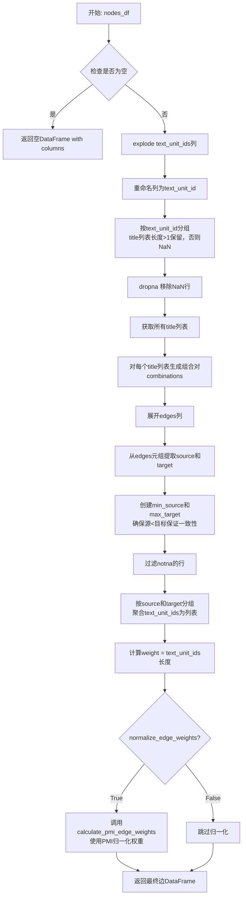
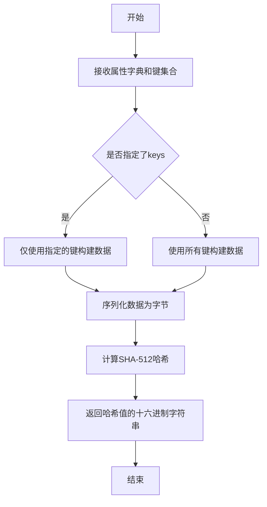
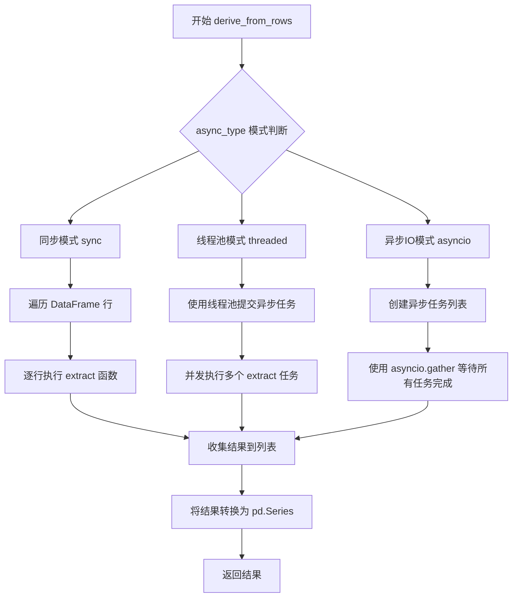

# `graphrag\packages\graphrag\graphrag\index\operations\build_noun_graph\build_noun_graph.py` 详细设计文档

该文件实现了一个名词图（noun graph）构建模块，用于从文本单元数据框中提取名词短语作为图节点，并根据名词短语在同一文本单元中的共现关系构建边，支持可选的PMI（点互信息）权重规范化，可通过缓存机制提升性能。

## 整体流程

```mermaid
graph TD
    A[开始 build_noun_graph] --> B[提取text_unit_df的id和text列]
B --> C[调用 _extract_nodes 提取节点]
C --> D{缓存中是否存在?}
D -- 是 --> E[从缓存获取名词短语结果]
D -- 否 --> F[使用text_analyzer.extract提取名词短语]
F --> G[将结果存入缓存]
E --> G
G --> H[爆炸noun_phrases生成节点行]
H --> I[按title分组计算frequency和text_unit_ids]
I --> J[调用 _extract_edges 提取边]
J --> K[爆炸text_unit_ids并按text_unit_id分组]
K --> L[生成同一文本中名词的所有组合边]
L --> M[规范化source和target顺序]
M --> N{normalize_edge_weights?}
N -- 是 --> O[调用calculate_pmi_edge_weights计算PMI权重]
N -- 否 --> P[使用原始共现频率作为权重]
O --> Q[返回 (nodes_df, edges_df)]
P --> Q
```

## 类结构

```
无类定义（纯函数模块）
```

## 全局变量及字段


### `text_unit_df`
    
DataFrame containing text units with schema [id, text, document_id]

类型：`pd.DataFrame`
    


### `text_analyzer`
    
Analyzer instance for extracting noun phrases from text

类型：`BaseNounPhraseExtractor`
    


### `normalize_edge_weights`
    
Flag to control whether to normalize edge weights using PMI calculation

类型：`bool`
    


### `num_threads`
    
Number of threads for parallel processing

类型：`int`
    


### `async_mode`
    
Async execution mode type for parallel operations

类型：`AsyncType`
    


### `cache`
    
Cache instance for storing and retrieving extracted noun phrases

类型：`Cache`
    


### `nodes_df`
    
DataFrame with schema [title, frequency, text_unit_ids] representing graph nodes

类型：`pd.DataFrame`
    


### `edges_df`
    
DataFrame with schema [source, target, weight, text_unit_ids] representing graph edges

类型：`pd.DataFrame`
    


### `text_units`
    
DataFrame containing only id and text columns from text_unit_df

类型：`pd.DataFrame`
    


### `noun_node_df`
    
DataFrame with exploded noun phrases and renamed columns

类型：`pd.DataFrame`
    


### `grouped_node_df`
    
DataFrame grouped by noun phrase title with aggregated text unit IDs and frequency

类型：`pd.DataFrame`
    


### `text_units_df`
    
DataFrame containing titles grouped by text unit ID for edge extraction

类型：`pd.DataFrame`
    


### `titles`
    
List of title lists extracted from text units for edge combination generation

类型：`list`
    


### `all_edges`
    
List of all possible edge combinations generated from titles using itertools.combinations

类型：`list[list[tuple[str, str]]]`
    


### `edge_df`
    
DataFrame with individual edges and their corresponding text unit IDs

类型：`pd.DataFrame`
    


### `grouped_edge_df`
    
DataFrame grouped by source and target with aggregated text unit IDs and weights

类型：`pd.DataFrame`
    


### `key`
    
SHA512 hash key generated from text and analyzer attributes for cache lookup

类型：`str`
    


### `result`
    
Extracted noun phrases from text analyzer or cached result

类型：`Any`
    


### `text`
    
Text content extracted from a DataFrame row

类型：`str`
    


### `attrs`
    
Dictionary containing text and analyzer string for cache key generation

类型：`dict`
    


    

## 全局函数及方法


### `build_noun_graph`

该函数是名词图（noun graph）构建的核心入口，接收文本单元数据框和名词短语提取器，通过异步方式从文本中提取名词短语作为节点，并根据它们在同一文本单元中的共现关系构建边，最终返回包含节点信息（标题、频率、文本单元ID列表）和边信息（源、目标、权重、文本单元ID列表）的两个数据框。

参数：

- `text_unit_df`：`pd.DataFrame`，输入的文本单元数据框，包含 id 和 text 列
- `text_analyzer`：`BaseNounPhraseExtractor`，名词短语提取器实例，用于从文本中提取名词短语
- `normalize_edge_weights`：`bool`，是否规范化边权重，启用时使用 PMI（点互信息）权重
- `num_threads`：`int`，并行处理的线程数
- `async_mode`：`AsyncType`，异步执行模式（如 asyncio 或 sync）
- `cache`：`Cache`，缓存实例，用于存储已提取的名词短语以避免重复计算

返回值：`tuple[pd.DataFrame, pd.DataFrame]`，返回节点数据框和边数据框的元组

#### 流程图

```mermaid
flowchart TD
    A[开始 build_noun_graph] --> B[提取 text_units = text_unit_df.loc[:, ['id', 'text']]]
    B --> C[异步调用 _extract_nodes 提取节点]
    C --> D[调用 _extract_edges 提取边]
    D --> E[返回 (nodes_df, edges_df) 元组]
    
    C --> C1[创建 cache child: extract_noun_phrases]
    C1 --> C2[对每行异步执行 extract 函数]
    C2 --> C3[检查缓存 key 是否存在]
    C3 --> C4{缓存命中?}
    C4 -- 是 --> C5[返回缓存结果]
    C4 -- 否 --> C6[调用 text_analyzer.extract 提取名词短语]
    C6 --> C7[存入缓存]
    C7 --> C5
    C5 --> C8[explode 名词短语列并重命名]
    C8 --> C9[按 title 分组统计频率和 text_unit_ids]
    C9 --> C10[返回节点数据框]
    
    D --> D1{节点数据框是否为空?}
    D1 -- 是 --> D2[返回空边数据框]
    D1 -- 否 --> D3[explode text_unit_ids]
    D3 --> D4[按 text_unit_id 分组, 生成标题列表]
    D4 --> D5[对每个标题列表生成组合边]
    D5 --> D6[展开边并提取 source/target]
    D6 --> D7[按 source/target 分组统计权重]
    D7 --> D8{normalize_edge_weights?}
    D8 -- 是 --> D9[调用 calculate_pmi_edge_weights 规范化权重]
    D8 -- 否 --> D10[直接使用原始权重]
    D9 --> D11[返回边数据框]
    D10 --> D11
```

#### 带注释源码

```python
async def build_noun_graph(
    text_unit_df: pd.DataFrame,
    text_analyzer: BaseNounPhraseExtractor,
    normalize_edge_weights: bool,
    num_threads: int,
    async_mode: AsyncType,
    cache: Cache,
) -> tuple[pd.DataFrame, pd.DataFrame]:
    """Build a noun graph from text units."""
    # 从输入数据框中提取 id 和 text 列，组成文本单元数据框
    text_units = text_unit_df.loc[:, ["id", "text"]]
    
    # 异步提取节点：使用文本分析器从每个文本单元中提取名词短语
    # 返回包含 title, frequency, text_unit_ids 的节点数据框
    nodes_df = await _extract_nodes(
        text_units,
        text_analyzer,
        num_threads=num_threads,
        async_mode=async_mode,
        cache=cache,
    )
    
    # 提取边：根据同一文本单元中名词的共现关系构建边
    # 可选地使用 PMI 算法规范化边权重
    edges_df = _extract_edges(nodes_df, normalize_edge_weights=normalize_edge_weights)
    
    # 返回节点和边数据框的元组
    return (nodes_df, edges_df)
```


### `_extract_nodes`

该函数用于从文本单元（text units）中提取名词短语作为图的初始节点，并统计每个名词短语的频率以及其出现的文本单元 ID 列表。它使用缓存机制避免重复提取，并通过异步方式提高处理效率。

参数：

-  `text_unit_df`：`pd.DataFrame`，输入的文本单元数据框， schema 为 `[id, text, document_id]`
-  `text_analyzer`：`BaseNounPhraseExtractor`，名词短语提取器，用于从文本中提取名词短语
-  `num_threads`：`int`，并发处理的线程数
-  `async_mode`：`AsyncType`，异步模式类型（如 Asyncio、Thread 等）
-  `cache`：`Cache`，缓存实例，用于存储和检索已提取的名词短语结果

返回值：`pd.DataFrame`，包含提取出的名词短语节点数据框， schema 为 `[title, frequency, text_unit_ids]`

#### 流程图

```mermaid
flowchart TD
    A[开始 _extract_nodes] --> B[创建子缓存 extract_noun_phrases]
    B --> C[定义异步提取函数 extract]
    C --> D[遍历 text_unit_df 每一行]
    D --> E[生成缓存 Key SHA512]
    E --> F{缓存中是否存在结果?}
    F -->|是| G[从缓存获取结果]
    F -->|否| H[调用 text_analyzer.extract 提取名词短语]
    H --> I[将结果存入缓存]
    I --> G
    G --> J[derive_from_rows 异步提取所有名词短语]
    J --> K[explode noun_phrases 列]
    K --> L[重命名列: noun_phrases -> title, id -> text_unit_id]
    L --> M[按 title 分组, 聚合 text_unit_id 为列表]
    M --> N[计算 frequency = len(text_unit_ids)]
    N --> O[选择并排列列: title, frequency, text_unit_ids]
    O --> P[返回节点 DataFrame]
```

#### 带注释源码

```python
async def _extract_nodes(
    text_unit_df: pd.DataFrame,
    text_analyzer: BaseNounPhraseExtractor,
    num_threads: int,
    async_mode: AsyncType,
    cache: Cache,
) -> pd.DataFrame:
    """
    Extract initial nodes and edges from text units.

    Input: text unit df with schema [id, text, document_id]
    Returns a dataframe with schema [id, title, frequency, text_unit_ids].
    """
    # 创建子缓存，用于存储名词短语提取结果，避免重复计算
    cache = cache.child("extract_noun_phrases")

    # 定义异步提取函数，用于从单行文本中提取名词短语
    async def extract(row):
        text = row["text"]
        # 构建缓存键：结合文本内容和提取器类型
        attrs = {"text": text, "analyzer": str(text_analyzer)}
        key = gen_sha512_hash(attrs, attrs.keys())
        # 尝试从缓存获取结果
        result = await cache.get(key)
        if not result:
            # 缓存未命中，调用提取器提取名词短语
            result = text_analyzer.extract(text)
            # 将结果存入缓存
            await cache.set(key, result)
        return result

    # 使用 derive_from_rows 异步批量提取所有文本单元的名词短语
    # 添加 noun_phrases 列存储提取结果
    text_unit_df["noun_phrases"] = await derive_from_rows(  # type: ignore
        text_unit_df,
        extract,
        num_threads=num_threads,
        async_type=async_mode,
        progress_msg="extract noun phrases progress: ",
    )

    # 将 noun_phrases 列展开（每个名词短语一行）
    noun_node_df = text_unit_df.explode("noun_phrases")
    # 重命名列：noun_phrases -> title（节点标题）, id -> text_unit_id
    noun_node_df = noun_node_df.rename(
        columns={"noun_phrases": "title", "id": "text_unit_id"}
    )

    # 按 title 分组，将出现在同一文本单元的名词短语聚合
    # 同时统计每个 title（名词短语）出现的文本单元数量
    grouped_node_df = (
        noun_node_df.groupby("title").agg({"text_unit_id": list}).reset_index()
    )
    # 重命名列：text_unit_id -> text_unit_ids
    grouped_node_df = grouped_node_df.rename(columns={"text_unit_id": "text_unit_ids"})
    # 计算频率：每个名词短语出现的文本单元数量
    grouped_node_df["frequency"] = grouped_node_df["text_unit_ids"].apply(len)
    # 选择并排列列顺序
    grouped_node_df = grouped_node_df[["title", "frequency", "text_unit_ids"]]
    # 返回最终节点 DataFrame，确保列顺序为 [title, frequency, text_unit_ids]
    return grouped_node_df.loc[:, ["title", "frequency", "text_unit_ids"]]
```


### `_extract_edges`

从节点数据框中提取边关系。函数遍历同一文本单元中出现的所有节点对，通过组合（combinations）生成边，并按源节点和目标节点分组聚合，统计共现文本单元数量作为边权重。可选地使用PMI（点互信息）算法对边权重进行归一化处理。

参数：

- `nodes_df`：`pd.DataFrame`，输入的节点数据框，包含列`[id, title, frequency, text_unit_ids]`
- `normalize_edge_weights`：`bool`，可选参数，默认为`True`，是否使用PMI算法归一化边权重

返回值：`pd.DataFrame`，返回边数据框，包含列`[source, target, weight, text_unit_ids]`

#### 流程图



#### 带注释源码

```python
def _extract_edges(
    nodes_df: pd.DataFrame,
    normalize_edge_weights: bool = True,
) -> pd.DataFrame:
    """
    Extract edges from nodes.

    Nodes appear in the same text unit are connected.
    Input: nodes_df with schema [id, title, frequency, text_unit_ids]
    Returns: edges_df with schema [source, target, weight, text_unit_ids]
    """
    # 边界处理：若节点数据为空，直接返回带列名的空DataFrame
    if nodes_df.empty:
        return pd.DataFrame(columns=["source", "target", "weight", "text_unit_ids"])

    # 步骤1：将text_unit_ids列展开，每个文本单元ID对应一行
    # 原节点可能关联多个文本单元，需要展开以便后续按文本单元处理
    text_units_df = nodes_df.explode("text_unit_ids")
    
    # 步骤2：重命名列，将text_unit_ids改为text_unit_id便于处理
    text_units_df = text_units_df.rename(columns={"text_unit_ids": "text_unit_id"})
    
    # 步骤3：按text_unit_id分组，聚合title
    # 若同一文本单元中只有一个节点（len(x)<=1），则设为NaN后续过滤
    # 这样可以排除单个节点无法形成边的情况
    text_units_df = (
        text_units_df
        .groupby("text_unit_id")
        .agg({"title": lambda x: list(x) if len(x) > 1 else np.nan})
        .reset_index()
    )
    
    # 步骤4：删除NaN行，只保留包含多个节点的文本单元
    text_units_df = text_units_df.dropna()
    
    # 步骤5：获取所有文本单元中的节点标题列表
    titles = text_units_df["title"].tolist()
    
    # 步骤6：对每个文本单元中的节点列表生成所有可能的边组合
    # 使用combinations生成无序对(A,B)，避免重复(如A-B和B-A)
    all_edges: list[list[tuple[str, str]]] = [list(combinations(t, 2)) for t in titles]

    # 步骤7：将生成的边列表赋值回DataFrame
    text_units_df = text_units_df.assign(edges=all_edges)  # type: ignore
    
    # 步骤8：展开edges列，每条边单独一行
    edge_df = text_units_df.explode("edges")[["edges", "text_unit_id"]]

    # 步骤9：从边元组(源, 目标)中提取source和target列
    edge_df[["source", "target"]] = edge_df.loc[:, "edges"].to_list()
    
    # 步骤10：创建min_source和max_target列
    # 确保边的方向一致性：总是让source小于target
    # 这样可以避免重复边(如A->B和B->A被视为同一条边)
    edge_df["min_source"] = edge_df[["source", "target"]].min(axis=1)
    edge_df["max_target"] = edge_df[["source", "target"]].max(axis=1)
    
    # 步骤11：删除原source/target列，重命名为统一名称
    edge_df = edge_df.drop(columns=["source", "target"]).rename(
        columns={"min_source": "source", "max_target": "target"}  # type: ignore
    )

    # 步骤12：过滤掉任何包含空值的行
    edge_df = edge_df[(edge_df.source.notna()) & (edge_df.target.notna())]
    
    # 步骤13：删除不再需要的edges列
    edge_df = edge_df.drop(columns=["edges"])
    
    # 步骤14：按source和target分组，聚合text_unit_id为列表
    # 统计每条边关联的所有文本单元
    grouped_edge_df = (
        edge_df.groupby(["source", "target"]).agg({"text_unit_id": list}).reset_index()
    )
    grouped_edge_df = grouped_edge_df.rename(columns={"text_unit_id": "text_unit_ids"})
    
    # 步骤15：计算weight，即该边在多少个文本单元中出现过
    grouped_edge_df["weight"] = grouped_edge_df["text_unit_ids"].apply(len)
    
    # 步骤16：按指定顺序排列列
    grouped_edge_df = grouped_edge_df.loc[
        :, ["source", "target", "weight", "text_unit_ids"]
    ]
    
    # 步骤17：可选的边权重归一化
    # 使用PMI (Pointwise Mutual Information) 算法计算边的权重
    # PMI可以减少高频节点对边权重的影响，更准确地反映节点间的真实关联
    if normalize_edge_weights:
        # use PMI weight instead of raw weight
        grouped_edge_df = calculate_pmi_edge_weights(nodes_df, grouped_edge_df)

    # 返回最终的边DataFrame
    return grouped_edge_df
```


### `gen_sha512_hash`

生成给定属性的 SHA-512 哈希值，用于缓存键的生成。该函数接受一个属性字典和可选的键集合，返回一个基于指定属性和键的 SHA-512 哈希字符串。

参数：

- `attrs`：`Dict[str, Any]`，包含要哈希的属性的字典
- `keys`：`Iterable[str]`，可选的键集合，指定哪些字典键参与哈希计算

返回值：`str`，基于指定属性和键生成的 SHA-512 哈希值

#### 流程图



#### 带注释源码

```python
# 该函数定义在 graphrag/index/utils/hashing.py 中
# 以下是基于代码调用方式的推断实现

def gen_sha512_hash(attrs: dict, keys: Iterable[str]) -> str:
    """
    生成给定属性的SHA-512哈希值。
    
    参数:
        attrs: 包含要哈希的属性的字典
        keys: 指定哪些字典键参与哈希计算的可迭代对象
    
    返回:
        SHA-512哈希值的十六进制字符串
    """
    import hashlib
    import json
    
    # 如果指定了keys，则只使用指定的键构建数据
    # 否则使用所有键
    if keys is not None:
        # 使用字典推导式筛选指定的键
        filtered_attrs = {k: attrs[k] for k in keys if k in attrs}
    else:
        filtered_attrs = attrs
    
    # 将字典序列化为JSON字符串（确保一致的排序）
    data = json.dumps(filtered_attrs, sort_keys=True, ensure_ascii=False)
    
    # 计算SHA-512哈希
    hash_obj = hashlib.sha512(data.encode('utf-8'))
    
    # 返回十六进制字符串形式的哈希值
    return hash_obj.hexdigest()
```

#### 使用示例

在代码中的实际使用方式：

```python
# 在 _extract_nodes 函数的异步提取逻辑中使用
attrs = {"text": text, "analyzer": str(text_analyzer)}
key = gen_sha512_hash(attrs, attrs.keys())  # 生成缓存键
result = await cache.get(key)  # 尝试从缓存获取
```


### `calculate_pmi_edge_weights`

该函数用于计算图中边的PMI（Pointwise Mutual Information，点互信息）权重，以替代简单的原始共现频率权重。PMI是一种衡量两个词之间关联强度的统计指标，能够更好地捕捉词对之间的语义关系。

参数：

-  `nodes_df`：`pd.DataFrame`，节点数据框，包含图的节点信息（如节点标题、频率、所属文本单元ID等）
-  `edges_df`：`pd.DataFrame`，边数据框，包含源节点、目标节点、权重和文本单元ID等信息

返回值：`pd.DataFrame`，返回更新权重后的边数据框，其中权重被替换为PMI值

#### 流程图

```mermaid
flowchart TD
    A[开始] --> B[接收nodes_df和edges_df]
    B --> C[计算每个节点的频率和共现频率]
    C --> D[使用PMI公式计算边权重]
    D --> E[PMI = log₂ P(x,y) / P(x)P(y)]
    E --> F[用PMI权重替换原始权重]
    F --> G[返回更新后的edges_df]
```

#### 带注释源码

```python
# 注意：以下为基于代码上下文的推断源码
# 实际实现在 graphrag.graphs.edge_weights 模块中，此处未展示

async def calculate_pmi_edge_weights(
    nodes_df: pd.DataFrame,
    edges_df: pd.DataFrame
) -> pd.DataFrame:
    """
    使用PMI（点互信息）计算边权重。
    
    PMI公式：PMI(x,y) = log(P(x,y) / (P(x) * P(y)))
    其中 P(x) 是节点x出现的概率，P(x,y)是x和y共现的概率
    
    参数:
        nodes_df: 节点数据框，需包含frequency列
        edges_df: 边数据框，需包含source, target, weight, text_unit_ids列
        
    返回:
        用PMI权重替换原始权重的边数据框
    """
    # 此为占位注释，实际实现需要从graphrag.graphs.edge_weights模块导入
    pass
```

> **注意**：该函数在代码中仅被导入（`from graphrag.graphs.edge_weights import calculate_pmi_edge_weights`）并调用，实际实现位于 `graphrag.graphs.edge_weights` 模块中，在当前提供的代码片段中不可见。上述源码是基于其使用方式和PMI算法原理的推断。


### `derive_from_rows`

该函数是一个通用的行处理工具函数，用于在 DataFrame 的每一行上执行异步提取操作，并支持多线程和多种异步模式（sync/threaded/asyncio）。它常用于对大规模数据执行批量异步处理，并可通过缓存避免重复计算。

参数：

- `df`：`pd.DataFrame`，输入的 DataFrame，包含需要处理的行数据
- `extract`：一个异步函数（callable），对每一行执行提取操作的异步函数
- `num_threads`：`int`，线程数量，用于控制并发处理的数量
- `async_type`：`AsyncType`，异步类型，枚举值（sync/threaded/asyncio），决定使用哪种异步执行模式
- `progress_msg`：`str`（可选），进度消息前缀，用于显示处理进度

返回值：`pd.Series` 或 `pd.DataFrame`，返回与输入 DataFrame 行数对应的结果序列，每个元素是 `extract` 函数对对应行的处理结果

#### 流程图



#### 带注释源码

```
# 由于 derive_from_rows 函数定义在 graphrag/index/utils/derive_from_rows.py 模块中
# 而该模块代码未在当前代码片段中提供，以下为基于使用方式的推测实现

async def derive_from_rows(
    df: pd.DataFrame,
    extract: Callable,
    num_threads: int = 1,
    async_type: AsyncType = AsyncType.Sync,
    progress_msg: str = ""
) -> pd.Series:
    """
    在 DataFrame 的每一行上执行异步提取操作
    
    参数:
        df: 输入的 DataFrame
        extract: 异步提取函数，接受一行数据，返回提取结果
        num_threads: 线程池大小
        async_type: 异步执行模式
        progress_msg: 进度消息前缀
    
    返回:
        pd.Series: 与输入 DataFrame 行数对应的结果
    """
    results = []
    
    if async_type == AsyncType.Sync:
        # 同步模式：逐行执行
        for idx, row in df.iterrows():
            result = await extract(row)
            results.append(result)
            
    elif async_type == AsyncType.Threaded:
        # 线程池模式：使用线程池并发执行
        import concurrent.futures
        loop = asyncio.get_event_loop()
        with concurrent.futures.ThreadPoolExecutor(max_workers=num_threads) as executor:
            futures = [
                loop.run_in_executor(executor, lambda r: await extract(r), row)
                for row in df.itertuples(index=False)
            ]
            results = await asyncio.gather(*futures)
            
    elif async_type == AsyncType.AsyncIO:
        # 纯异步IO模式：并发执行所有任务
        tasks = [extract(row) for row in df.itertuples(index=False)]
        results = await asyncio.gather(*tasks)
    
    return pd.Series(results, index=df.index)
```

---

> **注意**：由于 `derive_from_rows` 函数的完整源码未在提供的代码片段中出现，以上内容基于函数调用方式的合理推测。如需获取精确实现细节，请查阅 `graphrag/index/utils/derive_from_rows.py` 源文件。

## 关键组件


### 名词短语提取器

负责从文本单元中提取名词短语，是图构建的源头组件。通过集成BaseNounPhraseExtractor实现具体的NLP提取逻辑，支持不同的文本分析策略。

### 节点构建模块

将提取的名词短语转换为图节点，包含节点频率统计和文本单元ID映射。实现上通过pandas的groupby和聚合操作完成，frequency字段反映名词短语在整个语料中的出现频次。

### 边提取与共现关系计算

基于同一文本单元内的名词共现关系构建边。使用combinations生成节点对，通过text_unit_id分组确保只有同一文本单元内的节点才会形成边。包含去重逻辑（min_source/max_target）避免重复边。

### PMI权重归一化

可选的边权重计算策略，使用Pointwise Mutual Information替代原始共现计数。调用calculate_pmi_edge_weights模块，能够更好地捕捉节点间的语义关联强度。

### 缓存机制与SHA512哈希

通过Cache.child创建子缓存命名空间，使用gen_sha512_hash生成缓存键。缓存键由文本内容和分析器类型决定，实现名词短语提取的惰性加载和去重。

### 异步并行处理框架

通过derive_from_rows工具函数实现文本单元的并行处理，支持AsyncType配置和num_threads控制。progress_msg提供处理进度反馈，是性能优化的关键组件。

### DataFrame Schema转换

涉及多次列重命名和结构转换，包括noun_phrases展开、title列映射、text_unit_ids聚合等操作。规范化的输入输出格式：nodes_df[title, frequency, text_unit_ids]和edges_df[source, target, weight, text_unit_ids]。

## 问题及建议


### 已知问题

- **类型注解错误**：`all_edges` 的类型注解为 `list[list[tuple[str, str]]]`，但实际逻辑是 `[list(combinations(t, 2)) for t in titles]`，其中 `combinations(t, 2)` 返回的是 `tuple[str, str]` 的迭代器，转换后是 `list[tuple[str, str]]`，因此外层不需要再包装一层列表，类型注解不够准确。
- **缓存使用效率低下**：在 `_extract_nodes` 函数中，对每一行数据单独调用 `extract` 函数并单独设置缓存，没有充分利用 `derive_from_rows` 的批量处理能力，导致大量的异步等待和缓存操作开销。
- **缺乏输入验证**：没有对 `text_unit_df` 的结构进行验证（如必需的列是否存在、DataFrame 是否为空等），如果输入数据不符合预期，可能在后续处理中抛出难以追踪的错误。
- **DataFrame 操作效率**：`text_units_df` 在 `_extract_edges` 中经历了多次 `explode`、`groupby`、`agg` 和重命名的连续操作链，对于大规模数据可能会产生较多的中间对象，内存占用较高。
- **异常处理缺失**：没有针对 `text_analyzer.extract(text)` 可能抛出的异常进行捕获和处理，如果提取器出现错误，会导致整个流程中断。
- **边权重归一化逻辑依赖**：代码依赖 `calculate_pmi_edge_weights` 函数进行边权重计算，但如果该函数实现有变化或返回格式不匹配，可能导致难以发现的运行时错误。

### 优化建议

- **优化缓存策略**：可以考虑在 `extract` 函数中批量处理多个文本单元，减少缓存的读写次数，或者使用批量缓存接口提升性能。
- **添加输入验证**：在函数入口处添加对 `text_unit_df` 的验证，确保包含必要的列（如 "id"、"text"），并对空 DataFrame 进行提前返回处理。
- **重构 DataFrame 操作链**：将连续的 DataFrame 操作拆分为更清晰的步骤，或使用链式调用配合 `.pipe()` 提升可读性和可维护性，同时考虑使用原地操作（inplace=True）减少中间对象创建。
- **增加异常处理**：为 `text_analyzer.extract(text)` 添加 try-except 捕获，记录错误日志并返回空结果或使用默认值，保证流程的健壮性。
- **完善类型注解**：修正 `all_edges` 的类型注解为 `list[list[tuple[str, str]]]`，并为关键变量添加更多类型标注，提升代码的可读性和静态检查能力。
- **提取公共逻辑**：可以考虑将 DataFrame 的重命名和列操作抽取为独立的辅助函数，减少重复代码。

## 其它


### 设计目标与约束

本模块的设计目标是从文本单元（text units）中提取名词短语作为节点，并基于同一文本单元中名词共现关系构建边，最终输出可用于图检索的名词图结构。约束条件包括：1）输入的DataFrame必须包含id和text列；2）text_analyzer需实现BaseNounPhraseExtractor接口；3）异步模式支持串行和并行两种执行方式；4）边权重计算支持PMI（点互信息）归一化。

### 错误处理与异常设计

1. **缓存相关异常**：缓存get/set操作失败时采用静默处理策略，继续执行实际提取逻辑；2. **空数据处理**：当nodes_df为空时直接返回空边DataFrame；3. **数据清洗**：过滤掉source或target为NaN的边；4. **类型转换**：使用type: ignore注释处理pandas类型推断不确定性。

### 数据流与状态机

```
输入文本单元DataFrame 
    ↓
[build_noun_graph入口]
    ↓
[_extract_nodes] 
    → 缓存检查 → 提取名词短语 → 爆炸展开 → 分组聚合
    ↓
生成nodes_df [title, frequency, text_unit_ids]
    ↓
[_extract_edges]
    → 按text_unit_id分组 → 生成词对组合 → 边聚合 → 权重计算
    ↓
输出edges_df [source, target, weight, text_unit_ids]
```

### 外部依赖与接口契约

1. **BaseNounPhraseExtractor**：必须实现extract(text)方法返回名词短语列表；2. **Cache接口**：需支持child()创建子缓存、get(key)/set(key, value)异步操作；3. **derive_from_rows**：用于并行/串行处理DataFrame行；4. **gen_sha512_hash**：用于生成缓存键；5. **calculate_pmi_edge_weights**：PMI权重计算函数，输入nodes_df和edges_df。

### 性能考虑与优化空间

1. **缓存优化**：当前对每个文本单元独立缓存，可考虑批量缓存；2. **边计算优化**：combinations生成大量临时对象，可使用向量化操作；3. **内存效率**：explode操作可能产生大量中间数据，大规模数据需分批处理；4. **并行度调优**：num_threads参数需根据实际硬件配置调整。

### 安全与合规性

1. **哈希算法**：使用SHA-512生成缓存键，具有足够的安全性；2. **数据隔离**：缓存通过child()方法实现命名空间隔离；3. **输入验证**：依赖上游模块保证DataFrame schema正确性，本模块未做额外校验。

### 测试与可验证性

1. **单元测试重点**：空输入、单一名词、多个名词组合、跨文本单元的名词关系；2. **集成测试**：与text_analyzer、cache的交互；3. **边界条件**：极大文本量、极高名词密度场景下的性能测试。

    