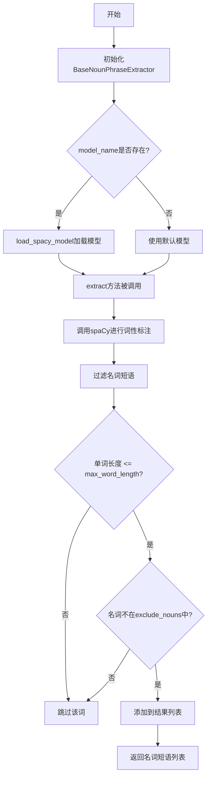
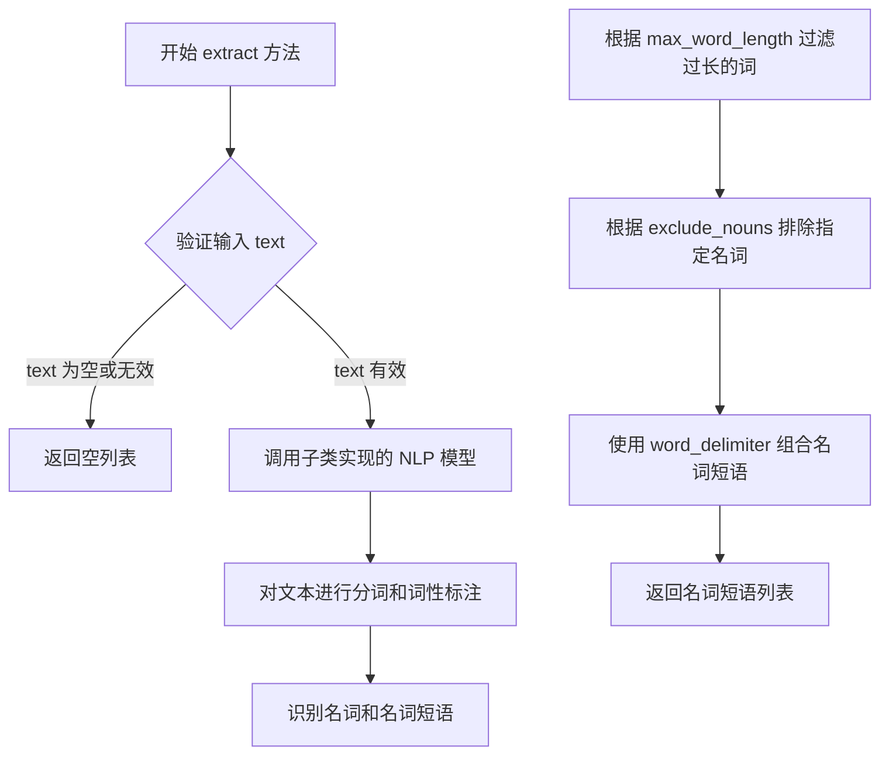
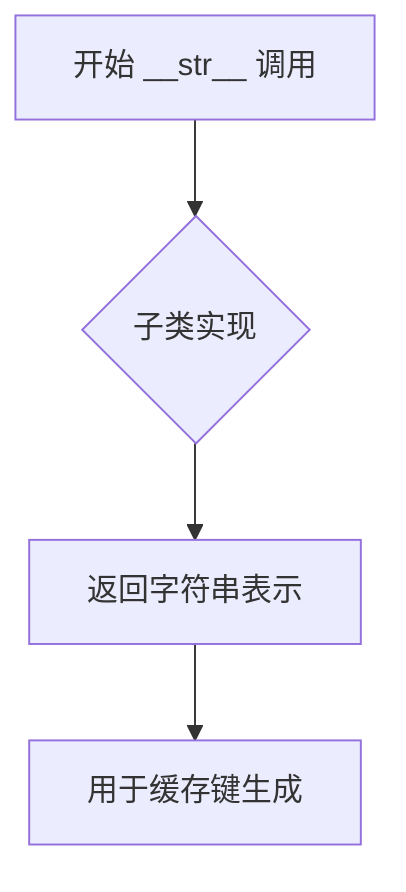
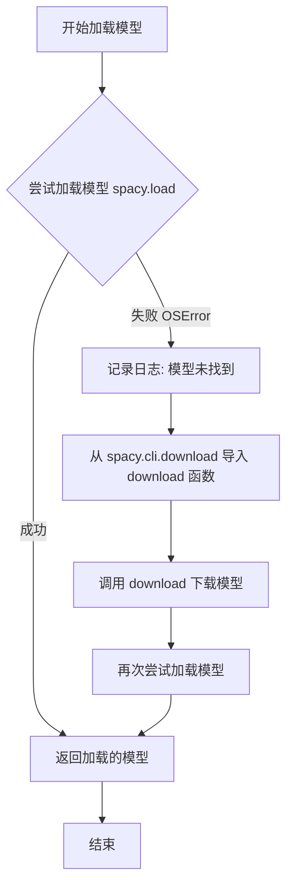

# `graphrag\packages\graphrag\graphrag\index\operations\build_noun_graph\np_extractors\base.py` 详细设计文档

这是一个名词短语提取器的抽象基类，提供了使用spaCy NLP模型提取文本中名词短语的标准接口，支持自定义排除词汇、单词长度限制和分隔符配置。

## 整体流程



## 类结构

```
BaseNounPhraseExtractor (抽象基类)
└── 具体实现类 (待后续扩展)
```

## 全局变量及字段


### `logger`
    
模块级日志记录器，用于记录模型加载和错误信息

类型：`logging.Logger`
    


### `BaseNounPhraseExtractor.model_name`
    
spaCy模型名称，用于指定要加载的语言模型

类型：`str | None`
    


### `BaseNounPhraseExtractor.max_word_length`
    
最大单词长度限制，用于过滤过长的单词

类型：`int`
    


### `BaseNounPhraseExtractor.exclude_nouns`
    
需要排除的名词列表(大写)，用于过滤特定名词

类型：`list[str]`
    


### `BaseNounPhraseExtractor.word_delimiter`
    
单词分隔符，用于连接多个单词

类型：`str`
    
    

## 全局函数及方法


### `BaseNounPhraseExtractor.__init__`

构造函数，初始化名词短语提取器的参数，包括模型名称、最大单词长度、排除的名词列表和单词分隔符。

参数：

-  `model_name`：`str | None`，SpaCy 模型名称，用于加载 NLP 模型进行名词短语提取
-  `exclude_nouns`：`list[str] | None`，可选的要从结果中排除的名词列表，默认为 None
-  `max_word_length`：`int`，允许的最大单词长度，超过此长度的词会被过滤，默认为 15
-  `word_delimiter`：`str`，用于连接单词的分隔符，默认为空格 " "

返回值：`None`，构造函数不返回任何值

#### 流程图

```mermaid
flowchart TD
    A[开始 __init__] --> B[接收参数 model_name, exclude_nouns, max_word_length, word_delimiter]
    B --> C[设置 self.model_name = model_name]
    C --> D[设置 self.max_word_length = max_word_length]
    D --> E{检查 exclude_nouns 是否为 None?}
    E -->|是| F[将 exclude_nouns 设为空列表 []]
    E -->|否| G[保持 exclude_nouns 不变]
    F --> H[将 exclude_nouns 中的每个名词转换为大写]
    G --> H
    H --> I[设置 self.exclude_nouns 为转换后的列表]
    I --> J[设置 self.word_delimiter = word_delimiter]
    J --> K[结束 __init__]
```

#### 带注释源码

```python
def __init__(
    self,
    model_name: str | None,          # SpaCy 模型名称，可为 None
    exclude_nouns: list[str] | None = None,  # 要排除的名词列表
    max_word_length: int = 15,        # 最大单词长度阈值
    word_delimiter: str = " ",        # 单词分隔符
) -> None:
    """初始化名词短语提取器的配置参数。
    
    Args:
        model_name: SpaCy 模型名称，用于加载 NLP 模型
        exclude_nouns: 要从结果中排除的名词列表
        max_word_length: 允许的最大单词长度
        word_delimiter: 连接单词的分隔符
    """
    # 直接存储模型名称
    self.model_name = model_name
    
    # 存储最大单词长度配置
    self.max_word_length = max_word_length
    
    # 如果未指定排除名词，则使用空列表
    if exclude_nouns is None:
        exclude_nouns = []
    
    # 将排除名词列表中的每个名词转换为大写
    # 统一大写以便后续比较时不区分大小写
    self.exclude_nouns = [noun.upper() for noun in exclude_nouns]
    
    # 存储单词分隔符配置
    self.word_delimiter = word_delimiter
```


### `BaseNounPhraseExtractor.extract`

该方法是 `BaseNounPhraseExtractor` 类的抽象核心方法，定义了从给定文本中提取名词短语的标准接口。子类需要实现此方法以提供具体的名词短语提取逻辑，通常依赖于 NLP 模型（如 SpaCy）进行词性标注和短语分析，最终返回提取到的名词短语列表。

参数：

-  `text`：`str`，要从中提取名词短语的原始文本

返回值：`list[str]`，提取出的名词短语列表，每个元素为一个名词短语字符串

#### 流程图



#### 带注释源码

```python
@abstractmethod
def extract(self, text: str) -> list[str]:
    """
    Extract noun phrases from text.

    Args:
        text: Text.

    Returns: List of noun phrases.
    """
    # 注意：这是抽象方法，没有具体实现
    # 子类需要重写此方法以提供实际的名词短语提取逻辑
    # 通常实现步骤：
    # 1. 使用 NLP 模型（如 SpaCy）对文本进行解析
    # 2. 识别词性为名词（NOUN/PROPN）的词
    # 3. 识别名词短语（名词及其修饰语）
    # 4. 根据 max_word_length 过滤过长的词
    # 5. 根据 exclude_nouns 排除不需要的名词
    # 6. 使用 word_delimiter 连接短语并返回列表
```


### `BaseNounPhraseExtractor.__str__`

这是 `BaseNounPhraseExtractor` 抽象基类中的一个抽象方法，用于返回提取器的字符串表示形式，主要用于缓存键（cache key）的生成。由于是抽象方法，具体的实现逻辑由子类完成。

参数：

-  `self`：实例本身，`BaseNounPhraseExtractor`，调用该方法的对象实例

返回值：`str`，返回提取器的字符串表示形式，主要用于缓存键的生成

#### 流程图



#### 带注释源码

```python
@abstractmethod
def __str__(self) -> str:
    """
    Return string representation of the extractor, used for cache key generation.
    
    这是一个抽象方法，具体的字符串表示形式由子类实现。
    返回的字符串通常包含提取器的配置参数（如模型名称、排除的名词等），
    以确保不同的配置生成不同的缓存键，从而实现正确的缓存逻辑。
    
    Returns:
        str: 提取器的字符串表示，用于缓存键生成
    """
```


### `BaseNounPhraseExtractor.load_spacy_model`

静态方法，加载spaCy模型，支持自动下载如果模型不存在。

参数：

- `model_name`：`str`，要加载的 spaCy 模型名称（例如 "en_core_web_sm"）
- `exclude`：`list[str] | None`，可选的从模型中排除的组件列表，默认为 None

返回值：`spacy.language.Language`，加载的 spaCy 语言模型对象

#### 流程图



#### 带注释源码

```python
@staticmethod
def load_spacy_model(
    model_name: str, exclude: list[str] | None = None
) -> spacy.language.Language:
    """Load a SpaCy model."""
    # 如果 exclude 为 None，初始化为空列表
    if exclude is None:
        exclude = []
    try:
        # 尝试直接加载指定的 spaCy 模型
        return spacy.load(model_name, exclude=exclude)
    except OSError:
        # 如果模型不存在（OSError 异常），记录信息日志
        msg = f"Model `{model_name}` not found. Attempting to download..."
        logger.info(msg)
        # 从 spacy.cli.download 导入 download 函数
        from spacy.cli.download import download

        # 调用 download 函数自动下载模型
        download(model_name)
        # 重新尝试加载已下载的模型
        return spacy.load(model_name, exclude=exclude)
```

## 关键组件


### BaseNounPhraseExtractor

抽象基类，定义名词短语提取器的接口和通用配置逻辑，支持自定义模型名称、排除词汇、单词长度限制和分隔符。

### extract 方法

抽象方法，定义从文本中提取名词短语的核心接口，由子类实现具体提取逻辑。

### __str__ 方法

抽象方法，返回提取器的字符串表示，用于缓存键生成，确保不同配置的提取器具有唯一标识。

### load_spacy_model 静态方法

加载 SpaCy 语言模型的工具方法，支持模型不存在时自动下载，提供异常处理和日志记录机制。

### model_name 字段

字符串类型，存储要使用的 SpaCy 模型名称，用于加载对应的 NLP 模型。

### exclude_nouns 字段

列表类型，存储需要排除的名词集合，提取时会过滤掉这些词汇（不区分大小写比较）。

### max_word_length 字段

整数类型，设置单词最大长度阈值，用于过滤过长的单词。

### word_delimiter 字段

字符串类型，设置单词分隔符，用于后续文本处理和短语重建。


## 问题及建议


### 已知问题

- **未使用的参数**：`max_word_length` 和 `word_delimiter` 在 `__init__` 中被保存，但基类中未实际使用这些参数，可能导致配置被忽视
- **空实现抽象类**：该抽象类未提供任何可复用的基础实现，所有逻辑均需子类实现，缺乏模板方法模式支持
- **模型名称可为 None**：`model_name` 参数接受 `None` 类型，但 `load_spacy_model` 静态方法需要有效的模型名称字符串，存在潜在的运行时错误
- **缺乏参数验证**：未对 `max_word_length`（应验证为正整数）和 `word_delimiter`（应验证为非空字符串）进行有效性检查
- **模型下载错误处理不完善**：`load_spacy_model` 中模型下载失败时仅记录日志后重新抛出异常，缺少重试机制或更友好的错误提示
- **大小写转换副作用**：`exclude_nouns` 被转换为大写，但未在文档中说明这一行为，可能导致子类使用时代码混淆

### 优化建议

- 在抽象类中添加 `@abstractmethod` 标记 `model_name` 等属性，或提供受保护的辅助方法使用这些配置参数
- 考虑实现模板方法模式，提供 `extract` 的默认实现，调用可被子类覆盖的 `_preprocess`、`_postprocess` 等钩子方法
- 在 `__init__` 中添加参数验证逻辑，确保 `max_word_length > 0` 和 `word_delimiter` 非空
- 增强 `load_spacy_model` 的错误处理，添加重试次数限制和更详细的错误信息
- 在类文档字符串中明确说明 `exclude_nouns` 的大小写转换行为
- 考虑将 `model_name` 的 `None` 情况在抽象类层面处理，提供默认模型加载逻辑或明确抛出有意义的错误

## 其它


### 设计目标与约束

- **设计目标**：提供统一的名词短语提取接口，支持多种NLP模型实现，允许自定义排除词汇和文本处理参数
- **约束条件**：
  - 必须继承自ABC基类，实现抽象方法
  - 模型名称可为None（表示使用默认或无模型）
  - 最大词长度限制为15个字符
  - 排除名词列表不区分大小写（统一转为大写比较）

### 错误处理与异常设计

- **OSError**：当SpaCy模型加载失败时捕获，提示模型未找到并尝试自动下载
- **异常传播**：模型下载失败时异常会向上传播，由调用方处理
- **日志记录**：使用logging模块记录模型下载信息，级别为INFO

### 数据流与状态机

- **输入流程**：调用方传入原始文本 → extract方法处理 → 返回名词短语列表
- **状态转换**：
  1. 初始化状态：加载配置参数（model_name, exclude_nouns, max_word_length, word_delimiter）
  2. 就绪状态：模型已加载或无需模型
  3. 处理状态：执行名词短语提取
  4. 返回状态：返回结果列表

### 外部依赖与接口契约

- **核心依赖**：
  - `spacy`：NLP模型加载与处理
  - `spacy.cli.download`：模型自动下载
  - `logging`：日志记录
- **接口契约**：
  - `extract(text: str)`：必须实现，返回list[str]类型
  - `__str__()`：必须实现，用于缓存键生成
  - `load_spacy_model()`：静态方法，负责模型加载与自动下载

### 性能考量

- 模型加载为静态方法，支持延迟加载和缓存
- 排除名词列表在初始化时转换为大写，避免重复转换
- 最大词长度过滤在提取时执行，减少不必要的处理

### 扩展性设计

- 抽象基类模式便于扩展新的提取器实现
- 静态方法`load_spacy_model`可被所有子类复用
- 配置参数通过构造函数注入，便于定制

### 兼容性考虑

- 支持Python 3.10+的类型联合语法（`str | None`）
- 模型名称可为None以支持无模型场景
- exclude参数支持None或空列表

### 安全性考虑

- 模型下载来自SpaCy官方仓库，可信来源
- 无用户输入直接执行代码的风险
- 日志信息不包含敏感数据

### 测试策略建议

- 单元测试：验证抽象方法实现、模型加载逻辑
- 集成测试：测试实际文本提取功能
- mock测试：模拟模型加载失败场景

### 配置管理

- 构造函数参数即为配置来源
- 默认排除名词列表为空
- 默认词长度为15
- 默认分隔符为空格

    