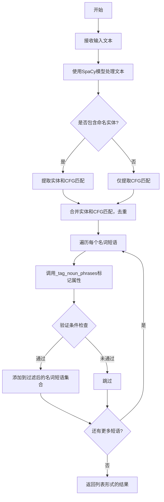
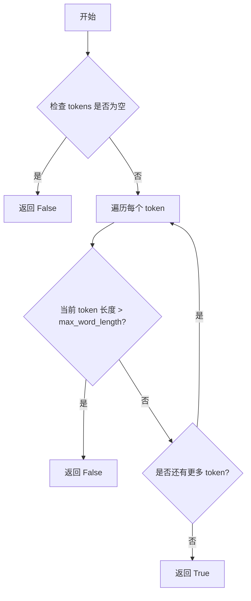
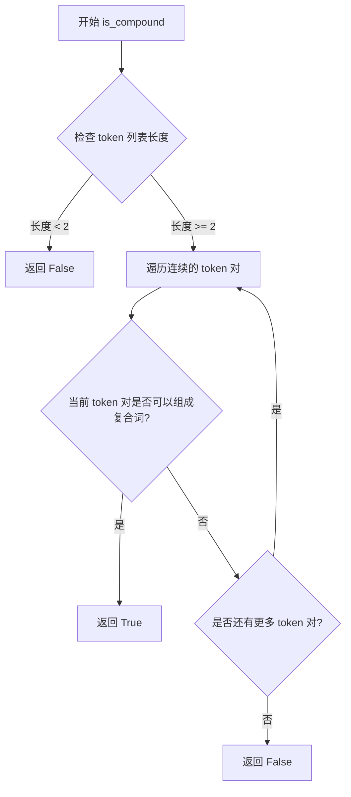
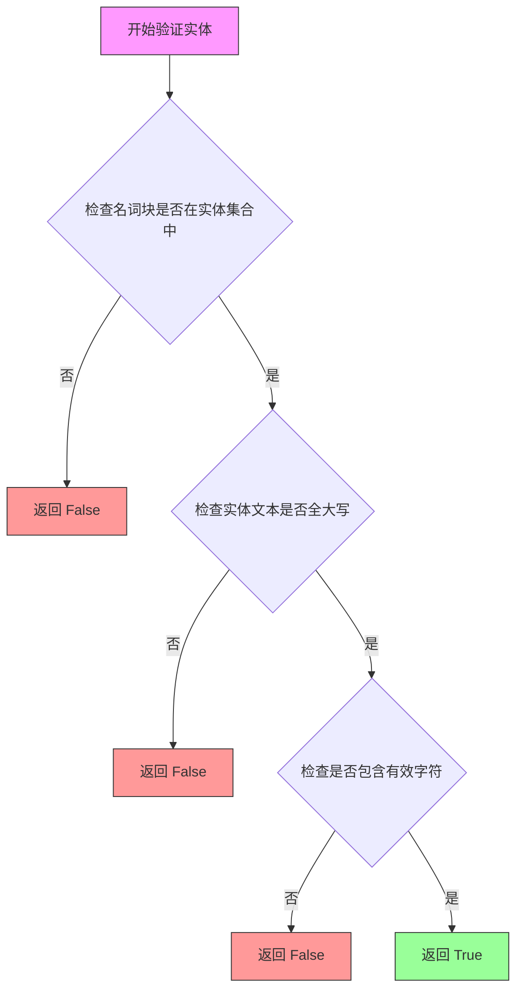
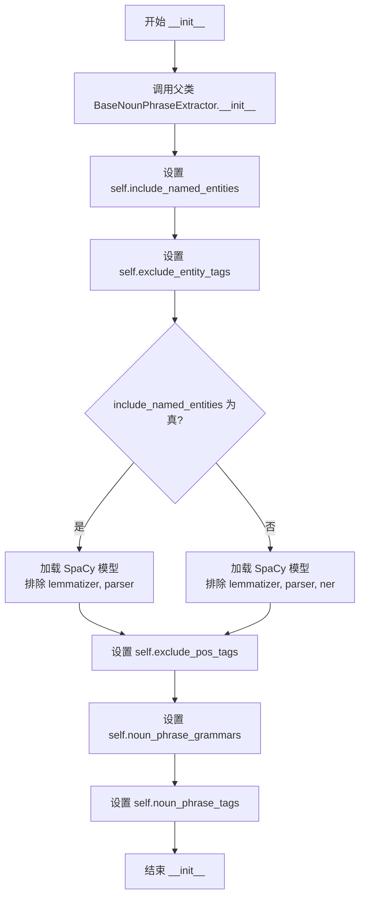
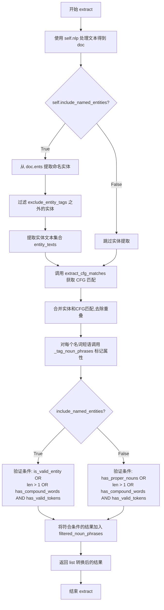
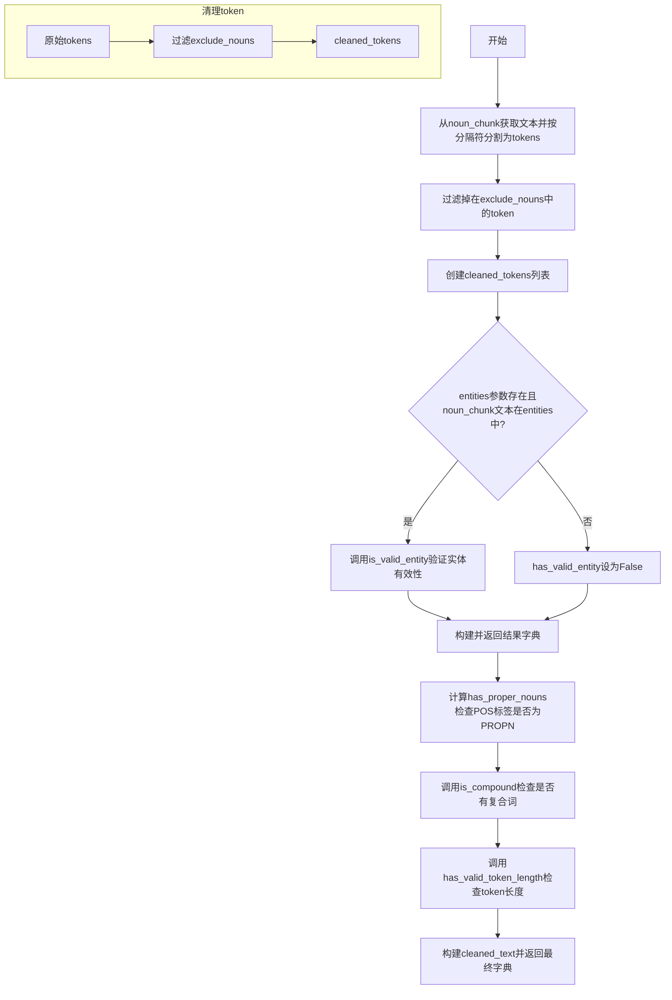

# `graphrag\packages\graphrag\graphrag\index\operations\build_noun_graph\np_extractors\cfg_extractor.py` 详细设计文档

这是一个基于上下文无关语法（CFG）的名词短语提取器，通过结合SpaCy的NER和自定义语法规则从文本中提取名词短语，支持过滤和验证机制以提高提取质量。

## 整体流程



## 类结构

```
BaseNounPhraseExtractor (抽象基类)
└── CFGNounPhraseExtractor (CFG名词短语提取器)
```

## 全局变量及字段


### `CFGNounPhraseExtractor.include_named_entities`
    
是否在名词短语中包含命名实体

类型：`bool`
    


### `CFGNounPhraseExtractor.exclude_entity_tags`
    
要排除的命名实体标签列表

类型：`list[str]`
    


### `CFGNounPhraseExtractor.exclude_pos_tags`
    
要排除的词性标签列表

类型：`list[str]`
    


### `CFGNounPhraseExtractor.noun_phrase_grammars`
    
CFG语法规则字典，用于匹配名词短语

类型：`dict[tuple, str]`
    


### `CFGNounPhraseExtractor.noun_phrase_tags`
    
名词短语标签列表

类型：`list[str]`
    


### `CFGNounPhraseExtractor.nlp`
    
用于文本处理的SpaCy模型（继承自父类）

类型：`SpaCy模型`
    


### `CFGNounPhraseExtractor.model_name`
    
SpaCy模型名称（继承自父类）

类型：`str`
    


### `CFGNounPhraseExtractor.max_word_length`
    
最大单词长度（继承自父类）

类型：`int`
    


### `CFGNounPhraseExtractor.exclude_nouns`
    
要排除的名词列表（继承自父类）

类型：`list[str]`
    


### `CFGNounPhraseExtractor.word_delimiter`
    
单词分隔符（继承自父类）

类型：`str`
    
    

## 全局函数及方法


### `has_valid_token_length`

该函数用于验证名词短语中的每个 token（词）是否符合指定的最大字符长度限制，确保提取的名词短语不包含过长的单词。

参数：

- `tokens`：`list[str]`，待验证的 token 列表
- `max_word_length`：`int`，允许的最大字符长度

返回值：`bool`，如果所有 token 的长度都小于等于 `max_word_length` 则返回 `True`，否则返回 `False`

#### 流程图



#### 带注释源码

```python
def has_valid_token_length(
    tokens: list[str],
    max_word_length: int
) -> bool:
    """
    验证名词短语中的每个 token 是否符合最大字符长度限制。
    
    Args:
        tokens: 待验证的 token 列表
        max_word_length: 允许的最大字符长度
    
    Returns:
        如果所有 token 的长度都小于等于 max_word_length 则返回 True
    """
    # 遍历每个 token，检查其长度是否超过限制
    for token in tokens:
        if len(token) > max_word_length:
            # 如果任意一个 token 超过长度限制，返回 False
            return False
    # 所有 token 都符合长度限制，返回 True
    return True
```

---

**注意**：由于 `has_valid_token_length` 函数的实现源码未在给定的代码片段中提供，以上源码和流程图是根据该函数在 `_tag_noun_phrases` 方法中的调用方式推断的：

```python
"has_valid_tokens": has_valid_token_length(
    cleaned_tokens, self.max_word_length
),
```

实际实现位于 `graphrag.index.operations.build_noun_graph.np_extractors.np_validator` 模块中。


### `is_compound`

该函数用于判断给定的词符列表（tokens）中是否包含复合词（compound words），即多个连续token组合而成的复合概念词。

参数：

-  `cleaned_tokens`：`list[str]`，经过清洗后的词符列表，用于检测是否存在复合词

返回值：`bool`，如果词符列表中包含复合词则返回 `True`，否则返回 `False`

#### 流程图



#### 带注释源码

```
# is_compound 函数定义位于:
# graphrag/index/operations/build_noun_graph/np_extractors/np_validator.py
# 当前代码文件中仅导入了该函数,未包含其实现

# 函数调用位置 (在 CFGNounPhraseExtractor._tag_noun_phrases 方法中):
"has_compound_words": is_compound(cleaned_tokens),

# 说明: 
# - cleaned_tokens: list[str] - 已经是经过清洗的 token 列表
# - 返回值: bool - 表示该名词短语是否包含复合词
# - 复合词判断逻辑: 通常基于语言学规则,检测相邻 token 是否形成复合概念
#   (如 "New York" -> 复合地名, "machine learning" -> 复合技术术语)
```

---

**注意**: `is_compound` 函数的完整实现在 `np_validator.py` 模块中，当前提供的代码文件仅包含该函数的导入语句和调用方式，未包含其具体实现逻辑。如需获取完整的函数实现源码，请参考 `graphrag/index/operations/build_noun_graph/np_extractors/np_validator.py` 文件。


### `is_valid_entity`

该函数用于验证给定的名词块（noun chunk）是否构成一个有效的实体，通常与命名实体识别（NER）配合使用，通过检查实体文本的构成（如是否全为大写、是否包含有效字符等）来判断实体的有效性。

参数：

- `noun_chunk`：`tuple[str, str]`，名词块元组，包含文本和词性标签
- `cleaned_tokens`：`list[str]`，清洗后的词符列表

返回值：`bool`，如果名词块是有效实体则返回 True，否则返回 False

#### 流程图



#### 带注释源码

```
# 该函数定义位于 graphrag/index/operations/build_noun_graph/np_extractors/np_validator.py
# 由于源代码未直接在当前文件中提供，以下为基于调用的推断实现

def is_valid_entity(noun_chunk: tuple[str, str], cleaned_tokens: list[str]) -> bool:
    """
    验证名词块是否为有效实体。
    
    Args:
        noun_chunk: 名词块元组 (文本, 词性标签)
        cleaned_tokens: 清洗后的词符列表
    
    Returns:
        bool: 是否为有效实体
    """
    # 获取实体文本
    entity_text = noun_chunk[0]
    
    # 检查实体文本是否至少包含一个字母字符
    if not any(char.isalpha() for char in entity_text):
        return False
    
    # 检查实体文本是否全为大写（命名实体通常全大写）
    # 或者首字母大写其余小写（Title Case）
    if entity_text.isupper() or (entity_text[0].isupper() and entity_text[1:].islower()):
        return True
    
    # 检查是否包含数字或特殊字符组合（如年份、版本号等）
    if any(char.isdigit() for char in entity_text):
        return True
    
    # 默认返回 False
    return False
```

> **注意**：由于 `is_valid_entity` 函数的实际源代码位于外部模块 `np_validator.py` 中，当前提供的代码片段仅展示了该函数的调用方式。如需获取完整源代码，建议查看 `graphrag/index/operations/build_noun_graph/np_extractors/np_validator.py` 文件。


### `CFGNounPhraseExtractor.__init__`

该方法是 CFG-based 名词短语提取器的初始化方法，负责配置 SpaCy 模型加载、设置过滤规则和语法规则，以及初始化父类属性。

参数：

-  `model_name`：`str`，SpaCy 模型名称，用于加载相应的自然语言处理模型
-  `max_word_length`：`int`，每个提取单词的最大字符长度限制
-  `include_named_entities`：`bool`，是否在名词短语中包含命名实体
-  `exclude_entity_tags`：`list[str]`，要排除的命名实体标签列表
-  `exclude_pos_tags`：`list[str]`，要从词性分析中移除的 POS 标签列表
-  `exclude_nouns`：`list[str]`，要从结果中排除的名词列表
-  `word_delimiter`：`str`，用于连接单词的分隔符
-  `noun_phrase_grammars`：`dict[tuple, str]`，用于匹配名词短语的形式语法规则字典
-  `noun_phrase_tags`：`list[str]`，用于识别名词短语的词性标签列表

返回值：`None`，无返回值（`__init__` 方法）

#### 流程图



#### 带注释源码

```python
def __init__(
    self,
    model_name: str,
    max_word_length: int,
    include_named_entities: bool,
    exclude_entity_tags: list[str],
    exclude_pos_tags: list[str],
    exclude_nouns: list[str],
    word_delimiter: str,
    noun_phrase_grammars: dict[tuple, str],
    noun_phrase_tags: list[str],
):
    """
    Noun phrase extractor combining CFG-based noun-chunk extraction and NER.

    CFG-based extraction was based on TextBlob's fast NP extractor implementation:
    This extractor tends to be faster than the dependency-parser-based extractors but grammars may need to be changed for different languages.

    Args:
        model_name: SpaCy model name.
        max_word_length: Maximum length (in character) of each extracted word.
        include_named_entities: Whether to include named entities in noun phrases
        exclude_entity_tags: list of named entity tags to exclude in noun phrases.
        exclude_pos_tags: List of POS tags to remove in noun phrases.
        word_delimiter: Delimiter for joining words.
        noun_phrase_grammars: CFG for matching noun phrases.
    """
    # 调用父类初始化方法，传递基础配置参数
    # 父类负责设置 model_name, max_word_length, exclude_nouns, word_delimiter
    super().__init__(
        model_name=model_name,
        max_word_length=max_word_length,
        exclude_nouns=exclude_nouns,
        word_delimiter=word_delimiter,
    )
    # 存储是否包含命名实体的配置
    self.include_named_entities = include_named_entities
    # 存储要排除的实体标签列表
    self.exclude_entity_tags = exclude_entity_tags
    
    # 根据是否包含命名实体决定加载 SpaCy 模型的配置
    # 如果不包含命名实体，可以排除 ner 组件以提高性能
    if not include_named_entities:
        # 加载不包含命名实体识别器的轻量级模型
        self.nlp = self.load_spacy_model(
            model_name, exclude=["lemmatizer", "parser", "ner"]
        )
    else:
        # 加载包含命名实体识别器的完整模型
        self.nlp = self.load_spacy_model(
            model_name, exclude=["lemmatizer", "parser"]
        )

    # 存储要排除的词性标签列表，用于过滤词性分析结果
    self.exclude_pos_tags = exclude_pos_tags
    # 存储名词短语语法规则，用于 CFG 匹配
    self.noun_phrase_grammars = noun_phrase_grammars
    # 存储名词短语识别所需的词性标签
    self.noun_phrase_tags = noun_phrase_tags
```


### `CFGNounPhraseExtractor.extract`

该方法用于从文本中提取名词短语，结合了基于上下文无关语法（CFG）的名词块提取和命名实体识别（NER）。它通过SpaCy处理文本，根据是否包含命名实体的配置采用不同的过滤策略，最终返回经过启发式规则过滤后的名词短语列表。

参数：

-  `text`：`str`，输入的文本内容

返回值：`list[str]`，提取并过滤后的名词短语列表

#### 流程图



#### 带注释源码

```python
def extract(
    self,
    text: str,
) -> list[str]:
    """
    Extract noun phrases from text. Noun phrases may include named entities and noun chunks, which are filtered based on some heuristics.

    Args:
        text: Text.

    Returns: List of noun phrases.
    """
    # 使用 SpaCy NLP 模型处理输入文本,生成 Doc 对象
    doc = self.nlp(text)

    # 初始化过滤后的名词短语集合 (使用 set 自动去重)
    filtered_noun_phrases = set()
    
    # 根据配置决定是否包含命名实体
    if self.include_named_entities:
        # 路径1: 包含命名实体
        # 1.1 从文档中提取所有命名实体,格式为 (文本, 标签) 元组列表
        entities = [
            (ent.text, ent.label_)
            for ent in doc.ents
            # 过滤掉需要排除的实体标签
            if ent.label_ not in self.exclude_entity_tags
        ]
        # 1.2 提取实体文本集合用于后续去重
        entity_texts = set({ent[0] for ent in entities})
        
        # 1.3 获取基于CFG的名词短语匹配
        cfg_matches = self.extract_cfg_matches(doc)
        
        # 1.4 合并实体和CFG匹配,去除与实体文本重叠的CFG匹配
        noun_phrases = entities + [
            np for np in cfg_matches if np[0] not in entity_texts
        ]

        # 1.5 为每个名词短语标记属性用于过滤
        tagged_noun_phrases = [
            self._tag_noun_phrases(np, entity_texts) for np in noun_phrases
        ]
        
        # 1.6 根据验证条件过滤名词短语
        for tagged_np in tagged_noun_phrases:
            # 条件A: 是有效的实体
            # 条件B: (词数大于1 或 有复合词) 且 有有效 tokens
            if (tagged_np["is_valid_entity"]) or (
                (
                    len(tagged_np["cleaned_tokens"]) > 1
                    or tagged_np["has_compound_words"]
                )
                and tagged_np["has_valid_tokens"]
            ):
                filtered_noun_phrases.add(tagged_np["cleaned_text"])
    else:
        # 路径2: 不包含命名实体,仅使用CFG匹配
        # 2.1 直接提取CFG匹配的名词短语
        noun_phrases = self.extract_cfg_matches(doc)
        
        # 2.2 标记名词短语属性 (不传入 entities 参数)
        tagged_noun_phrases = [self._tag_noun_phrases(np) for np in noun_phrases]
        
        # 2.3 过滤逻辑不同: 检查专有名词或复合条件
        for tagged_np in tagged_noun_phrases:
            # 条件A: 包含专有名词 (PROPN)
            # 条件B: (词数大于1 或 有复合词) 且 有有效 tokens
            if (tagged_np["has_proper_nouns"]) or (
                (
                    len(tagged_np["cleaned_tokens"]) > 1
                    or tagged_np["has_compound_words"]
                )
                and tagged_np["has_valid_tokens"]
            ):
                filtered_noun_phrases.add(tagged_np["cleaned_text"])
    
    # 3. 将集合转换为列表并返回
    return list(filtered_noun_phrases)
```


### `CFGNounPhraseExtractor.extract_cfg_matches`

该方法实现基于上下文无关文法（CFG）的名词短语提取，通过遍历文档的Token序列，根据预定义的语法规则（noun_phrase_grammars）合并相邻的Token，返回匹配指定词性标签（noun_phrase_tags）的名词短语列表。

参数：

- `doc`：`Doc`，SpaCy解析后的文档对象，包含已分词和标注的Token序列

返回值：`list[tuple[str, str]]`，返回匹配CFG语法规则的名词短语列表，每个元素为包含（文本内容，词性标签）的元组

#### 流程图

```mermaid
flowchart TD
    A[开始 extract_cfg_matches] --> B[创建空列表 tagged_tokens]
    B --> C[遍历 doc 中的所有 token]
    C --> D{token.pos_ 不在 exclude_pos_tags?}
    D -->|否| E[跳过该 token]
    D -->|是| F{token.is_space is False?}
    F -->|否| E
    F -->|是| G{token.text != '-'?}
    G -->|否| E
    G -->|是| H[将 (token.text, token.pos_) 添加到 tagged_tokens]
    H --> C
    C --> I{遍历完成?}
    I -->|否| C
    I -->|是| J[设置 merge = True]
    J --> K{merge 为 True?}
    K -->|否| L[过滤 tagged_tokens]
    L --> M[返回 t[1] in noun_phrase_tags 的元素]
    K -->|是| N[遍历 tagged_tokens 索引 0 到 len-2]
    N --> O[获取相邻两个元素 first, second]
    O --> P[构建 key = (first[1], second[1])]
    P --> Q{key 在 noun_phrase_grammars 中?}
    Q -->|否| R[继续下一个 index]
    Q -->|是| S[设置 merge = True]
    S --> T[pop index 和 index+1 位置的元素]
    T --> U[构建 match = first[0] + word_delimiter + second[0]]
    U --> V[获取 pos = noun_phrase_grammars[key]]
    V --> W[在 index 位置插入 (match, pos)]
    W --> X[break 跳出循环]
    X --> K
    R --> N
    N --> Y{遍历完成?}
    Y -->|否| N
    Y -->|是| J
```

#### 带注释源码

```python
def extract_cfg_matches(self, doc: Doc) -> list[tuple[str, str]]:
    """Return noun phrases that match a given context-free grammar."""
    # 第一步：构建带词性标注的token列表
    # 过滤条件：排除在exclude_pos_tags中的词性、空白字符、连字符
    tagged_tokens = [
        (token.text, token.pos_)
        for token in doc
        if token.pos_ not in self.exclude_pos_tags
        and token.is_space is False
        and token.text != "-"
    ]
    
    # 第二步：使用CFG语法规则迭代合并相邻的token
    merge = True
    while merge:
        merge = False  # 默认不合并
        for index in range(len(tagged_tokens) - 1):
            # 获取相邻的两个token
            first, second = tagged_tokens[index], tagged_tokens[index + 1]
            # 构建词性标签对作为语法规则的key
            key = first[1], second[1]
            # 查找是否匹配预定义的CFG语法
            value = self.noun_phrase_grammars.get(key, None)
            if value:
                # 找到匹配模式，执行合并
                merge = True
                # 移除当前两个token
                tagged_tokens.pop(index)
                tagged_tokens.pop(index)
                # 使用分隔符合并文本
                match = f"{first[0]}{self.word_delimiter}{second[0]}"
                pos = value
                # 在原位置插入合并后的token
                tagged_tokens.insert(index, (match, pos))
                # 退出内层循环，重新开始检查合并后的结果
                break
    
    # 第三步：过滤返回只保留指定词性标签的token
    return [t for t in tagged_tokens if t[1] in self.noun_phrase_tags]
```


### `CFGNounPhraseExtractor._tag_noun_phrases`

该方法用于从给定的名词短语元组中提取多个属性（如清理后的标记、是否包含有效实体、是否有复合词等），以供后续过滤使用。它根据词长、停用词列表和实体匹配等启发式规则对名词短语进行标记和处理。

参数：

- `noun_chunk`：`tuple[str, str]`，名词短语元组，包含（文本, POS标签）
- `entities`：`set[str] | None = None`，可选的实体文本集合，用于验证名词短语是否为有效实体

返回值：`dict[str, Any]`，返回包含以下键的字典：

- `cleaned_tokens`：清理后的词列表（排除停用名词）
- `cleaned_text`：清理后的文本（统一大写，去除换行）
- `is_valid_entity`：是否为有效实体
- `has_proper_nouns`：是否包含专有名词（PROPN）
- `has_compound_words`：是否包含复合词
- `has_valid_tokens`：是否所有词都符合最大长度限制

#### 流程图



#### 带注释源码

```python
def _tag_noun_phrases(
    self, noun_chunk: tuple[str, str], entities: set[str] | None = None
) -> dict[str, Any]:
    """Extract attributes of a noun chunk, to be used for filtering."""
    # 1. 从noun_chunk元组中提取文本部分，使用word_delimiter分割成tokens列表
    tokens = noun_chunk[0].split(self.word_delimiter)
    
    # 2. 过滤掉在exclude_nouns列表中的token（不区分大小写比较）
    cleaned_tokens = [
        token for token in tokens if token.upper() not in self.exclude_nouns
    ]

    # 3. 初始化实体验证标志为False
    has_valid_entity = False
    
    # 4. 如果提供了entities集合且当前名词短语文本在实体集合中
    if entities and noun_chunk[0] in entities:
        # 则调用is_valid_entity验证该名词短语是否为有效实体
        has_valid_entity = is_valid_entity(noun_chunk, cleaned_tokens)

    # 5. 构建并返回包含多个属性的字典，用于后续过滤
    return {
        # 清理后的token列表（已排除停用名词）
        "cleaned_tokens": cleaned_tokens,
        
        # 清理后的文本：使用分隔符连接，替换换行符，并转换为大写
        "cleaned_text": self.word_delimiter
        .join(cleaned_tokens)
        .replace("\n", "")
        .upper(),
        
        # 是否为有效实体（仅当名词短语在entities集合中时有效）
        "is_valid_entity": has_valid_entity,
        
        # 是否包含专有名词（通过POS标签判断）
        "has_proper_nouns": (noun_chunk[1] == "PROPN"),
        
        # 是否包含复合词（通过辅助函数判断）
        "has_compound_words": is_compound(cleaned_tokens),
        
        # 所有token是否符合最大长度限制
        "has_valid_tokens": has_valid_token_length(
            cleaned_tokens, self.max_word_length
        ),
    }
```


### `CFGNounPhraseExtractor.__str__`

返回提取器的字符串表示形式，用于缓存键生成。

参数：无（该方法不接受除 self 外的任何参数）

返回值：`str`，返回包含模型名称、最大词长度、命名实体选项、排除的实体标签、排除的词性标签、排除的名词、词分隔符和语法规则等信息的字符串，作为缓存键使用。

#### 流程图

```mermaid
flowchart TD
    A[开始 __str__ 方法] --> B[构建字符串表示]
    B --> C[格式: cfg_{model_name}_{max_word_length}_{include_named_entities}_{exclude_entity_tags}_{exclude_pos_tags}_{exclude_nouns}_{word_delimiter}_{noun_phrase_grammars}_{noun_phrase_tags}]
    C --> D[返回字符串]
```

#### 带注释源码

```python
def __str__(self) -> str:
    """
    Return string representation of the extractor, used for cache key generation.
    
    返回提取器的字符串表示形式，用于缓存键生成。
    
    该方法将提取器的关键配置参数拼接成唯一的字符串标识，
    以便在缓存系统中作为键使用，区分不同的提取器配置。
    """
    return f"cfg_{self.model_name}_{self.max_word_length}_{self.include_named_entities}_{self.exclude_entity_tags}_{self.exclude_pos_tags}_{self.exclude_nouns}_{self.word_delimiter}_{self.noun_phrase_grammars}_{self.noun_phrase_tags}"
    # 字符串包含以下组成部分：
    # - 'cfg_': 前缀标识这是CFG提取器
    # - self.model_name: SpaCy模型名称
    # - self.max_word_length: 最大词长度
    # - self.include_named_entities: 是否包含命名实体
    # - self.exclude_entity_tags: 排除的实体标签列表
    # - self.exclude_pos_tags: 排除的词性标签列表
    # - self.exclude_nouns: 排除的名词列表
    # - self.word_delimiter: 词分隔符
    # - self.noun_phrase_grammars: 名词短语语法规则
    # - self.noun_phrase_tags: 名词短语标签列表
```

## 关键组件


### CFGNounPhraseExtractor

基于上下文无关文法（CFG）的名词短语提取器，结合NER和启发式过滤规则从文本中提取名词短语。

### extract() 方法

从输入文本中提取名词短语的主方法，整合命名实体和CFG匹配结果，通过多个启发式规则过滤得到最终的名词短语列表。

### extract_cfg_matches() 方法

基于CFG规则匹配名词短语，使用词性标签序列按照预定义的二元文法规则合并 token，形成名词短语。

### _tag_noun_phrases() 方法

为每个名词短语提取多个属性标签，用于后续过滤决策，包括有效实体、复合词、词长验证等。

### 命名实体集成

支持通过SpaCy NER提取命名实体，并与CFG匹配结果合并，同时提供实体标签排除机制。

### 词性标注过滤

基于POS标签进行名词短语提取，支持排除特定的词性标签，并忽略空白字符和连字符。

### 启发式过滤规则

包含多个过滤条件：实体有效性、复合词检测、专有名词识别、词长限制和排除名词列表。

### 字符串表示

实现__str__方法生成缓存键，用于对象标识和缓存管理。


## 问题及建议


### 已知问题

-   **算法效率低下**：`extract_cfg_matches` 方法使用 `while merge` 循环和列表的 `pop/insert` 操作，在最坏情况下时间复杂度为 O(n²)，且每次匹配成功后需要重新遍历整个列表。
-   **冗余的集合创建**：`entity_texts = set({ent[0] for ent in entities})` 中外层 `set()` 是多余的，应简化为 `set(ent[0] for ent in entities)`。
-   **`__str__` 方法的缓存键问题**：将复杂对象（`dict` 和 `list`）直接用于字符串拼接作为缓存键，可能导致不一致的哈希值或缓存失效。
-   **魔法值和硬编码**：多处使用硬编码字符串（如 `"-"`、`"\n"`），降低了代码可读性和可维护性。
-   **方法职责过于复杂**：`extract` 方法包含多个嵌套逻辑分支（处理实体、处理名词短语、过滤规则），代码行数过长（超过60行），难以理解和测试。
-   **缺乏输入验证**：构造函数中未对参数（如 `model_name`、`max_word_length`）进行有效性验证，可能导致运行时错误。
-   **资源管理不完善**：SpaCy 模型加载后没有提供显式的资源释放方法，在长期运行的应用中可能导致内存泄漏。

### 优化建议

-   **优化合并算法**：使用双向链表或索引映射替代列表的频繁插入/删除操作，或者使用更高效的模式匹配算法（如有限状态机）。
-   **简化集合创建**：移除冗余的 `set()` 包装。
-   **改进缓存键生成**：使用 `json.dumps` 或 `hashlib` 对复杂对象进行序列化/哈希，而不是简单的字符串拼接。
-   **提取常量和配置**：将 `"-"`、`"\n"` 等硬编码值提取为类级别常量或配置参数。
-   **重构 `extract` 方法**：将提取、过滤逻辑拆分为多个私有方法，如 `_extract_entities()`、`_extract_noun_chunks()`、`_filter_noun_phrases()` 等，提高代码可读性和可测试性。
-   **添加参数验证**：在 `__init__` 方法中添加必要的输入校验，确保 `model_name` 不为空、`max_word_length` 为正数等。
-   **实现资源管理协议**：考虑实现 `__del__` 方法或提供 `close()` 方法来释放 SpaCy 模型资源。

## 其它


### 设计目标与约束

本模块的设计目标是提供一个基于上下文无关文法(CFG)的名词短语提取器，能够从文本中高效提取名词短语，同时支持命名实体识别和多种过滤策略。核心约束包括：1) 依赖SpaCy NLP库进行词性标注和命名实体识别；2) 名词短语提取 grammar基于POS标签对，需要针对不同语言调整；3) 最大词长限制为可配置参数，默认值为50字符；4) 支持排除特定的POS标签、命名实体标签和名词。

### 错误处理与异常设计

主要异常场景包括：1) SpaCy模型加载失败时抛出异常；2) 输入文本为空时返回空列表；3) 无效的grammar配置会导致匹配失败但不会抛出异常；4) NLP处理过程中的Token解析错误会被捕获并跳过。模块未定义自定义异常类，错误通过SpaCy原生异常向上传递。调用extract方法时应处理可能的空输入和模型加载异常。

### 数据流与状态机

数据流处理流程：1) 文本输入→SpaCy Doc对象创建；2) 若包含命名实体，提取实体并过滤；3) 运行CFG匹配算法提取名词短语；4) 合并实体和CFG结果，去除重叠；5) 对每个名词短语进行属性标记；6) 基于启发式规则过滤（词长、复合词、专有名词等）；7) 返回去重后的名词短语列表。状态转换包括：原始文本→标注后文本→匹配结果→过滤结果→最终输出。

### 外部依赖与接口契约

核心依赖：1) spacy>=3.0 用于NLP处理；2) graphrag.index.operations.build_noun_graph.np_extractors.base.BaseNounPhraseExtractor 抽象基类；3) graphrag.index.operations.build_noun_graph.np_extractors.np_validator 验证函数。接口契约：extract(text: str) -> list[str] 接收任意字符串，返回名词短语列表；__str__方法用于缓存键生成需保持稳定；构造函数参数全部为必需参数，无默认值。

### 关键组件信息

1) CFG匹配引擎：基于词性标签对(POSTag pair)的滑动窗口合并算法；2) 名词短语验证器：has_valid_token_length检查词长、is_compound检测复合词、is_valid_entity验证实体有效性；3) SpaCy模型加载器：根据include_named_entities决定是否加载NER组件；4) 名词短语标记器：_tag_noun_phrases为每个候选短语生成多维属性字典用于过滤决策。

### 潜在的技术债务与优化空间

1) grammar匹配算法使用嵌套循环效率较低，可考虑编译成正则表达式或使用有限状态机；2) 未实现缓存机制对重复文本的处理；3) _tag_noun_phrases方法返回字典每次都重新创建，可考虑预计算或缓存；4) 字符串拼接使用+和join混用，可统一；5) 缺少单元测试覆盖度信息；6) 错误日志记录缺失，调试困难；7) 未提供配置验证，错误的grammar可能导致静默失败。

### 配置管理

noun_phrase_grammars为CFG规则字典，键为POS标签对元组，值为合并后的词性标签；noun_phrase_tags为有效名词短语标签列表；exclude_entity_tags、exclude_pos_tags、exclude_nouns为排除列表，支持大小写不敏感匹配。配置变更会影响__str__缓存键值。

### 并发与线程安全性

SpaCy的nlp对象在多线程环境下需注意：1) 每个线程应创建独立的nlp实例或使用锁保护；2) extract方法本身无状态但依赖共享的nlp对象；3) noun_phrase_grammars等配置字典为只读，可安全共享。建议在高并发场景下使用线程局部存储或对象池。

### 性能考虑

1) 首次调用需加载SpaCy模型，有明显冷启动延迟；2) extract_cfg_matches的时间复杂度为O(n²)其中n为token数量；3) 大文本建议分批处理避免内存峰值；4) 可通过调整exclude_pos_tags减少需处理的token数量提升性能；5) 命名实体提取与CFG匹配串行执行，部分场景可并行化。

    