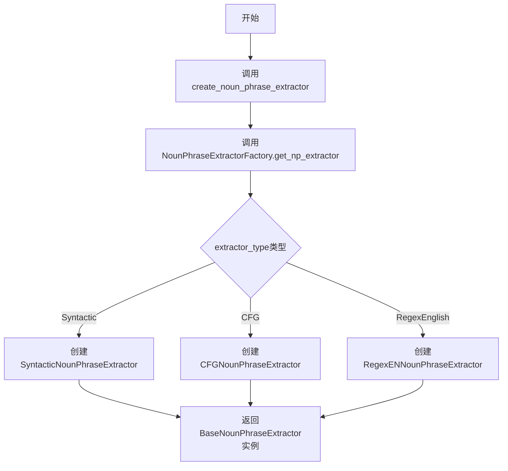
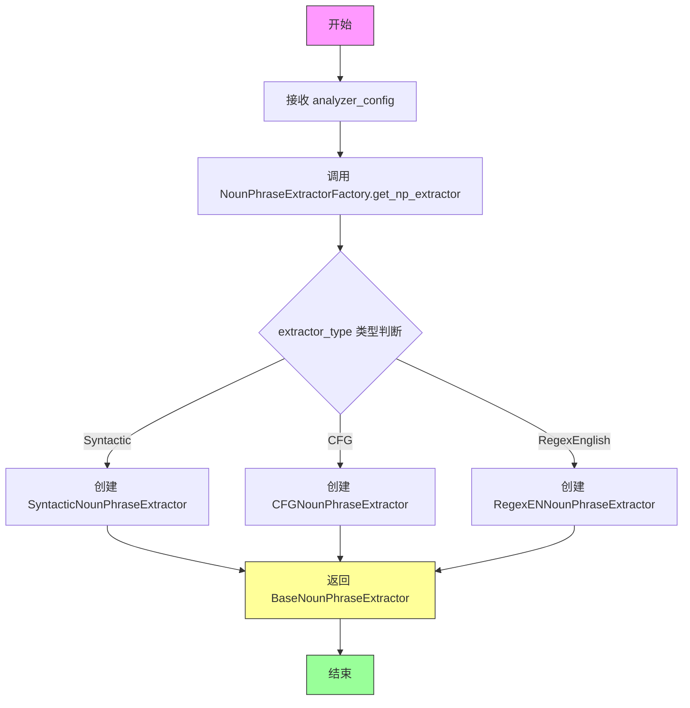
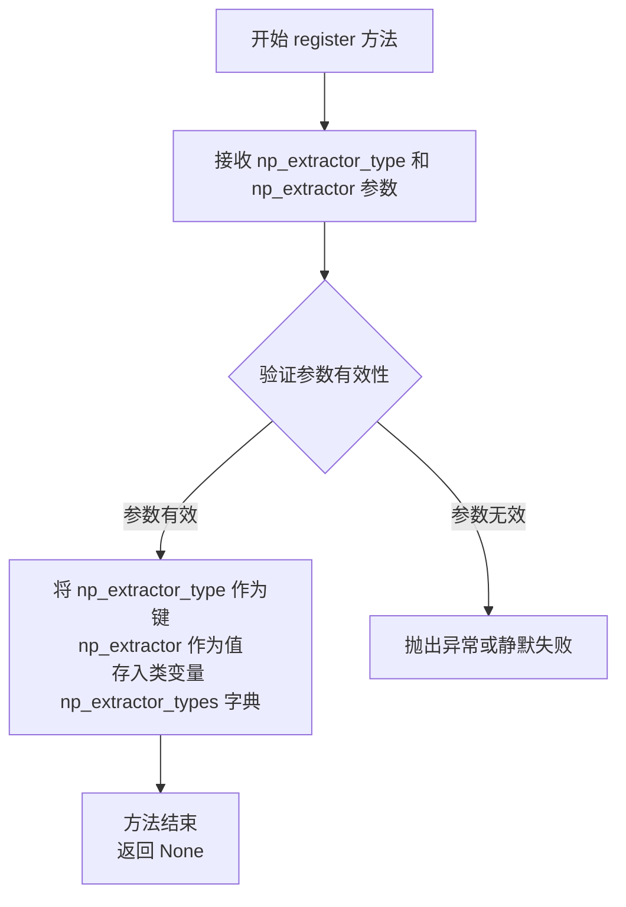
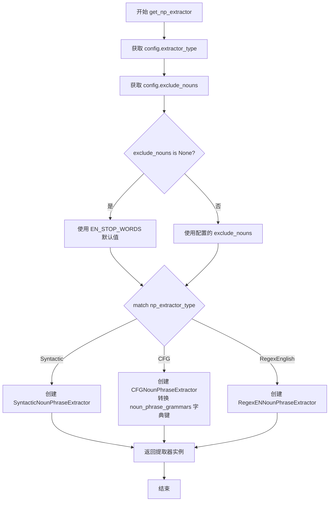

# `graphrag\packages\graphrag\graphrag\index\operations\build_noun_graph\np_extractors\factory.py` 详细设计文档

这是一个名词短语提取器工厂模块，通过工厂模式根据配置信息创建不同类型的名词短语提取器（语法分析提取器、上下文无关文法提取器、正则表达式提取器），用于从文本中提取名词短语。

## 整体流程



## 类结构

```
NounPhraseExtractorFactory (工厂类)
├── BaseNounPhraseExtractor (抽象基类)
│   ├── SyntacticNounPhraseExtractor
│   ├── CFGNounPhraseExtractor
│   └── RegexENNounPhraseExtractor
```

## 全局变量及字段


### `EN_STOP_WORDS`
    
英文停用词集合，用于在名词短语提取时排除常见无意义词汇

类型：`set[str]`
    


### `create_noun_phrase_extractor`
    
全局工厂函数，根据配置对象创建并返回对应的名词短语提取器实例

类型：`function(analyzer_config: TextAnalyzerConfig) -> BaseNounPhraseExtractor`
    


### `NounPhraseExtractorFactory.np_extractor_types`
    
类变量字典，存储已注册的名词短语提取器类型映射关系，以提取器类型字符串为键，提取器类类型为值

类型：`ClassVar[dict[str, type]]`
    


### `NounPhraseExtractorFactory.register`
    
类方法，用于注册新的名词短语提取器类型到工厂类的类型映射中

类型：`classmethod(np_extractor_type: str, np_extractor: type) -> None`
    


### `NounPhraseExtractorFactory.get_np_extractor`
    
类方法，根据提供的TextAnalyzerConfig配置对象，通过工厂模式创建并返回对应类型的名词短语提取器实例

类型：`classmethod(config: TextAnalyzerConfig) -> BaseNounPhraseExtractor`
    
    

## 全局函数及方法


### `create_noun_phrase_extractor`

创建名词短语提取器的顶层工厂函数，根据配置创建相应的提取器实例。

参数：

- `analyzer_config`：`TextAnalyzerConfig`，包含名词短语提取器的配置信息，如提取器类型、模型名称、排除词等

返回值：`BaseNounPhraseExtractor`，返回根据配置创建的名词短语提取器实例

#### 流程图



#### 带注释源码

```python
def create_noun_phrase_extractor(
    analyzer_config: TextAnalyzerConfig,
) -> BaseNounPhraseExtractor:
    """Create a noun phrase extractor from a configuration.
    
    根据配置创建一个名词短语提取器实例。
    该函数是工厂模式的入口点，通过NounPhraseExtractorFactory
    根据配置中的extractor_type创建相应的提取器。
    
    参数:
        analyzer_config: TextAnalyzerConfig配置对象，包含:
            - extractor_type: 提取器类型（Syntactic/CFG/RegexEnglish）
            - model_name: 模型名称
            - max_word_length: 最大词长度
            - include_named_entities: 是否包含命名实体
            - exclude_entity_tags: 排除的实体标签
            - exclude_pos_tags: 排除的词性标签
            - exclude_nouns: 排除的名词
            - word_delimiter: 词分隔符
            - noun_phrase_grammars: 名词短语语法（CFG类型使用）
            - noun_phrase_tags: 名词短语标签（CFG类型使用）
    
    返回:
        BaseNounPhraseExtractor: 
            返回具体提取器实例（SyntacticNounPhraseExtractor/
            CFGNounPhraseExtractor/RegexENNounPhraseExtractor），
            均可通过基类接口调用extract方法进行名词短语提取
    """
    # 委托给工厂类的get_np_extractor方法进行具体创建
    return NounPhraseExtractorFactory.get_np_extractor(analyzer_config)
```


### `NounPhraseExtractorFactory.register`

注册提取器类型，将提取器类型字符串映射到对应的提取器类，以便工厂能够根据配置创建相应的名词短语提取器。

参数：

- `np_extractor_type`：`str`，提取器类型的字符串标识符（如 "Syntactic"、"CFG"、"RegexEnglish" 等）
- `np_extractor`：`type`，名词短语提取器的类类型，必须继承自 `BaseNounPhraseExtractor`

返回值：`None`，该方法直接修改类变量 `np_extractor_types` 字典，不返回任何值

#### 流程图



#### 带注释源码

```python
@classmethod
def register(cls, np_extractor_type: str, np_extractor: type):
    """Register a vector store type.
    
    将提取器类型注册到工厂类的类变量字典中，使其可以通过 get_np_extractor 方法根据配置动态创建。
    
    参数:
        np_extractor_type: str - 提取器类型的字符串标识，用于在配置中指定使用哪种提取器
        np_extractor: type - 提取器的类类型，必须是 BaseNounPhraseExtractor 的子类
    
    返回:
        None - 直接修改类变量，不返回任何值
    """
    # 将提取器类型字符串和对应的提取器类存入类变量字典
    # 后续可通过 np_extractor_types[np_extractor_type] 获取对应的提取器类
    cls.np_extractor_types[np_extractor_type] = np_extractor
```

#### 设计说明

| 项目 | 说明 |
|------|------|
| **设计模式** | 工厂模式（Factory Pattern）+ 注册表模式（Registry Pattern） |
| **设计意图** | 通过注册机制解耦提取器类型与具体实现，支持动态扩展新的提取器 |
| **当前使用情况** | 在当前代码中未被显式调用注册（提取器类型通过枚举在 get_np_extractor 中硬编码），但预留了扩展接口 |
| **扩展性** | 可通过调用 `NounPhraseExtractorFactory.register("custom", CustomExtractor)` 添加自定义提取器 |
| **线程安全性** | 非线程安全，多线程环境下需考虑加锁 |


### `NounPhraseExtractorFactory.get_np_extractor`

该方法根据传入的 `TextAnalyzerConfig` 配置对象，通过匹配 `extractor_type` 字段创建并返回相应的名词短语提取器实例（Syntactic、CFG 或 RegexEnglish），同时处理停用词列表的默认配置。

参数：

- `config`：`TextAnalyzerConfig`，包含提取器类型、模型参数、词长限制、命名实体选项、排除标签、停用词表和词分隔符等配置信息

返回值：`BaseNounPhraseExtractor`，返回具体类型的名词短语提取器实例

#### 流程图



#### 带注释源码

```python
@classmethod
def get_np_extractor(cls, config: TextAnalyzerConfig) -> BaseNounPhraseExtractor:
    """Get the noun phrase extractor type from a string."""
    # 从配置中获取提取器类型
    np_extractor_type = config.extractor_type
    # 获取排除名词列表配置
    exclude_nouns = config.exclude_nouns
    # 如果未配置排除名词，则使用默认的英文停用词表
    if exclude_nouns is None:
        exclude_nouns = EN_STOP_WORDS
    
    # 根据提取器类型匹配并创建对应的提取器实例
    match np_extractor_type:
        case NounPhraseExtractorType.Syntactic:
            # 语法分析提取器：使用句法分析提取名词短语
            return SyntacticNounPhraseExtractor(
                model_name=config.model_name,
                max_word_length=config.max_word_length,
                include_named_entities=config.include_named_entities,
                exclude_entity_tags=config.exclude_entity_tags,
                exclude_pos_tags=config.exclude_pos_tags,
                exclude_nouns=exclude_nouns,
                word_delimiter=config.word_delimiter,
            )
        case NounPhraseExtractorType.CFG:
            # 上下文无关语法提取器：使用CFG规则提取名词短语
            # 将配置中的grammar键从逗号分隔字符串转换为元组
            grammars = {}
            for key, value in config.noun_phrase_grammars.items():
                grammars[tuple(key.split(","))] = value
            return CFGNounPhraseExtractor(
                model_name=config.model_name,
                max_word_length=config.max_word_length,
                include_named_entities=config.include_named_entities,
                exclude_entity_tags=config.exclude_entity_tags,
                exclude_pos_tags=config.exclude_pos_tags,
                exclude_nouns=exclude_nouns,
                word_delimiter=config.word_delimiter,
                noun_phrase_grammars=grammars,
                noun_phrase_tags=config.noun_phrase_tags,
            )
        case NounPhraseExtractorType.RegexEnglish:
            # 正则表达式提取器：使用英文正则规则提取名词短语
            return RegexENNounPhraseExtractor(
                exclude_nouns=exclude_nouns,
                max_word_length=config.max_word_length,
                word_delimiter=config.word_delimiter,
            )
```

---

## 完整类信息：`NounPhraseExtractorFactory`

### 类描述

`NounPhraseExtractorFactory` 是一个工厂类，用于根据配置创建不同类型的名词短语提取器实例。

### 类字段

- `np_extractor_types`：`ClassVar[dict[str, type]]`，存储已注册的提取器类型映射表

### 类方法

| 方法名 | 参数 | 返回值 | 描述 |
|--------|------|--------|------|
| `register` | `np_extractor_type: str`, `np_extractor: type` | `None` | 注册新的提取器类型到工厂 |
| `get_np_extractor` | `config: TextAnalyzerConfig` | `BaseNounPhraseExtractor` | 根据配置获取对应的提取器实例 |

---

## 关键组件信息

| 组件名称 | 一句话描述 |
|----------|------------|
| `TextAnalyzerConfig` | 文本分析配置模型，包含提取器类型和各种提取参数 |
| `BaseNounPhraseExtractor` | 名词短语提取器基类，定义提取器接口 |
| `SyntacticNounPhraseExtractor` | 基于句法分析的名词短语提取器 |
| `CFGNounPhraseExtractor` | 基于上下文无关语法的名词短语提取器 |
| `RegexENNounPhraseExtractor` | 基于英文正则表达式的名词短语提取器 |
| `EN_STOP_WORDS` | 英文停用词表，默认的排除名词列表 |

---

## 潜在技术债务与优化空间

1. **Match 语句无默认分支**：当前 `match` 语句未处理未知 `extractor_type` 的情况，应添加 `case _:` 抛出明确异常
2. **Grammar 键转换逻辑**：CFG 提取器的 `grammars` 键转换逻辑与工厂职责不符，可考虑下移至 `CFGNounPhraseExtractor` 内部
3. **未使用的注册机制**：`np_extractor_types` 类变量和 `register` 方法未被实际使用，可考虑移除或实现动态注册能力
4. **停用词硬编码**：默认停用词 `EN_STOP_WORDS` 仅支持英文，缺乏国际化支持

---

## 其它项目

### 设计目标与约束

- **单一职责**：工厂类仅负责根据配置实例化提取器，不涉及提取逻辑
- **开闭原则**：通过注册机制支持扩展新的提取器类型（虽然当前未启用）
- **类型安全**：使用 `match` 语句确保类型字面量匹配

### 错误处理

- 若 `config.extractor_type` 为未知枚举值且无默认分支，可能导致运行时无返回值错误
- 若 `config` 为 `None`，将在访问 `config.extractor_type` 时抛出 `AttributeError`

### 外部依赖

- `graphrag.config.enums.NounPhraseExtractorType`：提取器类型枚举
- `graphrag.config.models.extract_graph_nlp_config.TextAnalyzerConfig`：配置模型
- 各具体提取器类（位于 `np_extractors` 子包）

## 关键组件


### NounPhraseExtractorFactory

工厂类，用于创建名词短语提取器。通过注册机制管理多种提取器类型，并根据配置返回相应的提取器实例。

### create_noun_phrase_extractor

全局函数，接收TextAnalyzerConfig配置对象，返回BaseNounPhraseExtractor类型的名词短语提取器实例。

### NounPhraseExtractorType.Syntactic (句法分析提取器)

基于句法分析的名词短语提取器，支持命名实体识别、词性标注过滤、词长限制和自定义分隔符。

### NounPhraseExtractorType.CFG (上下文无关语法提取器)

基于上下文无关语法的名词短语提取器，支持自定义名词短语语法规则和词性标签配置。

### NounPhraseExtractorType.RegexEnglish (正则表达式提取器)

基于正则表达式的英文名词短语提取器，适用于简单的名词短语提取场景。

### EN_STOP_WORDS

英文停用词集合，用于过滤常见的无意义名词。

### TextAnalyzerConfig

配置模型，包含extractor_type、model_name、max_word_length、include_named_entities、exclude_entity_tags、exclude_pos_tags、exclude_nouns、word_delimiter、noun_phrase_grammars、noun_phrase_tags等参数。

### BaseNounPhraseExtractor

名词短语提取器的抽象基类，定义了提取器的接口规范。


## 问题及建议


### 已知问题

- **未使用的类变量和注册机制**：`np_extractor_types` 类变量和 `register` 方法被定义但在 `get_np_extractor` 方法中完全没有使用，注册机制可能被遗忘或为未来设计但未完成。
- **缺少默认情况处理**：`match-case` 语句没有 `case _` 默认分支，当传入未定义的 `np_extractor_type` 时会隐式返回 `None`，可能导致调用者获得意外的空值而难以调试。
- **隐式的字符串分割逻辑**：CFG 语法处理中使用 `key.split(",")` 假设逗号为分隔符，这一约定没有任何文档说明，增加理解成本。
- **类型安全风险**：当 `match-case` 不匹配时方法返回 `None`（隐式），但方法签名声明返回 `BaseNounPhraseExtractor` 类型，类型注解与实际行为不符。
- **配置验证缺失**：依赖 `TextAnalyzerConfig` 对象的多个属性，但没有对必要字段进行验证，错误的配置可能导致运行时错误而非提前失败。

### 优化建议

- 添加 `case _` 分支抛出明确的 `ValueError` 或 `NotImplementedError` 异常，提供友好的错误信息告知支持的提取器类型。
- 如果注册机制是计划功能，完成其实现；如果不打算使用，删除以减少代码混淆。
- 将隐式的逗号分隔逻辑提取为明确的配置解析方法或文档化这一约定。
- 在方法开头添加配置验证，检查必要字段是否存在以及类型是否正确。
- 考虑为 `NounPhraseExtractorType` 枚举添加文档注释，说明每种提取器的用途。

## 其它


### 设计目标与约束

设计目标：提供一种灵活的可扩展的名词短语提取机制，通过配置驱动的方式支持多种提取算法（句法分析、上下文无关语法、正则表达式），同时保持接口一致性。约束：必须继承BaseNounPhraseExtractor基类，配置参数通过TextAnalyzerConfig统一传入，默认使用英文停用词过滤。

### 错误处理与异常设计

当传入的np_extractor_type不在枚举NounPhraseExtractorType支持范围内时，Python的match语句会返回None导致提取器创建失败；当前实现未显式处理未知类型，建议添加TypeError或ValueError异常抛出，并提供清晰的错误提示信息。

### 数据流与状态机

数据流：外部传入TextAnalyzerConfig配置对象 → create_noun_phrase_extractor函数 → NounPhraseExtractorFactory.get_np_extractor方法 → 根据config.extractor_type匹配并实例化对应的提取器 → 返回BaseNounPhraseExtractor实例。状态机为简单的线性状态：配置解析 → 提取器类型匹配 → 提取器实例化。

### 外部依赖与接口契约

外部依赖：graphrag.config模块提供NounPhraseExtractorType枚举和TextAnalyzerConfig配置模型；graphrag.index.operations.build_noun_graph.np_extractors包下的各个提取器实现类。接口契约：所有提取器必须继承BaseNounPhraseExtractor并实现其抽象方法，工厂方法get_np_extractor返回类型为BaseNounPhraseExtractor。

### 配置参数说明

config.extractor_type指定提取器类型（Syntactic/CFG/RegexEnglish）；config.exclude_nouns指定排除的名词列表，默认为EN_STOP_WORDS；config.model_name指定使用的模型名称；config.max_word_length指定最大词长限制；config.include_named_entities指定是否包含命名实体；config.exclude_entity_tags和config.exclude_pos_tags指定排除的实体和词性标签；config.noun_phrase_grammars和config.noun_phrase_tags用于CFG提取器的语法规则配置。

### 使用示例

```python
config = TextAnalyzerConfig(
    extractor_type=NounPhraseExtractorType.Syntactic,
    model_name="en_core_web_sm",
    max_word_length=50,
    include_named_entities=True
)
extractor = create_noun_phrase_extractor(config)
noun_phrases = extractor.extract("The quick brown fox jumps over the lazy dog")
```

### 性能考虑

当前实现为按需实例化，每次调用create_noun_phrase_extractor都会创建新的提取器实例，若在高频场景下使用建议添加单例缓存机制；CFG提取器在每次调用时会遍历noun_phrase_grammars字典进行键转换，可预计算grammars字典以优化性能。

### 安全性考虑

代码本身不直接涉及用户输入处理，安全性风险较低；但需要注意config.model_name参数可能涉及外部模型调用，需确保模型来源可信以防止模型注入攻击。

### 测试策略

单元测试应覆盖：三种提取器类型的正常实例化；config.exclude_nouns为None时的默认值处理；工厂注册机制的功能；异常场景下（如未知extractor_type）的行为验证。

### 版本兼容性

当前代码依赖graphrag包内部的多个模块，需确保与graphrag.config、graphrag.index版本的兼容性，建议在文档中明确标注支持的graphrag版本范围。
    