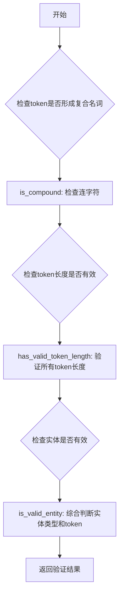
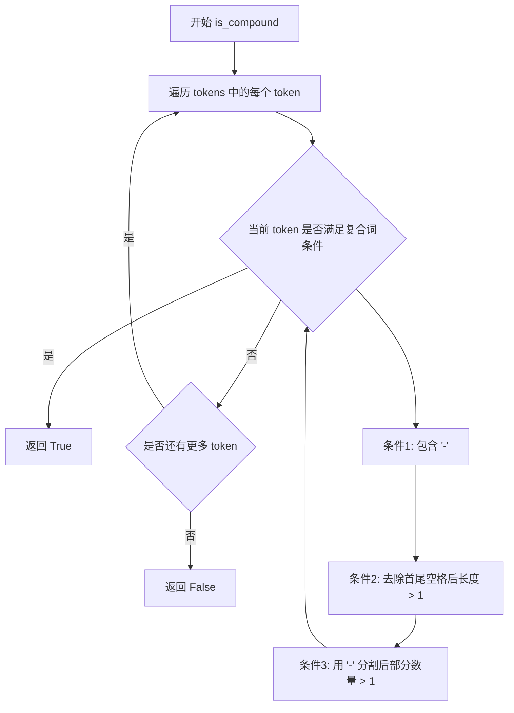
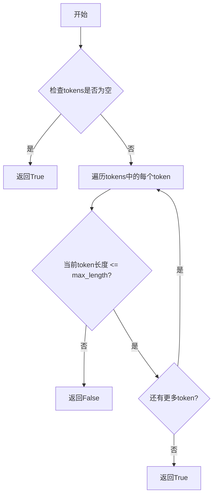

# `graphrag\packages\graphrag\graphrag\index\operations\build_noun_graph\np_extractors\np_validator.py` 详细设计文档

提供用于标记和过滤名词短语的工具函数，包括复合名词检测、token长度验证和实体有效性检查

## 整体流程



## 类结构

```
无类层次结构（模块级函数集合）
```

## 全局变量及字段


### `is_compound`
    
检查token列表是否形成复合名词短语（包含连字符的词）

类型：`function`
    


### `has_valid_token_length`
    
检查所有token是否在指定的最大长度限制内

类型：`function`
    


### `is_valid_entity`
    
验证实体是否符合过滤规则，排除CARDINAL和ORDINAL类型（除非有多个token或为复合词）

类型：`function`
    


    

## 全局函数及方法


### `is_compound`

检查给定的词符列表是否形成复合名词短语（compound noun phrase）。

参数：

- `tokens`：`list[str]`，要进行复合词检查的词符列表

返回值：`bool`，如果词符列表中包含由连字符连接的复合词则返回 `True`，否则返回 `False`

#### 流程图



#### 带注释源码

```python
def is_compound(tokens: list[str]) -> bool:
    """List of tokens forms a compound noun phrase."""
    # 使用 any() 检查列表中是否存在满足复合词条件的 token
    # 复合词定义需要同时满足三个条件：
    # 1. token 中包含连字符 '-'
    # 2. 去除首尾空格后长度大于 1（避免单个 '-' 字符）
    # 3. 用连字符分割后的部分数量大于 1（至少有兩個单词组成）
    return any(
        "-" in token and len(token.strip()) > 1 and len(token.strip().split("-")) > 1
        for token in tokens
    )
```


### `has_valid_token_length`

检查所有token是否在指定的最大长度范围内。

参数：

- `tokens`：`list[str]` - 要检查的token列表
- `max_length`：`int` - 允许的最大token长度

返回值：`bool` - 如果所有token的长度都小于等于max_length返回True，否则返回False

#### 流程图



#### 带注释源码

```python
def has_valid_token_length(tokens: list[str], max_length: int) -> bool:
    """
    检查所有token是否在指定的最大长度范围内。
    
    该函数通过遍历tokens列表，验证每个token的长度是否不超过max_length。
    如果所有token都满足长度约束，则返回True；只要有一个token超过长度限制，就返回False。
    
    参数:
        tokens: list[str] - 要检查的token列表
        max_length: int - 允许的最大token长度
    
    返回:
        bool - 所有token长度都 <= max_length 返回 True，否则返回 False
    """
    # 使用all()内置函数检查所有token是否都满足长度条件
    # len(token) <= max_length 对每个token进行长度验证
    return all(len(token) <= max_length for token in tokens)
```


### `is_valid_entity`

该函数用于验证实体（entity）是否有效，通过检查实体类型与对应的 token 列表长度或复合词特性来判断合法性。

参数：

- `entity`：`tuple[str, str]`，实体元组，包含实体文本和实体类型（NER标签），其中 `entity[1]` 表示实体类型
- `tokens`：`list[str]`，实体对应的 token 列表

返回值：`bool`，返回 True 表示实体有效，返回 False 表示实体无效

#### 流程图

```mermaid
flowchart TD
    A[开始] --> B{entity[1] not in<br/>['CARDINAL', 'ORDINAL']?}
    B -->|是| C{len(tokens) > 0?}
    C -->|是| D[返回 True]
    C -->|否| E[返回 False]
    B -->|否| F{entity[1] in<br/>['CARDINAL', 'ORDINAL']?}
    F --> G{len(tokens) > 1<br/>or is_compound(tokens)?}
    G -->|是| D
    G -->|否| E
```

#### 带注释源码

```python
def is_valid_entity(entity: tuple[str, str], tokens: list[str]) -> bool:
    """
    检查实体是否有效。
    
    验证规则：
    - 如果实体类型不是 CARDINAL 或 ORDINAL，则 token 列表必须非空
    - 如果实体类型是 CARDINAL 或 ORDINAL，则 token 列表需要满足以下条件之一：
      1. 包含多个 token（长度 > 1）
      2. 是一个复合词（包含连字符且符合复合词规则）
    
    参数:
        entity: 实体元组，(实体文本, 实体类型)
        tokens: 实体对应的 token 列表
    
    返回:
        bool: 实体是否有效
    """
    # 条件1：实体类型非 CARDINAL/ORDINAL 时，只需 tokens 非空
    condition_non_cardinal = entity[1] not in ["CARDINAL", "ORDINAL"] and len(tokens) > 0
    
    # 条件2：实体类型为 CARDINAL/ORDINAL 时，需要多个 token 或为复合词
    condition_cardinal = (
        entity[1] in ["CARDINAL", "ORDINAL"]
        and (len(tokens) > 1 or is_compound(tokens))
    )
    
    # 满足任一条件则实体有效
    return condition_non_cardinal or condition_cardinal
```

## 关键组件


## 一段话描述

该代码模块提供了一组用于标记和过滤名词短语的工具函数，主要用于NLP场景下的实体识别验证，通过检查token的组成形式、长度限制以及实体类型来判定名词短语或实体是否有效。

## 文件的整体运行流程

该模块为静态工具函数模块，不涉及运行时流程。各函数独立接受输入参数并返回布尔值或校验结果：

1. `is_compound()` 接收token列表，检查是否存在包含连字符的复合词
2. `has_valid_token_length()` 接收token列表和最大长度限制，验证所有token长度是否符合要求
3. `is_valid_entity()` 接收实体元组和token列表，综合判断实体是否有效

## 全局函数详细信息

### is_compound

| 属性 | 值 |
|------|-----|
| 名称 | is_compound |
| 参数名称 | tokens |
| 参数类型 | list[str] |
| 参数描述 | 待检查的token列表 |
| 返回值类型 | bool |
| 返回值描述 | 如果列表中存在有效的连字符复合词则返回True，否则返回False |

**带注释源码：**

```python
def is_compound(tokens: list[str]) -> bool:
    """List of tokens forms a compound noun phrase."""
    return any(
        "-" in token and len(token.strip()) > 1 and len(token.strip().split("-")) > 1
        for token in tokens
    )
```

### has_valid_token_length

| 属性 | 值 |
|------|-----|
| 名称 | has_valid_token_length |
| 参数名称 | tokens, max_length |
| 参数类型 | list[str], int |
| 参数描述 | tokens为待检查的token列表，max_length为最大允许的token长度 |
| 返回值类型 | bool |
| 返回值描述 | 如果所有token长度都不超过max_length则返回True，否则返回False |

**带注释源码：**

```python
def has_valid_token_length(tokens: list[str], max_length: int) -> bool:
    """Check if all tokens have valid length."""
    return all(len(token) <= max_length for token in tokens)
```

### is_valid_entity

| 属性 | 值 |
|------|-----|
| 名称 | is_valid_entity |
| 参数名称 | entity, tokens |
| 参数类型 | tuple[str, str], list[str] |
| 参数描述 | entity为(实体文本, 实体类型)元组，tokens为对应的token列表 |
| 返回值类型 | bool |
| 返回值描述 | 根据实体类型和token情况返回实体是否有效的判定结果 |

**带注释源码：**

```python
def is_valid_entity(entity: tuple[str, str], tokens: list[str]) -> bool:
    """Check if the entity is valid."""
    return (entity[1] not in ["CARDINAL", "ORDINAL"] and len(tokens) > 0) or (
        entity[1] in ["CARDINAL", "ORDINAL"]
        and (len(tokens) > 1 or is_compound(tokens))
    )
```

## 关键组件信息

### 复合词检测组件

用于识别包含连字符的复合名词短语，是判断ORDINAL和CARDINAL类型实体有效性的重要依据。

### 实体有效性验证组件

综合实体类型（CARDINAL/ORDINAL/其他）和token列表状态进行有效性判断，是模块的核心业务逻辑。

### Token长度校验组件

提供通用的token长度限制检查功能，用于输入验证。

## 潜在的技术债务或优化空间

1. **函数职责边界模糊**：`is_valid_entity`函数同时处理了多种实体类型的验证逻辑，可考虑拆分为更细粒度的验证函数
2. **缺少单元测试**：作为工具模块，未附带对应的单元测试代码
3. **硬编码值**：实体类型列表`["CARDINAL", "ORDINAL"]`硬编码在函数内部，可提取为常量或配置
4. **参数校验缺失**：各函数未对输入参数进行空值或类型校验
5. **文档注释不完整**：缺少模块级docstring说明该模块的完整用途和使用场景

## 其它项目

### 设计目标与约束

- 目标：提供轻量级的名词短语过滤标记工具
- 约束：仅处理简单的字符串列表和元组，无外部依赖

### 错误处理与异常设计

- 当前实现无异常处理机制
- 建议：调用方应确保传入参数类型正确，函数内部可添加类型检查并抛出TypeError

### 数据流与状态机

- 单向数据流：输入token列表/实体 → 校验函数 → 布尔结果
- 无状态设计：各函数均为纯函数，不涉及状态管理

### 外部依赖与接口契约

- 无外部依赖
- 接口契约：所有函数接收明确类型的输入参数，返回布尔值


## 问题及建议


### 已知问题

- **过度简化的复合词检测**：函数`is_compound`仅通过连字符"-"判断复合词，忽略了空格、下划线等其他复合词形式（如"New York"、"data_processing"），导致漏检
- **魔法数字**：代码中存在未解释的硬编码数值（如`len(token.strip().split("-")) > 1`中的`1`），降低可读性
- **类型提示不够精确**：`entity: tuple[str, str]`使用泛型tuple，未明确标注元组中两个元素的含义（类型和值）
- **边界条件处理不完善**：`is_compound`中对空字符串的检查逻辑`len(token.strip()) > 1`在token为空时返回False，但未明确处理空列表输入的场景
- **可读性较差**：`is_valid_entity`函数包含复杂的三元运算符嵌套，逻辑分支较深，理解成本高

### 优化建议

- 将复合词检测逻辑抽取为可配置的策略模式，支持多种复合词规则（如连字符、空格、下划线等）
- 使用Enum或常量类替代硬编码的实体类型字符串（"CARDINAL"、"ORDINAL"），提高可维护性
- 使用`NamedTuple`或`dataclass`替代简单tuple作为entity类型，增强类型安全性和代码可读性
- 简化`is_valid_entity`的逻辑，将条件分支提取为独立的辅助函数（如`is_excluded_entity_type`）
- 为关键逻辑添加详细的文档字符串，说明边界条件和业务规则
- 考虑添加输入验证（如空列表检查），或使用装饰器进行参数校验

## 其它


### 设计目标与约束

本模块的核心设计目标是为名词短语标记提供基础的验证过滤功能，确保输入的实体和token符合预定义的有效性规则。设计约束包括：输入必须是字符串列表或元组形式，不支持其他复杂数据结构；token长度检查存在最大值限制，默认未指定需调用方传入；实体类型检查限定于CARDINAL和ORDINAL两种类型。

### 错误处理与异常设计

本模块采用宽松的错误处理策略，对于无效输入主要通过返回布尔值进行处理而非抛出异常。具体包括：空列表输入时is_compound返回False，has_valid_token_length对空列表返回True（符合all函数的默认行为），is_valid_entity对空tokens根据实体类型返回相应的布尔值。不存在需要显式处理的异常情况，调用方需自行确保传入参数类型正确。

### 数据流与状态机

数据流主要分为三条路径：第一条为is_compound函数接收token列表，遍历检查是否存在包含连字符的复合词，返回布尔值；第二条为has_valid_token_length函数接收token列表和最大长度阈值，验证每个token长度是否满足要求，返回布尔值；第三条为is_valid_entity函数接收实体元组和token列表，综合判断实体类型与token特征的合法性，返回布尔值。不存在状态机的概念，所有函数均为无状态纯函数。

### 外部依赖与接口契约

本模块为纯工具函数模块，无外部依赖项，仅使用Python标准库。接口契约如下：is_compound函数接受list[str]类型参数，返回bool类型；has_valid_token_length函数接受list[str]和int类型参数，返回bool类型；is_valid_entity函数接受tuple[str, str]和list[str]类型参数，返回bool类型。所有函数均不修改输入参数，为引用透明函数。

### 性能考虑

由于函数逻辑简单且为纯计算型，无IO操作，主要性能开销集中在列表遍历和字符串操作上。is_compound函数使用any()进行短路求值，has_valid_token_length使用all()进行短路求值，均为最优实现。is_valid_entity中is_compound的调用在条件分支内，属于必要计算。整体时间复杂度为O(n)，空间复杂度为O(1)。

### 可测试性

本模块具有极高的可测试性，所有函数均为确定性纯函数，无副作用。测试用例应覆盖：is_compound函数需测试包含连字符的复合词、不包含连字符的普通词、单个token、空白token、空列表等场景；has_valid_token_length需测试全部token符合长度、存在超长token、空列表等场景；is_valid_entity需测试CARDINAL和ORDINAL类型与普通实体类型的不同组合。

### 使用示例

```python
# 检查复合词
tokens1 = ["well-known"]
tokens2 = ["simple"]
print(is_compound(tokens1))  # True
print(is_compound(tokens2))  # False

# 检查token长度
tokens = ["abc", "de"]
print(has_valid_token_length(tokens, 5))  # True

# 检查实体有效性
entity1 = ("2024", "CARDINAL")
entity2 = ("first", "ORDINAL")
entity3 = ("Microsoft", "ORG")
print(is_valid_entity(entity1, tokens1))  # True (复合词)
print(is_valid_entity(entity2, ["first"]))  # False (ORDINAL但非复合词且单token)
print(is_valid_entity(entity3, ["Microsoft"]))  # True (非CARDINAL/ORDINAL)
```

### 配置项

本模块无显式配置项，但has_valid_token_length函数通过max_length参数提供运行时配置能力，建议在生产环境中根据具体业务需求设置合理的token长度阈值。


    