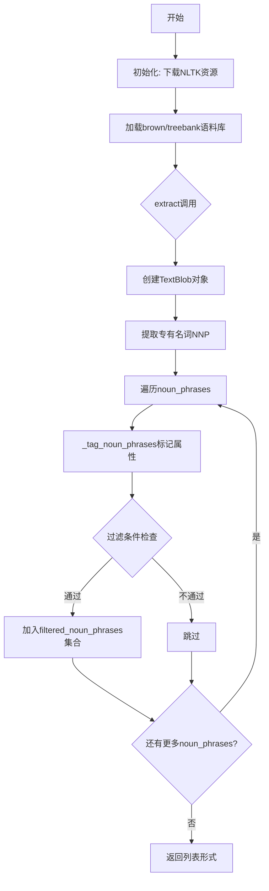
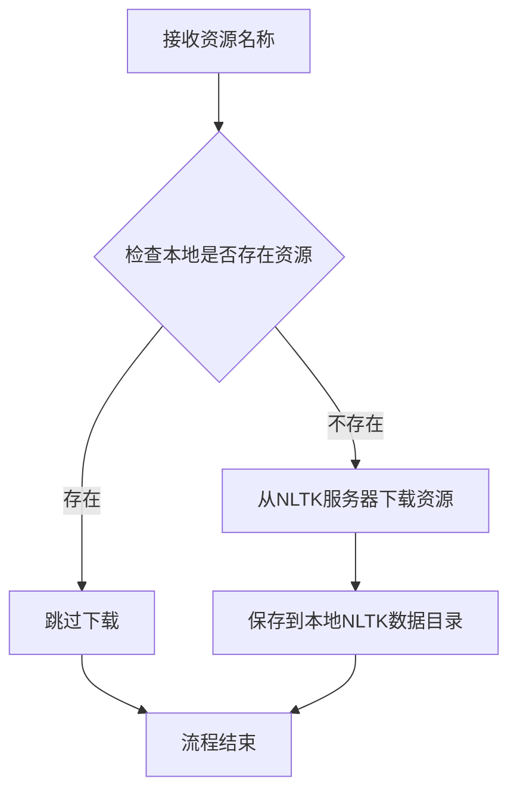
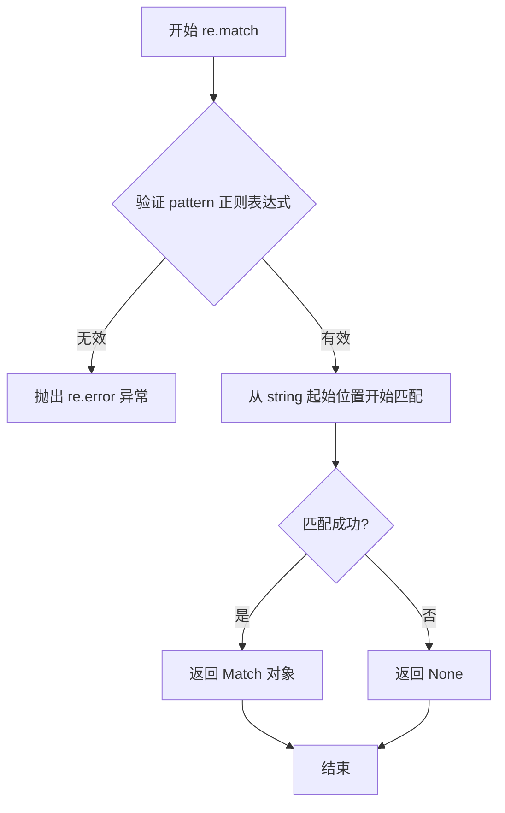
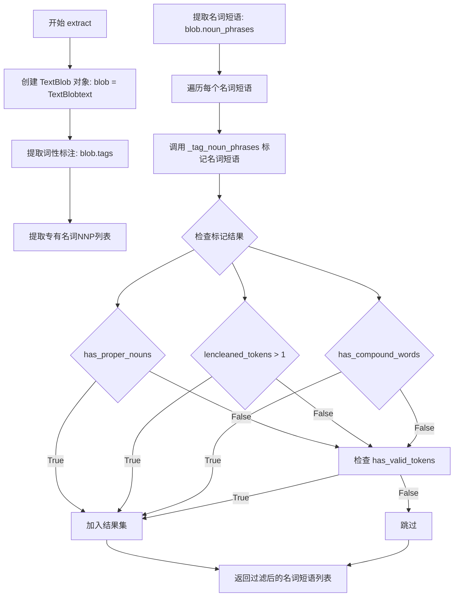
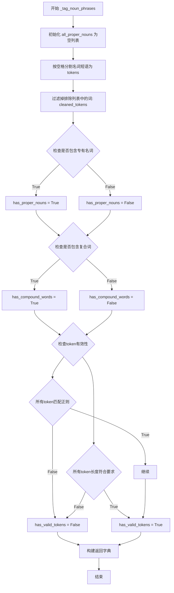
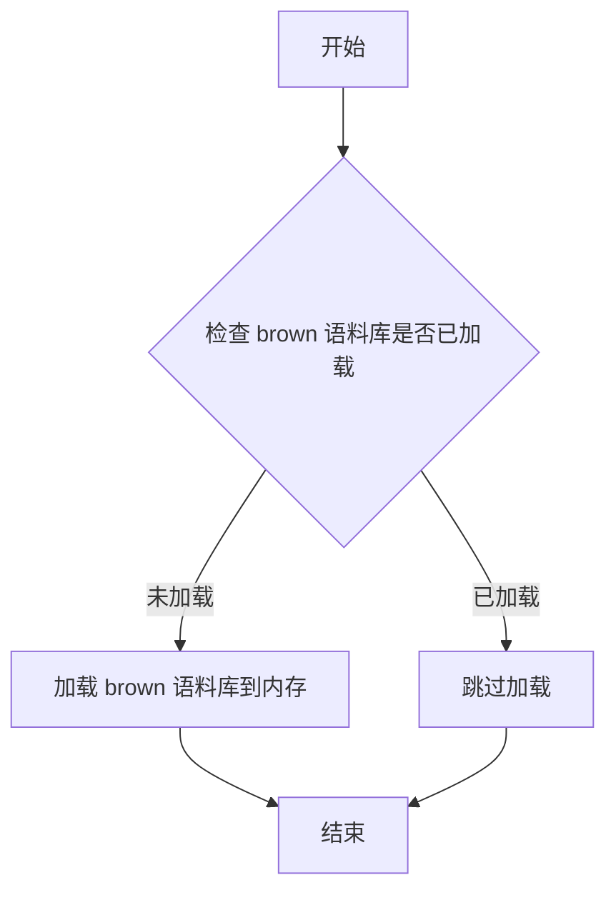
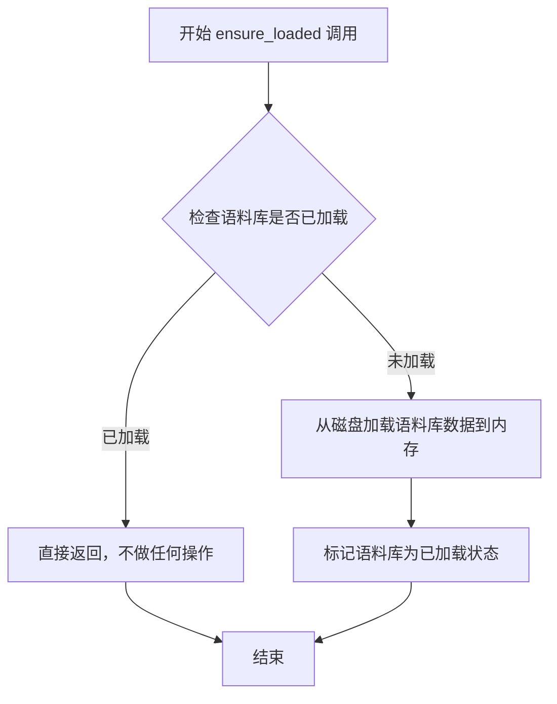
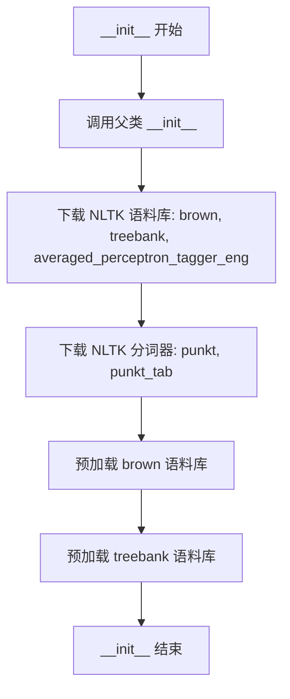
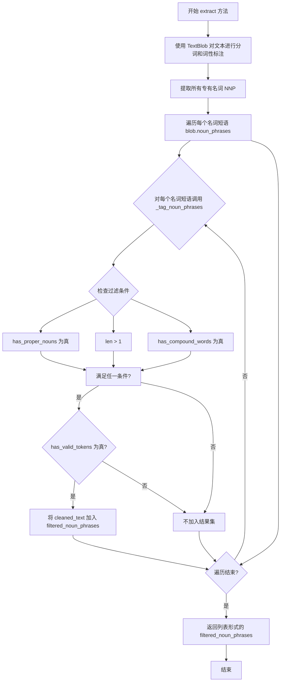

# `graphrag\packages\graphrag\graphrag\index\operations\build_noun_graph\np_extractors\regex_extractor.py` 详细设计文档

基于正则表达式的英文名词短语提取器，使用TextBlob的NP提取器和NLTK语料库来检测、标记和过滤文本中的名词短语，支持排除特定名词、限制词长和自定义分隔符。

## 整体流程



## 类结构

```
BaseNounPhraseExtractor (抽象基类)
└── RegexENNounPhraseExtractor
```

## 全局变量及字段


### `RegexENNounPhraseExtractor.exclude_nouns`
    
需要排除的名词列表

类型：`list[str]`
    


### `RegexENNounPhraseExtractor.max_word_length`
    
最大词长限制

类型：`int`
    


### `RegexENNounPhraseExtractor.word_delimiter`
    
词分隔符

类型：`str`
    
    

## 全局函数及方法


### `download_if_not_exists`

该函数用于在本地不存在指定资源时自动下载NLTK语料库和分词器资源，确保后续NLP处理流程的正常运行。

参数：

-  `resource_name`：`str`，需要下载的资源名称（如"brown"、"treebank"、"punkt"等NLTK数据包）

返回值：`None`，该函数直接执行下载操作，不返回任何值。

#### 流程图



#### 带注释源码

```python
# 该函数定义位于 graphrag/index/operations/build_noun_graph/np_extractors/resource_loader.py
# 但在当前代码段中仅显示导入和调用关系

# 调用示例（在 RegexENNounPhraseExtractor.__init__ 中）:
download_if_not_exists("brown")          # 下载布朗语料库
download_if_not_exists("treebank")       # 下载树库语料库
download_if_not_exists("averaged_perceptron_tagger_eng")  # 下载英语POS标注器
download_if_not_exists("punkt")          # 下载punkt分词器
download_if_not_exists("punkt_tab")      # 下载punkt_tab分词器数据
```


### `re.split`

`re.split` 是 Python 标准库 `re` 模块中的内置函数，用于通过正则表达式模式分割字符串。在该代码中，它被用于将名词短语字符串按空白字符进行分割。

参数：

- `pattern`：`str`，正则表达式模式，这里使用 `r"[\s]+"` 匹配一个或多个空白字符
- `string`：`str`，要分割的字符串，这里传入 `noun_phrase`（名词短语字符串）
- `maxsplit`：`int | None`，可选参数，表示最大分割次数，默认为 `None`（不限制）

返回值：`list[str]`，返回分割后的字符串列表

#### 流程图

```mermaid
flowchart TD
    A[开始 re.split] --> B{输入参数}
    B --> C[pattern: r&quot;[\s]+&quot;]
    B --> D[string: noun_phrase]
    B --> E[maxsplit: None]
    C --> F[正则表达式编译]
    D --> F
    E --> F
    F --> G[按模式匹配分割字符串]
    G --> H[过滤空字符串]
    H --> I[返回非空字符串列表]
    I --> J[结束]
    
    style C fill:#f9f,color:#000
    style D fill:#f9f,color:#000
    style I fill:#9f9,color:#000
```

#### 带注释源码

```python
# 使用 re.split 将名词短语按空白字符分割成 tokens 列表
# pattern: r"[\s]+" 表示匹配一个或多个空白字符（空格、制表符、换行符等）
# string: noun_phrase 是输入的名词短语字符串
# maxsplit: 未指定，默认为 None，表示分割所有匹配项
tokens = [token for token in re.split(r"[\s]+", noun_phrase) if len(token) > 0]
# 上述代码等价于: tokens = noun_phrase.split()
# 但 re.split 支持更复杂的正则表达式模式，如同时按多种分隔符分割
# 例如: re.split(r"[\s,;]+", text) 可以同时按空格、逗号、分号分割

# 在此代码中的具体用途：
# 1. 将名词短语字符串分割成单词列表
# 2. 过滤掉空字符串（len(token) > 0）
# 3. 便于后续对每个 token 进行词性检查和过滤处理
```


### `re.match`

`re.match` 是 Python 标准库 `re` 模块中的全局函数，用于从字符串的**起始位置**尝试匹配正则表达式模式。如果匹配成功，返回一个匹配对象（`Match`）；如果匹配失败，返回 `None`。需要注意的是，`re.match` 只检查字符串的开头，而不检查整个字符串。

参数：

- `pattern`：`str`，正则表达式模式字符串，用于定义要匹配的文本模式
- `string`：`str`，要匹配的源字符串
- `flags`：`int`（可选），正则表达式标志位，用于控制匹配行为，如忽略大小写、多行模式等

返回值：`Match[str] | None`，匹配成功返回 `re.Match` 对象，失败返回 `None`

#### 流程图



#### 带注释源码

```python
# re.match 函数在 graphrag 代码中的实际使用示例

# 从 TextBlob 提取的名词短语中筛选出符合规则的 token
# 检查每个 token 是否只包含字母、数字和连字符，且不包含换行符
has_valid_tokens = all(
    re.match(r"^[a-zA-Z0-9\-]+\n?$", token) for token in cleaned_tokens
) and all(len(token) <= self.max_word_length for token in cleaned_tokens)

# 解释：
# 1. r"^[a-zA-Z0-9\-]+\n?$" 是正则表达式模式
#    - ^ 表示字符串开始
#    - [a-zA-Z0-9\-]+ 匹配一个或多个字母、数字或连字符
#    - \n? 表示可选的单个换行符
#    - $ 表示字符串结束
# 2. re.match 从 token 的起始位置进行匹配
# 3. all() 函数确保所有 token 都符合规则
# 4. 同时检查所有 token 的长度不超过 max_word_length
```


### `RegexENNounPhraseExtractor.extract`

该方法使用 TextBlob 库基于正则表达式和词性标注来提取文本中的名词短语，通过过滤规则（包含专有名词、复合词、单词长度等）得到最终的名词短语列表。

参数：

-  `text`：`str`，待提取名词短语的文本内容

返回值：`list[str]`，提取后的名词短语列表

#### 流程图



#### 带注释源码

```python
def extract(
    self,
    text: str,
) -> list[str]:
    """
    Extract noun phrases from text using regex patterns.

    Args:
        text: Text.

    Returns: List of noun phrases.
    """
    # 使用 TextBlob 创建文本对象，TextBlob 内部使用 regex POS tagger
    # 和上下文无关文法来检测名词短语
    blob = TextBlob(text)
    
    # 从词性标注中提取所有专有名词（NNP）
    # 返回格式: [(word, tag), ...]
    # 例如: [('John', 'NNP'), ('NYC', 'NNP')]
    proper_nouns = [token[0].upper() for token in blob.tags if token[1] == "NNP"]
    
    # 获取 TextBlob 检测到的所有名词短语
    # noun_phrases 属性返回检测到的名词短语列表
    tagged_noun_phrases = [
        self._tag_noun_phrases(chunk, proper_nouns)
        for chunk in blob.noun_phrases
    ]

    # 过滤规则：
    # 1. 包含专有名词 OR
    # 2. 多个token组成的名词短语 OR
    # 3. 包含复合词（如 hyphenated words）
    # 且必须通过有效性验证
    filtered_noun_phrases = set()
    for tagged_np in tagged_noun_phrases:
        if (
            tagged_np["has_proper_nouns"]
            or len(tagged_np["cleaned_tokens"]) > 1
            or tagged_np["has_compound_words"]
        ) and tagged_np["has_valid_tokens"]:
            filtered_noun_phrases.add(tagged_np["cleaned_text"])
    
    # 返回去重后的名词短语列表
    return list(filtered_noun_phrases)
```

### `_tag_noun_phrases`

该方法对单个名词短语进行属性标记，用于后续过滤判断。检查是否包含专有名词、复合词，并验证token的有效性。

参数：

-  `noun_phrase`：`str`，待标记的名词短语字符串
-  `all_proper_nouns`：`list[str] | None`，可选的专有名词列表，默认为 None

返回值：`dict[str, Any]`，包含以下键的字典：

- `cleaned_tokens`: list[str] - 清理后的token列表
- `cleaned_text`: str - 合并后的文本
- `has_proper_nouns`: bool - 是否包含专有名词
- `has_compound_words`: bool - 是否包含复合词
- `has_valid_tokens`: bool - 所有token是否有效

#### 流程图



#### 带注释源码

```python
def _tag_noun_phrases(
    self, noun_phrase: str, all_proper_nouns: list[str] | None = None
) -> dict[str, Any]:
    """Extract attributes of a noun chunk, to be used for filtering."""
    # 处理空专有名词列表
    if all_proper_nouns is None:
        all_proper_nouns = []
    
    # 使用正则按空格分割名词短语，去除空字符串
    # 例如: "New York University" -> ["New", "York", "University"]
    tokens = [token for token in re.split(r"[\s]+", noun_phrase) if len(token) > 0]
    
    # 过滤掉排除列表中的名词
    # exclude_nouns 在构造函数中定义，需要过滤掉一些无意义的词
    cleaned_tokens = [
        token for token in tokens if token.upper() not in self.exclude_nouns
    ]
    
    # 检查是否包含专有名词（大小写不敏感匹配）
    has_proper_nouns = any(
        token.upper() in all_proper_nouns for token in cleaned_tokens
    )
    
    # 检查是否包含复合词（包含连字符且有多个部分）
    # 例如: "state-of-the-art", "machine-learning"
    has_compound_words = any(
        "-" in token
        and len(token.strip()) > 1
        and len(token.strip().split("-")) > 1
        for token in cleaned_tokens
    )
    
    # 验证token有效性：
    # 1. 仅包含字母、数字、连字符
    # 2. 不超过最大单词长度限制
    has_valid_tokens = all(
        re.match(r"^[a-zA-Z0-9\-]+\n?$", token) for token in cleaned_tokens
    ) and all(len(token) <= self.max_word_length for token in cleaned_tokens)
    
    # 构建返回字典
    return {
        "cleaned_tokens": cleaned_tokens,
        "cleaned_text": self.word_delimiter
        .join(token for token in cleaned_tokens)
        .replace("\n", "")
        .upper(),
        "has_proper_nouns": has_proper_nouns,
        "has_compound_words": has_compound_words,
        "has_valid_tokens": has_valid_tokens,
    }
```


### nltk.corpus.brown.ensure_loaded

确保 brown 语料库已加载到内存中。该方法用于解决 NLTK 语料库的惰性加载问题，在多线程环境下预先加载语料库以避免竞态条件。

参数：

- 无

返回值：`None`，无返回值，仅确保语料库数据已加载到内存

#### 流程图



#### 带注释源码

```python
# NLTK 库中的方法调用
# 位于 RegexENNounPhraseExtractor.__init__ 方法中

# 在 __init__ 方法中调用以预加载语料库
nltk.corpus.brown.ensure_loaded()
nltk.corpus.treebank.ensure_loaded()

# 目的：避免多线程环境下的惰性加载竞态条件
# 说明：
# - NLTK 的语料库默认采用惰性加载机制
# - 在多线程并发场景下，多个线程可能同时触发语料库加载
# - 这会导致竞态条件和潜在的加载错误
# - 显式调用 ensure_loaded() 可在初始化阶段完成加载，确保后续使用安全
```


### `nltk.corpus.treebank.ensure_loaded`

该函数是 NLTK 语料库加载器的方法，用于确保 `treebank` 语料库数据已完整加载到内存中。在多线程环境下，使用 noun phrase extractor 时预先加载语料库可以避免因延迟加载导致的竞争条件（race conditions）。

参数：无显式参数（隐式参数为 `self`，即 corpus 读取器实例）

返回值：`None`，无返回值（该方法直接作用于内部状态，确保语料库加载）

#### 流程图



#### 带注释源码

```python
# NLTK 库内部实现逻辑（简化版）
# 实际源码位于 nltk/corpus/reader/api.py 或类似位置

class CorpusReader:
    """语料库读取器基类"""
    
    def ensure_loaded(self):
        """
        确保语料库数据已加载到内存中。
        
        该方法主要用于：
        1. 预加载语料库以提高后续访问速度
        2. 避免多线程环境下的延迟加载竞争条件
        3. 验证语料库数据完整性
        
        Returns:
            None: 无返回值，直接修改内部状态
        """
        # 检查是否需要加载
        if not self._loaded:
            # 执行实际的加载操作
            self._load()
        
        # 标记为已加载状态，防止重复加载
        self._loaded = True

# 在代码中的实际调用方式：
# nltk.corpus.treebank.ensure_loaded()
# 
# 作用：预加载 Treebank 语料库
# 原因：TextBlob 的词性标注器依赖于 NLTK 的 treebank 语料库，
#      在多线程环境下，如果采用延迟加载，可能会出现竞争条件
#      导致某些线程无法正确访问语料库数据
```


### `RegexENNounPhraseExtractor.__init__`

初始化正则表达式英文名词短语提取器，下载必要的NLTK语料库和分词器，并预加载资源以避免多线程环境下的竞态条件。

参数：

- `exclude_nouns`：`list[str]`，需要排除的名词列表，用于过滤不希望出现的名词
- `max_word_length`：`int`，提取单词的最大字符长度限制
- `word_delimiter`：`str`，用于连接单词的分隔符

返回值：`None`，无返回值（构造函数）

#### 流程图



#### 带注释源码

```python
def __init__(
    self,
    exclude_nouns: list[str],
    max_word_length: int,
    word_delimiter: str,
):
    """
    Noun phrase extractor for English based on TextBlob's fast NP extractor, which uses a regex POS tagger and context-free grammars to detect noun phrases.

    NOTE: This is the extractor used in the first bencharmking of LazyGraphRAG but it only works for English.
    It is much faster but likely less accurate than the syntactic parser-based extractor.
    TODO: Reimplement this using SpaCy to remove TextBlob dependency.

    Args:
        max_word_length: Maximum length (in character) of each extracted word.
        word_delimiter: Delimiter for joining words.
    """
    # 调用父类 BaseNounPhraseExtractor 的构造函数
    # 传递 model_name=None（因为使用正则表达式而非模型）
    super().__init__(
        model_name=None,
        max_word_length=max_word_length,
        exclude_nouns=exclude_nouns,
        word_delimiter=word_delimiter,
    )
    
    # 下载 NLTK 语料库资源
    # brown: Brown 语料库，用于词性标注训练
    download_if_not_exists("brown")
    # treebank: Penn Treebank 语料库
    download_if_not_exists("treebank")
    # averaged_perceptron_tagger_eng: 英语感知器词性标注器
    download_if_not_exists("averaged_perceptron_tagger_eng")

    # 下载 NLTK 分词器资源
    # punkt: Punkt 分词器模型
    download_if_not_exists("punkt")
    # punkt_tab: Punkt 分词器的 tab 分割数据
    download_if_not_exists("punkt_tab")

    # 预加载语料库以避免多线程运行时的竞态条件导致的延迟加载问题
    # 确保语料库在初始化时完全加载到内存中
    nltk.corpus.brown.ensure_loaded()
    nltk.corpus.treebank.ensure_loaded()
```


### `RegexENNounPhraseExtractor.extract`

该方法使用基于正则表达式的名词短语提取器，通过TextBlob库提取文本中的名词短语，并利用词性标注和自定义过滤规则筛选出符合条件的高质量名词短语，适用于英语文本处理场景。

参数：

-  `text`：`str`，需要进行名词短语提取的原始文本

返回值：`list[str]`，过滤后的名词短语列表

#### 流程图



#### 带注释源码

```python
def extract(
    self,
    text: str,
) -> list[str]:
    """
    Extract noun phrases from text using regex patterns.

    Args:
        text: Text.

    Returns: List of noun phrases.
    """
    # 使用 TextBlob 对文本进行分词、词性标注和名词短语提取
    blob = TextBlob(text)
    
    # 从词性标注结果中提取所有专有名词（NNP = Noun, Proper, Singular）
    # 例如：'John', 'New York' 等
    proper_nouns = [token[0].upper() for token in blob.tags if token[1] == "NNP"]
    
    # 对每个名词短语进行标记处理，生成包含多个属性的字典
    # 包括：是否包含专有名词、是否有复合词、是否有效等
    tagged_noun_phrases = [
        self._tag_noun_phrases(chunk, proper_nouns)
        for chunk in blob.noun_phrases
    ]

    # 初始化结果集合（使用 set 自动去重）
    filtered_noun_phrases = set()
    
    # 遍历所有标记后的名词短语，应用过滤规则
    for tagged_np in tagged_noun_phrases:
        # 过滤条件（三选一）：
        # 1. 包含专有名词（如人名、地名）
        # 2. 有多个 token（排除单词）
        # 3. 包含复合词（如 ice-cream, son-in-law）
        # 同时必须满足 has_valid_tokens（只包含字母数字连字符，且长度符合要求）
        if (
            tagged_np["has_proper_nouns"]
            or len(tagged_np["cleaned_tokens"]) > 1
            or tagged_np["has_compound_words"]
        ) and tagged_np["has_valid_tokens"]:
            # 将符合条件的名词短语加入结果集
            filtered_noun_phrases.add(tagged_np["cleaned_text"])
    
    # 返回列表形式的结果
    return list(filtered_noun_phrases)
```


### RegexENNounPhraseExtractor._tag_noun_phrases

该方法用于从给定的名词短语中提取多个属性（是否包含专有名词、是否有复合词、是否有效等），以供后续过滤使用。它接收一个名词短语字符串和可选的专有名词列表，返回一个包含清洗后tokens、清洗后文本及各属性标志的字典。

参数：

- `noun_phrase`：`str`，待处理的名词短语文本
- `all_proper_nouns`：`list[str] | None = None`，可选的专有名词列表，用于判断名词短语中是否包含专有名词

返回值：`dict[str, Any]`，包含以下键值对：
- `cleaned_tokens`：清洗后的 token 列表（去除了排除的名词）
- `cleaned_text`：清洗后并用词分隔符连接转为大写的文本
- `has_proper_nouns`：布尔值，表示是否包含专有名词
- `has_compound_words`：布尔值，表示是否包含复合词（带连字符的词）
- `has_valid_tokens`：布尔值，表示所有 token 是否有效（仅包含字母数字和连字符，且长度未超过最大限制）

#### 流程图

```mermaid
flowchart TD
    A[开始 _tag_noun_phrases] --> B{all_proper_nouns is None?}
    B -->|是| C[all_proper_nouns = []]
    B -->|否| D[保持原值]
    C --> E[使用正则按空格分割 noun_phrase]
    D --> E
    E --> F[过滤空 tokens]
    F --> G[清理 tokens: 移除 exclude_nouns 中的词]
    G --> H[检查 has_proper_nouns: 是否有 token 在 all_proper_nouns 中]
    H --> I[检查 has_compound_words: 是否有 token 包含 '-' 且有有效分割]
    I --> J[检查 has_valid_tokens: 所有 token 匹配正则并长度<=max_word_length]
    J --> K[构建 cleaned_text: 用 word_delimiter 连接 cleaned_tokens, 去除换行, 转大写]
    K --> L[返回包含所有属性的字典]
```

#### 带注释源码

```python
def _tag_noun_phrases(
    self, noun_phrase: str, all_proper_nouns: list[str] | None = None
) -> dict[str, Any]:
    """Extract attributes of a noun chunk, to be used for filtering."""
    # 如果未提供专有名词列表，则初始化为空列表
    if all_proper_nouns is None:
        all_proper_nouns = []
    
    # 使用正则表达式按空白字符分割名词短语为 tokens，过滤空字符串
    tokens = [token for token in re.split(r"[\s]+", noun_phrase) if len(token) > 0]
    
    # 清理 tokens：移除在排除列表中的名词（不区分大小写比较）
    cleaned_tokens = [
        token for token in tokens if token.upper() not in self.exclude_nouns
    ]
    
    # 检查是否包含专有名词：清理后的 token 中有任意一个在专有名词列表中
    has_proper_nouns = any(
        token.upper() in all_proper_nouns for token in cleaned_tokens
    )
    
    # 检查是否包含复合词：token 包含连字符、去除空格后长度>1、分割后部分数>1
    has_compound_words = any(
        "-" in token
        and len(token.strip()) > 1
        and len(token.strip().split("-")) > 1
        for token in cleaned_tokens
    )
    
    # 检查所有 tokens 是否有效：
    # 1. 每个 token 匹配仅包含字母、数字、连字符的正则
    # 2. 每个 token 长度不超过 max_word_length
    has_valid_tokens = all(
        re.match(r"^[a-zA-Z0-9\-]+\n?$", token) for token in cleaned_tokens
    ) and all(len(token) <= self.max_word_length for token in cleaned_tokens)
    
    # 构建返回字典：包含清洗后的 tokens、清洗后的文本、各属性标志
    return {
        "cleaned_tokens": cleaned_tokens,
        "cleaned_text": self.word_delimiter
        .join(token for token in cleaned_tokens)
        .replace("\n", "")
        .upper(),
        "has_proper_nouns": has_proper_nouns,
        "has_compound_words": has_compound_words,
        "has_valid_tokens": has_valid_tokens,
    }
```


### `RegexENNounPhraseExtractor.__str__`

返回该提取器的字符串表示形式，主要用于缓存键（cache key）生成，以便在图谱构建过程中唯一标识不同的提取器配置。

参数：

- `self`：`RegexENNounPhraseExtractor`，隐式的当前实例参数，代表调用该方法的提取器对象本身

返回值：`str`，返回包含提取器类型标识（regex_en）、排除名词列表、最大词长度和词分隔符的字符串，可作为缓存键使用

#### 流程图

```mermaid
flowchart TD
    A[开始 __str__ 方法] --> B[获取 self.exclude_nouns]
    B --> C[获取 self.max_word_length]
    C --> D[获取 self.word_delimiter]
    D --> E[组装格式化字符串: regex_en_{exclude_nouns}_{max_word_length}_{word_delimiter}]
    E --> F[返回字符串]
```

#### 带注释源码

```python
def __str__(self) -> str:
    """
    Return string representation of the extractor, used for cache key generation.
    
    返回该提取器的字符串表示形式，主要用于缓存键生成。
    该方法将提取器的关键配置参数组合成一个唯一的字符串标识，
    以便在图谱构建的缓存机制中区分不同的提取器实例配置。
    
    Returns:
        str: 包含提取器类型和配置参数的字符串，格式为:
             regex_en_{exclude_nouns}_{max_word_length}_{word_delimiter}
             例如: regex_en_['stop_word']_50_-
    """
    return f"regex_en_{self.exclude_nouns}_{self.max_word_length}_{self.word_delimiter}"
```

## 关键组件


### RegexENNounPhraseExtractor

基于正则表达式的英语名词短语提取器，继承自BaseNounPhraseExtractor，使用TextBlob的NLP功能结合自定义过滤规则从英文文本中提取名词短语。

### extract方法

从给定文本中提取名词短语的核心方法，使用TextBlob进行初始提取，然后通过词性标注识别专有名词，最后根据多个条件（专有名词存在、复合词、词数、有效token）进行过滤。

### _tag_noun_phrases方法

对名词短语进行标记和属性提取的辅助方法，解析每个名词短语的token，检测是否包含专有名词、复合词，并验证token是否符合字母数字和长度要求。

### __init__方法

构造函数，初始化提取器参数并预加载NLTK语料库（brown、treebank、averaged_perceptron_tagger_eng、punkt、punkt_tab），解决多线程环境下的惰性加载竞态条件问题。

### NLTK资源预加载机制

通过nltk.corpus确保语料库在初始化时完全加载，避免多线程并发执行时因惰性加载导致的竞态条件和潜在错误。

### 过滤逻辑组件

包含has_proper_nouns（专有名词检测）、has_compound_words（复合词检测，如带连字符的词）、has_valid_tokens（token有效性验证：仅字母数字和连字符，不超过最大长度）等过滤条件。

### TextBlob依赖

使用TextBlob进行词性标注（NNP标签）和名词短语提取，属于外部NLP库依赖。

### __str__方法

返回提取器的字符串表示，用于缓存键生成，格式为"regex_en_{exclude_nouns}_{max_word_length}_{word_delimiter}"。

### BaseNounPhraseExtractor基类

提供抽象接口和基础实现，定义名词短语提取器的标准契约，包括model_name、max_word_length、exclude_nouns、word_delimiter等配置参数。

### download_if_not_exists函数

从resource_loader模块导入的资源下载函数，确保所需的NLTK数据和模型在需要时自动下载。


## 问题及建议


### 已知问题

- **TODO未完成**：代码中存在TODO注释计划使用SpaCy重写以移除TextBlob依赖，但截至目前尚未实现，导致仍依赖外部不稳定的TextBlob库
- **类型注解不完整**：`blob.tags`和`blob.noun_phrases`使用了`# type: ignore`绕过类型检查，降低了代码的类型安全性
- **NLTK资源下载冗余**：在`__init__`方法中下载多个NLTK资源（brown、treebank、averaged_perceptron_tagger_eng、punkt、punkt_tab），导致实例初始化耗时较长
- **潜在的竞态条件**：尽管使用`ensure_loaded()`尝试避免多线程环境下的竞态条件，但在高并发场景下仍可能存在资源加载问题
- **异常处理缺失**：没有对NLTK下载失败、TextBlob处理异常等情况进行捕获和处理，可能导致程序崩溃
- **硬编码正则表达式**：正则表达式模式`r"[\s]+"`和`r"^[a-zA-Z0-9\-]+\n?$"`硬编码在方法内部，降低了可维护性和可配置性

### 优化建议

- **完成TODO重构**：按照原计划使用SpaCy重写该提取器，移除对TextBlob的依赖，提升功能和性能
- **完善类型注解**：为TextBlob的返回对象添加完整的类型注解或创建自定义类型别名，避免使用`# type: ignore`
- **延迟加载NLTK资源**：将资源下载移至首次使用时执行，或提供配置选项允许用户预加载
- **添加异常处理**：为网络下载、文件IO等可能失败的操作添加try-except异常处理，提升鲁棒性
- **提取配置常量**：将正则表达式模式提取为类常量或配置参数，提高可维护性
- **添加日志记录**：在资源下载、关键操作节点添加日志，便于问题排查和监控

## 其它


### 设计目标与约束

**设计目标**：实现一个基于正则表达式的英文名词短语提取器，用于从英文文本中提取名词短语，支持过滤排除特定名词、处理复合词、验证词长等功能，为图谱构建中的名词图构建操作提供基础能力。

**设计约束**：仅支持英文文本处理；依赖TextBlob和NLTK库；模型名称固定为None（表示不使用神经网络模型）；最大词长度和单词分隔符可配置；排除名词列表可自定义。

### 错误处理与异常设计

**资源下载异常**：download_if_not_exists函数可能抛出网络异常或存储空间不足错误，调用方需处理NLTK资源下载失败的情况。

**NLTK语料库加载异常**：nltk.corpus.brown.ensure_loaded()和nltk.corpus.treebank.ensure_loaded()可能抛出LookupError或OSError，需确保语料库完整性。

**输入验证**：extract方法接收text参数，需确保传入字符串类型，非字符串输入可能导致TextBlob处理失败或产生不可预期结果。

**正则表达式异常**：re.split和re.match在极端输入情况下可能存在性能问题或返回非预期结果，但风险较低。

### 数据流与状态机

**数据输入**：外部调用extract(text: str)方法，传入待处理的英文文本字符串。

**处理流程状态**：
1. 初始状态 - 接收原始文本
2. TextBlob解析状态 - 将文本转换为TextBlob对象并提取名词短语
3. 专有名词识别状态 - 标记名词短语中的专有名词
4. 标记状态 - 对每个名词短语进行属性标记（has_proper_nouns, has_compound_words, has_valid_tokens）
5. 过滤状态 - 根据标记属性过滤符合条件的名词短语
6. 输出状态 - 返回去重后的名词短语列表

**状态转换条件**：每个状态独立执行，最终通过过滤条件判断是否加入结果集。

### 外部依赖与接口契约

**直接依赖**：
- `textblob`：英文NLP处理，提取名词短语和词性标注
- `nltk`：语料库和分词器，包含brown、treebank、averaged_perceptron_tagger_eng、punkt、punkt_tab
- `re`：正则表达式处理
- `typing`：类型注解支持

**内部依赖**：
- `graphrag.index.operations.build_noun_graph.np_extractors.base.BaseNounPhraseExtractor`：基类，定义名词短语提取器接口
- `graphrag.index.operations.build_noun_graph.np_extractors.resource_loader.download_if_not_exists`：NLTK资源下载工具函数

**接口契约**：
- 构造函数参数：exclude_nouns(list[str]), max_word_length(int), word_delimiter(str)
- extract方法：输入text(str)，输出list[str]
- __str__方法：返回缓存键字符串
- 继承自BaseNounPhraseExtractor，需实现extract和__str__方法

### 性能考虑

**预加载优化**：在__init__中预加载NLTK语料库，避免多线程环境下的竞态条件和延迟加载问题。

**集合去重**：使用set存储过滤后的名词短语，自动去重，提高效率。

**内存占用**：名词短语存储在内存中，大文本场景需考虑批量处理或流式处理。

### 安全性考虑

**输入验证**：_tag_noun_phrases方法使用正则表达式`^[a-zA-Z0-9\-]+\n?$`验证token有效性，防止注入攻击，但当前实现未对输入进行严格校验。

**敏感信息**：代码本身不处理敏感数据，但提取的名词短语可能包含敏感信息，需调用方负责后续处理。

### 测试策略

**单元测试**：针对extract方法测试不同输入场景（空字符串、单名词、复合词、包含专有名词等）；针对_tag_noun_phrases方法测试各种边界条件。

**集成测试**：测试与BaseNounPhraseExtractor基类的集成；测试NLTK资源加载流程。

**性能测试**：大量文本处理性能测试；多线程并发调用测试。

### 配置文件

**运行时配置**（通过构造函数）：
- exclude_nouns：需要排除的名词列表，默认由调用方指定
- max_word_length：最大词长度，默认值由调用方指定
- word_delimiter：单词分隔符，默认值由调用方指定

**NLTK配置**：语料库存储路径遵循NLTK默认配置，可通过NLTK自定义数据路径。

### 使用示例

```python
# 初始化提取器
extractor = RegexENNounPhraseExtractor(
    exclude_nouns=["example", "test"],
    max_word_length=50,
    word_delimiter="_"
)

# 提取名词短语
text = "The quick brown fox jumps over the lazy dog. Microsoft and Google are tech companies."
noun_phrases = extractor.extract(text)
print(noun_phrases)
# 输出示例：['QUICK_BROWN_FOX', 'LAZY_DOG', 'MICROSOFT', 'GOOGLE', 'TECH_COMPANIES']

# 获取缓存键
cache_key = str(extractor)
```

### 版本历史

**v1.0.0** (2024) - 初始版本，基于TextBlob实现英文名词短语提取，包含基本的过滤和验证功能，TODO标记需使用SpaCy重写以移除TextBlob依赖。

### 参考文献

- TextBlob文档：https://textblob.readthedocs.io/
- NLTK文档：https://www.nltk.org/
- LazyGraphRAG论文关于名词短语提取的描述
- 正则表达式POS tagger和上下文无关文法在名词短语提取中的应用研究

    