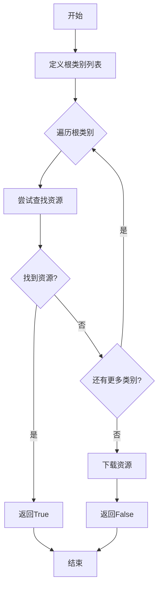
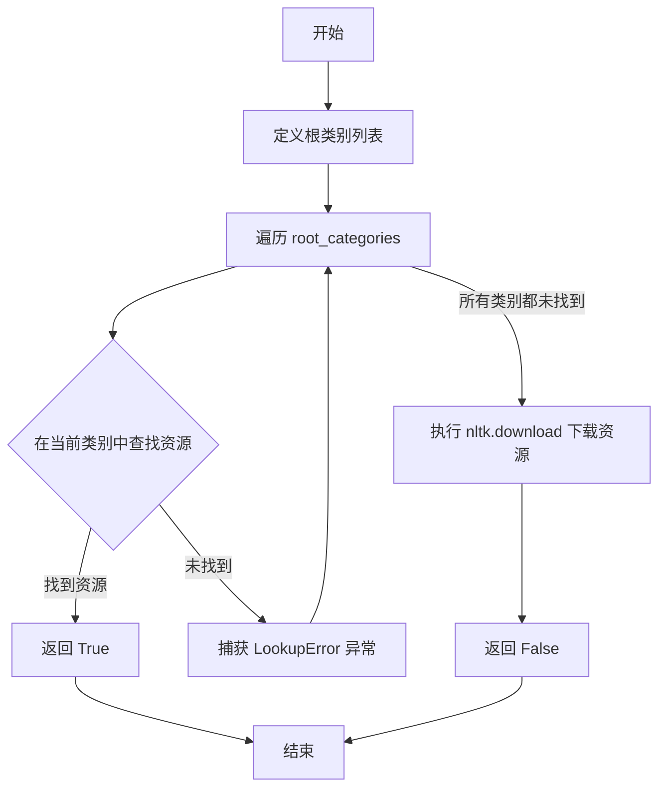
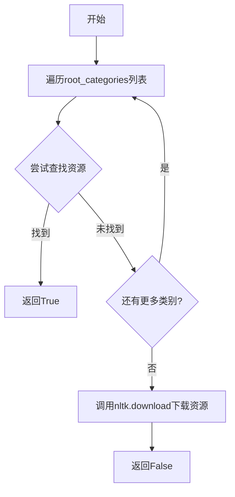

# `graphrag\packages\graphrag\graphrag\index\operations\build_noun_graph\np_extractors\resource_loader.py` 详细设计文档

这是一个NLTK工具函数模块，提供download_if_not_exists函数用于检查并下载NLTK资源（如语料库、标记器、词性标注器等），避免重复下载。

## 整体流程



## 类结构

```
无类层次结构（模块级函数）
```

## 全局变量及字段


### `root_categories`
    
定义NLTK资源的根类别列表，包含corpora、tokenizers、taggers等14个类别，用于在下载前查找资源是否已存在

类型：`List[str]`
    


    

## 全局函数及方法


### `download_if_not_exists`

该函数用于检查并下载 NLTK 资源，当资源不存在时自动下载，已存在则跳过下载，避免重复下载。

参数：

- `resource_name`：`str`，要下载的 NLTK 资源名称

返回值：`bool`，返回 True 表示资源已存在（无需下载），返回 False 表示已执行下载操作

#### 流程图



#### 带注释源码

```python
def download_if_not_exists(resource_name) -> bool:
    """Download nltk resources if they haven't been already."""
    # 定义 NLTK 资源的所有可能根类别
    root_categories = [
        "corpora",
        "tokenizers",
        "taggers",
        "chunkers",
        "classifiers",
        "stemmers",
        "stopwords",
        "languages",
        "frequent",
        "gate",
        "models",
        "mt",
        "sentiment",
        "similarity",
    ]
    # 遍历所有根类别，尝试查找资源
    for category in root_categories:
        try:
            # 如果在某个类别中找到资源，停止查找并返回 True
            nltk.find(f"{category}/{resource_name}")
            return True  # noqa: TRY300
        except LookupError:
            # 未找到时继续尝试下一个类别
            continue

    # 所有类别都未找到，执行下载
    nltk.download(resource_name)
    return False
```

## 关键组件


### 一段话描述

该代码是一个NLTK工具模块，提供了 `download_if_not_exists` 函数，用于检查并自动下载NLTK资源（如语料库、标记器、标注器等），避免在资源缺失时出现LookupError。

### 文件的整体运行流程

1. 定义一个包含所有可能NLTK资源类别的列表 `root_categories`
2. 函数 `download_if_not_exists` 接收资源名称作为参数
3. 遍历所有类别，使用 `nltk.find()` 尝试查找资源
4. 如果找到资源，立即返回True
5. 如果所有类别都未找到，调用 `nltk.download()` 下载资源
6. 返回False表示执行了下载操作

### 函数详细信息

#### download_if_not_exists

- **名称**: download_if_not_exists
- **参数**: 
  - resource_name (str): 要检查/下载的NLTK资源名称
- **参数描述**: 指定需要下载的NLTK资源标识符
- **返回值类型**: bool
- **返回值描述**: 如果资源已存在返回True，否则返回False（表示执行了下载）

**Mermaid流程图**:


**带注释源码**:
```python
def download_if_not_exists(resource_name) -> bool:
    """Download nltk resources if they haven't been already."""
    # 定义所有可能的NLTK资源根类别
    root_categories = [
        "corpora",      # 语料库
        "tokenizers",   # 分词器
        "taggers",      # 词性标注器
        "chunkers",     # 组块分析器
        "classifiers",  # 分类器
        "stemmers",     # 词干提取器
        "stopwords",    # 停用词
        "languages",    # 语言数据
        "frequent",     # 频繁词
        "gate",         # GATE数据
        "models",       # 模型
        "mt",           # 机器翻译
        "sentiment",    # 情感分析
        "similarity",   # 相似度
    ]
    
    # 遍历每个类别查找资源
    for category in root_categories:
        try:
            # 如果找到资源，停止查找并返回
            nltk.find(f"{category}/{resource_name}")
            return True  # noqa: TRY300
        except LookupError:
            continue  # 继续查找下一个类别

    # 所有类别都未找到，执行下载
    nltk.download(resource_name)
    return False
```

### 关键组件信息

### root_categories

预定义的NLTK资源类别列表，涵盖所有可能的资源类型，用于遍历查找资源。

### nltk.find

NLTK内置函数，用于在本地查找指定资源是否存在。

### nltk.download

NLTK内置函数，用于从NLTK服务器下载指定资源。

### LookupError

Python内置异常，当nltk.find找不到资源时抛出。

### 潜在的技术债务或优化空间

1. **缺少缓存机制**: 每次调用都会遍历所有类别查找资源，可以添加本地缓存已检查过的资源状态
2. **硬编码的类别列表**: root_categories列表是硬编码的，可能随着NLTK版本更新而变化
3. **静默下载**: 调用nltk.download时没有进度显示或日志输出
4. **错误处理不足**: 没有处理网络异常、下载失败等情况
5. **重复遍历**: 如果资源在后面的类别中，每次都需要遍历整个列表
6. **文档缺失**: 缺少模块级文档说明其用途和依赖

### 其它项目

**设计目标与约束**:
- 目标：避免NLTK资源缺失导致的LookupError
- 约束：依赖NLTK库的正确安装

**错误处理与异常设计**:
- 使用try-except捕获LookupError
- 未处理网络下载失败、磁盘空间不足等异常

**数据流与状态机**:
- 简单状态机：查找中 → 找到/下载完成

**外部依赖与接口契约**:
- 依赖：nltk包
- 输入：资源名称字符串
- 输出：布尔值表示是否已存在


## 问题及建议


### 已知问题

-   **硬编码的类别列表**：root_categories 列表被硬编码，如果 NLTK 未来添加新类别，需要手动更新代码，缺乏可扩展性
-   **异常处理不全面**：仅捕获 LookupError，未处理网络错误、权限问题、磁盘空间不足等其他可能的异常，可能导致程序意外终止
-   **下载失败无反馈**：nltk.download() 调用失败时没有异常处理或错误返回值，调用者无法得知下载是否成功
-   **返回值语义混淆**：返回 True 表示资源已存在，返回 False 表示已下载，但这种布尔值语义不够直观，易被误用
-   **缺少日志记录**：没有任何日志输出，难以追踪下载过程和排查问题
-   **重复遍历效率低**：每次调用都会遍历所有类别查找资源，即使资源已确认存在，仍继续循环检查后续类别
-   **无超时控制**：网络下载操作未设置超时，可能导致程序长时间阻塞在网络请求上

### 优化建议

-   将 root_categories 改为从 nltk.data 对象动态获取可用类别，或从配置文件加载，提高可维护性
-   添加更全面的异常捕获（如 Exception），并在下载失败时抛出自定义异常或返回错误码
-   在下载前添加重试机制和超时设置，提升网络不稳定场景的鲁棒性
-   考虑返回枚举类型或包含状态信息的对象，替代当前的布尔返回值，提高语义清晰度
-   添加日志记录（使用 logging 模块），记录资源查找和下载的详细过程
-   优化查找逻辑：在找到资源后立即 break 跳出循环，避免不必要的遍历
-   考虑添加下载路径配置、代理设置等参数，增强函数的灵活性
-   添加单元测试，覆盖资源已存在、资源需下载、下载失败等场景

## 其它


### 设计目标与约束

本模块的核心设计目标是在使用NLTK进行名词短语提取时，确保所需的NLP资源已正确下载并可用。设计约束包括：1）仅在资源缺失时触发下载，避免重复下载；2）支持多种NLTK资源类别（corpora、tokenizers、taggers等）；3）函数设计为无状态、线程不安全的工具函数；4）依赖外部NLTK服务和网络连接。

### 错误处理与异常设计

本模块的异常处理机制主要依赖NLTK库的LookupError异常。当nltk.find()无法定位资源时抛出LookupError，函数通过try-except捕获并继续遍历其他类别。若所有类别均未找到资源，则执行nltk.download()进行下载，可能抛出网络相关异常（如ConnectionError、TimeoutError）或NLTK下载器异常。函数本身返回bool值：True表示资源已存在（无需下载），False表示进行了下载操作。调用方需根据返回值判断后续处理逻辑。当前设计未对下载失败进行重试机制或详细错误报告。

### 数据流与状态机

数据流处理流程如下：1）输入参数resource_name（字符串类型）进入函数；2）遍历root_categories列表中的14个NLTK资源类别；3）对每个类别执行nltk.find()检查资源是否存在；4）若找到资源，立即返回True并终止函数；5）若所有类别均未找到，执行nltk.download()下载资源；6）返回False表示进行了下载操作。状态机包含两个状态：资源已存在（EXISTS）和资源缺失（MISSING），初始状态为MISSING，查找成功则转换至EXISTS并返回。

### 外部依赖与接口契约

外部依赖包括：1）nltk包 - 核心NLP库，提供nltk.find()资源查找和nltk.download()资源下载功能；2）NLTK数据服务器 - 远程资源仓库，提供 corpora、tokenizers、taggers等各类NLP模型和数据；3）网络连接 - 下载资源时需要稳定的网络环境。接口契约方面：输入参数resource_name应为字符串类型，表示NLTK资源名称（如'punkt'、'averaged_perceptron_tagger'等）；返回值类型为bool，True表示资源已存在，False表示已执行下载操作。调用方需确保resource_name为有效的NLTK资源标识符，且在网络可用环境下调用。

### 性能考量

当前实现存在性能优化空间：1）每次调用都需遍历全部14个类别并执行nltk.find()，即使资源在第一个类别即可找到，平均遍历次数约为类别总数的一半；2）nltk.find()内部实现可能涉及文件系统扫描，存在I/O开销；3）未实现资源缓存机制，无法跨进程共享已下载资源状态。建议优化方向：1）添加资源存在性缓存（内存或文件级别）；2）支持批量资源检查；3）考虑异步下载机制避免阻塞主线程。

### 安全性考虑

当前模块存在以下安全考量：1）nltk.download()默认从公共NLTK服务器下载，可能面临供应链攻击风险，建议添加资源校验机制；2）下载过程无进度反馈和完整性验证；3）未对resource_name进行输入验证，可能导致路径遍历风险（虽然nltk.find()内部有防护）；4）在不可信网络环境下下载可能引入恶意资源。建议添加：资源哈希校验、下载源白名单、输入参数格式验证。

### 可测试性设计

模块可测试性分析：1）函数依赖外部nltk包，需mock nltk.find()和nltk.download()；2）返回值明确，测试用例应覆盖资源存在（返回True）和资源缺失（返回False）两种场景；3）由于涉及网络操作，建议使用pytest-mock或unittest.mock进行隔离测试；4）可测试性评分中等，主要挑战在于模拟NLTK的 LookupError异常行为。

### 使用示例与调用场景

典型调用场景：1）在TextBlob或其他NLTK-based名词短语提取器初始化前调用，确保分词器（如punkt）、词性标注器（如averaged_perceptron_tagger）等资源可用；2）在NLP流水线启动阶段批量检查依赖资源。示例代码：if not download_if_not_exists('punkt'): print("Downloaded punkt tokenizer")。


    