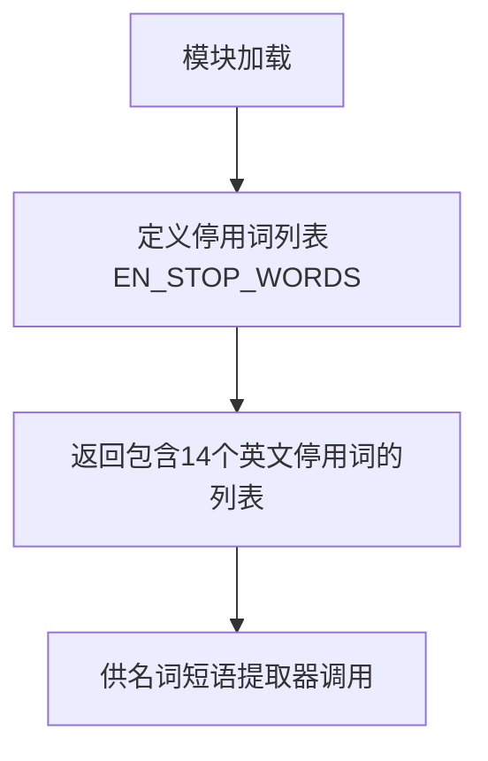

# `graphrag\packages\graphrag\graphrag\index\operations\build_noun_graph\np_extractors\stop_words.py` 详细设计文档

该代码定义了一个英文停用词列表，用于名词短语提取器中排除无意义的词汇，如填充词、称呼语和感叹词等。

## 整体流程



## 类结构

```
无类层次结构（纯数据模块）
```

## 全局变量及字段


### `EN_STOP_WORDS`
    
自定义英文停用词列表，用于名词短语提取器排除这些常见但无意义的词汇

类型：`List[str]`
    


    

## 全局函数及方法


## 关键组件


### 核心功能概述

该代码定义了一个英语停用词列表（EN_STOP_WORDS），用于 noun phrase extractors（名词短语提取器），排除那些常见但缺乏实际语义价值的词汇，如"stuff"、"thing"、"people"等，从而提高名词短语提取的准确性。

### 文件整体运行流程

该文件为纯数据定义模块，无执行流程，仅在模块被导入时将停用词列表加载到内存供其他模块引用。

### 全局变量详情

#### EN_STOP_WORDS

- **类型**: List[str]
- **描述**: 英语停用词列表，包含14个常见但语义信息量低的词汇，用于名词短语提取时的过滤

### 关键组件信息

#### EN_STOP_WORDS 列表

一组预定义的英语停用词，用于从文本中过滤掉无意义或低信息量的名词短语候选词。

### 潜在的技术债务或优化空间

1. **硬编码维护性**: 停用词以硬编码形式存在，随着应用场景变化，扩展和维护成本较高
2. **缺乏多语言支持**: 当前仅支持英语，未考虑国际化场景
3. **无动态配置能力**: 缺少从配置文件或环境变量加载停用词的机制
4. **词汇覆盖不足**: 14个词汇的列表相对有限，可能遗漏其他常见无意义词汇
5. **无权重机制**: 当前所有停用词权重相同，无法区分处理优先级

### 其它项目

#### 设计目标

为名词短语提取器提供可扩展的停用词过滤机制，提高提取质量

#### 约束

- 仅包含英文停用词
- 列表内容静态定义
- 遵循 MIT License 开源协议

#### 错误处理

无错误处理逻辑，属于纯数据定义模块

#### 外部依赖

无外部依赖，仅使用 Python 内置数据结构


## 问题及建议


### 已知问题

-   硬编码停用词列表，缺乏灵活性，无法在不修改源代码的情况下扩展或调整
-   无模块级文档字符串（docstring），缺乏对用途、使用场景和扩展方式的说明
-   缺乏类型注解（type hints），不利于静态分析和IDE支持
-   停用词列表固定为英文，无法支持多语言或领域特定的停用词需求
-   无从外部配置（文件、环境变量）加载停用词的机制，扩展性差

### 优化建议

-   添加模块级docstring，说明该模块用于名词短语提取器的停用词过滤
-   考虑使用数据类或配置类封装停用词列表，提供add/remove等动态操作方法
-   添加类型注解（如 List[str] = [...]）以提升代码可读性和工具支持
-   设计可配置的加载机制，支持从YAML/JSON配置文件或环境变量读取自定义停用词
-   考虑按语言或领域拆分停用词文件，支持多语言和领域特定的提取需求
-   提供默认停用词与用户自定义停用词合并的策略接口


## 其它


### 设计目标与约束

定义一组英文停用词，用于在名词短语提取过程中过滤掉无意义或过于通用的词汇，提高提取质量。约束包括：仅包含英文词汇，保持词汇的通用性，避免特定领域的专业术语。

### 外部依赖与接口契约

本模块为纯数据定义模块，无外部依赖。任何导入此模块的代码可直接使用 EN_STOP_WORDS 列表。该列表约定为字符串元组或列表类型，元素为小写英文单词。

### 使用示例

```python
from package_name import EN_STOP_WORDS

# 在名词短语提取器中使用
def extract_noun_phrases(text):
    words = text.lower().split()
    filtered = [w for w in words if w not in EN_STOP_WORDS]
    return filtered
```

### 配置说明

EN_STOP_WORDS 列表可通过配置文件或环境变量扩展。后续可考虑支持多语言停用词列表的动态加载机制。

### 测试策略

建议添加单元测试验证：1) 列表非空；2) 所有元素为字符串类型；3) 所有元素为小写；4) 不包含重复词汇。可通过 pytest 参数化测试扩展更多场景。

### 性能考虑

当前实现为静态列表，加载时无性能开销。列表大小应控制在合理范围内（建议不超过1000个词汇），以确保遍历检查的效率。

### 版本历史

- v1.0.0 (2024): 初始版本，包含基础英文停用词
- 后续可根据实际使用反馈调整词汇内容

    