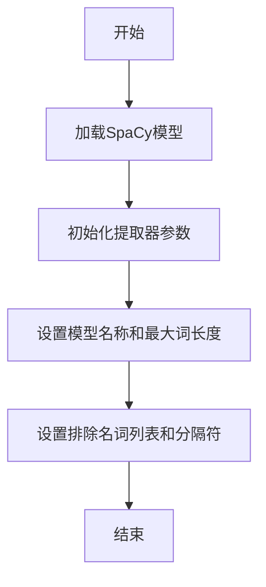
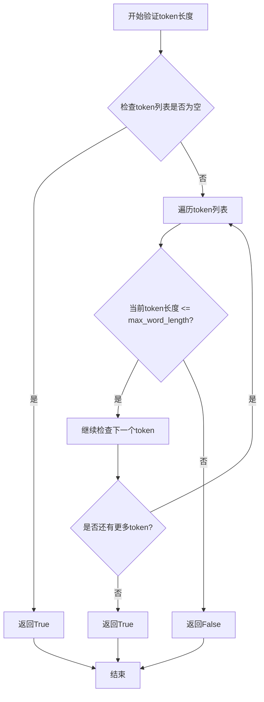
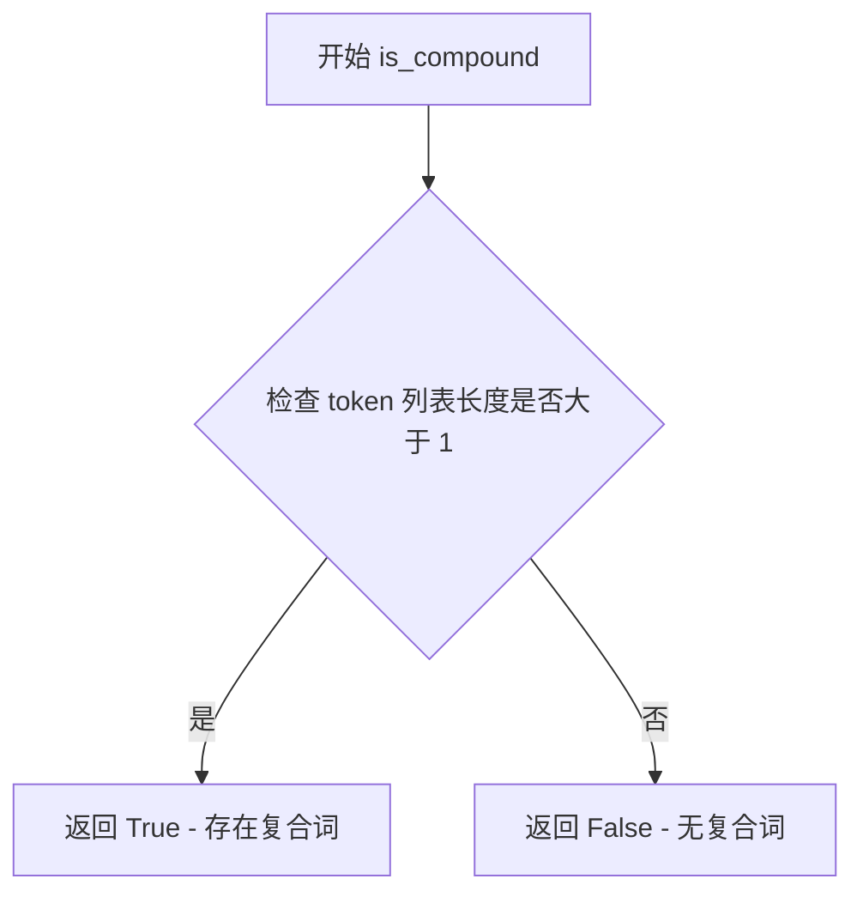
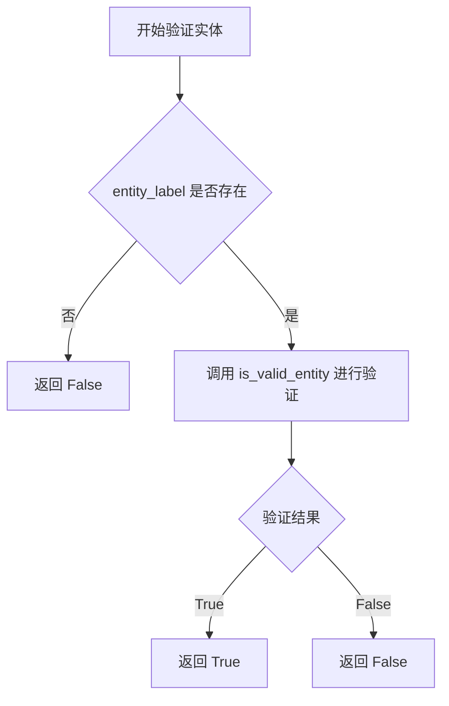
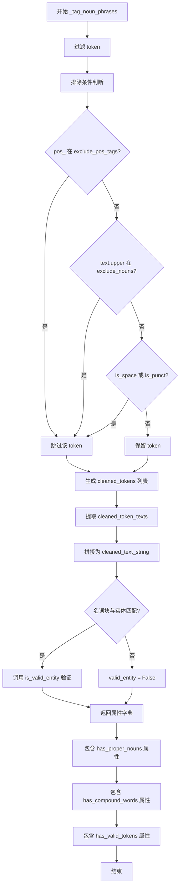
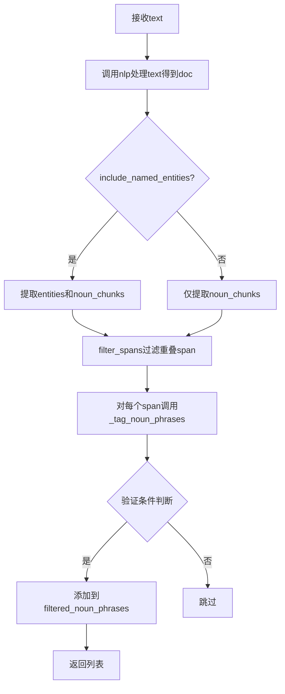

# `graphrag\packages\graphrag\graphrag\index\operations\build_noun_graph\np_extractors\syntactic_parsing_extractor.py` 详细设计文档

基于SpaCy依赖解析和命名实体识别的名词短语提取器，通过句法分析提取文本中的名词短语，并根据实体有效性、复合词、词性和词长等启发式规则进行过滤，以获得更准确的提取结果。

## 整体流程

```mermaid
graph TD
    A[开始] --> B[初始化SyntacticNounPhraseExtractor]
    B --> C[加载SpaCy模型]
    C --> D[调用extract方法]
    D --> E{include_named_entities?}
    E -- 是 --> F[提取doc.ents和doc.noun_chunks]
    E -- 否 --> G[仅提取doc.noun_chunks]
    F --> H[filter_spans过滤重叠span]
    G --> H
    H --> I[遍历每个span调用_tag_noun_phrases]
    I --> J{include_named_entities?}
    J -- 是 --> K{is_valid_entity或(cleaned_tokens>1或has_compound_words)且has_valid_tokens?}
    J -- 否 --> L{has_proper_noun或(cleaned_tokens>1或has_compound_words)且has_valid_tokens?}
    K -- 是 --> M[添加到filtered_noun_phrases]
    L -- 是 --> M
    K -- 否 --> N[跳过]
    L -- 否 --> N
    M --> O[返回list(filtered_noun_phrases)]
```

## 类结构

```
BaseNounPhraseExtractor (抽象基类)
└── SyntacticNounPhraseExtractor
```

## 全局变量及字段


### `SyntacticNounPhraseExtractor.nlp`
    
SpaCy语言模型实例，用于处理文本和提取名词短语

类型：`Any`
    


### `SyntacticNounPhraseExtractor.model_name`
    
SpaCy模型名称，指定用于NLP处理的预训练模型

类型：`str`
    


### `SyntacticNounPhraseExtractor.max_word_length`
    
每个词的最大字符长度，用于过滤过长的词汇

类型：`int`
    


### `SyntacticNounPhraseExtractor.include_named_entities`
    
是否在名词短语中包含命名实体

类型：`bool`
    


### `SyntacticNounPhraseExtractor.exclude_entity_tags`
    
要排除的命名实体标签列表

类型：`list[str]`
    


### `SyntacticNounPhraseExtractor.exclude_pos_tags`
    
要排除的词性标签列表

类型：`list[str]`
    


### `SyntacticNounPhraseExtractor.exclude_nouns`
    
要排除的名词列表

类型：`list[str]`
    


### `SyntacticNounPhraseExtractor.word_delimiter`
    
词分隔符，用于连接词汇生成名词短语

类型：`str`
    
    

## 全局函数及方法


### `BaseNounPhraseExtractor`

抽象基类，定义了名词短语提取器的接口规范，封装了通用的模型加载和字符串表示功能，供具体的提取器实现类（如 `SyntacticNounPhraseExtractor`）继承使用。

参数：

- `model_name`：`str`，SpaCy 模型名称，用于加载对应的语言模型
- `max_word_length`：`int`，提取单词的最大字符长度限制，用于过滤过长的词汇
- `exclude_nouns`：`list[str]`，需要排除的名词列表，用于过滤不需要的名词
- `word_delimiter`：`str`，单词分隔符，用于连接多个单词

返回值：`BaseNounPhraseExtractor`，返回抽象基类的实例

#### 流程图



#### 带注释源码

```python
from abc import ABC, abstractmethod
from typing import Any

import spacy


class BaseNounPhraseExtractor(ABC):
    """名词短语提取器的抽象基类，定义了提取器的通用接口."""

    def __init__(
        self,
        model_name: str,
        max_word_length: int,
        exclude_nouns: list[str],
        word_delimiter: str,
    ):
        """
        初始化名词短语提取器.

        Args:
            model_name: SpaCy模型名称
            max_word_length: 最大词长度
            exclude_nouns: 排除的名词列表
            word_delimiter: 词分隔符
        """
        self.model_name = model_name
        self.max_word_length = max_word_length
        self.exclude_nouns = [noun.upper() for noun in exclude_nouns]
        self.word_delimiter = word_delimiter
        self.nlp = None  # SpaCy模型实例

    def load_spacy_model(self, model_name: str, exclude: list[str] = None) -> Any:
        """
        加载SpaCy模型.

        Args:
            model_name: 模型名称
            exclude: 需要排除的组件列表

        Returns:
            加载的SpaCy模型
        """
        try:
            return spacy.load(model_name, exclude=exclude or [])
        except OSError:
            raise ValueError(
                f"Model {model_name} not found. Please install it via: python -m spacy download {model_name}"
            )

    @abstractmethod
    def extract(self, text: str) -> list[str]:
        """
        从文本中提取名词短语.

        Args:
            text: 输入文本

        Returns:
            名词短语列表
        """
        pass

    def __str__(self) -> str:
        """返回提取器的字符串表示，用于缓存键生成."""
        return f"{self.__class__.__name__}_{self.model_name}_{self.max_word_length}_{self.exclude_nouns}_{self.word_delimiter}"
```


### `has_valid_token_length`

检查token列表中的每个token长度是否在指定的最大长度限制内，用于过滤过长的单词。

参数：

- `tokens`：`list[str]`，待验证的token文本列表
- `max_word_length`：`int`，允许的最大单词长度（字符数）

返回值：`bool`，如果所有token长度都小于等于最大长度则返回True，否则返回False

#### 流程图



#### 带注释源码

```
# 注意：此函数定义位于 np_validator 模块中，此处为基于调用的推断实现

def has_valid_token_length(tokens: list[str], max_word_length: int) -> bool:
    """
    检查token列表中的每个token长度是否在指定的最大长度限制内。
    
    Args:
        tokens: 待验证的token文本列表
        max_word_length: 允许的最大单词长度（字符数）
    
    Returns:
        如果所有token长度都小于等于最大长度则返回True，否则返回False
    """
    # 遍历每个token进行长度检查
    for token in tokens:
        # 如果任意token长度超过最大限制，立即返回False
        if len(token) > max_word_length:
            return False
    
    # 所有token都符合长度要求，返回True
    return True
```

> **注**：由于 `has_valid_token_length` 函数的实际定义位于 `graphrag/index/operations/build_noun_graph/np_extractors/np_validator.py` 模块中，而该模块的源代码未在当前代码片段中提供。上述源码是基于其在 `_tag_noun_phrases` 方法中的调用方式推断得出的：
> ```python
> "has_valid_tokens": has_valid_token_length(
>     cleaned_token_texts, self.max_word_length
> ),
> ```


### `is_compound`

该函数用于检查给定的单词列表中是否包含复合词（即由多个单词组成的复合术语），通过检测列表中是否存在多个单词来判断。

参数：

- `cleaned_token_texts`：`list[str]`，包含清理后的单词列表，用于检查是否存在复合词

返回值：`bool`，如果列表中包含多个单词（即复合词），返回 True；否则返回 False

#### 流程图



#### 带注释源码

```python
def is_compound(cleaned_token_texts: list[str]) -> bool:
    """
    检查给定的单词列表是否包含复合词。
    
    复合词的定义是包含多个单词的术语，例如 "machine learning" 或 "deep learning"。
    该函数通过检查列表长度来判断：如果列表中只有一个单词，则不是复合词；
    如果有多个单词，则认为是复合词。
    
    Args:
        cleaned_token_texts: 清理后的单词文本列表
        
    Returns:
        bool: 如果列表长度大于1（包含多个单词），返回True表示存在复合词；否则返回False
    """
    return len(cleaned_token_texts) > 1
```


### `is_valid_entity`

检查给定的实体标签和词符列表是否为有效实体，用于过滤名词短语中的有效命名实体。

参数：

- `entity_label`：`tuple[str, str]`，实体标签元组，包含实体文本和实体类型（如 ("Microsoft", "ORG")）
- `cleaned_token_texts`：`list[str]`，清理后的词符列表，即从名词块中提取的已过滤的词符文本列表

返回值：`bool`，如果实体标签和词符列表组合被认为是有效实体则返回 `True`，否则返回 `False`

#### 流程图



#### 带注释源码

```python
# 定义位置：从 np_validator 模块导入
# 使用位置：SyntacticNounPhraseExtractor._tag_noun_phrases 方法
# 文件路径：graphrag/index/operations/build_noun_graph/np_extractors/np_validator.py

# 在 _tag_noun_phrases 方法中的调用示例：
noun_chunk_entity_labels = [
    (ent.text, ent.label_) for ent in entities if noun_chunk.text == ent.text
]
if noun_chunk_entity_labels:
    noun_chunk_entity_label = noun_chunk_entity_labels[0]
    # 验证实体是否有效
    # 参数1: entity_label = (实体文本, 实体类型) 元组
    # 参数2: cleaned_token_texts = 清理后的词符列表
    valid_entity = is_valid_entity(noun_chunk_entity_label, cleaned_token_texts)
else:
    valid_entity = False
```

> **注意**：由于 `is_valid_entity` 函数定义在外部模块 `np_validator.py` 中，该模块的源代码未在当前代码片段中提供。上述内容是根据函数在 `SyntacticNounPhraseExtractor` 类中的使用方式推断得出的。该函数的主要作用是结合 SpaCy 命名实体识别的标签信息，验证提取的名词块是否构成一个有效的实体，用于后续的名词短语过滤逻辑。


### `filter_spans`

过滤重叠的 SpaCy Span 对象，保留更优先的 span（通常是更长的或更早出现的）。

参数：

- `spans`：`list[Span]`，需要过滤的 span 序列，包含实体（entities）和名词块（noun_chunks）的混合列表

返回值：`list[Span]`，过滤后的非重叠 span 列表

#### 流程图

```mermaid
flowchart TD
    A[输入: spans 列表<br/>包含 entities + noun_chunks] --> B{检查是否存在重叠}
    B -->|是| C[根据优先级排序<br/>优先级规则:<br/>1. 长度优先<br/>2. 索引顺序}
    C --> D[保留高优先级 span<br/>移除低优先级 span]
    B -->|否| E[直接返回原列表]
    D --> F[输出: 非重叠 span 列表]
    E --> F
```

#### 带注释源码

```python
# filter_spans 函数的典型使用方式（在 SyntacticNounPhraseExtractor.extract 方法中）

# 1. 获取实体和名词块
entities = [
    ent for ent in doc.ents if ent.label_ not in self.exclude_entity_tags
]
spans = entities + list(doc.noun_chunks)

# 2. 调用 filter_spans 过滤重叠的 span
#    - SpaCy 会根据 span 的长度和位置决定保留哪个
#    - 通常保留更长的或更早出现的 span
spans = filter_spans(spans)

# 3. 继续处理过滤后的 spans...
```


### `Span` (从 spacy.tokens.span 导入的类型)

SpaCy 的 `Span` 类型表示文本中的一个span（片段），通常用于表示命名实体、名词短语或其他文本片段。此处导入的 `Span` 类型在 `SyntacticNounPhraseExtractor` 类中用于类型提示，表示名词块和实体对象的类型。

参数：此为类型导入，无直接参数

返回值：此为类型导入，无直接返回值

#### 流程图

```mermaid
flowchart TD
    A[导入 Span 类型] --> B[在类方法中使用作为类型提示]
    
    B --> C[_tag_noun_phrases 方法]
    B --> D[extract 方法处理实体]
    
    C --> C1[noun_chunk: Span - 名词块对象]
    C --> C2[entities: list[Span] - 实体列表]
    
    D --> D1[doc.ents 返回 Span 对象列表]
    D --> D2[doc.noun_chunks 返回 Span 对象列表]
```

#### 带注释源码

```python
# Copyright (c) 2024 Microsoft Corporation.
# Licensed under the MIT License

"""Noun phrase extractor based on dependency parsing and NER using SpaCy."""

from typing import Any

# 从 spacy.tokens.span 导入 Span 类型
# Span 是 SpaCy 库中的核心类型，表示文本中的一个span（片段）
# 用于表示：命名实体(doc.ents)、名词短语(doc.noun_chunks)、或自定义的文本片段
from spacy.tokens.span import Span

from spacy.util import filter_spans

from graphrag.index.operations.build_noun_graph.np_extractors.base import (
    BaseNounPhraseExtractor,
)
from graphrag.index.operations.build_noun_graph.np_extractors.np_validator import (
    has_valid_token_length,
    is_compound,
    is_valid_entity,
)


class SyntacticNounPhraseExtractor(BaseNounPhraseExtractor):
    """Noun phrase extractor based on dependency parsing and NER using SpaCy."""

    def __init__(
        self,
        model_name: str,
        max_word_length: int,
        include_named_entities: bool,
        exclude_entity_tags: list[str],
        exclude_pos_tags: list[str],
        exclude_nouns: list[str],
        word_delimiter: str,
    ):
        """
        Noun phrase extractor based on dependency parsing and NER using SpaCy.

        This extractor tends to produce more accurate results than regex-based extractors but is slower.
        Also, it can be used for different languages by using the corresponding models from SpaCy.

        Args:
            model_name: SpaCy model name.
            max_word_length: Maximum length (in character) of each extracted word.
            include_named_entities: Whether to include named entities in noun phrases
            exclude_entity_tags: list of named entity tags to exclude in noun phrases.
            exclude_pos_tags: List of POS tags to remove in noun phrases.
            word_delimiter: Delimiter for joining words.
        """
        super().__init__(
            model_name=model_name,
            max_word_length=max_word_length,
            exclude_nouns=exclude_nouns,
            word_delimiter=word_delimiter,
        )
        self.include_named_entities = include_named_entities
        self.exclude_entity_tags = exclude_entity_tags
        if not include_named_entities:
            self.nlp = self.load_spacy_model(model_name, exclude=["lemmatizer", "ner"])
        else:
            self.nlp = self.load_spacy_model(model_name, exclude=["lemmatizer"])

        self.exclude_pos_tags = exclude_pos_tags

    def extract(
        self,
        text: str,
    ) -> list[str]:
        """
        Extract noun phrases from text. Noun phrases may include named entities and noun chunks, which are filtered based on some heuristics.

        Args:
            text: Text.

        Returns: List of noun phrases.
        """
        doc = self.nlp(text)

        filtered_noun_phrases = set()
        if self.include_named_entities:
            # extract noun chunks + entities then filter overlapping spans
            # doc.ents 返回的是 Span 对象的列表
            entities = [
                ent for ent in doc.ents if ent.label_ not in self.exclude_entity_tags
            ]
            # doc.noun_chunks 返回的也是 Span 对象列表
            spans = entities + list(doc.noun_chunks)
            spans = filter_spans(spans)

            # reading missing entities
            missing_entities = [
                ent
                for ent in entities
                if not any(ent.text in span.text for span in spans)
            ]
            spans.extend(missing_entities)

            # filtering noun phrases based on some heuristics
            tagged_noun_phrases = [
                self._tag_noun_phrases(span, entities) for span in spans
            ]
            for tagged_np in tagged_noun_phrases:
                if (tagged_np["is_valid_entity"]) or (
                    (
                        len(tagged_np["cleaned_tokens"]) > 1
                        or tagged_np["has_compound_words"]
                    )
                    and tagged_np["has_valid_tokens"]
                ):
                    filtered_noun_phrases.add(tagged_np["cleaned_text"])
        else:
            tagged_noun_phrases = [
                self._tag_noun_phrases(chunk, []) for chunk in doc.noun_chunks
            ]
            for tagged_np in tagged_noun_phrases:
                if (tagged_np["has_proper_nouns"]) or (
                    (
                        len(tagged_np["cleaned_tokens"]) > 1
                        or tagged_np["has_compound_words"]
                    )
                    and tagged_np["has_valid_tokens"]
                ):
                    filtered_noun_phrases.add(tagged_np["cleaned_text"])

        return list(filtered_noun_phrases)

    def _tag_noun_phrases(
        self, noun_chunk: Span, entities: list[Span]
    ) -> dict[str, Any]:
        """Extract attributes of a noun chunk, to be used for filtering."""
        cleaned_tokens = [
            token
            for token in noun_chunk
            if token.pos_ not in self.exclude_pos_tags
            and token.text.upper() not in self.exclude_nouns
            and token.is_space is False
            and not token.is_punct
        ]
        cleaned_token_texts = [token.text for token in cleaned_tokens]
        cleaned_text_string = (
            self.word_delimiter.join(cleaned_token_texts).replace("\n", "").upper()
        )

        noun_chunk_entity_labels = [
            (ent.text, ent.label_) for ent in entities if noun_chunk.text == ent.text
        ]
        if noun_chunk_entity_labels:
            noun_chunk_entity_label = noun_chunk_entity_labels[0]
            valid_entity = is_valid_entity(noun_chunk_entity_label, cleaned_token_texts)
        else:
            valid_entity = False

        return {
            "cleaned_tokens": cleaned_tokens,
            "cleaned_text": cleaned_text_string,
            "is_valid_entity": valid_entity,
            "has_proper_nouns": any(token.pos_ == "PROPN" for token in cleaned_tokens),
            "has_compound_words": is_compound(cleaned_token_texts),
            "has_valid_tokens": has_valid_token_length(
                cleaned_token_texts, self.max_word_length
            ),
        }

    def __str__(self) -> str:
        """Return string representation of the extractor, used for cache key generation."""
        return f"syntactic_{self.model_name}_{self.max_word_length}_{self.include_named_entities}_{self.exclude_entity_tags}_{self.exclude_pos_tags}_{self.exclude_nouns}_{self.word_delimiter}"
```


### `SyntacticNounPhraseExtractor.__init__`

构造函数，初始化提取器参数、加载SpaCy语言模型，并配置名词短语提取的各项过滤规则。

参数：

- `model_name`：`str`，SpaCy模型名称，用于指定要加载的语言模型（如 "en_core_web_sm"）
- `max_word_length`：`int`，提取单词的最大字符长度，用于过滤过长的词汇
- `include_named_entities`：`bool`，是否在名词短语中包含命名实体
- `exclude_entity_tags`：`list[str]`，要排除的命名实体标签列表（如 ["DATE", "TIME"]）
- `exclude_pos_tags`：`list[str]`，要从名词短语中移除的词性标签列表
- `exclude_nouns`：`list[str]`，要排除的名词列表（通常为大写形式）
- `word_delimiter`：`str`，用于连接单词的分隔符

返回值：`None`，构造函数无返回值

#### 流程图

```mermaid
flowchart TD
    A[开始 __init__] --> B[接收参数: model_name, max_word_length, include_named_entities, exclude_entity_tags, exclude_pos_tags, exclude_nouns, word_delimiter]
    B --> C[调用 super().__init__ 初始化基类]
    C --> D[设置 self.include_named_entities]
    D --> E[设置 self.exclude_entity_tags]
    E --> F{include_named_entities?}
    F -->|True| G[加载SpaCy模型, 排除lemmatizer]
    F -->|False| H[加载SpaCy模型, 排除lemmatizer和ner]
    G --> I[设置 self.exclude_pos_tags]
    H --> I
    I --> J[结束]
```

#### 带注释源码

```python
def __init__(
    self,
    model_name: str,
    max_word_length: int,
    include_named_entities: bool,
    exclude_entity_tags: list[str],
    exclude_pos_tags: list[str],
    exclude_nouns: list[str],
    word_delimiter: str,
):
    """
    Noun phrase extractor based on dependency parsing and NER using SpaCy.

    This extractor tends to produce more accurate results than regex-based extractors but is slower.
    Also, it can be used for different languages by using the corresponding models from SpaCy.

    Args:
        model_name: SpaCy model name.
        max_word_length: Maximum length (in character) of each extracted word.
        include_named_entities: Whether to include named entities in noun phrases
        exclude_entity_tags: list of named entity tags to exclude in noun phrases.
        exclude_pos_tags: List of POS tags to remove in noun phrases.
        word_delimiter: Delimiter for joining words.
    """
    # 调用基类构造函数，传递基类所需的参数
    # 基类需要: model_name, max_word_length, exclude_nouns, word_delimiter
    super().__init__(
        model_name=model_name,
        max_word_length=max_word_length,
        exclude_nouns=exclude_nouns,
        word_delimiter=word_delimiter,
    )
    
    # 设置是否包含命名实体的标志
    self.include_named_entities = include_named_entities
    
    # 设置要排除的实体标签列表
    self.exclude_entity_tags = exclude_entity_tags
    
    # 根据是否需要命名实体来决定加载模型时排除哪些组件
    # 如果不包含命名实体，排除ner组件可以减少内存占用和提升性能
    if not include_named_entities:
        # 不需要NER时，排除lemmatizer和ner组件
        self.nlp = self.load_spacy_model(model_name, exclude=["lemmatizer", "ner"])
    else:
        # 需要NER时，只排除lemmatizer组件，保留ner用于实体识别
        self.nlp = self.load_spacy_model(model_name, exclude=["lemmatizer"])

    # 设置要排除的词性标签列表，用于后续过滤名词短语
    self.exclude_pos_tags = exclude_pos_tags
```


### `SyntacticNounPhraseExtractor.extract`

从文本中提取名词短语的主方法，基于依赖解析和命名实体识别（NER），使用SpaCy进行语法分析。该方法能够提取名词块（noun chunks）和命名实体，并通过多种启发式规则过滤无效或不符合条件的短语，最终返回清洗后的名词短语列表。

参数：

- `text`：`str`，需要提取名词短语的原始文本

返回值：`list[str]`，提取并过滤后的名词短语列表

#### 流程图

```mermaid
flowchart TD
    A[开始 extract 方法] --> B[使用 SpaCy 模型处理文本 doc = self.nlp(text)]
    B --> C{include_named_entities 为真?}
    C -->|是| D[从 doc.ents 中提取实体<br/>过滤 exclude_entity_tags]
    D --> E[合并实体和名词块<br/>使用 filter_spans 去除重叠]
    E --> F[查找遗漏的实体<br/>添加到 spans]
    F --> G[对每个 span 调用 _tag_noun_phrases 标记]
    G --> H{验证条件满足?}
    H -->|是| I[添加到 filtered_noun_phrases]
    H -->|否| J[跳过]
    I --> K{处理完所有 span?}
    J --> K
    K -->|否| G
    K -->|是| L[返回列表形式]
    C -->|否| M[直接处理 doc.noun_chunks]
    M --> N[对每个 chunk 调用 _tag_noun_phrases 标记]
    N --> O{验证条件满足?}
    O -->|是| P[添加到 filtered_noun_phrases]
    O -->|否| Q[跳过]
    P --> R{处理完所有 chunk?}
    Q --> R
    R -->|否| N
    R -->|是| L
```

#### 带注释源码

```python
def extract(
    self,
    text: str,
) -> list[str]:
    """
    从文本中提取名词短语。名词短语可能包含命名实体和名词块，
    并基于某些启发式规则进行过滤。

    参数:
        text: 原始文本

    返回: 名词短语列表
    """
    # 使用 SpaCy 模型处理输入文本，得到文档对象
    doc = self.nlp(text)

    # 初始化结果集合（使用 set 自动去重）
    filtered_noun_phrases = set()
    
    # 根据 include_named_entities 配置选择不同的处理流程
    if self.include_named_entities:
        # === 处理包含命名实体的流程 ===
        
        # 1. 提取实体并根据 exclude_entity_tags 过滤
        entities = [
            ent for ent in doc.ents if ent.label_ not in self.exclude_entity_tags
        ]
        
        # 2. 合并实体和名词块，并过滤重叠的 span
        spans = entities + list(doc.noun_chunks)
        spans = filter_spans(spans)

        # 3. 读取遗漏的实体（未被 noun_chunks 覆盖的实体）
        missing_entities = [
            ent
            for ent in entities
            if not any(ent.text in span.text for span in spans)
        ]
        spans.extend(missing_entities)

        # 4. 对每个 span 进行标记和过滤
        tagged_noun_phrases = [
            self._tag_noun_phrases(span, entities) for span in spans
        ]
        
        # 5. 应用过滤条件：
        #    - 是有效的实体 OR
        #    - (token 数量 > 1 OR 有复合词) AND token 长度有效
        for tagged_np in tagged_noun_phrases:
            if (tagged_np["is_valid_entity"]) or (
                (
                    len(tagged_np["cleaned_tokens"]) > 1
                    or tagged_np["has_compound_words"]
                )
                and tagged_np["has_valid_tokens"]
            ):
                filtered_noun_phrases.add(tagged_np["cleaned_text"])
    else:
        # === 处理不包含命名实体的流程 ===
        
        # 直接处理名词块
        tagged_noun_phrases = [
            self._tag_noun_phrases(chunk, []) for chunk in doc.noun_chunks
        ]
        
        # 应用过滤条件：
        #    - 包含专有名词 OR
        #    - (token 数量 > 1 OR 有复合词) AND token 长度有效
        for tagged_np in tagged_noun_phrases:
            if (tagged_np["has_proper_noun"]) or (
                (
                    len(tagged_np["cleaned_tokens"]) > 1
                    or tagged_np["has_compound_words"]
                )
                and tagged_np["has_valid_tokens"]
            ):
                filtered_noun_phrases.add(tagged_np["cleaned_text"])

    # 转换为列表并返回
    return list(filtered_noun_phrases)
```


### `SyntacticNounPhraseExtractor._tag_noun_phrases`

该方法用于标记名词短语的属性，以便后续过滤。它接收一个 SpaCy 的名词块（Span）和实体列表，经过一系列启发式检查后返回一个包含多个属性的字典，用于判断该名词块是否符合提取条件。

参数：

- `self`：`SyntacticNounPhraseExtractor`，当前 extractor 实例
- `noun_chunk`：`Span`，SpaCy 的名词块对象，表示待标记的名词短语
- `entities`：`list[Span]`，SpaCy 的实体列表，用于检查名词块是否为有效实体

返回值：`dict[str, Any]`，包含名词短语属性的字典，包含以下键值对：

- `cleaned_tokens`：清理后的 token 列表
- `cleaned_text`：清理后的文本字符串（大写，以指定分隔符连接）
- `is_valid_entity`：是否为有效实体
- `has_proper_nouns`：是否包含专有名词（PROPN）
- `has_compound_words`：是否包含复合词
- `has_valid_tokens`：所有 token 长度是否在有效范围内

#### 流程图



#### 带注释源码

```python
def _tag_noun_phrases(
    self, noun_chunk: Span, entities: list[Span]
) -> dict[str, Any]:
    """Extract attributes of a noun chunk, to be used for filtering."""
    # 第一步：过滤 token
    # 根据排除的 POS 标签、排除的名词列表、空格和标点符号进行过滤
    cleaned_tokens = [
        token
        for token in noun_chunk
        if token.pos_ not in self.exclude_pos_tags          # 排除指定词性
        and token.text.upper() not in self.exclude_nouns     # 排除指定名词
        and token.is_space is False                          # 排除空格
        and not token.is_punct                               # 排除标点
    ]
    # 将清理后的 token 提取为文本列表
    cleaned_token_texts = [token.text for token in cleaned_tokens]
    # 使用单词分隔符连接文本，并移除换行符后转为大写
    cleaned_text_string = (
        self.word_delimiter.join(cleaned_token_texts).replace("\n", "").upper()
    )

    # 第二步：检查名词块是否为有效实体
    # 查找与名词块文本匹配的实体及其标签
    noun_chunk_entity_labels = [
        (ent.text, ent.label_) for ent in entities if noun_chunk.text == ent.text
    ]
    if noun_chunk_entity_labels:
        # 如果存在匹配实体，验证实体有效性
        noun_chunk_entity_label = noun_chunk_entity_labels[0]
        valid_entity = is_valid_entity(noun_chunk_entity_label, cleaned_token_texts)
    else:
        valid_entity = False

    # 第三步：返回包含多个属性的字典，用于后续过滤决策
    return {
        "cleaned_tokens": cleaned_tokens,                                     # 清理后的 token 列表
        "cleaned_text": cleaned_text_string,                                 # 清理后的文本字符串
        "is_valid_entity": valid_entity,                                     # 是否为有效实体
        "has_proper_nouns": any(token.pos_ == "PROPN" for token in cleaned_tokens),  # 是否包含专有名词
        "has_compound_words": is_compound(cleaned_token_texts),             # 是否包含复合词
        "has_valid_tokens": has_valid_token_length(                          # token 长度是否有效
            cleaned_token_texts, self.max_word_length
        ),
    }
```


### `SyntacticNounPhraseExtractor.__str__`

返回字符串表示用于缓存键生成。

参数：此方法无参数（除了隐式的 `self`）

返回值：`str`，返回提取器的字符串表示，包含模型名称、最大词长度、是否包含命名实体、排除的实体标签、排除的POS标签、排除的名词和词分隔符，用于缓存键生成。

#### 流程图

```mermaid
flowchart TD
    A[开始 __str__] --> B[构建缓存键字符串]
    B --> C[格式: syntactic_{model_name}_{max_word_length}_{include_named_entities}_{exclude_entity_tags}_{exclude_pos_tags}_{exclude_nouns}_{word_delimiter}]
    C --> D[返回字符串]
```

#### 带注释源码

```python
def __str__(self) -> str:
    """
    返回字符串表示 of the extractor, used for cache key generation.
    
    该方法生成一个唯一的字符串标识符，用于缓存键生成。
    字符串包含所有影响提取结果的关键配置参数。
    
    Returns:
        str: 格式化字符串，包含提取器的所有配置信息
    """
    return f"syntactic_{self.model_name}_{self.max_word_length}_{self.include_named_entities}_{self.exclude_entity_tags}_{self.exclude_pos_tags}_{self.exclude_nouns}_{self.word_delimiter}"
```

## 关键组件


### 核心功能概述

该代码实现了一个基于SpaCy依赖解析和命名实体识别（NER）的名词短语提取器，通过结合名词块（noun chunks）和命名实体，采用启发式过滤策略提取高质量的名词短语，支持多语言模型配置和灵活排除规则。

### 文件整体运行流程

1. 初始化时加载SpaCy模型，根据include_named_entities参数决定是否包含NER组件
2. 调用extract方法处理输入文本
3. 使用SpaCy模型对文本进行NLP处理，得到doc对象
4. 根据配置提取命名实体和名词块
5. 使用filter_spans过滤重叠的span
6. 对每个span调用_tag_noun_phrases进行标记和属性提取
7. 根据启发式规则（实体有效性、词数量、复合词、词性、词长度等）过滤名词短语
8. 返回过滤后的名词短语列表

### 类详细信息

#### SyntacticNounPhraseExtractor类

**类字段：**

| 字段名 | 类型 | 描述 |
|--------|------|------|
| include_named_entities | bool | 是否在名词短语中包含命名实体 |
| exclude_entity_tags | list[str] | 要排除的命名实体标签列表 |
| exclude_pos_tags | list[str] | 要排除的词性标签列表 |
| nlp | SpaCy Language对象 | SpaCy语言模型管道 |

**类方法：**

#### __init__方法

- **参数：**
  - model_name: str - SpaCy模型名称
  - max_word_length: int - 每个词的最大字符长度
  - include_named_entities: bool - 是否包含命名实体
  - exclude_entity_tags: list[str] - 排除的实体标签
  - exclude_pos_tags: list[str] - 排除的POS标签
  - exclude_nouns: list[str] - 排除的名词列表
  - word_delimiter: str - 词分隔符
- **返回值：** None
- **描述：** 初始化名词短语提取器，加载SpaCy模型

#### extract方法

- **参数：**
  - text: str - 输入文本
- **返回值：** list[str] - 提取的名词短语列表
- **mermaid流程图：**

- **源码：**
```python
def extract(
    self,
    text: str,
) -> list[str]:
    """
    Extract noun phrases from text. Noun phrases may include named entities and noun chunks, which are filtered based on some heuristics.

    Args:
        text: Text.

    Returns: List of noun phrases.
    """
    doc = self.nlp(text)

    filtered_noun_phrases = set()
    if self.include_named_entities:
        # extract noun chunks + entities then filter overlapping spans
        entities = [
            ent for ent in doc.ents if ent.label_ not in self.exclude_entity_tags
        ]
        spans = entities + list(doc.noun_chunks)
        spans = filter_spans(spans)

        # reading missing entities
        missing_entities = [
            ent
            for ent in entities
            if not any(ent.text in span.text for span in spans)
        ]
        spans.extend(missing_entities)

        # filtering noun phrases based on some heuristics
        tagged_noun_phrases = [
            self._tag_noun_phrases(span, entities) for span in spans
        ]
        for tagged_np in tagged_noun_phrases:
            if (tagged_np["is_valid_entity"]) or (
                (
                    len(tagged_np["cleaned_tokens"]) > 1
                    or tagged_np["has_compound_words"]
                )
                and tagged_np["has_valid_tokens"]
            ):
                filtered_noun_phrases.add(tagged_np["cleaned_text"])
    else:
        tagged_noun_phrases = [
            self._tag_noun_phrases(chunk, []) for chunk in doc.noun_chunks
        ]
        for tagged_np in tagged_noun_phrases:
            if (tagged_np["has_proper_noun"]) or (
                (
                    len(tagged_np["cleaned_tokens"]) > 1
                    or tagged_np["has_compound_words"]
                )
                and tagged_np["has_valid_tokens"]
            ):
                filtered_noun_phrases.add(tagged_np["cleaned_text"])

    return list(filtered_noun_phrases)
```

#### _tag_noun_phrases方法

- **参数：**
  - noun_chunk: Span - SpaCy的span对象
  - entities: list[Span] - 命名实体列表
- **返回值：** dict[str, Any] - 包含名词短语属性的字典
- **描述：** 提取名词短语的属性用于过滤判断

```python
def _tag_noun_phrases(
    self, noun_chunk: Span, entities: list[Span]
) -> dict[str, Any]:
    """Extract attributes of a noun chunk, to be used for filtering."""
    cleaned_tokens = [
        token
        for token in noun_chunk
        if token.pos_ not in self.exclude_pos_tags
        and token.text.upper() not in self.exclude_nouns
        and token.is_space is False
        and not token.is_punct
    ]
    cleaned_token_texts = [token.text for token in cleaned_tokens]
    cleaned_text_string = (
        self.word_delimiter.join(cleaned_token_texts).replace("\n", "").upper()
    )

    noun_chunk_entity_labels = [
        (ent.text, ent.label_) for ent in entities if noun_chunk.text == ent.text
    ]
    if noun_chunk_entity_labels:
        noun_chunk_entity_label = noun_chunk_entity_labels[0]
        valid_entity = is_valid_entity(noun_chunk_entity_label, cleaned_token_texts)
    else:
        valid_entity = False

    return {
        "cleaned_tokens": cleaned_tokens,
        "cleaned_text": cleaned_text_string,
        "is_valid_entity": valid_entity,
        "has_proper_nouns": any(token.pos_ == "PROPN" for token in cleaned_tokens),
        "has_compound_words": is_compound(cleaned_token_texts),
        "has_valid_tokens": has_valid_token_length(
            cleaned_token_texts, self.max_word_length
        ),
    }
```

#### __str__方法

- **参数：** 无
- **返回值：** str - 缓存键字符串
- **描述：** 返回提取器的字符串表示，用于缓存键生成

### 关键组件信息

#### SpaCy模型加载组件

根据include_named_entities参数动态排除lemmatizer和ner组件，优化内存使用

#### 名词短语过滤组件

基于多个启发式规则过滤：实体有效性检查、词长度验证、复合词识别、专有名词检测、POS标签过滤

#### 重叠span处理组件

使用filter_spans过滤重叠的span，并补充未被包含的实体

#### 缓存键生成组件

__str__方法生成唯一的缓存键，用于缓存和重用提取器实例

### 潜在技术债务或优化空间

1. **性能优化空间**：每次调用extract都会创建新的doc对象，可以考虑批量处理多个文本
2. **missing_entities逻辑缺陷**：当entities列表为空时，missing_entities的计算逻辑可能产生不预期结果
3. **filter_spans后重复添加**：代码先filter_spans过滤，又手动extend missing_entities，可能导致重复
4. **依赖外部验证函数**：is_valid_entity、is_compound、has_valid_token_length等函数未在本文件中定义，引入外部依赖风险
5. **大小写处理不一致**：部分使用upper()转换，部分未转换，可能导致匹配问题
6. **异常处理缺失**：未对SpaCy模型加载失败、文本为空等边界情况进行处理

### 其它项目

#### 设计目标与约束

- 支持多语言SpaCy模型
- 提供灵活的排除规则（实体标签、POS标签、特定名词）
- 平衡准确性和性能，优先准确性

#### 错误处理与异常设计

- 依赖SpaCy的内部错误处理
- 缺少显式的异常捕获和处理机制

#### 数据流与状态机

- 文本输入 → NLP处理 → 实体/名词块提取 → 过滤重叠 → 属性标记 → 启发式验证 → 输出结果

#### 外部依赖与接口契约

- 依赖graphrag.index.operations.build_noun_graph.np_extractors.base.BaseNounPhraseExtractor基类
- 依赖外部验证函数：has_valid_token_length、is_compound、is_valid_entity
- 依赖SpaCy库（spacy.tokens.span.Span、spacy.util.filter_spans）


## 问题及建议


### 已知问题

-   **重复代码块**：`extract`方法中存在大量重复的逻辑处理，在`include_named_entities`为`True`和`False`两个分支中，遍历`tagged_noun_phrases`的代码结构几乎相同，仅过滤条件不同，导致代码冗余且难以维护。
-   **字符串处理效率低下**：在`_tag_noun_phrases`方法中，每次比较都调用`token.text.upper()`将token文本转换为大写，而`exclude_nouns`列表在初始化时未进行预处理，导致重复的字符串转换操作。
-   **缺失的实体检测逻辑不准确**：使用`any(ent.text in span.text for span in spans)`检测缺失实体依赖字符串包含关系，这种方式不够精确，可能产生误判，应该基于token或span的边界进行判断。
-   **缺少输入验证**：未对输入的`text`参数进行空值或空字符串检查，可能导致后续处理出现异常。
-   **类型注解不够精确**：多处使用`Any`类型（如`_tag_noun_phrases`返回字典的值类型），降低了代码的可读性和类型安全性。

### 优化建议

-   **提取公共逻辑**：将两个分支中相同的遍历和添加逻辑提取为私有方法，仅将过滤条件作为参数传入，消除代码重复。
-   **预处理排除列表**：在`__init__`方法中将`exclude_nouns`列表的每个元素转换为大写并存储，避免在循环中重复调用`upper()`方法。
-   **改进实体检测**：使用SpaCy的span对象比较或token索引而非字符串包含关系来检测缺失实体，提高准确性。
-   **添加输入验证**：在`extract`方法开始时添加`if not text or not text.strip(): return []`的早返回逻辑。
-   **强化类型注解**：将`_tag_noun_phrases`返回的字典类型定义为`TypedDict`，明确每个字段的类型。

## 其它


### 设计目标与约束

本模块的设计目标是提供一个基于依赖解析和命名实体识别（NER）的高精度名词短语提取器，能够从文本中提取符合要求的名词短语，支持多语言处理。主要约束包括：1）依赖SpaCy模型，需要预先下载对应的语言模型；2）性能较Regex方式较慢，适用于对准确性要求较高的场景；3）仅支持SpaCy已分词的文本输入。

### 错误处理与异常设计

代码中主要通过SpaCy模型的加载和调用处理异常。当模型加载失败时，会抛出相应的异常。文本处理过程中，对于空文本或无效输入，会返回空列表。命名实体过滤时，如果实体标签在排除列表中会被过滤。关键方法extract()返回空列表表示未提取到有效名词短语，调用方需要处理这种边界情况。

### 数据流与状态机

数据流处理流程如下：1）输入原始文本字符串；2）通过SpaCy nlp模型处理文本生成doc对象；3）根据include_named_entities配置决定提取策略；4）提取命名实体和名词块并过滤重叠部分；5）调用_tag_noun_phrases()方法为每个span打标签；6）根据验证规则过滤不合格的名词短语；7）返回去重后的名词短语列表。状态机主要体现在：初始化状态（加载模型）-> 处理状态（提取和过滤）-> 完成状态（返回结果）。

### 外部依赖与接口契约

主要外部依赖包括：1）spacy库及其语言模型；2）graphrag.index.operations.build_noun_graph.np_extractors.base模块中的BaseNounPhraseExtractor基类；3）np_validator模块中的验证函数。接口契约方面：extract()方法接受字符串参数text，返回List[str]类型的名词短语列表；_tag_noun_phrases()为内部方法，返回包含多个布尔标记的字典；__str__()方法用于缓存键生成，需返回唯一标识字符串。

### 性能考虑与优化策略

当前实现的主要性能瓶颈：1）SpaCy模型加载耗时，建议缓存复用；2）多次遍历实体和名词块进行过滤；3）集合操作和字符串拼接开销。优化方向：可以考虑使用nlp.pipe()进行批量处理以提高吞吐量；filter_spans已用于去重，可进一步优化重叠检测算法；对于大规模文本，可考虑并行处理策略。

### 配置参数详解

model_name指定SpaCy模型名称，如"en_core_web_sm"；max_word_length限制单个词的最大字符数，默认通常为50；include_named_entities控制是否包含命名实体；exclude_entity_tags为排除的实体标签列表，如["DATE","TIME"]；exclude_pos_tags为排除的词性标签列表，如["ADP","DET"]；exclude_nouns为排除的名词大写形式列表；word_delimiter为名词短语中词之间的分隔符，默认通常为空格或下划线。

### 单元测试与验证策略

建议添加以下测试用例：1）空文本输入应返回空列表；2）仅包含停用词的文本应返回空列表；3）包含有效名词短语的文本应正确提取；4）配置exclude_entity_tags时应正确过滤对应实体；5）配置include_named_entities=False时应仅提取普通名词短语；6）长文本处理应正常工作；7）特殊字符和换行符应正确处理；8）__str__()方法生成的键应唯一且稳定。

    