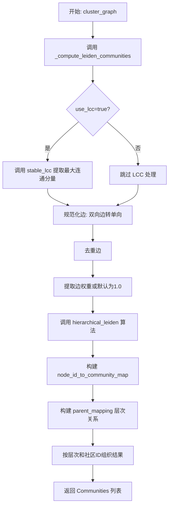
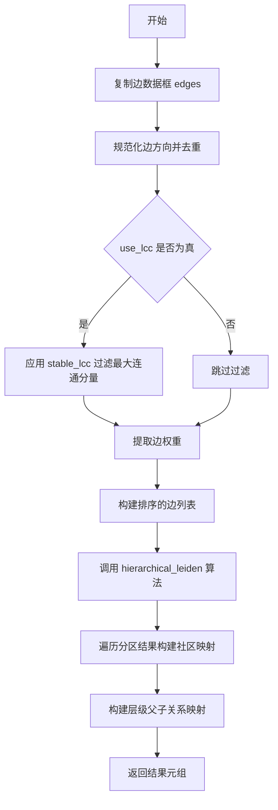

# `graphrag\packages\graphrag\graphrag\index\operations\cluster_graph.py` 详细设计文档

该模块实现了一个图聚类功能，通过Leiden算法对输入的边DataFrame进行层次聚类，生成社区结构。可选地使用最大连通分量(LCC)进行预处理，并支持设置随机种子以确保结果可复现。

## 整体流程



## 类结构

```
模块: graphrag.graphs.cluster_graph
├── 类型定义: Communities
├── 全局变量: logger
├── 公共函数: cluster_graph
└── 私有函数: _compute_leiden_communities
```

## 全局变量及字段


### `logger`
    
模块级日志记录器，用于记录该模块的运行日志

类型：`logging.Logger`
    


### `Communities`
    
类型别名，表示社区结果列表，每个元素包含层级、簇ID、父映射和节点列表

类型：`list[tuple[int, int, int, list[str]]]`
    


    

## 全局函数及方法


### `cluster_graph`

`cluster_graph` 是图聚类模块的主入口函数，通过调用层次 Leiden 算法对输入的边数据框进行层次聚类，支持最大连通分量（LCC）优化和随机种子控制，最终返回包含层级、社区 ID、父级映射和节点列表的社区结构。

参数：

- `edges`：`pd.DataFrame`，包含边的数据框，必须包含 `source` 和 `target` 列，可选的 `weight` 列用于边权重
- `max_cluster_size`：`int`，单个社区的最大节点数量，用于控制聚类的粒度
- `use_lcc`：`bool`，是否在聚类前仅保留最大连通分量（Stable Largest Connected Component），可提升聚类质量和性能
- `seed`：`int | None`，可选的随机种子，用于 Leiden 算法的随机过程，确保结果可复现

返回值：`Communities`，即 `list[tuple[int, int, int, list[str]]]`，每个元组表示一个社区，结构为 `(level, cluster_id, parent_cluster_id, nodes)`：
- `level`：层级编号（整数，从 0 开始）
- `cluster_id`：当前层级的社区 ID
- `parent_cluster_id`：父级社区 ID（根节点为 -1）
- `nodes`：属于该社区的节点 ID 列表

#### 流程图

```mermaid
flowchart TD
    A[开始 cluster_graph] --> B[调用 _compute_leiden_communities]
    B --> C[获取 node_id_to_community_map 和 parent_mapping]
    C --> D[从 node_id_to_community_map 获取所有层级 levels]
    E[初始化空 clusters 字典] --> F
    F[遍历 levels] --> G[为每个 level 初始化 defaultdict]
    G --> H[遍历 node_id_to_community_map[level] 中的节点-社区对]
    H --> I[将 node_id 添加到对应 community_id 的列表]
    I --> J{level 遍历完成?}
    J -->|否| F
    J -->|是| K[初始化空 results 列表]
    K --> L[遍历 clusters 中的层级和社区]
    L --> M[为每个 cluster_id 和 nodes 构造元组]
    M --> N[将 (level, cluster_id, parent_mapping[cluster_id], nodes) 添加到 results]
    N --> O{clusters 遍历完成?}
    O -->|否| L
    O -->|是| P[返回 results]
    P --> Z[结束]
```

#### 带注释源码

```python
def cluster_graph(
    edges: pd.DataFrame,
    max_cluster_size: int,
    use_lcc: bool,
    seed: int | None = None,
) -> Communities:
    """Apply a hierarchical clustering algorithm to a relationships DataFrame."""
    # 步骤1: 调用内部函数计算 Leiden 社区划分，返回节点到社区的映射和父子层级关系
    node_id_to_community_map, parent_mapping = _compute_leiden_communities(
        edges=edges,
        max_cluster_size=max_cluster_size,
        use_lcc=use_lcc,
        seed=seed,
    )

    # 步骤2: 获取所有层级的有序列表（按层级号升序排列）
    levels = sorted(node_id_to_community_map.keys())

    # 步骤3: 构建 clusters 字典，结构为 {level: {community_id: [node_ids]}}
    clusters: dict[int, dict[int, list[str]]] = {}
    for level in levels:
        # 使用 defaultdict 自动创建空列表，避免键不存在错误
        result: dict[int, list[str]] = defaultdict(list)
        clusters[level] = result
        # 遍历当前层级的所有节点-社区映射关系
        for node_id, community_id in node_id_to_community_map[level].items():
            # 将节点 ID 添加到对应社区的节点列表中
            result[community_id].append(node_id)

    # 步骤4: 将 clusters 转换为结果列表格式
    # 每个元素为 (level, cluster_id, parent_cluster_id, nodes)
    results: Communities = []
    for level in clusters:
        for cluster_id, nodes in clusters[level].items():
            # parent_mapping 存储了每个社区到其父级社区的映射，根节点父级为 -1
            results.append((level, cluster_id, parent_mapping[cluster_id], nodes))
    
    # 返回完整的社区结构列表
    return results
```


### `_compute_leiden_communities`

该函数是图聚类的核心实现，负责将边数据框转换为层次化的Leiden社区结构。它首先规范化边数据（去重、转为无向图），可选地提取最大连通分量，然后调用层次Leiden算法生成社区划分结果，并构建父子层级映射关系。

参数：

- `edges`：`pd.DataFrame`，包含源节点、目标节点及可选权重的边数据表
- `max_cluster_size`：`int`，单个社区的最大节点数量限制
- `use_lcc`：`bool`，是否仅使用图的最大连通分量进行聚类
- `seed`：`int | None`，随机种子，用于确保算法结果可复现

返回值：`tuple[dict[int, dict[str, int]], dict[int, int]]`，返回元组包含两个字典——第一个字典按层级映射节点到社区ID，第二个字典映射社区ID到其父社区ID（根节点父ID为-1）

#### 流程图



#### 带注释源码

```python
# 从图边数据计算Leiden层次社区
# Taken from graph_intelligence & adapted
def _compute_leiden_communities(
    edges: pd.DataFrame,
    max_cluster_size: int,
    use_lcc: bool,
    seed: int | None = None,
) -> tuple[dict[int, dict[str, int]], dict[int, int]]:
    """Return Leiden root communities and their hierarchy mapping."""
    # 复制DataFrame避免修改原始数据
    edge_df = edges.copy()

    # 步骤1：规范化边方向并去重（构建无向图）
    # NX会将反向对去重并保留最后一行的属性
    # 因此我们通过规范化方向然后保留最后一条来复现该行为
    lo = edge_df[["source", "target"]].min(axis=1)  # 取较小值作为source
    hi = edge_df[["source", "target"]].max(axis=1)  # 取较大值作为target
    edge_df["source"] = lo
    edge_df["target"] = hi
    # 根据source和target去重，保留最后一条记录
    edge_df.drop_duplicates(subset=["source", "target"], keep="last", inplace=True)

    # 步骤2：可选地提取最大连通分量（LCC）
    if use_lcc:
        edge_df = stable_lcc(edge_df)

    # 步骤3：提取边权重，若无weight列则默认为1.0
    weights = (
        edge_df["weight"].astype(float)
        if "weight" in edge_df.columns
        else pd.Series(1.0, index=edge_df.index)
    )
    # 构建排序的边列表（元组形式：源节点, 目标节点, 权重）
    edge_list: list[tuple[str, str, float]] = sorted(
        zip(
            edge_df["source"].astype(str),
            edge_df["target"].astype(str),
            weights,
            strict=True,
        )
    )

    # 步骤4：调用层次Leiden算法进行社区检测
    community_mapping = hierarchical_leiden(
        edge_list, max_cluster_size=max_cluster_size, random_seed=seed
    )
    
    # 步骤5：构建结果字典和层级映射
    results: dict[int, dict[str, int]] = {}  # level -> {node: cluster}
    hierarchy: dict[int, int] = {}           # cluster -> parent_cluster
    
    # 遍历算法返回的每个分区，构建社区映射
    for partition in community_mapping:
        # 按层级组织结果
        results[partition.level] = results.get(partition.level, {})
        results[partition.level][partition.node] = partition.cluster

        # 构建父子层级关系（根节点父节点为-1）
        hierarchy[partition.cluster] = (
            partition.parent_cluster if partition.parent_cluster is not None else -1
        )

    # 返回：社区映射字典 + 层级父子关系字典
    return results, hierarchy
```

## 关键组件


### cluster_graph

主入口函数，通过调用_compute_leiden_communities计算Leiden层次聚类，并将结果转换为包含层级、聚类ID、父节点映射和节点列表的元组列表返回。

### _compute_leiden_communities

核心聚类计算函数，负责边的规范化（无向图处理）、去重、权重处理，调用hierarchical_leiden算法进行层次聚类，并构建社区映射和层级关系。

### hierarchical_leiden

外部依赖函数，来自graphrag.graphs.hierarchical_leiden模块，实现Leiden层次聚类算法核心逻辑。

### stable_lcc

外部依赖函数，来自graphrag.graphs.stable_lcc模块，用于提取最大连通分量，提升聚类效率。

### edge_df 边数据规范化处理

对输入的边DataFrame进行min-max规范化处理，将有向边转换为无向边表示，并去除重复边，确保图的处理正确性。

### weights 权重处理

根据边数据框中是否存在weight列，动态生成浮点权重或默认权重值为1.0，确保算法能够处理加权和非加权图。

### results 社区映射结构

构建嵌套字典结构results[level][node_id] = community_id，用于存储各层级节点的社区归属关系。

### hierarchy 父子聚类关系

构建hierarchy[cluster_id] = parent_cluster的映射关系，记录层次聚类中的父子关系，根节点父节点为-1。

### Communities 类型定义

定义返回数据类型为list[tuple[int, int, int, list[str]]]，包含(level, cluster_id, parent_cluster, nodes)四个字段的社区元组列表。


## 问题及建议


### 已知问题

-   **类型注解不够精确**：返回类型 `Communities = list[tuple[int, int, int, list[str]]]` 未考虑空列表的情况，可能导致类型不匹配
-   **不必要的全量复制**：`edge_df = edges.copy()` 对整个 DataFrame 进行复制，在大数据集上会造成显著内存开销
-   **DataFrame 操作效率低下**：使用 `inplace=True` 进行去重（`drop_duplicates`），这是 pandas 中不推荐的做法，可能导致 SettingWithCopyWarning
-   **重复迭代数据**：`node_id_to_community_map` 被迭代两次（一次构建 clusters，一次构建 results），存在优化空间
-   **冗余排序操作**：`sorted(node_id_to_community_map.keys())` 进行了排序，但在后续使用中并不依赖有序性
-   **缺少输入验证**：函数未对输入的 `edges` DataFrame 进行基本验证（如检查必需列是否存在、数据是否为空）
-   **日志未使用**：模块导入了 `logger` 但未实际使用，失去了监控和调试能力
-   **魔法数字**：层级映射中 `-1` 表示根节点是硬编码的魔法数字，缺乏语义化定义
-   **变量名遮蔽**：内部函数 `_compute_leiden_communities` 中的 `results` 变量名与外层函数变量名重复，可能造成混淆
-   **排序后未使用结果**：排序后的 `levels` 在第一次 `for level in levels` 循环中使用，后续 `for level in clusters` 又直接遍历 `clusters` 字典，排序结果实际未被利用

### 优化建议

-   **添加输入验证**：在函数入口处检查 `edges` 是否包含 "source" 和 "target" 列，以及数据是否为空
-   **移除不必要的复制**：考虑直接修改 DataFrame 或使用更轻量的方式处理（如不复制而是在原数据上操作）
-   **消除 inplace 操作**：将 `drop_duplicates` 的结果赋值给新变量，避免使用 `inplace=True`
-   **合并迭代逻辑**：将两次迭代合并为一次，直接构建最终的 `results` 列表
-   **移除冗余排序**：删除 `sorted()` 调用，或仅在确实需要有序结果时使用
-   **添加日志记录**：在关键节点添加适当的日志记录（如处理开始、完成、异常情况）
-   **定义常量替代魔法数字**：创建常量如 `ROOT_CLUSTER_ID = -1` 替代硬编码值
-   **优化类型注解**：考虑使用 `list[str] | None` 或更精确的类型定义
-   **使用更语义化的变量名**：区分不同层级的 `results` 变量，如 `community_mapping` 和 `final_results`

## 其它


### 设计目标与约束

本模块的设计目标是提供一个高效、可扩展的图聚类解决方案，用于将大规模图数据分割成层次化的社区结构。核心约束包括：1) 输入数据必须为 pandas DataFrame 格式，包含 source 和 target 列；2) 支持的最大簇大小由 max_cluster_size 参数控制；3) 算法复杂度为 O(n log n)，其中 n 为边数；4) 内存使用与边数成线性关系。

### 错误处理与异常设计

模块采用分层异常处理策略：1) 输入验证阶段检查 DataFrame 必需列（source, target）是否存在，若缺失则抛出 KeyError；2) 数据类型转换阶段若 weight 列存在但类型无法转换为 float，将抛出 ValueError；3) hierarchical_leiden 算法调用失败时捕获异常并记录日志；4) 空边列表或空 DataFrame 输入时返回空列表；5) 所有异常均携带描述性错误信息，便于调试定位。

### 数据流与状态机

数据流处理遵循以下状态转换：1) 初始状态：接收原始 edges DataFrame；2) 预处理状态：复制 DataFrame 并进行无向图规范化（方向归一化 + 去重）；3) 可选 LCC 状态：若 use_lcc=True，提取最大连通分量；4) 权重提取状态：解析权重列或使用默认权重 1.0；5) 转换状态：将 DataFrame 转换为边列表元组；6) 聚类状态：调用 hierarchical_leiden 执行层次聚类；7) 结果聚合状态：将聚类结果映射为 level-cluster-parent-nodes 元组列表。

### 外部依赖与接口契约

本模块依赖以下外部组件：1) pandas：DataFrame 数据结构操作；2) graphrag.graphs.hierarchical_leiden：层次 Leiden 聚类算法实现；3) graphrag.graphs.stable_lcc：最大连通分量计算；4) logging：日志记录。接口契约规定：edges 参数必须包含 source(string)、target(string) 列，可选包含 weight(numeric) 列；max_cluster_size 必须为正整数；use_lcc 为布尔值控制是否使用 LCC；seed 可选用于结果可复现性；返回值为 Communities 类型，即 list[tuple[int, int, int, list[str]]]。

### 性能考虑与优化空间

性能关键点包括：1) 边列表排序 O(n log n) 是主要开销；2) DataFrame 复制操作存在内存开销；3) drop_duplicates 在大数据集上可能较慢。优化建议：1) 对于超大规模图，可考虑流式处理或分批聚类；2) 可添加并行化处理多层次聚类结果；3) 预分配数据结构减少内存分配开销；4) 考虑使用 Cython 或 Numba 加速数值计算；5) 可添加缓存机制避免重复计算相同边集合。

### 配置参数说明

| 参数名 | 类型 | 默认值 | 说明 |
|--------|------|--------|------|
| edges | pd.DataFrame | 必填 | 输入边数据表，必须包含 source, target 列 |
| max_cluster_size | int | 必填 | 单个簇的最大节点数，控制聚类粒度 |
| use_lcc | bool | 必填 | 是否仅使用最大连通分量进行聚类 |
| seed | int \| None | None | 随机种子，用于结果可复现性 |

### 边界条件处理

模块处理以下边界情况：1) 空 DataFrame 输入：返回空列表；2) 单边输入：正常处理，返回单个簇；3) 自环边（source==target）：在去重阶段被保留，但算法会正常处理；4) 重复边：去重时保留最后一条边的属性；5) 权重缺失：使用默认值 1.0；6) 负权重：算法未做验证，可能产生异常结果；7) 超大 max_cluster_size：算法自动调整；8) 完全不连通的图：各连通分量分别聚类。

### 使用示例

```python
import pandas as pd
from graphrag.cluster import cluster_graph

# 创建示例边数据
edges = pd.DataFrame({
    "source": ["A", "B", "C", "D", "E"],
    "target": ["B", "C", "D", "E", "A"],
    "weight": [1.0, 2.0, 1.5, 3.0, 1.0]
})

# 执行层次聚类
results = cluster_graph(
    edges=edges,
    max_cluster_size=10,
    use_lcc=True,
    seed=42
)

# results 格式: [(level, cluster_id, parent_cluster, [nodes]), ...]
```

### 安全性考虑

当前模块安全措施有限，建议增强：1) 输入验证应限制节点 ID 长度防止内存耗尽；2) 添加最大边数限制防止 DoS 攻击；3) 对极端权重值进行范围检查；4) 考虑添加超时机制防止无限循环；5) 对 seed 参数进行有效性验证。


    