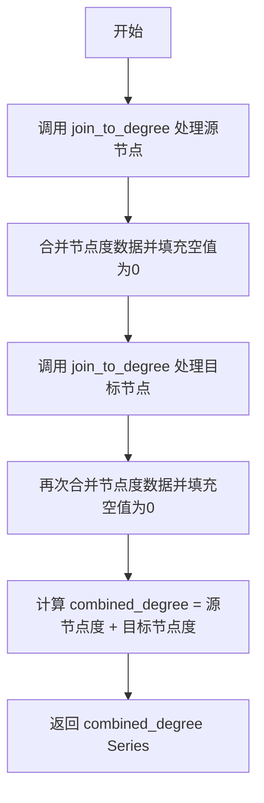
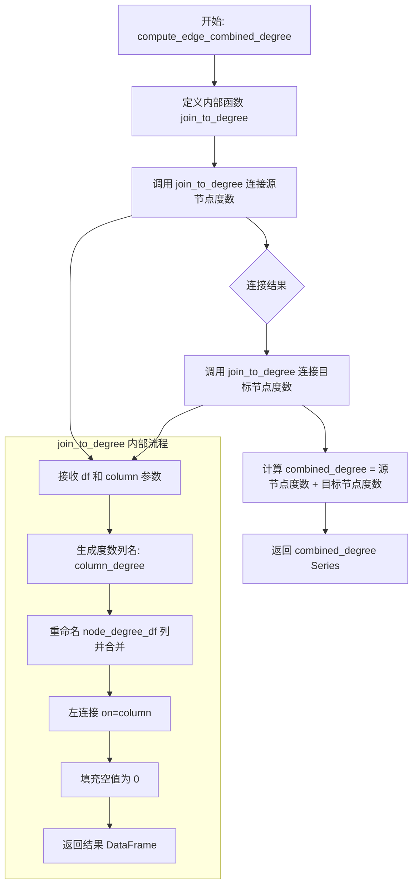
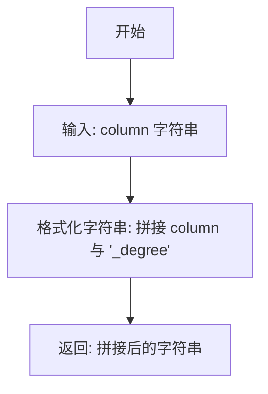

# `graphrag\packages\graphrag\graphrag\index\operations\compute_edge_combined_degree.py` 详细设计文档

该模块提供了一个计算图中每条边组合度（combined degree）的函数，通过将边数据与节点度数据进行合并，计算源节点和目标节点的度数之和，用于图分析场景中的特征工程。

## 整体流程



## 类结构

```
无类层次结构（纯函数模块）
```

## 全局变量及字段


### `degree_column`
    
存储根据列名生成的度数列名字符串

类型：`str`
    


### `result`
    
存储节点度数据与边数据合并后的DataFrame结果

类型：`pd.DataFrame`
    


### `output_df`
    
存储经过多次join操作和度计算后的最终DataFrame

类型：`pd.DataFrame`
    


### `column`
    
传入的列名参数，用于指定边源或目标列

类型：`str`
    


    

## 全局函数及方法


### `compute_edge_combined_degree`

该函数用于计算图中每条边的组合度数（combined degree），即边的源节点度数与目标节点度数之和。它通过将边数据框与节点度数数据框进行左连接，获取每个节点的度数，然后相加得到每条边的组合度数。

参数：

- `edge_df`：`pd.DataFrame`，包含边的数据框
- `node_degree_df`：`pd.DataFrame`，包含节点名称和对应度数的节点度数数据框
- `node_name_column`：`str`，节点度数数据框中表示节点名称的列名
- `node_degree_column`：`str`，节点度数数据框中表示节点度数的列名
- `edge_source_column`：`str`，边数据框中表示边源节点的列名
- `edge_target_column`：`str`，边数据框中表示边目标节点的列名

返回值：`pd.Series`，返回每条边的组合度数（即源节点度数 + 目标节点度数）

#### 流程图



#### 带注释源码

```python
def compute_edge_combined_degree(
    edge_df: pd.DataFrame,          # 边数据框，包含源节点和目标节点列
    node_degree_df: pd.DataFrame,   # 节点度数数据框，包含节点名和对应度数
    node_name_column: str,          # 节点度数数据框中节点名称列名
    node_degree_column: str,        # 节点度数数据框中度数列名
    edge_source_column: str,        # 边数据框中源节点列名
    edge_target_column: str,        # 边数据框中目标节点列名
) -> pd.Series:
    """Compute the combined degree for each edge in a graph."""
    
    # 定义内部函数：将数据框与节点度数进行左连接
    def join_to_degree(df: pd.DataFrame, column: str) -> pd.DataFrame:
        # 根据传入的列名生成对应的度数列名
        degree_column = _degree_colname(column)
        
        # 将节点度数数据框重命名后与当前数据框进行左连接
        # 将 node_name_column 重命名为当前需要连接的列名 column
        # 将 node_degree_column 重命名为 degree_column
        result = df.merge(
            node_degree_df.rename(
                columns={node_name_column: column, node_degree_column: degree_column}
            ),
            on=column,               # 基于 column 列进行连接
            how="left",              # 左连接，保留所有边
        )
        
        # 对于没有度数的节点（连接后为空），填充为 0
        result[degree_column] = result[degree_column].fillna(0)
        return result

    # 第一次连接：将边数据框与源节点的度数进行连接
    output_df = join_to_degree(edge_df, edge_source_column)
    
    # 第二次连接：将结果数据框与目标节点的度数进行连接
    output_df = join_to_degree(output_df, edge_target_column)
    
    # 计算组合度数：源节点度数 + 目标节点度数
    output_df["combined_degree"] = (
        output_df[_degree_colname(edge_source_column)]
        + output_df[_degree_colname(edge_target_column)]
    )
    
    # 返回组合度数 Series，并进行类型转换
    return cast("pd.Series", output_df["combined_degree"])


def _degree_colname(column: str) -> str:
    """生成度数列名的辅助函数"""
    return f"{column}_degree"
```


### `_degree_colname`

该函数是一个简单的辅助函数，用于生成度（degree）列的名称，通过将输入列名与"_degree"后缀拼接，形成标准化的度列命名格式。

参数：

- `column`：`str`，源列名，用于生成对应的度列名称

返回值：`str`，拼接后的度列名称，格式为 `{column}_degree`

#### 流程图



#### 带注释源码

```python
def _degree_colname(column: str) -> str:
    """生成度列名称的辅助函数。
    
    通过将输入的列名与'_degree'后缀拼接，
    为节点度数据创建标准化的列名。
    
    参数:
        column: 源列名，通常是边的源节点或目标节点列名
        
    返回:
        拼接后的度列名称，格式为'{column}_degree'
    """
    return f"{column}_degree"
```


### `compute_edge_combined_degree.join_to_degree`

这是一个内部函数（闭包），用于将节点度数信息合并到边DataFrame中。它通过左连接（left join）操作，将源节点和目标节点的度数分别添加到边数据中，并使用0填充缺失值。

参数：

- `df`：`pd.DataFrame`，需要进行度数合并的 DataFrame
- `column`：`str`，用于合并的列名（即边数据中的源节点列或目标节点列）

返回值：`pd.DataFrame`，合并了对应节点度数信息后的 DataFrame

#### 流程图

```mermaid
flowchart TD
    A[开始: join_to_degree] --> B[生成度数列名<br/>degree_column = _degree_colname(column)]
    B --> C[重命名node_degree_df列<br/>node_name_column → column<br/>node_degree_column → degree_column]
    C --> D[执行左连接合并<br/>df.merge on=column, how='left']
    D --> E[填充缺失值<br/>result[degree_column].fillna(0)]
    E --> F[返回结果DataFrame]
    
    style A fill:#f9f,stroke:#333
    style F fill:#9f9,stroke:#333
```

#### 带注释源码

```python
def join_to_degree(df: pd.DataFrame, column: str) -> pd.DataFrame:
    """将节点度数信息合并到DataFrame中（内部闭包函数）。
    
    该函数通过左连接将node_degree_df中的度数信息合并到传入的df中，
    并使用0填充缺失值（表示不存在的节点度数为0）。
    
    参数:
        df: pd.DataFrame - 需要合并度数信息的DataFrame
        column: str - 用于合并的列名（源节点列或目标节点列）
    
    返回:
        pd.DataFrame - 合并了度数信息后的DataFrame
    """
    # 根据列名生成对应的度数列名（如 'source_degree' 或 'target_degree'）
    degree_column = _degree_colname(column)
    
    # 执行左连接：将node_degree_df重命名后与df合并
    # 将node_name_column重命名为column（匹配边的源/目标列）
    # 将node_degree_column重命名为degree_column（避免列名冲突）
    result = df.merge(
        node_degree_df.rename(
            columns={node_name_column: column, node_degree_column: degree_column}
        ),
        on=column,
        how="left",
    )
    
    # 填充缺失值：如果节点不存在于node_degree_df中，度数设为0
    result[degree_column] = result[degree_column].fillna(0)
    
    return result
```

## 关键组件


### 边合并度数计算 (compute_edge_combined_degree)

该函数是模块的核心功能，接收边DataFrame和节点度数DataFrame，通过两次DataFrame合并操作将源节点和目标节点的度数关联到每条边，然后计算每条边的合并度数（源节点度数+目标节点度数），最终返回合并度数序列。

### 数据合并操作 (join_to_degree)

内部嵌套函数，负责将节点度数数据合并到边DataFrame中。它接收DataFrame和列名作为参数，执行左连接(left join)操作，并对合并后缺失的度数值填充0。

### 列名生成器 (_degree_colname)

辅助函数，根据传入的列名动态生成对应的度数列名，遵循{原始列名}_degree的命名规则。

### DataFrame 数据流处理

该模块的数据流处理涉及两个DataFrame的输入（edge_df和node_degree_df），通过列重命名和合并操作实现数据关联，最后输出pd.Series类型的合并度数结果。

### 空值填充处理

在join_to_degree函数中使用fillna(0)对合并后可能存在的空值（不存在度数的节点）填充0，确保后续加法运算不会因空值而失败。

### 左连接策略

使用how="left"进行DataFrame合并，确保输出边数与输入边数一致，保留所有边信息，仅在节点无对应度数时填充默认值。


## 问题及建议


### 已知问题

-   缺少输入参数验证：函数未检查输入的DataFrame是否为空、必需的列是否存在，可能导致运行时错误
-   重复的merge操作：内部函数`join_to_degree`被调用两次，每次都执行一次DataFrame合并操作，对于大型图数据效率较低
-   类型转换使用字符串字面量：`cast("pd.Series", ...)` 使用了字符串而非类型注解，不符合现代Python类型提示规范
-   函数命名与实现细节泄露：`_degree_colname`作为私有辅助函数被定义在函数内部，每次调用都会重新定义，造成不必要的开销
-   缺少错误处理：未处理列名冲突、重复列名等边界情况
-   返回值语义不明确：文档字符串未说明返回的Series与原始edge_df的对应关系

### 优化建议

-   添加输入验证逻辑：检查edge_df和node_degree_df非空、指定的列名存在于DataFrame中
-   优化合并策略：考虑使用单次merge操作或merge后重命名列的方式，减少DataFrame复制
-   改进类型提示：使用`pd.Series`而非字符串进行cast，或直接移除不必要的cast
-   提取辅助函数：将`_degree_colname`移至模块级别作为工具函数，避免在主函数内重复定义
-   添加更详细的文档：说明返回值的索引与输入edge_df的对应关系，以及NaN处理策略
-   考虑向量化优化：使用pandas的向量化操作替代多次merge，提升大数据集性能
-   添加类型注解：对内部函数`join_to_degree`也添加完整的类型注解，提高代码可维护性


## 其它


### 设计目标与约束

本函数的设计目标是为图计算场景提供一种高效计算边组合度的方法，将源节点度数与目标节点度数相加用于后续的图分析任务。设计约束包括：输入的edge_df和node_degree_df必须是pandas DataFrame格式；node_name_column和node_degree_column必须在node_degree_df中存在；edge_source_column和edge_target_column必须在edge_df中存在；所有列名必须为字符串类型；该函数不修改输入的DataFrame，而是返回新的pd.Series。

### 错误处理与异常设计

函数未显式实现错误处理和异常捕获。潜在的异常情况包括：KeyError - 当指定的列名不存在于DataFrame中时抛出；TypeError - 当传入的非字符串类型参数时抛出；MergeError - 当合并操作失败时抛出。调用方需要在调用前验证列名的有效性，或使用try-except块捕获异常。建议添加列存在性验证和类型检查，并在异常情况下提供有意义的错误信息。

### 数据流与状态机

数据流：首先将edge_df与node_degree_df通过源节点列进行左连接，获取源节点的度数；然后将结果与node_degree_df通过目标节点列进行左连接，获取目标节点的度数；接着将两个度数列相加生成combined_degree列；最后提取combined_degree列并转换为pd.Series返回。状态机：不涉及状态机，该函数是一个纯函数式的数据转换过程，无内部状态管理。

### 外部依赖与接口契约

外部依赖：pandas库（pd），typing模块的cast函数。接口契约：edge_df参数为pandas DataFrame，必须包含edge_source_column和edge_target_column指定的列；node_degree_df为pandas DataFrame，必须包含node_name_column和node_degree_column指定的列；node_name_column、node_degree_column、edge_source_column、edge_target_column均为字符串类型；返回值为pandas Series类型，包含每条边的组合度值；当某个节点在node_degree_df中不存在时，其度数值默认为0。

### 性能考虑

当前实现使用两次DataFrame merge操作，在大数据集上可能存在性能瓶颈。merge操作会产生完整的数据复制，对于大规模图数据可能导致内存压力。左连接后使用fillna(0)填充缺失值是合理的，但可以考虑在merge前进行数据验证以提前过滤无效数据。对于超大规模数据集，建议考虑使用向量化操作或分布式计算框架（如Dask、Polars）替代pandas。

### 边界条件处理

空DataFrame输入：edge_df为空时返回空的pd.Series；node_degree_df为空时所有度数值为0。列名冲突：如果node_degree_df中已存在以_column_degree格式命名的列，可能导致列名冲突，当前实现会覆盖已有列。缺失值处理：使用fillna(0)将合并后不存在的节点度数填充为0，确保计算结果的有效性。数据类型：度数列会被转换为数值类型进行加法运算，非数值类型可能导致意外结果。

### 使用示例

```python
import pandas as pd

# 创建边数据
edges = pd.DataFrame({
    'source': ['A', 'B', 'C'],
    'target': ['B', 'C', 'A']
})

# 创建节点度数数据
node_degrees = pd.DataFrame({
    'node': ['A', 'B', 'C'],
    'degree': [2, 1, 1]
})

# 调用函数
result = compute_edge_combined_degree(
    edge_df=edges,
    node_degree_df=node_degrees,
    node_name_column='node',
    node_degree_column='degree',
    edge_source_column='source',
    edge_target_column='target'
)

# 结果：A->B度数为2+1=3，B->C为1+1=2，C->A为1+2=3
print(result)  # 输出: 0    3\n1    2\n2    3\nName: combined_degree, dtype: int64
```

    