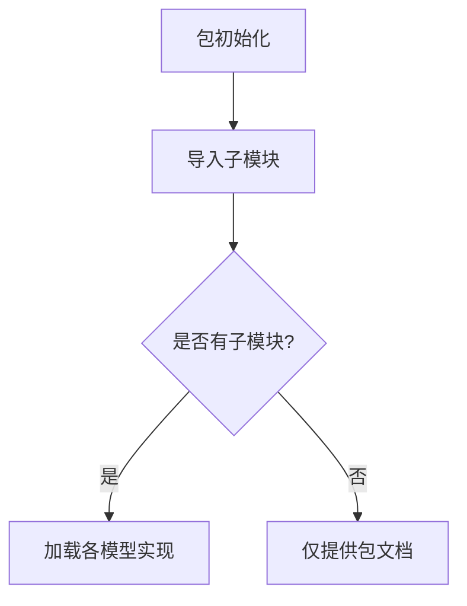

# `graphrag\packages\graphrag\graphrag\index\operations\embed_text\__init__.py` 详细设计文档

这是微软Indexing Engine项目的text embed包的根模块，目前仅包含版权信息和包级别文档说明，未包含具体实现代码。

## 整体流程



## 类结构

```
text_embed (包根)
└── (子模块待定义)
```

## 全局变量及字段


    

## 全局函数及方法


## 关键组件


### 核心功能概述

该代码为 Microsoft Indexing Engine 的 text embed 包的根模块，仅包含版权信息和包级文档字符串，作为 text embed 包的入口标记，不包含实际实现逻辑。

### 文件运行流程

由于该文件仅包含包级别的文档字符串和版权声明，无实际可执行代码，因此不涉及运行时流程。

### 类详细信息

无类定义。

### 全局变量和全局函数

无全局变量和全局函数定义。

### 关键组件信息

### 潜在技术债务或优化空间

### 其它项目


## 问题及建议


### 已知问题

- 缺少 `__version__` 版本信息管理，Python包应包含版本号以便依赖管理
- 缺少 `__all__` 导出列表，未明确该包的公共 API 接口
- 文档字符串过于简略，仅有包名描述，缺少功能说明、使用方式、依赖项等关键信息
- 未定义任何公开接口或子模块导入，用户无法通过包名直接访问内部功能
- 缺少类型标注支持（如 `py.typed` 标记文件），不利于类型检查工具运行

### 优化建议

- 添加 `__version__ = "1.0.0"` 或从版本配置文件动态读取版本信息
- 定义 `__all__` 列表显式声明公开导出的模块和函数
- 完善文档字符串，包含：功能描述、入口点说明、典型用例、依赖要求等
- 按需在 `__init__.py` 中导入核心子模块，提供一致的公共 API 入口
- 如涉及类型安全需求，添加 `py.typed` 文件并配置 mypy/pyright 支持


## 其它


### 设计目标与约束

本包作为Indexing Engine的文本嵌入模块的入口点，提供统一的包结构组织。当前版本仅定义包的基本结构，无运行时功能约束。设计目标是支持后续模块的集成与扩展。

### 错误处理与异常设计

不适用。本文件为纯Python包定义文件，无运行时逻辑，不涉及错误处理机制。后续子模块应遵循项目统一的异常设计规范。

### 数据流与状态机

不适用。当前文件无数据处理逻辑，不涉及数据流或状态机设计。

### 外部依赖与接口契约

当前无显式外部依赖。本包作为Indexing Engine的子模块，应遵循主项目的依赖管理规范。预计后续将引入文本嵌入相关的第三方库（如sentence-transformers、transformers等）。

### 配置管理

不适用。当前文件无配置需求。

### 安全性考虑

不适用。当前代码仅包含文档字符串，无敏感操作。

### 性能要求

不适用。当前为静态包定义文件。

### 兼容性考虑

本包应兼容Python 3.8+版本（具体版本要求需参照主项目规范）。应保持与Indexing Engine主框架的API兼容性。

### 测试策略

当前文件无需直接测试。后续子模块应包含单元测试和集成测试。

### 部署相关

本包作为Indexing Engine的子模块，通过主项目统一管理部署。包结构应符合Python打包规范（PEP 420命名空间包）。

### 版本管理

当前版本遵循主项目版本号规范。包内应包含__version__变量（建议添加）。

### 许可协议

本代码基于MIT License授权。版权归属Microsoft Corporation。

### 代码规范与样式指南

应遵循PEP 8代码样式规范，并符合项目内部的代码审查标准。建议添加类型注解（type hints）以提升代码可维护性。

### 文档与注释规范

模块级文档字符串应遵循Google或NumPy风格。建议在后续子模块中添加详细的API文档。

    