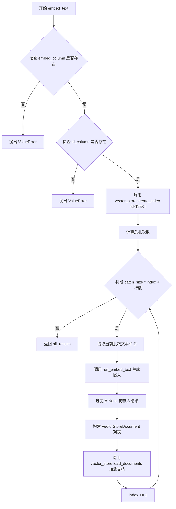
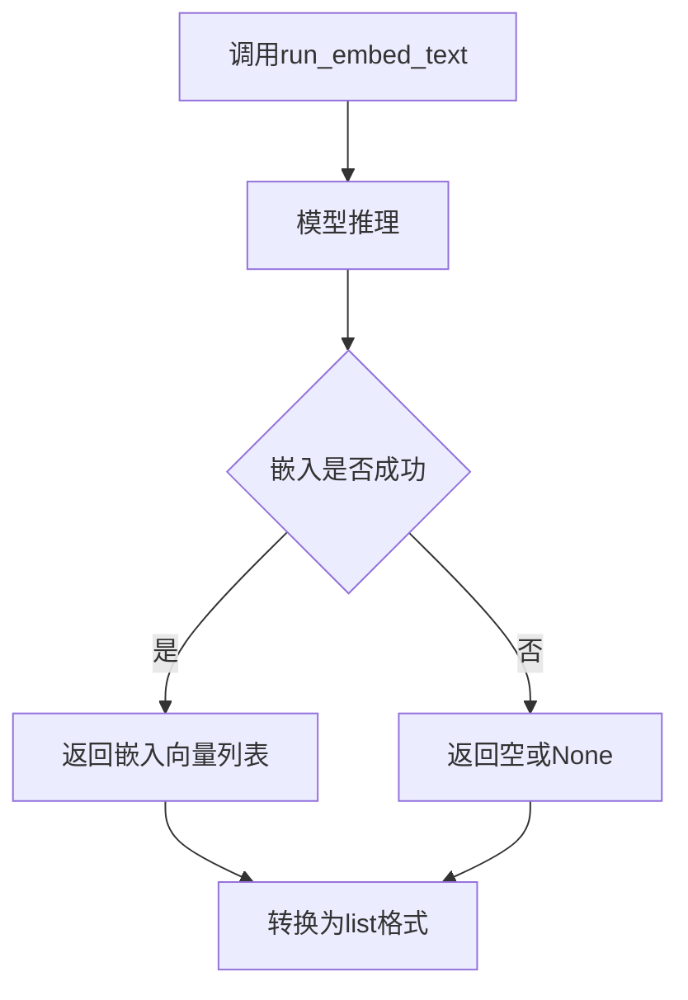
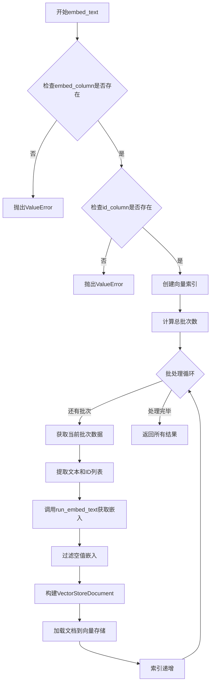

# `graphrag\packages\graphrag\graphrag\index\operations\embed_text\embed_text.py` 详细设计文档

这是一个文本嵌入模块，负责将DataFrame中的文本数据通过指定的嵌入模型转换为向量，并批量存储到向量数据库中。该模块支持大批量数据的分批处理、错误过滤和异步执行，是RAG（检索增强生成）系统中向量化的核心组件。

## 整体流程



## 类结构

```
embed_text (模块)
└── embed_text (异步函数)
```

## 全局变量及字段


### `logging`
    
Python标准日志模块，用于记录程序运行信息

类型：`module`
    


### `np`
    
NumPy库，用于科学计算和多维数组操作

类型：`module`
    


### `pd`
    
Pandas库，用于数据处理和分析

类型：`module`
    


### `logger`
    
模块级日志记录器，用于记录嵌入过程的日志信息

类型：`logging.Logger`
    


### `input`
    
输入的DataFrame，包含待嵌入的文本数据

类型：`pd.DataFrame`
    


### `callbacks`
    
工作流回调对象，用于处理嵌入过程中的事件和状态

类型：`WorkflowCallbacks`
    


### `model`
    
LLM嵌入模型，用于将文本转换为向量表示

类型：`LLMEmbedding`
    


### `tokenizer`
    
分词器，用于对文本进行分词处理

类型：`Tokenizer`
    


### `embed_column`
    
要嵌入的列名，指定DataFrame中包含文本内容的列

类型：`str`
    


### `batch_size`
    
批处理大小，每次处理的数据行数

类型：`int`
    


### `batch_max_tokens`
    
每批最大token数，控制每个批次的token消耗上限

类型：`int`
    


### `num_threads`
    
线程数，用于并行处理的线程数量

类型：`int`
    


### `vector_store`
    
向量存储实例，用于存储和检索嵌入向量

类型：`VectorStore`
    


### `id_column`
    
ID列名，默认为id，用于标识每个文档的唯一ID

类型：`str`
    


### `index`
    
批次索引，记录当前处理的批次编号

类型：`int`
    


### `all_results`
    
所有嵌入结果列表，收集所有批次的嵌入向量

类型：`list`
    


### `num_total_batches`
    
总批次数，计算需要处理的批次总数

类型：`int`
    


### `batch`
    
当前批次数据，包含本批次提取的文本和ID

类型：`pd.DataFrame`
    


### `texts`
    
当前批次文本列表，从指定列提取的文本内容

类型：`list[str]`
    


### `ids`
    
当前批次ID列表，对应文本的唯一标识符

类型：`list[str]`
    


### `result`
    
嵌入操作返回结果，包含生成的嵌入向量

类型：`EmbedResult`
    


### `embeddings`
    
嵌入向量列表，过滤掉None值后的有效嵌入向量

类型：`list`
    


### `vectors`
    
向量列表，用于创建向量存储文档的向量数据

类型：`list`
    


### `documents`
    
向量存储文档列表，包含ID和向量对的文档对象

类型：`list[VectorStoreDocument]`
    


### `doc_id`
    
文档ID，当前处理文档的唯一标识符

类型：`str`
    


### `doc_vector`
    
文档向量，文本的嵌入表示，可能为numpy数组或列表

类型：`np.ndarray | list`
    


### `VectorStoreDocument.id`
    
文档唯一标识符

类型：`str`
    


### `VectorStoreDocument.vector`
    
文档的向量表示

类型：`list`
    
    

## 全局函数及方法


### `embed_text`

将DataFrame中的文本批量嵌入到向量空间中，输出包含doc_id和vector映射的嵌入结果列表。

参数：

- `input`：`pd.DataFrame`，待嵌入文本的输入数据框
- `callbacks`：`WorkflowCallbacks`，工作流回调接口，用于处理嵌入过程中的事件
- `model`：`LLMEmbedding`，嵌入模型实例，负责将文本转换为向量
- `tokenizer`：`Tokenizer`，文本分词器，用于处理文本分词
- `embed_column`：`str`，需要嵌入的文本列名
- `batch_size`：`int`，每批处理的记录数量
- `batch_max_tokens`：`int`，每批最大token数限制
- `num_threads`：`int`，并行处理的线程数
- `vector_store`：`VectorStore`，向量存储实例，用于持久化嵌入向量
- `id_column`：`str`，文档ID列名，默认为"id"

返回值：`list`，返回所有嵌入向量的列表

#### 流程图

```mermaid
flowchart TD
    A[开始 embed_text] --> B{检查 embed_column 是否存在}
    B -->|否| C[抛出 ValueError]
    B -->|是 --> D{检查 id_column 是否存在}
    D -->|否| E[抛出 ValueError]
    D -->|是 --> F[创建向量存储索引]
    F --> G[初始化 index=0 和 all_results]
    G --> H{判断是否还有未处理批次}
    H -->|否| I[返回 all_results]
    H -->|是 --> J[计算当前批次数据]
    J --> K[调用 run_embed_text 异步执行嵌入]
    K --> L[过滤空嵌入结果]
    L --> M[构建 VectorStoreDocument 列表]
    M --> N[加载文档到向量存储]
    N --> O[index += 1]
    O --> H
```

#### 带注释源码

```python
async def embed_text(
    input: pd.DataFrame,
    callbacks: WorkflowCallbacks,
    model: "LLMEmbedding",
    tokenizer: Tokenizer,
    embed_column: str,
    batch_size: int,
    batch_max_tokens: int,
    num_threads: int,
    vector_store: VectorStore,
    id_column: str = "id",
):
    """Embed a piece of text into a vector space. The operation outputs a new column containing a mapping between doc_id and vector."""
    # 验证embed_column列是否存在于输入DataFrame中
    if embed_column not in input.columns:
        msg = f"Column {embed_column} not found in input dataframe with columns {input.columns}"
        raise ValueError(msg)
    # 验证id_column列是否存在于输入DataFrame中
    if id_column not in input.columns:
        msg = f"Column {id_column} not found in input dataframe with columns {input.columns}"
        raise ValueError(msg)

    # 为向量存储创建索引
    vector_store.create_index()

    index = 0  # 批次索引初始化

    all_results = []  # 存储所有嵌入结果

    # 计算总批次数：(总行数 + 批次大小 - 1) // 批次大小
    num_total_batches = (input.shape[0] + batch_size - 1) // batch_size
    # 循环处理所有批次
    while batch_size * index < input.shape[0]:
        logger.info(
            "uploading text embeddings batch %d/%d of size %d to vector store",
            index + 1,
            num_total_batches,
            batch_size,
        )
        # 获取当前批次数据
        batch = input.iloc[batch_size * index : batch_size * (index + 1)]
        # 提取文本列和ID列
        texts: list[str] = batch[embed_column].tolist()
        ids: list[str] = batch[id_column].tolist()
        # 调用异步函数执行嵌入
        result = await run_embed_text(
            texts,
            callbacks,
            model,
            tokenizer,
            batch_size,
            batch_max_tokens,
            num_threads,
        )
        # 过滤掉None值的嵌入结果
        if result.embeddings:
            embeddings = [
                embedding for embedding in result.embeddings if embedding is not None
            ]
            all_results.extend(embeddings)

        vectors = result.embeddings or []
        documents: list[VectorStoreDocument] = []
        # 构建VectorStoreDocument对象列表
        for doc_id, doc_vector in zip(ids, vectors, strict=True):
            # 如果是numpy数组则转换为列表
            if type(doc_vector) is np.ndarray:
                doc_vector = doc_vector.tolist()
            document = VectorStoreDocument(
                id=doc_id,
                vector=doc_vector,
            )
            documents.append(document)

        # 批量加载文档到向量存储
        vector_store.load_documents(documents)
        index += 1

    return all_results
```


# 设计文档提取结果

由于 `run_embed_text` 函数是从外部模块导入的（`from graphrag.index.operations.embed_text.run_embed_text import run_embed_text`），其完整源代码未在当前代码文件中提供。但我可以从调用点提取其接口信息：

### `run_embed_text`

导入的嵌入执行函数，负责实际的文本到向量转换，将文本列表转换为嵌入向量。

参数：

- `texts`：`list[str]`，需要嵌入的文本列表
- `callbacks`：`WorkflowCallbacks`，工作流回调处理器
- `model`：`LLMEmbedding`，嵌入模型实例
- `tokenizer`：`Tokenizer`，分词器实例
- `batch_size`：`int`，批处理大小
- `batch_max_tokens`：`int`，每批最大token数
- `num_threads`：`int`，线程数

返回值：`RunEmbedTextResult`，包含嵌入向量的结果对象，其中 `embeddings` 属性为 `list[np.ndarray]`

#### 流程图



#### 带注释源码

```python
# 注意：以下为调用点的源码，run_embed_text的具体实现未在此文件中
result = await run_embed_text(  # 异步调用嵌入执行函数
    texts,                       # 文本列表
    callbacks,                   # 回调处理器
    model,                       # 嵌入模型
    tokenizer,                   # 分词器
    batch_size,                  # 批大小
    batch_max_tokens,            # 批最大token数
    num_threads,                 # 线程数
)
# result对象包含embeddings属性，为np.ndarray列表
```

---

## 补充：完整函数 `embed_text` 设计文档

虽然用户要求提取 `run_embed_text`，但为了完整性，以下是当前文件中 `embed_text` 函数的完整设计文档：

### `embed_text`

将 DataFrame 中的文本列转换为向量嵌入并存储到向量数据库中。

参数：

- `input`：`pd.DataFrame`，输入数据框
- `callbacks`：`WorkflowCallbacks`，工作流回调
- `model`：`LLMEmbedding`，嵌入模型
- `tokenizer`：`Tokenizer`，分词器
- `embed_column`：`str`，需要嵌入的文本列名
- `batch_size`：`int`，批处理大小
- `batch_max_tokens`：`int`，每批最大token数
- `num_threads`：`int`，线程数
- `vector_store`：`VectorStore`，向量存储实例
- `id_column`：`str`，ID列名，默认为 "id"

返回值：`list`，所有嵌入向量的列表

#### 流程图



#### 带注释源码

```python
async def embed_text(
    input: pd.DataFrame,
    callbacks: WorkflowCallbacks,
    model: "LLMEmbedding",
    tokenizer: Tokenizer,
    embed_column: str,
    batch_size: int,
    batch_max_tokens: int,
    num_threads: int,
    vector_store: VectorStore,
    id_column: str = "id",
):
    """Embed a piece of text into a vector space. The operation outputs a new column containing a mapping between doc_id and vector."""
    # 验证输入列是否存在
    if embed_column not in input.columns:
        msg = f"Column {embed_column} not found in input dataframe with columns {input.columns}"
        raise ValueError(msg)
    if id_column not in input.columns:
        msg = f"Column {id_column} not found in input dataframe with columns {input.columns}"
        raise ValueError(msg)

    # 初始化向量存储索引
    vector_store.create_index()

    index = 0
    all_results = []

    # 计算总批次数：(总行数 + 批大小 - 1) // 批大小
    num_total_batches = (input.shape[0] + batch_size - 1) // batch_size
    
    # 批处理循环
    while batch_size * index < input.shape[0]:
        logger.info(
            "uploading text embeddings batch %d/%d of size %d to vector store",
            index + 1,
            num_total_batches,
            batch_size,
        )
        # 获取当前批次数据
        batch = input.iloc[batch_size * index : batch_size * (index + 1)]
        texts: list[str] = batch[embed_column].tolist()
        ids: list[str] = batch[id_column].tolist()
        
        # 调用run_embed_text获取嵌入向量
        result = await run_embed_text(
            texts,
            callbacks,
            model,
            tokenizer,
            batch_size,
            batch_max_tokens,
            num_threads,
        )
        
        # 过滤空值嵌入
        if result.embeddings:
            embeddings = [
                embedding for embedding in result.embeddings if embedding is not None
            ]
            all_results.extend(embeddings)

        # 构建向量存储文档
        vectors = result.embeddings or []
        documents: list[VectorStoreDocument] = []
        for doc_id, doc_vector in zip(ids, vectors, strict=True):
            if type(doc_vector) is np.ndarray:
                doc_vector = doc_vector.tolist()
            document = VectorStoreDocument(
                id=doc_id,
                vector=doc_vector,
            )
            documents.append(document)

        # 加载文档到向量存储
        vector_store.load_documents(documents)
        index += 1

    return all_results
```

---

## 技术债务与优化建议

1. **缺少 `run_embed_text` 源代码**：无法进行完整分析，建议查看 `graphrag.index.operations.embed_text.run_embed_text` 模块
2. **串行批处理**：当前使用 `while` 循环串行处理批次，可考虑并行处理多个批次
3. **错误处理缺失**：`run_embed_text` 调用失败时仅继续执行，无重试机制
4. **类型提示不完整**：使用 `"LLMEmbedding"` 字符串前向引用，建议使用 TYPE_CHECKING 导入

## 关键组件


### 一段话描述

该代码是一个异步文本嵌入模块，通过分批处理将DataFrame中的文本数据转换为向量，并存储到向量存储系统中，支持批量处理、错误过滤和NumPy数组到列表的反量化转换。

### 文件的整体运行流程

1. 验证输入DataFrame中是否存在指定的嵌入列和ID列
2. 创建向量存储索引
3. 计算总批次数
4. 循环遍历数据：
   - 提取当前批次的文本和ID
   - 调用`run_embed_text`异步生成嵌入向量
   - 过滤掉None值
   - 将NumPy数组反量化为列表
   - 创建VectorStoreDocument并加载到向量存储
5. 返回所有嵌入结果

### 关键组件信息

### 张量索引与惰性加载

使用`input.iloc`进行切片索引，实现数据的惰性加载，每次只处理一个批次的数据，避免一次性加载整个数据集到内存。

### 反量化支持

代码第65-66行包含类型检查和转换逻辑：`if type(doc_vector) is np.ndarray: doc_vector = doc_vector.tolist()`，将NumPy数组反量化为Python列表，以兼容向量存储的格式要求。

### 批量处理策略

通过`batch_size`和`batch_max_tokens`参数控制批处理规模，使用`while`循环和索引变量`index`实现迭代，支持大批量数据的分批嵌入处理。

### 错误过滤机制

代码第61-63行实现了嵌入结果的过滤：`embeddings = [embedding for embedding in result.embeddings if embedding is not None]`，过滤掉生成失败的None值。

### 潜在的技术债务或优化空间

1. 缺少嵌入失败的详细日志记录，难以追踪哪些文本嵌入失败
2. 没有实现`batch_max_tokens`的动态计算逻辑，当前实现未使用该参数
3. 错误处理机制不完善，某个批次失败会导致整个函数失败
4. 索引递增逻辑可以优化为更Pythonic的`for i in range(0, input.shape[0], batch_size)`形式

### 其它项目

**设计目标与约束**：将文本数据批量转换为向量表示，输出ID到向量的映射关系

**错误处理与异常设计**：通过ValueError捕获列名缺失异常，嵌入失败时返回None并在后续过滤

**数据流与状态机**：输入DataFrame → 分批处理 → 嵌入生成 → 向量存储 → 返回结果列表

**外部依赖与接口契约**：依赖`run_embed_text`、`VectorStore`、`WorkflowCallbacks`、`LLMEmbedding`等接口，需要传入有效的tokenizer和model实例

## 问题及建议


### 已知问题

-   **索引重复创建**：在while循环内每次迭代都调用`vector_store.create_index()`，但索引通常只需要创建一次，造成不必要的开销
-   **异常处理缺失**：没有对`run_embed_text`调用进行try-except包装，如果嵌入过程出错会导致整个流程中断
-   **返回值与逻辑不一致**：收集了`all_results`但实际上每次循环直接将`result.embeddings`用于构建文档，`all_results`的收集显得冗余
-   **类型检查方式不当**：使用`type(doc_vector) is np.ndarray`而非`isinstance(doc_vector, np.ndarray)`，不够Pythonic且可能漏掉子类
-   **日志信息不准确**：日志中显示的`batch_size`是配置值而非实际批次大小（最后一批可能更小），可能造成误导

### 优化建议

-   **将索引创建移出循环**：在while循环之前调用一次`vector_store.create_index()`
-   **添加异常处理**：为`run_embed_text`调用添加try-except，捕获并记录可能的嵌入错误，允许跳过失败的批次继续处理
-   **简化返回值逻辑**：如果不需要返回所有embeddings，则移除`all_results`的收集；如果需要，则应在循环外统一处理
-   **改进类型检查**：将`type(doc_vector) is np.ndarray`改为`isinstance(doc_vector, np.ndarray)`
-   **修正日志输出**：计算实际批次大小或在日志中说明显示的是配置值
-   **添加输入验证**：对`model`、`tokenizer`、`batch_size`等关键参数进行非空和有效性检查
-   **考虑并行处理**：评估使用`asyncio.gather`并行处理多个batch的可行性以提升性能

## 其它


### 设计目标与约束

该模块的核心目标是将输入的文本数据通过嵌入模型转换为向量表示，并批量存储到向量数据库中。设计约束包括：1) 必须支持异步处理以提高性能；2) 需要处理不同大小的批次以优化内存使用；3) 向量存储必须支持批量文档加载；4) 输入数据框必须包含指定的嵌入列和ID列。

### 错误处理与异常设计

函数在嵌入列或ID列不存在时主动抛出ValueError异常，提供清晰的错误信息说明缺失的列名。批处理过程中如果某个嵌入结果为None会被过滤掉，避免空值传播。run_embed_text返回的embeddings可能为None或包含None元素，代码通过条件判断进行处理。向量转换时使用type()进行严格类型检查，将numpy数组转换为list以兼容向量存储接口。

### 数据流与状态机

数据流从input DataFrame开始，经历以下阶段：1) 输入验证阶段检查列是否存在；2) 索引初始化阶段调用vector_store.create_index()；3) 批处理循环阶段按batch_size分批处理；4) 嵌入生成阶段调用run_embed_text异步生成向量；5) 结果聚合阶段过滤None值并收集所有嵌入；6) 文档转换阶段将ID和向量组装为VectorStoreDocument对象；7) 存储阶段调用vector_store.load_documents批量写入；8) 最终返回所有嵌入结果列表。

### 外部依赖与接口契约

主要依赖包括：pandas用于数据框操作，numpy用于向量处理，graphrag_llm.tokenizer提供分词功能，graphrag_vectors提供VectorStore和VectorStoreDocument类，graphrag.index.operations.embed_text.run_embed_text执行实际嵌入逻辑，graphrag.callbacks.workflow_callbacks提供工作流回调机制。调用方需确保input DataFrame包含embed_column和id_column指定的列，model实现了LLMEmbedding接口，tokenizer与model匹配，vector_store已正确初始化。

### 性能考虑

批处理大小和每批最大token数可配置以适应不同硬件条件。使用async/await实现非阻塞嵌入调用。批处理循环中使用切片复制避免全量数据加载。通过过滤None值减少无效存储。num_threads参数控制嵌入计算的并行度。

### 配置与可扩展性

embed_column、id_column、batch_size、batch_max_tokens、num_threads均通过参数暴露，支持运行时配置。向量化模型可通过实现LLMEmbedding接口替换。VectorStore抽象允许切换不同的向量存储后端。

### 测试策略建议

应包含单元测试验证列不存在时的异常抛出，集成测试验证完整的数据流和向量输出正确性，性能测试评估不同batch_size配置下的吞吐量和内存占用。

### 日志与监控

使用标准logging模块记录进度，每批次开始时输出当前批次编号、总批次数和批次大小，便于追踪长时间运行的嵌入任务进度。


    