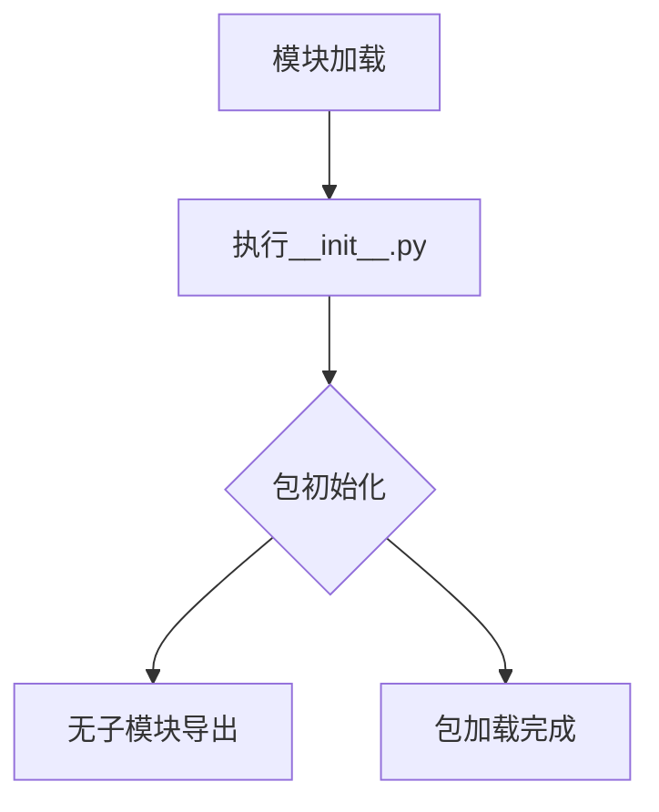

# `graphrag\packages\graphrag\graphrag\index\operations\extract_covariates\__init__.py` 详细设计文档

这是Microsoft Indexing Engine中text extract claims包的根模块，负责声明和导出该子包的功能，目前该文件仅包含版权信息和包级别文档字符串，实际功能实现尚未展开。

## 整体流程



## 类结构

```

```

## 全局变量及字段


    

## 全局函数及方法


## 关键组件


### 一段话描述

该代码是 Microsoft Indexing Engine 项目中 text extract claims 包的根模块，主要作为包的入口文件，仅包含版权信息和包的功能描述声明，无实际实现逻辑。

### 文件的整体运行流程

该文件为 Python 包的 `__init__.py` 根文件，不包含任何可执行代码，仅作为包的命名空间和文档用途。导入该包时会直接返回，不执行任何初始化逻辑。

### 类的详细信息

无类定义。

### 全局变量和全局函数

无全局变量或全局函数。

### 关键组件信息

#### Indexing Engine 核心包

描述：项目的根包目录，标识为 Microsoft Indexing Engine，主要负责文本索引和提取功能。

#### text extract claims 子包

描述：根据包路径和文档字符串推断，该子包可能负责从文本中提取声明(claims)的相关功能，属于 Indexing Engine 架构的一部分。

### 潜在的技术债务或优化空间

当前代码仅为占位符包根目录，无技术债务。但需要注意：
- 该包目前无实际实现，需要后续补充核心功能模块
- 缺少包的初始化逻辑（如版本信息、依赖导入等）
- 文档字符串可以更详细地说明该包的职责和使用方式

### 其它项目

#### 设计目标与约束

- 遵循 MIT 开源许可证
- 属于 Microsoft Indexing Engine 项目的一部分

#### 错误处理与异常设计

无异常处理设计（代码中无可执行逻辑）

#### 数据流与状态机

无数据流或状态机设计

#### 外部依赖与接口契约

无外部依赖声明

#### 备注

该代码文件为初始化的包根目录，未包含用户提到的"张量索引与惰性加载、反量化支持、量化策略"等组件的具体实现。这些功能可能需要在其他模块中实现。


## 问题及建议


### 已知问题

-   **空包实现**：该文件仅包含版权声明和文档字符串，未导出任何实质性的模块、功能或类，缺乏实际功能实现
-   **缺少 __init__.py**：作为包根目录，缺少 `__init__.py` 文件，虽然 Python 3.3+ 支持隐式命名空间包，但显式声明更符合最佳实践
-   **文档字符串不完整**：模块文档字符串过于简洁，未说明包的具体用途、核心 API 或使用方式
-   **缺乏版本管理**：未包含版本信息（如 `__version__` 变量），不利于依赖管理和版本追踪
-   **无接口导出**：作为 text extract claims 包的根目录，未导出任何公共接口或子模块

### 优化建议

-   **添加 __init__.py**：在包根目录创建 `__init__.py` 文件，显式声明为 Python 包
-   **完善文档字符串**：扩展模块文档，说明包的核心功能、主要组件和使用方式
-   **添加版本信息**：定义 `__version__` 变量，便于版本管理和发布流程
-   **导出核心功能**：在 `__init__.py` 中合理导出子模块和主要类/函数，提供统一的公共接口
-   **添加类型提示和文档**：如包含实际功能，应添加类型提示和详细的函数/类文档字符串


## 其它


### 设计目标与约束

设计目标：该包作为 Indexing Engine 的 text extract claims 子包，负责从文本中提取声明（claims）信息，为索引引擎提供结构化的语义内容支持。

约束：
- 必须遵循 MIT 开源许可协议
- 需与 Indexing Engine 主框架保持一致的代码风格和架构规范
- 预期处理大规模文本数据，需考虑性能和可扩展性

### 错误处理与异常设计

由于当前代码仅包含包声明，无实际实现，异常设计需在后续开发中定义。建议设计要点：
- 定义包级别的自定义异常类（如 ClaimsExtractionError）
- 明确各方法可能抛出的异常类型及条件
- 建立统一的错误码和错误消息规范

### 数据流与状态机

数据流设计（预期）：
1. 输入：原始文本数据（字符串或文本文件）
2. 处理：文本预处理 → 语义分析 → 声明提取 → 结构化输出
3. 输出：声明列表（List[Claim]），每个 Claim 包含主题、谓语、宾语等属性

状态机（预期）：
- IDLE（初始状态）
- PREPROCESSING（预处理中）
- EXTRACTING（提取中）
- VALIDATING（验证中）
- COMPLETED（完成）
- ERROR（错误状态）

### 外部依赖与接口契约

当前无外部依赖。未来可能依赖：
- 文本处理库（如正则表达式、NLP 库）
- 索引引擎核心模块
- 配置管理模块

接口契约（预期）：
- extract_claims(text: str) -> List[Claim]
- validate_claim(claim: Claim) -> bool
- Batch 处理接口以支持大规模数据

### 配置与参数说明

待定义。预期包含：
- 提取模式配置（精细/粗略）
- 语言模型参数
- 并行处理配置
- 输出格式配置

### 版本兼容性说明

当前版本：0.1.0（假设）
- 版权年份：2024
- 许可协议：MIT License
- 兼容性：待后续版本迭代确定

### 待实现功能清单

由于当前代码仅包含包声明，以下功能需后续实现：
- 声明提取核心算法
- 文本预处理模块
- 结果验证模块
- 批量处理接口
- 单元测试覆盖

### 技术债务与优化空间

当前状态：技术债务为 0（无实现）
后续开发需关注：
- 算法效率优化
- 内存使用优化
- 并行处理能力
- 错误恢复机制


    