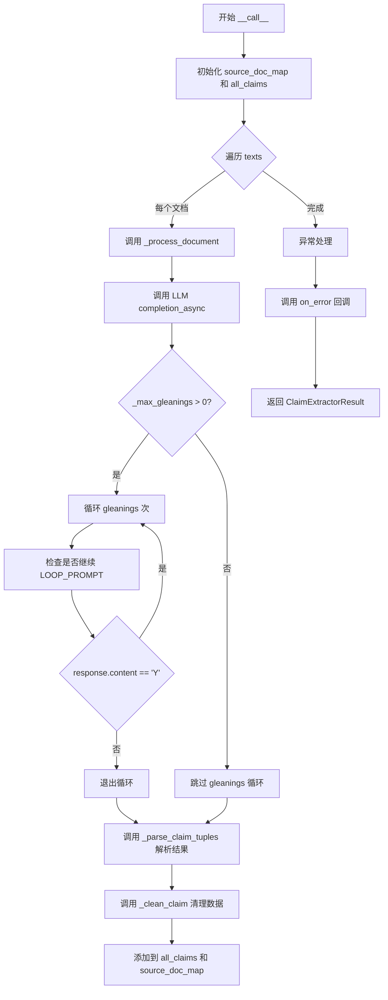
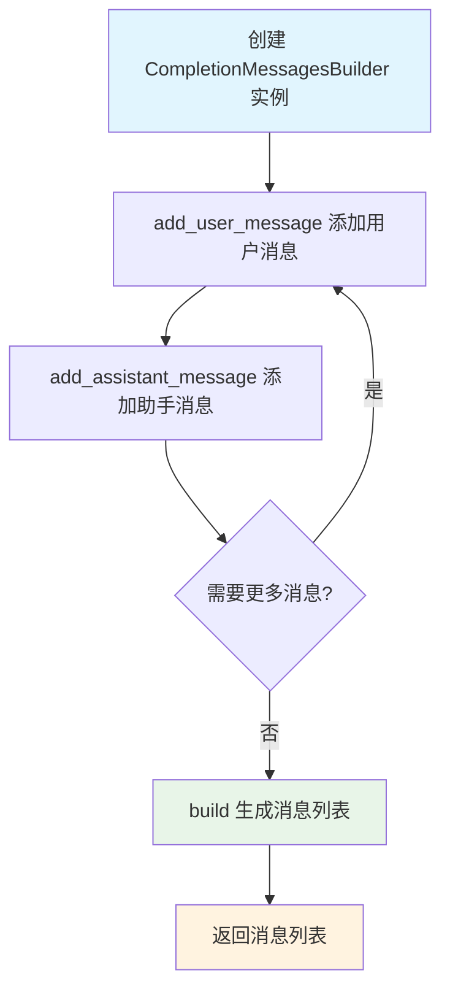
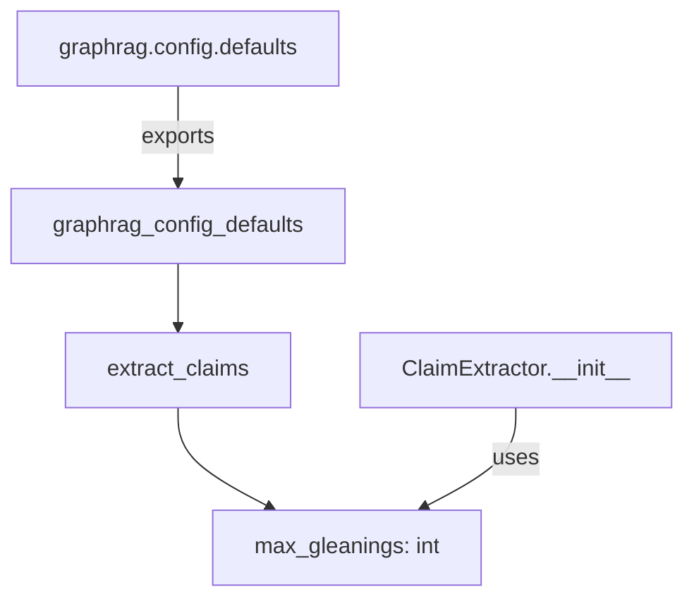
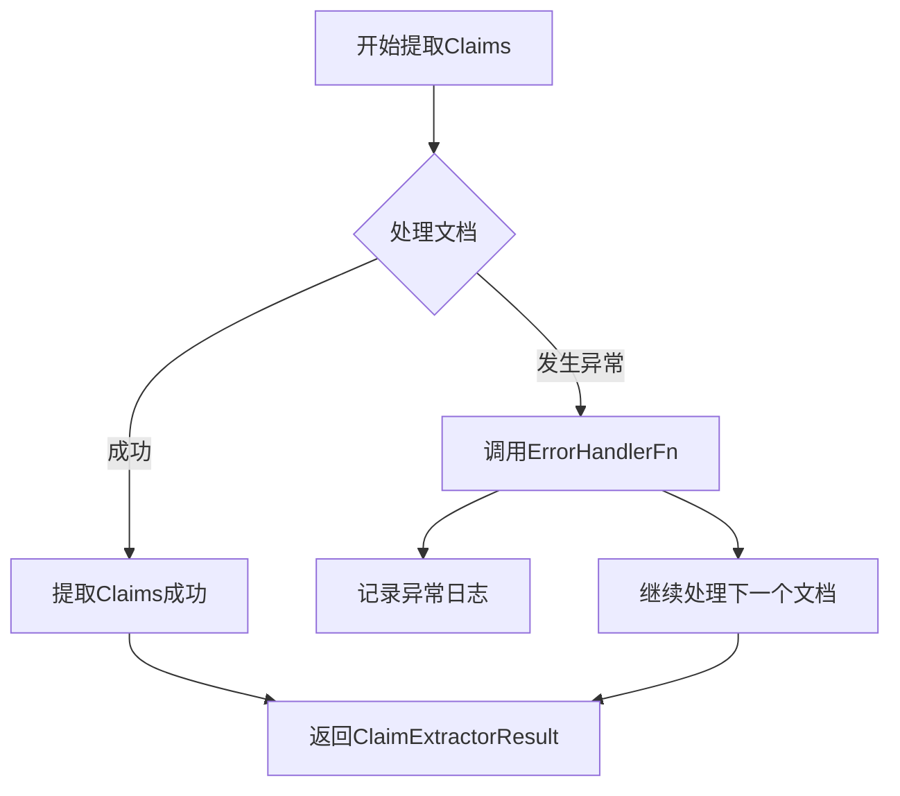
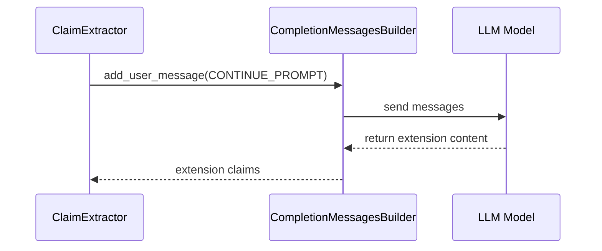
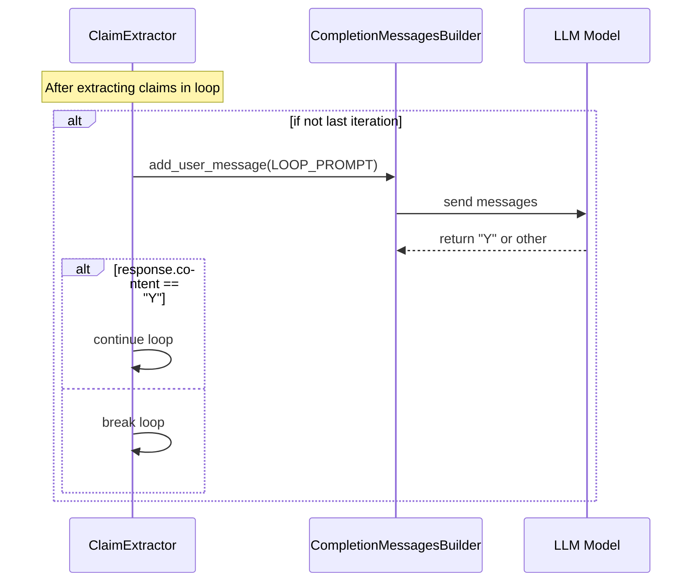
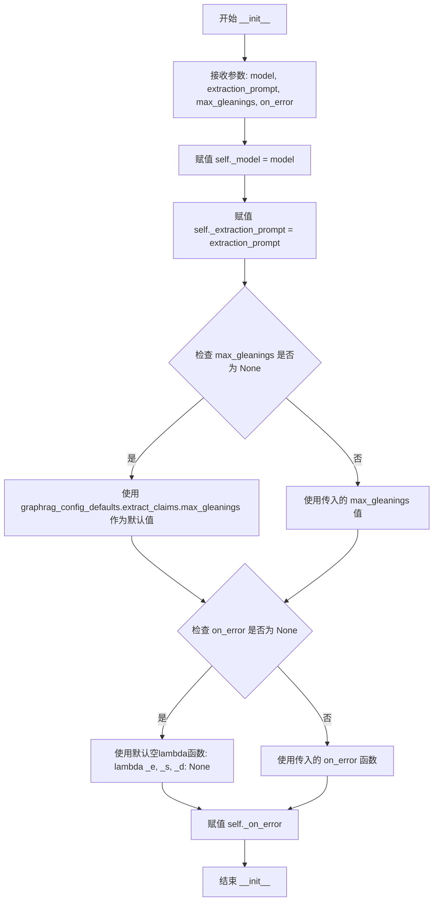
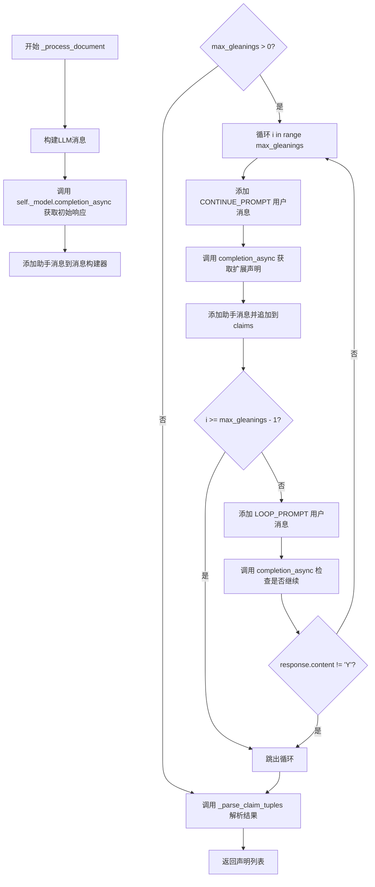
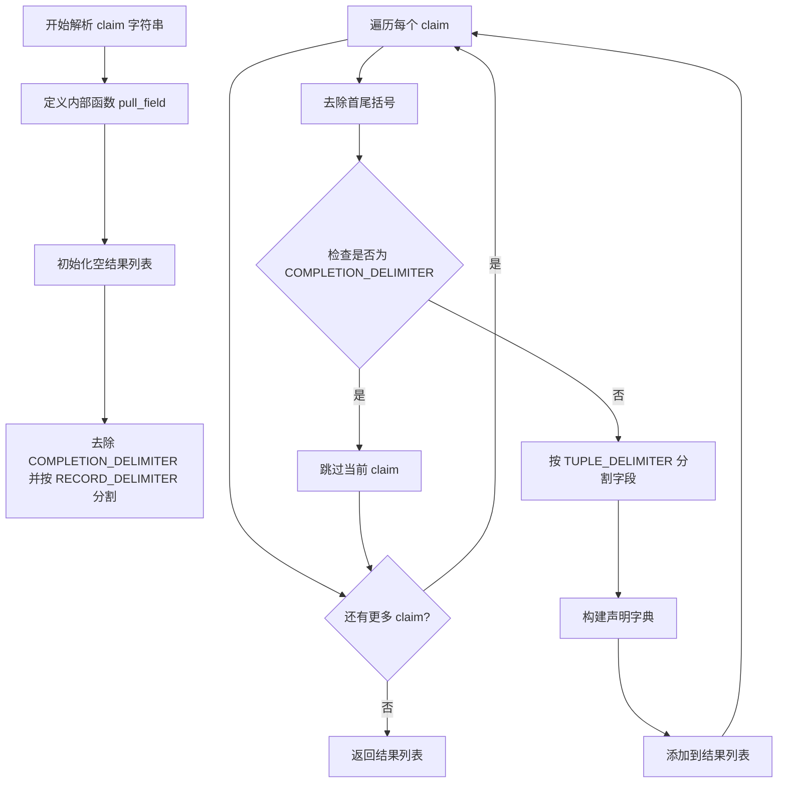

# `graphrag\packages\graphrag\graphrag\index\operations\extract_covariates\claim_extractor.py` 详细设计文档

一个用于从文本中提取声明(claims)的提取器模块，通过调用LLM模型从非结构化文本中识别并提取实体间的声明信息，支持多次迭代提取(glEANINGS)以获取更全面的结果，并提供错误处理和结果解析功能。

## 整体流程



## 类结构

```
dataclass ClaimExtractorResult (数据类)
└── ClaimExtractor (主提取器类)
    ├── __init__ (初始化)
    ├── __call__ (异步调用入口)
    ├── _process_document (处理单个文档)
    ├── _clean_claim (清理声明数据)
    └── _parse_claim_tuples (解析声明元组)
```

## 全局变量及字段


### `INPUT_TEXT_KEY`
    
输入文本的键名常量，用于提示模板中引用文本

类型：`str`
    


### `INPUT_ENTITY_SPEC_KEY`
    
输入实体规范的键名常量，用于提示模板中引用实体规格

类型：`str`
    


### `INPUT_CLAIM_DESCRIPTION_KEY`
    
输入声明描述的键名常量，用于提示模板中引用声明描述

类型：`str`
    


### `INPUT_RESOLVED_ENTITIES_KEY`
    
输入已解析实体的键名常量，用于引用已解析的实体映射

类型：`str`
    


### `RECORD_DELIMITER_KEY`
    
记录分隔符的键名常量

类型：`str`
    


### `COMPLETION_DELIMITER_KEY`
    
完成分隔符的键名常量

类型：`str`
    


### `TUPLE_DELIMITER`
    
元组分隔符常量，用于分隔声明中的各个字段

类型：`str`
    


### `RECORD_DELIMITER`
    
记录分隔符常量，用于分隔多条声明记录

类型：`str`
    


### `COMPLETION_DELIMITER`
    
完成分隔符常量，标记LLM输出的结束位置

类型：`str`
    


### `logger`
    
模块级日志记录器，用于记录提取过程中的错误和信息

类型：`logging.Logger`
    


### `ClaimExtractorResult.output`
    
提取的声明列表

类型：`list[dict]`
    


### `ClaimExtractorResult.sourceDocs`
    
源文档ID到原文的映射

类型：`dict[str, Any]`
    


### `ClaimExtractor.model`
    
LLM模型实例用于生成提取

类型：`LLMCompletion`
    


### `ClaimExtractor.extractionPrompt`
    
用于提取声明的提示模板

类型：`str`
    


### `ClaimExtractor.maxGleanings`
    
最大迭代提取次数

类型：`int`
    


### `ClaimExtractor.onError`
    
错误处理回调函数

类型：`ErrorHandlerFn`
    
    

## 全局函数及方法


### `CompletionMessagesBuilder`

用于构建 LLM Completion API 所需的消息列表，支持链式调用添加不同角色的消息（用户/助手），最终生成可供模型使用的消息格式。

参数：

- 无直接参数，通过链式方法添加内容

返回值：`list[dict]`，返回符合 LLM API 格式的消息列表，每条消息包含 `role` 和 `content` 字段

#### 流程图



#### 带注释源码

```
# CompletionMessagesBuilder 类定义（基于使用方式推断）
class CompletionMessagesBuilder:
    """消息构建器类，用于构建 LLM Completion API 的消息列表"""
    
    def __init__(self):
        """初始化消息列表"""
        self._messages: list[dict] = []
    
    def add_user_message(self, content: str) -> "CompletionMessagesBuilder":
        """
        添加用户消息
        
        参数：
        - content: str，用户消息内容
        
        返回：
        - CompletionMessagesBuilder，返回自身以支持链式调用
        """
        self._messages.append({
            "role": "user",
            "content": content
        })
        return self
    
    def add_assistant_message(self, content: str) -> "CompletionMessagesBuilder":
        """
        添加助手/模型回复消息
        
        参数：
        - content: str，助手消息内容
        
        返回：
        - CompletionMessagesBuilder，返回自身以支持链式调用
        """
        self._messages.append({
            "role": "assistant", 
            "content": content
        })
        return self
    
    def build(self) -> list[dict]:
        """
        构建最终的消息列表
        
        返回：
        - list[dict]，符合 LLM API 格式的消息列表
        """
        return self._messages.copy()
```

#### 在 `ClaimExtractor._process_document` 中的使用示例

```python
# 创建消息构建器并添加用户消息
messages_builder = CompletionMessagesBuilder().add_user_message(
    self._extraction_prompt.format(**{
        INPUT_TEXT_KEY: text,
        INPUT_CLAIM_DESCRIPTION_KEY: claim_description,
        INPUT_ENTITY_SPEC_KEY: entity_spec,
    })
)

# 调用模型获取回复
response: LLMCompletionResponse = await self._model.completion_async(
    messages=messages_builder.build(),
)
results = response.content

# 将助手回复添加到消息历史
messages_builder.add_assistant_message(results)

# 循环 gleanings：继续获取更多 claims
if self._max_gleanings > 0:
    for i in range(self._max_gleanings):
        # 添加继续提示
        messages_builder.add_user_message(CONTINUE_PROMPT)
        response = await self._model.completion_async(
            messages=messages_builder.build(),
        )
        extension = response.content
        messages_builder.add_assistant_message(extension)
        claims += RECORD_DELIMITER + extension.strip().removesuffix(
            COMPLETION_DELIMITER
        )
        
        # 检查是否需要继续
        if i >= self._max_gleanings - 1:
            break
        
        # 添加循环提示检查是否还有更多 claims
        messages_builder.add_user_message(LOOP_PROMPT)
        response = await self._model.completion_async(
            messages=messages_builder.build(),
        )
        
        if response.content != "Y":
            break
```


# 分析结果

## 说明

在提供的代码中，`graphrag_config_defaults` 是从 `graphrag.config.defaults` 模块**导入**的外部配置对象，并不是在该代码文件中定义的。该函数/对象的实际定义位于 `graphrag.config.defaults` 模块中，在当前代码片段中不可见。

根据代码中的**使用方式**（`graphrag_config_defaults.extract_claims.max_gleanings`），可以推断该对象的结构如下：

---

### `graphrag_config_defaults`

从外部模块导入的配置对象，提供 GraphRAG 的默认配置值。

根据代码推断：

- **路径**: `graphrag.config.defaults.graphrag_config_defaults`
- **结构**: 包含 `extract_claims` 属性，该属性是一个对象，包含 `max_gleanings` 配置

推断的参数：

- 此对象为配置类实例，无传统函数参数

返回值：对象，包含以下推断结构：

```python
graphrag_config_defaults.extract_claims.max_gleanings  # int: 最大提取轮次
```

#### 流程图



#### 源码（导入位置）

```
# 第17行
from graphrag.config.defaults import graphrag_config_defaults
```

#### 使用示例（代码中的调用）

```
# 第62-65行
self._max_gleanings = (
    max_gleanings
    if max_gleanings is not None
    else graphrag_config_defaults.extract_claims.max_gleanings
)
```

---

## 补充说明

如需获取 `graphrag_config_defaults` 的完整定义（包括所有配置项、默认值、参数说明等），需要查看 `graphrag/config/defaults.py` 源文件。该模块通常包含 GraphRAG 系统的所有默认配置参数，如：

- 数据提取配置
- 索引配置
- LLM 模型配置
- 输入输出配置等

如需进一步分析该配置对象的完整设计文档，请提供 `graphrag/config/defaults.py` 的源代码。


### `ErrorHandlerFn`

错误处理器函数类型定义，用于在提取过程中处理异常和错误情况。

参数：

-  `error`：`BaseException`，发生的异常对象
-  `traceback`：`str`，异常的堆栈跟踪信息
-  `context`：`dict[str, Any]`（推断），包含发生错误时的上下文信息（如文档索引、文本内容等）

返回值：`None`，不返回任何值

#### 流程图



#### 带注释源码

```python
# 从 graphrag.index.typing.error_handler 模块导入
# 注意：实际的类型定义未在当前代码段中给出，基于使用方式推断如下：

# 假设 ErrorHandlerFn 的定义类似于：
from typing import Callable, Any

# ErrorHandlerFn 是一个错误处理函数类型，接受三个参数：
# 1. error: 发生的异常对象
# 2. traceback: 异常的堆栈跟踪字符串
# 3. context: 包含错误上下文的字典
ErrorHandlerFn = Callable[[BaseException, str, dict[str, Any]], None]

# 在 ClaimExtractor 类中的使用示例：
class ClaimExtractor:
    def __init__(
        self,
        model: "LLMCompletion",
        extraction_prompt: str,
        max_gleanings: int | None = None,
        on_error: ErrorHandlerFn | None = None,  # 错误处理函数
    ):
        # 如果未提供错误处理函数，则使用默认的空操作lambda
        self._on_error = on_error or (lambda _e, _s, _d: None)

    async def __call__(self, texts, entity_spec, resolved_entities, claim_description):
        # ... 提取逻辑 ...
        try:
            claims = await self._process_document(...)
            # ...
        except Exception as e:
            # 调用错误处理函数，传入异常、堆栈跟踪和上下文信息
            self._on_error(
                e,  # 异常对象
                traceback.format_exc(),  # 堆栈跟踪字符串
                {"doc_index": doc_index, "text": text},  # 上下文字典
            )
            continue
```


# 函数提取分析

根据提供的代码，**CONTINUE_PROMPT** 和 **LOOP_PROMPT** 是从外部模块 `graphrag.prompts.index.extract_claims` 导入的两个字符串常量，它们在 `ClaimExtractor._process_document` 方法中用于控制增量提取（gleaning）循环。

这两个变量本身是字符串常量（prompt templates），定义在外部模块中，未在当前代码文件中直接给出完整定义。下面基于代码中的使用方式进行详细分析。

---

### CONTINUE_PROMPT

#### 描述

`CONTINUE_PROMPT` 是一个从 `graphrag.prompts.index.extract_claims` 模块导入的字符串常量，用于在增量提取（gleaning）过程中请求 LLM 继续提取更多 claims。在 `_process_document` 方法的循环中，当需要从 LLM 获取额外提取结果时，会将此 prompt 添加到消息构建器中。

#### 流程图



#### 带注释源码

```python
# 在 _process_document 方法中，CONTINUE_PROMPT 用于请求模型继续提取
if self._max_gleanings > 0:
    for i in range(self._max_gleanings):
        # 添加 CONTINUE_PROMPT 让模型继续提取更多 claims
        messages_builder.add_user_message(CONTINUE_PROMPT)
        response: LLMCompletionResponse = await self._model.completion_async(
            messages=messages_builder.build(),
        )  # type: ignore
        extension = response.content
        messages_builder.add_assistant_message(extension)
        # 将扩展内容追加到已有的 claims 中
        claims += RECORD_DELIMITER + extension.strip().removesuffix(
            COMPLETION_DELIMITER
        )
```

---

### LOOP_PROMPT

#### 描述

`LOOP_PROMPT` 是一个从 `graphrag.prompts.index.extract_claims` 模块导入的字符串常量，用于在增量提取循环中询问 LLM 是否还有更多的 claims 需要提取。在每次提取后（除了最后一次循环），会向 LLM 发送此 prompt，如果 LLM 返回 "Y" 表示继续，否则退出循环。

#### 流程图



#### 带注释源码

```python
# 在 _process_document 方法中，LOOP_PROMPT 用于检查是否继续循环
# 如果这不是最后一次循环，检查是否应该继续
if i >= self._max_gleanings - 1:
    break

# 添加 LOOP_PROMPT 询问模型是否还有更多 claims
messages_builder.add_user_message(LOOP_PROMPT)
response: LLMCompletionResponse = await self._model.completion_async(
    messages=messages_builder.build(),
)  # type: ignore

# 如果模型返回 "Y"，继续循环；否则退出
if response.content != "Y":
    break
```

---

### 完整上下文：增量提取循环流程

以下是 `CONTINUE_PROMPT` 和 `LOOP_PROMPT` 在 `_process_document` 方法中的完整使用上下文：

```python
async def _process_document(
    self, text: str, claim_description: str, entity_spec: dict
) -> list[dict]:
    """处理单个文档，提取 claims。"""
    # 构建初始提取消息
    messages_builder = CompletionMessagesBuilder().add_user_message(
        self._extraction_prompt.format(**{
            INPUT_TEXT_KEY: text,
            INPUT_CLAIM_DESCRIPTION_KEY: claim_description,
            INPUT_ENTITY_SPEC_KEY: entity_spec,
        })
    )

    # 第一次 LLM 调用进行初始提取
    response: LLMCompletionResponse = await self._model.completion_async(
        messages=messages_builder.build(),
    )  # type: ignore
    results = response.content
    messages_builder.add_assistant_message(results)
    claims = results.strip().removesuffix(COMPLETION_DELIMITER)

    # 如果配置了 gleanings，进入循环提取更多 claims
    # 有两个退出条件：(a) 达到配置的最大 gleanings 次数，(b) 模型表示没有更多 claims
    if self._max_gleanings > 0:
        for i in range(self._max_gleanings):
            # 使用 CONTINUE_PROMPT 请求模型继续提取
            messages_builder.add_user_message(CONTINUE_PROMPT)
            response: LLMCompletionResponse = await self._model.completion_async(
                messages=messages_builder.build(),
            )  # type: ignore
            extension = response.content
            messages_builder.add_assistant_message(extension)
            claims += RECORD_DELIMITER + extension.strip().removesuffix(
                COMPLETION_DELIMITER
            )

            # 如果不是最后一次循环，检查是否应该继续
            if i >= self._max_gleanings - 1:
                break

            # 使用 LOOP_PROMPT 询问模型是否还有更多 claims
            messages_builder.add_user_message(LOOP_PROMPT)
            response: LLMCompletionResponse = await self._model.completion_async(
                messages=messages_builder.build(),
            )  # type: ignore

            # 如果模型返回非 "Y"，退出循环
            if response.content != "Y":
                break

    return self._parse_claim_tuples(results)
```

---

### 注意事项

由于 `CONTINUE_PROMPT` 和 `LOOP_PROMPT` 的实际定义在提供的代码文件中不可见（它们是从 `graphrag.prompts.index.extract_claims` 模块导入的），上述分析基于代码中的使用方式推断得出。如果需要这两个变量的精确定义，需要查看 `graphrag.prompts.index.extract_claims` 模块的源代码。


### `ClaimExtractor.__init__`

初始化ClaimExtractor类，接收LLM模型、提取提示词、可选的max_gleanings参数和错误处理函数，并将其设置为实例变量。对于max_gleanings和on_error参数，如果未提供则使用默认值。

参数：

- `model`：`LLMCompletion`，用于完成提取任务的LLM模型实例
- `extraction_prompt`：`str`，用于提取claim的格式化提示词模板
- `max_gleanings`：`int | None`，可选参数，最大迭代提取次数，默认为None
- `on_error`：`ErrorHandlerFn | None`，可选参数，错误处理回调函数，默认为None

返回值：`None`，无返回值（Python `__init__` 方法）

#### 流程图



#### 带注释源码

```python
def __init__(
    self,
    model: "LLMCompletion",
    extraction_prompt: str,
    max_gleanings: int | None = None,
    on_error: ErrorHandlerFn | None = None,
):
    """Init method definition."""
    # 将传入的LLM模型赋值给实例变量
    self._model = model
    # 将提取提示词模板赋值给实例变量
    self._extraction_prompt = extraction_prompt
    # 如果max_gleanings为None，则使用配置文件中的默认值
    # 否则使用传入的值
    self._max_gleanings = (
        max_gleanings
        if max_gleanings is not None
        else graphrag_config_defaults.extract_claims.max_gleanings
    )
    # 如果on_error为None，则使用一个空操作lambda函数作为默认值
    # 该lambda函数接受错误、堆栈跟踪和上下文数据，但不执行任何操作
    self._on_error = on_error or (lambda _e, _s, _d: None)
```


### `ClaimExtractor.__call__`

这是一个异步调用方法，作为ClaimExtractor类的主要入口点，接收文本列表和实体信息，遍历处理每个文档以提取声明，并返回包含所有提取声明及源文档映射的ClaimExtractorResult对象。

#### 参数

- `texts`：需要提取声明的文本列表
- `entity_spec`：实体规格字典，定义了需要提取的实体类型
- `resolved_entities`：已解析的实体字典，用于将引用链接到实际实体
- `claim_description`：声明描述，提供提取声明的指导说明

#### 返回值

`ClaimExtractorResult`，包含提取的声明列表（output）和源文档映射（source_docs）

#### 流程图

```mermaid
flowchart TD
    A[开始 __call__] --> B[初始化 source_doc_map = {}]
    B --> C[初始化 all_claims = []]
    C --> D[遍历 texts 中的每个 text]
    D --> E[生成 document_id = f'd{doc_index}']
    E --> F[尝试执行 _process_document]
    F -->|成功| G[对每个 claim 调用 _clean_claim]
    G --> H[将清理后的 claims 添加到 all_claims]
    H --> I[将 text 添加到 source_doc_map]
    I --> J{还有更多文本?}
    J -->|是| D
    J -->|否| K[返回 ClaimExtractorResult]
    F -->|异常| L[记录异常日志]
    L --> M[调用 on_error 回调]
    M --> N[continue 跳过当前文档]
    N --> J
```

#### 带注释源码

```python
async def __call__(
    self,
    texts,
    entity_spec,
    resolved_entities,
    claim_description,
) -> ClaimExtractorResult:
    """Call method definition.
    
    该方法是ClaimExtractor的主入口点，接收待处理的文本列表，
    对每个文本调用LLM进行声明提取，然后清理并整合结果。
    
    参数:
        texts: 待处理文本列表
        entity_spec: 实体规格定义
        resolved_entities: 已解析实体映射，用于实体链接
        claim_description: 声明提取的指导描述
    
    返回:
        ClaimExtractorResult: 包含提取的声明列表和源文档映射
    """
    # 用于存储文档ID到源文本的映射
    source_doc_map = {}
    # 用于收集所有提取的声明
    all_claims: list[dict] = []
    
    # 遍历每个文本进行处理
    for doc_index, text in enumerate(texts):
        # 生成文档唯一标识符
        document_id = f"d{doc_index}"
        try:
            # 调用LLM处理当前文档，提取声明
            claims = await self._process_document(
                text, claim_description, entity_spec
            )
            # 清理每个提取的声明，并与已解析实体进行链接
            all_claims += [
                self._clean_claim(c, document_id, resolved_entities) for c in claims
            ]
            # 保存源文档用于后续引用
            source_doc_map[document_id] = text
        except Exception as e:
            # 记录提取过程中的异常
            logger.exception("error extracting claim")
            # 调用错误处理回调
            self._on_error(
                e,
                traceback.format_exc(),
                {"doc_index": doc_index, "text": text},
            )
            # 跳过当前文档，继续处理后续文档
            continue

    # 返回包含所有声明和源文档的结果对象
    return ClaimExtractorResult(
        output=all_claims,
        source_docs=source_doc_map,
    )
```


### ClaimExtractor._process_document

该方法负责从单个文档文本中提取声明（claims）。它首先使用LLM模型基于提取提示和实体规范对文本进行处理，生成初始声明列表。如果配置了max_gleanings（最大检索次数），则进入循环继续提示模型提取更多声明，直到达到最大次数或模型返回不再有更多声明的响应。最后将提取的原始字符串结果解析为结构化的字典列表返回。

参数：

- `text`：`str`，待处理的文档文本内容
- `claim_description`：`str`，用于指导声明提取的描述信息
- `entity_spec`：`dict`，实体规范定义，指定需要提取的实体类型和格式

返回值：`list[dict]`，解析后的声明字典列表，每个字典包含subject_id、object_id、type、status、start_date、end_date、description和source_text等字段

#### 流程图



#### 带注释源码

```python
async def _process_document(
    self, text: str, claim_description: str, entity_spec: dict
) -> list[dict]:
    """从单个文档中提取声明信息.
    
    参数:
        text: 待处理的文档文本
        claim_description: 声明提取的指导描述
        entity_spec: 实体规范定义
        
    返回:
        解析后的声明字典列表
    """
    # 步骤1: 构建LLM消息
    # 使用CompletionMessagesBuilder构建用户消息，包含格式化后的提取提示
    messages_builder = CompletionMessagesBuilder().add_user_message(
        self._extraction_prompt.format(**{
            INPUT_TEXT_KEY: text,                      # 输入文本
            INPUT_CLAIM_DESCRIPTION_KEY: claim_description,  # 声明描述
            INPUT_ENTITY_SPEC_KEY: entity_spec,         # 实体规范
        })
    )

    # 步骤2: 调用LLM获取初始响应
    # 异步调用模型完成，返回包含声明内容的响应对象
    response: LLMCompletionResponse = await self._model.completion_async(
        messages=messages_builder.build(),
    )  # type: ignore
    
    # 获取响应内容并添加助手消息到对话历史
    results = response.content
    messages_builder.add_assistant_message(results)
    
    # 步骤3: 移除完成分隔符
    # 清理结果字符串，移除末尾的COMPLETION_DELIMITER
    claims = results.strip().removesuffix(COMPLETION_DELIMITER)

    # 步骤4: 如果配置了max_gleanings，进入循环提取更多声明
    # gleanings机制用于从模型中获取更多声明，有两个退出条件：
    # (a) 达到配置的最大提取次数 (b) 模型返回没有更多声明
    if self._max_gleanings > 0:
        for i in range(self._max_gleanings):
            # 添加继续提示，请求模型继续提取更多声明
            messages_builder.add_user_message(CONTINUE_PROMPT)
            
            # 异步调用模型获取扩展声明
            response: LLMCompletionResponse = await self._model.completion_async(
                messages=messages_builder.build(),
            )  # type: ignore
            
            # 获取扩展内容并添加到声明中
            extension = response.content
            messages_builder.add_assistant_message(extension)
            claims += RECORD_DELIMITER + extension.strip().removesuffix(
                COMPLETION_DELIMITER
            )

            # 如果不是最后一次循环，检查是否需要继续
            if i >= self._max_gleanings - 1:
                break

            # 添加循环提示，检查模型是否还有更多声明
            messages_builder.add_user_message(LOOP_PROMPT)
            response: LLMCompletionResponse = await self._model.completion_async(
                messages=messages_builder.build(),
            )  type: ignore

            # 如果模型返回非'Y'，表示没有更多声明，退出循环
            if response.content != "Y":
                break

    # 步骤5: 解析声明元组
    # 将原始字符串格式的声明解析为结构化字典列表
    return self._parse_claim_tuples(results)
```


### `ClaimExtractor._clean_claim`

该方法负责清洗和标准化从文本中提取的声明（claim），通过将声明中的主体（subject）和对象（object）替换为已解析的实体ID，以确保数据的一致性和准确性。

参数：

- `self`：`ClaimExtractor`，ClaimExtractor类的实例
- `claim`：`dict`，需要清洗的声明对象，包含subject、object等信息
- `document_id`：`str`，文档的唯一标识符（在本方法中未直接使用）
- `resolved_entities`：`dict`，已解析实体的映射字典，键为原始实体ID，值为解析后的实体ID

返回值：`dict`，清洗并标准化后的声明对象

#### 流程图

```mermaid
flowchart TD
    A[开始 _clean_claim] --> B[获取 claim 中的 object_id 或 object]
    B --> C[获取 claim 中的 subject_id 或 subject]
    C --> D{object 在 resolved_entities 中?}
    D -->|是| E[使用 resolved_entities 中的值替换 object]
    D -->|否| F[保持原 object 值]
    E --> G{subject 在 resolved_entities 中?}
    F --> G
    G -->|是| H[使用 resolved_entities 中的值替换 subject]
    G -->|否| I[保持原 subject 值]
    H --> J[更新 claim['object_id']]
    I --> J
    J --> K[更新 claim['subject_id']]
    K --> L[返回清洗后的 claim]
```

#### 带注释源码

```python
def _clean_claim(
    self, claim: dict, document_id: str, resolved_entities: dict
) -> dict:
    """清洗并标准化声明对象。
    
    Args:
        claim: 需要清洗的声明对象
        document_id: 文档ID（本方法中未使用）
        resolved_entities: 已解析实体的映射
    
    Returns:
        清洗后的声明对象
    """
    # 清洗解析后的声明，移除状态为False的声明
    # 优先使用 object_id 字段，若不存在则使用 object 字段
    obj = claim.get("object_id", claim.get("object"))
    
    # 优先使用 subject_id 字段，若不存在则使用 subject 字段
    subject = claim.get("subject_id", claim.get("subject"))

    # 如果 subject 或 object 在已解析实体中，则用已解析实体替换
    # resolved_entities 用于将原始实体引用映射到规范化实体ID
    obj = resolved_entities.get(obj, obj)
    subject = resolved_entities.get(subject, subject)
    
    # 更新 claim 对象中的实体ID
    claim["object_id"] = obj
    claim["subject_id"] = subject
    
    return claim
```


### `ClaimExtractor._parse_claim_tuples`

该方法负责将 LLM 返回的字符串格式的声明元组解析为结构化的字典列表。它从原始字符串中提取多个字段，包括主体ID、对象ID、类型、状态、日期范围、描述和源文本。

**参数：**

- `claims`：`str`，从 LLM 提取得到的原始声明字符串，包含用特定分隔符连接的多个声明记录

**返回值：** `list[dict[str, Any]]`，解析后的声明字典列表，每个字典包含 subject_id、object_id、type、status、start_date、end_date、description 和 source_text 字段

#### 流程图



#### 带注释源码

```python
def _parse_claim_tuples(self, claims: str) -> list[dict[str, Any]]:
    """Parse claim tuples.
    
    将 LLM 返回的字符串格式声明转换为结构化字典列表。
    """
    
    # 定义内部辅助函数，用于安全提取字段
    def pull_field(index: int, fields: list[str]) -> str | None:
        """安全地从字段列表中提取指定索引的字段。
        
        Args:
            index: 要提取的字段索引
            fields: 字段列表
            
        Returns:
            去除首尾空格后的字段值，或超出范围时返回 None
        """
        return fields[index].strip() if len(fields) > index else None

    # 初始化结果列表
    result: list[dict[str, Any]] = []
    
    # 预处理：去除尾部的 COMPLETION_DELIMITER，然后按 RECORD_DELIMITER 分割成多条记录
    claims_values = (
        claims.strip().removesuffix(COMPLETION_DELIMITER).split(RECORD_DELIMITER)
    )
    
    # 遍历每一条声明记录
    for claim in claims_values:
        # 去除首尾括号
        claim = claim.strip().removeprefix("(").removesuffix(")")

        # 忽略 completion delimiter
        if claim == COMPLETION_DELIMITER:
            continue

        # 按 TUPLE_DELIMITER 分割每个声明的字段
        claim_fields = claim.split(TUPLE_DELIMITER)
        
        # 构建声明字典，提取8个标准字段
        result.append({
            "subject_id": pull_field(0, claim_fields),    # 主体ID
            "object_id": pull_field(1, claim_fields),    # 对象ID
            "type": pull_field(2, claim_fields),          # 声明类型
            "status": pull_field(3, claim_fields),       # 状态
            "start_date": pull_field(4, claim_fields),   # 开始日期
            "end_date": pull_field(5, claim_fields),     # 结束日期
            "description": pull_field(6, claim_fields), # 描述
            "source_text": pull_field(7, claim_fields), # 源文本
        })
    
    # 返回解析后的声明列表
    return result
```

## 关键组件


### ClaimExtractorResult

声明提取结果的数据类，用于封装从文本中提取的所有声明信息以及对应的源文档映射。

### ClaimExtractor

核心提取器类，负责异步遍历文档列表，调用大语言模型从文本中提取实体间的声明关系，并通过清理和解析步骤将模型输出转换为结构化数据。

### INPUT_TEXT_KEY

全局常量字符串 "input_text"，用于在提示词格式化时引用输入文本的键名。

### INPUT_ENTITY_SPEC_KEY

全局常量字符串 "entity_specs"，用于在提示词格式化时引用实体规范的键名。

### INPUT_CLAIM_DESCRIPTION_KEY

全局常量字符串 "claim_description"，用于在提示词格式化时引用声明描述的键名。

### INPUT_RESOLVED_ENTITIES_KEY

全局常量字符串 "resolved_entities"，用于在提示词格式化时引用已解析实体的键名。

### RECORD_DELIMITER_KEY

全局常量字符串 "record_delimiter"，用于标识记录分隔符的键名。

### COMPLETION_DELIMITER_KEY

全局常量字符串 "completion_delimiter"，用于标识完成分隔符的键名。

### TUPLE_DELIMITER

全局常量 "<|>"，用于分隔声明元组中的各个字段。

### RECORD_DELIMITER

全局常量 "##"，用于分隔多条提取出的声明记录。

### COMPLETION_DELIMITER

全局常量 "<|COMPLETE|>"，用于标记模型输出完成的终止符。

### __call__ 方法

ClaimExtractor类的异步调用入口，接收文本列表、实体规范、已解析实体和声明描述作为输入，遍历处理每个文档并返回包含所有提取声明和源文档映射的ClaimExtractorResult对象。

### _clean_claim 方法

负责清理和规范化提取出的单个声明，将声明中的subject和object替换为已解析的实体ID，并返回处理后的声明字典。

### _process_document 方法

异步方法，负责构建提示词、调用大语言模型进行声明提取，并根据配置的max_gleanings参数循环多次请求模型以获取更多声明，直到达到最大提取次数或模型返回无更多声明的信号。

### _parse_claim_tuples 方法

解析模型返回的字符串格式声明，将其转换为结构化的字典列表，每个字典包含subject_id、object_id、type、status、start_date、end_date、description和source_text等字段。

### CompletionMessagesBuilder

全局导入的辅助类，用于构建与大语言模型对话的消息列表，提供了添加用户消息和助手消息的方法。

### CONTINUE_PROMPT

从graphrag.prompts.index.extract_claims模块导入的全局常量，用于提示模型继续提取更多声明。

### LOOP_PROMPT

从graphrag.prompts.index.extract_claims模块导入的全局常量，用于在循环中检查模型是否还有更多声明可提取。

### ErrorHandlerFn

从graphrag.index.typing.error_handler模块导入的类型别名，定义错误处理函数的签名。

### graphrag_config_defaults

从graphrag.config.defaults模块导入的配置对象，用于获取默认的提取声明配置参数，如max_gleanings的最大值。


## 问题及建议


### 已知问题

- **参数类型注解缺失**：`__call__` 方法的参数 `texts`、`entity_spec`、`resolved_entities`、`claim_description` 缺少类型注解，影响代码可读性和类型安全检查
- **错误处理过于简单**：默认错误处理器是空 lambda（`lambda _e, _s, _d: None`），会静默吞掉错误，可能导致数据丢失而不易察觉
- **变量命名歧义**：在 `_process_document` 方法中，`results` 和 `claims` 变量混用，容易造成混淆
- **字符串解析脆弱**：依赖 `removesuffix`、`removeprefix` 等字符串操作解析 LLM 输出，缺乏对异常格式的容错处理
- **缺少输入验证**：没有对 `texts`、`entity_spec` 等输入参数进行有效性校验
- **重复代码模式**： gleaning 循环中存在重复的 `completion_async` 调用模式，可以提取为私有方法
- **资源清理缺失**：没有实现任何资源清理机制（如上下文管理器协议）

### 优化建议

- 为 `__call__` 方法的所有参数添加明确的类型注解，例如 `texts: list[str]`
- 在默认错误处理器中添加日志记录或重试逻辑，或至少在文档中说明默认行为
- 重构 `_process_document` 方法，将重复的 LLM 调用逻辑提取为独立方法如 `_extract_claims_once`
- 增加输入参数验证，使用 Pydantic 或手动检查确保 `texts` 非空、`entity_spec` 格式正确
- 考虑使用正则表达式或专门的解析器来处理 LLM 输出，提高解析的鲁棒性
- 添加日志记录点，特别是在成功提取声明后，方便调试和监控
- 考虑实现 `__aenter__` 和 `__aexit__` 方法，使其成为异步上下文管理器
- 为 `_clean_claim` 方法添加更准确的文档说明，或重命名为 `resolve_entity_references` 以反映其实际功能

## 其它


### 设计目标与约束

本模块的设计目标是从非结构化文本中提取结构化的实体关系声明（claims），支持实体解析、多次 gleaning 提取以获取更全面的声明信息。约束条件包括：依赖外部 LLM 模型完成提取任务、解析格式需遵循预定义的元组结构、提取结果需经过清洗以替换已解析的实体。

### 错误处理与异常设计

代码采用异常捕获机制处理错误。当 `_process_document` 方法抛出异常时，记录日志并调用 `_on_error` 回调函数传递错误信息、堆栈跟踪和上下文数据（doc_index、text），当前文档的处理会被跳过但继续处理后续文档。`_on_error` 默认为空操作函数，由调用者提供具体错误处理逻辑。

### 数据流与状态机

主流程为：输入文本列表 → 遍历每个文档 → 调用 `_process_document` 进行 LLM 提取 → 清洗每条 claim（替换已解析实体）→ 收集所有 claims 和 source_docs → 返回 ClaimExtractorResult。提取阶段支持 gleaning 循环：当 `_max_gleanings > 0` 时，进入循环提取模式，通过 CONTINUE_PROMPT 和 LOOP_PROMPT 与 LLM 交互，判断是否继续提取直到达到最大次数或 LLM 返回 "N" 表示无更多声明。

### 外部依赖与接口契约

外部依赖包括：`LLMCompletion` 接口（需实现 `completion_async` 方法）、`CompletionMessagesBuilder` 工具类、`graphrag_config_defaults` 配置对象、`ErrorHandlerFn` 错误处理函数类型、`extract_claims` 模块的提示模板（CONTINUE_PROMPT、LOOP_PROMPT）。输入契约：`__call__` 方法接受 texts（文本列表）、entity_spec（实体规格字典）、resolved_entities（已解析实体映射）、claim_description（声明描述字符串）。输出契约：返回 `ClaimExtractorResult`，包含 output（声明列表）和 source_docs（文档映射）。

### 配置与参数说明

`ClaimExtractor` 初始化参数：model（LLMCompletion 实例）、extraction_prompt（提取提示模板字符串）、max_gleanings（最大 gleaning 次数，默认为配置值）、on_error（错误处理回调函数）。全局配置常量：TUPLE_DELIMITER（"<|>"）、RECORD_DELIMITER（"##"）、COMPLETION_DELIMITER（"<|COMPLETE|>"），分别用于分隔元组字段、记录和标识完成。

### 输入输出规范

输入格式：texts 为字符串列表，每个元素为待提取的文档文本；entity_spec 为字典，定义实体规格；resolved_entities 为字典，键为原始实体 ID，值为解析后的实体 ID；claim_description 为字符串，描述要提取的声明类型。输出格式：ClaimExtractorResult.output 为字典列表，每条声明包含 subject_id、object_id、type、status、start_date、end_date、description、source_text 字段；source_docs 为字典，键为文档 ID（如"d0"），值为原始文本。

### 性能考虑与优化

当前实现为串行处理文档，可考虑并行处理以提升吞吐量。LLM 调用为主要耗时操作，gleaning 循环次数直接影响调用次数和耗时。解析逻辑使用字符串操作，复杂度为 O(n)，其中 n 为返回文本长度。可通过缓存 entity_spec 和 resolved_entities 避免重复处理。

### 安全性考虑

代码本身不直接涉及敏感数据处理，但需注意：输入文本可能包含隐私信息，LLM 调用可能将数据发送到外部服务；错误处理回调可能记录敏感信息，需确保日志安全；需验证 LLM 返回内容的合法性，防止注入攻击。

### 测试策略

建议测试场景：正常提取流程测试（多文档、包含 entity_spec 和 resolved_entities）、空输入或单文档处理、LLM 返回空结果或格式异常的处理、gleaning 循环的退出条件测试（达到最大次数、LLM 返回 "N"）、错误回调触发测试、解析边界情况（如字段缺失、格式错误）。

### 使用示例

```python
extractor = ClaimExtractor(
    model=llm_model,
    extraction_prompt=EXTRACTION_PROMPT_TEMPLATE,
    max_gleanings=3,
    on_error=lambda e, tb, ctx: print(f"Error: {e}")
)
result = await extractor(
    texts=["文本1", "文本2"],
    entity_spec={"type": "person", "attributes": ["name"]},
    resolved_entities={"entity1": "resolved_entity1"},
    claim_description="提取人物关系声明"
)
```


    