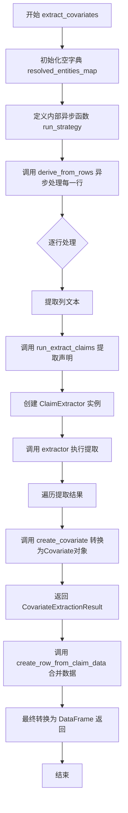
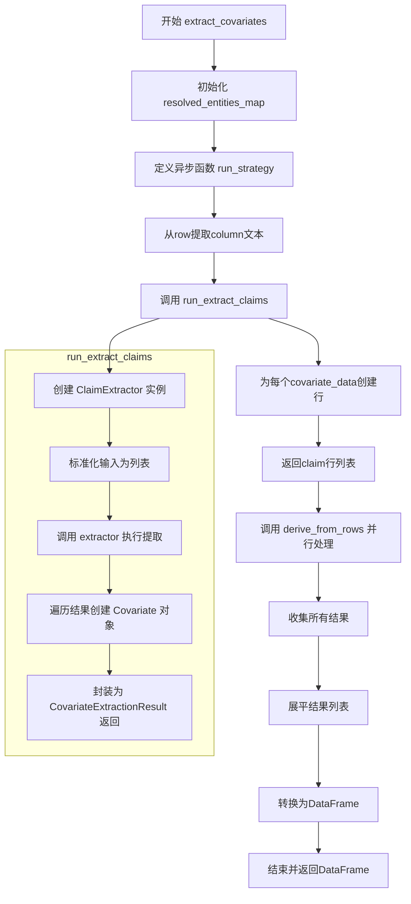
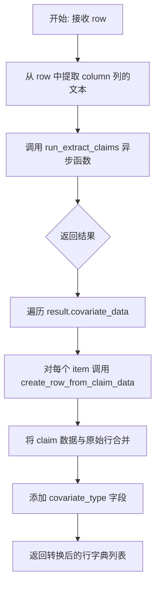
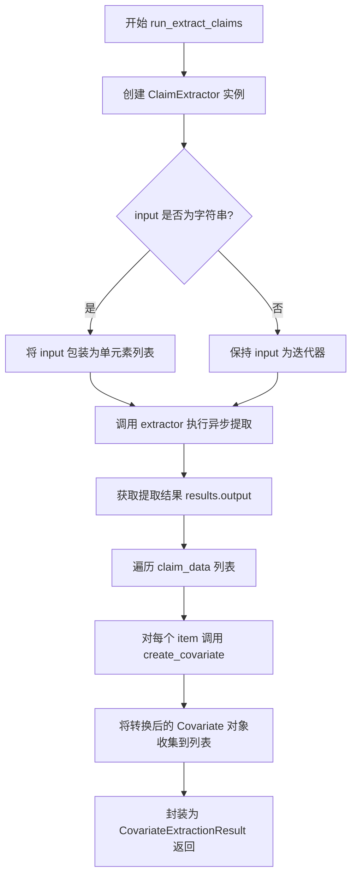
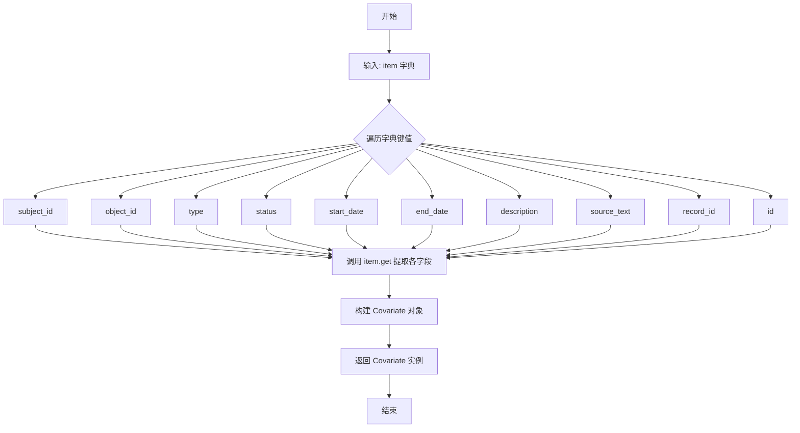

# `graphrag\packages\graphrag\graphrag\index\operations\extract_covariates\extract_covariates.py` 详细设计文档

这是一个从文本数据中提取协变量(covariates/claims)的异步处理模块，通过LLM模型从输入的DataFrame中提取实体相关的声明信息，支持异步处理和多线程并发。

## 整体流程



## 类结构

```
无类定义（纯函数模块）
├── extract_covariates (主入口异步函数)
├── create_row_from_claim_data (工具函数)
├── run_extract_claims (异步提取函数)
└── create_covariate (转换函数)
```

## 全局变量及字段


### `logger`
    
模块级日志记录器，用于记录Claim Extraction Error等错误信息

类型：`logging.Logger`
    


### `extract_covariates函数局部变量.resolved_entities_map`
    
存储已解析实体的映射关系，用于在协变量提取过程中关联实体ID

类型：`dict[str, str]`
    
    

## 全局函数及方法


### `extract_covariates`

该异步函数是图谱知识提取流程中的核心组件，负责从输入的DataFrame文本列中提取特定类型的协变量（如声明、实体关系等）。它通过调用LLM模型对每行文本进行 claim extraction，并利用多线程和异步机制实现高效批处理，最终将提取的结构化协变量数据合并返回为包含原始行数据与提取信息的DataFrame。

参数：

- `input`：`pd.DataFrame`，输入的数据框，包含待提取协变量的文本数据
- `callbacks`：`WorkflowCallbacks`，工作流回调接口，用于进度报告和状态通知
- `model`：`LLMCompletion`，LLMCompletion模型实例，用于执行协变量提取的提示生成
- `column`：`str`，需要从DataFrame中提取文本的列名
- `c covariate_type`：`str`，协变量类型标识符，用于标记提取的协变量种类
- `max_gleanings`：`int`，最大迭代次数，控制LLM在单次提取中的重试/优化次数
- `claim_description`：`str`，对要提取的claim的描述性说明，指导LLM提取特定内容
- `prompt`：`str`，用于指导LLM进行协变量提取的提示模板
- `entity_types`：`list[str]`，实体类型列表，指定需要识别的实体类别
- `num_threads`：`int`，并行处理的线程数，控制并发执行规模
- `async_type`：`AsyncType`，异步执行类型枚举，决定使用同步/异步执行模式

返回值：`pd.DataFrame`，包含原始行数据与提取的协变量信息的结构化数据表，每行对应一个提取的协变量记录

#### 流程图



#### 带注释源码

```python
async def extract_covariates(
    input: pd.DataFrame,              # 输入DataFrame，待处理的文本数据源
    callbacks: WorkflowCallbacks,      # 回调接口，用于报告提取进度
    model: "LLMCompletion",            # LLM模型，用于生成协变量提取的提示
    column: str,                       # 列名，指定从哪一列提取文本内容
    covariate_type: str,               # 协变量类型字符串，标记提取结果的类别
    max_gleanings: int,                # 最大迭代重试次数，优化提取质量
    claim_description: str,            # claim描述，为LLM提供提取指导
    prompt: str,                       # 提取提示模板，定义输出格式要求
    entity_types: list[str],           # 实体类型列表，过滤关注的实体类别
    num_threads: int,                  # 线程池大小，控制并行处理能力
    async_type: AsyncType,             # 异步模式，决定并发执行策略
) -> pd.DataFrame:
    """Extract claims from a piece of text."""
    
    # 初始化实体映射字典，用于存储已解析实体的对应关系
    resolved_entities_map = {}

    # 定义异步行处理策略函数
    async def run_strategy(row):
        # 从当前行提取指定列的文本内容
        text = row[column]
        
        # 调用提取函数获取covariate结果
        result = await run_extract_claims(
            input=text,
            entity_types=entity_types,
            resolved_entities_map=resolved_entities_map,
            model=model,
            max_gleanings=max_gleanings,
            claim_description=claim_description,
            prompt=prompt,
        )
        
        # 将提取的covariate数据转换为DataFrame行格式
        return [
            create_row_from_claim_data(row, item, covariate_type)
            for item in result.covariate_data
        ]

    # 使用derive_from_rows工具并行处理所有行
    # 支持多线程和异步执行模式，并可通过callbacks报告进度
    results = await derive_from_rows(
        input,
        run_strategy,
        callbacks,
        num_threads=num_threads,
        async_type=async_type,
        progress_msg="extract covariates progress: ",
    )
    
    # 展平结果列表并转换为DataFrame返回
    # 过滤掉空列表，确保数据完整性
    return pd.DataFrame([item for row in results for item in row or []])


def create_row_from_claim_data(row, covariate_data: Covariate, covariate_type: str):
    """Create a row from the claim data and the input row."""
    # 合并原始行数据、covariate属性和类型标识
    return {**row, **asdict(covariate_data), "covariate_type": covariate_type}


async def run_extract_claims(
    input: str | Iterable[str],        # 输入文本，单字符串或字符串可迭代对象
    entity_types: list[str],           # 实体类型规格列表
    resolved_entities_map: dict[str, str],  # 已解析实体映射表
    model: "LLMCompletion",            # LLM模型实例
    max_gleanings: int,                # 最大迭代优化次数
    claim_description: str,           # claim提取描述说明
    prompt: str,                       # 提取提示模板
) -> CovariateExtractionResult:
    """Run the Claim extraction chain."""
    
    # 创建claim提取器实例，配置模型和错误处理
    extractor = ClaimExtractor(
        model=model,
        extraction_prompt=prompt,
        max_gleanings=max_gleanings,
        on_error=lambda e, s, d: logger.error(
            "Claim Extraction Error", exc_info=e, extra={"stack": s, "details": d}
        ),
    )

    # 标准化输入：确保输入为列表格式以支持批量处理
    input = [input] if isinstance(input, str) else input

    # 执行提取流程，获取LLM输出结果
    results = await extractor(
        texts=input,
        entity_spec=entity_types,
        resolved_entities=resolved_entities_map,
        claim_description=claim_description,
    )

    # 提取输出数据并转换为Covariate对象列表
    claim_data = results.output
    return CovariateExtractionResult([create_covariate(item) for item in claim_data])


def create_covariate(item: dict[str, Any]) -> Covariate:
    """Create a covariate from the item."""
    # 从字典数据构造Covariate数据类实例
    return Covariate(
        subject_id=item.get("subject_id"),
        object_id=item.get("object_id"),
        type=item.get("type"),
        status=item.get("status"),
        start_date=item.get("start_date"),
        end_date=item.get("end_date"),
        description=item.get("description"),
        source_text=item.get("source_text"),
        record_id=item.get("record_id"),
        id=item.get("id"),
    )
```


### `extract_covariates.run_strategy`

该异步嵌套函数是 `extract_covariates` 的内部策略执行器，负责从 DataFrame 的每一行中提取指定列的文本内容，调用声明提取逻辑并将结果转换为标准化数据行。

参数：

- `row`：`pd.Series`，代表输入 DataFrame 的单行数据，从中提取文本内容进行声明提取

返回值：`list[dict]`，返回从声明数据创建的行字典列表，每个字典包含原始行数据与提取的协变量信息

#### 流程图



#### 带注释源码

```python
async def run_strategy(row):
    """针对单行数据执行协变量提取策略的异步嵌套函数。
    
    该函数作为 derive_from_rows 的映射回调，对输入 DataFrame 的每一行
    执行声明提取操作，并将结果转换为统一的行格式。
    """
    # 从当前行中获取指定列的文本内容作为提取源
    text = row[column]
    
    # 异步调用声明提取函数，传入文本、实体类型映射、模型等参数
    result = await run_extract_claims(
        input=text,                              # 待提取的文本内容
        entity_types=entity_types,               # 目标实体类型列表
        resolved_entities_map=resolved_entities_map,  # 已解析的实体映射
        model=model,                             # LLM 模型实例
        max_gleanings=max_gleannotations,        # 最大迭代次数
        claim_description=claim_description,     # 声明描述
        prompt=prompt,                           # 提取提示词
    )
    
    # 将提取到的声明数据转换为数据行
    # 遍历每个协变量项，与原始行数据合并并标记协变量类型
    return [
        create_row_from_claim_data(row, item, covariate_type)
        for item in result.covariate_data
    ]
```


### `create_row_from_claim_data`

该函数是一个同步工具函数，用于将提取的协变量数据与原始数据行合并，创建一个新的字典记录。它通过解包原始行数据和将协变量数据转换为字典后合并，同时添加协变量类型标识，便于后续数据处理和追踪。

参数：

- `row`：任意类型，表示原始数据行（通常为字典类型，来源于 DataFrame 的一行数据）
- `covariate_data`：`Covariate`，从文本中提取的协变量数据对象，包含主题ID、对象ID、类型、状态、日期范围、描述、源文本等信息
- `covariate_type`：`str`，协变量的类型标识字符串，用于区分不同类型的协变量记录

返回值：`dict`，返回合并后的字典，包含原始行的所有字段、协变量数据的所有字段以及新增的 `covariate_type` 字段

#### 流程图

```mermaid
flowchart TD
    A[开始] --> B[接收 row, covariate_data, covariate_type 参数]
    B --> C[使用 asdict 将 covariate_data 转换为字典]
    C --> D[使用字典解包 {**row, **asdict(covariate_data)} 合并原始行和协变量数据]
    D --> E[添加 covariate_type 键值对]
    E --> F[返回合并后的字典]
```

#### 带注释源码

```python
def create_row_from_claim_data(row, covariate_data: Covariate, covariate_type: str):
    """Create a row from the claim data and the input row.
    
    该函数是一个同步工具函数，用于将提取的协变量数据与原始数据行合并。
    它接收三个参数：原始数据行、协变量数据对象和协变量类型，然后返回一个
    包含所有信息的合并字典。
    
    参数:
        row: 原始数据行，通常是来自 DataFrame 的字典类型记录
        covariate_data: Covariate 类型，包含从文本中提取的协变量信息
        covariate_type: str 类型，表示协变量的类型标识
    
    返回:
        dict: 合并后的字典，包含原始行数据、协变量数据及类型标识
    """
    # 使用 asdict 将 Covariate 数据类实例转换为字典
    # 然后使用字典解包语法将原始行与协变量数据合并
    # 最后添加 covariate_type 字段以标识协变量类型
    return {**row, **asdict(covariate_data), "covariate_type": covariate_type}
```


### `run_extract_claims`

这是一个异步链函数，用于从文本中提取声明（claims）。它接收文本、实体类型、已解析实体映射等参数，通过 ClaimExtractor 执行 LLM 提取，然后将原始结果转换为标准化的协变量格式，最终封装到 CovariateExtractionResult 中返回。

参数：

- `input`：`str | Iterable[str]`，待提取的文本输入，可以是单个字符串或字符串列表
- `entity_types`：`list[str]`，需要提取的实体类型列表
- `resolved_entities_map`：`dict[str, str]`，已解析实体的映射字典，用于关联实体
- `model`：`LLMCompletion`，用于执行声明提取的 LLM 模型实例
- `max_gleanings`：`int`，最大提取轮次（gleaning 次数）
- `claim_description`：`str`，关于需要提取什么声明的描述
- `prompt`：`str`，用于指导 LLM 提取声明的提示词模板

返回值：`CovariateExtractionResult`，包含提取到的协变量列表的结果对象

#### 流程图



#### 带注释源码

```python
async def run_extract_claims(
    input: str | Iterable[str],
    entity_types: list[str],
    resolved_entities_map: dict[str, str],
    model: "LLMCompletion",
    max_gleanings: int,
    claim_description: str,
    prompt: str,
) -> CovariateExtractionResult:
    """Run the Claim extraction chain."""
    # 创建 ClaimExtractor 实例，配置模型、提示词、最大提取次数和错误处理
    extractor = ClaimExtractor(
        model=model,
        extraction_prompt=prompt,
        max_gleanings=max_gleanings,
        on_error=lambda e, s, d: logger.error(
            "Claim Extraction Error", exc_info=e, extra={"stack": s, "details": d}
        ),
    )

    # 如果输入是单个字符串，则转换为单元素列表；否则保持为迭代器
    input = [input] if isinstance(input, str) else input

    # 调用 extractor 的异步 __call__ 方法执行实际提取
    # 传入文本、实体规格、已解析实体映射和声明描述
    results = await extractor(
        texts=input,
        entity_spec=entity_types,
        resolved_entities=resolved_entities_map,
        claim_description=claim_description,
    )

    # 从结果中获取提取到的声明数据
    claim_data = results.output
    
    # 将每个声明项转换为 Covariate 对象，并封装到 CovariateExtractionResult 中返回
    return CovariateExtractionResult([create_covariate(item) for item in claim_data])
```


### `create_covariate`

将包含协变量数据的字典转换为 `Covariate` 数据类对象，用于在文本提取协变量流程中将 LLM 输出的原始字典数据标准化为结构化的协变量实体。

参数：

- `item`：`dict[str, Any]`，包含协变量原始数据的字典，可能包含 subject_id、object_id、type、status、start_date、end_date、description、source_text、record_id、id 等字段

返回值：`Covariate`，从字典数据创建的结构化协变量对象

#### 流程图



#### 带注释源码

```python
def create_covariate(item: dict[str, Any]) -> Covariate:
    """Create a covariate from the item.
    
    将包含协变量数据的字典转换为 Covariate 数据类对象。
    该函数是协变量提取流程中的数据转换层，将 LLM 输出的
    原始字典结构转换为标准化的数据结构。
    
    Args:
        item: 包含协变量字段的字典，从 LLM 提取结果中获取，
              可能包含的键：subject_id, object_id, type, status,
              start_date, end_date, description, source_text,
              record_id, id
    
    Returns:
        Covariate: 结构化的协变量对象，包含所有提取的字段信息
    """
    return Covariate(
        # 主体实体ID，标识协变量关联的主要实体
        subject_id=item.get("subject_id"),
        # 客体实体ID，标识协变量关联的次要实体（如有）
        object_id=item.get("object_id"),
        # 协变量类型，如 "relationship", "fact" 等
        type=item.get("type"),
        # 协变量状态，如 "active", "confirmed" 等
        status=item.get("status"),
        # 协变量生效起始日期
        start_date=item.get("start_date"),
        # 协变量生效结束日期
        end_date=item.get("end_date"),
        # 协变量的描述文本
        description=item.get("description"),
        # 来源文本，标识该协变量从哪段文本中提取
        source_text=item.get("source_text"),
        # 记录ID，关联到原始输入记录
        record_id=item.get("record_id"),
        # 协变量的唯一标识符
        id=item.get("id"),
    )
```

## 关键组件


### extract_covariates

主入口函数，负责从输入的DataFrame中提取协变量（claims）。通过derive_from_rows实现异步并发处理每一行文本，调用run_extract_claims执行实际的声明提取逻辑，最终返回包含提取结果的DataFrame。

### run_strategy

内部异步函数，作为derive_from_rows的策略函数使用。接收DataFrame的一行，提取指定列的文本内容，调用run_extract_claims进行声明提取，并将结果转换为符合要求的数据行格式。

### create_row_from_claim_data

数据转换函数，将原始DataFrame行与提取的协变量数据合并。通过字典展开操作符合并两者的所有字段，并添加covariate_type字段标识协变量类型。

### run_extract_claims

声明提取的执行函数，负责初始化ClaimExtractor并调用其进行实际的LLM提取操作。接收字符串或字符串迭代器作为输入，将结果转换为CovariateExtractionResult对象返回。

### create_covariate

数据映射函数，将字典格式的提取结果转换为Covariate数据类对象。提取字典中的subject_id、object_id、type、status、start_date、end_date、description、source_text、record_id和id等字段。

### ClaimExtractor

外部依赖的声明提取器类，由graphrag_llm包提供。封装了LLM调用逻辑、提取提示词、最大gleanings数量配置以及错误处理回调。

### derive_from_rows

外部依赖的工具函数，负责管理异步/多线程的行处理流程。接收输入数据、处理策略、回调函数、线程数和异步类型等参数，实现进度报告和并发控制。

### CovariateExtractionResult

外部类型定义，表示协变量提取结果的数据结构，包含提取到的covariate_data列表。

### resolved_entities_map

全局字典变量，用于存储已解析实体的映射关系，在run_strategy闭包中引用并在提取过程中共享。


## 问题及建议


### 已知问题

-   **竞态条件风险**：`resolved_entities_map` 作为闭包变量在异步任务间共享，但没有任何同步机制，可能导致数据不一致
-   **错误处理不完整**：`run_extract_claims` 中的错误回调仅记录日志，失败时返回空结果的逻辑不清晰，可能导致静默失败
-   **资源管理低效**：每次调用 `run_extract_claims` 都创建新的 `ClaimExtractor` 实例，未复用造成资源浪费
-   **未使用的变量**：`resolved_entities_map` 始终为空字典传入后从未被填充，设计的 resolved entities 功能未实现
-   **输入验证缺失**：未验证 `column` 是否存在于 DataFrame、`entity_types` 是否为空列表等关键输入
-   **类型提示不完整**：`create_row_from_claim_data` 函数的 `row` 参数缺少具体类型标注（应为 pd.Series 或 dict）
-   **魔法字符串**："extract covariates progress: " 等字符串硬编码在函数内，应提取为常量
-   **None 值处理风险**：`create_covariate` 中使用 `.get()` 但未提供默认值，可能产生 None 值字段导致后续处理异常

### 优化建议

-   为 `resolved_entities_map` 添加线程安全的锁机制，或重构为每个异步任务独立的上下文
-   在 `run_extract_claims` 失败时返回明确的错误结果而非仅记录日志，或抛出异常让调用方处理
-   将 `ClaimExtractor` 实例化移至 `extract_covariates` 函数外层复用，或考虑使用依赖注入模式
-   添加输入验证：检查 DataFrame 包含指定 column、entity_types 非空、num_threads 合理等
-   完善类型注解：为 `row` 参数添加 `pd.Series` 类型，为异步函数添加返回类型注解
-   提取字符串常量：将进度消息、错误日志格式等定义为模块级常量
-   为 `create_covariate` 的 `.get()` 调用添加合理的默认值（如空字符串）
-   添加重试机制：对于 LLM 调用失败可配置重试次数，提高健壮性
-   考虑添加成功日志，便于调试和监控提取流程

## 其它


### 设计目标与约束

本模块的设计目标是实现从文本数据中高效、准确地提取结构化协变量（covariates/claims）信息，支持异步并行处理以提升性能。约束条件包括：输入数据必须为pandas DataFrame格式；依赖LLM模型进行语义理解和提取；需要预先配置实体类型列表；受限于LLM调用频率和token限制。

### 错误处理与异常设计

错误处理采用日志记录方式，使用lambda表达式`lambda e, s, d: logger.error("Claim Extraction Error", exc_info=e, extra={"stack": s, "details": d})`捕获ClaimExtractor的异常。潜在风险包括：LLM调用超时或失败、输入文本格式不符合预期、entity_types配置不完整、resolved_entities_map为空或格式错误、max_gleanings参数设置不当导致提取不完整。

### 数据流与状态机

数据流：Input DataFrame → derive_from_rows并行分发 → run_strategy处理单行 → run_extract_claims调用LLM → ClaimExtractor提取 → create_covariate转换结果 → create_row_from_claim_data合并原始行 → 聚合结果返回DataFrame。状态机涉及：输入验证状态、LLM调用状态、结果解析状态、异常处理状态。

### 外部依赖与接口契约

核心依赖包括：graphrag.callbacks.workflow_callbacks.WorkflowCallbacks（工作流回调）、graphrag.config.enums.AsyncType（异步类型枚举）、graphrag.index.operations.extract_covariates.claim_extractor.ClaimExtractor（声明提取器）、graphrag.index.operations.extract_covariates.typing模块（类型定义）、graphrag_llm.completion.LLMCompletion（LLM接口）、pandas数据处理、derive_from_rows并行处理工具。

### 配置参数说明

关键配置参数：column（提取文本的列名）、covariate_type（协变量类型标识）、max_gleanings（最大重试提取次数）、claim_description（声明描述）、prompt（提取提示词）、entity_types（实体类型列表）、num_threads（线程数）、async_type（异步类型：AsyncType.Async或Sync）。

### 性能考量与优化空间

当前通过derive_from_rows实现并行处理，但每次LLM调用可能产生较大延迟。优化方向：考虑批量处理减少LLM调用次数；实现结果缓存机制避免重复提取；添加超时控制防止单行处理阻塞整体流程；考虑使用流式处理应对大规模数据集。

### 安全性与边界条件

边界条件处理：input为字符串时转换为单元素列表；result.covariate_data可能为空列表；row或item可能为None。安全考量：LLM输出需验证格式；避免prompt注入风险；敏感数据脱敏处理。

### 测试策略建议

应包含单元测试：create_covariate函数格式转换测试、create_row_from_claim_data数据合并测试、异常场景处理测试。集成测试：完整提取流程测试、不同async_type配置测试、大规模数据性能测试。


    